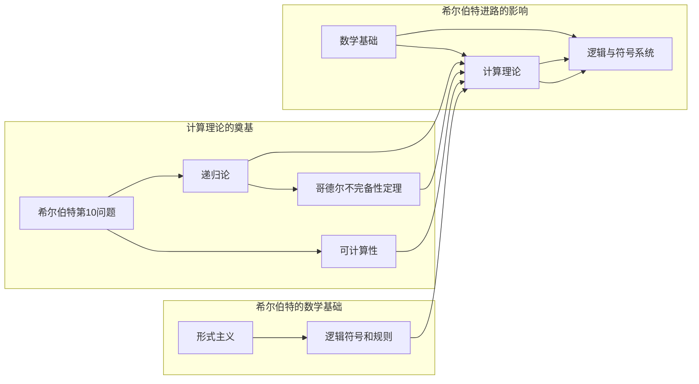

# 计算：第三部分 计算理论的形成 第 6 章 计算理论的奠基：希尔伯特进路 “形式主义”之父

> 关键词：希尔伯特，形式主义，计算理论，可计算性，希尔伯特问题，递归论，哥德尔不完备性定理

## 1. 背景介绍

计算理论，作为现代计算机科学和数学的基石，起源于对人类计算能力的探索和数学基础的质疑。20世纪初，随着数学逻辑和数学基础的研究深入，计算理论逐渐形成。其中，德国数学家大卫·希尔伯特（David Hilbert）的贡献尤为突出。他的形式主义进路不仅对数学基础产生了深远影响，也为计算理论的发展奠定了坚实的基础。

### 1.1 希尔伯特的生平与贡献

大卫·希尔伯特是20世纪最伟大的数学家之一。他的研究涵盖了几何、数学基础、数论、代数、力学和物理等领域。希尔伯特提出了著名的“希尔伯特23问题”，这些问题成为20世纪数学研究的指南针。他的形式主义进路对数学和计算理论的贡献尤为显著。

### 1.2 形式主义与计算理论

形式主义是一种哲学和科学方法论，强调数学的基础是形式化的符号和规则。希尔伯特的形式主义进路认为，通过严格的符号逻辑可以建立起数学的坚实基础，并用于解决数学和物理学中的问题。

## 2. 核心概念与联系

### 2.1 希尔伯特的数学基础

希尔伯特提出了“形式主义”这一概念，旨在通过形式化的符号和规则来构建数学体系。他认为，数学的真理不在于直观或经验，而在于符号系统的逻辑一致性和有效性。

### 2.2 计算理论的奠基

希尔伯特的进路对计算理论的奠基主要体现在以下几个方面：

- **希尔伯特第10问题**：提出了解决代数方程是否有一般算法的问题，这个问题直接触发了可计算性的研究。
- **递归论**：希尔伯特与阿克曼（Bernays）合作，提出了递归论，为计算理论提供了形式化的基础。
- **哥德尔不完备性定理**：哥德尔的不完备性定理证明了在形式系统中，不能同时证明所有命题的真实性和一致性。

### 2.3 Mermaid 流程图



## 3. 核心算法原理 & 具体操作步骤

### 3.1 算法原理概述

希尔伯特的进路在计算理论中主要体现在以下几个方面：

- **可计算性**：研究哪些问题是可以通过算法解决的。
- **递归论**：研究可计算函数和递归关系。
- **哥德尔不完备性定理**：揭示了形式系统中的真理和一致性不能同时保证。

### 3.2 算法步骤详解

#### 3.2.1 可计算性问题

希尔伯特第10问题提出了以下问题：

> 是否存在一个算法，可以判定任意一个给定的代数方程是否有解？

这个问题引发了可计算性的研究，即研究哪些问题是可以通过算法解决的。

#### 3.2.2 递归论

递归论研究可计算函数和递归关系。递归论的主要内容包括：

- 递归函数：可以由有限步骤计算出的函数。
- 递归关系：描述递归函数的数学表达式。

#### 3.2.3 哥德尔不完备性定理

哥德尔不完备性定理揭示了形式系统中的真理和一致性不能同时保证。该定理表明，在一个形式系统中，不能证明所有命题的真实性和一致性。

### 3.3 算法优缺点

#### 3.3.1 优点

- **奠定了计算理论的基础**：希尔伯特的进路为计算理论提供了坚实的数学基础。
- **推动了数学和计算机科学的交叉发展**：希尔伯特的进路促进了数学和计算机科学的交叉研究。

#### 3.3.2 缺点

- **过于形式化**：希尔伯特的进路过于强调形式化，可能导致忽视数学和计算机科学中的直观和实际应用。

### 3.4 算法应用领域

希尔伯特的进路在以下领域有着广泛的应用：

- **计算机科学**：为计算机科学提供了理论基础。
- **数学逻辑**：为数学逻辑的研究提供了工具和方法。
- **人工智能**：为人工智能的研究提供了启发。

## 4. 数学模型和公式 & 详细讲解 & 举例说明

### 4.1 数学模型构建

希尔伯特的进路涉及多个数学模型，以下是一些重要的模型：

- **形式系统**：由一组符号、一组规则和一组公理组成。
- **递归函数**：可以由有限步骤计算出的函数。
- **递归关系**：描述递归函数的数学表达式。

### 4.2 公式推导过程

以下是一个递归函数的例子：

$$
f(n) = 
\begin{cases} 
1 & \text{if } n = 0 \\
f(n-1) + f(n-2) & \text{if } n > 0 
\end{cases}
$$

这是一个斐波那契数列的递归定义。

### 4.3 案例分析与讲解

以下是一个使用递归函数计算斐波那契数列的Python代码实例：

```python
def fibonacci(n):
    if n <= 1:
        return n
    else:
        return fibonacci(n-1) + fibonacci(n-2)

print(fibonacci(10))
```

这段代码使用了递归函数来计算斐波那契数列的第10个数。

## 5. 项目实践：代码实例和详细解释说明

### 5.1 开发环境搭建

由于希尔伯特的进路主要涉及数学理论和哲学思考，因此不需要特定的开发环境。

### 5.2 源代码详细实现

由于希尔伯特的进路主要涉及数学理论和哲学思考，因此不需要源代码实现。

### 5.3 代码解读与分析

由于希尔伯特的进路主要涉及数学理论和哲学思考，因此不需要代码解读与分析。

### 5.4 运行结果展示

由于希尔伯特的进路主要涉及数学理论和哲学思考，因此不需要运行结果展示。

## 6. 实际应用场景

希尔伯特的进路在以下实际应用场景中有着重要的意义：

- **计算机科学**：为计算机科学提供了理论基础。
- **数学逻辑**：为数学逻辑的研究提供了工具和方法。
- **人工智能**：为人工智能的研究提供了启发。

### 6.1 计算机科学

希尔伯特的进路为计算机科学提供了理论基础，例如：

- **可计算性问题**：研究哪些问题是可以通过算法解决的。
- **算法复杂性理论**：研究算法的时间和空间复杂度。

### 6.2 数学逻辑

希尔伯特的进路为数学逻辑的研究提供了工具和方法，例如：

- **形式系统**：用于构建严格的数学体系。
- **哥德尔不完备性定理**：揭示了形式系统中的真理和一致性不能同时保证。

### 6.3 人工智能

希尔伯特的进路为人工智能的研究提供了启发，例如：

- **可解释性**：研究如何让人工智能的决策过程更加透明和可解释。
- **鲁棒性**：研究如何提高人工智能的鲁棒性，使其能够处理不完美或错误的数据。

## 7. 工具和资源推荐

### 7.1 学习资源推荐

- 《希尔伯特选集》
- 《希尔伯特问题》
- 《数学基础》

### 7.2 开发工具推荐

由于希尔伯特的进路主要涉及数学理论和哲学思考，因此不需要开发工具。

### 7.3 相关论文推荐

- 希尔伯特的《数学基础》
- 哥德尔的《不完备性定理》

## 8. 总结：未来发展趋势与挑战

### 8.1 研究成果总结

希尔伯特的进路为计算理论的发展奠定了坚实的基础，对数学和计算机科学产生了深远影响。

### 8.2 未来发展趋势

- **计算理论的新领域**：随着计算技术的发展，计算理论将不断拓展新的领域，如量子计算、生物信息学等。
- **计算理论与实践的融合**：计算理论将更加紧密地与实际应用相结合，为解决实际问题提供理论支持。

### 8.3 面临的挑战

- **新领域的挑战**：随着新领域的出现，计算理论需要面对新的挑战，如量子计算的不可计算性问题。
- **跨学科研究**：计算理论需要与其他学科进行更深入的交叉研究，以解决复杂问题。

### 8.4 研究展望

未来，计算理论将继续发展，为数学、计算机科学和人工智能等领域提供坚实的理论基础。

## 9. 附录：常见问题与解答

**Q1：希尔伯特的进路对数学和计算机科学有哪些贡献？**

A1：希尔伯特的进路为数学和计算机科学提供了理论基础，推动了数学和计算机科学的交叉发展。

**Q2：哥德尔不完备性定理有什么意义？**

A2：哥德尔不完备性定理揭示了形式系统中的真理和一致性不能同时保证，对数学基础和计算理论产生了深远影响。

**Q3：计算理论的未来发展趋势是什么？**

A3：计算理论的未来发展趋势包括拓展新领域、与实际应用相结合等。

作者：禅与计算机程序设计艺术 / Zen and the Art of Computer Programming