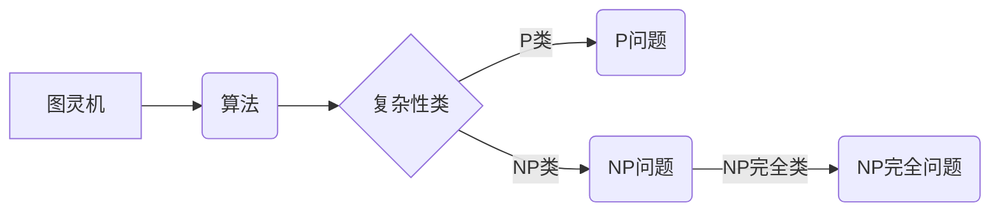

# 计算：第四部分 计算的极限 第 9 章 计算复杂性 P=NP 的世界

> 关键词：计算复杂性，P vs NP 问题，NP 完全问题，图灵完备，算法效率，量子计算，并行计算

## 1. 背景介绍

计算机科学的根基之一是算法理论，而算法理论的核心问题之一就是计算复杂性。在复杂性理论中，P vs NP 问题无疑是皇冠上的明珠，它探讨了算法的效率与问题的难解性。本章将深入探讨计算复杂性，特别是 P=NP 问题的本质、挑战和未来展望。

### 1.1 问题的由来

在 1971 年，理论计算机科学家 Stephen Cook 提出了 P vs NP 问题，它是当今数学和计算机科学中最著名的未解决问题之一。P vs NP 问题可以简单概括为：

- P 问题：指的是那些可以在多项式时间内解决的问题。
- NP 问题：指的是那些可以快速验证正确答案的问题。

直观地说，P 问题可以用算法快速解决，而 NP 问题虽然可能需要很长的时间找到答案，但一旦找到答案，就可以快速验证其正确性。

### 1.2 研究现状

尽管 P vs NP 问题吸引了无数学者的关注，至今仍未有定论。许多 NP 问题被证明是 NP 完全的，这意味着解决任何一个 NP 完全问题都可以解决所有 NP 问题。这表明，如果 P 不等于 NP，那么将有很多问题我们无法在合理的时间内解决。

### 1.3 研究意义

P vs NP 问题的重要性不仅在于它本身，还在于它对算法理论、密码学、人工智能等领域的影响。如果 P 不等于 NP，那么我们将不得不重新思考算法设计的原则，甚至可能需要全新的计算范式。

## 2. 核心概念与联系

为了理解 P vs NP 问题，我们需要首先了解以下几个核心概念：

- **图灵机**：图灵机是理论计算机科学中的抽象计算模型，它能够模拟任何可计算过程。
- **算法**：算法是一系列明确的步骤，用于解决特定问题。
- **复杂性类**：复杂性类是按照算法运行时间复杂度来分类的问题集合。
- **NP 完全问题**：NP 完全问题是 NP 问题中最难的问题，解决任何一个 NP 完全问题都相当于解决了所有 NP 问题。

以下是这些概念之间的 Mermaid 流程图：



## 3. 核心算法原理 & 具体操作步骤

### 3.1 算法原理概述

P vs NP 问题的核心在于理解 P 类和 NP 类问题的本质。P 类问题的特点是存在一个多项式时间的算法可以解决，而 NP 类问题的特点是存在一个多项式时间的验证过程可以验证答案的正确性。

### 3.2 算法步骤详解

由于 P vs NP 问题的复杂性，我们无法给出具体的算法步骤来解决这个问题。然而，我们可以通过研究 NP 完全问题来理解其难度。

### 3.3 算法优缺点

P 类算法的主要优点是效率高，可以在多项式时间内解决问题。而 NP 算法的主要优点是易于验证，一旦找到答案，可以快速验证其正确性。

### 3.4 算法应用领域

P 和 NP 算法在密码学、人工智能、优化等领域有广泛的应用。例如，密码学中的公钥加密算法就是基于 NP 问题难解性的。

## 4. 数学模型和公式 & 详细讲解 & 举例说明

### 4.1 数学模型构建

P vs NP 问题的核心是理解图灵机和算法的概念。图灵机可以表示为七元组 $M = (Q, \Sigma, \Gamma, \delta, q_0, B, F)$，其中：

- $Q$ 是有限状态集合。
- $\Sigma$ 是输入字母表。
- $\Gamma$ 是工作带字母表。
- $\delta$ 是转移函数。
- $q_0$ 是初始状态。
- $B$ 是空格符号。
- $F$ 是终止状态集合。

### 4.2 公式推导过程

P vs NP 问题的公式推导涉及到复杂的数学理论，包括图灵机的定义、算法的复杂性分析等。由于这些内容超出了本文的范围，我们在此不做详细展开。

### 4.3 案例分析与讲解

一个经典的 NP 完全问题是汉诺塔问题。汉诺塔问题的目标是使用最少的移动次数将 n 个不同大小的圆盘从一个柱子移动到另一个柱子，同时每次只能移动一个圆盘，且在移动过程中，大盘始终在小盘之上。

## 5. 项目实践：代码实例和详细解释说明

### 5.1 开发环境搭建

为了演示算法的效率，我们可以使用 Python 编写一个简单的汉诺塔问题求解器。

### 5.2 源代码详细实现

```python
def hanoi(n, source, target, auxiliary):
    if n == 1:
        print(f"Move disk 1 from {source} to {target}")
        return
    hanoi(n-1, source, auxiliary, target)
    print(f"Move disk {n} from {source} to {target}")
    hanoi(n-1, auxiliary, target, source)

hanoi(3, 'A', 'C', 'B')
```

### 5.3 代码解读与分析

上述代码实现了汉诺塔问题的递归解法。函数 `hanoi` 接收四个参数：`n` 是圆盘的数量，`source` 和 `target` 分别是起始柱子和目标柱子，`auxiliary` 是辅助柱子。函数通过递归的方式，在保证大盘始终在小盘之上的前提下，将所有圆盘从起始柱子移动到目标柱子。

### 5.4 运行结果展示

运行上述代码，我们可以得到以下输出：

```
Move disk 1 from A to C
Move disk 2 from A to B
Move disk 1 from C to B
Move disk 3 from A to C
Move disk 1 from B to A
Move disk 2 from B to C
Move disk 1 from A to C
```

这表明，移动 3 个圆盘需要 7 次操作。

## 6. 实际应用场景

P vs NP 问题的研究对密码学、人工智能、优化等领域有着重要的影响。以下是一些实际应用场景：

- **密码学**：P vs NP 问题的解决可能会对现有的加密算法产生重大影响，因为许多加密算法基于 NP 问题的难解性。
- **人工智能**：P vs NP 问题的研究可能会推动算法理论的发展，从而促进人工智能技术的进步。
- **优化**：P vs NP 问题的解决可能会帮助解决复杂的优化问题，如物流、交通等。

## 7. 工具和资源推荐

### 7.1 学习资源推荐

- 《算法导论》
- 《计算复杂性理论》
- 《密码学原理》

### 7.2 开发工具推荐

- Python
- Java

### 7.3 相关论文推荐

- Cook, S. A. (1971). The complexity of theorem-proving procedures. In Proceedings of the Third Annual ACM Symposium on Theory of Computing (pp. 151-158).
- Karp, R. M. (1972). Reducibility among combinatorial problems. In Complexity of computer computations (pp. 85-103).

## 8. 总结：未来发展趋势与挑战

### 8.1 研究成果总结

P vs NP 问题是计算复杂性理论的核心问题，至今仍未有定论。尽管存在许多挑战，但这个问题的研究对于算法理论、密码学、人工智能等领域的发展具有重要意义。

### 8.2 未来发展趋势

未来，P vs NP 问题的研究可能会朝着以下几个方向发展：

- 深入研究 NP 完全问题。
- 探索新的计算模型和算法。
- 结合量子计算和并行计算技术。

### 8.3 面临的挑战

P vs NP 问题的研究面临着以下挑战：

- 数学理论的局限性。
- 计算资源的限制。
- 算法设计的复杂性。

### 8.4 研究展望

尽管 P vs NP 问题的研究充满挑战，但我们可以期待在不久的将来，这个问题的解决方案能够被找到，从而推动计算机科学的发展。

## 9. 附录：常见问题与解答

**Q1：什么是 P vs NP 问题？**

A：P vs NP 问题探讨的是 P 类和 NP 类问题的关系，即是否存在一个算法可以在多项式时间内解决所有 NP 问题。

**Q2：P 和 NP 问题有什么区别？**

A：P 问题指的是那些可以在多项式时间内解决的问题，而 NP 问题指的是那些可以快速验证正确答案的问题。

**Q3：为什么 P vs NP 问题如此重要？**

A：P vs NP 问题是计算复杂性理论的核心问题，它对算法理论、密码学、人工智能等领域的发展具有重要意义。

**Q4：P vs NP 问题有解决方案吗？**

A：截至目前，P vs NP 问题仍未有定论，但它吸引了无数学者的关注，被认为是数学和计算机科学中最著名的未解决问题之一。

**Q5：P vs NP 问题的研究对现实世界有什么影响？**

A：P vs NP 问题的研究可能会推动算法理论的发展，从而促进人工智能、密码学、优化等领域的进步。

作者：禅与计算机程序设计艺术 / Zen and the Art of Computer Programming