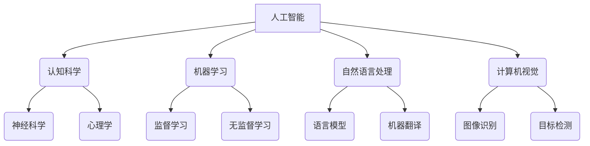

# 达特茅斯会议的科学家团队

> 关键词：达特茅斯会议，人工智能，图灵测试，约翰·麦卡锡，艾伦·图灵，认知科学，程序设计

## 1. 背景介绍

### 1.1 会议的起源

1956年，一群杰出的科学家和思想家在达特茅斯学院举行了一次历史性的会议，这场会议被称为“达特茅斯会议”。这次会议被视为人工智能（Artificial Intelligence, AI）领域的诞生日，它标志着人工智能作为一个独立学科的开始。

### 1.2 会议参与者

达特茅斯会议的参与者包括了一些历史上最著名的人工智能先驱，如约翰·麦卡锡（John McCarthy）、艾伦·图灵（Alan Turing）、克里福德·肖克利（Clifford Shull）、赫伯特·亚历山大（Herbert Alexander）等。

### 1.3 会议目标

会议的目标是讨论如何通过模拟人类智能行为来实现人工智能。会议的参与者们讨论了当时最前沿的计算机科学和认知科学问题，并提出了许多开创性的概念。

## 2. 核心概念与联系

### 2.1 核心概念原理

达特茅斯会议的核心概念围绕着“人工智能”本身，以及如何通过算法和程序来模拟人类智能。以下是一个Mermaid流程图，展示了这些核心概念之间的联系：



### 2.2 会议的架构

达特茅斯会议的架构可以简化为一个由人工智能为中心的网络，连接着认知科学、机器学习、自然语言处理、计算机视觉等众多学科。这个网络的核心是图灵提出的图灵测试，它成为评估机器是否具有智能的基准。

## 3. 核心算法原理 & 具体操作步骤

### 3.1 算法原理概述

达特茅斯会议提出的核心算法原理是模拟人类智能行为，这包括：

- **图灵测试**：一个机器是否具有智能的判断标准，即机器能否在人类不知情的情况下与人类进行有效对话。
- **算法**：包括搜索算法、决策树、神经网络等，这些算法旨在模拟人类的推理和决策过程。

### 3.2 算法步骤详解

#### 3.2.1 图灵测试

图灵测试的步骤如下：

1. 机器与人类对话者进行交流。
2. 一个人类裁判在不告知对话者的情况下，尝试区分哪一个是机器，哪一个是人类。
3. 如果裁判无法准确区分，那么机器就被认为通过了图灵测试，具有人类水平的智能。

#### 3.2.2 算法实现

算法的实现通常涉及以下步骤：

1. 数据收集：收集用于训练的数据，如文本、图像、声音等。
2. 特征提取：从数据中提取有用的特征。
3. 模型选择：选择合适的算法模型，如神经网络、决策树等。
4. 模型训练：使用训练数据训练模型。
5. 模型评估：使用测试数据评估模型性能。

### 3.3 算法优缺点

#### 3.3.1 优点

- **通用性**：算法模型可以应用于各种不同的任务。
- **准确性**：通过大量数据训练，模型可以达到很高的准确性。

#### 3.3.2 缺点

- **数据依赖**：模型的性能很大程度上取决于训练数据的质量和数量。
- **可解释性**：一些复杂的模型，如深度神经网络，其决策过程很难解释。

### 3.4 算法应用领域

达特茅斯会议提出的算法原理和应用领域包括：

- **自然语言处理**：如图灵测试、语言模型、机器翻译。
- **计算机视觉**：如图像识别、目标检测。
- **语音识别**：如图灵测试、语音生成。
- **游戏AI**：如图灵测试、策略游戏。

## 4. 数学模型和公式 & 详细讲解 & 举例说明

### 4.1 数学模型构建

达特茅斯会议的数学模型主要包括概率论、统计学、线性代数等。

#### 4.1.1 概率论

概率论是机器学习的基础，它用于描述数据的不确定性。以下是一个概率论的公式示例：

$$
P(A|B) = \frac{P(B|A)P(A)}{P(B)}
$$

其中，$P(A|B)$ 表示在事件B发生的条件下，事件A发生的概率。

#### 4.1.2 统计学

统计学用于描述数据的分布和特征。以下是一个统计学公式示例：

$$
\mu = \frac{1}{N}\sum_{i=1}^{N}x_i
$$

其中，$\mu$ 表示样本的平均值。

### 4.2 公式推导过程

以下是一个简单的神经网络激活函数的推导过程：

$$
f(x) = \sigma(Wx + b)
$$

其中，$\sigma$ 是Sigmoid函数，$W$ 是权重，$x$ 是输入，$b$ 是偏置。

### 4.3 案例分析与讲解

以下是一个简单的案例：使用神经网络进行手写数字识别。

1. 数据收集：收集大量的手写数字图像和对应的标签。
2. 特征提取：将图像转换为像素值。
3. 模型选择：选择一个合适的神经网络模型。
4. 模型训练：使用训练数据训练模型。
5. 模型评估：使用测试数据评估模型性能。

## 5. 项目实践：代码实例和详细解释说明

### 5.1 开发环境搭建

以下是使用Python进行神经网络训练的代码环境搭建：

```bash
pip install numpy matplotlib tensorflow
```

### 5.2 源代码详细实现

以下是一个简单的神经网络训练的代码实现：

```python
import tensorflow as tf

# 创建模型
model = tf.keras.Sequential([
    tf.keras.layers.Flatten(input_shape=(28, 28)),
    tf.keras.layers.Dense(128, activation='relu'),
    tf.keras.layers.Dense(10, activation='softmax')
])

# 编译模型
model.compile(optimizer='adam',
              loss='sparse_categorical_crossentropy',
              metrics=['accuracy'])

# 训练模型
model.fit(x_train, y_train, epochs=5)

# 评估模型
test_loss, test_acc = model.evaluate(x_test, y_test, verbose=2)

# 输出结果
print(f'\
Test accuracy: {test_acc}')
```

### 5.3 代码解读与分析

以上代码展示了如何使用TensorFlow框架构建、编译和训练一个简单的神经网络模型。代码首先导入TensorFlow库，然后创建一个Sequential模型，包含一个Flatten层、一个Dense层和一个Sigmoid激活函数。接着，编译模型并使用训练数据训练，最后评估模型性能。

### 5.4 运行结果展示

运行以上代码后，会在测试集上评估模型性能，并打印出测试准确率。

## 6. 实际应用场景

### 6.1 自然语言处理

自然语言处理是人工智能领域的一个重要分支，包括文本分类、情感分析、机器翻译等。

### 6.2 计算机视觉

计算机视觉是人工智能领域的另一个重要分支，包括图像识别、目标检测、人脸识别等。

### 6.3 语音识别

语音识别是人工智能领域的一个重要应用，可以将语音转换为文本。

## 7. 工具和资源推荐

### 7.1 学习资源推荐

- 《深度学习》（Goodfellow et al.）
- 《模式识别与机器学习》（Bishop）
- 《机器学习》（Tom Mitchell）

### 7.2 开发工具推荐

- TensorFlow
- PyTorch
- Keras

### 7.3 相关论文推荐

- “A Few Useful Things to Know about Machine Learning”（Karpathy）
- “Playing Atari with Deep Reinforcement Learning”（Silver et al.）
- “Generative Adversarial Nets”（Goodfellow et al.）

## 8. 总结：未来发展趋势与挑战

### 8.1 研究成果总结

达特茅斯会议以来，人工智能领域取得了巨大的进展。从简单的逻辑推理到复杂的深度学习模型，人工智能技术正在改变我们的世界。

### 8.2 未来发展趋势

- **更强的模型**：随着计算能力的提升，我们将看到更强大的模型的出现。
- **更多的应用**：人工智能将在更多领域得到应用，如医疗、教育、交通等。
- **更高的可解释性**：我们将开发出更可解释的人工智能模型。

### 8.3 面临的挑战

- **数据隐私**：如何保护用户数据隐私是一个重要的挑战。
- **伦理问题**：人工智能的应用可能会引发一些伦理问题，如偏见、歧视等。
- **安全风险**：人工智能可能会被用于恶意目的，如网络攻击、虚假信息等。

### 8.4 研究展望

人工智能的未来充满了无限可能。随着技术的不断进步，我们可以期待人工智能在更多领域发挥重要作用，为人类社会创造更大的价值。

## 9. 附录：常见问题与解答

### 9.1 常见问题

1. 什么是人工智能？
   - 人工智能是模拟人类智能行为的技术，包括学习、推理、感知、理解等。

2. 什么是图灵测试？
   - 图灵测试是一种评估机器是否具有智能的测试，即机器能否在人类不知情的情况下与人类进行有效对话。

3. 人工智能的应用领域有哪些？
   - 人工智能的应用领域包括自然语言处理、计算机视觉、语音识别、医疗、教育等。

### 9.2 解答

1. 人工智能是模拟人类智能行为的技术，包括学习、推理、感知、理解等。
2. 图灵测试是一种评估机器是否具有智能的测试，即机器能否在人类不知情的情况下与人类进行有效对话。
3. 人工智能的应用领域包括自然语言处理、计算机视觉、语音识别、医疗、教育等。

---

作者：禅与计算机程序设计艺术 / Zen and the Art of Computer Programming