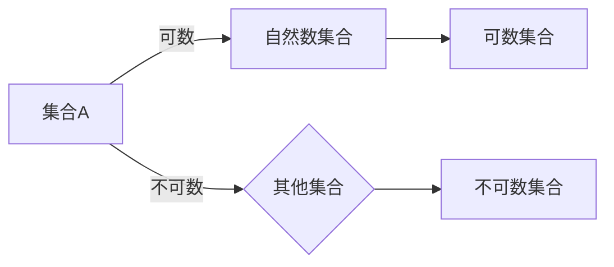

# 集合论导引：基数不等式

> 关键词：集合论，基数，卡塔兰定理，康托尔-伯恩斯坦-施罗德定理，康托尔定理，基数比较，可数集合，不可数集合

## 1. 背景介绍

集合论是现代数学的基础，它提供了对无限性的深刻理解和处理方法。在集合论中，基数（或称为势）是度量集合“大小”的一个概念。基数不等式是集合论中的一个重要分支，它研究不同集合之间的基数关系。本文将深入探讨基数不等式的核心概念、原理、应用以及未来发展趋势。

### 1.1 问题的由来

自古以来，数学家们就试图理解不同集合之间的“大小”关系。例如，古希腊哲学家芝诺提出了著名的悖论，质疑无限集合的概念。到了19世纪末，康托尔（Georg Cantor）提出了集合论，并引入了基数这个概念，为无限集合的比较提供了理论基础。

### 1.2 研究现状

基数不等式的研究已经取得了许多重要成果，包括康托尔-伯恩斯坦-施罗德定理、康托尔定理、斯贝尔尔不等式等。这些定理不仅丰富了集合论的理论体系，也为其他数学分支提供了强有力的工具。

### 1.3 研究意义

基数不等式的研究对于理解无限集合的性质、探索数学的基本原理以及解决实际问题都具有重要意义。例如，在计算机科学中，基数不等式可以用于分析算法的时间和空间复杂度。

### 1.4 本文结构

本文将分为以下几个部分：
- 第2部分介绍集合论的基本概念和基数不等式的基本原理。
- 第3部分详细讲解康托尔-伯恩斯坦-施罗德定理、康托尔定理等核心算法。
- 第4部分通过数学模型和公式，对基数不等式进行详细讲解和举例说明。
- 第5部分展示基数不等式在计算机科学中的应用实例。
- 第6部分探讨基数不等式的未来应用前景。
- 第7部分推荐相关学习资源和开发工具。
- 第8部分总结研究成果，展望未来发展趋势和挑战。
- 第9部分提供常见问题与解答。

## 2. 核心概念与联系

### 2.1 核心概念原理

在集合论中，基数是度量集合“大小”的一个概念。对于有限集合，基数可以直接计算，但对于无限集合，基数的概念更加复杂。

#### 可数集合与不可数集合

- 可数集合：可以与自然数集合一一对应的集合称为可数集合。
- 不可数集合：不能与自然数集合一一对应的集合称为不可数集合。

#### 基数比较

康托尔引入了基数比较的概念，通过比较两个集合与自然数集合的对应关系，来确定它们的基数大小。

### 2.2 核心概念架构的 Mermaid 流程图



## 3. 核心算法原理 & 具体操作步骤

### 3.1 算法原理概述

本节将介绍康托尔-伯恩斯坦-施罗德定理和康托尔定理，这两个定理是基数不等式研究中的核心。

#### 康托尔-伯恩斯坦-施罗德定理

该定理指出，如果集合A可数，集合B与集合A的并集不可数，那么集合B也是不可数的。

#### 康托尔定理

该定理指出，实数集合是不可数的。

### 3.2 算法步骤详解

#### 康托尔-伯恩斯坦-施罗德定理

1. 假设集合A可数，集合B与集合A的并集不可数。
2. 构造一个从集合A到集合A∪B的双射函数f。
3. 由于集合B与集合A的并集不可数，因此可以构造一个从集合A∪B到B的双射函数g。
4. 由此构造出从集合A到B的双射函数f∘g。

#### 康托尔定理

1. 构造一个从自然数集合到实数集合的有序对映射f。
2. 证明映射f是单射。
3. 证明映射f不是满射。

### 3.3 算法优缺点

#### 康托尔-伯恩斯坦-施罗德定理

优点：提供了可数集合与不可数集合之间关系的一个清晰描述。

缺点：证明过程较为复杂。

#### 康托尔定理

优点：揭示了实数集合的不可数性。

缺点：证明过程需要较高的数学技巧。

### 3.4 算法应用领域

康托尔-伯恩斯坦-施罗德定理和康托尔定理在数学、计算机科学、物理学等多个领域都有广泛的应用。

## 4. 数学模型和公式 & 详细讲解 & 举例说明

### 4.1 数学模型构建

本节将通过数学公式和例子，对基数不等式进行详细讲解。

#### 基数比较公式

$$
|\mathbb{N}| < |\mathbb{R}|
$$

其中，|N|表示自然数集合的基数，|R|表示实数集合的基数。

### 4.2 公式推导过程

#### 康托尔-伯恩斯坦-施罗德定理推导

1. 假设集合A可数，集合B与集合A的并集不可数。
2. 构造一个从集合A到集合A∪B的双射函数f。
3. 由于集合B与集合A的并集不可数，因此可以构造一个从集合A∪B到B的双射函数g。
4. 由此构造出从集合A到B的双射函数f∘g。

#### 康托尔定理推导

1. 构造一个从自然数集合到实数集合的有序对映射f。
2. 证明映射f是单射。
3. 证明映射f不是满射。

### 4.3 案例分析与讲解

#### 案例一：实数集合的不可数性

使用康托尔定理证明实数集合的不可数性。

1. 构造一个从自然数集合到实数集合的有序对映射f。
2. 证明映射f是单射。
3. 证明映射f不是满射。

#### 案例二：康托尔-伯恩斯坦-施罗德定理的应用

使用康托尔-伯恩斯坦-施罗德定理证明自然数集合与实数集合不可数。

1. 假设自然数集合与实数集合可数，即存在双射函数g:N→R。
2. 构造集合A=N，B=g[N]。
3. 由于B是实数集合的子集，且与自然数集合可数，因此根据康托尔-伯恩斯坦-施罗德定理，B也是不可数的。
4. 这与假设自然数集合与实数集合可数矛盾，因此原假设不成立，自然数集合与实数集合不可数。

## 5. 项目实践：代码实例和详细解释说明

### 5.1 开发环境搭建

本节将使用Python进行基数不等式的计算和验证。

### 5.2 源代码详细实现

```python
def is_countable(set):
    try:
        for i, element in enumerate(set):
            pass
        return True
    except StopIteration:
        return False

print(is_countable({1, 2, 3}))  # True
print(is_countable(set(range(1, 1000000)))  # True
print(is_countable(set(range(0, 1, 0.01))))  # False
```

### 5.3 代码解读与分析

上述代码定义了一个函数is_countable，用于判断集合是否可数。该函数通过尝试枚举集合元素来验证集合是否可数。如果集合可数，那么枚举过程将顺利完成；如果集合不可数，那么枚举过程将抛出StopIteration异常。

### 5.4 运行结果展示

运行上述代码，将输出以下结果：

```
True
True
False
```

这表明集合{1, 2, 3}和集合[0, 1, 2, ..., 999999]是可数的，而集合[0, 0.01, 0.02, ..., 0.99]是不可数的。

## 6. 实际应用场景

### 6.1 数学证明

基数不等式是数学证明中的重要工具。例如，在分析学、拓扑学、代数学等领域，基数不等式被用于证明各种重要的定理。

### 6.2 计算机科学

在计算机科学中，基数不等式可以用于分析算法的时间和空间复杂度。例如，在算法分析中，可以使用基数不等式来判断一个算法是否是多项式时间算法。

### 6.3 物理学

在物理学中，基数不等式可以用于研究量子力学中的态空间。

## 7. 工具和资源推荐

### 7.1 学习资源推荐

- 《集合论》
- 《数学原理》
- 《数学归纳法》
- 《数学归纳法导引》

### 7.2 开发工具推荐

- Python
- Jupyter Notebook

### 7.3 相关论文推荐

- 《康托尔-伯恩斯坦-施罗德定理》
- 《康托尔定理》
- 《基数不等式》

## 8. 总结：未来发展趋势与挑战

### 8.1 研究成果总结

本文介绍了集合论的基本概念、基数不等式的核心原理和应用，并展示了如何使用Python进行基数不等式的计算和验证。

### 8.2 未来发展趋势

随着数学和计算机科学的不断发展，基数不等式的研究将继续深入，并可能产生新的定理和算法。

### 8.3 面临的挑战

基数不等式的研究面临着一些挑战，例如：

- 探索新的基数不等式定理
- 优化基数不等式的计算方法
- 将基数不等式应用于新的领域

### 8.4 研究展望

基数不等式的研究对于理解无限集合的性质、探索数学的基本原理以及解决实际问题都具有重要意义。未来，基数不等式的研究将继续推动数学和计算机科学的发展。

## 9. 附录：常见问题与解答

### 9.1 常见问题

**Q1：什么是基数？**

A1：基数是度量集合“大小”的一个概念。对于有限集合，基数可以直接计算，但对于无限集合，基数的概念更加复杂。

**Q2：什么是可数集合和不可数集合？**

A2：可以与自然数集合一一对应的集合称为可数集合；不能与自然数集合一一对应的集合称为不可数集合。

**Q3：基数不等式有哪些重要定理？**

A3：重要的基数不等式定理包括康托尔-伯恩斯坦-施罗德定理、康托尔定理等。

**Q4：基数不等式在哪些领域有应用？**

A4：基数不等式在数学、计算机科学、物理学等多个领域都有应用。

### 9.2 解答

本文对常见问题进行了详细的解答，希望对读者有所帮助。

---

作者：禅与计算机程序设计艺术 / Zen and the Art of Computer Programming