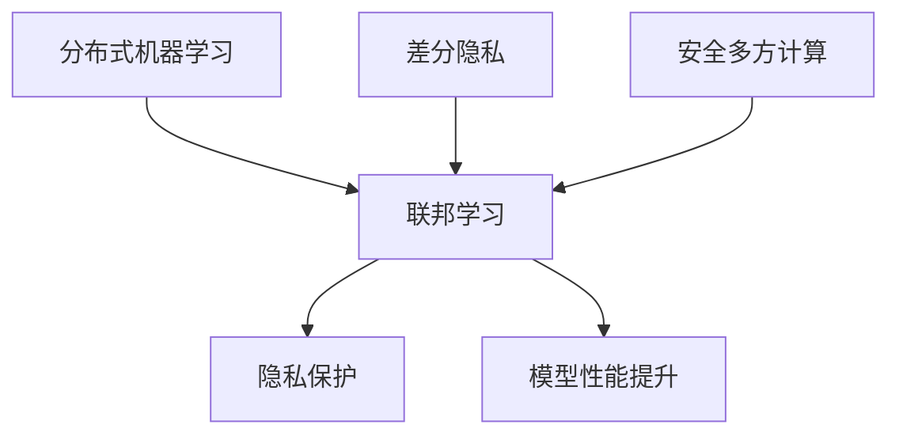
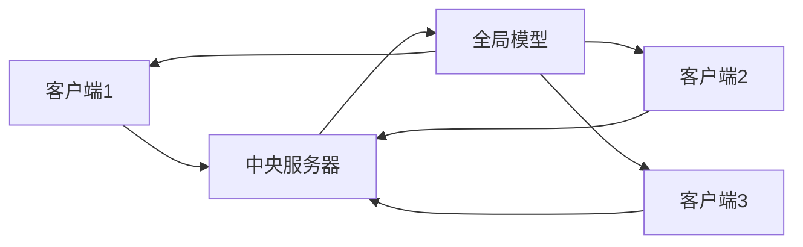

# 联邦学习 原理与代码实例讲解

## 1. 背景介绍

### 1.1 问题的由来

在当今数据驱动的时代,数据被视为新的"石油",对于企业和组织而言,数据是最宝贵的资产之一。然而,由于隐私、安全和法规等因素,数据通常分散存储在不同的机构、部门或地理位置,直接将这些数据集中进行建模和分析存在诸多困难。因此,如何在保护数据隐私的同时,有效利用分散的数据资源,成为了一个亟待解决的问题。

联邦学习(Federated Learning)作为一种新兴的分布式机器学习范式,为解决这一问题提供了一种有效的解决方案。它允许多个参与方在不共享原始数据的情况下,协同训练一个全局模型,从而实现了数据隐私保护和模型性能提升的有机统一。

### 1.2 研究现状

联邦学习的概念最早由谷歌(Google)于2016年提出,旨在解决移动设备上的人工智能模型训练问题。随后,联邦学习在工业界和学术界引起了广泛关注,成为了一个热门的研究领域。

目前,联邦学习已经在医疗健康、金融、制造业、物联网等多个领域得到了广泛应用。例如,在医疗健康领域,联邦学习可以帮助不同医院之间共享模型,提高疾病诊断的准确性,同时保护患者隐私。在金融领域,联邦学习可以用于反欺诈、风险管理等场景,提高模型的鲁棒性和泛化能力。

### 1.3 研究意义

联邦学习的研究具有重要的理论和实践意义:

- 理论意义:联邦学习提出了一种全新的分布式机器学习范式,为数据隐私保护和模型性能提升提供了一种有效的解决方案。它涉及到机器学习、密码学、优化理论等多个领域的理论基础,为这些领域的发展带来了新的挑战和机遇。

- 实践意义:联邦学习可以广泛应用于医疗健康、金融、制造业、物联网等多个领域,帮助企业和组织更好地利用分散的数据资源,提高模型的准确性和泛化能力,同时保护数据隐私,具有重要的现实意义。

### 1.4 本文结构

本文将全面介绍联邦学习的原理、算法、数学模型、代码实现和实际应用场景。文章结构如下:

1. 背景介绍
2. 核心概念与联系
3. 核心算法原理与具体操作步骤
4. 数学模型和公式详细讲解与举例说明
5. 项目实践:代码实例和详细解释说明
6. 实际应用场景
7. 工具和资源推荐
8. 总结:未来发展趋势与挑战
9. 附录:常见问题与解答

## 2. 核心概念与联系

联邦学习涉及到多个核心概念,包括分布式机器学习、差分隐私、安全多方计算等,这些概念之间存在着密切的联系。

- 分布式机器学习(Distributed Machine Learning)是指在多个节点上并行训练机器学习模型的过程。联邦学习是分布式机器学习的一种特殊形式,它在保护数据隐私的同时实现了模型的协同训练。

- 差分隐私(Differential Privacy)是一种用于保护个人隐私的数学定义和算法技术,它通过在数据中引入一定程度的噪声,使得单个数据记录对最终结果的影响很小,从而实现隐私保护。联邦学习中常常会采用差分隐私技术来保护数据隐私。

- 安全多方计算(Secure Multi-Party Computation)是一种密码学技术,它允许多个参与方在不泄露各自私有数据的情况下,共同计算一个函数的结果。联邦学习中可以采用安全多方计算技术来实现安全的模型聚合和更新。

通过将这些概念有机结合,联邦学习实现了隐私保护和模型性能提升的有机统一,成为了一种极具潜力的分布式机器学习范式。

## 3. 核心算法原理与具体操作步骤

### 3.1 算法原理概述

联邦学习算法的核心思想是:多个参与方(客户端)各自在本地数据上训练模型,然后将模型参数或梯度上传到中央服务器(协调者),服务器对所有客户端的模型参数或梯度进行聚合,得到一个全局模型,并将全局模型分发回各个客户端,客户端再在本地数据上继续训练,如此循环迭代,直到模型收敛。

这种算法设计可以有效地保护数据隐私,因为客户端只需要上传模型参数或梯度,而不需要共享原始数据。同时,通过多个客户端的协同训练,可以提高模型的泛化能力和准确性。

### 3.2 算法步骤详解

联邦学习算法的具体步骤如下:

1. **初始化**: 中央服务器初始化一个全局模型,并将其分发给所有参与的客户端。

2. **本地训练**: 每个客户端在本地数据上训练模型,得到模型参数或梯度。

3. **安全聚合**: 客户端将模型参数或梯度上传到中央服务器,服务器对所有客户端的模型参数或梯度进行安全聚合,得到一个新的全局模型。这个过程可以采用差分隐私或安全多方计算等技术来保护隐私。

4. **全局模型更新**: 中央服务器将新的全局模型分发回各个客户端。

5. **迭代训练**: 重复步骤2-4,直到模型收敛或达到预设的迭代次数。

在这个过程中,客户端只需要上传模型参数或梯度,而不需要共享原始数据,从而实现了隐私保护。同时,通过多个客户端的协同训练,可以提高模型的泛化能力和准确性。

### 3.3 算法优缺点

**优点**:

- 隐私保护: 联邦学习算法可以有效地保护数据隐私,因为客户端只需要上传模型参数或梯度,而不需要共享原始数据。

- 模型性能提升: 通过多个客户端的协同训练,可以提高模型的泛化能力和准确性,特别是在数据分布不均匀的情况下。

- 通信效率高: 只需要传输模型参数或梯度,而不需要传输原始数据,可以大大减少通信开销。

- 易于部署: 联邦学习算法可以在现有的分布式系统上进行部署,无需从头构建新的基础设施。

**缺点**:

- 收敛速度慢: 由于需要多次迭代和通信,联邦学习算法的收敛速度通常比集中式训练慢。

- 系统异构性: 不同客户端的硬件、软件和数据分布可能存在差异,这可能会影响模型的收敛和性能。

- 隐私攻击风险: 虽然联邦学习算法旨在保护隐私,但仍然存在一些潜在的隐私攻击风险,需要采取额外的防护措施。

- 通信瓶颈: 在大规模场景下,频繁的通信可能会成为系统的瓶颈,影响整体性能。

### 3.4 算法应用领域

联邦学习算法可以广泛应用于以下领域:

- **医疗健康**: 联邦学习可以帮助不同医院之间共享模型,提高疾病诊断的准确性,同时保护患者隐私。

- **金融**: 联邦学习可以用于反欺诈、风险管理等场景,提高模型的鲁棒性和泛化能力。

- **物联网**: 在物联网领域,联邦学习可以用于智能家居、智能城市等应用,实现设备之间的协同学习。

- **推荐系统**: 联邦学习可以应用于个性化推荐系统,提高推荐精度,同时保护用户隐私。

- **自然语言处理**: 联邦学习可以用于语言模型的训练,提高模型的泛化能力和准确性。

- **计算机视觉**: 联邦学习可以应用于图像分类、目标检测等计算机视觉任务,提高模型的性能。

总的来说,只要存在数据隐私保护和模型性能提升的需求,联邦学习算法都可以发挥作用。

## 4. 数学模型和公式详细讲解与举例说明

### 4.1 数学模型构建

联邦学习的数学模型可以描述为一个优化问题,目标是最小化所有参与方的损失函数之和,同时满足隐私保护的约束。

设有 $N$ 个参与方(客户端),每个参与方 $i$ 拥有本地数据集 $D_i$,目标是在所有参与方的协作下,训练一个全局模型 $\theta$,使得总体损失函数 $F(\theta)$ 最小化:

$$
\min_{\theta} F(\theta) = \sum_{i=1}^{N} p_i F_i(\theta)
$$

其中, $F_i(\theta) = \frac{1}{|D_i|} \sum_{x \in D_i} f(x, \theta)$ 是参与方 $i$ 的本地损失函数, $p_i$ 是参与方 $i$ 的权重系数,通常取决于其数据集的大小。

在联邦学习中,我们需要在保护数据隐私的同时,求解上述优化问题。常见的隐私保护机制包括差分隐私和安全多方计算等。

### 4.2 公式推导过程

接下来,我们将推导联邦学习算法的优化过程。

首先,我们定义一个辅助变量 $\theta_t^i$,表示第 $t$ 轮迭代时,参与方 $i$ 的本地模型参数。我们的目标是找到一个全局模型 $\theta_t$,使得总体损失函数 $F(\theta_t)$ 最小化。

根据联邦学习算法的设计,我们可以将总体损失函数 $F(\theta_t)$ 分解为两部分:

$$
F(\theta_t) = \sum_{i=1}^{N} p_i F_i(\theta_t^i) + \sum_{i=1}^{N} p_i D(\theta_t, \theta_t^i)
$$

其中, $D(\theta_t, \theta_t^i)$ 是一个正则化项,用于度量全局模型 $\theta_t$ 与参与方 $i$ 的本地模型 $\theta_t^i$ 之间的差异。常见的选择包括 $L_2$ 范数:

$$
D(\theta_t, \theta_t^i) = \frac{1}{2} \|\theta_t - \theta_t^i\|_2^2
$$

我们的目标是最小化上述损失函数,可以通过梯度下降法进行优化。具体地,在第 $t+1$ 轮迭代时,全局模型 $\theta_{t+1}$ 的更新规则为:

$$
\theta_{t+1} = \theta_t - \eta \left( \sum_{i=1}^{N} p_i \nabla F_i(\theta_t^i) + \sum_{i=1}^{N} p_i \nabla D(\theta_t, \theta_t^i) \right)
$$

其中, $\eta$ 是学习率, $\nabla F_i(\theta_t^i)$ 是参与方 $i$ 的本地梯度, $\nabla D(\theta_t, \theta_t^i)$ 是正则化项的梯度。

在实际应用中,我们可以采用一些优化策略,如动态学习率调整、动量优化等,来加速算法的收敛。同时,为了保护隐私,我们可以在梯度聚合过程中引入差分隐私噪声或采用安全多方计算技术。

### 4.3 案例分析与讲解

为了更好地理解联邦学习算法的原理和实现,我们将