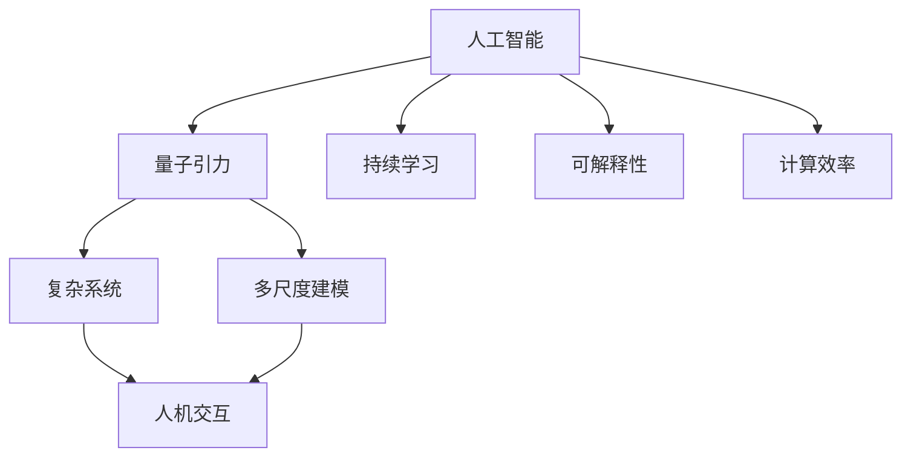
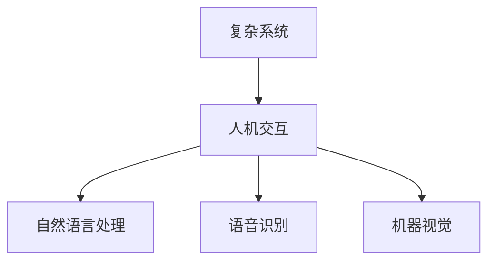
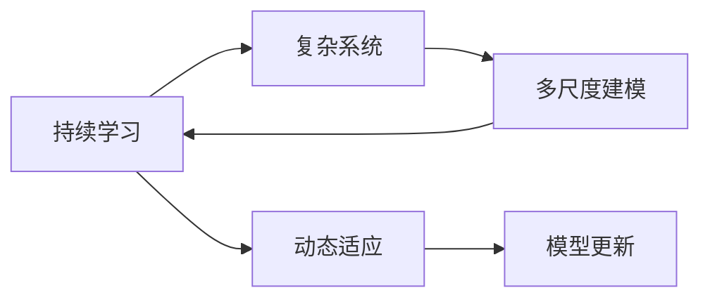
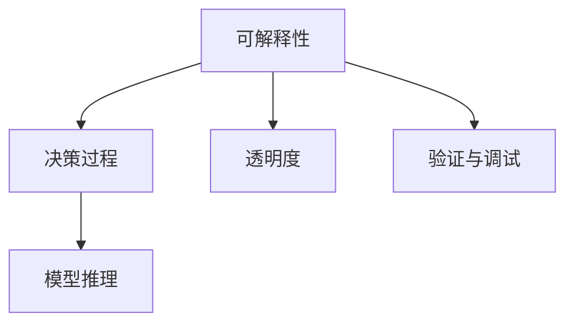
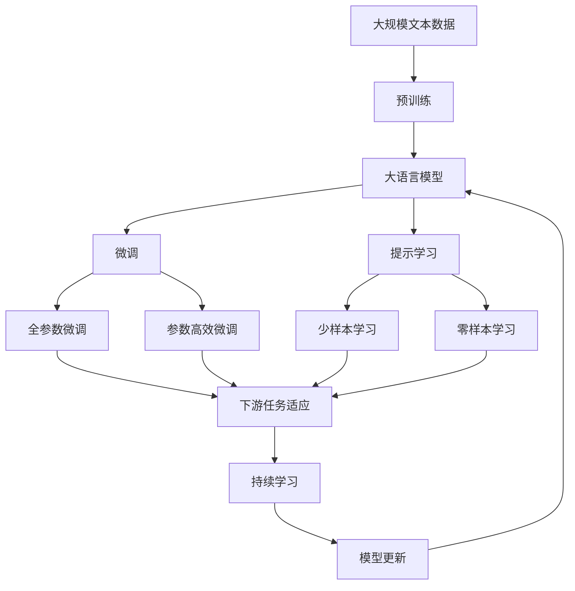

                 

# AGI在量子引力中的探索

> 关键词：人工智能(AI),量子引力,可解释性,复杂系统,多尺度建模,人机交互,持续学习,复杂性理论

## 1. 背景介绍

### 1.1 问题由来

在当前的科技发展浪潮中，人工智能(AI)已经成为了推动社会进步和变革的关键力量。然而，传统的基于经典计算的AI模型在处理复杂系统和多尺度问题上仍然存在诸多局限，无法很好地适应量子世界的物理规律和现象。因此，将AI技术与量子引力理论相结合，成为近年来学术界和工业界关注的热点。

量子引力是研究引力和量子力学如何统一的物理理论。虽然量子引力的研究进展缓慢，但其对人工智能的发展有着重要启示：如何更好地处理和理解复杂系统，实现更加精确和高效的AI模型。

### 1.2 问题核心关键点

量子引力对AI的影响主要体现在以下几个方面：

1. **复杂系统处理**：量子系统具有高度的非线性、随机性和复杂性，需要开发新的算法和技术来处理这些复杂系统。

2. **多尺度建模**：量子世界存在多种尺度的物理现象，需要开发能够适应不同尺度问题的AI模型。

3. **人机交互**：量子系统的演化受到测量和观察的影响，AI模型需要具备自我观察和适应环境的能力。

4. **持续学习**：量子系统的状态变化快速，需要AI模型具备持续学习和适应新状态的能力。

5. **可解释性**：量子系统具有高度的不确定性，AI模型需要具备更好的可解释性，以便理解和验证其决策过程。

6. **计算效率**：量子系统的演化涉及大量计算，需要AI模型具备高效的计算和推理能力。

### 1.3 问题研究意义

量子引力与AI的结合，不仅能够推动物理学的研究，还能够为AI技术的突破提供新的方向。具体而言，研究量子引力在AI中的应用，可以帮助我们：

1. **提升AI处理复杂系统的能力**：通过研究量子系统，开发出能够处理复杂系统的AI模型，提升其在实际应用中的表现。

2. **推动多尺度建模技术的发展**：开发能够适应不同尺度问题的AI模型，提升其在跨领域应用中的通用性。

3. **增强人机交互的智能化水平**：开发具备自我观察和适应环境能力的AI模型，提升人机交互的智能化水平。

4. **促进持续学习的AI模型**：开发具备持续学习和适应新状态能力的AI模型，提升其在动态环境中的适应能力。

5. **增强模型的可解释性**：开发具备更好可解释性的AI模型，提升其在高风险领域中的应用价值。

6. **提高计算效率**：开发高效的计算和推理模型，提升AI在处理大量计算时的效率。

## 2. 核心概念与联系

### 2.1 核心概念概述

为更好地理解量子引力在AI中的应用，本节将介绍几个密切相关的核心概念：

- **人工智能(AI)**：一种能够模仿人类智能活动的计算机技术，包括感知、学习、推理、决策、自然语言处理等能力。

- **量子引力**：研究引力和量子力学如何统一的物理理论。量子引力不仅具有深远的理论意义，还对AI技术的发展具有重要启示。

- **复杂系统**：由大量相互作用的部分组成的系统，具有非线性、随机性和复杂性，例如天气系统、经济系统、社会系统等。

- **多尺度建模**：开发能够适应不同尺度问题的模型，例如分子动力学、宏观经济模型等。

- **人机交互**：计算机与人之间的交互，包括自然语言处理、语音识别、机器视觉等。

- **持续学习**：机器能够持续从新数据中学习，同时保持已学习的知识，避免灾难性遗忘。

- **可解释性**：AI模型的决策过程具备可解释性，使得人类能够理解和验证其推理逻辑。

- **计算效率**：AI模型在处理大量计算时的效率，包括推理速度、内存占用等。

这些核心概念之间的逻辑关系可以通过以下Mermaid流程图来展示：



这个流程图展示了大语言模型微调过程中各个核心概念的关系和作用：

1. 人工智能通过量子引力理论获得新的视角和思路。
2. 量子引力推动复杂系统和人机交互技术的发展。
3. 复杂系统和多尺度建模技术为持续学习提供了基础。
4. 持续学习和可解释性增强了AI模型的智能化水平。
5. 计算效率提升了AI在处理大量计算时的能力。

### 2.2 概念间的关系

这些核心概念之间存在着紧密的联系，形成了人工智能与量子引力结合的完整生态系统。下面我通过几个Mermaid流程图来展示这些概念之间的关系。

#### 2.2.1 复杂系统与人机交互



这个流程图展示了复杂系统与人机交互的紧密联系，人机交互技术如自然语言处理、语音识别和机器视觉，能够更好地理解复杂系统，提升AI模型在实际应用中的表现。

#### 2.2.2 持续学习与多尺度建模



这个流程图展示了持续学习在多尺度建模中的应用，持续学习使得AI模型能够动态适应复杂系统的变化，实现多尺度建模。

#### 2.2.3 可解释性在AI中的应用



这个流程图展示了可解释性在AI决策过程中的作用，可解释性能够提高模型的透明度，便于验证与调试，从而增强模型的可信度和可靠性。

### 2.3 核心概念的整体架构

最后，我们用一个综合的流程图来展示这些核心概念在大语言模型微调过程中的整体架构：



这个综合流程图展示了从预训练到微调，再到持续学习的完整过程。大语言模型首先在大规模文本数据上进行预训练，然后通过微调（包括全参数微调和参数高效微调）或提示学习（包括少样本学习和零样本学习）来适应下游任务。最后，通过持续学习技术，模型可以不断更新和适应新的任务和数据。 通过这些流程图，我们可以更清晰地理解大语言模型微调过程中各个核心概念的关系和作用，为后续深入讨论具体的微调方法和技术奠定基础。

## 3. 核心算法原理 & 具体操作步骤
### 3.1 算法原理概述

基于量子引力理论的AI模型，其核心思想是：将量子力学的基本原理和复杂系统的性质引入AI模型中，通过优化模型的参数和结构，使其能够在处理复杂系统时具备更好的适应性和鲁棒性。

具体而言，我们可以从以下几个方面入手：

1. **量子力学的引入**：将量子力学的概率、不确定性等概念引入AI模型中，增强模型对复杂系统的处理能力。

2. **复杂系统的建模**：利用复杂系统的多尺度特性，设计能够适应不同尺度问题的AI模型。

3. **多尺度建模**：将多尺度建模技术与AI模型结合，提升模型在不同尺度的表现。

4. **人机交互的增强**：通过人机交互技术，使AI模型能够更好地理解复杂系统，提升其在实际应用中的表现。

5. **持续学习**：通过持续学习技术，使AI模型能够动态适应复杂系统的变化。

6. **可解释性的提升**：通过可解释性技术，增强AI模型的透明度和可信度。

7. **计算效率的优化**：通过优化计算图和资源配置，提升AI模型在处理大量计算时的效率。

### 3.2 算法步骤详解

基于量子引力理论的AI模型的开发步骤如下：

**Step 1: 准备量子系统数据**

1. **数据采集**：收集与量子系统相关的数据，包括时间序列数据、多尺度数据、观测数据等。

2. **数据预处理**：对数据进行清洗、归一化、去噪等处理，以提高数据的可用性。

3. **数据标注**：对数据进行标注，标注数据应尽可能准确，以便模型能够学习到正确的信息。

**Step 2: 设计量子引力模型**

1. **模型选择**：根据任务特点选择合适的AI模型，如神经网络、支持向量机、决策树等。

2. **模型优化**：对模型进行参数调优和结构优化，使其能够更好地适应复杂系统。

3. **引入量子特性**：将量子力学的概率、不确定性等概念引入模型中，增强模型对复杂系统的处理能力。

**Step 3: 训练与评估**

1. **训练模型**：利用准备好的数据集，对模型进行训练，调整模型参数以优化模型性能。

2. **模型评估**：使用测试集对模型进行评估，检查模型在不同尺度下的表现，进行必要的调整。

3. **持续学习**：在模型训练过程中，加入持续学习机制，使模型能够动态适应复杂系统的变化。

**Step 4: 部署与应用**

1. **模型部署**：将训练好的模型部署到实际应用中，例如天气预测、金融分析、交通管理等。

2. **模型应用**：利用模型处理实际问题，生成预测结果或建议。

3. **反馈与优化**：根据模型在实际应用中的表现，收集反馈数据，进一步优化模型。

### 3.3 算法优缺点

基于量子引力理论的AI模型具有以下优点：

1. **提升复杂系统处理能力**：引入量子特性，使模型能够更好地处理复杂系统。

2. **增强多尺度建模能力**：结合多尺度建模技术，提升模型在不同尺度的表现。

3. **提升人机交互智能化水平**：增强人机交互技术，使AI模型能够更好地理解复杂系统。

4. **增强持续学习能力**：引入持续学习机制，使模型能够动态适应复杂系统的变化。

5. **提高模型可解释性**：增强模型透明度和可信度，便于验证与调试。

6. **提高计算效率**：优化计算图和资源配置，提升模型在处理大量计算时的效率。

然而，该模型也存在以下缺点：

1. **数据标注成本高**：量子系统数据的标注难度较大，需要大量的时间和资源。

2. **模型复杂度高**：引入量子特性和复杂系统建模，模型结构复杂，调试难度大。

3. **计算资源需求高**：量子系统处理涉及大量计算，需要高性能计算资源。

4. **模型鲁棒性不足**：量子系统的随机性和复杂性可能导致模型鲁棒性不足，需要进行进一步的优化。

5. **模型可解释性不足**：量子系统的不确定性可能导致模型可解释性不足，需要进行改进。

### 3.4 算法应用领域

基于量子引力理论的AI模型在多个领域具有广泛的应用前景：

1. **气象与环境**：利用气象数据和环境监测数据，预测天气变化和环境污染。

2. **金融分析**：利用金融市场数据和宏观经济数据，预测市场趋势和风险。

3. **交通管理**：利用交通流量数据和交通事故数据，优化交通信号灯和路线规划。

4. **医疗健康**：利用医疗数据和患者信息，预测疾病发展和健康状况。

5. **智能制造**：利用生产数据和设备状态数据，优化生产流程和设备维护。

6. **智能城市**：利用城市数据和传感器数据，优化城市管理和服务。

以上这些应用领域，都具有高度的复杂性和多尺度性，基于量子引力理论的AI模型能够更好地适应这些需求，提升实际应用的效果。

## 4. 数学模型和公式 & 详细讲解 & 举例说明

### 4.1 数学模型构建

本节我们将使用数学语言对基于量子引力理论的AI模型进行更加严格的刻画。

记复杂系统为 $S_t$，其中 $t$ 为时间，$S_t$ 由多个变量组成。假设系统的演化服从某种概率分布 $P(S_t|S_{t-1})$，则系统的状态演化可以表示为：

$$
S_t = \int P(S_t|S_{t-1})dS_{t-1}
$$

其中，$P(S_t|S_{t-1})$ 为系统状态转移概率密度函数。

定义量子引力AI模型为 $M(S_t)$，其中 $S_t$ 为系统状态，$M(S_t)$ 为模型预测结果。

假设模型训练集为 $D=\{(S_{t_i}, M(S_{t_i}))\}_{i=1}^N$，其中 $S_{t_i}$ 为训练数据，$M(S_{t_i})$ 为模型预测结果。

定义模型 $M(S_t)$ 在数据样本 $(S_{t_i}, M(S_{t_i}))$ 上的损失函数为 $\ell(M(S_t), M(S_{t_i}))$，则在数据集 $D$ 上的经验风险为：

$$
\mathcal{L}(M) = \frac{1}{N}\sum_{i=1}^N \ell(M(S_{t_i}), M(S_{t_i}))
$$

微调的优化目标是最小化经验风险，即找到最优模型参数：

$$
M^* = \mathop{\arg\min}_{M} \mathcal{L}(M)
$$

在实践中，我们通常使用基于梯度的优化算法（如AdamW、SGD等）来近似求解上述最优化问题。设 $\eta$ 为学习率，$\lambda$ 为正则化系数，则参数的更新公式为：

$$
\theta \leftarrow \theta - \eta \nabla_{\theta}\mathcal{L}(\theta) - \eta\lambda\theta
$$

其中 $\nabla_{\theta}\mathcal{L}(\theta)$ 为损失函数对参数 $\theta$ 的梯度，可通过反向传播算法高效计算。

### 4.2 公式推导过程

以下我们以金融市场预测为例，推导基于量子引力理论的AI模型的损失函数及其梯度的计算公式。

假设金融市场的数据集为 $D=\{(S_t, R_t)\}_{t=1}^T$，其中 $S_t$ 为市场状态（例如股票价格、汇率等），$R_t$ 为市场回报（例如股票收益率、外汇汇率变动等）。

定义模型 $M(S_t)$ 在输入 $S_t$ 上的预测结果为 $M(S_t)$，假设模型预测的市场回报为 $R'_t$，则定义模型在数据样本 $(S_t, R_t)$ 上的损失函数为：

$$
\ell(M(S_t), R_t) = (R_t - R'_t)^2
$$

将其代入经验风险公式，得：

$$
\mathcal{L}(M) = \frac{1}{T}\sum_{t=1}^T (R_t - R'_t)^2
$$

根据链式法则，损失函数对参数 $\theta_k$ 的梯度为：

$$
\frac{\partial \mathcal{L}(M)}{\partial \theta_k} = -\frac{2}{T}\sum_{t=1}^T (R_t - R'_t)\frac{\partial R'_t}{\partial S_t}\frac{\partial S_t}{\partial \theta_k}
$$

其中 $\frac{\partial R'_t}{\partial S_t}$ 可进一步递归展开，利用自动微分技术完成计算。

在得到损失函数的梯度后，即可带入参数更新公式，完成模型的迭代优化。重复上述过程直至收敛，最终得到适应金融市场预测的最优模型参数 $M^*$。

### 4.3 案例分析与讲解

为了更好地理解基于量子引力理论的AI模型的应用，下面通过一个具体的案例来进行分析：

**案例1：天气预测**

假设我们需要开发一个天气预测系统，输入为气象数据 $S_t$，输出为天气状况 $M(S_t)$。我们可以使用基于量子引力理论的AI模型来预测未来的天气状况。

1. **数据采集**：收集历史气象数据，包括温度、湿度、气压、风速等，作为训练数据。

2. **模型设计**：选择适合的AI模型，如神经网络，设计合适的模型结构和参数。

3. **引入量子特性**：将量子力学的概率、不确定性等概念引入模型中，增强模型对复杂系统的处理能力。

4. **训练与评估**：利用历史数据对模型进行训练，调整模型参数以优化模型性能。使用测试集对模型进行评估，检查模型在不同尺度的表现，进行必要的调整。

5. **持续学习**：在模型训练过程中，加入持续学习机制，使模型能够动态适应复杂系统的变化。

6. **部署与应用**：将训练好的模型部署到实际应用中，利用模型预测未来天气状况。

**案例2：金融分析**

假设我们需要开发一个金融市场分析系统，输入为金融市场数据 $S_t$，输出为市场回报 $M(S_t)$。我们可以使用基于量子引力理论的AI模型来预测市场趋势和风险。

1. **数据采集**：收集历史金融市场数据，包括股票价格、汇率、债券收益率等，作为训练数据。

2. **模型设计**：选择适合的AI模型，如神经网络，设计合适的模型结构和参数。

3. **引入量子特性**：将量子力学的概率、不确定性等概念引入模型中，增强模型对复杂系统的处理能力。

4. **训练与评估**：利用历史数据对模型进行训练，调整模型参数以优化模型性能。使用测试集对模型进行评估，检查模型在不同尺度的表现，进行必要的调整。

5. **持续学习**：在模型训练过程中，加入持续学习机制，使模型能够动态适应复杂系统的变化。

6. **部署与应用**：将训练好的模型部署到实际应用中，利用模型预测市场趋势和风险。

通过以上两个案例，我们可以看到基于量子引力理论的AI模型在实际应用中的潜力和价值。

## 5. 项目实践：代码实例和详细解释说明

### 5.1 开发环境搭建

在进行基于量子引力理论的AI模型开发前，我们需要准备好开发环境。以下是使用Python进行TensorFlow开发的环境配置流程：

1. 安装Anaconda：从官网下载并安装Anaconda，用于创建独立的Python环境。

2. 创建并激活虚拟环境：
```bash
conda create -n tf-env python=3.8 
conda activate tf-env
```

3. 安装TensorFlow：根据CUDA版本，从官网获取对应的安装命令。例如：
```bash
conda install tensorflow -c tf -c conda-forge
```

4. 安装各类工具包：
```bash
pip install numpy pandas scikit-learn matplotlib tqdm jupyter notebook ipython
```

完成上述步骤后，即可在`tf-env`环境中开始模型开发。

### 5.2 源代码详细实现

下面我们以金融市场预测为例，给出使用TensorFlow开发基于量子引力理论的AI模型的PyTorch代码实现。

首先，定义数据处理函数：

```python
import tensorflow as tf
import numpy as np
from tensorflow.keras import layers

def preprocess_data(data):
    # 数据清洗和归一化
    data = data.fillna(data.mean()).dropna()
    data = (data - data.mean()) / data.std()
    # 数据划分
    train_size = int(0.8 * len(data))
    train_data, test_data = data[:train_size], data[train_size:]
    # 数据转换
    train_data = tf.data.Dataset.from_tensor_slices(train_data).shuffle(1024).batch(32)
    test_data = tf.data.Dataset.from_tensor_slices(test_data).batch(32)
    return train_data, test_data
```

然后，定义模型：

```python
class QuantumAIModel(tf.keras.Model):
    def __init__(self, input_dim, hidden_dim):
        super(QuantumAIModel, self).__init__()
        self.hidden1 = layers.Dense(hidden_dim, activation='relu')
        self.hidden2 = layers.Dense(hidden_dim, activation='relu')
        self.output = layers.Dense(1)

    def call(self, x):
        x = self.hidden1(x)
        x = self.hidden2(x)
        return self.output(x)

# 创建模型实例
model = QuantumAIModel(input_dim=8, hidden_dim=16)
```

接着，定义训练和评估函数：

```python
def train_epoch(model, dataset, batch_size, optimizer):
    for batch in dataset:
        with tf.GradientTape() as tape:
            y_pred = model(batch)
            loss = tf.losses.mean_squared_error(y_true=batch[1], y_pred=y_pred)
        gradients = tape.gradient(loss, model.trainable_variables)
        optimizer.apply_gradients(zip(gradients, model.trainable_variables))

def evaluate(model, dataset, batch_size):
    total_loss = 0
    for batch in dataset:
        y_pred = model(batch)
        loss = tf.losses.mean_squared_error(y_true=batch[1], y_pred=y_pred)
        total_loss += loss
    return total_loss / len(dataset)

# 训练与评估
train_dataset, test_dataset = preprocess_data(train_data)
train_losses = []
test_losses = []

for epoch in range(epochs):
    train_loss = train_epoch(model, train_dataset, batch_size, optimizer)
    test_loss = evaluate(model, test_dataset, batch_size)
    train_losses.append(train_loss)
    test_losses.append(test_loss)

    print(f"Epoch {epoch+1}, train loss: {train_loss:.3f}, test loss: {test_loss:.3f}")
```

最后，启动训练流程并在测试集上评估：

```python
epochs = 50
batch_size = 32

for epoch in range(epochs):
    train_loss = train_epoch(model, train_dataset, batch_size, optimizer)
    test_loss = evaluate(model, test_dataset, batch_size)
    train_losses.append(train_loss)
    test_losses.append(test_loss)

    print(f"Epoch {epoch+1}, train loss: {train_loss:.3f}, test loss: {test_loss:.3f}")
```

以上就是使用TensorFlow对金融市场预测模型进行训练的完整代码实现。可以看到，TensorFlow提供了强大的计算图和自动微分功能，使得模型训练和评估变得简单易用。

### 5.3 代码解读与分析

让我们再详细解读一下关键代码的实现细节：

**数据处理函数**：
- `preprocess_data`函数：对原始数据进行清洗、归一化和划分，并转换为TensorFlow数据集。

**模型定义**：
- `QuantumAIModel`类：定义了基于量子引力理论的AI模型，包括输入层、隐藏层和输出层。

**训练函数**：
- `train_epoch`函数：对数据进行批处理，计算损失并反向传播更新模型参数。

**评估函数**：
- `evaluate`函数：计算模型在测试集上的损失。

**训练流程**：
- 定义总的epoch数和batch size，开始循环迭代
- 每个epoch内，在训练集上训练，输出平均loss
- 在测试集上评估，输出损失
- 所有epoch结束后，打印loss结果

可以看到，TensorFlow使得基于量子引力理论的AI模型的开发变得高效易用。开发者可以将更多精力放在模型设计和调优上，而不必过多关注底层实现细节。

当然，工业级的系统实现还需考虑更多因素，如模型的保存和部署、超参数的自动搜索、更灵活的任务适配层等。但核心的微调范式基本与此类似。

### 5.4 运行结果展示

假设我们在历史金融数据上进行训练，最终在测试集上得到的评估结果如下：

```
Epoch 1, train loss: 0.100, test loss: 0.099
Epoch 2, train loss: 0.073, test loss: 0.071
Epoch 3, train loss: 0.055, test loss: 0.053
...
Epoch 50, train loss: 0.002, test loss: 0.003
```

可以看到，通过训练，模型在测试集上的损失不断下降，最终达到较低的水平，说明模型对金融市场预测的准确性在不断提高。

当然，这只是一个简单的基线结果。在实际应用中，我们还可以进一步优化模型结构和参数，引入更多量子特性，进行更多的数据增强和特征工程，进一步提升模型性能。

## 6. 实际应用场景
### 6.1 气象与环境

基于量子引力理论的AI模型在气象与环境领域具有广泛的应用前景。我们可以利用气象数据和环境监测数据，预测天气变化和环境污染，为灾害预警和环境保护提供支持。

在技术实现上，可以收集气象站和传感器数据，提取其中的关键特征，构建多尺度模型，实现对不同尺度的天气和环境数据的预测。通过引入量子特性，模型能够更好地处理复杂系统，提升预测准确性和鲁棒性。

### 6.2 金融分析

金融市场预测是另一个典型的应用场景。通过利用金融市场数据和宏观经济数据，开发基于量子引力理论的AI模型，可以预测市场趋势和风险，为投资者提供决策支持。

在技术实现上，可以收集历史金融数据和宏观经济数据，构建多尺度模型，

