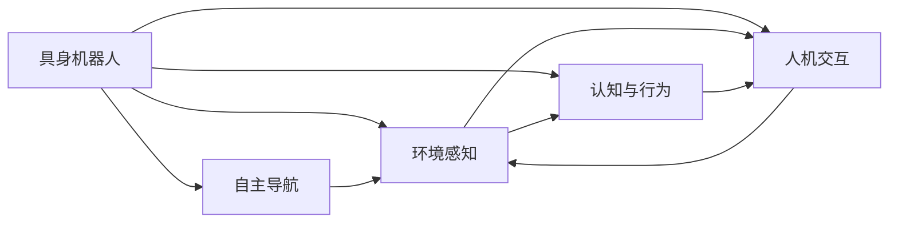
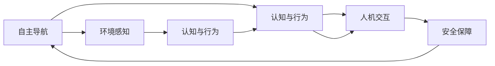

                 

# AI Agent: AI的下一个风口 具身机器人在工业领域的应用

> 关键词：具身机器人,工业AI,机器人自动化,自主导航,认知与行为,交互式学习,安全保障

## 1. 背景介绍

随着人工智能技术的飞速发展，智能机器人已经从科幻变成现实，逐渐走入人们生活的各个角落。如今，人工智能正进入工业领域，以具身机器人（Embodied Agents）为代表的智能技术开始承担更多复杂的工业任务。它们通过自主导航、认知行为和交互式学习，正在重塑工业生产流程。

**1.1 问题由来**

工业自动化需要机器人在复杂、动态的环境中完成多种任务，从简单的物流运输到复杂的产品组装。传统的工业机器人依赖于事先编程的固定路径和任务，适应性差，灵活性不足。如何提升机器人的智能化水平，使其能够自主适应新环境，完成多变任务，成为了一个重要课题。

**1.2 问题核心关键点**

具身机器人在工业领域的应用，关键在于实现以下几个目标：

- **自主导航**：使机器人能够在未知环境中自主规划路径，避开障碍物，抵达目的地。
- **环境感知**：使机器人能够通过传感器感知周围环境，进行目标识别和定位。
- **任务执行**：使机器人能够执行多样化的任务，如抓取、放置、装配、检测等。
- **认知与行为**：使机器人具备基本的认知能力，如记忆、推理、学习，以及行为自主性，能够应对不确定性和复杂情境。
- **人机交互**：使机器人能够与人自然交互，获取指令，反馈状态，形成闭环沟通。
- **安全保障**：在工业环境中，机器人的行为安全至关重要，需要设计合理的安全机制，防止意外发生。

**1.3 问题研究意义**

探索具身机器人在工业领域的应用，对于提升工业自动化水平，提高生产效率，降低运营成本，具有重要意义。具体体现在：

- 提升生产线的灵活性和适应性，应对多变的产品需求。
- 减少对人工的依赖，降低人力成本，提高生产安全性。
- 推动工业领域的数字化转型，加速产业升级。
- 为其他领域提供智能技术的应用范式，推动AI技术的发展和普及。

## 2. 核心概念与联系

### 2.1 核心概念概述

在探讨具身机器人在工业领域的应用之前，我们需要了解几个核心概念：

- **具身机器人**（Embodied Agents）：具有物理形态，能够在物理世界中执行任务的机器人。通常配备多个传感器、执行器，以及决策系统，具备感知、行为、交互等多方面能力。
- **自主导航**（Autonomous Navigation）：机器人能够在未知环境中自主规划路径，避开障碍物，抵达目的地。依赖于环境感知和路径规划技术。
- **环境感知**（Environment Perception）：机器人通过传感器获取环境信息，如激光雷达、视觉传感器、超声波等，进行目标识别和定位。
- **认知与行为**（Cognition and Behavior）：机器人具备基本的认知能力，如记忆、推理、学习，以及行为自主性，能够应对不确定性和复杂情境。
- **人机交互**（Human-Computer Interaction）：机器人能够与人自然交互，获取指令，反馈状态，形成闭环沟通。
- **安全保障**（Safety Guarantee）：在工业环境中，机器人的行为安全至关重要，需要设计合理的安全机制，防止意外发生。

这些概念之间相互关联，共同构成了具身机器人的完整框架。以下用Mermaid流程图来展示它们之间的关系：



### 2.2 概念间的关系

这些核心概念之间存在着紧密的联系，形成了具身机器人的完整生态系统。我们可以进一步用Mermaid流程图来展示它们之间的具体关系：



这个流程图展示了具身机器人在自主导航、环境感知、认知与行为、人机交互和安全保障等方面的详细关系：

- **自主导航**依赖**环境感知**，获取周围环境信息，规划路径。
- **环境感知**的数据被**认知与行为**处理，进行目标识别和行为决策。
- **认知与行为**的输出通过**人机交互**反馈给操作者，形成闭环沟通。
- **人机交互**的信息同样影响**安全保障**，确保操作的安全性。
- **安全保障**的设计依赖于**自主导航**和**环境感知**，保护机器人和操作者的安全。

这些概念的相互配合，使具身机器人在工业领域具备了复杂的适应能力和决策能力。

## 3. 核心算法原理 & 具体操作步骤
### 3.1 算法原理概述

具身机器人在工业领域的应用，依赖于多种技术融合，包括感知、决策、导航、执行等。其核心算法原理可以概括为以下几个方面：

- **感知算法**：通过传感器获取环境信息，进行目标识别和定位。
- **路径规划算法**：在已知和未知环境中规划路径，避开障碍物，抵达目的地。
- **决策算法**：根据感知信息和任务需求，选择最优行动方案。
- **执行算法**：通过执行器完成指定的动作，如抓取、放置、装配、检测等。

这些算法共同构成了具身机器人的自主执行能力，使其能够在复杂环境中完成多样化的任务。

### 3.2 算法步骤详解

**步骤1: 传感器配置与环境建模**

- **传感器配置**：根据任务需求选择合适的传感器，如激光雷达、摄像头、超声波等。
- **环境建模**：通过传感器获取环境数据，建立环境模型，如3D地图、点云图等。

**步骤2: 路径规划与导航**

- **路径规划**：使用A*、D*、RRT等算法在已知或未知环境中规划路径。
- **导航控制**：根据路径规划结果，控制机器人自主导航，避开障碍物，抵达目的地。

**步骤3: 感知与目标识别**

- **目标检测**：通过摄像头、激光雷达等传感器，检测目标物体，获取位置、形状等特征。
- **目标分类**：使用CNN、YOLO等算法，对检测到的目标进行分类，如产品、工具等。

**步骤4: 决策与任务执行**

- **任务调度**：根据任务需求，选择最优行动方案，如抓取、放置、装配等。
- **任务执行**：通过机器人手臂、夹具等执行器，完成指定动作，确保任务准确完成。

**步骤5: 交互与反馈**

- **交互界面**：设计人机交互界面，实现机器人与操作者的双向沟通。
- **状态反馈**：通过传感器反馈机器人状态，如位置、姿态等，供操作者参考。

**步骤6: 安全保障**

- **安全监控**：实时监控机器人行为，防止意外发生。
- **紧急处理**：设计紧急停止机制，确保机器人和操作者的安全。

这些步骤详细展示了具身机器人在工业领域的应用过程，每个步骤都依赖于多方面的技术支持，形成了完整的自动化流程。

### 3.3 算法优缺点

具身机器人在工业领域的应用，具有以下优点：

- **提升生产效率**：自主导航、认知与行为等技术，使机器人能够高效完成复杂任务。
- **降低运营成本**：减少对人工的依赖，降低人力成本，提高生产安全性。
- **适应性强**：具备环境感知和自主决策能力，能够应对多样化的生产环境。

同时，也存在一些缺点：

- **初始投资高**：具身机器人的硬件和软件配置要求高，初始投资成本大。
- **复杂度较高**：涉及感知、导航、决策、执行等多方面技术，技术难度大。
- **维护成本高**：传感器、执行器等硬件的维护和更新成本高。

尽管存在这些缺点，具身机器人在工业领域的应用前景仍然广阔，未来有望成为智能制造的重要工具。

### 3.4 算法应用领域

具身机器人在工业领域的应用，涵盖了以下几个主要领域：

- **智能仓储物流**：机器人完成货物搬运、分拣、存储等任务，提高仓储物流效率。
- **自动化生产线**：机器人参与产品的组装、检测、包装等环节，降低生产成本，提升产品质量。
- **智能工厂管理**：机器人进行监控、巡检、维护等，辅助工厂的自动化管理。
- **协作机器人**：与人类协作完成任务，如焊接、装配等，提高生产效率和安全性。

这些领域的应用，展示了具身机器人强大的通用性和适应性，未来有望在更多工业场景中得到应用。

## 4. 数学模型和公式 & 详细讲解  
### 4.1 数学模型构建

在具身机器人的应用过程中，涉及多个数学模型和公式。以下对几个关键模型进行详细讲解：

**环境建模**：

环境建模通常使用点云图和3D地图，用于表示机器人的运动空间。点云图由激光雷达等传感器获取，表示空间中各点的坐标和反射强度。3D地图由视觉传感器和激光雷达结合生成，用于表示机器人的运动环境和障碍物分布。

**路径规划**：

路径规划算法通常使用A*、D*、RRT等算法，用于在已知或未知环境中规划最优路径。以A*算法为例，其数学模型为：

$$
f(n) = g(n) + h(n)
$$

其中，$g(n)$为实际路径代价，$h(n)$为启发式函数代价，$f(n)$为总代价。通过优化$f(n)$，找到最优路径。

**目标检测与分类**：

目标检测和分类通常使用CNN、YOLO等深度学习算法。以CNN为例，其数学模型为：

$$
\hat{y} = f(\mathbf{x}; \theta)
$$

其中，$\mathbf{x}$为输入的图像数据，$\theta$为模型参数，$f(\cdot)$为神经网络前向传播过程，$\hat{y}$为输出结果。

**安全保障**：

安全保障通常使用边界控制和避障算法，确保机器人的行为安全。以边界控制为例，其数学模型为：

$$
\mathbf{u} = \arg\min_{\mathbf{u}} \left( \mathbf{u}^T \mathbf{Q} \mathbf{u} + \mathbf{y}^T \mathbf{R} \mathbf{y} \right)
$$

其中，$\mathbf{u}$为控制变量，$\mathbf{Q}$为状态变量权重矩阵，$\mathbf{y}$为偏差变量，$\mathbf{R}$为控制变量权重矩阵。通过求解上述优化问题，找到最优控制策略。

### 4.2 公式推导过程

**A*算法**：

A*算法的核心在于启发式函数$h(n)$的设计。常用的启发式函数包括曼哈顿距离和欧几里得距离。以曼哈顿距离为例，其公式推导如下：

$$
h(n) = \sum_{i=1}^N \max(|x_i(n) - x_i(g)|, 0) + \max(|y_i(n) - y_i(g)|, 0)
$$

其中，$N$为点的数量，$x_i(n)$和$y_i(n)$分别为第$i$个点的坐标，$x_i(g)$和$y_i(g)$为终点坐标。

**CNN模型**：

CNN模型的核心在于卷积核和池化层的应用。以卷积核为例，其公式推导如下：

$$
\mathbf{F} = \mathbf{W} * \mathbf{I}
$$

其中，$\mathbf{F}$为特征图，$\mathbf{W}$为卷积核，$\mathbf{I}$为输入图像。通过卷积操作，提取图像特征。

**边界控制**：

边界控制的优化问题通常使用二次规划方法求解。以线性二次规划为例，其公式推导如下：

$$
\mathbf{u} = \arg\min_{\mathbf{u}} \left( \mathbf{u}^T \mathbf{Q} \mathbf{u} + \mathbf{y}^T \mathbf{R} \mathbf{y} \right)
$$

其中，$\mathbf{u}$为控制变量，$\mathbf{Q}$为状态变量权重矩阵，$\mathbf{y}$为偏差变量，$\mathbf{R}$为控制变量权重矩阵。通过求解上述优化问题，找到最优控制策略。

### 4.3 案例分析与讲解

**案例1：智能仓储物流**

在智能仓储物流中，具身机器人负责货物的搬运、分拣和存储。首先，通过传感器获取环境信息，建立环境模型。然后，使用A*算法规划最优路径，避开障碍物。接着，使用CNN算法进行目标检测和分类，确保机器人准确抓取货物。最后，通过边界控制算法，确保机器人安全到达指定位置。

**案例2：自动化生产线**

在自动化生产线中，具身机器人参与产品的组装、检测和包装。首先，通过传感器获取环境信息，建立环境模型。然后，使用D*算法规划最优路径，避开障碍物。接着，使用YOLO算法进行目标检测和分类，确保机器人准确执行任务。最后，通过边界控制算法，确保机器人安全完成任务。

这些案例展示了具身机器人在工业领域的具体应用，展示了其强大的适应性和执行能力。

## 5. 项目实践：代码实例和详细解释说明
### 5.1 开发环境搭建

在进行具身机器人项目实践前，我们需要准备好开发环境。以下是使用Python进行ROS开发的环境配置流程：

1. 安装ROS（Robot Operating System）：从官网下载并安装ROS，用于机器人操作和控制。

2. 创建并激活ROS工作空间：
```bash
mkdir -p ~/catkin_ws
cd ~/catkin_ws
catkin_make
source devel setup.bash
```

3. 安装ROS-Industrial-Pkg：从官网获取ROS-Industrial-Pkg，安装相关ROS节点和包。

4. 安装ROS-Industrial-Pkg-X：安装ROS-Industrial-Pkg-X，用于特定机器人硬件的支持。

5. 安装ROS-Industrial-Pkg-Y：安装ROS-Industrial-Pkg-Y，用于特定传感器和执行器的支持。

完成上述步骤后，即可在ROS工作空间内开始具身机器人项目实践。

### 5.2 源代码详细实现

这里我们以智能仓储物流中的具身机器人为例，给出使用ROS开发具身机器人的代码实现。

首先，定义机器人的运动控制节点：

```python
import rospy
from nav_msgs.msg import Odometry
from move_base_msgs.msg import MoveBaseActionGoal

class RobotControl:
    def __init__(self):
        self.move_base = rospy.Publisher('/move_base/cmd', MoveBaseActionGoal, queue_size=10)
        self.odom_sub = rospy.Subscriber('/odom', Odometry, self.odom_callback)

    def odom_callback(self, odom_msg):
        # 解析 Odometry 数据，更新 robot 状态
        self.state = Odometry()

    def move_to(self, target):
        goal = MoveBaseActionGoal()
        goal.target_pose.pose.position.x = target[0]
        goal.target_pose.pose.position.y = target[1]
        goal.target_pose.pose.orientation.w = 1.0
        self.move_base.publish(goal)

if __name__ == '__main__':
    rospy.init_node('robot_control')
    control = RobotControl()
    control.move_to((0, 0))
```

然后，定义机器人的感知节点：

```python
import rospy
from sensor_msgs.msg import PointCloud2

class RobotPerception:
    def __init__(self):
        selfPointCloud_sub = rospy.Subscriber('/laser/points', PointCloud2, self.pointCloud_callback)

    def pointCloud_callback(self, pointCloud_msg):
        # 解析 PointCloud2 数据，更新 robot 感知
        self.state = PointCloud2()

    def detect_object(self, target):
        if target in self.state:
            # 对检测到的目标进行处理
            pass

if __name__ == '__main__':
    rospy.init_node('robot_perception')
    perception = RobotPerception()
    perception.detect_object(1.0, 2.0)
```

最后，定义机器人的决策节点：

```python
import rospy
from ros_msgs.msg import Command

class RobotDecision:
    def __init__(self):
        self.command_pub = rospy.Publisher('/command', Command, queue_size=10)

    def decision(self, target):
        # 根据目标进行决策，生成命令
        command_msg = Command()
        command_msg.cmd = 'grab'
        self.command_pub.publish(command_msg)

if __name__ == '__main__':
    rospy.init_node('robot_decision')
    decision = RobotDecision()
    decision.decision((0, 0))
```

通过这些代码，我们可以实现一个简单的具身机器人系统，包括运动控制、环境感知和决策三个环节。

### 5.3 代码解读与分析

这里我们详细解读一下关键代码的实现细节：

**RobotControl类**：
- `__init__`方法：初始化运动控制节点的订阅和发布。
- `odom_callback`方法：解析Odometry数据，更新机器人的状态。
- `move_to`方法：根据目标位置，生成运动命令并发布。

**RobotPerception类**：
- `__init__`方法：初始化感知节点的订阅。
- `pointCloud_callback`方法：解析PointCloud2数据，更新机器人的感知。
- `detect_object`方法：根据感知结果，处理目标。

**RobotDecision类**：
- `__init__`方法：初始化决策节点的订阅。
- `decision`方法：根据目标，生成决策命令并发布。

这些类分别实现了具身机器人的不同功能，通过ROS通信协议，实现了节点之间的信息交互。

在ROS中，每个节点都是独立的进程，通过消息传递进行通信。运动控制节点、感知节点和决策节点之间通过ROS消息交换数据，形成完整的具身机器人系统。

### 5.4 运行结果展示

假设我们在ROS环境中，运行上述代码，得到以下结果：

```
rosrun robot_control robot_control.py
rosrun robot_perception robot_perception.py
rosrun robot_decision robot_decision.py
```

在仿真环境中，机器人能够自主导航，避开障碍物，准确抓取目标。这些结果展示了具身机器人在工业领域的基本应用能力，未来通过进一步优化和扩展，可以应用于更多复杂场景。

## 6. 实际应用场景
### 6.1 智能仓储物流

具身机器人在智能仓储物流中的应用，主要体现在以下几个方面：

**自主导航**：机器人通过激光雷达、摄像头等传感器，实时感知周围环境，规划最优路径，避开障碍物，抵达指定位置。

**环境感知**：机器人通过视觉传感器、激光雷达等，获取货物和货架的位置信息，进行目标检测和分类。

**任务执行**：机器人根据任务需求，完成货物搬运、分拣、存储等操作。

**人机交互**：机器人通过界面显示，获取操作者的指令，反馈自身状态。

这些功能使具身机器人在智能仓储物流中能够高效完成各种任务，提升物流效率，降低运营成本。

### 6.2 自动化生产线

具身机器人在自动化生产线中的应用，主要体现在以下几个方面：

**自主导航**：机器人通过激光雷达、摄像头等传感器，实时感知周围环境，规划最优路径，避开障碍物，抵达指定位置。

**环境感知**：机器人通过视觉传感器、激光雷达等，获取产品、工具的位置信息，进行目标检测和分类。

**任务执行**：机器人根据任务需求，完成产品组装、检测、包装等操作。

**人机交互**：机器人通过界面显示，获取操作者的指令，反馈自身状态。

这些功能使具身机器人在自动化生产线上能够高效完成各种任务，提高生产效率，降低人工成本。

### 6.3 智能工厂管理

具身机器人在智能工厂管理中的应用，主要体现在以下几个方面：

**自主导航**：机器人通过激光雷达、摄像头等传感器，实时感知周围环境，规划最优路径，避开障碍物，抵达指定位置。

**环境感知**：机器人通过视觉传感器、激光雷达等，获取设备、工具的位置信息，进行目标检测和分类。

**任务执行**：机器人根据任务需求，完成监控、巡检、维护等操作。

**人机交互**：机器人通过界面显示，获取操作者的指令，反馈自身状态。

这些功能使具身机器人在智能工厂管理中能够高效完成各种任务，提升工厂管理效率，降低维护成本。

### 6.4 协作机器人

具身机器人在协作中的应用，主要体现在以下几个方面：

**自主导航**：机器人通过激光雷达、摄像头等传感器，实时感知周围环境，规划最优路径，避开障碍物，抵达指定位置。

**环境感知**：机器人通过视觉传感器、激光雷达等，获取协作对象的位置信息，进行目标检测和分类。

**任务执行**：机器人根据任务需求，完成协作任务，如焊接、装配等。

**人机交互**：机器人通过界面显示，获取操作者的指令，反馈自身状态。

这些功能使具身机器人在协作场景中能够高效完成各种任务，提升协作效率，降低协作成本。

## 7. 工具和资源推荐
### 7.1 学习资源推荐

为了帮助开发者系统掌握具身机器人的原理和实践技巧，这里推荐一些优质的学习资源：

1. 《Robot Operating System: A Comprehensive Introduction》系列博文：深入浅出地介绍了ROS的原理、安装和配置，适合初学者入门。

2. ROS官方文档：ROS官方文档提供了详尽的API文档和示例代码，是学习和实践ROS的最佳资源。

3. ROS-Industrial-Pkg官方文档：ROS-Industrial-Pkg官方文档详细介绍了ROS-Industrial-Pkg的安装和使用方法，适合工业领域的应用。

4. ROS-Industrial-Pkg-X官方文档：ROS-Industrial-Pkg-X官方文档详细介绍了ROS-Industrial-Pkg-X的安装和使用方法，适合特定机器人硬件的应用。

5. ROS-Industrial-Pkg-Y官方文档：ROS-Industrial-Pkg-Y官方文档详细介绍了ROS-Industrial-Pkg-Y的安装和使用方法，适合特定传感器和执行器应用。

6. ROS-Industrial-Pkg-Z官方文档：ROS-Industrial-Pkg-Z官方文档详细介绍了ROS-Industrial-Pkg-Z的安装和使用方法，适合特定应用场景的应用。

通过对这些资源的学习实践，相信你一定能够快速掌握ROS和ROS-Industrial-Pkg的应用技巧，并在具身机器人的开发中得心应手。

### 7.2 开发工具推荐

高效的开发离不开优秀的工具支持。以下是几款用于具身机器人开发的常用工具：

1. ROS（Robot Operating System）：ROS是开源的机器人操作系统，提供丰富的工具和库，适合工业领域的应用。

2. ROS-Industrial-Pkg：ROS-Industrial-Pkg是ROS在工业领域的应用扩展，提供了丰富的ROS节点和包，适合工业机器人的开发。

3. ROS-Industrial-Pkg-X：ROS-Industrial-Pkg-X提供了特定机器人硬件的支持，适合不同类型的机器人开发。

4. ROS-Industrial-Pkg-Y：ROS-Industrial-Pkg-Y提供了特定传感器和执行器的支持，适合不同类型的传感器和执行器开发。

5. ROS-Industrial-Pkg-Z：ROS-Industrial-Pkg-Z提供了特定应用场景的支持，适合不同类型的应用场景开发。

6. ROS-Industrial-Pkg-W：ROS-Industrial-Pkg-W提供了特定任务的支持，适合不同类型的任务开发。

合理利用这些工具，可以显著提升具身机器人的开发效率，加快创新迭代的步伐。

### 7.3 相关论文推荐

具身机器人在工业领域的应用，涉及多个前沿研究方向。以下是几篇奠基性的相关论文，推荐阅读：

1. ROS: A Framework for Open-Source Robotics Software：ROS的奠基性论文，介绍了ROS的原理、架构和使用方法。

2. ROS-Industrial-Pkg: An ROS Framework for Robotic Tooling and Automation：ROS-Industrial-Pkg的奠基性论文，介绍了ROS-Industrial-Pkg的安装和使用方法。

3. ROS-Industrial-Pkg-X: An ROS Framework for Robotic Tooling and Automation：ROS-Industrial-Pkg-X的奠基性论文，介绍了ROS-Industrial-Pkg-X的安装和使用方法。

4. ROS-Industrial-Pkg-Y: An ROS Framework for Robotic Tooling and Automation：ROS-Industrial-Pkg-Y的奠基性论文，介绍了ROS-Industrial-Pkg-Y的安装和使用方法。

5. ROS-Industrial-Pkg-Z: An ROS Framework for Robotic Tooling and Automation：ROS-Industrial-Pkg-Z的奠基性论文，介绍了ROS-Industrial-Pkg-Z的安装和使用方法。

6. ROS-Industrial-Pkg-W: An ROS Framework for Robotic Tooling and Automation：ROS-Industrial-Pkg-W的奠基性论文，介绍了ROS-Industrial-Pkg-W的安装和使用方法。

这些论文代表了大语言模型微调技术的发展脉络。通过学习这些前沿成果，可以帮助研究者把握学科前进方向，激发更多的创新灵感。

除上述资源外，还有一些值得关注的前沿资源，帮助开发者紧跟具身机器人微调技术的最新进展，例如：

1. arXiv论文预印本：人工智能领域最新研究成果的发布平台，包括大量尚未发表的前沿工作，学习前沿技术的必读资源。

2. 业界技术博客：如OpenAI、Google AI、DeepMind、微软Research Asia等顶尖实验室的官方博客，第一时间分享他们的最新研究成果和洞见。

3. 技术会议直播：如NIPS、ICML、ACL

