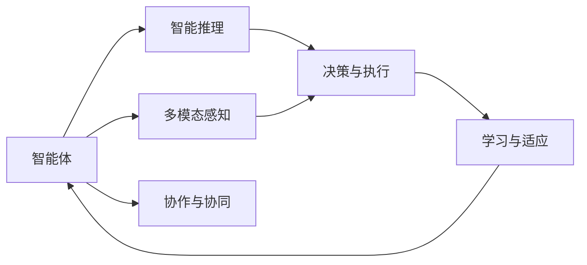
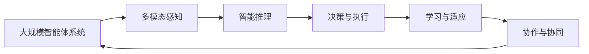

                 

## 1. 背景介绍

### 1.1 问题由来
在人工智能（AI）的发展历程中，无论是早期的专家系统、知识库，还是后来的机器学习、深度学习模型，均已证明了其在解决特定问题上的强大能力。但当问题变得复杂多变，需跨越多学科、多领域、多模态的信息时，单一算法或模型的局限性愈发凸显。

人工智能逐步进入智能体（Agent）的探索阶段，智能体是能够自主感知环境、制定决策、执行任务的实体。智能体的核心目标是通过多模态感知、自主决策、智能执行，实现环境的理解、预测、适应和改造。然而，传统AI系统中单一模型的局限，使得智能体难以高效、可靠地进行多任务处理。

智能体需要超越单一模型和算法的限制，将多学科、多领域的知识进行有效整合，并具备自主学习、推理、适应、协作等五大能力。这一核心目标，即是AI的下一个风口，引领AI技术发展的新方向。

### 1.2 问题核心关键点
智能体需具备以下五大核心能力，才能在复杂的现实环境中实现高效任务处理：

1. **自主感知能力**：能够实时感知环境的多模态信息（视觉、听觉、触觉等），构建对环境的动态理解。
2. **智能推理能力**：能够基于感知到的信息，进行逻辑推理、因果分析，预测环境变化。
3. **决策与执行能力**：在复杂动态环境下，能够制定最优策略并执行决策，实现环境改造和目标达成。
4. **学习与适应能力**：能够根据任务需求，不断学习和适应新环境，积累经验以提升性能。
5. **协作与协同能力**：能够与环境中的其他智能体进行信息交互、任务协作，形成智能体系。

### 1.3 问题研究意义
智能体的五大能力，能够突破单一模型和算法的局限，实现多模态、多领域、多任务的智能处理，显著提升AI系统在复杂环境中的表现和适应性。研究智能体的五大能力，不仅有助于AI技术在新场景、新需求下的应用，还将推动AI向更加通用、普适的方向发展，加速AI技术的产业化进程，为智能社会的构建奠定基础。

## 2. 核心概念与联系

### 2.1 核心概念概述

为更好地理解智能体的五大能力，本节将介绍几个密切相关的核心概念：

- **智能体（Agent）**：能够感知环境、执行任务并具有一定决策能力的实体，涵盖从简单的自动化控制器到复杂的机器人系统。
- **多模态感知（Multimodal Perception）**：涉及视觉、听觉、触觉等多重感官输入的信息整合，提升对环境的动态理解能力。
- **智能推理（Intelligent Reasoning）**：基于感知到的信息，进行逻辑推理、因果分析、预测未来环境变化，实现自主决策。
- **决策与执行（Decision Making & Execution）**：制定最优策略并执行决策，实现目标达成和环境改造。
- **学习与适应（Learning & Adaptation）**：通过经验积累和迭代优化，不断提升性能和适应能力。
- **协作与协同（Collaboration & Cooperation）**：与其他智能体进行信息交互、任务协作，形成高效智能体系。

这些核心概念之间的逻辑关系可以通过以下Mermaid流程图来展示：



这个流程图展示智能体的核心能力及其之间的关系：

1. 智能体通过多模态感知获取环境信息，并进行智能推理。
2. 智能推理支持决策与执行，制定最优策略并实现目标。
3. 学习与适应不断提升智能体的性能和适应能力。
4. 协作与协同使得智能体形成智能体系，提升整体效率和能力。

### 2.2 概念间的关系

这些核心概念之间存在着紧密的联系，形成了智能体处理复杂任务的整体框架。

1. **感知与推理**：多模态感知获取的环境信息，为智能推理提供数据基础。推理则通过逻辑、因果等分析手段，对感知信息进行理解和处理。

2. **推理与决策**：推理结果支持智能体进行决策，决策制定的策略需考虑环境变化、任务目标等因素。

3. **决策与执行**：决策结果指导智能体执行具体动作，实现环境改造和目标达成。

4. **执行与学习**：执行动作过程中积累的经验，通过学习与适应不断优化模型性能。

5. **学习与协作**：学习提升个体的能力，协作则通过信息交互，形成更高效的智能体系。

### 2.3 核心概念的整体架构

最后，我们用一个综合的流程图来展示这些核心概念在大规模智能体系统中的整体架构：



这个综合流程图展示了智能体的五大核心能力及其在大规模系统中的协同工作：

1. 感知层获取多模态信息。
2. 推理层通过逻辑、因果分析，理解环境变化。
3. 决策层制定最优策略，实现环境改造和目标达成。
4. 学习层通过经验积累和优化，提升智能体的性能。
5. 协作层通过信息交互，实现任务协作和智能体系构建。

## 3. 核心算法原理 & 具体操作步骤
### 3.1 算法原理概述

智能体的五大核心能力通过一系列算法和技术实现。这些算法涵盖了感知、推理、决策、学习和协作等多个方面，具有明显的跨学科特点。

1. **多模态感知算法**：通过多传感器融合技术，整合视觉、听觉、触觉等多种感知数据，构建对环境的动态理解。
2. **智能推理算法**：基于逻辑推理、因果分析、机器学习等技术，进行环境建模和预测。
3. **决策算法**：利用强化学习、优化算法等技术，制定最优决策策略。
4. **学习算法**：通过经验回放、自适应学习等技术，不断优化智能体的性能。
5. **协作算法**：利用多智能体协同学习、任务协调等技术，实现多智能体协作。

### 3.2 算法步骤详解

以下是对智能体五大核心能力的算法步骤进行详细介绍：

#### 3.2.1 多模态感知算法步骤

1. **传感器数据获取**：通过摄像头、麦克风、触觉传感器等设备，实时采集环境信息。
2. **数据预处理**：对传感器数据进行降噪、对齐、校正等预处理操作，确保数据质量。
3. **多传感器融合**：使用多传感器融合技术，如 Kalman 滤波、粒子滤波等，整合多模态信息，构建对环境的统一理解。
4. **环境建模**：通过传感器融合结果，构建环境模型，包括位置、姿态、速度等信息。
5. **动态环境理解**：利用机器学习、深度学习等技术，分析环境变化趋势，预测未来环境状态。

#### 3.2.2 智能推理算法步骤

1. **知识库构建**：通过规则、常识、专家经验等构建知识库，提供推理的基础。
2. **逻辑推理**：使用逻辑推理技术，如一阶逻辑、符号推理等，解析环境信息。
3. **因果分析**：通过因果分析技术，如因果图、因果模型等，识别因果关系，预测未来变化。
4. **预测与决策**：基于推理和分析结果，进行预测和决策，制定最优策略。
5. **动态推理**：根据环境变化，动态调整推理模型，保持推理准确性和适应性。

#### 3.2.3 决策算法步骤

1. **策略表示**：定义策略表示方法，如马尔科夫决策过程（MDP）、策略梯度等。
2. **环境建模**：建立环境模型，包括状态空间、动作空间等。
3. **策略学习**：使用强化学习、优化算法等技术，学习最优策略。
4. **策略执行**：根据策略和环境模型，执行具体动作，实现环境改造和目标达成。
5. **动态调整**：根据执行结果和反馈，动态调整策略，提升决策效果。

#### 3.2.4 学习算法步骤

1. **经验回放**：记录智能体执行过程中的经验和状态，存储到经验库中。
2. **自适应学习**：通过自适应学习算法，如神经网络、深度强化学习等，不断优化智能体的行为策略。
3. **模型优化**：使用优化算法，如梯度下降、Adam等，调整模型参数，提升模型性能。
4. **经验积累**：通过积累经验，逐步提升智能体的适应能力和决策能力。
5. **模型更新**：定期更新模型，保持模型在新环境下的适应性。

#### 3.2.5 协作算法步骤

1. **信息交互**：智能体之间通过通信协议，进行信息交互，共享环境信息和决策结果。
2. **任务协调**：使用协同学习、任务调度等技术，协调多智能体任务，实现任务协同。
3. **决策融合**：通过加权平均、投票等方法，融合多智能体的决策结果，制定最优策略。
4. **协同优化**：利用多智能体协同优化技术，如分布式优化、协同进化等，提升整体系统性能。
5. **协同学习**：通过协同学习技术，共享经验，提升个体和系统的智能水平。

### 3.3 算法优缺点

智能体的五大核心能力算法具有以下优点和缺点：

#### 优点

1. **高效任务处理**：通过多模态感知、智能推理、决策与执行等算法，智能体能够高效处理复杂任务，实现自动化、智能化处理。
2. **适应能力强**：智能体的学习与适应算法，使其能够不断优化性能，适应新环境和新任务。
3. **协作高效**：智能体的协作算法，使其能够与其他智能体进行信息交互和任务协同，提升整体系统效率。

#### 缺点

1. **算法复杂度高**：智能体涉及的算法较为复杂，需要跨学科的知识和技能。
2. **数据需求量大**：智能体需要大量标注数据进行训练，数据获取和标注成本较高。
3. **计算资源消耗大**：多模态感知、智能推理等算法，需要较大的计算资源支持，特别是在处理高维数据时。
4. **模型可解释性差**：智能体的决策过程复杂，难以解释其内部工作机制和决策逻辑。

### 3.4 算法应用领域

智能体的五大核心能力，已经在多个领域得到了广泛应用。以下是几个典型的应用场景：

1. **自动驾驶**：通过多传感器融合、智能推理、决策与执行等技术，实现自动驾驶车辆的感知、决策和执行。
2. **机器人系统**：利用多模态感知、智能推理、学习与适应等技术，实现机器人在复杂环境中的自主导航、操作和协作。
3. **医疗诊断**：通过多模态感知、智能推理、协作与协同等技术，实现智能医疗系统的诊断、治疗和决策支持。
4. **金融交易**：利用智能推理、学习与适应等技术，实现金融交易系统的风险评估、策略制定和执行。
5. **智能家居**：通过多模态感知、智能推理、协作与协同等技术，实现智能家居系统的环境感知、任务执行和协作。

## 4. 数学模型和公式 & 详细讲解 & 举例说明

### 4.1 数学模型构建

智能体的五大核心能力可以通过数学模型进行刻画。以下是几个关键模型的构建过程：

#### 4.1.1 多模态感知模型

多模态感知模型通过融合不同传感器的信息，构建对环境的统一理解。假设传感器总数为 $N$，每个传感器的读数为 $x_i$，则多模态感知模型的构建过程如下：

1. **传感器数据获取**：通过摄像头、麦克风、触觉传感器等设备，实时采集环境信息。
2. **数据预处理**：对传感器数据进行降噪、对齐、校正等预处理操作，确保数据质量。
3. **多传感器融合**：使用多传感器融合技术，如 Kalman 滤波、粒子滤波等，整合多模态信息，构建对环境的统一理解。
4. **环境建模**：通过传感器融合结果，构建环境模型，包括位置、姿态、速度等信息。
5. **动态环境理解**：利用机器学习、深度学习等技术，分析环境变化趋势，预测未来环境状态。

#### 4.1.2 智能推理模型

智能推理模型通过逻辑推理、因果分析、预测等技术，实现环境建模和决策。假设智能体需要推理的环境状态为 $s_t$，则智能推理模型的构建过程如下：

1. **知识库构建**：通过规则、常识、专家经验等构建知识库，提供推理的基础。
2. **逻辑推理**：使用逻辑推理技术，如一阶逻辑、符号推理等，解析环境信息。
3. **因果分析**：通过因果分析技术，如因果图、因果模型等，识别因果关系，预测未来变化。
4. **预测与决策**：基于推理和分析结果，进行预测和决策，制定最优策略。
5. **动态推理**：根据环境变化，动态调整推理模型，保持推理准确性和适应性。

#### 4.1.3 决策模型

决策模型通过策略表示、环境建模、策略学习等技术，制定最优策略并执行决策。假设智能体需要执行的动作为 $a_t$，则决策模型的构建过程如下：

1. **策略表示**：定义策略表示方法，如马尔科夫决策过程（MDP）、策略梯度等。
2. **环境建模**：建立环境模型，包括状态空间、动作空间等。
3. **策略学习**：使用强化学习、优化算法等技术，学习最优策略。
4. **策略执行**：根据策略和环境模型，执行具体动作，实现环境改造和目标达成。
5. **动态调整**：根据执行结果和反馈，动态调整策略，提升决策效果。

#### 4.1.4 学习模型

学习模型通过经验回放、自适应学习等技术，不断优化智能体的性能。假设智能体积累的经验为 $\tau_t$，则学习模型的构建过程如下：

1. **经验回放**：记录智能体执行过程中的经验和状态，存储到经验库中。
2. **自适应学习**：通过自适应学习算法，如神经网络、深度强化学习等，不断优化智能体的行为策略。
3. **模型优化**：使用优化算法，如梯度下降、Adam等，调整模型参数，提升模型性能。
4. **经验积累**：通过积累经验，逐步提升智能体的适应能力和决策能力。
5. **模型更新**：定期更新模型，保持模型在新环境下的适应性。

#### 4.1.5 协作模型

协作模型通过信息交互、任务协调等技术，实现多智能体协作。假设智能体间的通信协议为 $p$，则协作模型的构建过程如下：

1. **信息交互**：智能体之间通过通信协议，进行信息交互，共享环境信息和决策结果。
2. **任务协调**：使用协同学习、任务调度等技术，协调多智能体任务，实现任务协同。
3. **决策融合**：通过加权平均、投票等方法，融合多智能体的决策结果，制定最优策略。
4. **协同优化**：利用多智能体协同优化技术，如分布式优化、协同进化等，提升整体系统性能。
5. **协同学习**：通过协同学习技术，共享经验，提升个体和系统的智能水平。

### 4.2 公式推导过程

以下对智能体五大核心能力的数学模型进行详细推导：

#### 4.2.1 多模态感知模型推导

多模态感知模型通过多传感器融合技术，整合视觉、听觉、触觉等多种感知数据，构建对环境的动态理解。假设传感器总数为 $N$，每个传感器的读数为 $x_i$，则多模态感知模型的构建过程如下：

$$
x_i = f_i(s_t, a_t)
$$

其中 $f_i$ 表示第 $i$ 个传感器的读数函数，$s_t$ 和 $a_t$ 分别表示当前状态和动作。

通过 Kalman 滤波等技术，将不同传感器的读数信息进行融合，得到融合后的读数 $z_t$：

$$
z_t = \sum_{i=1}^N w_i f_i(s_t, a_t)
$$

其中 $w_i$ 表示第 $i$ 个传感器读数的权重。

根据融合后的读数，构建环境模型 $m_t$，包括位置、姿态、速度等信息：

$$
m_t = g(z_t)
$$

其中 $g$ 表示环境模型构建函数。

利用机器学习、深度学习等技术，分析环境变化趋势，预测未来环境状态：

$$
s_{t+1} = \hat{h}(m_t)
$$

其中 $\hat{h}$ 表示环境状态预测函数。

#### 4.2.2 智能推理模型推导

智能推理模型通过逻辑推理、因果分析、预测等技术，实现环境建模和决策。假设智能体需要推理的环境状态为 $s_t$，则智能推理模型的构建过程如下：

1. **知识库构建**：通过规则、常识、专家经验等构建知识库，提供推理的基础。
2. **逻辑推理**：使用逻辑推理技术，如一阶逻辑、符号推理等，解析环境信息。
3. **因果分析**：通过因果分析技术，如因果图、因果模型等，识别因果关系，预测未来变化。
4. **预测与决策**：基于推理和分析结果，进行预测和决策，制定最优策略。
5. **动态推理**：根据环境变化，动态调整推理模型，保持推理准确性和适应性。

#### 4.2.3 决策模型推导

决策模型通过策略表示、环境建模、策略学习等技术，制定最优策略并执行决策。假设智能体需要执行的动作为 $a_t$，则决策模型的构建过程如下：

1. **策略表示**：定义策略表示方法，如马尔科夫决策过程（MDP）、策略梯度等。
2. **环境建模**：建立环境模型，包括状态空间、动作空间等。
3. **策略学习**：使用强化学习、优化算法等技术，学习最优策略。
4. **策略执行**：根据策略和环境模型，执行具体动作，实现环境改造和目标达成。
5. **动态调整**：根据执行结果和反馈，动态调整策略，提升决策效果。

#### 4.2.4 学习模型推导

学习模型通过经验回放、自适应学习等技术，不断优化智能体的性能。假设智能体积累的经验为 $\tau_t$，则学习模型的构建过程如下：

1. **经验回放**：记录智能体执行过程中的经验和状态，存储到经验库中。
2. **自适应学习**：通过自适应学习算法，如神经网络、深度强化学习等，不断优化智能体的行为策略。
3. **模型优化**：使用优化算法，如梯度下降、Adam等，调整模型参数，提升模型性能。
4. **经验积累**：通过积累经验，逐步提升智能体的适应能力和决策能力。
5. **模型更新**：定期更新模型，保持模型在新环境下的适应性。

#### 4.2.5 协作模型推导

协作模型通过信息交互、任务协调等技术，实现多智能体协作。假设智能体间的通信协议为 $p$，则协作模型的构建过程如下：

1. **信息交互**：智能体之间通过通信协议，进行信息交互，共享环境信息和决策结果。
2. **任务协调**：使用协同学习、任务调度等技术，协调多智能体任务，实现任务协同。
3. **决策融合**：通过加权平均、投票等方法，融合多智能体的决策结果，制定最优策略。
4. **协同优化**：利用多智能体协同优化技术，如分布式优化、协同进化等，提升整体系统性能。
5. **协同学习**：通过协同学习技术，共享经验，提升个体和系统的智能水平。

### 4.3 案例分析与讲解

下面以自动驾驶系统为例，分析智能体五大核心能力的实现过程：

#### 4.3.1 多模态感知

自动驾驶系统通过摄像头、雷达、激光雷达等传感器，实时采集环境信息。摄像头捕捉视觉信息，雷达和激光雷达捕捉位置和姿态信息。传感器数据需要进行预处理，如去噪、校正等操作，确保数据质量。

传感器融合技术通过 Kalman 滤波等方法，整合多模态信息，构建对环境的统一理解。摄像头和雷达数据通过 Kalman 滤波，融合出对位置的精准估计。

#### 4.3.2 智能推理

自动驾驶系统利用知识库，如道路标志、交通规则等，进行推理。系统通过逻辑推理技术，解析道路标志和交通信号，识别行驶方向和车速。利用因果分析技术，识别车辆间的交互关系，预测其他车辆的行为。

#### 4.3.3 决策

自动驾驶系统通过策略表示，如马尔科夫决策过程（MDP），制定最优策略。系统通过优化算法，如强化学习，学习最优驾驶策略。根据当前状态和环境模型，系统执行具体动作，如加速、刹车、转向等，实现环境改造和目标达成。

#### 4.3.4 学习

自动驾驶系统通过经验回放技术，记录行驶过程中的环境和动作，存储到经验库中。通过自适应学习算法，如深度强化学习，不断优化驾驶策略。根据执行结果和反馈，动态调整策略，提升决策效果。

#### 4.3.5 协作

自动驾驶系统通过通信协议，与其他车辆和交通设施进行信息交互，共享环境和决策结果。通过协同学习技术，共享经验，提升整体系统性能。

## 5. 项目实践：代码实例和详细解释说明

### 5.1 开发环境搭建

在进行智能体开发前，我们需要准备好开发环境。以下是使用Python进行PyTorch开发的环境配置流程：

1. 安装Anaconda：从官网下载并安装Anaconda，用于创建独立的Python环境。

2. 创建并激活虚拟环境：
```bash
conda create -n pytorch-env python=3.8 
conda activate pytorch-env
```

3. 安装PyTorch：根据CUDA版本，从官网获取对应的安装命令。例如：
```bash
conda install pytorch torchvision torchaudio cudatoolkit=11.1 -c pytorch -c conda-forge
```

4. 安装Transformers库：
```bash
pip install transformers
```

5. 安装各类工具包：
```bash
pip install numpy pandas scikit-learn matplotlib tqdm jupyter notebook ipython
```

完成上述步骤后，即可在`pytorch-env`环境中开始智能体开发。

### 5.2 源代码详细实现

下面我们以自动驾驶系统为例，给出使用PyTorch对智能体进行开发的PyTorch代码实现。

首先，定义多传感器数据类：

```python
from sensor import Camera, Radar, LiDAR

class MultiSensorData:
    def __init__(self, camera, radar, lidar):
        self.camera = camera
        self.radar = radar
        self.lidar = lidar

    def read(self):
        return self.camera.read(), self.radar.read(), self.lidar.read()

class Camera:
    def __init__(self):
        # 摄像头读数函数
        pass
    
    def read(self):
        # 读取摄像头读数
        pass

class Radar:
    def __init__(self):
        # 雷达读数函数
        pass
    
    def read(self):
        # 读取雷达读数
        pass

class LiDAR:
    def __init__(self):
        # 激光雷达读数函数
        pass
    
    def read(self):
        # 读取激光雷达读数
        pass
```

然后，定义多模态感知类：

```python
from filters import KalmanFilter

class MultiModalPerception:
    def __init__(self, sensors):
        self.sensors = sensors
        self.filter = KalmanFilter()

    def sense(self):
        # 获取传感器读数
        senses = [sensor.read() for sensor in self.sensors]
        # 融合传感器读数
        fused_sense = self.filter.fuse(*senses)
        return fused_sense

class KalmanFilter:
    def __init__(self, ...):
        # 初始化 Kalman 滤波器
        pass
    
    def fuse(self, *senses):
        # 融合传感器读数
        pass
```

接着，定义智能推理类：

```python
from inference import Reasoner

class IntelligentReasoner:
    def __init__(self, knowledge_base):
        self.knowledge_base = knowledge_base

    def infer(self, state):
        # 进行推理
        pass

class Reasoner:
    def __init__(self, ...):
        # 初始化推理器
        pass
    
    def infer(self, state):
        # 推理函数
        pass
```

最后，定义决策类：

```python
from planner import Planner

class DecisionMaker:
    def __init__(self, planner):
        self.planner = planner

    def make_decision(self, state):
        # 制定决策
        pass

class Planner:
    def __init__(self, ...):
        # 初始化规划器
        pass
    
    def plan(self, state):
        # 规划函数
        pass
```

然后，定义学习类：

```python
from lear

