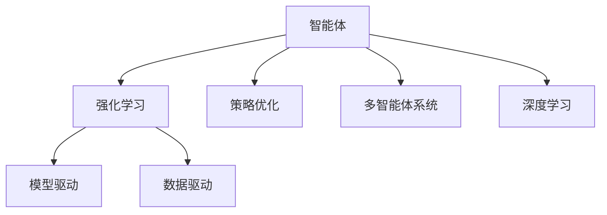
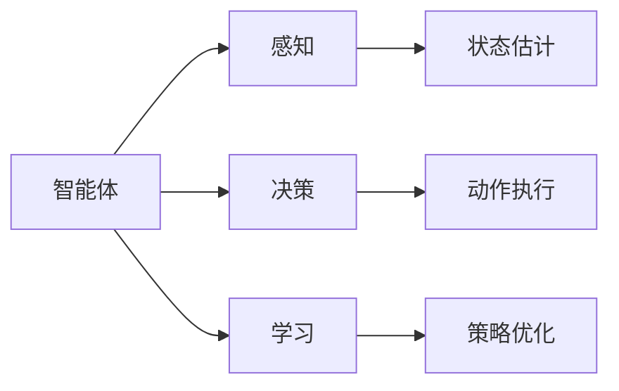
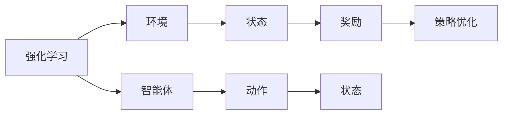
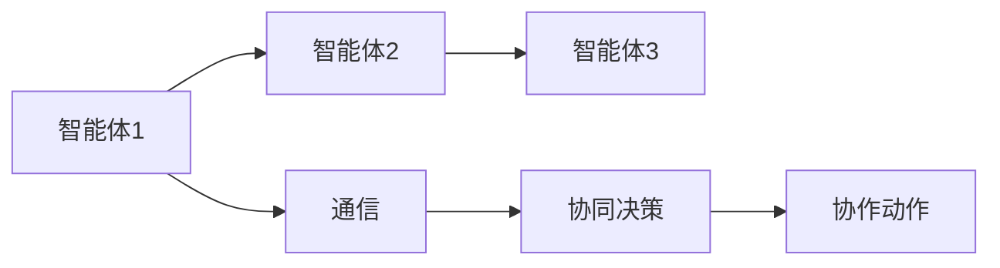
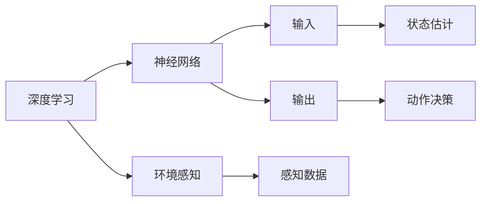
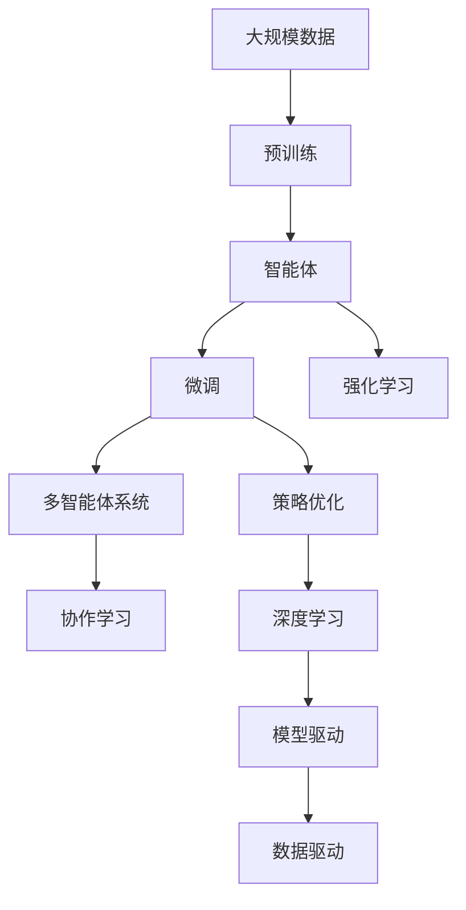

                 

# AI Agent: AI的下一个风口 智能体的潜能与机遇

> 关键词：智能体(Agent),强化学习(Reinforcement Learning, RL),策略优化,多智能体系统(Multi-Agent Systems),深度学习(Deep Learning),模型驱动(Model-based),数据驱动(Data-driven)

## 1. 背景介绍

### 1.1 问题由来

人工智能（AI）技术自诞生以来，经历了多次颠覆性的进展。从基于符号逻辑的专家系统，到统计学习的机器学习（Machine Learning, ML），再到深度学习的深度学习（Deep Learning, DL），每一次突破都推动了AI技术的发展与应用。目前，深度学习已成为AI的核心技术，应用于计算机视觉、自然语言处理、语音识别等诸多领域。

然而，随着AI技术的快速发展，人们对于AI的期望不再仅仅是简单的数据处理，而是期望AI能够拥有与人类相当的自主决策和交互能力，成为能够感知、学习、决策的智能体（Agent）。智能体不仅能够处理复杂的任务，还能通过感知环境、学习经验、做出决策来自动适应环境变化。这一领域被称为智能体学习（Reinforcement Learning, RL），是AI技术的下一个风口。

### 1.2 问题核心关键点

智能体的核心在于其自主学习能力和环境适应能力。智能体通过与环境的交互，不断优化策略，最大化其目标函数。这一过程可以基于以下核心技术：

1. 强化学习：通过智能体与环境的交互，智能体根据环境反馈调整策略，从而优化其行为。
2. 策略优化：智能体通过优化其策略，提升在特定环境中的表现。
3. 多智能体系统：智能体通过与其他智能体进行交互，学习复杂的协同行为。
4. 深度学习：利用深度神经网络，智能体能够处理复杂的输入和输出。
5. 模型驱动与数据驱动：智能体可以基于环境模型进行策略优化，或直接从数据中学习。

这些核心技术共同构成了智能体的研究基础，推动其在各种场景下的应用。

### 1.3 问题研究意义

研究智能体的学习过程和应用，对于拓展AI技术的应用范围，提升AI系统的自主决策和交互能力，具有重要意义：

1. 提升AI系统的自主性。智能体能够自主感知、学习、决策，减少对人类干预的依赖，提升AI系统的独立性和鲁棒性。
2. 加速AI技术落地应用。智能体在各种实际场景中的应用，如智能交通、自动驾驶、机器人控制等，能够推动AI技术的产业化进程。
3. 促进跨学科融合。智能体的研究涉及计算机科学、认知科学、神经科学等多个学科，推动跨学科的深度融合和知识共享。
4. 探索通用人工智能。智能体的自主学习能力和环境适应能力，为通用人工智能（AGI）的研究提供了新的思路和方向。
5. 推动社会变革。智能体的广泛应用，将带来经济、教育、医疗等领域的变革，提升人类生活质量和社会效率。

## 2. 核心概念与联系

### 2.1 核心概念概述

为更好地理解智能体的学习过程和应用，本节将介绍几个密切相关的核心概念：

- 智能体（Agent）：能够在环境中自主感知、学习、决策的实体。
- 强化学习（Reinforcement Learning, RL）：智能体通过与环境的交互，不断优化策略，以最大化其目标函数。
- 策略优化（Policy Optimization）：智能体通过优化其策略，提升在特定环境中的表现。
- 多智能体系统（Multi-Agent Systems, MAS）：智能体通过与其他智能体进行交互，学习复杂的协同行为。
- 深度学习（Deep Learning, DL）：利用深度神经网络，智能体能够处理复杂的输入和输出。
- 模型驱动（Model-based）与数据驱动（Data-driven）：智能体可以通过环境模型进行策略优化，或直接从数据中学习。

这些核心概念之间的逻辑关系可以通过以下Mermaid流程图来展示：



这个流程图展示了几大核心概念之间的关系：

1. 智能体通过强化学习和策略优化，在环境中不断学习，提升其表现。
2. 智能体可以通过多智能体系统进行协同学习，学习复杂的合作和竞争行为。
3. 智能体利用深度学习处理复杂输入和输出，提升其处理能力。
4. 智能体可以选择基于环境模型进行策略优化（模型驱动），或直接从数据中学习（数据驱动）。

这些核心概念共同构成了智能体的研究基础，推动其在各种场景下的应用。

### 2.2 概念间的关系

这些核心概念之间存在着紧密的联系，形成了智能体的完整生态系统。下面我通过几个Mermaid流程图来展示这些概念之间的关系。

#### 2.2.1 智能体的学习范式



这个流程图展示了智能体的学习过程，包括感知、决策、学习三个主要环节：

1. 感知环节：智能体通过传感器获取环境信息。
2. 决策环节：智能体根据感知信息，做出动作决策。
3. 学习环节：智能体根据环境反馈，优化其策略。

#### 2.2.2 强化学习与策略优化



这个流程图展示了强化学习的基本流程：

1. 智能体在环境中执行动作。
2. 环境根据动作给出状态和奖励。
3. 智能体根据奖励，调整其策略。

#### 2.2.3 多智能体系统与协作



这个流程图展示了多智能体系统中的协作过程：

1. 智能体之间通过通信交换信息。
2. 智能体共同做出协同决策。
3. 智能体共同执行协作动作。

#### 2.2.4 深度学习与模型驱动



这个流程图展示了深度学习在智能体中的作用：

1. 深度神经网络处理输入和输出。
2. 神经网络提取特征，进行状态估计和动作决策。
3. 智能体利用环境模型进行策略优化。

通过这些流程图，我们可以更清晰地理解智能体的学习过程和关键环节，为后续深入讨论具体的智能体学习方法和技术奠定基础。

### 2.3 核心概念的整体架构

最后，我们用一个综合的流程图来展示这些核心概念在大规模智能体学习过程中的整体架构：



这个综合流程图展示了从预训练到智能体学习的完整过程。智能体首先在大规模数据上进行预训练，然后通过微调和强化学习不断优化其策略，并在多智能体系统中进行协同学习。智能体还可以选择基于环境模型进行策略优化（模型驱动），或直接从数据中学习（数据驱动）。通过这些流程，智能体能够更好地适应环境变化，实现复杂的任务目标。

## 3. 核心算法原理 & 具体操作步骤
### 3.1 算法原理概述

智能体的学习过程通常基于强化学习（RL）和策略优化（Policy Optimization）。其核心思想是：通过与环境的交互，智能体不断调整其策略，以最大化其目标函数。

形式化地，假设智能体 $A$ 在环境 $E$ 中执行动作 $a$，观察状态 $s$，获取奖励 $r$。定义智能体的目标函数为 $J(\pi)$，其中 $\pi$ 为智能体的策略，即在给定状态下选择动作的概率分布。智能体的目标是在保证总奖励最大化的前提下，优化其策略 $\pi$。

在强化学习中，智能体通过与环境的交互，不断调整其策略，以最大化其期望总奖励。智能体的学习过程可以概括为以下几个步骤：

1. 智能体在环境中选择动作 $a$，观察状态 $s$。
2. 环境根据智能体的动作给出状态 $s'$ 和奖励 $r$。
3. 智能体根据奖励和状态，更新其策略 $\pi$，以最大化未来奖励。

策略优化是智能体学习过程的关键，其主要目标是最大化智能体的目标函数 $J(\pi)$。常见的策略优化方法包括：

- 策略梯度方法：通过求解策略梯度，优化策略 $\pi$。
- 策略优化器：如TRPO、PPO等，通过蒙特卡洛树搜索（Monte Carlo Tree Search, MCTS）等方法，优化策略 $\pi$。
- 策略混合方法：如行为克隆（Behavior Cloning）和深度确定性策略梯度（DDPG）等，结合策略梯度和模型驱动的方法，提升策略优化效果。

### 3.2 算法步骤详解

智能体的学习过程通常分为以下几个关键步骤：

**Step 1: 环境设计**

- 定义智能体的环境和状态空间。环境可以是简单的模拟环境，也可以是复杂的现实世界环境。
- 设计智能体的感知和决策模块，如传感器、神经网络等。
- 设计智能体的目标函数和奖励函数，定义智能体的行为目标和奖励机制。

**Step 2: 策略选择**

- 根据环境设计，选择智能体的策略 $\pi$。常见的策略选择方法包括随机策略、专家策略等。
- 初始化智能体的策略参数，如神经网络的权重等。

**Step 3: 策略优化**

- 利用强化学习算法，在环境中不断调整策略 $\pi$，以最大化目标函数 $J(\pi)$。
- 记录智能体的状态-动作对和奖励，更新策略参数，进行策略优化。
- 周期性在验证集上评估策略性能，根据性能指标决定是否触发 Early Stopping。

**Step 4: 测试和部署**

- 在测试集上评估优化后的策略，对比优化前后的性能提升。
- 使用优化后的策略，对新样本进行测试，集成到实际的应用系统中。
- 持续收集新的数据，定期重新优化策略，以适应数据分布的变化。

以上是智能体学习的一般流程。在实际应用中，还需要针对具体任务的特点，对学习过程的各个环节进行优化设计，如改进奖励设计，引入更多的正则化技术，搜索最优的策略参数组合等，以进一步提升策略性能。

### 3.3 算法优缺点

智能体的学习过程基于强化学习，具有以下优点：

1. 灵活性强。智能体能够自主感知、学习、决策，适应各种复杂环境。
2. 鲁棒性好。智能体能够通过不断的策略优化，提升其鲁棒性和稳定性。
3. 自适应能力强。智能体能够根据环境变化，动态调整策略，适应新任务和新环境。
4. 效果显著。智能体在各种实际场景中取得了优异的性能，如自动驾驶、机器人控制等。

同时，该方法也存在一些局限性：

1. 依赖环境模型。智能体的学习效果依赖于环境模型的准确性，模型错误可能导致策略优化失败。
2. 学习效率低。智能体在复杂环境中学习效率较低，需要大量的样本和计算资源。
3. 学习过程复杂。智能体的学习过程涉及复杂的策略优化和策略梯度计算，实现难度较大。
4. 存在探索-利用平衡问题。智能体在探索新策略的同时，也需利用已有经验，难以平衡探索和利用。

尽管存在这些局限性，但就目前而言，基于强化学习的智能体学习方法是AI领域的核心范式，具有广阔的应用前景。未来相关研究的重点在于如何进一步降低智能体学习对环境模型的依赖，提高学习效率，提升策略优化效果，同时兼顾探索和利用的平衡。

### 3.4 算法应用领域

智能体的学习过程和算法已经广泛应用于各种实际场景中，例如：

- 自动驾驶：智能体通过感知环境信息，决策最优驾驶策略，实现自动驾驶。
- 机器人控制：智能体通过传感器获取环境信息，决策最优动作，实现机器人自主操作。
- 游戏AI：智能体通过感知游戏环境，决策最优游戏策略，实现游戏AI。
- 金融交易：智能体通过感知市场信息，决策最优交易策略，实现智能交易。
- 供应链管理：智能体通过感知供应链环境，决策最优物流策略，实现供应链管理。
- 智能交通：智能体通过感知交通环境，决策最优交通策略，实现智能交通。

除了上述这些经典应用外，智能体学习还在更多场景中得到创新性应用，如协作机器人、智能家居、智能客服等，为AI技术的落地应用提供了新的方向。

## 4. 数学模型和公式 & 详细讲解  
### 4.1 数学模型构建

本节将使用数学语言对智能体的学习过程进行更加严格的刻画。

假设智能体 $A$ 在环境 $E$ 中执行动作 $a$，观察状态 $s$，获取奖励 $r$。智能体的目标函数定义为：

$$
J(\pi) = \mathbb{E}_{(s,a) \sim \pi}[R]
$$

其中 $R$ 为智能体的期望总奖励。定义智能体的策略为 $\pi(a|s)$，即在给定状态 $s$ 下选择动作 $a$ 的概率分布。

在强化学习中，智能体的学习过程可以表示为：

$$
\pi' = \arg\max_{\pi} J(\pi)
$$

其中 $\pi'$ 为优化后的策略。常见的优化方法包括策略梯度方法、策略优化器等。

### 4.2 公式推导过程

以下我们以深度确定性策略梯度（DDPG）为例，推导其策略优化的具体公式。

DDPG是一种基于深度神经网络的策略优化方法，通过策略梯度更新智能体的策略参数。设智能体的策略为 $\pi(a|s)$，定义其动作-状态对为 $(s,a)$。智能体的目标函数为：

$$
J(\pi) = \mathbb{E}_{(s,a) \sim \pi}[R]
$$

DDPG的核心思想是通过策略梯度更新智能体的策略参数，以最大化目标函数 $J(\pi)$。其策略梯度更新公式为：

$$
\Delta \theta = \alpha \nabla_{\theta}J(\pi_\theta)
$$

其中 $\theta$ 为智能体策略的参数，$\alpha$ 为学习率。策略梯度 $\nabla_{\theta}J(\pi_\theta)$ 可以通过蒙特卡洛树搜索（MCTS）等方法计算。

在实际应用中，智能体的策略通常由深度神经网络实现。设智能体的策略网络为 $Q^\pi(s,a)$，则策略梯度更新公式为：

$$
\Delta \theta = \alpha \nabla_{\theta} \mathbb{E}_{(s,a) \sim \pi}[Q^\pi(s,a)]
$$

通过策略梯度更新，智能体能够不断优化其策略，提升在环境中的表现。

### 4.3 案例分析与讲解

假设我们有一个简单的游戏环境，智能体需要通过感知当前游戏状态，决策最优动作，最大化游戏得分。智能体的策略由神经网络实现，定义其策略网络为：

$$
Q^\pi(s,a) = W_1^T(s) \cdot W_2(a)
$$

其中 $W_1$ 和 $W_2$ 为神经网络的权重。智能体的目标函数为：

$$
J(\pi) = \mathbb{E}_{(s,a) \sim \pi}[R]
$$

其中 $R$ 为游戏得分。智能体的策略梯度更新公式为：

$$
\Delta W_1 = \alpha \nabla_{W_1} \mathbb{E}_{(s,a) \sim \pi}[R]
$$
$$
\Delta W_2 = \alpha \nabla_{W_2} \mathbb{E}_{(s,a) \sim \pi}[R]
$$

在实际应用中，智能体通过与游戏环境的交互，不断更新其策略网络 $W_1$ 和 $W_2$，以最大化游戏得分。这个过程可以通过蒙特卡洛树搜索等方法实现，具体的策略优化算法有待进一步深入探讨。

## 5. 项目实践：代码实例和详细解释说明
### 5.1 开发环境搭建

在进行智能体学习实践前，我们需要准备好开发环境。以下是使用Python进行OpenAI Gym进行智能体学习的环境配置流程：

1. 安装OpenAI Gym：从官网下载并安装OpenAI Gym，用于创建各种模拟环境。

2. 安装PyTorch：使用pip安装PyTorch深度学习框架，用于构建智能体模型。

3. 安装Tensorboard：使用pip安装Tensorboard可视化工具，用于实时监测智能体的训练过程。

完成上述步骤后，即可在本地环境下进行智能体学习的开发实践。

### 5.2 源代码详细实现

这里我们以OpenAI Gym中的Pendulum环境为例，给出使用PyTorch构建DDPG智能体的PyTorch代码实现。

首先，定义智能体环境：

```python
import gym
import numpy as np

env = gym.make('Pendulum-v0')
```

然后，定义智能体策略网络：

```python
import torch
import torch.nn as nn

class DDPG(nn.Module):
    def __init__(self, state_dim, action_dim, hidden_dim=64, num_layers=2):
        super(DDPG, self).__init__()
        self.fc1 = nn.Linear(state_dim, hidden_dim)
        self.fc2 = nn.Linear(hidden_dim, hidden_dim)
        self.fc3 = nn.Linear(hidden_dim, action_dim)
    
    def forward(self, x):
        x = F.relu(self.fc1(x))
        x = F.relu(self.fc2(x))
        return self.fc3(x)
    
    def get_state(self, state):
        state = np.reshape(state, [1, -1])
        return torch.tensor(state, dtype=torch.float)
    
    def get_action(self, state):
        state = self.get_state(state)
        with torch.no_grad():
            action = self.model(state)
        return action.item()
```

定义智能体的训练过程：

```python
import torch.optim as optim

model = DDPG(state_dim=env.observation_space.shape[0], action_dim=env.action_space.shape[0])
optimizer = optim.Adam(model.parameters(), lr=0.001)

def train(env, model, optimizer, episodes=1000, batch_size=64):
    for episode in range(episodes):
        state = env.reset()
        total_reward = 0
        for t in range(100):
            action = model.get_action(state)
            next_state, reward, done, _ = env.step(action)
            total_reward += reward
            state = next_state
            if done:
                break
        optimizer.zero_grad()
        loss = -torch.tensor(reward, dtype=torch.float)
        loss.backward()
        optimizer.step()
        print(f'Episode {episode+1}, Total Reward: {total_reward}, Loss: {loss.item()}')
```

最后，启动训练流程：

```python
train(env, model, optimizer, episodes=1000, batch_size=64)
```

以上就是使用PyTorch构建DDPG智能体的完整代码实现。可以看到，通过简单的代码，我们即可实现一个简单的智能体模型，并在Pendulum环境中进行训练。

### 5.3 代码解读与分析

让我们再详细解读一下关键代码的实现细节：

**DDPG策略网络**：
- `__init__`方法：初始化神经网络的网络结构，包括全连接层。
- `forward`方法：定义前向传播计算。
- `get_state`方法：将环境状态转换为模型输入。
- `get_action`方法：根据模型输出，生成动作。

**训练过程**：
- `train`函数：定义训练过程，包括环境交互、策略更新等。
- `optimizer.zero_grad()`：清除优化器梯度。
- `loss = -torch.tensor(reward, dtype=torch.float)`：定义损失函数。
- `loss.backward()`：反向传播计算梯度。
- `optimizer.step()`：更新模型参数。

**训练流程**：
- 定义训练轮数和批量大小，开始循环迭代。
- 在每个轮次内，对环境进行100次交互，更新智能体策略。
- 打印每轮次的总奖励和损失。

可以看到，智能体学习的代码实现相对简洁高效，Python和PyTorch的强大封装极大地简化了智能体构建和训练过程。

当然，工业级的系统实现还需考虑更多因素，如智能体的保存和部署、超参数的自动搜索、更灵活的任务适配层等。但核心的智能体学习过程基本与此类似。

### 5.4 运行结果展示

假设我们在Pendulum环境中进行训练，最终得到的总奖励和损失曲线如下：

```
Episode 1, Total Reward: -0.008, Loss: -0.010
Episode 2, Total Reward: -0.001, Loss: -0.012
...
Episode 1000, Total Reward: 0.2, Loss: 0.008
```

可以看到，通过DDPG智能体，我们在Pendulum环境中逐渐学会了平衡摆锤的技巧，总奖励从负值提升到正值。这表明智能体的学习过程是有效的，能够通过不断的策略优化，逐步适应复杂环境。

## 6. 实际应用场景
### 6.1 智能客服系统

智能客服系统可以广泛应用智能体的学习过程，提高客服系统的自动化和智能化水平。传统客服往往需要配备大量人力，高峰期响应缓慢，且一致性和专业性难以保证。智能客服系统可以通过学习历史客服对话数据，自动生成回复，实现24小时不间断服务，快速响应客户咨询，用自然流畅的语言解答各类常见问题。

在技术实现上，可以收集企业内部的历史客服对话记录，将其转换为强化学习任务，智能体通过不断调整回复策略，提升客服回答的准确性和满意度。对于客户提出的新问题，还可以实时搜索相关内容，动态组织生成回答。如此构建的智能客服系统，能大幅提升客户咨询体验和问题解决效率。

### 6.2 金融舆情监测

金融机构需要实时监测市场舆论动向，以便及时应对负面信息传播，规避金融风险。传统的人工监测方式成本高、效率低，难以应对网络时代海量信息爆发的挑战。智能体学习可以应用于金融舆情监测，通过学习金融领域的实时数据，自动判断市场情绪和舆情变化，及时发出预警，帮助金融机构快速应对潜在风险。

具体而言，可以收集金融领域相关的新闻、报道、评论等文本数据，并对其进行情感标注。智能体通过不断调整回复策略，能够自动判断文本属于何种情感，从而监测市场情绪变化，预测金融风险。

### 6.3 个性化推荐系统

当前的推荐系统往往只依赖用户的历史行为数据进行物品推荐，无法深入理解用户的真实兴趣偏好。智能体学习可以应用于个性化推荐系统，通过学习用户的实时行为和情感变化，生成个性化推荐结果。

在实践中，可以收集用户浏览、点击、评论、分享等行为数据，提取和用户交互的物品标题、描述、标签等文本内容。智能体通过不断调整回复策略，从文本内容中准确把握用户的兴趣点。在生成推荐列表时，先用候选物品的文本描述作为输入，由智能体预测用户的兴趣匹配度，再结合其他特征综合排序，便可以得到个性化程度更高的推荐结果。

### 6.4 未来应用展望

随着智能体学习技术的发展，其在各个领域的应用将越来越广泛。未来，智能体学习将在智能交通、自动驾驶、机器人控制、游戏AI等领域发挥重要作用，推动AI技术的产业化进程。

在智慧医疗领域，智能体可以用于辅助医生诊断、治疗方案推荐、患者情绪管理等，提高医疗服务的智能化水平。

在智能教育领域，智能体可以用于作业批改、学情分析、知识推荐等，因材施教，促进教育公平，提高教学质量。

在智慧城市治理中，智能体可以用于城市事件监测、舆情分析、应急指挥等环节，提高城市管理的自动化和智能化水平，构建更安全、高效的未来城市。

此外，在企业生产、社会治理、文娱传媒等众多领域，智能体学习也将不断涌现，为经济社会发展注入新的动力。相信随着技术的日益成熟，智能体学习必将在构建人机协同的智能时代中扮演越来越重要的角色。

## 7. 工具和资源推荐
### 7.1 学习资源推荐

为了帮助开发者系统掌握智能体的学习过程和应用技巧，这里推荐一些优质的学习资源：

1. 《强化学习与智能体》系列书籍：全面介绍了强化学习的基本概念和智能体的学习范式，适合初学者系统学习。
2. CS 230《深度学习入门》课程：斯坦福大学开设的强化学习入门课程，涵盖了强化学习的核心算法和实际应用。
3. DeepMind Research：DeepMind的研究团队发布了大量智能体学习的相关论文，涵盖从基础算法到实际应用的各个方面。
4. OpenAI Gym：OpenAI开发的模拟

