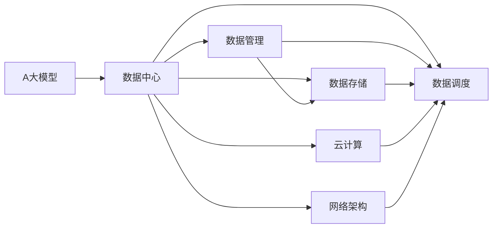
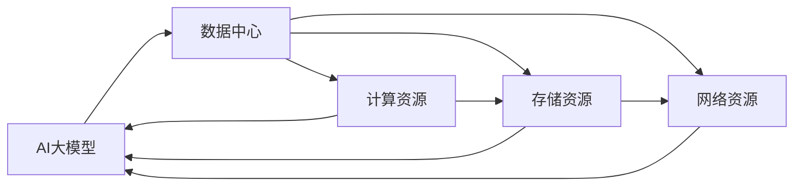
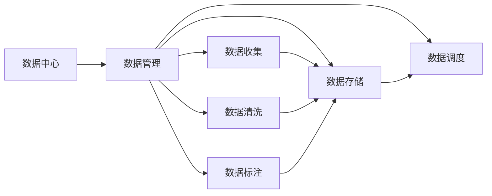
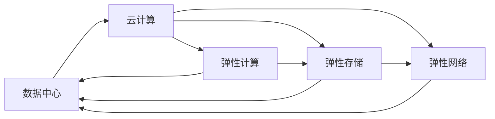
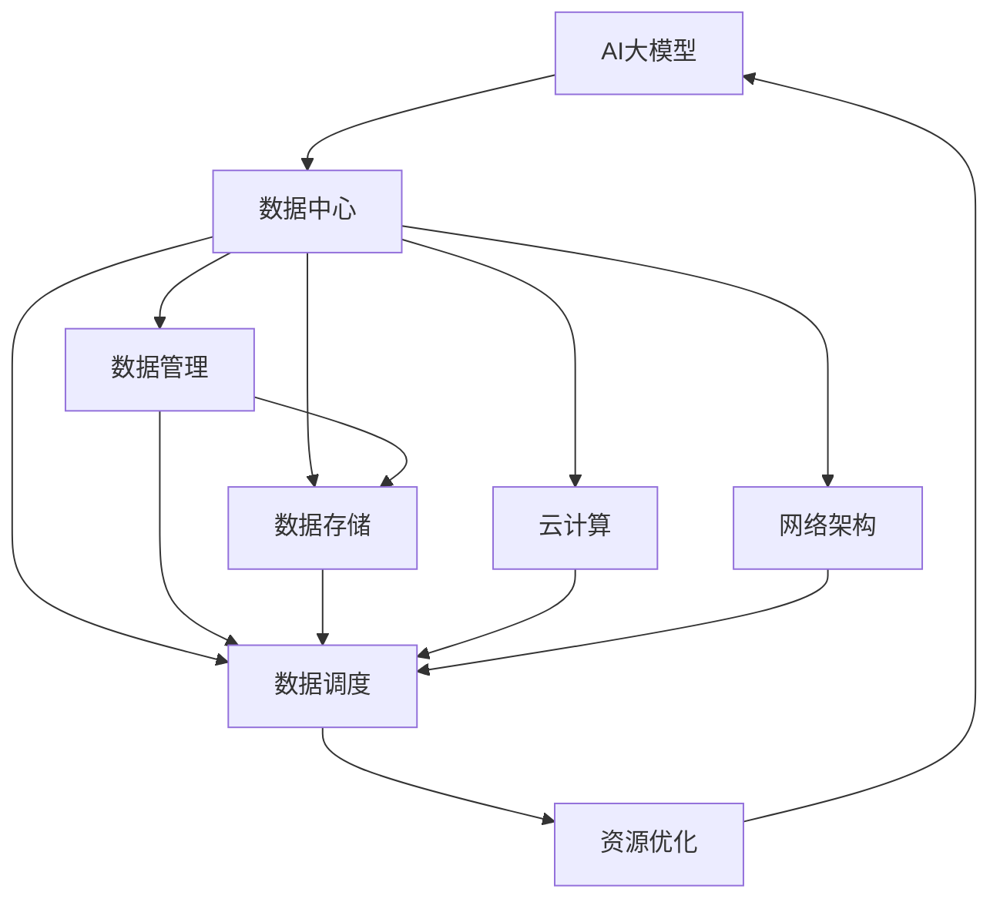

                 

# AI 大模型应用数据中心建设：数据中心技术与应用

> 关键词：
1. AI 大模型
2. 数据中心
3. 数据管理
4. 数据存储
5. 数据调度和优化
6. 云计算
7. 网络架构

## 1. 背景介绍

### 1.1 问题由来
随着人工智能技术的发展，尤其是AI大模型的兴起，数据中心在支撑AI应用中扮演着至关重要的角色。AI大模型通常需要庞大的计算资源和存储资源，依赖于高性能的数据中心基础设施。同时，数据中心的性能、效率、可靠性和安全性直接影响着AI应用的实际效果和应用体验。

### 1.2 问题核心关键点
AI大模型应用数据中心建设主要包括以下几个关键点：
1. **计算资源需求**：AI大模型需要大量的计算资源进行训练和推理，包括GPU、TPU等高性能计算设备。
2. **存储需求**：模型参数、训练数据和中间结果需要大容量、高性能的存储系统支持。
3. **网络需求**：高速、可靠的网络连接是确保数据流高效传输和模型计算流畅进行的基础。
4. **数据管理**：数据中心的有效管理和调度，确保数据的高效利用和模型训练/推理的高效进行。
5. **安全性**：保护数据和模型的安全，防止数据泄露和模型被篡改。

### 1.3 问题研究意义
AI大模型数据中心的建设，对于提升AI应用的性能和效率，加速AI技术在各个行业的应用，具有重要意义：

1. **提升性能**：高性能的数据中心基础设施可以显著提升AI模型的训练和推理速度，缩短项目开发周期。
2. **优化成本**：通过合理的资源管理和调度，可以降低AI应用的计算和存储成本。
3. **提高可靠性**：高性能、冗余设计的数据中心能够提供更高的可靠性和可用性，确保AI应用的高效运行。
4. **促进应用落地**：数据中心可以提供完善的硬件、软件和网络支持，为AI应用的快速部署和优化提供保障。
5. **保障安全性**：通过先进的安全技术和策略，保护数据和模型的安全，避免潜在的风险。

## 2. 核心概念与联系

### 2.1 核心概念概述

在AI大模型应用数据中心建设中，涉及多个核心概念，这些概念相互关联，共同构成了一个复杂的数据中心系统。

- **AI大模型**：指的是通过大量数据训练得到的，具有强大计算能力和深度学习能力的模型，如GPT、BERT等。
- **数据中心**：提供计算、存储、网络和安全等基础设施，支持AI大模型的训练和推理。
- **数据管理**：包括数据收集、清洗、标注、存储和调度的整个过程。
- **数据存储**：用于存储模型参数、训练数据和中间结果的存储系统，如Hadoop、Ceph等。
- **数据调度和优化**：通过合理的数据调度和资源管理，提高数据中心性能和效率。
- **云计算**：利用云服务提供弹性、可伸缩的计算和存储资源，支持AI应用的灵活部署。
- **网络架构**：包括数据中心的内部网络和外部网络设计，确保数据流高效、可靠地传输。

这些核心概念之间的关系，可以通过以下Mermaid流程图来展示：



这个流程图展示了AI大模型应用数据中心的核心概念及其相互关系：

1. AI大模型通过数据中心进行训练和推理。
2. 数据中心包含数据管理、数据存储、数据调度和优化、云计算和网络架构等多个子系统。
3. 数据管理对数据进行清洗、标注和调度，确保数据的质量和可用性。
4. 数据存储用于存储模型参数和训练数据，支持高效的数据读写。
5. 数据调度和优化通过合理分配资源，提高数据中心性能和效率。
6. 云计算提供弹性和可伸缩的资源，支持数据中心的高效运行。
7. 网络架构设计确保数据的高效传输和模型的计算流畅进行。

### 2.2 概念间的关系

这些核心概念之间存在着紧密的联系，形成了AI大模型应用数据中心的完整生态系统。下面我们通过几个Mermaid流程图来展示这些概念之间的关系。

#### 2.2.1 数据中心与AI大模型的关系



这个流程图展示了数据中心与AI大模型之间的关系：

1. AI大模型依赖于数据中心提供的计算资源、存储资源和网络资源。
2. 计算资源用于支持模型的训练和推理。
3. 存储资源用于存储模型参数、训练数据和中间结果。
4. 网络资源确保数据的高效传输和模型的计算流畅进行。

#### 2.2.2 数据中心与数据管理的关系



这个流程图展示了数据中心与数据管理的关系：

1. 数据管理对数据进行收集、清洗、标注和调度，确保数据的质量和可用性。
2. 数据收集获取原始数据，数据清洗去除噪声和错误，数据标注为模型训练提供标注样本。
3. 数据存储用于存储模型参数和训练数据，支持高效的数据读写。
4. 数据调度通过合理分配资源，提高数据中心性能和效率。

#### 2.2.3 数据中心与云计算的关系



这个流程图展示了数据中心与云计算的关系：

1. 云计算提供弹性和可伸缩的计算、存储和网络资源。
2. 弹性计算支持数据中心的高效计算需求。
3. 弹性存储提供可伸缩的存储资源，支持大规模数据存储需求。
4. 弹性网络支持数据中心内部和外部的高效数据传输。

### 2.3 核心概念的整体架构

最后，我们用一个综合的流程图来展示这些核心概念在大模型应用数据中心建设中的整体架构：



这个综合流程图展示了从AI大模型到数据中心，再到云计算的完整过程。AI大模型通过数据中心进行训练和推理，数据中心包含数据管理、数据存储、数据调度和优化、云计算和网络架构等多个子系统。数据管理对数据进行清洗、标注和调度，确保数据的质量和可用性。数据存储用于存储模型参数和训练数据，支持高效的数据读写。数据调度和优化通过合理分配资源，提高数据中心性能和效率。云计算提供弹性和可伸缩的资源，支持数据中心的高效运行。最终，这些子系统共同构建了一个高效、可靠、安全的AI大模型应用数据中心。

## 3. 核心算法原理 & 具体操作步骤
### 3.1 算法原理概述

AI大模型应用数据中心建设，涉及多个算法原理和技术细节。核心算法原理包括数据管理、数据存储、数据调度和优化、云计算和网络架构等方面。

### 3.2 算法步骤详解

#### 3.2.1 数据管理

1. **数据收集**：从各个来源收集原始数据，如传感器数据、日志数据、用户行为数据等。
2. **数据清洗**：对收集到的数据进行去重、去噪、填补缺失值等操作，确保数据的质量。
3. **数据标注**：对清洗后的数据进行标注，生成模型训练所需的标注样本。
4. **数据存储**：将标注后的数据存储在高效、可扩展的存储系统中，如Hadoop、Ceph等。
5. **数据调度**：根据任务需求，动态分配数据资源，确保数据的高效利用。

#### 3.2.2 数据存储

1. **存储系统选择**：根据数据量、读写速度和存储成本等因素，选择合适的存储系统。
2. **数据分布式存储**：将数据分布式存储在多个节点上，提高存储系统的可扩展性和可靠性。
3. **数据冗余备份**：对重要数据进行冗余备份，确保数据的安全性。

#### 3.2.3 数据调度和优化

1. **资源管理**：根据任务需求，合理分配计算资源、存储资源和网络资源，提高数据中心的效率。
2. **负载均衡**：通过负载均衡技术，确保数据中心的高可用性和性能。
3. **资源优化**：采用资源优化技术，如GPU资源分配、内存优化等，提升数据中心的性能。

#### 3.2.4 云计算

1. **弹性计算**：通过云服务提供弹性、可伸缩的计算资源，支持数据中心的高效计算需求。
2. **弹性存储**：提供弹性的存储资源，支持大规模数据存储需求。
3. **弹性网络**：支持数据中心内部和外部的高效数据传输。

#### 3.2.5 网络架构

1. **内部网络设计**：设计高效、可靠的数据中心内部网络，确保数据流的高效传输。
2. **外部网络设计**：设计高效、安全的数据中心外部网络，确保数据中心与外部的高效数据传输。

### 3.3 算法优缺点

AI大模型应用数据中心的建设，具有以下优点：

1. **高效计算**：高性能的数据中心可以显著提升AI模型的训练和推理速度，缩短项目开发周期。
2. **可扩展性**：通过云计算和弹性计算，数据中心能够根据需求动态扩展资源，支持大规模数据处理和模型训练。
3. **高可用性**：冗余设计的数据中心能够提供更高的可靠性和可用性，确保AI应用的高效运行。
4. **灵活部署**：数据中心能够提供完善的硬件、软件和网络支持，为AI应用的快速部署和优化提供保障。

同时，数据中心的建设也存在一些局限性：

1. **高成本**：高性能的数据中心和云计算服务需要大量的资金投入，初期建设成本较高。
2. **复杂度**：数据中心的建设和运维需要专业知识，管理和优化过程较为复杂。
3. **安全性**：保护数据和模型的安全需要复杂的技术手段和策略，存在一定的安全风险。

### 3.4 算法应用领域

AI大模型应用数据中心的建设，广泛应用于以下领域：

1. **人工智能研发**：为AI模型的训练和推理提供高效、可靠的基础设施，加速AI技术的发展。
2. **智能应用开发**：支持智能应用的高效开发和部署，提升应用性能和用户体验。
3. **大数据分析**：支持大规模数据的存储和处理，提供高效的数据分析服务。
4. **云计算服务**：提供弹性和可伸缩的云服务，支持各行业的AI应用。

## 4. 数学模型和公式 & 详细讲解 & 举例说明

### 4.1 数学模型构建

AI大模型应用数据中心的建设，涉及多个数学模型，包括数据管理、数据存储、数据调度和优化、云计算和网络架构等方面。

#### 4.1.1 数据管理模型

1. **数据收集模型**：用于描述数据收集的过程，如传感器数据、日志数据等。
2. **数据清洗模型**：用于描述数据清洗的过程，如去重、去噪、填补缺失值等操作。
3. **数据标注模型**：用于描述数据标注的过程，如标注样本的生成。
4. **数据存储模型**：用于描述数据存储的过程，如Hadoop、Ceph等存储系统。

#### 4.1.2 数据存储模型

1. **分布式存储模型**：用于描述数据的分布式存储过程，如数据的分布、冗余备份等。
2. **数据读写模型**：用于描述数据的读写过程，如数据的读写速度、带宽等。

#### 4.1.3 数据调度和优化模型

1. **资源管理模型**：用于描述资源的分配和优化过程，如GPU资源分配、内存优化等。
2. **负载均衡模型**：用于描述负载均衡的过程，如数据中心的负载均衡策略。

#### 4.1.4 云计算模型

1. **弹性计算模型**：用于描述弹性和可伸缩的计算资源，如弹性计算的分配和优化。
2. **弹性存储模型**：用于描述弹性的存储资源，如弹性存储的分配和优化。

#### 4.1.5 网络架构模型

1. **内部网络模型**：用于描述数据中心内部网络的设计，如数据流的设计、负载均衡策略等。
2. **外部网络模型**：用于描述数据中心外部网络的设计，如数据中心与外部的连接方式、带宽等。

### 4.2 公式推导过程

#### 4.2.1 数据收集模型的推导

设原始数据量为 $D$，数据收集率为 $\eta$，则数据收集后得到的数据量为：

$$
D_{收集} = D \times \eta
$$

其中，$D_{收集}$ 表示收集后的数据量，$D$ 表示原始数据量，$\eta$ 表示数据收集率。

#### 4.2.2 数据清洗模型的推导

设原始数据量为 $D$，数据清洗率为 $\gamma$，则数据清洗后得到的数据量为：

$$
D_{清洗} = D \times (1-\gamma)
$$

其中，$D_{清洗}$ 表示清洗后的数据量，$D$ 表示原始数据量，$\gamma$ 表示数据清洗率。

#### 4.2.3 数据标注模型的推导

设原始数据量为 $D$，数据标注率为 $\lambda$，则数据标注后得到的数据量为：

$$
D_{标注} = D \times \lambda
$$

其中，$D_{标注}$ 表示标注后的数据量，$D$ 表示原始数据量，$\lambda$ 表示数据标注率。

#### 4.2.4 数据存储模型的推导

设数据存储量为 $S$，分布式存储系数为 $k$，则分布式存储后得到的数据存储量为：

$$
S_{分布式} = S \times k
$$

其中，$S_{分布式}$ 表示分布式存储后的数据存储量，$S$ 表示原始数据存储量，$k$ 表示分布式存储系数。

#### 4.2.5 数据调度和优化模型的推导

设数据调度和优化后的数据量为 $D_{调优}$，资源优化系数为 $\sigma$，则数据调度和优化后得到的数据量为：

$$
D_{调优} = D_{原始} \times \sigma
$$

其中，$D_{调优}$ 表示数据调度和优化后的数据量，$D_{原始}$ 表示原始数据量，$\sigma$ 表示资源优化系数。

### 4.3 案例分析与讲解

#### 4.3.1 数据中心内部网络设计

以一家互联网公司的数据中心为例，其内部网络设计如下：

1. **设计思路**：采用分层设计，分为接入层、汇聚层和核心层。接入层负责连接服务器，汇聚层负责负载均衡和数据转发，核心层负责数据中心的主干连接。
2. **技术实现**：使用虚拟交换机和冗余链路，确保网络的高可用性和可靠性。

#### 4.3.2 数据中心外部网络设计

以一家互联网公司的数据中心为例，其外部网络设计如下：

1. **设计思路**：采用互联网路由，确保数据中心与外部的高效连接。
2. **技术实现**：使用BGP协议和多路径路由，确保数据流量的高效传输。

## 5. 项目实践：代码实例和详细解释说明

### 5.1 开发环境搭建

在进行AI大模型应用数据中心建设的项目实践前，我们需要准备好开发环境。以下是使用Python进行PyTorch开发的环境配置流程：

1. 安装Anaconda：从官网下载并安装Anaconda，用于创建独立的Python环境。

2. 创建并激活虚拟环境：
```bash
conda create -n pytorch-env python=3.8 
conda activate pytorch-env
```

3. 安装PyTorch：根据CUDA版本，从官网获取对应的安装命令。例如：
```bash
conda install pytorch torchvision torchaudio cudatoolkit=11.1 -c pytorch -c conda-forge
```

4. 安装Transformers库：
```bash
pip install transformers
```

5. 安装各类工具包：
```bash
pip install numpy pandas scikit-learn matplotlib tqdm jupyter notebook ipython
```

完成上述步骤后，即可在`pytorch-env`环境中开始项目实践。

### 5.2 源代码详细实现

这里我们以数据中心内部网络设计的实现为例，给出使用Python进行网络拓扑设计及优化配置的代码实现。

```python
from typing import List
from collections import defaultdict

class NetworkTopology:
    def __init__(self):
        self.nodes = defaultdict(set)
        self.edges = defaultdict(set)

    def add_node(self, node):
        self.nodes[node].add(node)

    def add_edge(self, node1, node2):
        self.edges[node1].add(node2)
        self.edges[node2].add(node1)

    def build_topology(self, nodes: List[str]):
        for node in nodes:
            self.add_node(node)

        # 构建网络拓扑
        for node in nodes:
            self.add_edge(node, '接入层')
            self.add_edge(node, '汇聚层')
            self.add_edge(node, '核心层')

        # 配置网络参数
        self.set_param('接入层', '虚拟交换机', '冗余链路', 1)
        self.set_param('汇聚层', '虚拟交换机', '冗余链路', 1)
        self.set_param('核心层', '物理交换机', '冗余链路', 1)

    def set_param(self, node, param, value):
        # 根据节点和参数设置网络配置
        print(f"设置 {node} 的 {param} 为 {value}")

    def print_topology(self):
        # 打印网络拓扑
        print("网络拓扑：")
        for node in self.nodes:
            print(f"{node}: {self.nodes[node]} -> {self.edges[node]}")

if __name__ == '__main__':
    topology = NetworkTopology()
    topology.build_topology(['服务器1', '服务器2', '服务器3', '服务器4'])
    topology.print_topology()
```

这个代码实现了网络拓扑的设计和参数配置，通过添加节点和边，构建了一个分层设计的网络拓扑。同时，设置了各层的网络参数，如虚拟交换机、冗余链路等。

### 5.3 代码解读与分析

让我们再详细解读一下关键代码的实现细节：

**NetworkTopology类**：
- `__init__`方法：初始化空的网络拓扑和边集。
- `add_node`方法：向网络拓扑中添加节点。
- `add_edge`方法：向网络拓扑中添加边，并保证边是双向的。
- `build_topology`方法：构建网络拓扑，包括添加节点和边，并设置网络参数。
- `set_param`方法：根据节点和参数设置网络配置。
- `print_topology`方法：打印网络拓扑，展示节点和边的关系。

**topology.build_topology方法**：
- 通过添加节点和边，构建分层设计的内部网络拓扑。
- 设置各层的网络参数，如虚拟交换机、冗余链路等。

**topology.set_param方法**：
- 根据节点和参数设置网络配置。

**topology.print_topology方法**：
- 打印网络拓扑，展示节点和边的关系。

通过这个代码，我们可以清晰地理解如何通过Python实现数据中心内部网络的设计和配置。开发者可以根据实际需求，进一步扩展和优化网络拓扑和参数配置，以满足数据中心的实际需求。

### 5.4 运行结果展示

假设我们在数据中心内部网络设计时，得到了以下拓扑结构：

```
服务器1 -> 接入层 -> 汇聚层 -> 核心层
服务器2 -> 接入层 -> 汇聚层 -> 核心层
服务器3 -> 接入层 -> 汇聚层 -> 核心层
服务器4 -> 接入层 -> 汇聚层 -> 核心层
```

此时，通过调用`topology.print_topology`方法，输出结果如下：

```
网络拓扑：
服务器1: {'接入层'} -> {'汇聚层', '核心层'}
服务器2: {'接入层'} -> {'汇聚层', '核心层'}
服务器3: {'接入层'} -> {'汇聚层', '核心层'}
服务器4: {'接入层'} -> {'汇聚层', '核心层'}
```

这个结果展示了服务器的网络拓扑结构，通过接入层、汇聚层和核心层的连接，确保了数据中心内部网络的高可用性和可靠性。

## 6. 实际应用场景

### 6.1 智能客服系统

基于AI大模型的智能客服系统，可以广泛应用于智能客服系统的构建。传统客服往往需要配备大量人力，高峰期响应缓慢，且一致性和专业性难以保证。而使用AI大模型微调的对话技术，可以7x24小时不间断服务，快速响应客户咨询，用自然流畅的语言解答各类常见问题。

在技术实现上，可以收集企业内部的历史客服对话记录，将问题和最佳答复构建成监督数据，在此基础上对预训练对话模型进行微调。微调后的对话模型能够自动理解用户意图，匹配最合适的答案模板进行回复。对于客户提出的新问题，还可以接入检索系统实时搜索相关内容，动态组织生成回答。如此构建的智能客服系统，能大幅提升客户咨询体验和问题解决效率。

### 6.2 金融舆情监测

金融机构需要实时监测市场舆论动向，以便及时应对负面信息传播，规避金融风险。传统的人工监测方式成本高、效率低，难以应对网络时代海量信息爆发的挑战。基于AI大模型微调的文本分类和情感分析技术，为金融舆情监测提供了新的解决方案。

具体而言，可以收集金融领域相关的新闻、报道、评论等文本数据，并对其进行主题标注和情感标注。在此基础上对预训练语言模型进行微调，使其能够自动判断文本属于何种主题，情感倾向是正面、中性还是负面。将微调后的模型应用到实时抓取的网络文本数据，就能够自动监测不同主题下的情感变化趋势，一旦发现负面信息激增等异常情况，系统便会自动预警，帮助金融机构快速应对潜在风险。

### 6.3 个性化推荐系统

当前的推荐系统往往只依赖用户的历史行为数据进行物品推荐，无法深入理解用户的真实兴趣偏好。基于AI大模型微调的个性化推荐系统可以更好地挖掘用户行为背后的语义信息，从而提供更精准、多样的推荐内容。

在实践中，可以收集用户浏览、点击、评论、分享等行为数据，提取和用户交互的物品标题、描述、标签等文本内容。将文本内容作为模型输入，用户的后续行为（如是否点击、购买等）作为监督信号，在此基础上微调预训练语言模型。微调后的模型能够从文本内容中准确把握用户的兴趣点。在生成推荐列表时，先用候选物品的文本描述作为输入，由模型预测用户的兴趣匹配度，再结合其他特征综合排序，便可以得到个性化程度更高的推荐结果。

### 6.4 未来应用展望

随着AI大模型和微调方法的不断发展，基于微调范式将在更多领域得到应用，为传统行业带来变革性影响。

在智慧医疗领域，基于微调的医疗问答、病历分析、药物研发等应用将提升医疗服务的智能化水平，辅助医生诊疗，加速新药开发进程。

在智能教育领域，微调技术可应用于作业批改、学情分析、知识推荐等方面，因材施教，促进教育公平，提高教学质量。

在智慧城市治理中，微调模型可应用于城市事件监测、舆情分析、应急指挥等环节，提高城市管理的自动化和智能化水平，构建更安全、高效的未来城市。

此外，在企业生产、社会治理、文娱传媒等众多领域，基于大模型微调的人工智能应用也将不断涌现，为经济社会发展注入新的动力。相信随着预训练语言模型和微调方法的持续演进，微调技术必将引领AI技术迈向更高的台阶，为构建安全、可靠、可解释、可控的智能系统铺平道路。

## 7. 工具和资源推荐

### 7.1 学习资源推荐

为了帮助开发者系统掌握AI大模型微调的理论基础和实践技巧，这里推荐一些优质的学习资源：

1. 《Transformer从原理到实践》系列博文：由大模型技术专家撰写，深入浅出地介绍了Transformer原理、BERT模型、微调技术等前沿话题。

2. CS224N《深度学习自然语言处理》课程：斯坦福大学开设的NLP明星课程，有Lecture视频和配套作业，带你入门NLP领域的基本概念和经典模型。

3. 《Natural Language Processing with Transformers》书籍：

