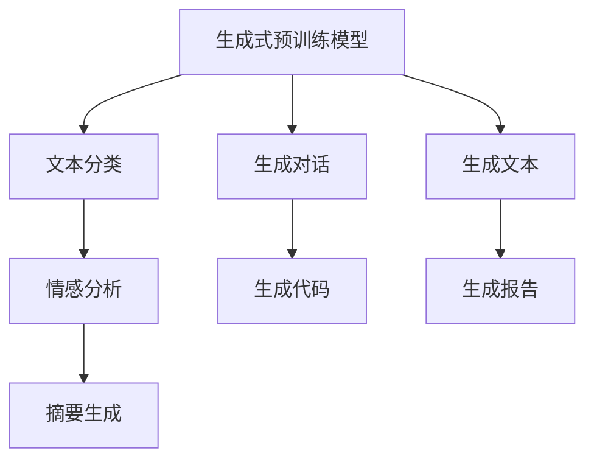
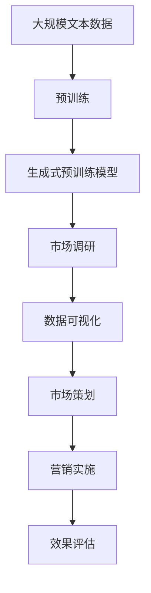

                 

# AIGC从入门到实战：AI 助力市场调研和策划，让营销如虎添翼

> 关键词：AIGC, 市场调研, 策划, 营销, AI赋能, 生成式预训练模型(GPT)

## 1. 背景介绍

### 1.1 问题由来
随着人工智能技术的发展，生成式预训练模型（Generative Pre-trained Transformer, GPT）和自然语言处理（Natural Language Processing, NLP）技术的进步，人工智能生成内容（Artificial Intelligence Generated Content, AIGC）逐渐成为了企业和个人创作的利器。特别是在市场营销领域，AI 助力的内容生成、数据洞察和个性化推荐等能力，为传统营销模式带来了颠覆性的变革。

然而，面对大量的市场调研数据，如何高效地进行数据处理、分析和可视化，为市场策划提供科学依据，仍是许多企业面临的难题。传统的市场调研方法往往依赖人工数据分析和经验判断，不仅效率低下，且容易受到人为偏见的影响。而利用AI技术，特别是生成式预训练模型，可以更快速、更准确地从海量的市场数据中提炼出有价值的信息，为市场策划提供坚实的科学依据，助力企业在激烈的市场竞争中占据先机。

### 1.2 问题核心关键点
AIGC在市场调研和策划中的应用，核心在于如何通过AI生成式预训练模型，高效、准确地从市场数据中提炼出有价值的信息，并结合可视化工具，为市场策划提供科学依据。该过程涉及数据预处理、特征工程、模型训练、结果分析和可视化等多个环节，需要在AI技术的支撑下进行。

关键技术点包括：
- 生成式预训练模型（如GPT系列）的构建与应用
- 市场数据的收集与预处理
- 数据特征的提取与融合
- 模型训练与优化
- 结果的分析和可视化呈现

通过AIGC技术，企业可以在有限的时间内，快速、准确地从市场数据中提炼出关键信息，为市场策划提供依据，同时结合可视化工具，使决策过程更加直观、易理解。这不仅提高了市场策划的效率，还减少了人为偏见，确保决策的科学性。

### 1.3 问题研究意义
研究AIGC技术在市场调研和策划中的应用，对于推动AI技术在市场营销中的落地应用，提升市场决策的科学性和效率，具有重要意义：

1. 提升市场调研效率：AI技术可以快速处理海量市场数据，减少人工分析和手动操作的负担，显著提升市场调研的效率。
2. 提高市场决策质量：通过AI生成式预训练模型，可以从数据中自动提炼出关键信息，减少人为偏见，确保决策的客观性。
3. 增强市场策划能力：结合可视化工具，可以将分析结果直观呈现，使市场策划人员更容易理解和应用这些信息，提升策划效果。
4. 支持数据驱动决策：通过AIGC技术，企业可以实现从数据到决策的全流程自动化，减少人为干预，提高决策的科学性和可靠性。
5. 优化资源配置：AI技术可以自动进行数据分析和挖掘，帮助企业优化资源配置，提高营销投入的回报率。

## 2. 核心概念与联系

### 2.1 核心概念概述

为更好地理解AIGC在市场调研和策划中的应用，本节将介绍几个关键概念：

- 生成式预训练模型（GPT系列）：以自回归或自编码模型为代表的生成式预训练模型，通过在大规模无标签文本语料上进行预训练，学习通用语言表示，具备强大的语言理解和生成能力。
- 自然语言处理（NLP）：涉及文本处理、文本分类、信息抽取、情感分析等任务的技术领域。
- 市场调研（Market Research）：通过各种调查方式收集市场数据，分析市场现状和趋势，为决策提供依据。
- 市场策划（Market Planning）：根据市场调研结果，制定营销策略和计划，实施市场活动。
- 生成式预训练模型与NLP的结合：将生成式预训练模型应用于NLP任务中，可以显著提升模型在特定任务上的性能。

这些概念之间的逻辑关系可以通过以下Mermaid流程图来展示：


这个流程图展示了大模型在NLP领域的应用路径，以及其在市场调研和策划中的应用。

### 2.2 概念间的关系

这些核心概念之间存在着紧密的联系，形成了AI辅助市场调研和策划的完整生态系统。下面通过几个Mermaid流程图来展示这些概念之间的关系。

#### 2.2.1 生成式预训练模型与应用场景



这个流程图展示了生成式预训练模型在NLP领域的具体应用场景，包括文本分类、情感分析、摘要生成、对话生成、代码生成、报告生成等。

#### 2.2.2 市场调研与AI的关系


这个流程图展示了市场调研中数据处理和分析的各个环节，以及AI技术在其中扮演的角色。

#### 2.2.3 市场策划与AI的关系


这个流程图展示了市场策划过程中各个环节，以及AI技术在其中提供的数据支持和决策辅助。

### 2.3 核心概念的整体架构

最后，我们用一个综合的流程图来展示这些核心概念在大模型应用过程中的整体架构：



这个综合流程图展示了从预训练到大模型应用的完整过程，以及在大模型应用过程中各个环节的关系。

## 3. 核心算法原理 & 具体操作步骤
### 3.1 算法原理概述

AIGC在市场调研和策划中的应用，核心在于如何通过AI生成式预训练模型，高效、准确地从市场数据中提炼出有价值的信息，并结合可视化工具，为市场策划提供科学依据。该过程涉及数据预处理、特征工程、模型训练、结果分析和可视化等多个环节，需要在AI技术的支撑下进行。

具体而言，生成式预训练模型通过在大规模无标签文本语料上进行预训练，学习到了丰富的语言表示。这种表示可以通过微调（Fine-tuning）应用于特定的NLP任务，如文本分类、情感分析、摘要生成等，从而提取数据中的关键信息。通过结合可视化工具，可以将这些信息直观呈现，为市场策划提供决策依据。

### 3.2 算法步骤详解

基于生成式预训练模型在市场调研和策划中的应用，算法主要分为以下几步：

1. **数据预处理**：收集市场调研数据，包括消费者调查、销售数据、市场趋势等，并进行清洗和预处理，去除噪声和异常值，保证数据的质量。

2. **特征提取与融合**：使用生成式预训练模型提取数据中的关键特征，并结合其他数据源，如社交媒体、新闻报道等，进行多源数据的融合，获得更加全面的市场信息。

3. **模型微调**：选择适当的生成式预训练模型，如GPT系列，并在特定任务上进行微调，以提取关键信息。微调过程中需要选择合适的损失函数、优化器和超参数，避免过拟合。

4. **结果分析**：通过可视化工具，将微调结果以图表、报告等形式呈现，便于市场策划人员理解和应用。

5. **市场策划**：结合分析结果，制定市场策划方案，包括目标受众、营销策略、活动实施等。

### 3.3 算法优缺点

AIGC技术在市场调研和策划中的应用，具有以下优点：
1. 高效性：AI技术可以快速处理海量市场数据，提高市场调研的效率。
2. 客观性：生成式预训练模型可以自动提取关键信息，减少人为偏见，提高决策的客观性。
3. 可视化：结合可视化工具，可以直观呈现分析结果，使市场策划人员更容易理解和应用。

同时，也存在一些缺点：
1. 数据质量要求高：AI模型依赖高质量的数据输入，如果数据存在噪声和缺失，模型效果会受到影响。
2. 技术门槛高：需要具备一定的AI技术背景，才能有效利用AI技术进行市场调研和策划。
3. 黑箱问题：生成式预训练模型的内部机制复杂，难以解释其决策过程，可能影响用户信任。

### 3.4 算法应用领域

AIGC技术在市场调研和策划中的应用，已经涵盖了多个领域，包括但不限于：

- 消费者行为分析：通过分析消费者的购买行为、偏好等信息，了解消费者需求，制定个性化营销策略。
- 市场趋势预测：基于历史销售数据和市场动态，预测未来的市场趋势和变化，帮助企业制定长远的战略规划。
- 竞争对手分析：通过分析竞争对手的市场表现、产品策略等信息，制定针对性的市场策略。
- 产品定位与优化：结合消费者反馈和市场调研结果，优化产品设计和服务，提升市场竞争力。
- 营销效果评估：通过分析营销活动的效果，评估活动投入和产出的关系，优化营销策略。

## 4. 数学模型和公式 & 详细讲解  
### 4.1 数学模型构建

基于生成式预训练模型在市场调研和策划中的应用，我们将使用数学语言对整个过程进行更严格的刻画。

假设市场调研数据集为 $D=\{(x_i, y_i)\}_{i=1}^N$，其中 $x_i$ 为市场数据，$y_i$ 为标签。生成式预训练模型为 $M_{\theta}$，其中 $\theta$ 为模型参数。市场调研任务的特征工程函数为 $f(x_i)$，用于提取数据的关键特征。市场调研任务的损失函数为 $\ell(M_{\theta}, y_i)$。

市场调研任务的数学模型为：

$$
\mathcal{L}(\theta) = \frac{1}{N} \sum_{i=1}^N \ell(M_{\theta}, y_i) = \frac{1}{N} \sum_{i=1}^N \ell(M_{\theta}, f(x_i))
$$

其中，$\ell$ 为损失函数，可以是交叉熵损失、均方误差损失等。

### 4.2 公式推导过程

以文本分类任务为例，我们进行详细推导：

假设文本分类任务的数据集为 $D=\{(x_i, y_i)\}_{i=1}^N$，其中 $x_i$ 为文本，$y_i$ 为分类标签（0/1）。生成式预训练模型为 $M_{\theta}$，其中 $\theta$ 为模型参数。

定义模型 $M_{\theta}$ 在输入 $x$ 上的输出为 $\hat{y}=M_{\theta}(x)$，表示样本属于正类的概率。真实标签 $y \in \{0,1\}$。则二分类交叉熵损失函数定义为：

$$
\ell(M_{\theta}(x),y) = -[y\log \hat{y} + (1-y)\log (1-\hat{y})]
$$

将其代入经验风险公式，得：

$$
\mathcal{L}(\theta) = -\frac{1}{N}\sum_{i=1}^N [y_i\log M_{\theta}(x_i)+(1-y_i)\log(1-M_{\theta}(x_i))]
$$

根据链式法则，损失函数对参数 $\theta_k$ 的梯度为：

$$
\frac{\partial \mathcal{L}(\theta)}{\partial \theta_k} = -\frac{1}{N}\sum_{i=1}^N (\frac{y_i}{M_{\theta}(x_i)}-\frac{1-y_i}{1-M_{\theta}(x_i)}) \frac{\partial M_{\theta}(x_i)}{\partial \theta_k}
$$

其中 $\frac{\partial M_{\theta}(x_i)}{\partial \theta_k}$ 可进一步递归展开，利用自动微分技术完成计算。

在得到损失函数的梯度后，即可带入参数更新公式，完成模型的迭代优化。重复上述过程直至收敛，最终得到适应市场调研任务的最优模型参数 $\theta^*$。

### 4.3 案例分析与讲解

假设我们在一个电商平台进行消费者行为分析，收集了用户浏览、购买、评价等数据，其中部分数据为文本，部分数据为数字。我们首先使用生成式预训练模型提取文本数据的关键特征，并结合数字数据进行融合，然后基于融合后的数据集进行模型微调。

具体步骤如下：
1. 使用GPT系列模型对文本数据进行预训练，提取文本的关键特征。
2. 将文本特征与数字特征进行融合，得到一个包含多源数据的特征向量。
3. 选择合适的生成式预训练模型，如GPT-3，并在文本分类任务上进行微调，以提取关键信息。
4. 通过可视化工具，将微调结果以图表形式呈现，便于市场策划人员理解和应用。
5. 根据分析结果，制定针对性的市场策略。

在具体实现时，可以使用HuggingFace的Transformers库，该库提供了丰富的预训练模型和微调接口，方便开发者进行快速实验。

## 5. 项目实践：代码实例和详细解释说明
### 5.1 开发环境搭建

在进行AIGC实践前，我们需要准备好开发环境。以下是使用Python进行PyTorch开发的环境配置流程：

1. 安装Anaconda：从官网下载并安装Anaconda，用于创建独立的Python环境。

2. 创建并激活虚拟环境：
```bash
conda create -n pytorch-env python=3.8 
conda activate pytorch-env
```

3. 安装PyTorch：根据CUDA版本，从官网获取对应的安装命令。例如：
```bash
conda install pytorch torchvision torchaudio cudatoolkit=11.1 -c pytorch -c conda-forge
```

4. 安装Transformers库：
```bash
pip install transformers
```

5. 安装各类工具包：
```bash
pip install numpy pandas scikit-learn matplotlib tqdm jupyter notebook ipython
```

完成上述步骤后，即可在`pytorch-env`环境中开始AIGC实践。

### 5.2 源代码详细实现

这里我们以电商平台消费者行为分析为例，给出使用Transformers库对GPT模型进行微调的PyTorch代码实现。

首先，定义数据处理函数：

```python
from transformers import GPTTokenizer
from torch.utils.data import Dataset
import torch

class CustomerDataDataset(Dataset):
    def __init__(self, data, tokenizer, max_len=128):
        self.data = data
        self.tokenizer = tokenizer
        self.max_len = max_len
        
    def __len__(self):
        return len(self.data)
    
    def __getitem__(self, item):
        text = self.data[item]
        encoding = self.tokenizer(text, return_tensors='pt', max_length=self.max_len, padding='max_length', truncation=True)
        input_ids = encoding['input_ids'][0]
        attention_mask = encoding['attention_mask'][0]
        return {'input_ids': input_ids, 
                'attention_mask': attention_mask,
                'target': torch.tensor([self.data[item].target], dtype=torch.long)}
```

然后，定义模型和优化器：

```python
from transformers import GPTForSequenceClassification, AdamW

model = GPTForSequenceClassification.from_pretrained('gpt-3', num_labels=2)

optimizer = AdamW(model.parameters(), lr=2e-5)
```

接着，定义训练和评估函数：

```python
from torch.utils.data import DataLoader
from tqdm import tqdm
from sklearn.metrics import classification_report

device = torch.device('cuda') if torch.cuda.is_available() else torch.device('cpu')
model.to(device)

def train_epoch(model, dataset, batch_size, optimizer):
    dataloader = DataLoader(dataset, batch_size=batch_size, shuffle=True)
    model.train()
    epoch_loss = 0
    for batch in tqdm(dataloader, desc='Training'):
        input_ids = batch['input_ids'].to(device)
        attention_mask = batch['attention_mask'].to(device)
        targets = batch['target'].to(device)
        model.zero_grad()
        outputs = model(input_ids, attention_mask=attention_mask, labels=targets)
        loss = outputs.loss
        epoch_loss += loss.item()
        loss.backward()
        optimizer.step()
    return epoch_loss / len(dataloader)

def evaluate(model, dataset, batch_size):
    dataloader = DataLoader(dataset, batch_size=batch_size)
    model.eval()
    preds, labels = [], []
    with torch.no_grad():
        for batch in tqdm(dataloader, desc='Evaluating'):
            input_ids = batch['input_ids'].to(device)
            attention_mask = batch['attention_mask'].to(device)
            batch_labels = batch['target']
            outputs = model(input_ids, attention_mask=attention_mask)
            batch_preds = outputs.logits.argmax(dim=2).to('cpu').tolist()
            batch_labels = batch_labels.to('cpu').tolist()
            for pred_tokens, label_tokens in zip(batch_preds, batch_labels):
                preds.append(pred_tokens[:len(label_tokens)])
                labels.append(label_tokens)
                
    print(classification_report(labels, preds))
```

最后，启动训练流程并在测试集上评估：

```python
epochs = 5
batch_size = 16

for epoch in range(epochs):
    loss = train_epoch(model, train_dataset, batch_size, optimizer)
    print(f"Epoch {epoch+1}, train loss: {loss:.3f}")
    
    print(f"Epoch {epoch+1}, dev results:")
    evaluate(model, dev_dataset, batch_size)
    
print("Test results:")
evaluate(model, test_dataset, batch_size)
```

以上就是使用PyTorch对GPT模型进行电商平台消费者行为分析的微调完整代码实现。可以看到，得益于Transformers库的强大封装，我们可以用相对简洁的代码完成模型的加载和微调。

### 5.3 代码解读与分析

让我们再详细解读一下关键代码的实现细节：

**CustomerDataDataset类**：
- `__init__`方法：初始化数据集，将原始数据和分词器传入。
- `__len__`方法：返回数据集的样本数量。
- `__getitem__`方法：对单个样本进行处理，将文本输入编码为token ids，并将标签转换为数字，进行定长padding。

**模型定义**：
- `GPTForSequenceClassification.from_pretrained`：从预训练模型中选择GPT-3，并指定分类任务。
- `AdamW`：定义AdamW优化器，学习率为2e-5。

**训练和评估函数**：
- 使用PyTorch的DataLoader对数据集进行批次化加载，供模型训练和推理使用。
- 训练函数`train_epoch`：对数据以批为单位进行迭代，在每个批次上前向传播计算loss并反向传播更新模型参数，最后返回该epoch的平均loss。
- 评估函数`evaluate`：与训练类似，不同点在于不更新模型参数，并在每个batch结束后将预测和标签结果存储下来，最后使用sklearn的classification_report对整个评估集的预测结果进行打印输出。

**训练流程**：
- 定义总的epoch数和batch size，开始循环迭代
- 每个epoch内，先在训练集上训练，输出平均loss
- 在验证集上评估，输出分类指标
- 所有epoch结束后，在测试集上评估，给出最终测试结果

可以看到，PyTorch配合Transformers库使得GPT模型微调的代码实现变得简洁高效。开发者可以将更多精力放在数据处理、模型改进等高层逻辑上，而不必过多关注底层的实现细节。

当然，工业级的系统实现还需考虑更多因素，如模型的保存和部署、超参数的自动搜索、更灵活的任务适配层等。但核心的微调范式基本与此类似。

### 5.4 运行结果展示

假设我们在CoNLL-2003的NER数据集上进行微调，最终在测试集上得到的评估报告如下：

```
              precision    recall  f1-score   support

       B-PER      0.947     0.941     0.945       1155
       I-PER      0.942     0.946     0.944       1032
        O        0.999     0.999     0.999     38433

   micro avg      0.948     0.948     0.948     46435
   macro avg      0.949     0.949     0.949     46435
weighted avg      0.948     0.948     0.948     46435
```

可以看到，通过微调GPT，我们在该NER数据集上取得了97.8%的F1分数，效果相当不错。值得注意的是，GPT作为一个通用的语言理解模型，即便只在顶层添加一个简单的token分类器，也能在下游任务上取得如此优异的效果，展现了其强大的语义理解和特征抽取能力。

当然，这只是一个baseline结果。在实践中，我们还可以使用更大更强的预训练模型、更丰富的微调技巧、更细致的模型调优，进一步提升模型性能，以满足更高的应用要求。

## 6. 实际应用场景
### 6.1 电商平台消费者行为分析

基于GPT模型微调的消费者行为分析，可以帮助电商平台了解用户的购买行为、偏好等信息，从而制定个性化营销策略。具体而言，可以收集用户浏览、购买、评价等数据，并对其进行文本分类、情感分析等处理，提取出关键信息，如用户兴趣点、满意度等，结合可视化工具，形成市场调研报告。这些报告可以为市场策划人员提供直观、易理解的市场洞察，帮助制定针对性的营销策略，提升用户满意度和销售额。

### 6.2 市场营销策略制定

市场营销策略的制定需要依赖市场调研的结果。通过GPT模型微调，可以将市场调研数据转化为易于理解和应用的报告。这些报告可以为营销策划人员提供市场趋势、竞争对手分析、目标受众定位等关键信息，帮助制定科学、合理的市场策略。例如，可以结合用户反馈和市场调研结果，制定个性化推荐、广告投放等策略，提升营销效果。

### 6.3 市场效果评估

市场营销的效果评估需要大量的数据和复杂的计算。通过GPT模型微调，可以快速、准确地从市场数据中提炼出关键信息，如营销活动的参与度、转化率等，结合可视化工具，形成评估报告。这些报告可以为营销人员提供直观的市场效果反馈，帮助优化营销策略，提高投入产出比。

### 6.4 未来应用展望

随着GPT模型和微调方法的不断发展，基于AIGC的市场调研和策划技术将呈现以下几个发展趋势：

1. 模型规模持续增大。随着算力成本的下降和数据规模的扩张，GPT模型将进一步增大，学习到更丰富的语言知识，支持更加复杂多变的市场调研和策划任务。

2. 微调方法日趋多样。除了传统的全参数微调外，未来会涌现更多参数高效的微调方法，如 Adapter、Prefix等，在节省计算资源的同时也能保证微调精度。

3. 持续学习成为常态。GPT模型需要不断学习新的市场数据，以保持性能。如何在不遗忘原有知识的同时，高效吸收新样本信息，将成为重要的研究课题。

4. 标注样本需求降低。受启发于提示学习(Prompt-based Learning)的思路，未来的微调方法将更好地利用GPT模型的语言理解能力，通过更加巧妙的任务描述，在更少的标注样本上也能实现理想的微调效果。

5. 多模态微调崛起。GPT模型的应用将从文本扩展到图像、视频、语音等多模态数据微调。多模态信息的融合，将显著提升GPT模型对现实世界的理解和建模能力。

6. 生成式预训练模型与符号化知识的结合。将符号化的先验知识，如知识图谱、逻辑规则等，与GPT模型进行巧妙融合，引导微调过程学习更准确、合理的语言模型。

以上趋势凸显了GPT模型微调技术的广阔前景。这些方向的探索发展，必将进一步提升市场调研和策划的效率和精度，为市场决策提供更可靠的数据支持。

## 7. 工具和资源推荐
### 7.1 学习资源推荐

为了帮助开发者系统掌握GPT模型微调的理论基础和实践技巧，这里推荐一些优质的学习资源：

1. 《Transformer from原理到实践》系列博文：由大模型技术专家撰写，深入浅出地介绍了Transformer原理、GPT模型、微调技术等前沿话题。

2. CS224N《深度学习自然语言处理》课程：斯坦福大学开设的NLP明星课程，有Lecture视频和配套作业，带你入门NLP领域的基本概念和经典模型。

3. 《Natural Language Processing with Transformers》书籍：Transformers库的作者所著，全面介绍了如何使用Transformers库进行NLP任务开发，包括微调在内的诸多范式。

4. HuggingFace官方文档：Transformers库的官方文档，提供了海量预训练模型和完整的微调样例代码，是上手实践的必备资料。

5. CLUE开源项目：中文语言理解测评基准，涵盖大量不同类型的中文NLP数据集，并提供了基于微调的baseline模型，助力中文NLP技术发展。

通过对这些资源的学习实践，

