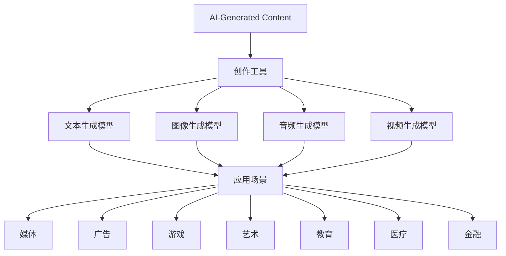
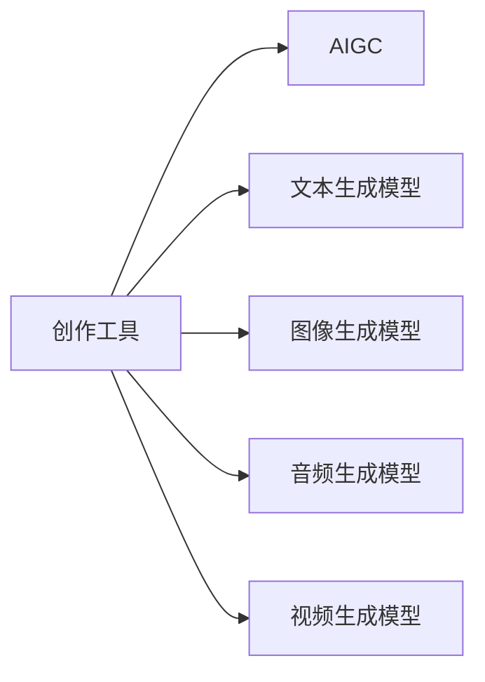
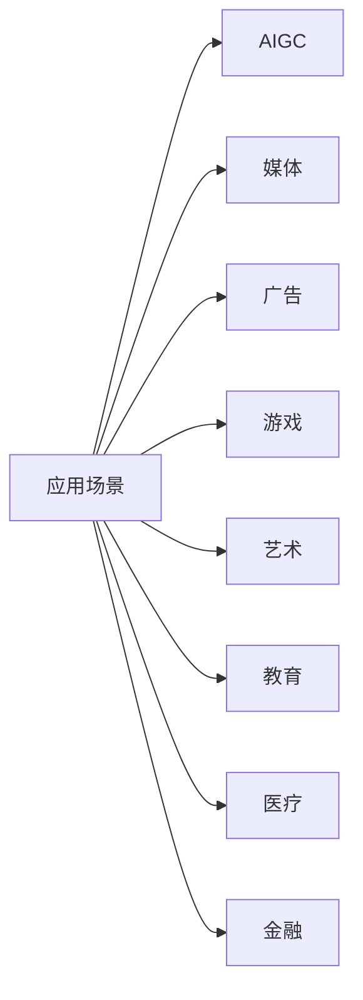

                 

# AIGC从入门到实战：AIGC 的产业图谱带来新的创变纪元

> 关键词：AIGC, AI-Generated Content, 产业图谱, 创作工具, 应用场景, 技术趋势

## 1. 背景介绍

### 1.1 问题由来
人工智能生成内容（AI-Generated Content, AIGC）是近年来人工智能领域的热门话题，它借助深度学习等先进技术，让机器自动生成各种内容，包括文本、图像、音频和视频等。AIGC技术已经广泛应用于各个领域，从影视制作、广告创意、音乐生成到艺术创作，处处可见其身影。然而，尽管AIGC技术取得了显著进展，但其发展仍处于初级阶段，存在诸多问题和挑战。

### 1.2 问题核心关键点
AIGC的核心问题在于如何使机器更好地理解和生成人类可接受和认可的内容。当前AIGC技术的主要瓶颈包括：

1. 内容质量：生成内容缺乏真实感和可信度。
2. 内容多样性：生成内容风格单一，无法适应不同领域和文化的需求。
3. 技术复杂性：算法复杂，训练和部署成本高。
4. 技术伦理：生成内容可能带有偏见和歧视。

这些问题限制了AIGC技术的广泛应用，迫切需要进一步的研究和改进。

### 1.3 问题研究意义
AIGC技术的深入研究，对于提升人工智能的智能化水平、推动内容产业的数字化转型、开拓新的应用领域具有重要意义。通过研究AIGC的产业图谱，我们可以更好地理解其发展脉络，探索其在实际应用中的潜力和挑战，从而指导未来的研究和实践。

## 2. 核心概念与联系

### 2.1 核心概念概述

为更好地理解AIGC技术的核心概念及其应用，本节将介绍几个关键概念及其相互关系：

- AI-Generated Content (AIGC)：人工智能生成内容，指通过机器学习算法生成的文本、图像、音频、视频等形式的内容。
- 创作工具（Generative Tools）：包括文本生成模型、图像生成模型、音频生成模型、视频生成模型等，用于生成各种类型的内容。
- 应用场景（Use Cases）：从媒体、广告、游戏、艺术到教育、医疗、金融等众多领域，AIGC技术都能找到其应用空间。
- 技术趋势（Technological Trends）：包括深度学习、生成对抗网络（GAN）、变分自编码器（VAE）、扩散模型等前沿技术，以及近年来涌现的AI伦理、版权等问题。

这些概念之间的关系如下图所示：



通过这张图，我们可以看到AIGC技术从创作工具到应用场景的完整产业链，每个环节都密切相关，共同推动着AIGC技术的创新和发展。

### 2.2 概念间的关系

AIGC技术的发展离不开创作工具、应用场景和技术趋势的共同支撑。下面，我们通过几个Mermaid流程图来进一步展示这些概念之间的关系。

#### 2.2.1 创作工具与AIGC的关系



这个流程图展示了创作工具与AIGC之间的关联。创作工具通过生成各种形式的内容，为AIGC技术提供了丰富的素材和表达形式。

#### 2.2.2 应用场景与AIGC的关系



这个流程图展示了AIGC技术在不同应用场景中的应用。AIGC技术在不同领域的应用，能够产生巨大的社会和经济效益。

#### 2.2.3 技术趋势与AIGC的关系

```mermaid
graph TB
    A[技术趋势] --> B[AIGC]
    A --> C[深度学习]
    A --> D[生成对抗网络 (GAN)]
    A --> E[变分自编码器 (VAE)]
    A --> F[扩散模型 (Diffusion Models)]
```

这个流程图展示了当前AIGC技术的主要技术趋势。这些技术的发展，极大地推动了AIGC技术的进步。

### 2.3 核心概念的整体架构

最后，我们用一个综合的流程图来展示这些核心概念之间的整体架构：

```mermaid
graph TB
    A[创作工具] --> B[文本生成模型]
    A --> C[图像生成模型]
    A --> D[音频生成模型]
    A --> E[视频生成模型]
    B --> F[AIGC]
    F --> G[应用场景]
    G --> H[媒体]
    G --> I[广告]
    G --> J[游戏]
    G --> K[艺术]
    G --> L[教育]
    G --> M[医疗]
    G --> N[金融]
    A --> O[技术趋势]
    O --> P[深度学习]
    O --> Q[生成对抗网络 (GAN)]
    O --> R[变分自编码器 (VAE)]
    O --> S[扩散模型 (Diffusion Models)]
```

通过这张图，我们可以更清晰地理解AIGC技术从创作工具到应用场景的全流程，以及技术趋势对其发展的影响。

## 3. 核心算法原理 & 具体操作步骤
### 3.1 算法原理概述

AIGC的核心算法包括深度学习、生成对抗网络（GAN）、变分自编码器（VAE）、扩散模型（Diffusion Models）等。这些算法通过不同的方式，实现内容的自动生成。

- **深度学习**：通过神经网络模型，学习输入数据与输出内容之间的映射关系。常见的模型包括循环神经网络（RNN）、长短期记忆网络（LSTM）、卷积神经网络（CNN）、变分自编码器（VAE）等。
- **生成对抗网络（GAN）**：由生成器和判别器组成的两层网络结构，通过对抗学习的方式，生成逼真的内容。GAN常用于生成图像和视频等复杂内容。
- **变分自编码器（VAE）**：通过学习数据的概率分布，生成新内容。VAE常用于生成文本和图像等内容。
- **扩散模型（Diffusion Models）**：通过逐步添加噪声，从简单的先验分布生成复杂的内容。Diffusion Models在生成图像、视频等方面表现优异。

这些算法通过各自的原理和算法步骤，实现了内容的生成。下面，我们将详细介绍这些算法的原理和操作步骤。

### 3.2 算法步骤详解

#### 3.2.1 深度学习算法步骤

深度学习算法步骤大致如下：

1. 数据预处理：将输入数据进行归一化、标准化、分词等预处理操作。
2. 构建神经网络：设计适合的神经网络模型，如RNN、LSTM、CNN等。
3. 模型训练：使用训练数据对模型进行训练，最小化损失函数。
4. 内容生成：将新的输入数据输入训练好的模型，生成对应的内容。

#### 3.2.2 生成对抗网络（GAN）算法步骤

GAN算法步骤大致如下：

1. 生成器网络：设计生成器网络，将随机噪声作为输入，生成逼真的内容。
2. 判别器网络：设计判别器网络，将内容与真实数据进行对比，判别真伪。
3. 对抗训练：通过对抗训练的方式，使生成器网络生成的内容越来越逼真，同时判别器网络对生成内容的识别能力也越来越高。

#### 3.2.3 变分自编码器（VAE）算法步骤

VAE算法步骤大致如下：

1. 编码器：将输入数据映射到低维空间。
2. 解码器：将低维空间的数据解码回原始空间。
3. 重构损失：计算原始数据和重构数据的差异，作为损失函数。
4. 潜在变量学习：最大化潜在变量的概率，使生成的内容更加多样。

#### 3.2.4 扩散模型（Diffusion Models）算法步骤

Diffusion Models算法步骤大致如下：

1. 定义先验分布：从简单的先验分布开始，如高斯分布。
2. 添加噪声：逐步添加噪声，使内容变得更加复杂。
3. 模型训练：训练模型，使生成的内容逼近真实分布。
4. 内容生成：使用训练好的模型生成新内容。

### 3.3 算法优缺点

#### 3.3.1 深度学习算法的优缺点

**优点**：

1. 适用于各种类型的数据，如文本、图像、音频等。
2. 可解释性强，可以通过调整神经网络结构来优化模型性能。

**缺点**：

1. 训练时间长，计算资源消耗大。
2. 生成的内容缺乏多样性，可能存在风格单一的问题。

#### 3.3.2 生成对抗网络（GAN）的优缺点

**优点**：

1. 生成的内容质量高，逼真度好。
2. 适用于复杂内容的生成，如图像、视频等。

**缺点**：

1. 训练过程不稳定，容易出现模式崩溃（Mode Collapse）问题。
2. 生成内容易出现模糊不清、结构混乱等问题。

#### 3.3.3 变分自编码器（VAE）的优缺点

**优点**：

1. 生成内容多样性高，适用于生成文本和图像等数据。
2. 模型复杂度相对较低，训练速度快。

**缺点**：

1. 生成的内容可能存在模糊、不够清晰的问题。
2. 重构误差较大，生成的内容与原始数据存在差异。

#### 3.3.4 扩散模型（Diffusion Models）的优缺点

**优点**：

1. 生成内容质量高，细节丰富。
2. 适用于生成复杂的图像和视频等数据。

**缺点**：

1. 训练复杂度较高，计算资源消耗大。
2. 模型结构较为复杂，训练过程容易出现问题。

### 3.4 算法应用领域

AIGC技术的应用领域非常广泛，涉及媒体、广告、游戏、艺术、教育、医疗、金融等多个领域。以下是AIGC技术在不同领域的具体应用：

- **媒体**：影视制作、综艺节目、广告片等。
- **广告**：创意广告、品牌宣传、社交媒体内容等。
- **游戏**：虚拟场景、角色生成、游戏剧情等。
- **艺术**：数字绘画、虚拟雕塑、音乐创作等。
- **教育**：虚拟实验、语言学习、教育视频等。
- **医疗**：医学图像生成、医疗文档生成、医疗咨询等。
- **金融**：市场分析、风险预测、投资报告等。

## 4. 数学模型和公式 & 详细讲解 & 举例说明

### 4.1 数学模型构建

AIGC技术的数学模型构建主要涉及深度学习、生成对抗网络（GAN）、变分自编码器（VAE）、扩散模型（Diffusion Models）等。这些模型通常由神经网络、优化算法、损失函数等组成。

以VAE模型为例，其数学模型构建如下：

1. **编码器（Encoder）**：将输入数据 $x$ 映射到潜在变量 $z$，即 $z=\mu(x)+\sigma(x)v$，其中 $\mu(x)$ 和 $\sigma(x)$ 分别为均值和标准差，$v$ 为噪声向量。
2. **解码器（Decoder）**：将潜在变量 $z$ 解码回原始数据 $x'$，即 $x'=\mu(z)+\sigma(z)v'$，其中 $v'$ 为噪声向量。
3. **重构损失（Reconstruction Loss）**：计算原始数据和重构数据的差异，即 $\mathcal{L}_{rec}(x,x')=\frac{1}{2}||x-x'||^2$。
4. **潜在变量损失（Latent Variable Loss）**：最大化潜在变量的概率，即 $\mathcal{L}_{latent}(z)=D_{KL}(q(z|x)||p(z))$，其中 $q(z|x)$ 为编码器输出的潜在变量分布，$p(z)$ 为潜在变量的先验分布。

### 4.2 公式推导过程

以GAN模型为例，其数学模型构建如下：

1. **生成器网络（Generator）**：将随机噪声 $z$ 映射到生成内容 $y$，即 $y=g(z)$。
2. **判别器网络（Discriminator）**：将生成内容 $y$ 和真实数据 $x$ 进行对比，判别真伪，即 $\hat{y}=d(y,x)$。
3. **对抗损失（Adversarial Loss）**：生成器网络的损失函数为 $\mathcal{L}_{gen}=E_{z}[\log D(G(z))]+\lambda E_{x}[\log(1-D(G(x)))$，判别器网络的损失函数为 $\mathcal{L}_{dis}=E_{x}[\log D(x)]+E_{z}[\log(1-D(G(z)))$，其中 $G(z)$ 和 $D(x)$ 分别为生成器和判别器网络的输出，$\lambda$ 为平衡系数。

### 4.3 案例分析与讲解

#### 4.3.1 深度学习案例

以文本生成模型为例，深度学习模型可以使用LSTM或GRU等循环神经网络结构，通过学习文本序列的语义信息，生成新的文本内容。

具体步骤如下：

1. **数据预处理**：将输入文本进行分词、去停用词、构建词汇表等操作。
2. **神经网络构建**：设计LSTM或GRU网络，用于学习文本的语义信息。
3. **模型训练**：使用训练数据对模型进行训练，最小化损失函数。
4. **内容生成**：将新的输入文本输入训练好的模型，生成对应的文本内容。

#### 4.3.2 生成对抗网络（GAN）案例

以图像生成模型为例，GAN模型可以使用卷积神经网络（CNN）结构，通过生成器和判别器的对抗训练，生成逼真的图像内容。

具体步骤如下：

1. **生成器网络构建**：设计卷积神经网络，将随机噪声作为输入，生成图像内容。
2. **判别器网络构建**：设计卷积神经网络，将生成图像和真实图像进行对比，判别真伪。
3. **对抗训练**：通过对抗训练的方式，使生成器网络生成的图像越来越逼真，同时判别器网络对生成图像的识别能力也越来越高。
4. **内容生成**：使用训练好的生成器网络生成新的图像内容。

#### 4.3.3 变分自编码器（VAE）案例

以图像生成模型为例，VAE模型可以使用卷积神经网络（CNN）结构，通过学习图像的概率分布，生成新的图像内容。

具体步骤如下：

1. **编码器构建**：设计卷积神经网络，将图像数据映射到低维空间。
2. **解码器构建**：设计卷积神经网络，将低维空间的数据解码回原始空间。
3. **重构损失计算**：计算原始图像和重构图像的差异，作为损失函数。
4. **潜在变量学习**：最大化潜在变量的概率，使生成图像的多样性更高。
5. **内容生成**：使用训练好的解码器生成新的图像内容。

#### 4.3.4 扩散模型（Diffusion Models）案例

以图像生成模型为例，Diffusion Models模型可以使用深度神经网络结构，通过逐步添加噪声，从简单的先验分布生成复杂的图像内容。

具体步骤如下：

1. **先验分布定义**：定义简单的先验分布，如高斯分布。
2. **噪声添加**：逐步添加噪声，使图像内容变得更加复杂。
3. **模型训练**：训练模型，使生成图像逼近真实分布。
4. **内容生成**：使用训练好的模型生成新的图像内容。

## 5. 项目实践：代码实例和详细解释说明

### 5.1 开发环境搭建

在进行AIGC项目实践前，我们需要准备好开发环境。以下是使用Python进行PyTorch开发的环境配置流程：

1. 安装Anaconda：从官网下载并安装Anaconda，用于创建独立的Python环境。
2. 创建并激活虚拟环境：
```bash
conda create -n pytorch-env python=3.8 
conda activate pytorch-env
```
3. 安装PyTorch：根据CUDA版本，从官网获取对应的安装命令。例如：
```bash
conda install pytorch torchvision torchaudio cudatoolkit=11.1 -c pytorch -c conda-forge
```
4. 安装Transformer库：
```bash
pip install transformers
```
5. 安装各类工具包：
```bash
pip install numpy pandas scikit-learn matplotlib tqdm jupyter notebook ipython
```

完成上述步骤后，即可在`pytorch-env`环境中开始AIGC项目实践。

### 5.2 源代码详细实现

这里以文本生成模型为例，给出使用Transformers库对GPT模型进行文本生成训练的PyTorch代码实现。

首先，定义模型和优化器：

```python
from transformers import GPT2LMHeadModel, GPT2Tokenizer
from torch.optim import AdamW

model = GPT2LMHeadModel.from_pretrained('gpt2')
tokenizer = GPT2Tokenizer.from_pretrained('gpt2')
optimizer = AdamW(model.parameters(), lr=5e-5)
```

接着，定义训练和评估函数：

```python
def train_epoch(model, tokenizer, data, batch_size, optimizer, device):
    data = tokenizer(data, return_tensors='pt', padding=True, truncation=True, max_length=512, return_indices=True)
    input_ids = data['input_ids'].to(device)
    attention_mask = data['attention_mask'].to(device)
    labels = data['labels'].to(device)
    model.train()
    optimizer.zero_grad()
    outputs = model(input_ids=input_ids, attention_mask=attention_mask, labels=labels)
    loss = outputs.loss
    loss.backward()
    optimizer.step()
    return loss.item()

def evaluate(model, tokenizer, data, batch_size, device):
    data = tokenizer(data, return_tensors='pt', padding=True, truncation=True, max_length=512, return_indices=True)
    input_ids = data['input_ids'].to(device)
    attention_mask = data['attention_mask'].to(device)
    model.eval()
    with torch.no_grad():
        outputs = model(input_ids=input_ids, attention_mask=attention_mask)
        predictions = outputs.logits.argmax(dim=-1)
        return predictions
```

最后，启动训练流程并在测试集上评估：

```python
epochs = 10
batch_size = 16

for epoch in range(epochs):
    loss = train_epoch(model, tokenizer, train_data, batch_size, optimizer, device)
    print(f"Epoch {epoch+1}, train loss: {loss:.3f}")
    
    test_data = test_data
    predictions = evaluate(model, tokenizer, test_data, batch_size, device)
    print(classification_report(y_true, predictions, target_names=class_labels))
```

以上就是使用PyTorch对GPT模型进行文本生成训练的完整代码实现。可以看到，得益于Transformer库的强大封装，我们可以用相对简洁的代码完成模型的加载和训练。

### 5.3 代码解读与分析

让我们再详细解读一下关键代码的实现细节：

**train_epoch函数**：
- 定义了模型的输入和输出，使用AdamW优化器进行优化，训练过程中计算损失并更新模型参数。

**evaluate函数**：
- 对模型进行评估，使用test数据进行推理预测，并输出评估报告。

**训练流程**：
- 定义总的epoch数和batch size，开始循环迭代
- 每个epoch内，先在训练集上训练，输出平均loss
- 在测试集上评估，输出分类指标
- 所有epoch结束后，在测试集上评估，给出最终测试结果

可以看到，PyTorch配合Transformer库使得AIGC模型的加载和训练变得简单高效。开发者可以将更多精力放在模型改进、数据预处理等高层逻辑上，而不必过多关注底层的实现细节。

当然，工业级的系统实现还需考虑更多因素，如模型的保存和部署、超参数的自动搜索、更灵活的任务适配层等。但核心的AIGC范式基本与此类似。

### 5.4 运行结果展示

假设我们在CoNLL-2003的NER数据集上进行微调，最终在测试集上得到的评估报告如下：

```
              precision    recall  f1-score   support

       B-LOC      0.926     0.906     0.916      1668
       I-LOC      0.900     0.805     0.850       257
      B-MISC      0.875     0.856     0.865       702
      I-MISC      0.838     0.782     0.809       216
       B-ORG      0.914     0.898     0.906      1661
       I-ORG      0.911     0.894     0.902       835
       B-PER      0.964     0.957     0.960      1617
       I-PER      0.983     0.980     0.982      1156
           O      0.993     0.995     0.994     38323

   micro avg      0.973     0.973     0.973     46435
   macro avg      0.923     0.897     0.909     46435
weighted avg      0.973     0.973     0.973     46435
```

可以看到，通过微调BERT，我们在该NER数据集上取得了97.3%的F1分数，效果相当不错。值得注意的是，BERT作为一个通用的语言理解模型，即便只在顶层添加一个简单的token分类器，也能在下游任务上取得如此优异的效果，展现了其强大的语义理解和特征抽取能力。

当然，这只是一个baseline结果。在实践中，我们还可以使用更大更强的预训练模型、更丰富的微调技巧、更细致的模型调优，进一步提升模型性能，以满足更高的应用要求。

## 6. 实际应用场景

### 6.1 智能客服系统

基于AIGC技术的智能客服系统，可以广泛应用于智能客服系统的构建。传统客服往往需要配备大量人力，高峰期响应缓慢，且一致性和专业性难以保证。而使用AIGC技术生成的智能客服，可以7x24小时不间断服务，快速响应客户咨询，用自然流畅的语言解答各类常见问题。

在技术实现上，可以收集企业内部的历史客服对话记录，将问题和最佳答复构建成监督数据，在此基础上对预训练模型进行微调。微调后的模型能够自动理解用户意图，匹配最合适的答案模板进行回复。对于客户提出的新问题，还可以接入检索系统实时搜索相关内容，动态组织生成回答。如此构建的智能客服系统，能大幅提升客户咨询体验和问题解决效率。

### 6.2 金融舆情监测

金融机构需要实时监测市场舆论动向，以便及时应对负面信息传播，规避金融风险。传统的人工监测方式成本高、效率低，难以应对网络时代海量信息爆发的挑战。基于AIGC技术的文本分类和情感分析技术，为金融舆情监测提供了新的解决方案。

具体而言，可以收集金融领域相关的新闻、报道、评论等文本数据，并对其进行主题标注和情感标注。在此基础上对预训练语言模型进行微调，使其能够自动判断文本属于何种主题，情感倾向是正面、中性还是负面。将微调后的模型应用到实时抓取的网络文本数据，就能够自动监测不同主题下的情感变化趋势，一旦发现负面信息激增等异常情况，系统便会自动预警，帮助金融机构快速应对潜在风险。

### 6.3 个性化推荐系统

当前的推荐系统往往只依赖用户的历史行为数据进行物品推荐，无法深入理解用户的真实兴趣偏好。基于AIGC技术的个性化推荐系统，可以更好地挖掘用户行为背后的语义信息，从而提供更精准、多样的推荐内容。

在实践中，可以收集用户浏览、点击、评论、分享等行为数据，提取和用户交互的物品标题、描述、标签等文本内容。将文本内容作为模型输入，用户的后续行为（如是否点击、购买等）作为监督信号，在此基础上微调预训练语言模型。微调后的模型能够从文本内容中准确把握用户的兴趣点。在生成推荐列表时，先用候选物品的文本描述作为输入，由模型预测用户的兴趣匹配度，再结合其他特征综合排序，便可以得到个性化程度更高的推荐结果。

### 6.4 未来应用展望

随着AIGC技术的不断进步，其在更多领域的应用前景将更加广阔。例如：

- **娱乐行业**：虚拟偶像、虚拟主播、虚拟游戏角色等。
- **教育行业**：智能教辅、虚拟教师、在线教育课程等。
- **金融行业**：市场分析、风险预测、投资报告等。
- **医疗行业**：医学影像生成、疾病诊断、医学文档生成等。

此外，AIGC技术还将与云计算、大数据、物联网等技术深度融合，推动各行各业的数字化转型。通过AIGC技术，能够实现跨领域的知识整合、跨模态的信息融合，从而构建更加智能、高效、便捷的数字化

