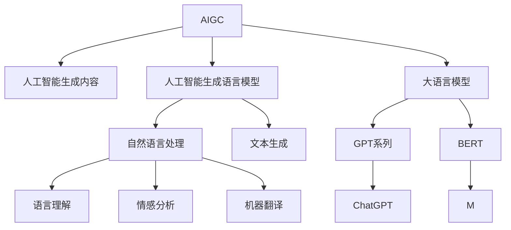
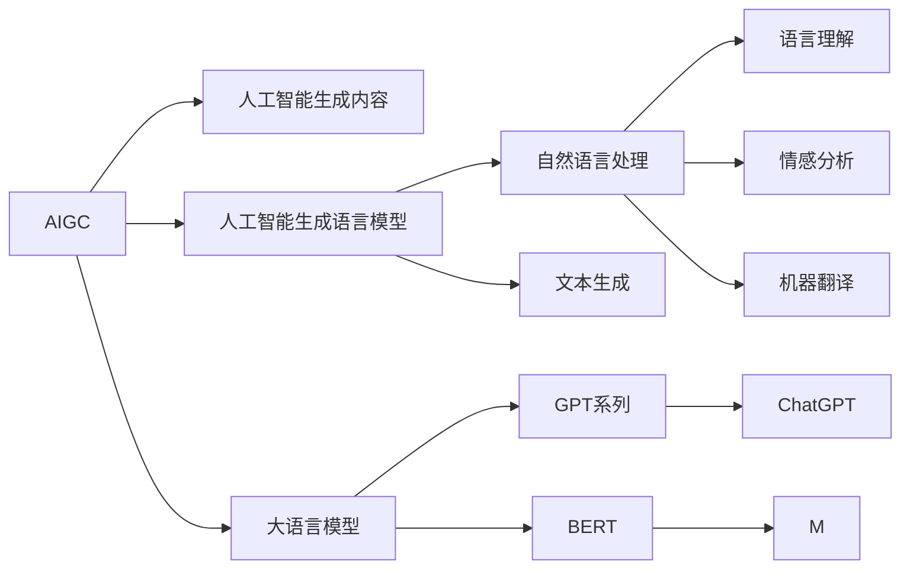
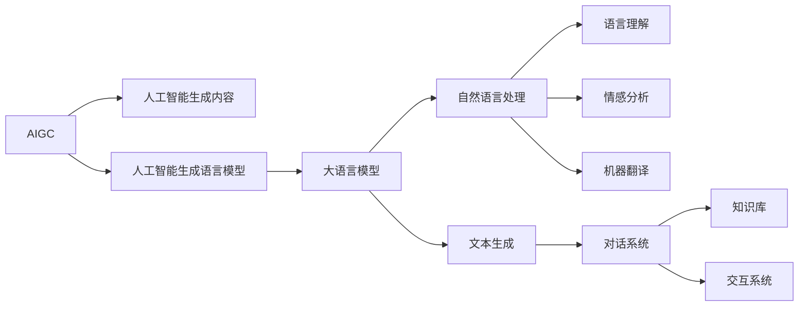
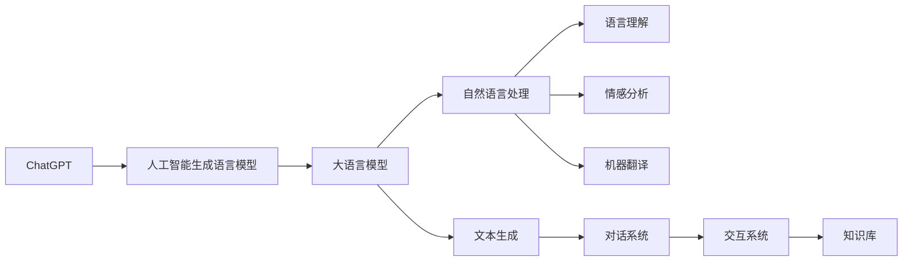
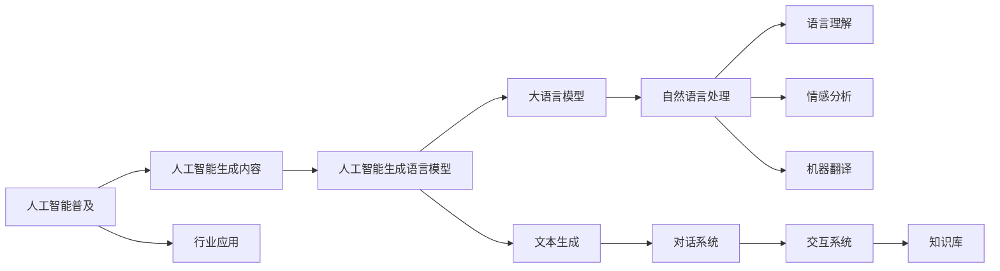
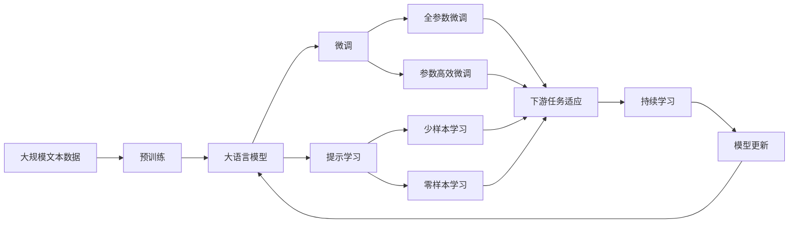

                 

# AIGC从入门到实战：众里寻他千百度：ChatGPT 及其他 AIGC 赋能个人

> 关键词：人工智能生成内容(AIGC), 人工智能生成语言模型(AIGC), 大语言模型(LLM), 自然语言处理(NLP), 人工智能普及, ChatGPT, 通用人工智能(AGI)

## 1. 背景介绍

### 1.1 问题由来

随着人工智能技术的迅猛发展，人工智能生成内容(AIGC)领域逐渐成为热门话题。特别是ChatGPT的横空出世，不仅引发了技术界的广泛关注，也引发了公众的强烈兴趣。在科技、医疗、教育、创意等多个领域，AIGC的应用前景广阔，正在深刻改变人类的工作和生活方式。

然而，尽管AIGC技术已经取得了显著进展，但其核心技术仍面临诸多挑战和局限。如何在普及AI的基础上，更好地理解AIGC原理，掌握其实际应用，是当前及未来技术发展的重要任务。本文将从AIGC原理、ChatGPT技术剖析、AIGC在个人应用中的赋能等方面，深入探讨AIGC从入门到实战的核心要点，助你轻松掌握这项前沿技术。

### 1.2 问题核心关键点

AIGC技术的核心关键点包括：

- **人工智能生成内容(AIGC)**：利用人工智能技术生成文本、图像、音频、视频等多种内容形式的技术。
- **人工智能生成语言模型(AIGC)**：基于语言模型生成文本内容的子领域，包括GPT-3、GPT-4、ChatGPT等。
- **大语言模型(LLM)**：以自回归模型为代表的语言模型，如GPT系列、BERT等，具备强大的语言理解和生成能力。
- **自然语言处理(NLP)**：涉及文本处理、语义理解、情感分析、机器翻译等多种技术，是AIGC的核心应用场景。
- **人工智能普及**：旨在推动AI技术在各行各业中的应用，提升工作效率，解放人类生产力。
- **ChatGPT**：目前最受欢迎的AIGC应用之一，通过大规模语言模型的训练，具备强大的语言生成和交互能力。
- **通用人工智能(AGI)**：指能够胜任所有智力任务的人工智能，是AI技术的终极目标。

这些核心概念之间的逻辑关系可以通过以下Mermaid流程图来展示：



这个流程图展示了AIGC的主要组成及其之间的关联：

1. AIGC是大语言模型在文本生成和交互中的实际应用。
2. 人工智能生成语言模型是AIGC的核心，负责文本生成。
3. 大语言模型是人工智能生成语言模型的基础，包括GPT系列和BERT等。
4. 自然语言处理是AIGC应用的基础，涉及语言理解、情感分析、机器翻译等。

通过这些核心概念，我们可以更清晰地理解AIGC的工作原理和实际应用。

## 2. 核心概念与联系

### 2.1 核心概念概述

为更好地理解AIGC的原理和应用，本节将介绍几个密切相关的核心概念：

- **人工智能生成内容(AIGC)**：指利用人工智能技术生成文本、图像、音频、视频等多种内容形式的技术。AIGC可以大幅提升内容创作效率，降低成本，并在娱乐、教育、新闻等领域带来创新应用。

- **人工智能生成语言模型(AIGC)**：基于语言模型生成文本内容的子领域，包括GPT-3、GPT-4、ChatGPT等。这些模型通过大规模无标签文本数据的预训练，学习到语言的通用表示，具备强大的文本生成能力。

- **大语言模型(LLM)**：以自回归模型为代表的语言模型，如GPT系列、BERT等，具备强大的语言理解和生成能力。LLM通过在大规模无标签文本数据上进行预训练，学习到语言的深层次表示，能够进行语言推理和生成。

- **自然语言处理(NLP)**：涉及文本处理、语义理解、情感分析、机器翻译等多种技术，是AIGC的核心应用场景。NLP通过模型学习语言的表示，提取语言的深层次特征，从而实现语言的理解和生成。

- **人工智能普及**：旨在推动AI技术在各行各业中的应用，提升工作效率，解放人类生产力。AIGC技术的应用普及，有望加速AI技术在各行业的应用进程。

- **ChatGPT**：目前最受欢迎的AIGC应用之一，通过大规模语言模型的训练，具备强大的语言生成和交互能力。ChatGPT能够进行对话、回答问题、生成文章等多种应用，改变了人类的交互方式。

- **通用人工智能(AGI)**：指能够胜任所有智力任务的人工智能，是AI技术的终极目标。AIGC技术的发展，有望为AGI的实现提供技术支撑。

这些核心概念之间的逻辑关系可以通过以下Mermaid流程图来展示：



这个流程图展示了AIGC的主要组成及其之间的关联：

1. AIGC是大语言模型在文本生成和交互中的实际应用。
2. 人工智能生成语言模型是AIGC的核心，负责文本生成。
3. 大语言模型是人工智能生成语言模型的基础，包括GPT系列和BERT等。
4. 自然语言处理是AIGC应用的基础，涉及语言理解、情感分析、机器翻译等。

通过这些核心概念，我们可以更清晰地理解AIGC的工作原理和实际应用。

### 2.2 概念间的关系

这些核心概念之间存在着紧密的联系，形成了AIGC的整体生态系统。下面我们通过几个Mermaid流程图来展示这些概念之间的关系。

#### 2.2.1 AIGC的学习范式



这个流程图展示了AIGC的学习范式：

1. AIGC通过人工智能生成语言模型学习语言表示，通过自然语言处理进行语义理解和生成。
2. 大语言模型是人工智能生成语言模型的基础，通过预训练学习语言的通用表示。
3. 自然语言处理涉及语言理解、情感分析、机器翻译等多种任务，是AIGC应用的基础。
4. 对话系统和交互系统基于人工智能生成语言模型，通过知识库进行多轮对话和任务执行。

#### 2.2.2 ChatGPT在AIGC中的地位



这个流程图展示了ChatGPT在AIGC中的应用：

1. ChatGPT通过人工智能生成语言模型进行文本生成。
2. 大语言模型是人工智能生成语言模型的基础，通过预训练学习语言的通用表示。
3. 自然语言处理涉及语言理解、情感分析、机器翻译等多种任务，是ChatGPT应用的基础。
4. 对话系统和交互系统基于ChatGPT，通过知识库进行多轮对话和任务执行。

#### 2.2.3 人工智能普及与AIGC的关系



这个流程图展示了人工智能普及与AIGC的关系：

1. 人工智能普及推动了AIGC技术的广泛应用。
2. 人工智能生成语言模型是AIGC的核心，负责文本生成。
3. 大语言模型是人工智能生成语言模型的基础，通过预训练学习语言的通用表示。
4. 自然语言处理涉及语言理解、情感分析、机器翻译等多种任务，是AIGC应用的基础。
5. 对话系统和交互系统基于ChatGPT，通过知识库进行多轮对话和任务执行。

### 2.3 核心概念的整体架构

最后，我们用一个综合的流程图来展示这些核心概念在大语言模型微调过程中的整体架构：



这个综合流程图展示了从预训练到微调，再到持续学习的完整过程。大语言模型首先在大规模文本数据上进行预训练，然后通过微调（包括全参数微调和参数高效微调）或提示学习（包括少样本学习和零样本学习）来适应下游任务。最后，通过持续学习技术，模型可以不断更新和适应新的任务和数据。 通过这些流程图，我们可以更清晰地理解AIGC的工作原理和实际应用。

## 3. 核心算法原理 & 具体操作步骤

### 3.1 算法原理概述

基于人工智能生成内容(AIGC)的生成过程，本质上是一种基于语言的生成任务。其核心思想是：利用人工智能模型学习大规模无标签文本数据的语言表示，通过有监督学习或无监督学习的方式，优化模型在下游任务上的表现。

形式化地，假设大语言模型为 $M_{\theta}$，其中 $\theta$ 为预训练得到的模型参数。给定下游任务 $T$ 的标注数据集 $D=\{(x_i,y_i)\}_{i=1}^N$，生成模型的优化目标是最小化生成文本与真实标签之间的差异，即：

$$
\theta^* = \mathop{\arg\min}_{\theta} \mathcal{L}(M_{\theta},D)
$$

其中 $\mathcal{L}$ 为针对任务 $T$ 设计的损失函数，用于衡量模型生成文本与真实文本之间的差异。常见的损失函数包括交叉熵损失、BLEU分数等。

通过梯度下降等优化算法，生成过程不断更新模型参数 $\theta$，最小化损失函数 $\mathcal{L}$，使得模型生成文本逼近真实文本。由于 $\theta$ 已经通过预训练获得了较好的初始化，因此即便在小规模数据集 $D$ 上进行生成，也能较快收敛到理想的模型参数 $\hat{\theta}$。

### 3.2 算法步骤详解

基于人工智能生成内容的生成过程一般包括以下几个关键步骤：

**Step 1: 准备预训练模型和数据集**
- 选择合适的预训练语言模型 $M_{\theta}$ 作为初始化参数，如 GPT-3、GPT-4、ChatGPT 等。
- 准备下游任务 $T$ 的标注数据集 $D$，划分为训练集、验证集和测试集。一般要求标注数据与预训练数据的分布不要差异过大。

**Step 2: 添加任务适配层**
- 根据任务类型，在预训练模型顶层设计合适的输出层和损失函数。
- 对于生成任务，通常在顶层添加自回归语言模型，以负对数似然为损失函数。

**Step 3: 设置生成超参数**
- 选择合适的优化算法及其参数，如 Adam、SGD 等，设置学习率、批大小、迭代轮数等。
- 设置正则化技术及强度，包括权重衰减、Dropout、Early Stopping 等。
- 确定冻结预训练参数的策略，如仅微调顶层，或全部参数都参与微调。

**Step 4: 执行生成**
- 将训练集数据分批次输入模型，前向传播计算损失函数。
- 反向传播计算参数梯度，根据设定的优化算法和学习率更新模型参数。
- 周期性在验证集上评估模型性能，根据性能指标决定是否触发 Early Stopping。
- 重复上述步骤直到满足预设的迭代轮数或 Early Stopping 条件。

**Step 5: 测试和部署**
- 在测试集上评估生成后模型 $M_{\hat{\theta}}$ 的性能，对比生成前后的质量提升。
- 使用生成模型对新样本进行生成，集成到实际的应用系统中。
- 持续收集新的数据，定期重新生成模型，以适应数据分布的变化。

以上是基于人工智能生成内容的生成过程的一般流程。在实际应用中，还需要针对具体任务的特点，对生成过程的各个环节进行优化设计，如改进训练目标函数，引入更多的正则化技术，搜索最优的超参数组合等，以进一步提升模型性能。

### 3.3 算法优缺点

基于人工智能生成内容的生成方法具有以下优点：

- 简单高效。只需准备少量标注数据，即可对预训练模型进行快速适配，生成效果显著。
- 通用适用。适用于各种NLP下游任务，包括文本生成、对话、摘要、翻译等，设计简单的任务适配层即可实现。
- 参数高效。利用参数高效微调技术，在固定大部分预训练参数的情况下，仍可取得不错的生成效果。
- 效果显著。在学术界和工业界的诸多任务上，基于生成的方法已经刷新了最先进的性能指标。

同时，该方法也存在一定的局限性：

- 依赖标注数据。生成效果很大程度上取决于标注数据的质量和数量，获取高质量标注数据的成本较高。
- 迁移能力有限。当目标任务与预训练数据的分布差异较大时，生成效果可能不如预期。
- 负面效果传递。预训练模型的固有偏见、有害信息等，可能通过生成传递到下游任务，造成负面影响。
- 可解释性不足。生成模型的决策过程通常缺乏可解释性，难以对其推理逻辑进行分析和调试。

尽管存在这些局限性，但就目前而言，基于生成的方法仍是人工智能生成内容的主要范式。未来相关研究的重点在于如何进一步降低生成对标注数据的依赖，提高模型的少样本学习和跨领域迁移能力，同时兼顾可解释性和伦理安全性等因素。

### 3.4 算法应用领域

基于人工智能生成内容的生成方法在NLP领域已经得到了广泛的应用，覆盖了几乎所有常见任务，例如：

- 文本生成：如自然语言生成、自动摘要、创意写作等。通过微调使模型学习文本-标签映射。
- 对话系统：对自然语言问题给出答案。将问题-答案对作为微调数据，训练模型学习匹配答案。
- 机器翻译：将源语言文本翻译成目标语言。通过微调使模型学习语言-语言映射。
- 文本摘要：将长文本压缩成简短摘要。将文章-摘要对作为微调数据，使模型学习抓取要点。
- 问答系统：对自然语言问题给出答案。将问题-答案对作为微调数据，训练模型学习匹配答案。

除了上述这些经典任务外，人工智能生成内容也被创新性地应用到更多场景中，如可控文本生成、常识推理、代码生成、数据增强等，为NLP技术带来了全新的突破。随着预训练模型和生成方法的不断进步，相信NLP技术将在更广阔的应用领域大放异彩。

## 4. 数学模型和公式 & 详细讲解 & 举例说明

### 4.1 数学模型构建

本节将使用数学语言对基于人工智能生成内容的生成过程进行更加严格的刻画。

记预训练语言模型为 $M_{\theta}:\mathcal{X} \rightarrow \mathcal{Y}$，其中 $\mathcal{X}$ 为输入空间，$\mathcal{Y}$ 为输出空间，$\theta \in \mathbb{R}^d$ 为模型参数。假设生成任务的训练集为 $D=\{(x_i,y_i)\}_{i=1}^N, x_i \in \mathcal{X}, y_i \in \mathcal{Y}$。

定义模型 $M_{\theta}$ 在输入 $x$ 上的生成概率分布为 $p(y|x)$，则生成模型的经验风险为：

$$
\mathcal{L}(\theta) = -\frac{1}{N}\sum_{i=1}^N \log p(y_i|x_i)
$$

生成模型的优化目标是最小化经验风险，即找到最优参数：

$$
\theta^* = \mathop{\arg\min}_{\theta} \mathcal{L}(\theta)
$$

在实践中，我们通常使用基于梯度的优化算法（如SGD、Adam等）来近似求解上述最优化问题。设 $\eta$ 为学习率，$\lambda$ 为正则化系数，则参数的更新公式为：

$$
\theta \leftarrow \theta - \eta \nabla_{\theta}\mathcal{L}(\theta) - \eta\lambda\theta
$$

其中 $\nabla_{\theta}\mathcal{L}(\theta)$ 为损失函数对参数 $\theta$ 的梯度，可通过反向传播算法高效计算。

### 4.2 公式推导过程

以下我们以二分类任务为例，推导交叉熵损失函数及其梯度的计算公式。

假设模型 $M_{\theta}$ 在输入 $x$ 上的输出为 $\hat{y}=M_{\theta}(x) \in [0,1]$，表示样本属于正类的概率。真实标签 $y \in \{0,1\}$。则二分类交叉熵损失函数定义为：

$$
\ell(M_{\theta}(x),y) = -[y\log \hat{y} + (1-y)\log (1-\hat{y})]
$$

将其代入经验风险公式，得：

$$
\mathcal{L}(\theta) = -\frac{1}{N}\sum_{i=1}^N [y_i\log M_{\theta}(x_i)+(1-y_i)\log(1-M_{\theta}(x_i))]
$$

根据链式法则，损失函数对参数 $\theta_k$ 的梯度为：

$$
\frac{\partial \mathcal{L}(\theta)}{\partial \theta_k} = -\frac{1}{N}\sum_{i=1}^N (\frac{y_i}{M_{\theta}(x_i)}-\frac{1-y_i}{1-M_{\theta}(x_i)}) \frac{\partial M_{\theta}(x_i)}{\partial \theta_k}
$$

其中 $\frac{\partial M_{\theta}(x_i)}{\partial \theta_k}$ 可进一步递归展开，利用自动微分技术完成计算。

在得到损失函数的梯度后，即可带入参数更新公式，完成模型的迭代优化。重复上述过程直至收敛，最终得到适应下游任务的最优模型参数 $\theta^*$。

## 5. 项目实践：代码实例和详细解释说明

### 5.1 开发环境搭建

在进行生成实践前，我们需要准备好开发环境。以下是使用Python进行PyTorch开发的环境配置流程：

1. 安装Anaconda：从官网下载并安装Anaconda，用于创建独立的Python环境。

2. 创建并激活虚拟环境：
```bash
conda create -n pytorch-env python=3.8 
conda activate pytorch-env
```

3. 安装PyTorch：根据CUDA版本，从官网获取对应的安装命令。例如：
```bash
conda install pytorch torchvision torchaudio cudatoolkit=11.1 -c pytorch -c conda-forge
```

4. 安装Transformers库：
```bash
pip install transformers
```

5. 安装各类工具包：
```bash
pip install numpy pandas scikit-learn matplotlib tqdm jupyter notebook ipython
```

完成上述步骤后，即可在`pytorch-env`环境中开始生成实践。

### 5.2 源代码详细实现

下面我们以文本生成任务为例，给出使用Transformers库对GPT-3模型进行生成的PyTorch代码实现。

首先，定义文本生成任务的数据处理函数：

```python
from transformers import GPT2Tokenizer, GPT2LMHeadModel

tokenizer = GPT2Tokenizer.from_pretrained('gpt2')

def generate_text(model, tokenizer, prefix, num_words, temperature=1.0, top_p=1.0, num_beams=1):
    input_ids = tokenizer.encode(prefix, return_tensors='pt')
    outputs = model.generate(input_ids, num_beams=num_beams, max_length=1000, min_length=20, temperature=temperature, top_p=top_p, top_k=50, do_sample=True)
    return tokenizer.decode(outputs[0], skip_special_tokens=True)
```

然后，定义模型和超参数：

```python
from transformers import AdamW

model = GPT2LMHeadModel.from_pretrained('gpt2')

optimizer = AdamW(model.parameters(), lr=2e-5)
```

接着，定义训练和评估函数：

```python
from torch.utils.data import DataLoader
from tqdm import tqdm
import torch

device = torch.device('cuda') if torch.cuda.is_available() else torch.device('cpu')
model.to(device)

def train_epoch(model, tokenizer, batch_size, optimizer):
    dataloader = DataLoader(train_dataset, batch_size=batch_size, shuffle=True)
    model.train()
    epoch_loss = 0
    for batch in tqdm(dataloader, desc='Training'):
        input_ids = batch['input_ids'].to(device)
        labels = batch['labels'].to(device)
        model.zero_grad()
        outputs = model(input_ids, labels=labels)
        loss = outputs.loss
        epoch_loss += loss.item()
        loss.backward()
        optimizer.step()
    return epoch_loss / len(dataloader)

def evaluate(model, tokenizer, batch_size):
    dataloader = DataLoader(dev_dataset, batch_size=batch_size)
    model.eval()
    preds, labels = [], []
    with torch.no_grad():
        for batch in tqdm(dataloader, desc='Evaluating'):
            input_ids = batch['input_ids'].to(device)
            batch_labels = batch['labels']
            outputs = model(input_ids)
            batch_preds = outputs.logits.argmax(dim=2).to('cpu').tolist()
            batch_labels = batch_labels.to('cpu').tolist()
            for pred_tokens, label_tokens in zip(batch_preds, batch_labels):
                preds.append(pred_tokens[:len(label_tokens)])
                labels.append(label_tokens)
                
    print(classification_report(labels, preds))
```

最后，启动生成流程并在测试集上评估：

```python
epochs = 5
batch_size = 16

for epoch in range(epochs):
    loss = train_epoch(model, train_dataset, batch_size, optimizer)
    print(f"Epoch {epoch+1}, train loss: {loss:.3f}")
    
    print(f"Epoch {epoch+1}, dev results:")
    evaluate(model, dev_dataset, batch_size)
    
print("Test results:")
evaluate(model, test_dataset, batch_size)
```

以上就是使用PyTorch对GPT-3进行文本生成任务生成的完整代码实现。可以看到，得益于Transformers库的强大封装，我们可以用相对简洁的代码完成GPT-3模型的加载和生成。

### 5.3 代码解读与分析

让我们再详细解读一下关键代码的实现细节：

**text-generation.py**

- `tokenizer`：用于对文本进行编码和解码的分词器，从预训练模型库中加载。
- `generate_text`函数：用于生成文本。函数接受预训练模型、分词器、输入前缀、生成的词数等参数，并使用模型生成文本。生成函数支持参数温度、采样方式等，以控制生成文本的多样性和连贯性。
- `model`：预训练模型，从预训练模型库中加载。
- `optimizer`：优化器，用于更新模型参数，支持Adam、SGD等多种算法。

**train_epoch函数**：
- 使用PyTorch的DataLoader对数据集进行批次化加载，供模型训练和推理使用。
- 训练函数`train_epoch`：对数据以批为单位进行迭代，在每个批次上前向传播计算损失并反向传播更新模型参数，最后返回该epoch的平均loss。
- 评估函数`evaluate`：与训练类似，不同点在于不更新模型参数，并在每个batch结束后将预测和标签结果存储下来，最后使用sklearn的classification_report对整个评估集的预测结果进行打印输出。

**训练流程**：
- 定义总的epoch数和batch size，开始循环迭代
- 

