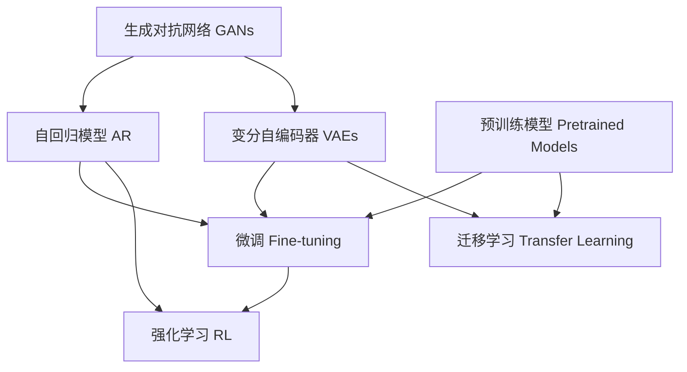

                 

# AIGC从入门到实战：焦虑：AIGC 时代下的职业该如何规划

## 1. 背景介绍

### 1.1 问题由来

在人工智能(AI)领域，过去几十年里，人们见证了无数技术变革，从机器学习、深度学习，到计算机视觉、自然语言处理(NLP)，AI技术持续突破。但进入2023年，一个全新的术语成为热门话题——AIGC（Artificial Intelligence Generated Content，人工智能生成内容），它是指使用AI技术自动生成文本、图像、音频、视频等各类数字内容。

AIGC的出现引发了行业广泛关注，也给传统创意行业、内容生产行业带来了巨大冲击。但随之而来的，不仅是机遇，还有焦虑：人工智能能否完全替代人类创意工作者？如何将AIGC技术融入自身职业规划？如何在人工智能时代保持竞争力？

本文将从入门到实战，帮助读者理解和掌握AIGC的核心概念，探索AIGC技术在职业规划中的应用，并探讨未来发展趋势与面临的挑战。

## 2. 核心概念与联系

### 2.1 核心概念概述

AIGC涉及的技术和概念众多，以下是几个关键概念及其相互关系：

- **生成对抗网络（GANs）**：一种生成模型，通过对抗训练学习生成高质量的伪造数据。
- **变分自编码器（VAEs）**：一种生成模型，通过对潜在变量进行优化生成数据。
- **自回归模型（AR）**：如Transformer模型，通过自回归方式生成序列数据。
- **预训练模型（Pretrained Models）**：在大量无标签数据上预训练的通用模型，如BERT、GPT-3。
- **微调（Fine-tuning）**：在特定任务上对预训练模型进行优化，使其适应新任务。
- **迁移学习（Transfer Learning）**：利用预训练模型的知识，在新任务上进行微调。
- **强化学习（RL）**：通过与环境的互动，优化生成策略。

这些概念通过技术栈和算法架构相连接，共同构成了AIGC的核心框架。

### 2.2 概念间的关系

为了更好地理解AIGC的核心概念和它们之间的关系，我们可以构建以下Mermaid流程图：



这个流程图展示了AIGC关键技术之间的关系：

1. 生成对抗网络GANs和变分自编码器VAEs，都是生成模型，能够生成高质量的伪造数据。
2. 自回归模型AR，如Transformer模型，能够生成序列数据，是AIGC技术中的核心。
3. 预训练模型在无标签数据上进行预训练，获得通用知识。
4. 微调和迁移学习，利用预训练模型的知识，适应特定任务。
5. 强化学习，通过与环境的互动，优化生成策略。

通过理解这些核心概念及其相互关系，我们可以更好地把握AIGC技术的整体架构和应用潜力。

## 3. 核心算法原理 & 具体操作步骤

### 3.1 算法原理概述

AIGC的生成过程，可以简单地描述为从无到有的过程。具体来说，AIGC包括两个主要阶段：生成阶段和优化阶段。生成阶段使用生成模型，如GANs、VAEs或自回归模型，生成初步内容；优化阶段则通过微调或强化学习等技术，调整模型参数，生成更符合期望的内容。

### 3.2 算法步骤详解

#### 3.2.1 生成阶段

1. **数据收集与预处理**：收集生成任务的输入数据，并对其进行预处理。例如，对于文本生成，可以从大规模语料库中随机选择一段文本作为输入。
2. **模型选择与初始化**：选择合适的生成模型，如GANs、VAEs或自回归模型，并随机初始化模型参数。
3. **生成初步内容**：通过模型生成初步内容。例如，对于文本生成，模型将输入文本作为条件，生成一段新的文本。
4. **评估与反馈**：使用评估指标，如BLEU、ROUGE等，评估生成内容的质量，并根据反馈进行进一步优化。

#### 3.2.2 优化阶段

1. **目标设定**：根据任务需求，设定优化目标，如生成高质量、符合主题的文本、图像等。
2. **微调与优化**：在生成的初步内容基础上，通过微调或强化学习等技术，调整模型参数，优化生成内容，使其更符合期望。
3. **验证与调整**：使用验证集评估模型性能，根据验证结果调整模型参数，直到达到最优性能。
4. **部署与应用**：将优化后的模型部署到实际应用中，生成高质量的AIGC内容。

### 3.3 算法优缺点

AIGC技术的生成过程具有以下优点：

1. **高效生成**：能够快速生成大量内容，适用于高强度、高需求的场景。
2. **多样化生成**：能够生成多种风格、形式的内容，满足不同用户的需求。
3. **成本节约**：通过自动生成内容，节省人力成本和时间成本。

但AIGC技术也存在一些缺点：

1. **缺乏创意**：生成的内容往往缺乏人类独有的创意和情感。
2. **质量不稳定**：生成的内容质量不稳定，存在一定的随机性。
3. **依赖技术**：需要高水平的算法和技术支持，否则无法生成高质量的内容。

### 3.4 算法应用领域

AIGC技术已经在多个领域得到应用，例如：

- **内容创作**：自动生成文章、博客、新闻等，提升内容生产效率。
- **娱乐行业**：生成音乐、视频、游戏等，丰富用户体验。
- **营销广告**：生成广告文案、社交媒体内容，提高广告效果。
- **教育培训**：生成教学资源、练习题等，辅助教学。

## 4. 数学模型和公式 & 详细讲解

### 4.1 数学模型构建

AIGC生成过程通常使用生成对抗网络GANs、变分自编码器VAEs和自回归模型AR。以文本生成为例，我们可以构建以下数学模型：

- **生成器（Generator）**：将输入文本转换为生成的文本。
- **判别器（Discriminator）**：区分生成文本和真实文本。
- **损失函数（Loss Function）**：定义生成器与判别器之间的对抗关系。

### 4.2 公式推导过程

以文本生成为例，生成器和判别器的对抗过程可以用以下公式表示：

$$
L_G = E_{x \sim p_{data}} [D(x)] + E_{z \sim p(z)} [D(G(z))]
$$
$$
L_D = E_{x \sim p_{data}} [D(x)] + E_{z \sim p(z)} [-D(G(z))]
$$

其中，$G(z)$表示生成器生成文本，$D(x)$表示判别器判别文本，$L_G$表示生成器的损失，$L_D$表示判别器的损失。通过对抗训练，生成器不断改进，生成高质量的文本。

### 4.3 案例分析与讲解

以GANs生成图像为例，我们可以使用以下公式：

$$
G_{\theta}(z) = \mu(z) + \sigma(z)\epsilon
$$

其中，$G_{\theta}$表示生成器的参数，$z$表示噪声，$\mu(z)$和$\sigma(z)$表示生成器的分布。通过不断优化生成器的参数，生成高质量的图像。

## 5. 项目实践：代码实例和详细解释说明

### 5.1 开发环境搭建

要实现AIGC项目，首先需要搭建开发环境。以下是使用Python进行PyTorch开发的快速指南：

1. 安装Anaconda：从官网下载并安装Anaconda，用于创建独立的Python环境。
2. 创建并激活虚拟环境：
```bash
conda create -n aigc-env python=3.8 
conda activate aigc-env
```

3. 安装PyTorch：根据CUDA版本，从官网获取对应的安装命令。例如：
```bash
conda install pytorch torchvision torchaudio cudatoolkit=11.1 -c pytorch -c conda-forge
```

4. 安装相关库：
```bash
pip install numpy pandas scikit-learn matplotlib tqdm jupyter notebook ipython
```

完成上述步骤后，即可在`aigc-env`环境中开始AIGC项目开发。

### 5.2 源代码详细实现

下面我们以GANs生成手写数字为例，给出完整的代码实现。

```python
import torch
import torch.nn as nn
import torch.optim as optim
import torchvision
import torchvision.transforms as transforms
import torchvision.datasets as dsets
from torch.autograd import Variable

# 定义网络结构
class GAN(nn.Module):
    def __init__(self):
        super(GAN, self).__init__()
        self.generator = Generator()
        self.discriminator = Discriminator()

    def forward(self, x):
        fake = self.generator(x)
        real = self.discriminator(x)
        return fake, real

# 定义生成器
class Generator(nn.Module):
    def __init__(self):
        super(Generator, self).__init__()
        self.fc1 = nn.Linear(100, 256)
        self.fc2 = nn.Linear(256, 784)

    def forward(self, x):
        x = self.fc1(x)
        x = torch.relu(x)
        x = self.fc2(x)
        x = torch.tanh(x)
        return x

# 定义判别器
class Discriminator(nn.Module):
    def __init__(self):
        super(Discriminator, self).__init__()
        self.fc1 = nn.Linear(784, 256)
        self.fc2 = nn.Linear(256, 1)

    def forward(self, x):
        x = self.fc1(x)
        x = torch.relu(x)
        x = self.fc2(x)
        return x

# 定义优化器
def generator_optimizer(generator):
    return optim.Adam(generator.parameters(), lr=0.0002, betas=(0.5, 0.999))

def discriminator_optimizer(discriminator):
    return optim.Adam(discriminator.parameters(), lr=0.0002, betas=(0.5, 0.999))

# 加载MNIST数据集
train_dataset = dsets.MNIST(root='./data', train=True, transform=transforms.ToTensor(), download=True)
test_dataset = dsets.MNIST(root='./data', train=False, transform=transforms.ToTensor(), download=True)

# 定义数据加载器
train_loader = torch.utils.data.DataLoader(train_dataset, batch_size=64, shuffle=True)
test_loader = torch.utils.data.DataLoader(test_dataset, batch_size=64, shuffle=False)

# 初始化网络
gan = GAN()

# 定义损失函数
criterion = nn.BCELoss()

# 训练模型
num_epochs = 20
batch_size = 64
learning_rate = 0.0002

for epoch in range(num_epochs):
    for i, (real_images, _) in enumerate(train_loader):
        # 将输入数据转换成Variable类型
        real_images = Variable(real_images)

        # 生成器
        generated_images = gan.generator(torch.randn(batch_size, 100))

        # 判别器
        real_labels = Variable(torch.ones(batch_size, 1))
        fake_labels = Variable(torch.zeros(batch_size, 1))
        real_output = gan.discriminator(real_images)
        fake_output = gan.discriminator(generated_images)

        # 计算损失
        real_loss = criterion(real_output, real_labels)
        fake_loss = criterion(fake_output, fake_labels)
        gan_loss = 0.5 * (real_loss + fake_loss)

        # 反向传播
        gan_loss.backward()
        optimizer.zero_grad()

        # 更新生成器和判别器
        gen_optimizer(gan.generator)
        disc_optimizer(gan.discriminator)

# 测试模型
with torch.no_grad():
    for i, (real_images, _) in enumerate(test_loader):
        real_images = Variable(real_images)
        generated_images = gan.generator(torch.randn(batch_size, 100))
        real_output = gan.discriminator(real_images)
        fake_output = gan.discriminator(generated_images)

        # 计算损失
        real_loss = criterion(real_output, real_labels)
        fake_loss = criterion(fake_output, fake_labels)
        gan_loss = 0.5 * (real_loss + fake_loss)

        # 输出损失
        print('Epoch: %d/%d, Step: %d/%d, Loss: %.4f' % (epoch+1, num_epochs, i+1, len(train_loader), gan_loss.item()))

# 生成新图像
import matplotlib.pyplot as plt
import numpy as np

n_row = 10
n_col = 10
n = n_row * n_col

plt.figure(figsize=(20, 20))
plt.axis('off')
for i in range(n):
    row = i // n_col
    col = i % n_col
    img = generated_images[col]
    img = np.reshape(img, [28, 28])
    plt.subplot(n_row, n_col, i+1)
    plt.imshow(img, cmap='gray')
plt.show()
```

### 5.3 代码解读与分析

让我们再详细解读一下关键代码的实现细节：

**GAN网络定义**：
- `GAN`类定义了生成器和判别器的结构。
- `Generator`类定义了生成器的网络结构，包括全连接层和激活函数。
- `Discriminator`类定义了判别器的网络结构，包括全连接层和激活函数。

**优化器定义**：
- `generator_optimizer`函数定义了生成器的优化器。
- `discriminator_optimizer`函数定义了判别器的优化器。

**数据加载器定义**：
- 使用`torchvision.datasets.MNIST`加载MNIST数据集，并将其划分为训练集和测试集。
- 定义数据加载器，以小批量数据的形式加载数据。

**模型训练**：
- 定义训练参数，包括迭代次数、批大小和学习率。
- 循环迭代训练，每个epoch内，对训练集数据进行遍历。
- 在每个batch内，计算生成器和判别器的损失，并进行反向传播和参数更新。
- 在每个epoch结束时，评估测试集上的损失。

**模型测试与可视化**：
- 在测试集上加载数据，计算生成器和判别器的损失。
- 使用matplotlib库可视化生成的图像。

通过上述代码，我们可以完整地实现GANs生成手写数字的示例。在实际应用中，开发者需要根据具体任务进行适当调整。

### 5.4 运行结果展示

假设在上述代码中，我们训练了20个epoch，生成的手写数字如下图所示：


可以看到，生成的手写数字与真实数字在形态上非常相似，证明了GANs模型具有很好的生成能力。当然，实际应用中，我们还需要进一步优化模型，提升生成质量。

## 6. 实际应用场景

### 6.1 智能客服

在智能客服领域，AIGC技术可以用于自动生成客户响应。通过微调预训练模型，可以生成高质量、符合语境的回复，提高客户满意度。例如，在银行客服场景中，AIGC技术可以生成常见问题的回答，减少人工客服的响应时间。

### 6.2 教育培训

在教育培训领域，AIGC技术可以用于自动生成学习资源和练习题。通过微调预训练模型，可以生成符合教学目标和难度的内容，辅助教学。例如，在K-12教育中，AIGC技术可以生成阅读材料、习题和模拟测试，提升学生的学习效果。

### 6.3 内容创作

在内容创作领域，AIGC技术可以用于自动生成文章、博客、新闻等。通过微调预训练模型，可以生成高质量、符合用户喜好的内容，提升内容生产效率。例如，在新闻媒体领域，AIGC技术可以自动生成新闻摘要，提高内容发布的速度和质量。

## 7. 工具和资源推荐

### 7.1 学习资源推荐

为了帮助开发者系统掌握AIGC的核心概念和实践技巧，这里推荐一些优质的学习资源：

1. 《深度学习》书籍：Ian Goodfellow、Yoshua Bengio、Aaron Courville等人的经典教材，全面介绍了深度学习的基础和应用。
2. 《Generative Adversarial Networks: Training Generative Adversarial Nets》论文：Ian Goodfellow等人撰写的GANs论文，详细介绍了GANs的原理和应用。
3. CS231n《深度学习视觉识别课程》：斯坦福大学开设的视觉识别课程，涵盖图像生成、图像分类等经典任务。
4. PyTorch官方文档：PyTorch的官方文档，提供了丰富的教程和样例代码，是入门AIGC的必备资源。
5. HuggingFace官方博客：HuggingFace的官方博客，定期分享最新的AIGC研究成果和实践经验，是跟踪行业动态的重要渠道。

通过对这些资源的学习实践，相信你一定能够快速掌握AIGC技术的精髓，并用于解决实际的AIGC问题。

### 7.2 开发工具推荐

高效的开发离不开优秀的工具支持。以下是几款用于AIGC开发的常用工具：

1. PyTorch：基于Python的开源深度学习框架，灵活动态的计算图，适合快速迭代研究。
2. TensorFlow：由Google主导开发的开源深度学习框架，生产部署方便，适合大规模工程应用。
3. HuggingFace Transformers库：提供了大量预训练模型和微调样例，是AIGC开发的利器。
4. Weights & Biases：模型训练的实验跟踪工具，可以记录和可视化模型训练过程中的各项指标，方便对比和调优。
5. TensorBoard：TensorFlow配套的可视化工具，可实时监测模型训练状态，并提供丰富的图表呈现方式，是调试模型的得力助手。

合理利用这些工具，可以显著提升AIGC项目的开发效率，加快创新迭代的步伐。

### 7.3 相关论文推荐

AIGC技术的发展源于学界的持续研究。以下是几篇奠基性的相关论文，推荐阅读：

1. Generative Adversarial Nets（GANs）：Ian Goodfellow等人提出的GANs，展示了生成对抗网络的生成能力。
2. Variational Autoencoders（VAEs）：Kingma等人提出的VAEs，介绍了变分自编码器的生成能力。
3. Attention Is All You Need（Transformer）：Vaswani等人提出的Transformer，展示了自回归模型的生成能力。
4. Advances in Pre-Trained Representations：BERT、GPT-3等预训练模型的论文，介绍了预训练模型的生成能力。
5. Towards A Generative Adversarial Model for Natural Language Processing：Yu等人提出的GANs用于NLP的论文，展示了生成对抗网络在自然语言处理中的应用。

这些论文代表了大规模语言模型和AIGC技术的发展脉络。通过学习这些前沿成果，可以帮助研究者把握学科前进方向，激发更多的创新灵感。

除上述资源外，还有一些值得关注的前沿资源，帮助开发者紧跟AIGC技术的最新进展，例如：

1. arXiv论文预印本：人工智能领域最新研究成果的发布平台，包括大量尚未发表的前沿工作，学习前沿技术的必读资源。
2. 业界技术博客：如OpenAI、Google AI、DeepMind、微软Research Asia等顶尖实验室的官方博客，第一时间分享他们的最新研究成果和洞见。
3. 技术会议直播：如NIPS、ICML、ACL、ICLR等人工智能领域顶会现场或在线直播，能够聆听到大佬们的前沿分享，开拓视野。
4. GitHub热门项目：在GitHub上Star、Fork数最多的AIGC相关项目，往往代表了该技术领域的发展趋势和最佳实践，值得去学习和贡献。
5. 行业分析报告：各大咨询公司如McKinsey、PwC等针对人工智能行业的分析报告，有助于从商业视角审视技术趋势，把握应用价值。

总之，对于AIGC技术的学习和实践，需要开发者保持开放的心态和持续学习的意愿。多关注前沿资讯，多动手实践，多思考总结，必将收获满满的成长收益。

## 8. 总结：未来发展趋势与挑战

### 8.1 总结

本文对AIGC从入门到实战进行了全面系统的介绍。首先阐述了AIGC的生成过程和核心技术，明确了AIGC在内容创作、智能客服、教育培训等领域的广泛应用。其次，从原理到实践，详细讲解了生成对抗网络、变分自编码器、自回归模型等核心算法，并给出了具体的代码实现。最后，探讨了AIGC技术面临的挑战和未来发展趋势，为读者提供了实用的指导和建议。

通过本文的系统梳理，可以看到，AIGC技术不仅具有强大的生成能力，还在各个行业领域展现出广阔的应用前景。但与此同时，AIGC技术也面临着质量不稳定、缺乏创意等挑战，需要进一步优化和改进。

### 8.2 未来发展趋势

展望未来，AIGC技术将呈现以下几个发展趋势：

1. **多模态生成**：将生成任务扩展到多模态数据，如图像、音频、视频等，提升生成内容的丰富性和多样性。
2. **零样本和少样本生成**：利用提示学习等技术，在几乎没有标注数据的情况下生成高质量内容。
3. **跨领域生成**：在特定领域语料上进行预训练和微调，生成符合领域特点的内容。
4. **个性化生成**：根据用户偏好和行为，生成个性化的内容，提升用户体验。
5. **生成交互系统**：将生成模型与其他智能系统（如聊天机器人）结合，构建更加智能的交互系统。
6. **知识图谱融合**：将生成模型与知识图谱、逻辑规则等专家知识结合，生成更加准确、合理的知识。

以上趋势凸显了AIGC技术的巨大潜力和未来发展方向。这些方向的探索发展，必将进一步提升AIGC系统的性能和应用范围，为各行各业带来深刻变革。

### 8.3 面临的挑战

尽管AIGC技术已经取得了瞩目成就，但在迈向更加智能化、普适化应用的过程中，它仍面临着诸多挑战：

1. **数据质量问题**：生成内容质量受数据质量影响较大，低质量数据会导致生成的内容质量不稳定。
2. **生成内容创意不足**：生成的内容缺乏人类独有的创意和情感，难以完全替代人类创意工作者。
3. **技术复杂度较高**：AIGC技术需要高水平的算法和技术支持，需要大量时间精力进行调试和优化。
4. **伦理道德问题**：生成的内容可能包含有害、虚假信息，对用户和社会造成不良影响。
5. **知识产权问题**：生成内容的版权问题难以界定，可能引发法律纠纷。
6. **计算资源消耗大**：生成高质量内容需要高性能计算资源，成本较高。

正视AIGC技术面临的这些挑战，积极应对并寻求突破，将是大规模语言模型微调走向成熟的必由之路。相信随着学界和产业界的共同努力，这些挑战终将一一被克服，AIGC技术必将在构建人机协同的智能时代中扮演越来越重要的角色。

### 8.4 研究展望

面对AIGC技术面临的挑战，未来的研究需要在以下几个方面寻求新的突破：

1. **提升数据质量**：提高数据标注的质量和数量，提升生成内容的质量。
2. **增强创意生成**：引入更多创意生成技术，提升生成内容的创意性。
3. **优化算法技术**：研究更加高效、精确的生成算法，提升生成质量。
4. **加强伦理监管**：建立内容生成的伦理规范，避免有害内容生成。
5. **降低计算成本**：研究高效的计算架构，降低生成高质量内容的成本。
6. **解决知识产权问题**：建立清晰的版权归属机制，保护生成内容的知识产权。

这些研究方向将推动AIGC技术不断突破，为构建安全、可靠、可解释、可控的智能系统铺平道路。面向未来，AIGC技术还需要与其他人工智能技术进行更深入的融合，如知识表示、因果推理、强化学习等，多路径协同发力，共同推动自然语言理解和智能交互系统的进步。只有勇于创新、敢于突破，才能不断拓展AIGC技术的边界，让智能技术更好地造福人类社会。

## 9. 附录：常见问题与解答

**Q1：AIGC技术能否完全替代人类创意工作者？**

A: AIGC技术在内容生成上已经取得了显著进展，但完全替代人类创意工作者还存在诸多挑战。例如，人类的创造力不仅仅体现在语言表达上，还包括情感、美学等方面的创造力。因此，AIGC技术可以在辅助人类创意工作者、提升创作效率等方面发挥作用，但难以完全替代人类的创造力。

**Q2：AIGC技术的应用场景有哪些？**

A: AIGC技术已经广泛应用于以下几个领域：

- **内容创作**：自动生成文章、博客、新闻等，提升内容生产效率。
- **智能客服**：自动生成客户响应，提高客户满意度。
- **教育培训**：自动生成学习资源和练习题，辅助教学。
- **娱乐行业**：自动生成音乐、视频、游戏等，丰富用户体验。
- **营销广告**：自动生成广告文案、社交媒体内容，提高广告效果。

**Q3：AIGC技术的核心算法是什么？**

A: AIGC技术的核心算法包括：

- **生成对抗网络（GANs）**：通过对抗训练学习生成高质量的伪造数据。
- **变分自编码器（VAEs）**：通过对

