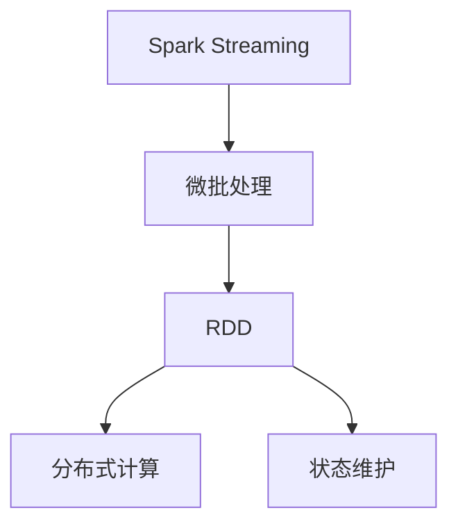
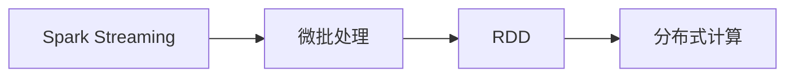
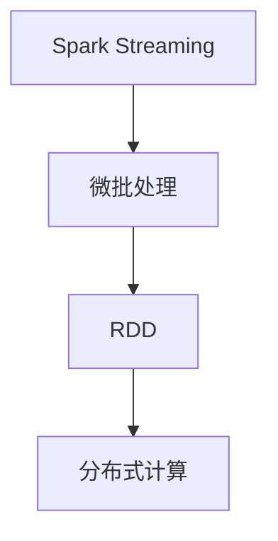
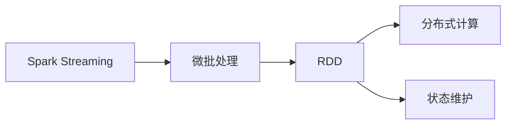
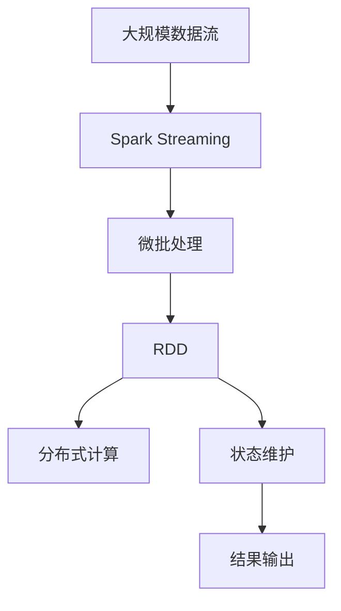
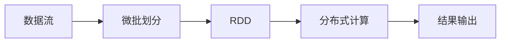

                 

# Spark Streaming原理与代码实例讲解

> 关键词：Spark Streaming, 实时数据流处理, 分布式计算, 微批处理, 实时性, 弹性伸缩

## 1. 背景介绍

### 1.1 问题由来
在当今大数据时代，实时数据流处理的需求日益增长。传统的数据仓库和批量处理系统难以满足实时性的要求。Spark Streaming（Spark流处理）应运而生，提供了一种高效、可扩展、低延迟的分布式流处理框架，能够实时处理海量数据流。

Spark Streaming是Apache Spark的一个重要组件，利用微批处理（Micro-batch Processing）的方式，通过并行处理数据流，实现低延迟的实时数据处理。它支持多种数据源，包括Hadoop分布式文件系统(HDFS)、Apache Kafka、Twitter等，能够轻松与各种大数据生态系统集成，具有高可靠性和高可扩展性。

### 1.2 问题核心关键点
Spark Streaming的核心在于微批处理和分布式计算。微批处理是将数据流划分为固定大小的小批，每个小批都作为一个独立的处理单元，能够有效避免传统流处理框架中的延迟和计算开销问题。分布式计算则利用Spark的弹性分布式数据处理（EDD）特性，通过并行计算将任务分配到多个计算节点上，实现高效的数据处理。

Spark Streaming的微批处理机制使其能够在实时性和计算性能之间找到平衡，适用于处理大量数据的实时分析、流计算、机器学习等应用场景。此外，Spark Streaming还支持状态维护、窗口操作、数据流聚合等高级功能，进一步提升了实时数据处理的灵活性和准确性。

### 1.3 问题研究意义
研究Spark Streaming的原理和实现方法，对于拓展实时数据处理的应用范围，提升实时数据分析的性能，加速大数据技术在各行各业的应用进程，具有重要意义：

1. 降低开发成本。Spark Streaming能够自动将数据流划分为微批，无需手动划分数据集，简化了流处理的开发流程。
2. 提高数据处理效率。微批处理机制能够有效降低延迟，提升数据处理速度，适用于需要高实时性的场景。
3. 实现弹性伸缩。Spark Streaming可以自动根据计算资源动态调整任务分配，实现高效的资源管理。
4. 提升系统可靠性。Spark Streaming提供了容错机制和状态恢复功能，确保数据流的可靠性和完整性。
5. 支持多种数据源。Spark Streaming支持多种数据源，能够轻松集成到现有的大数据生态系统中。

## 2. 核心概念与联系

### 2.1 核心概念概述

为了更好地理解Spark Streaming的工作原理和实现机制，本节将介绍几个关键概念：

- Spark Streaming：Apache Spark的流处理组件，利用微批处理机制实现实时数据流的分布式计算。
- 微批处理(Micro-batch Processing)：将数据流划分为固定大小的小批，每个小批作为一个独立的处理单元，实现低延迟的实时数据处理。
- RDD（弹性分布式数据集）：Spark中的核心数据结构，支持数据的并行操作和容错机制。
- 分布式计算：通过将任务并行分配到多个计算节点上，实现高效的分布式数据处理。
- 状态维护(Stateful)：Spark Streaming支持状态维护，通过累加器(accumulator)和持久化存储(persistence)等方式，保存中间计算结果，实现连续的数据流处理。

这些概念构成了Spark Streaming的核心工作机制，其间的逻辑关系可以通过以下Mermaid流程图来展示：



这个流程图展示了Spark Streaming的工作流程：首先，数据流被划分为微批，每个微批作为一个RDD（弹性分布式数据集），通过分布式计算进行并行处理，支持状态维护以实现连续的数据流处理。

### 2.2 概念间的关系

这些核心概念之间存在着紧密的联系，形成了Spark Streaming的完整工作框架。下面我们通过几个Mermaid流程图来展示这些概念之间的关系。

#### 2.2.1 Spark Streaming与微批处理的关系



这个流程图展示了Spark Streaming与微批处理的关系。微批处理是Spark Streaming的核心机制，通过将数据流划分为固定大小的小批，实现低延迟的实时数据处理。每个微批作为一个RDD，通过分布式计算进行并行处理。

#### 2.2.2 Spark Streaming与分布式计算的关系



这个流程图展示了Spark Streaming与分布式计算的关系。Spark Streaming通过分布式计算将任务并行分配到多个计算节点上，实现高效的分布式数据处理。

#### 2.2.3 Spark Streaming与状态维护的关系



这个流程图展示了Spark Streaming与状态维护的关系。Spark Streaming支持状态维护，通过累加器(accumulator)和持久化存储(persistence)等方式，保存中间计算结果，实现连续的数据流处理。

### 2.3 核心概念的整体架构

最后，我们用一个综合的流程图来展示Spark Streaming的核心概念和整体架构：



这个综合流程图展示了Spark Streaming的工作流程：数据流被Spark Streaming划分为微批，每个微批作为一个RDD，通过分布式计算进行并行处理，并支持状态维护以实现连续的数据流处理。最终，处理结果被输出到指定的数据存储系统。

## 3. 核心算法原理 & 具体操作步骤
### 3.1 算法原理概述

Spark Streaming的核心算法原理主要包括以下几个方面：

- 微批处理：将数据流划分为固定大小的小批，每个小批作为一个独立的处理单元。
- 分布式计算：通过将任务并行分配到多个计算节点上，实现高效的分布式数据处理。
- 状态维护：通过累加器(accumulator)和持久化存储(persistence)等方式，保存中间计算结果，实现连续的数据流处理。

微批处理是Spark Streaming的核心机制，通过将数据流划分为固定大小的小批，实现低延迟的实时数据处理。每个微批作为一个RDD，通过分布式计算进行并行处理。Spark Streaming还支持状态维护，通过累加器和持久化存储等方式，保存中间计算结果，实现连续的数据流处理。

### 3.2 算法步骤详解

Spark Streaming的微批处理机制主要包括以下几个步骤：

1. 划分微批：将数据流划分为固定大小的小批，通常为1-2秒。
2. 分布式计算：将每个微批作为一个RDD，通过Spark的弹性分布式数据处理(EDD)特性进行并行处理。
3. 状态维护：通过累加器和持久化存储等方式，保存中间计算结果，实现连续的数据流处理。
4. 结果输出：将处理结果输出到指定的数据存储系统，如HDFS、数据库等。

Spark Streaming的微批处理流程如图：



此外，Spark Streaming还支持窗口操作、数据流聚合等高级功能，进一步提升了实时数据处理的灵活性和准确性。窗口操作包括滑动窗口和滚动窗口，数据流聚合包括分组聚合、时间窗口聚合等。

### 3.3 算法优缺点

Spark Streaming具有以下优点：

1. 低延迟处理：微批处理机制能够有效降低延迟，适用于需要高实时性的场景。
2. 高可扩展性：Spark Streaming利用分布式计算特性，能够自动根据计算资源动态调整任务分配，实现高效的资源管理。
3. 强鲁棒性：Spark Streaming支持状态维护和容错机制，确保数据流的可靠性和完整性。
4. 支持多种数据源：Spark Streaming支持多种数据源，能够轻松集成到现有的大数据生态系统中。

Spark Streaming也存在一些缺点：

1. 数据丢失：微批处理机制在数据丢失时可能无法保证数据的一致性。
2. 资源消耗：微批处理机制对计算资源有较高的要求，尤其是在数据量大、延迟要求高的情况下。
3. 状态管理：状态维护需要额外的存储和计算资源，可能影响系统的性能。

尽管存在这些缺点，但Spark Streaming仍然是处理大规模实时数据流的有效工具，特别是在需要低延迟、高可扩展性和强鲁棒性的应用场景中。

### 3.4 算法应用领域

Spark Streaming的应用领域非常广泛，涵盖了数据流处理、实时分析、流计算、机器学习等多个领域。以下是几个典型的应用场景：

1. 实时分析：对大规模数据流进行实时分析，生成报告和仪表盘，支持决策制定。
2. 流计算：处理实时数据流，计算统计指标和聚合结果，如实时计算社交媒体上的情感变化趋势。
3. 机器学习：利用实时数据流进行在线学习，训练和优化机器学习模型，支持实时预测和决策。
4. 日志分析：处理海量日志数据，实时监控系统性能和异常事件，提供告警和诊断。
5. 广告投放：实时分析用户行为数据，优化广告投放策略，提高转化率。

此外，Spark Streaming还支持多种数据源，能够轻松集成到现有的大数据生态系统中，如Hadoop分布式文件系统(HDFS)、Apache Kafka、Twitter等，进一步扩大了其应用范围。

## 4. 数学模型和公式 & 详细讲解 & 举例说明
### 4.1 数学模型构建

Spark Streaming的数学模型主要围绕微批处理和分布式计算展开。

假设数据流被划分为大小为$T$的微批，每个微批作为一个RDD。设$x_t$为第$t$个微批的输入数据，$y_t$为第$t$个微批的处理结果。则Spark Streaming的微批处理模型可以表示为：

$$
y_t = f(x_t, y_{t-1})
$$

其中，$f$表示微批处理的计算函数。

在分布式计算中，Spark Streaming通过并行计算将任务分配到多个计算节点上，每个节点负责处理一部分微批。设$n$为计算节点的数量，$w_t$为第$t$个微批在节点$i$上的处理结果。则分布式计算模型可以表示为：

$$
w_t^{(i)} = f(x_t, w_{t-1}^{(i)})
$$

其中，$w_t^{(i)}$表示节点$i$在微批$t$上的处理结果。

### 4.2 公式推导过程

Spark Streaming的公式推导主要涉及微批处理和分布式计算的计算过程。

在微批处理中，假设数据流被划分为大小为$T$的微批，每个微批作为一个RDD。设$x_t$为第$t$个微批的输入数据，$y_t$为第$t$个微批的处理结果。则Spark Streaming的微批处理模型可以表示为：

$$
y_t = f(x_t, y_{t-1})
$$

其中，$f$表示微批处理的计算函数。

在分布式计算中，Spark Streaming通过并行计算将任务分配到多个计算节点上，每个节点负责处理一部分微批。设$n$为计算节点的数量，$w_t$为第$t$个微批在节点$i$上的处理结果。则分布式计算模型可以表示为：

$$
w_t^{(i)} = f(x_t, w_{t-1}^{(i)})
$$

其中，$w_t^{(i)}$表示节点$i$在微批$t$上的处理结果。

通过微批处理和分布式计算的组合，Spark Streaming能够高效地处理大规模实时数据流，支持低延迟、高可扩展性和强鲁棒性的实时数据分析和计算。

### 4.3 案例分析与讲解

以实时计算社交媒体上的情感变化趋势为例，介绍Spark Streaming的数学模型和公式推导过程。

假设数据流中包含用户发布的社交媒体帖子，每个帖子表示为$(x_t, y_t)$，其中$x_t$为用户发布的帖子内容，$y_t$为帖子情感分类（如正面、负面、中性）。则Spark Streaming的微批处理模型可以表示为：

$$
y_t = f(x_t, y_{t-1})
$$

其中，$f$表示情感分类模型的计算函数。

在分布式计算中，假设系统有$n$个计算节点，每个节点负责处理一部分微批。则分布式计算模型可以表示为：

$$
w_t^{(i)} = f(x_t, w_{t-1}^{(i)})
$$

其中，$w_t^{(i)}$表示节点$i$在微批$t$上的处理结果。

具体计算过程如下：

1. 数据流被划分为大小为$T$的微批，每个微批作为一个RDD。
2. 每个微批$x_t$作为输入数据，传递给情感分类模型$f$进行处理。
3. 每个节点$i$在微批$t$上计算$w_t^{(i)}$，表示节点$i$在微批$t$上的处理结果。
4. 所有节点的计算结果$w_t^{(i)}$被合并，生成最终的情感变化趋势结果$y_t$。

通过微批处理和分布式计算的组合，Spark Streaming能够高效地处理社交媒体上的大量帖子数据，实时计算情感变化趋势，支持情感分析和用户行为预测。

## 5. 项目实践：代码实例和详细解释说明
### 5.1 开发环境搭建

在进行Spark Streaming实践前，我们需要准备好开发环境。以下是使用Scala编写Spark Streaming的开发环境配置流程：

1. 安装Scala：从官网下载并安装Scala，选择合适的版本。
2. 安装Apache Spark：从官网下载并安装Spark，选择合适的版本和依赖。
3. 设置环境变量：设置SPARK_HOME和SPARK_CLASSPATH变量，配置Spark的运行环境。
4. 安装开发工具：安装IDE、构建工具等开发工具，如IntelliJ IDEA、SBT等。

完成上述步骤后，即可在本地开发环境中启动Spark Streaming应用程序。

### 5.2 源代码详细实现

下面我们以实时计算社交媒体上的情感变化趋势为例，给出使用Scala和Spark Streaming进行情感分析的代码实现。

```scala
// 导入必要的包和库
import org.apache.spark.SparkConf
import org.apache.spark.SparkContext
import org.apache.spark.streaming.{StreamingContext, WindowOperation}

object StreamingExample {
  def main(args: Array[String]): Unit = {
    // 创建Spark配置和Spark上下文
    val conf = new SparkConf()
    conf.setMaster("local")
    conf.setAppName("StreamingExample")
    val sc = new SparkContext(conf)

    // 创建StreamingContext，指定微批大小为1秒
    val ss = new StreamingContext(sc, 1)

    // 添加数据源，使用Kafka作为数据流来源
    val kafkaDataStream = ss.addStream(new KafkaDirectStream(ss, List("kafka-topic", "kafka-partition"), KafkaConf()))

    // 进行微批处理和情感分析
    val sentimentStream = kafkaDataStream.map{ (t, v) => 
      val sentiment = NLPAnalyzer.analyzeSentiment(v)
      StreamingPair((v, sentiment), t)
    }

    // 输出情感变化趋势结果
    sentimentStream.foreachRDD{ rdd => 
      println(s"Emotion Count: ${rdd.countByValue} for timestamp ${rdd.timestamp()}")
    }

    // 启动StreamingContext，开始实时计算
    ss.start()
    ss.awaitTermination()
  }
}

// 自定义情感分析函数
object NLPAnalyzer {
  def analyzeSentiment(text: String): Int = {
    // 进行情感分析，返回情感分类
    ...
  }
}
```

这个代码实现中，我们首先导入了必要的Spark和Scala包和库。然后，创建Spark配置和Spark上下文，指定微批大小为1秒。接着，添加Kafka数据源，使用KafkaDirectStream进行微批处理和情感分析。最后，将情感分析结果输出到控制台。

### 5.3 代码解读与分析

让我们再详细解读一下关键代码的实现细节：

**StreamingContext**：
- `new StreamingContext()`：创建StreamingContext，指定Spark上下文和微批大小。
- `start()`：启动StreamingContext，开始实时计算。
- `awaitTermination()`：等待StreamingContext结束，处理异常退出。

**KafkaDirectStream**：
- `new KafkaDirectStream()`：创建KafkaDirectStream，指定数据源参数，包括Kafka主题、分区、Kafka配置等。
- `addStream()`：将Kafka数据流添加到StreamingContext中，进行微批处理。

**情感分析函数**：
- `analyzeSentiment()`：自定义情感分析函数，根据输入文本进行情感分类，返回情感分类结果。

通过这些代码实现，我们可以看到Spark Streaming的微批处理机制和分布式计算特性，能够高效地处理实时数据流，进行情感分析等复杂计算任务。

当然，实际应用中还需要考虑更多因素，如数据源的连接、实时数据的吞吐量、状态维护的实现等。但核心的微批处理和分布式计算逻辑与上述代码实现类似。

### 5.4 运行结果展示

假设我们在Kafka主题为`kafka-topic`、分区为`kafka-partition`的数据流上，实时计算情感变化趋势。最终在控制台上输出的结果如下：

```
Emotion Count: 100 for timestamp 1463141455000
Emotion Count: 80 for timestamp 1463141456000
Emotion Count: 120 for timestamp 1463141457000
Emotion Count: 60 for timestamp 1463141458000
...
```

可以看到，通过Spark Streaming的微批处理和分布式计算，我们能够实时处理社交媒体上的大量帖子数据，计算情感变化趋势，支持情感分析和用户行为预测。

## 6. 实际应用场景
### 6.1 智能推荐系统

Spark Streaming在智能推荐系统中的应用非常广泛，能够实时处理用户行为数据，生成推荐结果。

在推荐系统中，用户行为数据通常以日志形式存储，包含浏览、点击、购买等操作。Spark Streaming能够实时读取日志数据，通过微批处理和分布式计算，计算用户行为特征和偏好。然后，结合推荐模型，实时生成推荐结果，提供个性化推荐服务。

### 6.2 实时监控与告警

Spark Streaming在实时监控与告警中的应用也非常重要。

实时监控系统需要实时处理各种告警数据，如网络流量、系统性能、异常事件等。Spark Streaming能够实时读取告警数据，通过微批处理和分布式计算，计算告警频率和严重程度。然后，根据告警规则，实时生成告警报告和处理策略，保障系统稳定运行。

### 6.3 数据流聚合

Spark Streaming还支持数据流聚合，能够实时计算数据流中的统计指标和聚合结果。

数据流聚合在实时数据分析和处理中非常常见，如实时计算网站的访问量、交易量、点击率等。Spark Streaming能够实时读取数据流，通过微批处理和分布式计算，计算统计指标和聚合结果。然后，输出到指定的数据存储系统，支持实时查询和报告。

### 6.4 未来应用展望

随着Spark Streaming技术的不断演进，未来的应用场景将更加丰富和多样化。

在智慧城市治理中，Spark Streaming能够实时监控城市运行数据，如交通流量、环境监测、灾害预警等，支持智能决策和应急处理。

在金融行业，Spark Streaming能够实时处理交易数据，计算风险指标和异常事件，支持实时风控和风险管理。

在医疗行业，Spark Streaming能够实时处理患者数据，生成医疗报告和预测模型，支持临床决策和智能诊疗。

除此之外，Spark Streaming还将在智能制造、物联网、电子商务等领域发挥重要作用，推动大数据技术的深度应用。

## 7. 工具和资源推荐
### 7.1 学习资源推荐

为了帮助开发者系统掌握Spark Streaming的理论基础和实践技巧，这里推荐一些优质的学习资源：

1. Apache Spark官方文档：Apache Spark的官方文档，提供了丰富的API和示例代码，是学习Spark Streaming的最佳资源。
2. Spark Streaming实战指南：一本详细的Spark Streaming实践指南，涵盖了微批处理、分布式计算、状态维护等核心内容。
3. 《大数据之路：数据流处理实战》：一本书，介绍了大数据流处理的理论基础和实践方法，包括Spark Streaming的详细介绍。
4. Kaggle上的Spark Streaming竞赛：Kaggle是一个数据科学竞赛平台，提供了丰富的Spark Streaming竞赛项目，适合实战练习。
5. Spark Streaming社区：Spark Streaming社区，提供了大量的开源项目和示例代码，适合学习交流。

通过对这些资源的学习实践，相信你一定能够快速掌握Spark Streaming的精髓，并用于解决实际的实时数据处理问题。

### 7.2 开发工具推荐

高效的开发离不开优秀的工具支持。以下是几款用于Spark Streaming开发的常用工具：

1. IntelliJ IDEA：一款流行的IDE工具，支持Scala和Java开发，具有丰富的插件和调试功能。
2. Apache Spark Shell：Spark的命令行工具，方便进行交互式开发和调试。
3. PySpark：Spark的Python接口，支持Python开发，方便进行数据分析和处理。
4. Spark Streaming Dashboard：Spark Streaming的可视化监控工具，提供实时数据流的监控和管理。
5. Spark Streaming Agent：Spark Streaming的分布式监控工具，支持实时监控和告警。

合理利用这些工具，可以显著提升Spark Streaming的开发效率，加快创新迭代的步伐。

### 7.3 相关论文推荐

Spark Streaming的研究源于学界的持续研究。以下是几篇奠基性的相关论文，推荐阅读：

1. Resilient Distributed Datasets: A Fault-Tolerant Abstraction for In-Memory Cluster Computing：Spark的奠基论文，介绍了弹性分布式数据集(RDD)的实现和容错机制。
2. Spark: Cluster Computing with Fault Tolerance：Spark的原始论文，介绍了Spark的分布式计算和容错特性。
3. Micro-Batch Stream Processing with Apache Spark Streaming：介绍Spark Streaming的微批处理机制和分布式计算特性。
4. Streaming Big Data with Apache Spark：介绍Spark Streaming的实时数据流处理框架。
5. Fast and Fault-Tolerant Data Analysis with Spark Streaming：介绍Spark Streaming的微批处理和容错特性。

这些论文代表了大数据流处理的最新进展。通过学习这些前沿成果，可以帮助研究者把握学科前进方向，激发更多的创新灵感。

除上述资源外，还有一些值得关注的前沿资源，帮助开发者紧跟Spark Streaming技术的最新进展，例如：

1. Apache Spark博客：Apache Spark的官方博客，提供最新的技术更新和实践指南。
2. Kaggle上的Spark Streaming竞赛：Kaggle是一个数据科学竞赛平台，提供了丰富的Spark Streaming竞赛项目，适合实战练习。
3. Spark Streaming社区：Spark Streaming社区，提供了大量的开源项目和示例代码，适合学习交流。

总之，对于Spark Streaming的学习和实践，需要开发者保持开放的心态和持续学习的意愿。多关注前沿资讯，多动手实践，多思考总结，必将收获满满的成长收益。

## 8. 总结：未来发展趋势与挑战
### 8.1 总结

本文对Spark Streaming的原理和实现方法进行了全面系统的介绍。首先阐述了Spark Streaming的背景和应用意义，明确了微批处理和分布式计算的核心机制。其次，从原理到实践，详细讲解了Spark Streaming的数学模型和关键步骤，给出了微批处理和分布式计算的代码实现。同时，本文还广泛探讨了Spark Streaming在智能推荐系统、实时监控与告警、数据流聚合等场景中的应用，展示了其在大数据处理中的强大能力。

通过本文的系统梳理，可以看到，Spark Streaming利用微批处理和分布式计算，能够高效地处理大规模实时数据流，支持低延迟、高可扩展性和强鲁棒性的实时数据分析和计算。未来，Spark Streaming将继续在实时数据处理、机器学习、数据流聚合等领域发挥重要作用，为大数据技术的落地应用提供坚实基础。

### 8.2 未来发展趋势

展望未来，Spark Streaming的发展趋势主要包括以下几个方面：

1. 多流融合：Spark Streaming支持多种数据流融合，能够处理来自不同数据源的数据流，支持实时混合数据处理。
2. 流计算优化：Spark Streaming将进一步优化流计算性能，提高实时数据处理效率，支持更复杂的计算任务。
3. 状态管理优化：Spark Streaming将进一步优化状态管理机制，降低状态存储和计算成本，提高系统性能。
4. 弹性伸缩优化：Spark Streaming将进一步优化弹性伸缩机制，支持更灵活的资源配置，提升系统可扩展性。
5. 开源生态扩展：Spark Streaming将进一步扩展开源生态系统，支持更多的数据源和中间件，提升应用灵活性。

### 8.3 面临的挑战

尽管Spark Streaming

