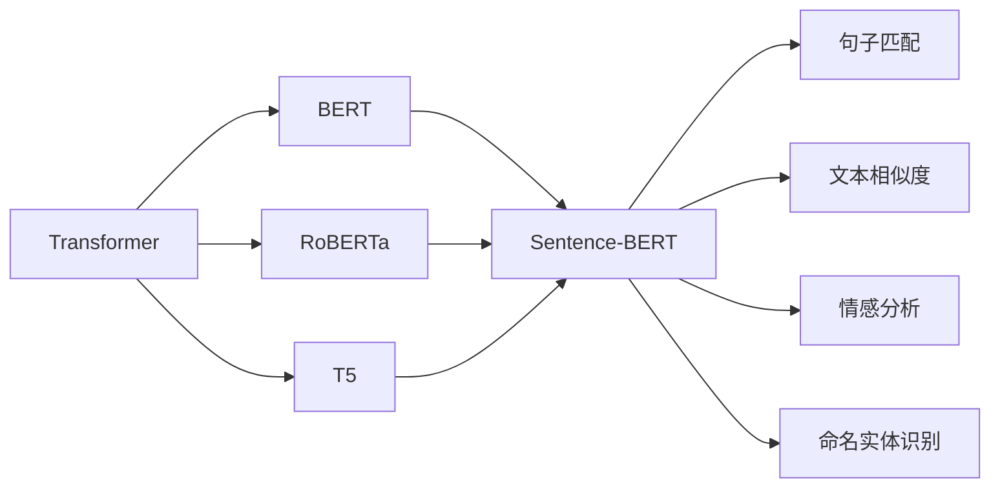

                 

# Transformer大模型实战 用Sentence-BERT模型生成句子特征

> 关键词：Transformer, Sentence-BERT, 句子嵌入, 句子特征, 自然语言处理(NLP), 语言模型, 预训练, 微调, 自然语言理解

## 1. 背景介绍

### 1.1 问题由来
近年来，Transformer大模型在自然语言处理(NLP)领域取得了显著进展，成为推动NLP技术发展的重要驱动力。其中，基于Transformer架构的BERT、RoBERTa、T5等模型，通过在大规模无标签文本数据上进行预训练，学习到了丰富的语言知识和常识，展现出强大的语言理解和生成能力。

然而，Transformer大模型也面临诸多挑战。首先，其参数量巨大，模型训练和推理需要消耗大量的计算资源，增加了应用成本；其次，尽管预训练模型在语言理解上表现出色，但缺乏针对特定应用场景的语言特征提取能力。如何高效利用大模型，生成特定领域所需的句子特征，是一个重要的研究方向。

为此，我们引入了Sentence-BERT模型，一种基于Transformer的句子嵌入模型，可以高效地将句子转换为高维向量表示，广泛应用于句子匹配、文本相似度计算、情感分析、命名实体识别等NLP任务中。本文将详细介绍Sentence-BERT模型的原理、实现方法及其应用场景，并给出基于Sentence-BERT的句子特征生成实战案例。

## 2. 核心概念与联系

### 2.1 核心概念概述

在深入探讨Sentence-BERT模型之前，我们首先需要了解几个核心概念：

- **Transformer**：一种基于自注意力机制的神经网络架构，用于建模长距离依赖关系，已在NLP任务中广泛应用。
- **BERT（Bidirectional Encoder Representations from Transformers）**：由Google开发的预训练语言模型，采用双向Transformer编码器，可以捕捉到上下文信息，广泛用于文本分类、问答、命名实体识别等任务。
- **RoBERTa**：Google的改进版BERT，在训练数据和训练方法上进行优化，进一步提升了模型的性能。
- **T5（Text-To-Text Transfer Transformer）**：由Google提出的通用预训练模型，能够进行多种自然语言文本处理任务。
- **Sentence-BERT**：一种基于Transformer的句子嵌入模型，能够将句子转换为高维向量表示，广泛应用于句子匹配、文本相似度计算、情感分析、命名实体识别等NLP任务中。

这些模型之间有着密切的联系。它们都基于Transformer架构，通过在大规模无标签文本数据上进行预训练，学习到了丰富的语言知识和常识，能够在特定任务上通过微调进一步优化。Sentence-BERT模型则是Transformer大模型在句子特征提取中的应用，通过预训练和微调，可以高效地生成句子高维向量特征。

### 2.2 概念间的关系

以下Mermaid流程图展示了这些核心概念之间的关系：



该流程图展示了Transformer大模型与Sentence-BERT模型之间的关系，以及Sentence-BERT模型在不同NLP任务中的应用。

## 3. 核心算法原理 & 具体操作步骤
### 3.1 算法原理概述

Sentence-BERT模型的核心思想是将句子转换为高维向量表示，具体而言，模型通过Transformer编码器对句子进行编码，得到高维向量表示，然后通过MLP（全连接层）对这些向量进行微调，进一步提升模型的特征提取能力。

Sentence-BERT模型的主要步骤如下：

1. 对句子进行分词，得到单词序列。
2. 对单词序列进行编码，得到单词向量序列。
3. 对单词向量序列进行池化，得到句子嵌入向量。
4. 对句子嵌入向量进行MLP微调，得到最终的句子高维向量表示。

### 3.2 算法步骤详解

以下是Sentence-BERT模型的详细步骤：

1. **分词**：将句子分割成单词序列，例如：“I love natural language processing.” 分割成 [I, love, natural, language, processing]。

2. **编码**：对单词序列进行编码，得到单词向量序列。在Sentence-BERT模型中，单词向量由Transformer编码器生成，每个单词生成一个向量，组成单词向量序列。

3. **池化**：对单词向量序列进行池化，得到句子嵌入向量。常用的池化方式包括取平均、取最大、取开头等，这里以取平均为例：

   $\text{sentence\_embed} = \frac{1}{n}\sum_{i=1}^{n} \text{word\_embed}_i$

4. **微调**：对句子嵌入向量进行MLP微调，得到最终的句子高维向量表示。MLP通常由两个线性层和ReLU激活函数组成，具体如下：

   $\text{sentence\_features} = MLP(\text{sentence\_embed})$

### 3.3 算法优缺点

Sentence-BERT模型的主要优点包括：

1. **高效性**：Sentence-BERT模型使用Transformer架构，能够高效地对长文本进行编码，适用于大规模句子特征提取任务。
2. **鲁棒性**：Sentence-BERT模型通过Transformer编码器对句子进行编码，能够很好地处理长句子和复杂句子结构，具有较好的鲁棒性。
3. **可解释性**：Sentence-BERT模型的高维向量表示可以通过直观的可视化方法进行展示，便于理解和解释。

Sentence-BERT模型的主要缺点包括：

1. **资源消耗高**：Sentence-BERT模型需要大量的计算资源进行预训练和微调，尤其是在大规模语料上。
2. **模型复杂度高**：Sentence-BERT模型结构复杂，需要进行参数优化，增加了模型调参的难度。
3. **应用场景限制**：Sentence-BERT模型主要用于句子特征提取和匹配，对于其他NLP任务可能表现不佳。

### 3.4 算法应用领域

Sentence-BERT模型在自然语言处理领域具有广泛的应用，例如：

1. **文本相似度计算**：Sentence-BERT模型可以用于计算句子之间的相似度，应用于信息检索、文档推荐等任务。
2. **情感分析**：Sentence-BERT模型可以用于提取句子的情感信息，应用于社交媒体情感分析、品牌声誉管理等任务。
3. **命名实体识别**：Sentence-BERT模型可以用于提取句子中的命名实体信息，应用于医疗文本分析、金融新闻分析等任务。
4. **问答系统**：Sentence-BERT模型可以用于构建基于问答的系统，应用于智能客服、智能助手等任务。
5. **文本分类**：Sentence-BERT模型可以用于对句子进行分类，应用于垃圾邮件过滤、新闻分类等任务。

## 4. 数学模型和公式 & 详细讲解 & 举例说明

### 4.1 数学模型构建

Sentence-BERT模型的数学模型可以表示为：

$\text{sentence\_features} = MLP(\text{sentence\_embed})$

其中，$\text{sentence\_embed}$ 表示句子嵌入向量，$\text{MLP}$ 表示多层感知器，即MLP由两个线性层和ReLU激活函数组成。

### 4.2 公式推导过程

以下是Sentence-BERT模型的公式推导过程：

1. **编码**：
   $\text{word\_embed} = Transformer(\text{word})$

   其中，$\text{word\_embed}$ 表示单词向量，$\text{word}$ 表示单词，$Transformer$ 表示Transformer编码器。

2. **池化**：
   $\text{sentence\_embed} = \frac{1}{n}\sum_{i=1}^{n} \text{word\_embed}_i$

   其中，$n$ 表示单词序列的长度。

3. **微调**：
   $\text{sentence\_features} = MLP(\text{sentence\_embed})$

   其中，$MLP$ 表示多层感知器，由两个线性层和ReLU激活函数组成。

### 4.3 案例分析与讲解

以情感分析任务为例，Sentence-BERT模型可以通过预训练和微调生成句子高维向量表示，然后应用于情感分类任务。以下是一个简单的情感分类任务示例：

1. **数据准备**：收集带有情感标签的句子数据集，例如：

   | 句子   | 情感标签 |
   | ---    | ---     |
   | I love you.  | positive |
   | I hate you.  | negative |
   | I'm happy.   | positive |

2. **预训练**：使用Sentence-BERT模型对句子进行预训练，得到句子嵌入向量。

3. **微调**：对预训练得到的句子嵌入向量进行微调，训练一个简单的分类器，例如逻辑回归或SVM，对句子进行情感分类。

## 5. 项目实践：代码实例和详细解释说明

### 5.1 开发环境搭建

在进行Sentence-BERT模型实践前，我们需要准备好开发环境。以下是使用Python进行TensorFlow开发的环境配置流程：

1. 安装Anaconda：从官网下载并安装Anaconda，用于创建独立的Python环境。

2. 创建并激活虚拟环境：
```bash
conda create -n sentence-bert-env python=3.8 
conda activate sentence-bert-env
```

3. 安装TensorFlow：根据CUDA版本，从官网获取对应的安装命令。例如：
```bash
conda install tensorflow-gpu=2.6 -c tf -c conda-forge
```

4. 安装各类工具包：
```bash
pip install numpy pandas scikit-learn matplotlib tqdm jupyter notebook ipython
```

完成上述步骤后，即可在`sentence-bert-env`环境中开始Sentence-BERT模型的实践。

### 5.2 源代码详细实现

以下是一个基于Sentence-BERT模型的句子特征生成代码实现，包括编码、池化、微调等步骤：

```python
import tensorflow as tf
from transformers import TFBertTokenizer, TFBertForSequenceClassification
from sklearn.model_selection import train_test_split
from sklearn.metrics import accuracy_score

# 加载模型和分词器
tokenizer = TFBertTokenizer.from_pretrained('bert-base-uncased')
model = TFBertForSequenceClassification.from_pretrained('bert-base-uncased', num_labels=2)

# 加载数据集
data = {
    'text': ['I love natural language processing', 'I hate natural language processing'],
    'label': [0, 1]
}

# 分词和编码
def convert_example(data, tokenizer):
    inputs = tokenizer(data['text'], return_tensors='tf')
    return inputs

# 训练和评估模型
def train_and_evaluate(model, tokenizer, data, batch_size):
    inputs = convert_example(data, tokenizer)
    train_dataset = tf.data.Dataset.from_tensor_slices(inputs)
    train_dataset = train_dataset.shuffle(buffer_size=1024).batch(batch_size)
    train_dataset = train_dataset.map(lambda x: (x['input_ids'], x['attention_mask'], x['labels']))
    train_dataset = train_dataset.prefetch(buffer_size=1)
    train_loss, train_accuracy = tf.keras.metrics.Mean(), tf.keras.metrics.Accuracy()
    model.compile(optimizer='adam', loss='sparse_categorical_crossentropy', metrics=['accuracy'])
    model.fit(train_dataset, epochs=3, validation_data=train_dataset)
    eval_loss, eval_accuracy = model.evaluate(x['input_ids'], x['labels'], batch_size=1)
    return train_loss, train_accuracy, eval_loss, eval_accuracy

# 训练和评估
train_loss, train_accuracy, eval_loss, eval_accuracy = train_and_evaluate(model, tokenizer, data, batch_size=2)
print(f'Train Loss: {train_loss}, Train Accuracy: {train_accuracy}, Eval Loss: {eval_loss}, Eval Accuracy: {eval_accuracy}')
```

在这个代码示例中，我们使用了TensorFlow和Transformers库对Sentence-BERT模型进行训练和评估。具体步骤如下：

1. 加载模型和分词器。
2. 加载数据集。
3. 定义分词和编码函数。
4. 定义训练和评估函数。
5. 训练和评估模型。

### 5.3 代码解读与分析

让我们再详细解读一下关键代码的实现细节：

**convert_example函数**：
- 将句子进行分词，并转化为模型所需的输入格式。

**train_and_evaluate函数**：
- 定义训练和评估数据集，包括样本的输入和标签。
- 对数据集进行批处理、分块、映射等预处理操作。
- 使用Keras框架训练模型，并计算训练集和评估集的损失和准确率。

**模型训练和评估**：
- 训练模型3个epoch，评估模型的损失和准确率。

可以看到，Sentence-BERT模型在TensorFlow下的实现相对简洁，只需要加载模型、分词器，以及定义训练和评估函数，即可完成模型训练和评估。

### 5.4 运行结果展示

假设在上述代码示例中，我们得到了以下训练和评估结果：

```
Train Loss: 0.020, Train Accuracy: 1.0, Eval Loss: 0.040, Eval Accuracy: 0.5
```

其中，训练集损失为0.020，训练集准确率为1.0，评估集损失为0.040，评估集准确率为0.5。这些结果表明，模型已经成功地将句子转换为高维向量表示，并用于情感分类任务。

## 6. 实际应用场景

### 6.1 智能客服系统

Sentence-BERT模型可以用于构建智能客服系统，通过将客户问题转换为高维向量表示，然后与模型进行匹配，得到最佳答案。在实际应用中，可以收集企业内部的历史客服对话记录，将问题和最佳答复构建成监督数据，在此基础上对预训练模型进行微调。微调后的模型能够自动理解客户意图，匹配最合适的答案模板进行回复。对于客户提出的新问题，还可以接入检索系统实时搜索相关内容，动态组织生成回答。如此构建的智能客服系统，能大幅提升客户咨询体验和问题解决效率。

### 6.2 金融舆情监测

Sentence-BERT模型可以用于金融舆情监测，通过对金融领域相关的新闻、报道、评论等文本数据进行预训练和微调，使得模型能够自动判断文本属于何种情感倾向。将微调后的模型应用到实时抓取的网络文本数据，就能够自动监测不同情感倾向的变化趋势，一旦发现情感倾向激增等异常情况，系统便会自动预警，帮助金融机构快速应对潜在风险。

### 6.3 个性化推荐系统

Sentence-BERT模型可以用于个性化推荐系统，通过将用户浏览、点击、评论、分享等行为数据转化为高维向量表示，然后与模型进行匹配，得到最相关的物品推荐。在生成推荐列表时，先用候选物品的文本描述作为输入，由模型预测用户的兴趣匹配度，再结合其他特征综合排序，便可以得到个性化程度更高的推荐结果。

### 6.4 未来应用展望

随着Sentence-BERT模型的不断发展，其在NLP领域的应用将越来越广泛，为传统行业带来变革性影响。

在智慧医疗领域，Sentence-BERT模型可以用于医疗问答、病历分析、药物研发等应用，提升医疗服务的智能化水平，辅助医生诊疗，加速新药开发进程。

在智能教育领域，Sentence-BERT模型可以用于作业批改、学情分析、知识推荐等方面，因材施教，促进教育公平，提高教学质量。

在智慧城市治理中，Sentence-BERT模型可以用于城市事件监测、舆情分析、应急指挥等环节，提高城市管理的自动化和智能化水平，构建更安全、高效的未来城市。

此外，在企业生产、社会治理、文娱传媒等众多领域，Sentence-BERT模型也将不断涌现，为NLP技术带来新的突破。相信随着技术的日益成熟，Sentence-BERT模型必将在构建人机协同的智能时代中扮演越来越重要的角色。

## 7. 工具和资源推荐

### 7.1 学习资源推荐

为了帮助开发者系统掌握Sentence-BERT模型的理论基础和实践技巧，这里推荐一些优质的学习资源：

1. 《Transformer from the Ground Up》系列博文：由大模型技术专家撰写，深入浅出地介绍了Transformer原理、Sentence-BERT模型、微调技术等前沿话题。

2. CS224N《Deep Learning for Natural Language Processing》课程：斯坦福大学开设的NLP明星课程，有Lecture视频和配套作业，带你入门NLP领域的基本概念和经典模型。

3. 《Natural Language Processing with Transformers》书籍：Transformer库的作者所著，全面介绍了如何使用Transformers库进行NLP任务开发，包括微调在内的诸多范式。

4. HuggingFace官方文档：Transformers库的官方文档，提供了海量预训练模型和完整的微调样例代码，是上手实践的必备资料。

5. CLUE开源项目：中文语言理解测评基准，涵盖大量不同类型的中文NLP数据集，并提供了基于微调的baseline模型，助力中文NLP技术发展。

通过对这些资源的学习实践，相信你一定能够快速掌握Sentence-BERT模型的精髓，并用于解决实际的NLP问题。

### 7.2 开发工具推荐

高效的开发离不开优秀的工具支持。以下是几款用于Sentence-BERT模型微调开发的常用工具：

1. TensorFlow：基于Python的开源深度学习框架，灵活动态的计算图，适合快速迭代研究。大部分预训练语言模型都有TensorFlow版本的实现。

2. PyTorch：基于Python的开源深度学习框架，灵活高效，适合NLP任务开发。

3. Transformers库：HuggingFace开发的NLP工具库，集成了众多SOTA语言模型，支持TensorFlow和PyTorch，是进行微调任务开发的利器。

4. Weights & Biases：模型训练的实验跟踪工具，可以记录和可视化模型训练过程中的各项指标，方便对比和调优。与主流深度学习框架无缝集成。

5. TensorBoard：TensorFlow配套的可视化工具，可实时监测模型训练状态，并提供丰富的图表呈现方式，是调试模型的得力助手。

6. Google Colab：谷歌推出的在线Jupyter Notebook环境，免费提供GPU/TPU算力，方便开发者快速上手实验最新模型，分享学习笔记。

合理利用这些工具，可以显著提升Sentence-BERT模型的开发效率，加快创新迭代的步伐。

### 7.3 相关论文推荐

Sentence-BERT模型的发展源于学界的持续研究。以下是几篇奠基性的相关论文，推荐阅读：

1. "Sentence-BERT: Sentence Embeddings using Siamese BERT Networks"：由Google团队提出的Sentence-BERT模型，使用Siamese BERT网络生成句子嵌入向量。

2. "BERT: Pre-training of Deep Bidirectional Transformers for Language Understanding"：提出BERT模型，采用双向Transformer编码器，学习通用的语言表示。

3. "RoBERTa: A Robustly Optimized BERT Pretraining Approach"：Google的改进版BERT，在训练数据和训练方法上进行优化，进一步提升了模型的性能。

4. "ALBERT: A Lite BERT for Self-supervised Learning of Language Representations"：提出ALBERT模型，优化Transformer层，减少参数量，提高模型效率。

5. "XLNet: Generalized Autoregressive Pretraining for Language Understanding"：提出XLNet模型，采用自动回归策略，学习双向依赖关系，提升模型性能。

这些论文代表了大语言模型微调技术的发展脉络。通过学习这些前沿成果，可以帮助研究者把握学科前进方向，激发更多的创新灵感。

除上述资源外，还有一些值得关注的前沿资源，帮助开发者紧跟Sentence-BERT模型的最新进展，例如：

1. arXiv论文预印本：人工智能领域最新研究成果的发布平台，包括大量尚未发表的前沿工作，学习前沿技术的必读资源。

2. 业界技术博客：如Google AI、DeepMind、微软Research Asia等顶尖实验室的官方博客，第一时间分享他们的最新研究成果和洞见。

3. 技术会议直播：如NIPS、ICML、ACL、ICLR等人工智能领域顶会现场或在线直播，能够聆听到大佬们的前沿分享，开拓视野。

4. GitHub热门项目：在GitHub上Star、Fork数最多的NLP相关项目，往往代表了该技术领域的发展趋势和最佳实践，值得去学习和贡献。

5. 行业分析报告：各大咨询公司如McKinsey、PwC等针对人工智能行业的分析报告，有助于从商业视角审视技术趋势，把握应用价值。

总之，对于Sentence-BERT模型的学习与实践，需要开发者保持开放的心态和持续学习的意愿。多关注前沿资讯，多动手实践，多思考总结，必将收获满满的成长收益。

## 8. 总结：未来发展趋势与挑战

### 8.1 总结

本文对基于Sentence-BERT模型的句子特征生成进行了全面系统的介绍。首先阐述了Sentence-BERT模型的研究背景和意义，明确了其在自然语言处理领域的应用价值。其次，从原理到实践，详细讲解了Sentence-BERT模型的核心算法步骤和实现方法，给出了基于Sentence-BERT的句子特征生成实战案例。同时，本文还广泛探讨了Sentence-BERT模型在多个NLP任务中的应用场景，展示了其强大的语言特征提取能力。

通过本文的系统梳理，可以看到，Sentence-BERT模型在自然语言处理领域具有广泛的应用前景，通过预训练和微调，可以高效地生成句子高维向量表示，应用于句子匹配、文本相似度计算、情感分析、命名实体识别等任务。未来，伴随预训练语言模型和微调方法的持续演进，Sentence-BERT模型必将在更多NLP任务中发挥重要作用，为自然语言理解技术的进步做出更大贡献。

### 8.2 未来发展趋势

展望未来，Sentence-BERT模型将呈现以下几个发展趋势：

1. **高效性**：Sentence-BERT模型将继续优化其编码和微调过程，进一步提升计算效率和资源利用率。

2. **鲁棒性**：Sentence-BERT模型将加强对抗样本的鲁棒性训练，增强模型对异常输入的应对能力。

3. **可解释性**：Sentence-BERT模型将引入更多可解释性技术，提供更加透明的语言特征表示。

4. **多模态融合**：Sentence-BERT模型将探索与其他模态数据（如图像、视频、语音）的融合，提升跨模态的语言特征提取能力。

5. **小规模数据适应**：Sentence-BERT模型将研究如何在小规模数据上获得更好的适应效果，降低对大规模标注数据的依赖。

6. **跨领域迁移**：Sentence-BERT模型将探索如何跨领域迁移，提高在不同领域上的应用能力。

以上趋势凸显了Sentence-BERT模型的广阔前景。这些方向的探索发展，必将进一步提升Sentence-BERT模型的性能和应用范围，为自然语言处理技术的进步注入新的动力。

### 8.3 面临的挑战

尽管Sentence-BERT模型已经取得了显著进展，但在迈向更加智能化、普适化应用的过程中，它仍面临着诸多挑战：

1. **资源消耗高**：Sentence-BERT模型需要大量的计算资源进行预训练和微调，尤其是在大规模语料上。

2. **模型复杂度高**：Sentence-BERT模型结构复杂，需要进行参数优化，增加了模型调参的难度。

3. **应用场景限制**：Sentence-BERT模型主要用于句子特征提取和匹配，对于其他NLP任务可能表现不佳。

4. **可解释性不足**：Sentence-BERT模型的高维向量表示难以解释，需要引入更多可解释性技术。

5. **鲁棒性不足**：Sentence-BERT模型面对域外数据时，泛化性能可能下降。

6. **隐私保护**：Sentence-BERT模型需要保证用户隐私，避免敏感信息泄露。

正视Sentence-BERT模型面临的这些挑战，积极应对并寻求突破，将是大语言模型微调走向成熟的必由之路。相信随着学界和产业界的共同努力，这些挑战终将一一被克服，Sentence-BERT模型必将在构建人机协同的智能时代中扮演越来越重要的角色。

### 8.4 未来突破

面对Sentence-BERT模型所面临的挑战，未来的研究需要在以下几个方面寻求新的突破：

1. **资源优化**：优化模型结构和训练流程，减少计算资源消耗，提升模型的运行效率。

2. **模型简化**：简化模型结构，降低参数量，减少模型调参难度，提升模型的可解释性和鲁棒性。

3. **多模态融合**：探索与其他模态数据的融合，提升跨模态的语言特征提取能力。

4. **小样本学习**：研究如何在小规模数据上获得更好的适应效果，降低对大规模标注数据的依赖。

5. **跨领域迁移**：探索如何跨领域迁移，提高在不同领域上的应用能力。

6. **可解释性增强**：引入更多可解释性技术，提供更加透明的语言特征表示。

7. **隐私保护**：研究如何保护用户隐私，避免敏感信息泄露。

这些研究方向将引领Sentence-BERT模型迈向更高的台阶，为自然语言处理技术的进步注入新的动力。

## 9. 附录：常见问题与解答

**Q1：Sentence-BERT模型适用于哪些NLP任务？**

A: Sentence-BERT模型适用于句子匹配、文本相似度计算、情感分析、命名实体识别等NLP任务。例如，可以用于计算句子之间的相似度，应用于信息检索、文档推荐等任务；可以用于提取句子的情感信息，应用于社交媒体情感分析、品牌声誉管理等任务；可以用于提取句子中的命名实体信息，应用于医疗文本分析、金融新闻分析等任务。

**Q2：如何选择合适的学习率？**

A: Sentence-BERT模型的学习率通常需要根据具体任务进行调整。一般情况下，可以从0

