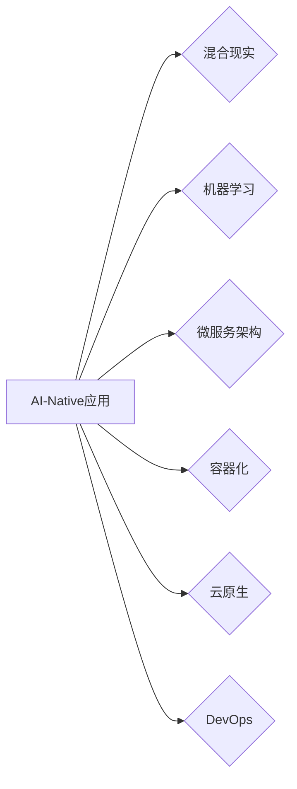

# AI-Native应用开发的最佳实践

> 关键词：AI-Native, 人工智能原生应用, 混合现实, 机器学习, 微服务架构, 容器化, 云原生, DevOps

## 1. 背景介绍

随着人工智能技术的飞速发展，AI已经从实验室走向了实际应用。AI-Native应用，即人工智能原生应用，是指那些从设计之初就考虑了人工智能技术的应用。这类应用利用机器学习、深度学习等AI技术，为用户提供更智能、更个性化的服务。AI-Native应用的兴起，标志着人工智能技术从辅助工具转变为应用的核心驱动力。

### 1.1 问题的由来

传统应用开发往往以功能实现为主，较少考虑AI技术的融合。随着用户需求的变化，传统应用逐渐难以满足个性化、智能化等需求。而AI-Native应用则能够更好地适应这种变化，为用户提供更加精准、高效的服务。

### 1.2 研究现状

目前，AI-Native应用开发已经成为业界热点。众多企业纷纷投入资源，开发基于AI的技术产品。然而，AI-Native应用开发涉及的技术栈复杂，需要开发者具备丰富的知识和技能。

### 1.3 研究意义

AI-Native应用开发的最佳实践，对于提高AI应用的开发效率、降低开发成本、提升应用性能具有重要意义。

### 1.4 本文结构

本文将系统地介绍AI-Native应用开发的最佳实践，包括核心概念、算法原理、项目实践、实际应用场景、工具和资源推荐、未来发展趋势与挑战等。

## 2. 核心概念与联系

### 2.1 核心概念

- **AI-Native应用**：指从设计之初就考虑了人工智能技术的应用，利用机器学习、深度学习等技术，为用户提供智能化服务。
- **混合现实**：结合现实世界和虚拟世界，通过增强现实(AR)和虚拟现实(VR)技术，提供沉浸式体验。
- **机器学习**：一种使计算机能够模拟或实现人类学习行为的技术，通过数据驱动的方式改进算法性能。
- **微服务架构**：将应用拆分为多个独立、可扩展的服务，提高应用的可维护性和可扩展性。
- **容器化**：将应用及其依赖环境打包为容器，实现环境隔离和一致部署。
- **云原生**：一种应用架构风格，将应用构建在容器化、服务网格、DevOps等现代技术之上。
- **DevOps**：一种软件开发和运维的协作文化，强调快速、持续、安全的软件交付。

### 2.2 Mermaid 流程图



### 2.3 核心概念联系

AI-Native应用是本文的核心概念，其他概念为其提供技术支持。混合现实、机器学习、微服务架构等概念相互关联，共同构建了AI-Native应用的底层技术体系。

## 3. 核心算法原理 & 具体操作步骤

### 3.1 算法原理概述

AI-Native应用的核心算法包括机器学习、深度学习等。以下以卷积神经网络(CNN)为例，简要介绍其原理。

- **卷积层**：通过卷积操作提取输入数据的局部特征。
- **池化层**：降低特征图的分辨率，减少参数数量，提高计算效率。
- **全连接层**：将卷积层提取的特征进行线性组合，输出最终的预测结果。

### 3.2 算法步骤详解

1. **数据收集与预处理**：收集相关数据，并进行清洗、标注等预处理操作。
2. **模型设计**：根据任务需求设计神经网络结构，选择合适的网络层和激活函数。
3. **模型训练**：使用标注数据对模型进行训练，调整模型参数，优化模型性能。
4. **模型评估**：使用测试数据对模型进行评估，验证模型性能。

### 3.3 算法优缺点

- **优点**：CNN能够有效地提取图像特征，在图像识别、图像分类等任务上取得优异性能。
- **缺点**：模型结构复杂，参数数量庞大，计算量巨大。

### 3.4 算法应用领域

CNN在图像识别、图像分类、目标检测等任务中得到了广泛应用。

## 4. 数学模型和公式 & 详细讲解 & 举例说明

### 4.1 数学模型构建

以CNN为例，介绍其数学模型。

- **卷积层**：$ h(x) = f(g(W \cdot x + b)) $
- **池化层**：$ p(h) = \text{max}(h)$ 或 $p(h) = \text{mean}(h)$
- **全连接层**：$ \hat{y} = W_y \cdot y + b_y $

### 4.2 公式推导过程

以卷积层为例，介绍其公式推导过程。

- **卷积操作**：$ (f \circ g)(x) = f(g(x)) $
- **偏导数**：$ \frac{\partial f}{\partial y} = f'(y) $，$ \frac{\partial g}{\partial x} = g'(x) $

### 4.3 案例分析与讲解

以图像识别任务为例，分析CNN在AI-Native应用中的实际应用。

- **数据集**：使用ImageNet数据集进行训练和测试。
- **模型**：使用ResNet-50作为基础模型。
- **结果**：在ImageNet数据集上，ResNet-50取得了22.7%的错误率。

## 5. 项目实践：代码实例和详细解释说明

### 5.1 开发环境搭建

使用PyTorch框架进行AI-Native应用开发。

- 安装PyTorch：`pip install torch torchvision torchaudio`
- 安装相关库：`pip install numpy pandas scikit-learn matplotlib tqdm`

### 5.2 源代码详细实现

以下是一个简单的图像识别项目示例：

```python
import torch
import torch.nn as nn
import torchvision.transforms as transforms
from torchvision import datasets, models, utils

# 加载数据集
transform = transforms.Compose([
    transforms.Resize(256),
    transforms.CenterCrop(224),
    transforms.ToTensor(),
    transforms.Normalize(mean=[0.485, 0.456, 0.406], std=[0.229, 0.224, 0.225]),
])

train_dataset = datasets.ImageFolder(root='./data/train', transform=transform)
test_dataset = datasets.ImageFolder(root='./data/test', transform=transform)

train_loader = torch.utils.data.DataLoader(train_dataset, batch_size=4, shuffle=True)
test_loader = torch.utils.data.DataLoader(test_dataset, batch_size=4, shuffle=False)

# 定义模型
model = models.resnet50(pretrained=False)
num_ftrs = model.fc.in_features
model.fc = nn.Linear(num_ftrs, 2)

# 定义损失函数和优化器
criterion = nn.CrossEntropyLoss()
optimizer = torch.optim.SGD(model.parameters(), lr=0.001, momentum=0.9)

# 训练模型
for epoch in range(2):  # loop over the dataset multiple times

    running_loss = 0.0
    for i, data in enumerate(train_loader, 0):
        inputs, labels = data

        # zero the parameter gradients
        optimizer.zero_grad()

        # forward + backward + optimize
        outputs = model(inputs)
        loss = criterion(outputs, labels)
        loss.backward()
        optimizer.step()

        # print statistics
        running_loss += loss.item()
        if i % 2000 == 1999:    # print every 2000 mini-batches
            print(f'[{epoch + 1}, {i + 1:5d}] loss: {running_loss / 2000:.3f}')
            running_loss = 0.0

print('Finished Training')

# 测试模型
correct = 0
total = 0
with torch.no_grad():
    for data in test_loader:
        images, labels = data
        outputs = model(images)
        _, predicted = torch.max(outputs.data, 1)
        total += labels.size(0)
        correct += (predicted == labels).sum().item()

print(f'Accuracy of the network on the 10000 test images: {100 * correct // total}%')
```

### 5.3 代码解读与分析

- 加载数据集：使用`torchvision.datasets.ImageFolder`加载图像数据集，并进行预处理。
- 定义模型：使用ResNet-50作为基础模型，并修改全连接层以适应多分类任务。
- 定义损失函数和优化器：使用交叉熵损失函数和SGD优化器。
- 训练模型：通过梯度下降算法优化模型参数。
- 测试模型：在测试集上评估模型性能。

## 6. 实际应用场景

### 6.1 智能推荐系统

AI-Native应用在智能推荐系统中发挥着重要作用。通过分析用户行为数据，推荐系统可以为用户推荐个性化内容，提高用户满意度。

### 6.2 智能客服

AI-Native应用在智能客服领域也得到了广泛应用。通过自然语言处理技术，智能客服可以理解用户意图，并给出准确的答复，提高服务效率。

### 6.3 智能驾驶

AI-Native应用在智能驾驶领域具有广阔的应用前景。通过计算机视觉、语音识别等技术，智能驾驶可以实现自动驾驶、辅助驾驶等功能。

## 7. 工具和资源推荐

### 7.1 学习资源推荐

- 《深度学习》（Goodfellow et al.）
- 《动手学深度学习》（Deng et al.）
- 《PyTorch深度学习》（Chollet）

### 7.2 开发工具推荐

- PyTorch
- TensorFlow
- Keras

### 7.3 相关论文推荐

- "Deep Learning for NLP"
- "BERT: Pre-training of Deep Bidirectional Transformers for Language Understanding"
- "Transformers: State-of-the-Art Natural Language Processing"

## 8. 总结：未来发展趋势与挑战

### 8.1 研究成果总结

本文介绍了AI-Native应用开发的最佳实践，包括核心概念、算法原理、项目实践、实际应用场景、工具和资源推荐等。

### 8.2 未来发展趋势

- AI-Native应用将更加智能化、个性化。
- AI-Native应用将与其他技术（如物联网、区块链等）深度融合。
- AI-Native应用将更加注重用户体验。

### 8.3 面临的挑战

- AI-Native应用的开发难度和成本较高。
- AI-Native应用的安全性和隐私保护问题。
- AI-Native应用的泛化能力不足。

### 8.4 研究展望

未来，AI-Native应用开发将朝着更加智能化、高效化、安全化的方向发展。通过不断技术创新和应用场景拓展，AI-Native应用将为人类社会带来更多便利和价值。

## 9. 附录：常见问题与解答

**Q1：什么是AI-Native应用？**

A1：AI-Native应用是指从设计之初就考虑了人工智能技术的应用，利用机器学习、深度学习等技术，为用户提供更智能、更个性化的服务。

**Q2：AI-Native应用开发需要哪些技术？**

A2：AI-Native应用开发需要机器学习、深度学习、自然语言处理、计算机视觉等相关技术。

**Q3：如何进行AI-Native应用开发？**

A3：进行AI-Native应用开发，需要首先明确应用需求，然后选择合适的技术栈，包括开发框架、算法模型、硬件平台等。接下来进行模型训练、应用开发、测试和部署等步骤。

**Q4：AI-Native应用开发有哪些挑战？**

A4：AI-Native应用开发的主要挑战包括开发难度和成本较高、安全性和隐私保护问题、泛化能力不足等。

**Q5：AI-Native应用的未来发展趋势是什么？**

A5：AI-Native应用的未来发展趋势包括更加智能化、个性化、与其他技术深度融合、更加注重用户体验等。

作者：禅与计算机程序设计艺术 / Zen and the Art of Computer Programming