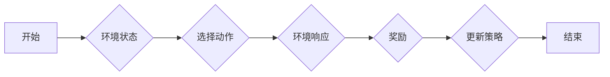

# AI人工智能 Agent：利用强化学习进行决策优化

> 关键词：强化学习，人工智能代理，决策优化，Q-learning，策略梯度，深度强化学习，环境模拟，应用场景

## 1. 背景介绍

在人工智能领域，智能代理（Agent）是研究和应用的核心概念。智能代理是一种能够在环境中感知状态、制定决策并采取行动的实体。随着计算能力的提升和算法的进步，智能代理已经成为实现智能决策和优化的重要手段。强化学习（Reinforcement Learning，RL）作为一种重要的机器学习方法，为智能代理的决策优化提供了强大的技术支持。

强化学习通过让代理在与环境的交互中不断学习和优化策略，最终达到最大化累积奖励的目标。本文将深入探讨强化学习在人工智能代理决策优化中的应用，从基本概念到具体实现，再到实际应用场景，旨在为读者提供一个全面而深入的理解。

## 2. 核心概念与联系

### 2.1 核心概念

#### 2.1.1 强化学习（Reinforcement Learning）

强化学习是一种使智能代理能够通过与环境交互来学习最优策略的机器学习方法。在强化学习中，智能代理通过观察环境状态、选择动作、接收奖励，并根据奖励调整自己的行为策略。

#### 2.1.2 策略（Policy）

策略是智能代理在给定状态下选择动作的规则。在强化学习中，策略可以是确定性的，也可以是概率性的。

#### 2.1.3 奖励（Reward）

奖励是智能代理在每个时间步长收到的信号，用于指导代理学习最优策略。

#### 2.1.4 状态（State）

状态是智能代理在某一时间步长感知到的环境信息。

#### 2.1.5 动作（Action）

动作是智能代理在某一时间步长采取的行动。

### 2.2 Mermaid 流程图



### 2.3 核心概念联系

强化学习中的核心概念相互关联，形成一个闭环学习过程。智能代理通过感知环境状态、选择动作、接收奖励，并根据奖励来更新策略，从而在环境中不断学习并优化决策。

## 3. 核心算法原理 & 具体操作步骤

### 3.1 算法原理概述

强化学习算法的核心思想是最大化智能代理的累积奖励。在强化学习过程中，智能代理通过与环境的交互，不断学习最优策略。

### 3.2 算法步骤详解

#### 3.2.1 状态-动作空间

强化学习算法的第一步是定义状态-动作空间。状态空间是所有可能的环境状态的集合，动作空间是所有可能动作的集合。

#### 3.2.2 奖励函数

奖励函数是强化学习算法中的关键组件，用于评估智能代理的行为。奖励函数可以是固定的，也可以是适应性的。

#### 3.2.3 策略学习

策略学习是强化学习算法的核心任务。策略学习包括以下步骤：

1. 初始化策略。
2. 在环境中进行采样。
3. 根据策略选择动作。
4. 收集奖励并更新策略。

#### 3.2.4 策略优化

策略优化是强化学习算法的关键步骤，旨在找到最大化累积奖励的策略。常见的策略优化方法包括：

- 策略梯度（Policy Gradient）
- Q-learning
- Deep Q-Network（DQN）

### 3.3 算法优缺点

#### 3.3.1 优点

- 自适应：强化学习算法能够根据环境的变化自动调整策略。
- 强泛化能力：强化学习算法能够适应不同的环境。
- 高效性：强化学习算法能够在实际环境中进行学习，无需大量标注数据。

#### 3.3.2 缺点

- 计算复杂性：强化学习算法的计算复杂度较高。
- 收敛速度慢：强化学习算法的收敛速度可能较慢，需要较长时间的学习过程。

### 3.4 算法应用领域

强化学习在许多领域都有广泛的应用，包括：

- 游戏：如围棋、电子竞技等。
- 自动驾驶：如无人驾驶汽车、无人机等。
- 金融：如投资策略优化、风险管理等。
- 生产优化：如机器人调度、库存管理等。

## 4. 数学模型和公式 & 详细讲解 & 举例说明

### 4.1 数学模型构建

强化学习的基本数学模型如下：

$$
Q(s,a) = \sum_{s',a'} Q(s',a') \cdot P(s',a'|s,a) \cdot r(s,a)
$$

其中，$Q(s,a)$ 表示在状态 $s$ 下采取动作 $a$ 的期望回报，$P(s',a'|s,a)$ 表示在状态 $s$ 下采取动作 $a$ 后转移到状态 $s'$ 的概率，$r(s,a)$ 表示在状态 $s$ 下采取动作 $a$ 后收到的奖励。

### 4.2 公式推导过程

强化学习的公式推导过程如下：

1. **期望回报**：首先计算在状态 $s$ 下采取动作 $a$ 的期望回报。

$$
\mathbb{E}[R] = \sum_{s',a'} R(s',a') \cdot P(s',a'|s,a)
$$

2. **状态-动作价值函数**：将期望回报转化为状态-动作价值函数。

$$
Q(s,a) = \sum_{s',a'} R(s',a') \cdot P(s',a'|s,a)
$$

3. **贝尔曼方程**：推导状态-动作价值函数的递归关系。

$$
Q(s,a) = \sum_{s',a'} P(s',a'|s,a) \cdot [R(s,a) + \gamma \cdot \max_{a'} Q(s',a')]
$$

其中，$\gamma$ 是折扣因子，用于平衡短期奖励和长期奖励。

### 4.3 案例分析与讲解

以下以Q-learning算法为例，说明如何使用数学模型进行决策优化。

#### 4.3.1 Q-learning算法概述

Q-learning是一种无模型强化学习算法，通过学习状态-动作价值函数 $Q(s,a)$ 来进行决策优化。

#### 4.3.2 Q-learning算法步骤

1. 初始化 $Q(s,a)$。
2. 在环境中进行采样，得到状态 $s$。
3. 选择动作 $a$，使得 $Q(s,a)$ 最大。
4. 收集奖励 $r$ 和新状态 $s'$。
5. 更新 $Q(s,a)$：

$$
Q(s,a) \leftarrow Q(s,a) + \alpha [r + \gamma \cdot \max_{a'} Q(s',a') - Q(s,a)]
$$

其中，$\alpha$ 是学习率。

## 5. 项目实践：代码实例和详细解释说明

### 5.1 开发环境搭建

为了进行强化学习项目的实践，需要搭建以下开发环境：

- Python编程语言
- TensorFlow或PyTorch深度学习框架
- OpenAI Gym环境库

### 5.2 源代码详细实现

以下是一个使用PyTorch和OpenAI Gym实现的Q-learning算法示例：

```python
import torch
import numpy as np
import random
import gym

# 创建环境
env = gym.make("CartPole-v1")

# 初始化Q-table
Q_table = np.zeros((env.observation_space.n, env.action_space.n))

# 学习参数
alpha = 0.1
gamma = 0.99
epsilon = 0.1

# 训练次数
episodes = 1000

# 训练过程
for episode in range(episodes):
    state = env.reset()
    done = False
    
    while not done:
        # 选择动作
        if random.uniform(0, 1) < epsilon:
            action = random.choice([0, 1])
        else:
            action = np.argmax(Q_table[state])
        
        # 执行动作并获取新状态和奖励
        next_state, reward, done, _ = env.step(action)
        
        # 更新Q-table
        Q_table[state][action] = Q_table[state][action] + alpha * (reward + gamma * np.max(Q_table[next_state]) - Q_table[state][action])
        
        state = next_state

# 关闭环境
env.close()
```

### 5.3 代码解读与分析

上述代码使用PyTorch和OpenAI Gym实现了Q-learning算法，用于训练CartPole环境。

- `gym.make("CartPole-v1")` 创建CartPole环境。
- `Q_table` 是状态-动作价值函数的表格，初始化为全0。
- `alpha`、`gamma` 和 `epsilon` 分别是学习率、折扣因子和探索概率。
- `episodes` 是训练次数。
- 循环遍历每个训练回合，在每个时间步长选择动作、执行动作、更新Q-table。

### 5.4 运行结果展示

运行上述代码，CartPole环境将在短时间内学会保持平衡，达到训练目标。

## 6. 实际应用场景

### 6.1 游戏开发

强化学习在游戏开发领域有着广泛的应用，如：

- 电子竞技：如Dota 2、星际争霸等。
- 角色扮演游戏：如魔兽世界、英雄联盟等。
- 模拟游戏：如自动驾驶、机器人控制等。

### 6.2 机器人控制

强化学习在机器人控制领域有着重要的应用，如：

- 无人驾驶汽车：如自动驾驶、自动泊车等。
- 机器人导航：如机器人路径规划、避障等。
- 机器人操作：如机械臂控制、机器人手术等。

### 6.3 金融市场

强化学习在金融市场也有着广泛的应用，如：

- 投资策略优化：如股票交易、期货交易等。
- 风险管理：如信用风险、市场风险等。
- 量化交易：如高频交易、算法交易等。

## 7. 工具和资源推荐

### 7.1 学习资源推荐

- 《Reinforcement Learning: An Introduction》
- 《Deep Reinforcement Learning》
- 《Playing Atari with Deep Reinforcement Learning》
- 《Reinforcement Learning for Spiking Neural Networks》

### 7.2 开发工具推荐

- TensorFlow
- PyTorch
- OpenAI Gym
- gymnasium

### 7.3 相关论文推荐

- "Playing Atari with Deep Reinforcement Learning" by Volodymyr Mnih et al.
- "Deep Deterministic Policy Gradient" by Ian Goodfellow et al.
- "Deep Q-Network" by Volodymyr Mnih et al.
- "Asynchronous Advantage Actor-Critic" by David Silver et al.

## 8. 总结：未来发展趋势与挑战

### 8.1 研究成果总结

本文深入探讨了强化学习在人工智能代理决策优化中的应用，从基本概念到具体实现，再到实际应用场景，为读者提供了一个全面而深入的理解。

### 8.2 未来发展趋势

- 深度强化学习：将深度学习与强化学习相结合，提高强化学习模型的决策能力。
- 多智能体强化学习：研究多个智能体在复杂环境中的协同决策问题。
- 强化学习与优化算法的结合：将强化学习与优化算法相结合，提高强化学习模型的效率。
- 强化学习与物理模型的结合：将强化学习与物理模型相结合，提高强化学习模型对物理世界的理解能力。

### 8.3 面临的挑战

- 计算复杂性：强化学习算法的计算复杂度较高，需要大量的计算资源。
- 收敛速度慢：强化学习算法的收敛速度可能较慢，需要较长时间的学习过程。
- 策略稳定性：强化学习模型的策略可能不稳定，导致决策结果波动较大。
- 伦理问题：强化学习模型的决策可能存在伦理问题，需要加以关注和解决。

### 8.4 研究展望

未来，强化学习将在人工智能领域发挥越来越重要的作用。随着研究的不断深入，强化学习将在以下方面取得突破：

- 提高强化学习模型的决策能力，使其能够解决更复杂的决策问题。
- 降低强化学习算法的计算复杂度，使其能够在更广泛的场景中得到应用。
- 提高强化学习模型的稳定性，使其决策结果更加可靠。
- 解决强化学习模型的伦理问题，使其更好地服务于人类社会。

## 9. 附录：常见问题与解答

**Q1：强化学习与监督学习有什么区别？**

A：强化学习是一种通过与环境交互来学习最优策略的机器学习方法，而监督学习是一种通过学习输入输出映射的机器学习方法。强化学习的核心是奖励信号，而监督学习的核心是标签数据。

**Q2：如何解决强化学习中的稀疏奖励问题？**

A：稀疏奖励问题是指奖励信号间隔时间较长，难以引导智能代理学习。解决稀疏奖励问题的方法包括：

- 引入额外奖励：在智能代理完成任务的过程中，引入额外的奖励信号，如阶段性奖励、完成度奖励等。
- 使用回报折扣：将未来奖励进行折扣，提高近期奖励的权重。
- 使用多智能体强化学习：多个智能体协同工作，共同完成复杂任务，提高奖励的密集性。

**Q3：如何解决强化学习中的探索与利用问题？**

A：探索与利用问题是强化学习中的经典问题，即如何在探索未知状态和利用已知信息之间取得平衡。解决探索与利用问题的方法包括：

- $\epsilon$-greedy策略：在随机选择动作和根据策略选择动作之间进行权衡。
- 贪婪策略：在大多数情况下根据策略选择动作，在少数情况下随机选择动作。
- 使用价值函数：使用价值函数来衡量未知状态的预期奖励，从而在探索与利用之间取得平衡。

**Q4：如何解决强化学习中的过拟合问题？**

A：过拟合问题是强化学习中的常见问题，即模型在训练数据上表现良好，但在测试数据上表现不佳。解决过拟合问题的方法包括：

- 使用更大的训练数据集。
- 使用正则化技术，如L2正则化、Dropout等。
- 使用集成学习，如随机森林、梯度提升树等。
- 使用迁移学习，将预训练模型的知识迁移到新的任务中。

**Q5：如何将强化学习应用于实际场景？**

A：将强化学习应用于实际场景需要考虑以下因素：

- 选择合适的强化学习算法。
- 定义清晰的状态-动作空间。
- 设计合理的奖励函数。
- 使用有效的探索与利用策略。
- 对模型进行调试和优化。

通过综合考虑以上因素，可以将强化学习应用于实际场景，并取得良好的效果。

---

作者：禅与计算机程序设计艺术 / Zen and the Art of Computer Programming