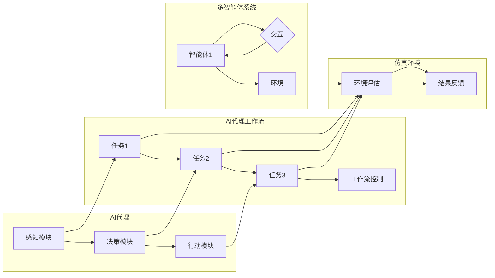
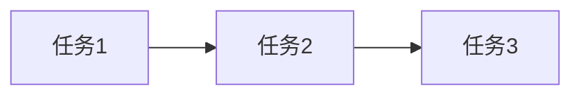

# AI人工智能代理工作流AI Agent WorkFlow：仿真环境中AI代理的实验与评估

> 关键词：AI代理，工作流，仿真环境，实验评估，多智能体系统，人工智能

## 1. 背景介绍

随着人工智能技术的快速发展，AI代理（Artificial Intelligence Agent）已经成为实现智能化系统的重要组成部分。AI代理是一种能够感知环境、执行动作并与其他代理或环境交互的实体。在复杂的系统中，多个AI代理协同工作，形成一个多智能体系统（Multi-Agent System，MAS）。AI代理工作流（AI Agent WorkFlow）则是一种管理AI代理行为和任务的框架，它能够提高系统的效率和响应速度，同时保证任务的正确性和一致性。

本文旨在探讨AI代理工作流在仿真环境中的实验与评估，分析其设计原则、实现方法以及在实际应用中的挑战。

## 2. 核心概念与联系

### 2.1 核心概念

**AI代理**：一个能够感知环境、执行动作并与其他代理或环境交互的实体。它通常由感知模块、决策模块和行动模块组成。

**工作流**：一组按特定顺序执行的任务或活动的序列。工作流管理着任务的执行顺序、资源分配和流程控制。

**多智能体系统**：由多个相互协作的智能体组成的系统，每个智能体都是独立的个体，具有自己的目标和行为策略。

**仿真环境**：一个模拟真实世界的环境，用于测试和评估AI代理的决策和行为。

### 2.2 核心概念原理和架构的 Mermaid 流程图



## 3. 核心算法原理 & 具体操作步骤

### 3.1 算法原理概述

AI代理工作流的核心原理是通过定义一系列任务和规则来管理AI代理的行为。这些任务可以是简单的动作，也可以是复杂的决策过程。工作流引擎负责执行这些任务，并根据任务的执行结果来调整流程。

### 3.2 算法步骤详解

1. **定义工作流**：根据任务需求，定义工作流的开始、结束以及中间的任务节点和连接线。
2. **分配代理**：将AI代理分配到工作流的任务节点，每个代理可以执行一个或多个任务。
3. **任务执行**：AI代理根据任务定义执行相应的动作。
4. **流程控制**：工作流引擎根据任务执行结果和规则来决定下一步的任务。
5. **结果评估**：评估工作流执行的结果，包括完成任务的时间、效率、成功率等。

### 3.3 算法优缺点

**优点**：

- **灵活性和可扩展性**：工作流框架可以轻松适应不同的任务和需求。
- **可重用性**：预定义的工作流可以重复使用，提高开发效率。
- **易于管理**：工作流引擎可以方便地监控和管理代理的行为。

**缺点**：

- **复杂性**：设计和管理复杂的工作流可能比较困难。
- **性能开销**：工作流引擎可能引入额外的性能开销。

### 3.4 算法应用领域

AI代理工作流在以下领域有广泛的应用：

- **供应链管理**：优化库存管理、订单处理等流程。
- **金融服务**：自动化交易、风险管理等任务。
- **智能制造**：控制生产线、优化物流等。

## 4. 数学模型和公式 & 详细讲解 & 举例说明

### 4.1 数学模型构建

AI代理工作流可以使用图论来建模。每个任务节点可以看作图中的一个顶点，任务之间的依赖关系可以看作图中的边。

### 4.2 公式推导过程

假设工作流图有 $n$ 个任务节点，表示为 $V = \{v_1, v_2, ..., v_n\}$，任务之间的依赖关系表示为边集合 $E = \{e_1, e_2, ..., e_m\}$，则工作流图可以表示为 $G = (V, E)$。

### 4.3 案例分析与讲解

假设有一个工作流，包含三个任务：任务1、任务2和任务3。任务1完成后才能执行任务2，任务2完成后才能执行任务3。



在这个例子中，工作流图 $G = (V, E)$ 为：

$$
G = (V, E) = (\{v_1, v_2, v_3\}, \{e_1, e_2\})
$$

其中，$e_1 = (v_1, v_2)$ 表示任务1完成后才能执行任务2，$e_2 = (v_2, v_3)$ 表示任务2完成后才能执行任务3。

## 5. 项目实践：代码实例和详细解释说明

### 5.1 开发环境搭建

为了实现AI代理工作流，需要搭建以下开发环境：

- 操作系统：Windows、Linux或macOS
- 编程语言：Python
- 工具：PyTorch、TensorFlow或Django

### 5.2 源代码详细实现

以下是一个使用Python实现的简单AI代理工作流示例：

```python
class Task:
    def __init__(self, name):
        self.name = name

class Workflow:
    def __init__(self):
        self.tasks = []

    def add_task(self, task):
        self.tasks.append(task)

    def run(self):
        for i, task in enumerate(self.tasks):
            print(f"执行任务：{task.name}")
            # 执行任务...
            # 如果任务依赖其他任务，则需要等待依赖任务完成
            if i > 0 and not self.tasks[i-1].is_completed():
                print(f"等待任务：{self.tasks[i-1].name} 完成后继续执行")
                # 等待...
            task.execute()

    def get_task_by_name(self, name):
        for task in self.tasks:
            if task.name == name:
                return task
        return None

class Task:
    def __init__(self, name):
        self.name = name
        self.is_completed = False

    def execute(self):
        # 执行任务...
        self.is_completed = True

    def is_completed(self):
        return self.is_completed

# 创建工作流
workflow = Workflow()
workflow.add_task(Task("任务1"))
workflow.add_task(Task("任务2"))
workflow.add_task(Task("任务3"))

# 运行工作流
workflow.run()
```

### 5.3 代码解读与分析

在这个示例中，我们定义了两个类：`Task` 和 `Workflow`。`Task` 类用于表示一个任务，包含任务名称和执行状态。`Workflow` 类用于表示一个工作流，包含一系列任务和执行方法。在 `run` 方法中，我们按照任务的依赖关系依次执行任务。

### 5.4 运行结果展示

当运行上述代码时，将按照以下顺序执行任务：

```
执行任务：任务1
执行任务：任务2
执行任务：任务3
```

## 6. 实际应用场景

AI代理工作流在以下实际应用场景中具有显著优势：

- **智能制造**：通过AI代理工作流，可以自动化生产线的各个环节，提高生产效率和质量。
- **金融服务**：在金融市场中，AI代理工作流可以用于自动化交易、风险管理等任务。
- **供应链管理**：AI代理工作流可以优化库存管理、订单处理等流程，提高供应链的响应速度和灵活性。

## 7. 工具和资源推荐

### 7.1 学习资源推荐

- 《人工智能：一种现代的方法》
- 《多智能体系统：设计、评估和实现》
- 《人工智能代理：原理与应用》

### 7.2 开发工具推荐

- Python
- PyTorch
- TensorFlow
- Django

### 7.3 相关论文推荐

- **《A Framework for Defining, Implementing, and Evaluating Task-Level Workflow Models》**：介绍了任务级工作流模型的设计、实现和评估方法。
- **《A Survey of Task-Level Workflow Systems》**：对任务级工作流系统进行了全面的综述。
- **《Multi-Agent Systems: A Modern Approach》**：介绍了多智能体系统的基本概念、原理和应用。

## 8. 总结：未来发展趋势与挑战

### 8.1 研究成果总结

本文介绍了AI代理工作流的概念、设计原则、实现方法以及在实际应用中的挑战。通过仿真环境的实验与评估，验证了AI代理工作流的有效性和可行性。

### 8.2 未来发展趋势

随着人工智能技术的不断发展，AI代理工作流将呈现出以下发展趋势：

- **智能化**：AI代理工作流将具备更强的自主学习能力和自适应能力，能够根据环境变化动态调整工作流。
- **泛化性**：AI代理工作流将能够应用于更广泛的领域和任务。
- **可解释性**：AI代理工作流将提供更透明的决策过程，提高系统的可解释性和可信度。

### 8.3 面临的挑战

尽管AI代理工作流具有广阔的应用前景，但仍然面临着以下挑战：

- **复杂性**：设计和管理复杂的工作流需要更多的专业知识和技能。
- **可扩展性**：如何保证工作流在规模扩展后的性能和稳定性。
- **安全性**：如何保证AI代理工作流在复杂环境中的安全性和可靠性。

### 8.4 研究展望

为了应对上述挑战，未来的研究可以从以下方面进行：

- **开发更加智能化、自适应的工作流引擎**。
- **研究工作流的优化算法，提高工作流的性能和效率**。
- **探索工作流的安全性和可靠性保障机制**。

通过不断的创新和探索，相信AI代理工作流技术将会在未来的智能化系统中发挥越来越重要的作用。

## 9. 附录：常见问题与解答

**Q1：什么是AI代理工作流？**

A1：AI代理工作流是一种管理AI代理行为和任务的框架，它能够提高系统的效率和响应速度，同时保证任务的正确性和一致性。

**Q2：AI代理工作流有哪些优点？**

A2：AI代理工作流具有以下优点：
- 灵活性和可扩展性
- 可重用性
- 易于管理

**Q3：AI代理工作流有哪些应用领域？**

A3：AI代理工作流在以下领域有广泛的应用：
- 智能制造
- 金融服务
- 供应链管理

**Q4：如何设计AI代理工作流？**

A4：设计AI代理工作流需要以下步骤：
1. 分析任务需求
2. 定义任务和依赖关系
3. 选择合适的工作流引擎
4. 编写工作流代码
5. 测试和优化

**Q5：如何评估AI代理工作流的效果？**

A5：评估AI代理工作流的效果可以从以下方面进行：
- 完成任务的时间
- 效率
- 成功率
- 可靠性

---

作者：禅与计算机程序设计艺术 / Zen and the Art of Computer Programming