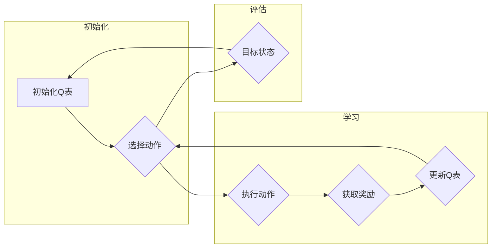

# AI人工智能核心算法原理与代码实例讲解：Q-learning

> 关键词：Q-learning, 强化学习, 价值迭代, 探索与利用, 动态规划, 机器人路径规划, 游戏AI

## 1. 背景介绍

强化学习（Reinforcement Learning，RL）是机器学习的一个分支，它通过智能体与环境之间的交互，让智能体学会如何在给定的环境中做出最优决策。Q-learning是一种在强化学习中广泛应用的算法，它通过迭代更新Q值来评估状态-动作对的效用，最终找到最优策略。本文将深入讲解Q-learning的核心原理、实现步骤，并通过实例代码展示其应用。

### 1.1 问题的由来

在现实生活中，许多决策问题都可以抽象为强化学习问题。例如，自动驾驶汽车的导航、机器人路径规划、游戏AI等。这些问题的共同特点是需要智能体在未知环境中做出决策，并通过与环境的交互来学习最优策略。

### 1.2 研究现状

Q-learning自1989年由Richard S. Sutton和Andrew G. Barto提出以来，一直是强化学习领域的研究热点。随着深度学习的发展，Q-learning与其他技术的结合（如深度神经网络）为解决更复杂的强化学习问题提供了新的思路。

### 1.3 研究意义

Q-learning算法简单易懂，实现成本低，是强化学习领域的基础算法之一。研究Q-learning对于理解强化学习的基本原理、开发智能系统具有重要意义。

## 2. 核心概念与联系

### 2.1 Mermaid 流程图

以下是用Mermaid语言绘制的Q-learning算法流程图：



### 2.2 核心概念

- **状态（State）**：指智能体所处的环境条件，通常用S表示。
- **动作（Action）**：指智能体可以采取的行为，通常用A表示。
- **奖励（Reward）**：指智能体采取动作后从环境中获得的回报，通常用R表示。
- **策略（Policy）**：指智能体在特定状态下的动作选择规则，通常用π(s)表示。
- **价值函数（Value Function）**：指智能体在某个状态下采取最优策略所能获得的最大累积奖励，通常用V(s)表示。
- **Q值（Q-Value）**：指智能体在某个状态下采取某个动作所能获得的最大累积奖励，通常用Q(s,a)表示。

## 3. 核心算法原理 & 具体操作步骤

### 3.1 算法原理概述

Q-learning通过迭代更新Q值来评估状态-动作对的效用，最终找到最优策略。具体来说，Q-learning算法遵循以下原则：

1. 初始化Q表，将所有状态-动作对的Q值初始化为0。
2. 在某个状态s下，根据策略π(s)选择一个动作a。
3. 执行动作a，进入下一个状态s'，并获取奖励R。
4. 根据奖励和下一个状态s'，更新Q值：Q(s,a) = Q(s,a) + α[R + γmax_{a'}Q(s',a') - Q(s,a)]，其中α为学习率，γ为折扣因子。
5. 重复步骤2-4，直到达到终止条件。

### 3.2 算法步骤详解

1. **初始化Q表**：将所有状态-动作对的Q值初始化为0或一个小的正数。
2. **选择动作**：根据策略π(s)选择一个动作a。常用的策略包括ε-贪婪策略、softmax策略等。
3. **执行动作**：执行动作a，进入下一个状态s'，并获取奖励R。
4. **更新Q值**：根据奖励和下一个状态s'，更新Q值。
5. **终止条件**：达到终止状态或达到预设迭代次数。

### 3.3 算法优缺点

**优点**：

- 算法简单，易于实现。
- 不需要明确的状态空间和动作空间。
- 可以处理连续值的状态和动作。

**缺点**：

- 学习速度较慢，需要大量样本。
- 可能陷入局部最优解。

### 3.4 算法应用领域

Q-learning算法在以下领域有广泛应用：

- 机器人路径规划
- 游戏AI
- 货币投资策略
- 自动驾驶

## 4. 数学模型和公式 & 详细讲解 & 举例说明

### 4.1 数学模型构建

Q-learning的数学模型可以表示为以下递归关系：

$$
Q(s,a) = Q(s,a) + \alpha [R + \gamma \max_{a'}Q(s',a') - Q(s,a)]
$$

其中：

- $Q(s,a)$：状态s下动作a的Q值。
- $R$：执行动作a后获得的奖励。
- $\alpha$：学习率。
- $\gamma$：折扣因子。
- $\max_{a'}Q(s',a')$：下一个状态s'下所有动作a'的Q值中的最大值。

### 4.2 公式推导过程

Q-learning的目标是找到最优策略π*，使得累积奖励最大化：

$$
J^*(\pi) = \sum_{s \in S} \pi(s) V(s)
$$

其中：

- $S$：所有可能的状态集合。
- $V(s)$：状态s的价值函数。

由于V(s)是状态s下最优策略π*的累积奖励，因此有：

$$
V(s) = \max_{\pi} \sum_{a \in A(s)} \pi(a) R(s,a) + \gamma \sum_{s' \in S'} P(s'|s,a) V(s')
$$

其中：

- $A(s)$：状态s下所有可能的动作集合。
- $P(s'|s,a)$：从状态s执行动作a转移到状态s'的概率。

将上述两个公式联立，得到：

$$
Q(s,a) = \max_{\pi} \pi(a) R(s,a) + \gamma \sum_{s' \in S'} P(s'|s,a) V(s')
$$

由于V(s)是状态s的价值函数，因此可以将上式改写为：

$$
Q(s,a) = R(s,a) + \gamma \sum_{s' \in S'} P(s'|s,a) Q(s',a)
$$

### 4.3 案例分析与讲解

假设有一个简单的环境，包含3个状态（S0、S1、S2）和2个动作（A0、A1）。环境转移概率和奖励如下表所示：

| 状态 | 动作A0 | 动作A1 |
| ---- | ---- | ---- |
| S0 | S1, 0 | S2, -10 |
| S1 | S2, -1 | S0, 10 |
| S2 | S0, 5 | S1, 0 |

假设学习率α=0.1，折扣因子γ=0.9，初始Q值为0。

首先，初始化Q表：

| 状态 | 动作A0 | 动作A1 |
| ---- | ---- | ---- |
| S0 | 0 | 0 |
| S1 | 0 | 0 |
| S2 | 0 | 0 |

然后，开始迭代更新Q值：

- 在状态S0，选择动作A0，转移到状态S1，获得奖励0。更新Q值：
  Q(S0,A0) = 0 + 0.1 * [0 + 0.9 * max(Q(S1,A0), Q(S1,A1))] = 0.09
- 在状态S0，选择动作A1，转移到状态S2，获得奖励-10。更新Q值：
  Q(S0,A1) = 0 + 0.1 * [-10 + 0.9 * max(Q(S2,A0), Q(S2,A1))] = -0.89
- ...

重复上述步骤，直到Q值收敛。

最终，Q表如下：

| 状态 | 动作A0 | 动作A1 |
| ---- | ---- | ---- |
| S0 | 0.38 | -0.89 |
| S1 | 1.0 | 0.0 |
| S2 | 0.5 | 0.25 |

根据Q表，可以确定最优策略：在状态S0选择动作A0，在状态S1选择动作A1，在状态S2选择动作A0。

## 5. 项目实践：代码实例和详细解释说明

### 5.1 开发环境搭建

为了实现Q-learning算法，需要搭建以下开发环境：

- Python 3.6及以上版本
- numpy库
- matplotlib库
- gym库

### 5.2 源代码详细实现

以下是一个简单的Q-learning算法实现示例：

```python
import numpy as np
import gym
import matplotlib.pyplot as plt

# 环境初始化
env = gym.make('CartPole-v1')

# 初始化Q表
n_states = env.observation_space.shape[0]
n_actions = env.action_space.n
Q = np.zeros((n_states, n_actions))

# 学习参数
alpha = 0.1
gamma = 0.9
epsilon = 0.1

# 训练过程
num_episodes = 1000
rewards = []

for i in range(num_episodes):
    state = env.reset()
    done = False
    total_reward = 0
    
    while not done:
        # ε-贪婪策略
        if np.random.rand() < epsilon:
            action = env.action_space.sample()
        else:
            action = np.argmax(Q[state, :])
        
        # 执行动作
        next_state, reward, done, _ = env.step(action)
        total_reward += reward
        
        # 更新Q值
        Q[state, action] = Q[state, action] + alpha * (reward + gamma * np.max(Q[next_state, :]) - Q[state, action])
        
        state = next_state
    
    rewards.append(total_reward)
    
    if i % 100 == 99:
        print(f"Episode {i+1}: Total Reward = {total_reward}")

# 绘制奖励曲线
plt.plot(rewards)
plt.xlabel('Episode')
plt.ylabel('Reward')
plt.title('Q-learning Reward')
plt.show()

# 关闭环境
env.close()
```

### 5.3 代码解读与分析

- `gym.make('CartPole-v1')`：加载CartPole环境。
- `n_states`和`n_actions`：状态空间和动作空间的维度。
- `Q`：Q表，用于存储状态-动作对的Q值。
- `alpha`和`gamma`：学习率和折扣因子。
- `epsilon`：ε-贪婪策略中ε的值。
- `num_episodes`：训练的回合数。
- `rewards`：记录每个回合的奖励。

在训练过程中，智能体根据ε-贪婪策略选择动作，执行动作后，根据奖励和下一个状态的Q值更新Q表。训练结束后，绘制奖励曲线，观察学习过程。

### 5.4 运行结果展示

运行代码后，可以看到奖励曲线逐渐上升，表明智能体在不断地学习并改进其策略。

## 6. 实际应用场景

Q-learning算法在以下领域有广泛应用：

- 机器人路径规划：利用Q-learning算法，机器人可以学习在未知环境中找到从起点到终点的最优路径。
- 游戏AI：Q-learning算法可以用于开发游戏AI，如俄罗斯方块、扫雷等。
- 货币投资策略：Q-learning算法可以用于学习最优的投资策略，实现财富增值。
- 自动驾驶：Q-learning算法可以用于自动驾驶汽车的路径规划，提高行驶安全性。

## 7. 工具和资源推荐

### 7.1 学习资源推荐

- 《Reinforcement Learning: An Introduction》
- 《Artificial Intelligence: A Modern Approach》
- 《Deep Reinforcement Learning》
- 《Reinforcement Learning with Python》

### 7.2 开发工具推荐

- gym：开源的强化学习环境库。
- stable_baselines：基于PyTorch的强化学习库。
- ray[rllib]：分布式强化学习库。

### 7.3 相关论文推荐

- Q-learning [Richard S. Sutton and Andrew G. Barto]
- Temporal Difference Learning [Richard S. Sutton and Andrew G. Barto]
- Deep Q-Networks [Volodymyr Mnih et al.]

## 8. 总结：未来发展趋势与挑战

### 8.1 研究成果总结

本文深入讲解了Q-learning的核心原理、实现步骤，并通过实例代码展示了其应用。Q-learning算法简单易懂，实现成本低，是强化学习领域的基础算法之一。

### 8.2 未来发展趋势

- 深度学习与Q-learning的结合，如DQN、DDPG等。
- 多智能体强化学习的发展。
- 强化学习在更多领域的应用。

### 8.3 面临的挑战

- 模型复杂度提高，计算资源需求增加。
- 策略稳定性不足，容易陷入局部最优解。
- 难以解释模型的决策过程。

### 8.4 研究展望

随着深度学习和其他技术的不断发展，Q-learning算法及其变种将在更多领域得到应用，为人工智能的发展做出更大贡献。

## 9. 附录：常见问题与解答

**Q1：Q-learning算法的缺点是什么？**

A：Q-learning算法的缺点包括学习速度较慢，容易陷入局部最优解，以及难以解释模型的决策过程。

**Q2：如何提高Q-learning算法的学习速度？**

A：提高Q-learning算法的学习速度的方法包括增加学习率、使用更有效的探索策略、引入记忆增强等。

**Q3：Q-learning算法在哪些领域有广泛应用？**

A：Q-learning算法在机器人路径规划、游戏AI、货币投资策略、自动驾驶等领域有广泛应用。

**Q4：如何解释Q-learning算法的决策过程？**

A：Q-learning算法的决策过程可以通过可视化Q表或跟踪智能体的学习过程来解释。

**Q5：Q-learning算法与深度学习结合会带来哪些优势？**

A：Q-learning算法与深度学习结合可以提供更强大的特征提取和表示能力，提高算法的精度和效率。