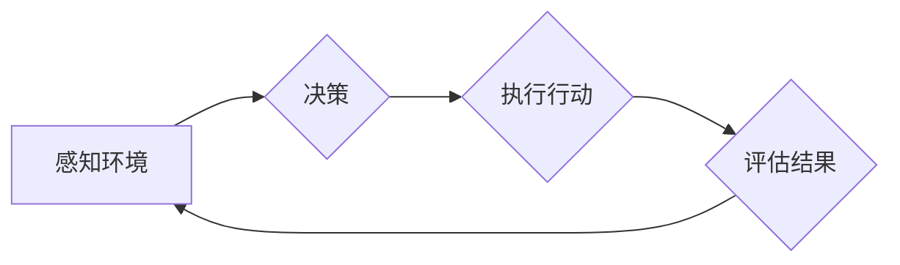

# AI人工智能深度学习算法：在供应链管理中运用智能深度学习代理的创新运用

> 关键词：人工智能，深度学习，供应链管理，智能代理，深度学习代理，预测分析，优化决策

## 1. 背景介绍

供应链管理是企业运营的基石，它涉及从原材料采购到产品交付的整个流程。随着全球化和信息技术的快速发展，供应链的复杂性日益增加，对企业效率、成本和风险管理提出了更高的要求。人工智能（AI）和深度学习（DL）技术的兴起为供应链管理带来了新的机遇和挑战。本文将探讨如何利用智能深度学习代理在供应链管理中进行创新运用，以提高效率和优化决策。

### 1.1 问题的由来

传统的供应链管理依赖于人工经验、历史数据和启发式算法。然而，随着数据的爆炸性增长和供应链的复杂性，这些方法难以满足现代供应链的实时性、准确性和智能化需求。智能深度学习代理能够通过学习海量数据，自动发现数据中的模式和趋势，从而提供更加精确的预测和分析，辅助供应链管理决策。

### 1.2 研究现状

近年来，AI和DL技术在供应链管理中的应用研究日益增多。以下是一些主要的研究方向：

- **需求预测**：利用DL模型对销售数据进行预测，帮助企业优化库存管理和生产计划。
- **库存优化**：通过学习历史库存数据，智能代理可以预测库存水平，减少库存成本和提高库存周转率。
- **运输规划**：利用DL模型优化运输路线，减少运输成本和环境影响。
- **风险管理**：通过分析市场趋势和供应链数据，智能代理可以预测潜在风险，并制定相应的应对策略。

### 1.3 研究意义

智能深度学习代理在供应链管理中的应用具有重要意义：

- **提高效率**：通过自动化决策过程，减少人工干预，提高供应链运作效率。
- **降低成本**：优化库存、运输和风险管理，降低运营成本。
- **增强竞争力**：通过提供更准确的预测和分析，帮助企业赢得市场竞争力。
- **支持可持续发展**：通过优化运输和库存管理，减少资源消耗和环境影响。

### 1.4 本文结构

本文将围绕以下内容展开：

- **第二章**介绍核心概念与联系，包括AI、DL、智能代理和供应链管理之间的关系。
- **第三章**深入探讨核心算法原理和具体操作步骤，包括模型选择、数据预处理、训练和评估。
- **第四章**介绍数学模型和公式，并举例说明如何应用这些模型。
- **第五章**提供项目实践案例，包括开发环境搭建、代码实现和结果展示。
- **第六章**探讨智能深度学习代理在供应链管理中的实际应用场景。
- **第七章**推荐相关学习资源、开发工具和参考文献。
- **第八章**总结研究成果，展望未来发展趋势和挑战。
- **第九章**提供常见问题与解答。

## 2. 核心概念与联系

### 2.1 核心概念

- **人工智能（AI）**：指使计算机模拟人类智能行为的技术和学科。
- **深度学习（DL）**：一种利用神经网络进行学习的机器学习技术，能够从数据中自动学习模式和特征。
- **智能代理（Agent）**：一种能够感知环境、做出决策并采取行动的实体。
- **供应链管理（SCM）**：涉及原材料采购、生产、物流、分销和回收等整个供应链过程的集成管理。

### 2.2 联系与流程图

智能深度学习代理在供应链管理中的流程可以表示为以下Mermaid流程图：



其中，智能代理通过感知环境中的数据（如库存水平、销售数据、运输信息等）来做出决策，并执行相应的行动（如调整库存水平、优化运输路线等）。随后，智能代理会评估行动的结果，并根据反馈调整其行为。

## 3. 核心算法原理 & 具体操作步骤

### 3.1 算法原理概述

智能深度学习代理通常基于以下算法原理：

- **神经网络**：用于数据建模和预测。
- **强化学习**：用于决策和优化。
- **监督学习**：用于从标注数据中学习特征和模式。

### 3.2 算法步骤详解

智能深度学习代理在供应链管理中的应用步骤如下：

1. **数据收集**：收集与供应链相关的数据，包括库存、销售、运输、市场趋势等。
2. **数据预处理**：清洗、转换和标准化数据，以便进行建模。
3. **模型选择**：选择合适的深度学习模型，如神经网络、卷积神经网络（CNN）、循环神经网络（RNN）等。
4. **模型训练**：使用标注数据训练模型，并调整模型参数。
5. **模型评估**：评估模型的性能，如准确率、召回率、F1分数等。
6. **决策制定**：基于模型预测结果制定供应链管理决策。
7. **执行行动**：执行决策，如调整库存水平、优化运输路线等。
8. **结果评估**：评估行动结果，并根据反馈调整模型和决策。

### 3.3 算法优缺点

**优点**：

- **高度自动化**：智能代理能够自动收集、处理和分析数据，减少人工干预。
- **可扩展性**：智能代理可以处理大量数据，并适应不断变化的市场条件。
- **预测准确性**：基于深度学习模型，智能代理能够提供高度准确的预测和分析。

**缺点**：

- **数据依赖性**：智能代理的性能高度依赖于数据质量和数量。
- **模型复杂性**：深度学习模型通常需要大量数据进行训练，且模型参数调整复杂。
- **可解释性**：深度学习模型的决策过程往往难以解释，可能存在偏见或错误。

### 3.4 算法应用领域

智能深度学习代理在以下供应链管理领域有广泛的应用：

- **需求预测**：预测产品需求，优化库存水平。
- **库存优化**：优化库存管理，减少库存成本和提高周转率。
- **运输规划**：优化运输路线，减少运输成本和环境影响。
- **风险管理**：预测潜在风险，并制定应对策略。
- **产品定价**：根据市场趋势和库存水平，制定产品定价策略。

## 4. 数学模型和公式 & 详细讲解 & 举例说明

### 4.1 数学模型构建

智能深度学习代理通常基于以下数学模型：

- **神经网络**：

$$
y = f(W \cdot x + b)
$$

其中，$y$ 是输出，$x$ 是输入，$W$ 是权重，$b$ 是偏置。

- **循环神经网络（RNN）**：

$$
y_t = f(W_h \cdot (h_{t-1}, x_t) + b_h)
$$

其中，$y_t$ 是当前时间步的输出，$h_{t-1}$ 是前一时间步的隐藏状态，$x_t$ 是当前时间步的输入，$W_h$ 是权重，$b_h$ 是偏置。

- **强化学习**：

$$
Q(s, a) = r + \gamma \max_{a'} Q(s', a')
$$

其中，$Q(s, a)$ 是状态-动作值函数，$r$ 是即时奖励，$\gamma$ 是折扣因子，$s'$ 是下一个状态，$a'$ 是下一个动作。

### 4.2 公式推导过程

以神经网络为例，其损失函数通常为均方误差（MSE）：

$$
L(y, \hat{y}) = \frac{1}{2} ||y - \hat{y}||^2
$$

其中，$y$ 是真实标签，$\hat{y}$ 是预测值。

### 4.3 案例分析与讲解

以下是一个简单的需求预测案例：

假设我们使用一个神经网络模型预测下周的某种产品的需求量。输入数据包括历史销售数据、促销活动信息、节假日信息等。我们使用MSE作为损失函数，并通过反向传播算法进行参数优化。

在训练过程中，我们不断调整神经网络参数，使预测值 $\hat{y}$ 与真实标签 $y$ 之间的差异最小化。经过多次迭代，模型逐渐收敛，并能够在新的数据上进行准确的需求预测。

## 5. 项目实践：代码实例和详细解释说明

### 5.1 开发环境搭建

以下是使用Python和TensorFlow构建智能深度学习代理的项目实践。

```python
import tensorflow as tf
from tensorflow.keras.models import Sequential
from tensorflow.keras.layers import Dense, LSTM, Dropout

# 构建神经网络模型
model = Sequential()
model.add(LSTM(50, input_shape=(input_shape)))
model.add(Dropout(0.5))
model.add(Dense(1))

# 编译模型
model.compile(optimizer='adam', loss='mse')

# 训练模型
model.fit(X_train, y_train, epochs=100, batch_size=32, validation_data=(X_val, y_val))
```

### 5.2 源代码详细实现

以上代码展示了如何使用TensorFlow构建一个简单的神经网络模型，用于需求预测。

- **LSTM层**：用于处理时间序列数据。
- **Dropout层**：用于防止过拟合。
- **Dense层**：用于输出预测值。

### 5.3 代码解读与分析

以上代码首先导入了所需的库，并构建了一个包含LSTM和Dense层的神经网络模型。然后，使用MSE作为损失函数，并通过adam优化器进行参数优化。最后，使用训练数据对模型进行训练。

### 5.4 运行结果展示

经过训练，模型可以在测试集上进行需求预测，并给出预测值。我们可以通过计算预测值与真实标签之间的差异，来评估模型的性能。

## 6. 实际应用场景

### 6.1 库存优化

智能深度学习代理可以分析历史销售数据、市场趋势和促销活动信息，预测产品需求，从而优化库存水平。通过减少库存积压和缺货情况，企业可以降低库存成本，提高运营效率。

### 6.2 运输规划

智能深度学习代理可以分析历史运输数据、交通状况和天气信息，优化运输路线，减少运输成本和环境影响。通过提高运输效率，企业可以缩短交货时间，提高客户满意度。

### 6.3 风险管理

智能深度学习代理可以分析市场趋势、供应链数据和安全事件信息，预测潜在风险，并制定相应的应对策略。通过及时识别和处理风险，企业可以降低损失，保障供应链稳定。

### 6.4 产品定价

智能深度学习代理可以分析市场趋势、竞争情况和客户需求，制定产品定价策略。通过优化定价策略，企业可以增加利润，提高市场竞争力。

## 7. 工具和资源推荐

### 7.1 学习资源推荐

- 《深度学习》（Goodfellow et al.）
- 《神经网络与深度学习》（邱锡鹏）
- TensorFlow官方文档
- Keras官方文档

### 7.2 开发工具推荐

- TensorFlow
- Keras
- PyTorch

### 7.3 相关论文推荐

- Deep Learning for Time Series Forecasting
- Deep Reinforcement Learning for Inventory Management
- Learning to Drive by Playing Video Games

## 8. 总结：未来发展趋势与挑战

### 8.1 研究成果总结

本文介绍了智能深度学习代理在供应链管理中的应用，包括核心概念、算法原理、具体操作步骤、数学模型和实际应用场景。研究表明，智能深度学习代理可以显著提高供应链管理的效率和效益。

### 8.2 未来发展趋势

未来，智能深度学习代理在供应链管理中的应用将呈现以下趋势：

- **模型集成**：将多种深度学习模型和算法进行集成，提高预测和决策的准确性。
- **多模态学习**：结合文本、图像、时间序列等多模态数据，提高模型的泛化能力。
- **可解释性**：提高模型的可解释性，增强决策的透明度和可信度。

### 8.3 面临的挑战

智能深度学习代理在供应链管理中应用也面临以下挑战：

- **数据质量**：数据质量对模型性能至关重要，需要确保数据准确性和完整性。
- **模型解释性**：深度学习模型的决策过程往往难以解释，需要提高模型的透明度和可信度。
- **计算资源**：深度学习模型需要大量的计算资源，需要优化算法和硬件设备。

### 8.4 研究展望

未来，智能深度学习代理在供应链管理中的应用将不断发展和完善，为企业和行业带来更多价值。以下是几个研究方向：

- **跨领域迁移**：将在不同领域训练的模型进行迁移，提高模型的泛化能力。
- **强化学习**：将强化学习与深度学习相结合，实现更加智能的决策和优化。
- **人机协同**：将智能代理与人类专家进行协同，实现更加高效和灵活的供应链管理。

## 9. 附录：常见问题与解答

**Q1：智能深度学习代理在供应链管理中的优势是什么？**

A：智能深度学习代理可以自动收集、处理和分析数据，提高预测和决策的准确性，降低库存成本，优化运输路线，减少风险，提高供应链效率。

**Q2：如何处理供应链管理中的实时数据？**

A：可以使用流式学习（Streaming Learning）或增量学习（Incremental Learning）技术，实时更新模型参数，以适应数据变化。

**Q3：如何评估智能深度学习代理的性能？**

A：可以使用准确率、召回率、F1分数等指标来评估模型的性能。

**Q4：智能深度学习代理在供应链管理中的局限性是什么？**

A：智能深度学习代理需要大量数据进行训练，可能存在过拟合问题，且决策过程难以解释。

**Q5：如何确保智能深度学习代理的公平性和透明度？**

A：需要确保数据质量，避免数据偏差，提高模型的可解释性，并建立相应的监管机制。

作者：禅与计算机程序设计艺术 / Zen and the Art of Computer Programming