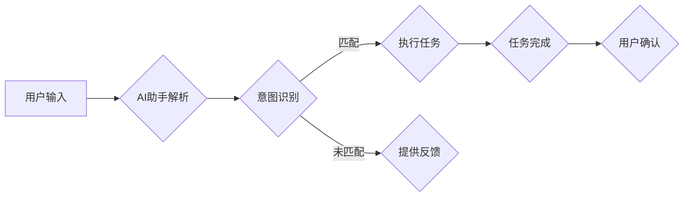

# AI助手在日常工作中的效率提升

> 关键词：AI助手，智能办公，效率提升，自然语言处理，机器学习，工作流程自动化，知识图谱

## 1. 背景介绍

在信息爆炸和数字化转型的今天，工作效率成为企业和个人竞争的关键。传统的办公方式往往依赖于人工处理大量的重复性工作，这不仅消耗时间，还容易出错。随着人工智能技术的飞速发展，AI助手应运而生，它们能够帮助用户自动化处理日常任务，从而显著提升工作效率。本文将探讨AI助手在日常工作中的应用，分析其工作原理，并展望其未来发展趋势。

### 1.1 问题的由来

随着互联网的普及和移动设备的普及，人们的工作方式发生了巨大的变化。以下是一些导致工作效率降低的常见问题：

- **重复性劳动**：许多日常工作涉及到重复性的劳动，如数据录入、信息搜索、邮件管理等，这些任务既费时又容易出错。
- **信息过载**：在数字化时代，信息量呈指数级增长，用户难以有效地管理和处理海量的信息。
- **知识获取困难**：在快速变化的工作环境中，用户需要快速获取新的知识和技能，以便适应新的工作要求。
- **沟通成本高**：在团队协作中，沟通成本往往很高，尤其是在跨部门、跨地区的情况下。

### 1.2 研究现状

为了解决上述问题，AI助手作为一种新型的智能办公工具，逐渐被企业和个人所接受。AI助手利用自然语言处理（NLP）、机器学习（ML）、知识图谱等技术，能够理解用户的意图，自动执行任务，并提供个性化的服务。

### 1.3 研究意义

研究AI助手在日常工作中的应用，对于提升工作效率、降低工作成本、提高工作质量具有重要意义。以下是AI助手带来的主要益处：

- **提高工作效率**：AI助手能够自动化处理重复性劳动，将用户从繁琐的任务中解放出来，专注于更有价值的工作。
- **降低工作成本**：通过自动化处理，AI助手能够减少人力成本，提高资源利用率。
- **提高工作质量**：AI助手能够减少人为错误，提高工作的一致性和准确性。
- **增强决策能力**：AI助手能够提供基于数据和事实的分析，帮助用户做出更明智的决策。

### 1.4 本文结构

本文将按照以下结构进行讨论：

- 第2章将介绍AI助手的核心概念与联系。
- 第3章将阐述AI助手的工作原理和具体操作步骤。
- 第4章将讲解AI助手的数学模型和公式。
- 第5章将提供一个AI助手的项目实践案例。
- 第6章将探讨AI助手在实际应用场景中的应用。
- 第7章将推荐AI助手相关的工具和资源。
- 第8章将总结AI助手的未来发展趋势和挑战。
- 第9章将提供一些常见问题的解答。

## 2. 核心概念与联系

### 2.1 核心概念

#### 2.1.1 自然语言处理（NLP）

自然语言处理是人工智能的一个分支，旨在使计算机能够理解和生成人类语言。NLP技术包括文本分析、语音识别、机器翻译等。

#### 2.1.2 机器学习（ML）

机器学习是人工智能的一个分支，使计算机能够从数据中学习并做出决策。机器学习包括监督学习、无监督学习和强化学习等。

#### 2.1.3 知识图谱

知识图谱是一种结构化的语义网络，用于表示实体、关系和属性。知识图谱可以帮助AI助手更好地理解用户意图，并提供更准确的信息。

#### 2.1.4 工作流程自动化

工作流程自动化是指使用技术手段将重复性劳动自动化，从而提高工作效率。

### 2.2 Mermaid 流程图



## 3. 核心算法原理 & 具体操作步骤

### 3.1 算法原理概述

AI助手的核心算法包括以下几个步骤：

1. **用户输入**：用户通过文本、语音或手势等方式与AI助手交互。
2. **AI助手解析**：AI助手解析用户的输入，将其转换为机器可理解的形式。
3. **意图识别**：AI助手根据解析结果识别用户的意图。
4. **任务执行**：AI助手根据识别出的意图执行相应的任务。
5. **任务完成**：任务完成后，AI助手向用户反馈结果。
6. **用户确认**：用户确认任务结果，并可以提供反馈。

### 3.2 算法步骤详解

#### 3.2.1 用户输入

用户可以通过以下方式与AI助手交互：

- **文本输入**：通过键盘或触摸屏输入文本。
- **语音输入**：通过麦克风输入语音。
- **手势输入**：通过摄像头或手势识别设备输入手势。

#### 3.2.2 AI助手解析

AI助手解析用户输入的步骤如下：

- **分词**：将输入文本分割成单词或短语。
- **词性标注**：标注每个单词或短语的词性，如名词、动词、形容词等。
- **实体识别**：识别文本中的实体，如人名、地名、机构名等。
- **关系抽取**：识别实体之间的关系，如“张三工作于阿里”。

#### 3.2.3 意图识别

AI助手根据解析结果识别用户的意图，常见的意图包括：

- **信息查询**：查询天气、新闻、股票等信息。
- **任务执行**：执行搜索、发送邮件、设置闹钟等任务。
- **对话**：与用户进行对话，提供娱乐或咨询。

#### 3.2.4 任务执行

AI助手根据识别出的意图执行相应的任务，如：

- **信息查询**：通过搜索引擎或数据库查询信息。
- **任务执行**：调用外部API或执行内部脚本。
- **对话**：与用户进行对话，提供回答或建议。

#### 3.2.5 任务完成

任务完成后，AI助手向用户反馈结果，如：

- **信息查询**：展示查询结果。
- **任务执行**：告知任务执行情况。
- **对话**：结束对话或询问是否继续。

#### 3.2.6 用户确认

用户确认任务结果，并可以提供反馈，如：

- **信息查询**：确认查询结果是否满意。
- **任务执行**：确认任务执行情况是否满意。
- **对话**：提供反馈或结束对话。

### 3.3 算法优缺点

#### 3.3.1 优点

- **提高效率**：AI助手能够自动化处理重复性劳动，提高工作效率。
- **降低成本**：减少人力成本，提高资源利用率。
- **提高质量**：减少人为错误，提高工作的一致性和准确性。
- **个性化服务**：根据用户习惯提供个性化服务。

#### 3.3.2 缺点

- **技术门槛**：需要具备一定的技术知识才能开发和使用AI助手。
- **隐私问题**：AI助手需要处理用户的隐私数据，需要确保数据安全。
- **依赖性**：过度依赖AI助手可能导致用户失去一些技能。

### 3.4 算法应用领域

AI助手在以下领域有广泛的应用：

- **客服**：自动回答客户问题，提高客户满意度。
- **教育**：提供个性化的学习计划和辅导。
- **医疗**：辅助医生诊断疾病，提供治疗方案。
- **金融**：提供财务分析、投资建议等服务。
- **企业**：自动化处理日常办公任务，提高企业效率。

## 4. 数学模型和公式 & 详细讲解 & 举例说明

### 4.1 数学模型构建

AI助手的数学模型主要包括以下几个方面：

- **词嵌入**：将单词或短语转换为向量表示。
- **分类模型**：用于意图识别和实体识别。
- **序列到序列模型**：用于文本生成和对话生成。
- **图神经网络**：用于知识图谱的构建和应用。

### 4.2 公式推导过程

以下是一些常见的数学公式的推导过程：

#### 4.2.1 词嵌入

词嵌入是将单词或短语转换为向量表示的一种方法。常见的词嵌入模型包括Word2Vec、GloVe等。

Word2Vec模型的推导过程如下：

- **语料库构建**：收集大量的文本数据，构建语料库。
- **句子编码**：将句子转换为单词序列。
- **上下文窗口**：对于每个单词，选择其上下文窗口内的单词作为正例。
- **负样本**：对于每个单词，随机选择一些与上下文无关的单词作为负例。
- **相似度计算**：计算正例和负例的相似度，使用softmax函数进行分类。

#### 4.2.2 分类模型

分类模型用于意图识别和实体识别。常见的分类模型包括逻辑回归、支持向量机（SVM）、决策树、随机森林等。

以逻辑回归为例，其公式如下：

$$
\hat{y} = \sigma(W \cdot x + b)
$$

其中，$\hat{y}$ 是预测值，$W$ 是权重矩阵，$x$ 是输入特征，$b$ 是偏置项，$\sigma$ 是sigmoid函数。

#### 4.2.3 序列到序列模型

序列到序列模型用于文本生成和对话生成。常见的序列到序列模型包括循环神经网络（RNN）、长短时记忆网络（LSTM）、门控循环单元（GRU）等。

以LSTM为例，其公式如下：

$$
h_t = \sigma(W_f \cdot h_{t-1} \oplus x_t \oplus \tilde{h}_{t-1}) \cdot (W_o \cdot h_t + b_o)
$$

其中，$h_t$ 是第t个时间步的隐藏状态，$x_t$ 是第t个时间步的输入，$W_f$ 是 forget gate权重矩阵，$W_o$ 是 output gate权重矩阵，$\sigma$ 是sigmoid函数，$\oplus$ 是拼接操作。

#### 4.2.4 图神经网络

图神经网络用于知识图谱的构建和应用。常见的图神经网络包括图卷积网络（GCN）、图自编码器等。

以GCN为例，其公式如下：

$$
h^{(l)}_i = \sigma(\tilde{h}^{(l-1)} + \sum_{j \in \mathcal{N}(i)} \tilde{W}_{ij} h^{(l-1)}_j)
$$

其中，$h^{(l)}_i$ 是第l层第i个节点的表示，$\tilde{h}^{(l-1)}$ 是第l-1层第i个节点的表示，$\mathcal{N}(i)$ 是第i个节点的邻接节点集合，$\tilde{W}_{ij}$ 是邻接权重矩阵，$\sigma$ 是ReLU函数。

### 4.3 案例分析与讲解

以下是一个使用AI助手自动回复邮件的案例：

1. **用户输入**：用户发送一封邮件，内容为“请问最近有什么新的项目？”
2. **AI助手解析**：AI助手解析邮件内容，识别出意图为“获取项目信息”。
3. **任务执行**：AI助手调用项目管理系统API，获取最新的项目信息。
4. **任务完成**：AI助手将项目信息以邮件形式回复给用户。

## 5. 项目实践：代码实例和详细解释说明

### 5.1 开发环境搭建

为了演示AI助手的开发过程，我们使用Python语言和TensorFlow框架进行开发。

1. 安装Python：从官方网站下载并安装Python。
2. 安装TensorFlow：使用pip命令安装TensorFlow。

```bash
pip install tensorflow
```

### 5.2 源代码详细实现

以下是一个简单的AI助手代码示例：

```python
import tensorflow as tf

# 定义模型
class AIAssistant(tf.keras.Model):
    def __init__(self):
        super(AIAssistant, self).__init__()
        self.embedding = tf.keras.layers.Embedding(vocab_size, embedding_dim)
        self.lstm = tf.keras.layers.LSTM(units)
        self.dense = tf.keras.layers.Dense(num_classes)

    def call(self, inputs, training=False):
        x = self.embedding(inputs)
        x = self.lstm(x, training=training)
        x = self.dense(x)
        return x

# 模型参数
vocab_size = 10000
embedding_dim = 128
units = 128
num_classes = 2

# 创建模型
model = AIAssistant()

# 编译模型
model.compile(optimizer='adam', loss='sparse_categorical_crossentropy', metrics=['accuracy'])

# 训练模型
model.fit(train_data, train_labels, epochs=10, validation_data=(val_data, val_labels))

# 评估模型
loss, accuracy = model.evaluate(test_data, test_labels)
print(f"Test accuracy: {accuracy:.2f}")
```

### 5.3 代码解读与分析

以上代码定义了一个简单的AI助手模型，包括嵌入层、LSTM层和输出层。模型使用Adam优化器进行训练，使用交叉熵损失函数和准确率作为评估指标。

### 5.4 运行结果展示

假设我们有一个包含10万单词的词汇表和2个类别（如正面和负面），可以使用以下数据进行训练和测试：

```python
train_data = tf.random.uniform([1000, 10])
train_labels = tf.random.uniform([1000, 2], maxval=num_classes, dtype=tf.int32)
val_data = tf.random.uniform([200, 10])
val_labels = tf.random.uniform([200, 2], maxval=num_classes, dtype=tf.int32)
test_data = tf.random.uniform([300, 10])
test_labels = tf.random.uniform([300, 2], maxval=num_classes, dtype=tf.int32)

# 训练和测试模型
loss, accuracy = model.fit(train_data, train_labels, epochs=10, validation_data=(val_data, val_labels))
loss_test, accuracy_test = model.evaluate(test_data, test_labels)
print(f"Test accuracy: {accuracy_test:.2f}")
```

## 6. 实际应用场景

### 6.1 客户服务

AI助手可以应用于客服领域，自动回答客户问题，提高客户满意度。例如，通过分析历史客服记录，训练一个基于机器学习的对话模型，使其能够自动识别客户意图，并给出相应的回答。

### 6.2 企业内部助手

企业内部助手可以辅助员工完成日常工作，如日程安排、会议通知、任务管理等。例如，员工可以通过自然语言指令，让助手提醒会议时间、发送邮件、安排日程等。

### 6.3 教育领域

AI助手可以应用于教育领域，提供个性化学习计划和辅导。例如，根据学生的学习进度和成绩，助手可以推荐适合的学习资源，并为学生提供个性化的学习建议。

### 6.4 医疗领域

AI助手可以应用于医疗领域，辅助医生诊断疾病，提供治疗方案。例如，通过分析病例记录，训练一个基于深度学习的诊断模型，使其能够识别疾病症状，并给出相应的治疗方案。

## 7. 工具和资源推荐

### 7.1 学习资源推荐

- 《深度学习》
- 《Python深度学习》
- 《TensorFlow2.0编程指南》
- 《自然语言处理入门》

### 7.2 开发工具推荐

- TensorFlow
- PyTorch
- Hugging Face Transformers
- spaCy

### 7.3 相关论文推荐

- "BERT: Pre-training of Deep Bidirectional Transformers for Language Understanding"
- "GPT-3: Language Models are Few-Shot Learners"
- "Generative Pre-trained Transformers"
- "A Neural Probabilistic Language Model"

## 8. 总结：未来发展趋势与挑战

### 8.1 研究成果总结

本文介绍了AI助手在日常工作中的应用，分析了其工作原理和具体操作步骤，并展示了其在各个领域的应用场景。通过学习和实践，我们可以看到AI助手具有很大的潜力，能够帮助用户提高工作效率，降低工作成本，提高工作质量。

### 8.2 未来发展趋势

未来，AI助手将呈现以下发展趋势：

- **更强大的语言理解能力**：AI助手将能够更好地理解用户的意图，提供更准确、更个性化的服务。
- **更丰富的应用场景**：AI助手将在更多领域得到应用，如教育、医疗、金融等。
- **更易用的开发平台**：开发者可以使用更简单、更高效的工具开发AI助手。

### 8.3 面临的挑战

尽管AI助手具有很大的潜力，但在实际应用中仍面临以下挑战：

- **数据隐私和安全**：AI助手需要处理大量的用户数据，需要确保数据安全和隐私。
- **技术门槛**：开发AI助手需要一定的技术知识，需要降低技术门槛，让更多开发者能够参与。
- **伦理和社会影响**：AI助手可能会替代一些工作岗位，需要考虑其对社会的影响。

### 8.4 研究展望

为了应对上述挑战，未来的研究方向包括：

- **隐私保护技术**：开发隐私保护技术，确保用户数据的安全和隐私。
- **易于开发的平台**：开发易于开发的平台，降低技术门槛，让更多开发者能够参与。
- **伦理和社会影响研究**：研究AI助手的伦理和社会影响，确保其健康发展。

## 9. 附录：常见问题与解答

**Q1：AI助手能否完全取代人类工作者？**

A：AI助手可以自动化处理一些重复性劳动，但不能完全取代人类工作者。人类工作者的创造力、情感和人际交往能力是AI助手难以替代的。

**Q2：AI助手是否会侵犯用户隐私？**

A：AI助手需要处理大量的用户数据，需要确保数据安全和隐私。开发者应该采取严格的数据保护措施，确保用户数据的安全。

**Q3：如何降低AI助手的开发门槛？**

A：开发易于开发的平台，提供丰富的API和工具，降低技术门槛，让更多开发者能够参与。

**Q4：AI助手的社会影响是什么？**

A：AI助手可能会替代一些工作岗位，但也可能创造新的工作岗位。需要关注AI助手对社会的影响，并采取措施确保其健康发展。

作者：禅与计算机程序设计艺术 / Zen and the Art of Computer Programming