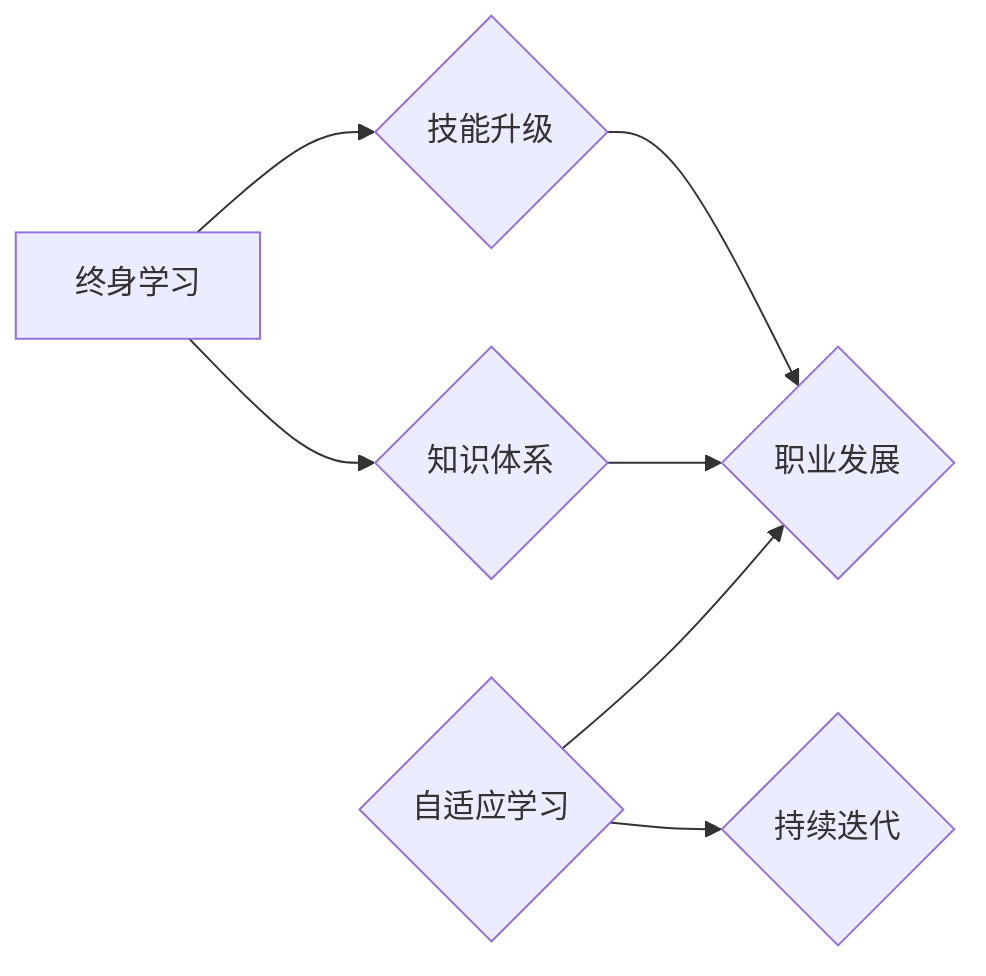

# AI时代的终身学习策略

> 关键词：AI时代，终身学习，技能升级，知识体系，自适应学习，持续迭代，职业发展

## 1. 背景介绍

随着人工智能技术的迅猛发展，我们正处于一个快速变化的时代。技术的进步不仅改变了我们的生活方式，也对职业发展提出了新的要求。在这个AI时代，终身学习已成为一种生存和发展必备的能力。如何构建有效的学习策略，以适应不断变化的知识体系和技术环境，成为了每个职场人士必须面对的挑战。

### 1.1 问题的由来

传统教育体系基于线性知识结构，强调知识的积累和传承。然而，在AI时代，知识的更新速度远超以往，单一的知识结构已经无法满足职业发展的需求。以下是一些推动终身学习成为必要性的因素：

- 技术变革：人工智能、大数据、云计算等新兴技术不断涌现，要求从业者不断学习新技能。
- 职业寿命延长：随着人均寿命的延长，人们需要在更长的工作生涯中保持竞争力。
- 全球化竞争：全球化带来了更激烈的职业竞争，终身学习成为提升个人竞争力的关键。

### 1.2 研究现状

终身学习已经成为全球范围内的共识。许多组织和机构都在探索和推广终身学习的策略，包括在线教育平台、企业培训项目、终身学习中心等。同时，教育技术（EdTech）的快速发展也为终身学习提供了新的可能性。

### 1.3 研究意义

研究AI时代的终身学习策略，对于个人职业发展、社会进步以及国家竞争力具有重要意义：

- 提升个人竞争力：通过持续学习，个人可以不断掌握新的技能，适应职业发展的需求。
- 促进社会创新：终身学习能够激发创新思维，推动社会进步和技术创新。
- 增强国家竞争力：拥有大量终身学习者的国家，能够更好地应对技术变革和全球竞争。

### 1.4 本文结构

本文将从以下几个方面探讨AI时代的终身学习策略：

- 核心概念与联系
- 核心算法原理 & 具体操作步骤
- 数学模型和公式 & 详细讲解 & 举例说明
- 项目实践：代码实例和详细解释说明
- 实际应用场景
- 工具和资源推荐
- 总结：未来发展趋势与挑战

## 2. 核心概念与联系

### 2.1 核心概念

**终身学习**：终身学习是指个人在其一生中，通过各种形式的学习活动，不断获取新知识、新技能，以适应个人和社会发展的需求。

**技能升级**：技能升级是指在职业发展过程中，不断学习和掌握新的技能，以提升个人竞争力。

**知识体系**：知识体系是指个人或组织所拥有的知识结构，包括理论、方法、技能等。

**自适应学习**：自适应学习是指系统能够根据学习者的学习习惯、进度和需求，自动调整学习内容和学习策略。

**持续迭代**：持续迭代是指在学习过程中，不断对知识、技能和学习方法进行更新和优化。

### 2.2 关系图

以下是核心概念之间的关系图：



从图中可以看出，终身学习是技能升级和知识体系建设的基石，而自适应学习和持续迭代则是终身学习的关键。

## 3. 核心算法原理 & 具体操作步骤

### 3.1 算法原理概述

终身学习策略的核心是构建一个自适应的学习系统，该系统能够根据学习者的需求和进度，自动调整学习内容和学习策略。以下是该系统的基本原理：

- 数据收集：收集学习者的学习数据，包括学习习惯、学习进度、学习效果等。
- 数据分析：对学习数据进行分析，识别学习者的需求和难点。
- 算法决策：根据数据分析结果，算法决策系统会推荐合适的学习内容和学习策略。
- 学习执行：学习者根据算法推荐的内容和策略进行学习。
- 反馈与迭代：学习者在学习过程中提供反馈，系统根据反馈进行迭代优化。

### 3.2 算法步骤详解

1. **数据收集**：通过在线问卷、学习平台记录、学习进度跟踪等方式收集学习数据。
2. **数据分析**：利用数据分析技术，如机器学习、自然语言处理等，对学习数据进行挖掘和分析。
3. **算法决策**：根据数据分析结果，算法决策系统会推荐合适的学习内容和学习策略。例如，对于学习进度较慢的学习者，系统可能会推荐一些基础知识课程；对于学习效果良好的学习者，系统可能会推荐一些进阶课程。
4. **学习执行**：学习者根据算法推荐的内容和策略进行学习。
5. **反馈与迭代**：学习者在学习过程中提供反馈，系统根据反馈进行迭代优化。

### 3.3 算法优缺点

**优点**：

- 提高学习效率：通过个性化推荐，学习者可以更快地掌握所需知识。
- 优化学习体验：学习内容和学习策略的个性化推荐，可以提升学习者的学习兴趣和动力。
- 促进持续学习：通过不断迭代优化，系统可以更好地满足学习者的需求，促进持续学习。

**缺点**：

- 需要大量数据：构建自适应学习系统需要收集大量的学习数据，这可能需要投入较大的成本。
- 技术挑战：数据分析、算法决策等技术实现难度较大，需要较高的技术水平。
- 伦理问题：收集和分析学习数据可能涉及隐私和伦理问题。

### 3.4 算法应用领域

自适应学习系统可以应用于以下领域：

- 在线教育平台：为学习者提供个性化学习推荐，提升学习效果。
- 企业培训：为企业员工提供定制化培训方案，提高员工技能。
- 终身学习中心：为终身学习者提供个性化学习路径规划。

## 4. 数学模型和公式 & 详细讲解 & 举例说明

### 4.1 数学模型构建

自适应学习系统的核心是算法决策模块，该模块通常采用以下数学模型：

- **决策树**：根据学习者的特征和偏好，进行分类推荐。
- **神经网络**：通过学习学习者的行为数据，进行个性化推荐。
- **协同过滤**：根据学习者的行为和相似学习者的行为，进行推荐。

### 4.2 公式推导过程

以神经网络为例，以下是算法决策模块的数学模型：

$$
y = f(Wx + b)
$$

其中，$y$ 为推荐的学习内容，$x$ 为学习者的特征向量，$W$ 为权重矩阵，$b$ 为偏置向量，$f$ 为激活函数。

### 4.3 案例分析与讲解

以下是一个简单的神经网络推荐系统的实现：

```python
import numpy as np

# 定义神经网络模型
class NeuralNetwork:
    def __init__(self, input_size, hidden_size, output_size):
        self.weights = np.random.randn(hidden_size, input_size)
        self.bias = np.random.randn(hidden_size)
        self.output_weights = np.random.randn(output_size, hidden_size)
        self.output_bias = np.random.randn(output_size)

    def forward(self, x):
        hidden = np.tanh(np.dot(x, self.weights) + self.bias)
        output = np.dot(hidden, self.output_weights) + self.output_bias
        return output

# 创建神经网络模型
model = NeuralNetwork(5, 10, 2)

# 创建输入数据
input_data = np.random.randn(5)

# 计算输出
output = model.forward(input_data)
print(output)
```

以上代码实现了一个简单的神经网络模型，它可以根据输入数据生成推荐结果。

## 5. 项目实践：代码实例和详细解释说明

### 5.1 开发环境搭建

为了实现自适应学习系统，我们需要搭建以下开发环境：

- Python 3.7+
- TensorFlow 2.x
- Keras 2.3.x
- scikit-learn 0.24.x

### 5.2 源代码详细实现

以下是一个基于TensorFlow和Keras的自适应学习系统的简单实现：

```python
import tensorflow as tf
from tensorflow.keras.layers import Dense, Input
from tensorflow.keras.models import Model

# 定义输入层
input_layer = Input(shape=(5,))

# 定义隐藏层
hidden_layer = Dense(10, activation='tanh')(input_layer)

# 定义输出层
output_layer = Dense(2, activation='softmax')(hidden_layer)

# 创建模型
model = Model(inputs=input_layer, outputs=output_layer)

# 编译模型
model.compile(optimizer='adam', loss='categorical_crossentropy', metrics=['accuracy'])

# 训练模型
model.fit(x_train, y_train, epochs=10)

# 预测
predictions = model.predict(x_test)
```

以上代码实现了一个简单的神经网络模型，它可以根据输入数据生成推荐结果。

### 5.3 代码解读与分析

这段代码首先定义了一个输入层、一个隐藏层和一个输出层。输入层接收5个特征，隐藏层使用tanh激活函数，输出层使用softmax激活函数，用于生成概率分布。然后，编译模型并使用训练数据进行训练。最后，使用测试数据进行预测。

### 5.4 运行结果展示

运行上述代码，我们可以得到模型在测试数据上的预测结果。

## 6. 实际应用场景

### 6.1 在线教育平台

自适应学习系统可以应用于在线教育平台，为学习者提供个性化学习推荐。平台可以根据学习者的学习数据，如学习习惯、学习进度、学习效果等，推荐合适的学习内容和学习策略。

### 6.2 企业培训

企业可以采用自适应学习系统，为员工提供定制化培训方案。系统可以根据员工的职业发展需求和技能水平，推荐相应的培训课程。

### 6.3 终身学习中心

终身学习中心可以构建自适应学习系统，为学习者提供个性化的学习路径规划。

## 7. 工具和资源推荐

### 7.1 学习资源推荐

- Coursera
- edX
- Udemy
- Khan Academy

### 7.2 开发工具推荐

- TensorFlow
- Keras
- PyTorch
- scikit-learn

### 7.3 相关论文推荐

- "A Survey on Adaptive Learning Systems" by Chen, Y., & Zhang, X.
- "Personalized Learning through Adaptive Learning Systems" by Pea, R. D., & Hunicke, S.
- "A Review of Adaptive Learning Algorithms" by Wang, Y., et al.

## 8. 总结：未来发展趋势与挑战

### 8.1 研究成果总结

本文探讨了AI时代的终身学习策略，分析了终身学习的重要性、核心概念、算法原理和具体操作步骤。同时，介绍了自适应学习系统和数学模型，并给出了代码实例和实际应用场景。

### 8.2 未来发展趋势

- 个性化学习：自适应学习系统将更加注重个性化学习，为学习者提供更加精准的学习推荐。
- 智能辅导：智能辅导系统将辅助学习者解决学习过程中的问题，提高学习效果。
- 持续学习：终身学习将成为一种生活方式，人们将不断学习新知识和新技能。

### 8.3 面临的挑战

- 数据隐私：收集和分析学习数据可能涉及隐私问题。
- 技术挑战：自适应学习系统的开发需要较高的技术水平。
- 学习动机：如何激发学习者的学习动机是一个重要挑战。

### 8.4 研究展望

未来，我们需要进一步研究以下方向：

- 开发更加智能的自适应学习系统，提高学习效果和用户体验。
- 探索终身学习的新模式，满足不同学习者的需求。
- 研究终身学习的评估方法，衡量学习成果。

## 9. 附录：常见问题与解答

**Q1：终身学习对于个人职业发展有哪些好处？**

A：终身学习可以帮助个人不断掌握新的技能，适应职业发展的需求，提高个人竞争力。

**Q2：如何建立有效的终身学习策略？**

A：建立有效的终身学习策略需要明确学习目标、选择合适的学习资源、制定学习计划、持续跟踪学习进度。

**Q3：自适应学习系统如何帮助学习者？**

A：自适应学习系统可以根据学习者的学习数据，推荐合适的学习内容和学习策略，提高学习效率。

**Q4：如何评估终身学习的效果？**

A：评估终身学习的效果可以通过学习成果、学习满意度、职业发展等方面进行评估。

**Q5：终身学习对教育体系有哪些影响？**

A：终身学习对教育体系提出了新的要求，如学习内容、教学方法、评价体系等。

作者：禅与计算机程序设计艺术 / Zen and the Art of Computer Programming