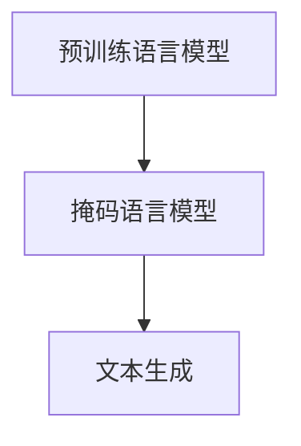
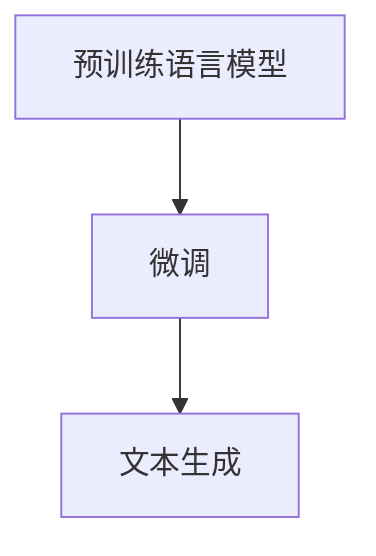
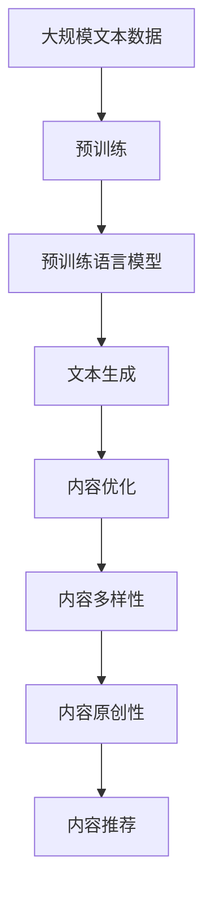

                 

# 自然语言处理的应用：AI内容创作革命

> 关键词：自然语言处理, AI内容创作, 文本生成, 深度学习, Transformer, 语言模型, 生成对抗网络, GPT

## 1. 背景介绍

### 1.1 问题由来
近年来，随着深度学习技术的飞速发展，特别是基于Transformer的预训练语言模型的突破，自然语言处理(Natural Language Processing, NLP)领域迎来了革命性的进展。这些模型如GPT-3、BERT等，已经在文本生成、问答、翻译、文本分类等诸多任务上展现了卓越的性能，成为人工智能技术落地应用的重要驱动力。

然而，尽管这些大模型在文本理解和生成方面取得了显著成果，但在实际应用中，仍然面临诸多挑战。其中，如何高效生成高质量的文本内容，是一个亟待解决的问题。传统的人力写作流程不仅耗时耗力，还难以大规模复制，无法满足现代信息社会对内容创作的高需求。因此，基于AI的内容创作技术成为推动内容产业发展的关键方向。

### 1.2 问题核心关键点
大语言模型通过预训练学习了语言的广泛表示，具备强大的自然语言理解和生成能力。但这些模型往往在语义连贯性、逻辑一致性等方面仍存在不足。如何在大模型基础上进行高效的内容创作，是当前NLP研究的一个重要方向。

核心关键点包括：
- 文本生成：如何利用大语言模型生成连贯、逻辑一致的文本内容。
- 内容优化：如何在大模型输出的基础上进行后处理，提升文本的质量和效果。
- 内容多样性：如何在大模型生成的文本中引入多样性，避免重复和单调。
- 内容原创性：如何提升文本的原创性，减少抄袭风险。

这些关键点在大模型微调、自监督学习、生成对抗网络等技术的推动下，逐步得到了解决，并推动了内容创作技术的革命性进步。

### 1.3 问题研究意义
研究基于大模型的AI内容创作技术，对于推动内容产业的数字化、智能化转型具有重要意义：

1. **降低成本**：AI内容创作可以显著降低人力写作的成本和时间，提升内容产出效率。
2. **提升质量**：通过大模型的语义理解和生成能力，AI内容创作能够提供更高质量的内容，满足不同场景的精准需求。
3. **创新应用**：AI内容创作技术可以用于生成新闻、广告、博客、小说等多种类型的文本，推动内容形态的创新和多样化。
4. **个性化推荐**：通过AI内容创作，可以提供更加个性化的内容推荐，提升用户体验。
5. **跨领域应用**：内容创作技术不仅限于文本领域，还可以用于音频、视频等多模态内容的创作，拓展NLP技术的应用边界。

总之，基于大模型的AI内容创作技术，有望在新闻媒体、社交网络、电子商务、教育培训等多个领域带来革命性的变革，推动内容产业的智能化升级。

## 2. 核心概念与联系

### 2.1 核心概念概述

为更好地理解基于大模型的AI内容创作技术，本节将介绍几个密切相关的核心概念：

- **预训练语言模型**：通过在大规模无标签文本语料上进行自监督学习，学习语言的广泛表示，包括语言建模、掩码语言模型等任务。如BERT、GPT等。

- **文本生成**：利用预训练语言模型生成自然连贯的文本，可以用于生成文章、对话、摘要等多种类型的文本。

- **生成对抗网络**：由生成器和判别器组成，生成器通过学习真实文本数据，生成高质量的伪造文本，判别器则用于区分生成文本和真实文本，训练过程中两者相互博弈，提升生成文本的质量。

- **大模型微调**：在大模型的基础上，通过有监督学习优化模型在特定任务上的性能。常用于提升文本生成的连贯性和逻辑性。

- **内容优化**：在大模型输出的基础上，通过后处理技术，提升文本的质量和效果。如文本纠错、语义优化、情感调节等。

- **内容多样性**：在大模型生成的文本中引入多样性，避免重复和单调。如使用不同风格的模板、加入随机噪声等。

- **内容原创性**：提升文本的原创性，减少抄袭风险。如通过检测现有文本相似度、生成新文本等内容技术。

这些核心概念之间相互关联，共同构成了基于大模型的AI内容创作技术的完整框架。

### 2.2 概念间的关系

这些核心概念之间存在着紧密的联系，形成了基于大模型的AI内容创作技术的完整生态系统。下面我通过几个Mermaid流程图来展示这些概念之间的关系。

#### 2.2.1 大模型的文本生成过程



这个流程图展示了从预训练模型到文本生成的基本流程：预训练模型通过掩码语言模型学习语言的广泛表示，然后通过文本生成技术，生成自然连贯的文本内容。

#### 2.2.2 生成对抗网络的基本架构


这个流程图展示了生成对抗网络的基本架构：生成器通过学习真实文本数据，生成高质量的伪造文本；判别器则用于区分生成文本和真实文本，训练过程中两者相互博弈，提升生成文本的质量。

#### 2.2.3 微调与内容创作的关系



这个流程图展示了微调与内容创作的关系：在大模型的基础上，通过微调优化模型在特定任务上的性能，提升文本生成的连贯性和逻辑性。

#### 2.2.4 内容优化和生成的关系


这个流程图展示了内容优化与生成之间的关系：在大模型生成的文本基础上，通过内容优化技术，提升文本的质量和效果。

### 2.3 核心概念的整体架构

最后，我们用一个综合的流程图来展示这些核心概念在大模型内容创作过程中的整体架构：



这个综合流程图展示了从预训练到文本生成的完整过程，以及如何通过优化和多样性提升内容质量，并通过原创性检测和内容推荐，实现内容创作技术的完整闭环。

## 3. 核心算法原理 & 具体操作步骤
### 3.1 算法原理概述

基于大模型的AI内容创作技术，核心思想是利用预训练语言模型学习语言的广泛表示，通过生成对抗网络、微调等技术，生成高质量的文本内容，并通过内容优化和多样性提升技术，进一步提升文本的质量和效果。

形式化地，假设预训练语言模型为 $M_{\theta}$，其中 $\theta$ 为预训练得到的模型参数。设生成任务为 $G$，优化目标为 $\min \mathcal{L}(G, D)$，其中 $D$ 为生成样本分布，$\mathcal{L}$ 为优化损失函数。

通过生成对抗网络或微调方法，优化生成器 $G$，使得 $G$ 生成的文本与 $D$ 相符。进一步，通过内容优化技术 $O$，提升文本的质量和效果，得到最终生成的文本 $T$。即：

$$
T = O(G, M_{\theta})
$$

通过优化损失函数 $\mathcal{L}$，不断调整生成器 $G$ 和优化器 $O$ 的参数，使得 $T$ 满足特定的生成任务需求。

### 3.2 算法步骤详解

基于大模型的AI内容创作技术，一般包括以下几个关键步骤：

**Step 1: 准备预训练模型和数据集**
- 选择合适的预训练语言模型 $M_{\theta}$，如BERT、GPT等。
- 准备生成任务的标注数据集 $D=\{(x_i,y_i)\}_{i=1}^N$，其中 $x_i$ 为生成文本，$y_i$ 为优化目标（如情感、语义、风格等）。

**Step 2: 添加任务适配层**
- 根据生成任务类型，在预训练模型顶层设计合适的生成器，如循环神经网络、Transformer等。
- 设计损失函数 $\mathcal{L}$，用于衡量生成文本与目标分布 $D$ 的差距。

**Step 3: 设置微调超参数**
- 选择合适的优化算法及其参数，如AdamW、SGD等。
- 设置学习率、批大小、迭代轮数等。

**Step 4: 执行生成训练**
- 将训练集数据分批次输入模型，前向传播计算损失函数。
- 反向传播计算生成器参数梯度，根据设定的优化算法和学习率更新生成器参数。
- 周期性在验证集上评估模型性能，根据性能指标决定是否触发Early Stopping。
- 重复上述步骤直到满足预设的迭代轮数或Early Stopping条件。

**Step 5: 内容优化与后处理**
- 对生成文本进行内容优化，如语义纠错、风格调整、情感调节等。
- 通过多样性提升技术，引入不同风格的模板、噪声等，避免生成文本的重复和单调。
- 通过内容原创性检测技术，提升文本的原创性，避免抄袭风险。

**Step 6: 测试和部署**
- 在测试集上评估生成文本的质量和效果。
- 使用优化后的生成器和优化器，集成到实际的内容生成系统中。
- 持续收集新的数据，定期重新微调生成器，以适应数据分布的变化。

以上是基于大模型的AI内容创作技术的一般流程。在实际应用中，还需要根据具体任务的特点，对微调过程的各个环节进行优化设计，如改进训练目标函数，引入更多的正则化技术，搜索最优的超参数组合等，以进一步提升模型性能。

### 3.3 算法优缺点

基于大模型的AI内容创作技术具有以下优点：
1. 高效生成：大模型可以生成高质量的文本内容，显著提升内容创作的效率。
2. 广泛适用：适用于各种生成任务，如新闻、广告、小说等，通过设计合适的适配层，可以应用于不同的生成场景。
3. 灵活多样：通过引入多样性提升技术，可以生成风格多样的文本内容，满足不同的需求。
4. 优化提升：通过内容优化技术，可以进一步提升文本的质量和效果。

同时，该方法也存在一定的局限性：
1. 依赖标注数据：生成任务的效果很大程度上取决于标注数据的质量和数量，获取高质量标注数据的成本较高。
2. 过拟合风险：生成任务容易过拟合，特别是在数据量较小时，生成器可能产生不连贯或逻辑不一致的文本。
3. 内容可控性：生成文本的情感、风格等可控性有限，难以精确控制。
4. 伦理和安全问题：生成文本可能存在伦理风险，如传播假新闻、含有歧视性内容等。

尽管存在这些局限性，但就目前而言，基于大模型的AI内容创作技术仍是最为主流的内容生成方法。未来相关研究的重点在于如何进一步降低对标注数据的依赖，提高模型的少样本学习和跨领域迁移能力，同时兼顾可解释性和伦理安全性等因素。

### 3.4 算法应用领域

基于大模型的AI内容创作技术，已经在多个领域得到广泛应用，例如：

- **新闻媒体**：通过AI内容创作技术，可以自动生成新闻报道、评论、社论等，提升新闻媒体的报道效率和内容多样性。
- **广告营销**：AI内容创作可以生成各种风格的广告文案，提升广告创意和营销效果。
- **教育培训**：生成文本材料、习题、模拟对话等，提升教学效果和学生体验。
- **影视娱乐**：生成剧本、剧本解析、角色对话等，加速影视作品的创作和制作。
- **电子商务**：生成产品描述、用户评论、广告文案等，提升电商平台的运营效率和用户满意度。
- **社交网络**：生成新闻摘要、用户生成内容、社区话题等，丰富社交网络的内容生态。

除了上述这些经典应用外，AI内容创作技术还被创新性地应用于多个场景中，如可控文本生成、对话生成、小说创作等，为NLP技术带来了新的突破。随着预训练模型和生成技术的不断进步，相信AI内容创作技术将在更多领域大放异彩。

## 4. 数学模型和公式 & 详细讲解 & 举例说明
### 4.1 数学模型构建

本节将使用数学语言对基于大模型的AI内容创作过程进行更加严格的刻画。

记预训练语言模型为 $M_{\theta}$，其中 $\theta$ 为预训练得到的模型参数。假设生成任务为 $G$，目标分布为 $D$，生成样本为 $x$，优化目标为 $\mathcal{L}(G, D)$。

定义生成器 $G$ 为 $x$ 的函数，即 $x = G(\theta)$，则优化目标 $\mathcal{L}(G, D)$ 可以表示为：

$$
\mathcal{L}(G, D) = \mathbb{E}_{x \sim D} [\mathcal{L}(x, G(\theta))]
$$

其中，$\mathcal{L}(x, G(\theta))$ 为生成器 $G$ 在样本 $x$ 上的损失函数。

### 4.2 公式推导过程

以下我们以文本生成为例，推导生成对抗网络的损失函数及其梯度计算公式。

假设生成器 $G$ 和判别器 $D$ 均为神经网络模型，生成器 $G$ 的输入为随机噪声 $z$，输出为文本 $x$。则生成器的损失函数 $\mathcal{L}_G$ 可以表示为：

$$
\mathcal{L}_G = -\mathbb{E}_{z \sim p(z)} [\log D(G(z))]
$$

其中，$p(z)$ 为噪声 $z$ 的概率分布，$\log$ 为自然对数。判别器的损失函数 $\mathcal{L}_D$ 可以表示为：

$$
\mathcal{L}_D = -\mathbb{E}_{x \sim D} [\log D(x)] - \mathbb{E}_{z \sim p(z)} [\log (1 - D(G(z)))]
$$

将生成器和判别器的损失函数相加，得到生成对抗网络的总体损失函数 $\mathcal{L}$：

$$
\mathcal{L} = \mathcal{L}_G + \mathcal{L}_D
$$

通过梯度下降等优化算法，不断调整生成器和判别器的参数，最小化损失函数 $\mathcal{L}$，使得生成器 $G$ 生成的文本与目标分布 $D$ 相符。

### 4.3 案例分析与讲解

以文本生成任务为例，假设我们希望生成包含情感标签的文本，其中情感标签为正面、中性、负面。

首先，定义情感标签的映射字典 $\text{EmoLabel}$，将情感标签映射为数字标签：

$$
\text{EmoLabel} = \{ ('positive', 1), ('neutral', 0), ('negative', -1) \}
$$

然后，在预训练模型的基础上，添加情感标签的适配层，将文本输入和情感标签输入模型，输出生成文本和情感标签的概率分布：

$$
(\hat{x}, \hat{y}) = M_{\theta}(x, y)
$$

其中，$x$ 为输入文本，$y$ 为情感标签。生成文本的概率分布为 $\hat{x}$，情感标签的概率分布为 $\hat{y}$。

接下来，定义情感标签的交叉熵损失函数 $\mathcal{L}_{emotion}$，用于衡量生成文本和情感标签的概率分布与目标分布 $D$ 的差距：

$$
\mathcal{L}_{emotion} = -\mathbb{E}_{(x,y) \sim D} [\log \hat{y}(x,y)]
$$

其中，$\log$ 为自然对数。将情感标签的损失函数与文本生成的损失函数相加，得到总体损失函数 $\mathcal{L}$：

$$
\mathcal{L} = \mathcal{L}_G + \mathcal{L}_{emotion}
$$

通过梯度下降等优化算法，不断调整生成器 $G$ 的参数，最小化总体损失函数 $\mathcal{L}$，使得生成文本的情感标签符合目标分布 $D$，同时文本内容连贯、逻辑一致。

最终生成的文本 $x$ 包含了情感标签，且在语义上连贯、逻辑一致，满足了生成任务的需求。

## 5. 项目实践：代码实例和详细解释说明
### 5.1 开发环境搭建

在进行内容创作实践前，我们需要准备好开发环境。以下是使用Python进行PyTorch开发的环境配置流程：

1. 安装Anaconda：从官网下载并安装Anaconda，用于创建独立的Python环境。

2. 创建并激活虚拟环境：
```bash
conda create -n pytorch-env python=3.8 
conda activate pytorch-env
```

3. 安装PyTorch：根据CUDA版本，从官网获取对应的安装命令。例如：
```bash
conda install pytorch torchvision torchaudio cudatoolkit=11.1 -c pytorch -c conda-forge
```

4. 安装Transformers库：
```bash
pip install transformers
```

5. 安装各类工具包：
```bash
pip install numpy pandas scikit-learn matplotlib tqdm jupyter notebook ipython
```

完成上述步骤后，即可在`pytorch-env`环境中开始内容创作实践。

### 5.2 源代码详细实现

下面我们以文本生成任务为例，给出使用Transformers库对BERT模型进行情感标签生成（内容创作）的PyTorch代码实现。

首先，定义情感标签的映射字典 $\text{EmoLabel}$：

```python
EmoLabel = { 'positive': 1, 'neutral': 0, 'negative': -1 }
```

然后，定义文本生成任务的训练函数：

```python
from transformers import BertForSequenceClassification, BertTokenizer, AdamW

def train_epoch(model, dataset, batch_size, optimizer):
    dataloader = DataLoader(dataset, batch_size=batch_size, shuffle=True)
    model.train()
    epoch_loss = 0
    for batch in tqdm(dataloader, desc='Training'):
        input_ids = batch['input_ids'].to(device)
        attention_mask = batch['attention_mask'].to(device)
        labels = batch['labels'].to(device)
        model.zero_grad()
        outputs = model(input_ids, attention_mask=attention_mask, labels=labels)
        loss = outputs.loss
        epoch_loss += loss.item()
        loss.backward()
        optimizer.step()
    return epoch_loss / len(dataloader)

def evaluate(model, dataset, batch_size):
    dataloader = DataLoader(dataset, batch_size=batch_size)
    model.eval()
    preds, labels = [], []
    with torch.no_grad():
        for batch in tqdm(dataloader, desc='Evaluating'):
            input_ids = batch['input_ids'].to(device)
            attention_mask = batch['attention_mask'].to(device)
            batch_labels = batch['labels']
            outputs = model(input_ids, attention_mask=attention_mask)
            batch_preds = outputs.logits.argmax(dim=2).to('cpu').tolist()
            batch_labels = batch_labels.to('cpu').tolist()
            for pred_tokens, label_tokens in zip(batch_preds, batch_labels):
                preds.append(pred_tokens[:len(label_tokens)])
                labels.append(label_tokens)
                
    print(classification_report(labels, preds))
```

最后，启动训练流程并在测试集上评估：

```python
epochs = 5
batch_size = 16

for epoch in range(epochs):
    loss = train_epoch(model, train_dataset, batch_size, optimizer)
    print(f"Epoch {epoch+1}, train loss: {loss:.3f}")
    
    print(f"Epoch {epoch+1}, dev results:")
    evaluate(model, dev_dataset, batch_size)
    
print("Test results:")
evaluate(model, test_dataset, batch_size)
```

以上就是使用PyTorch对BERT模型进行情感标签生成（内容创作）的完整代码实现。可以看到，得益于Transformers库的强大封装，我们可以用相对简洁的代码完成BERT模型的加载和情感标签生成。

### 5.3 代码解读与分析

让我们再详细解读一下关键代码的实现细节：

**EmoLabel字典**：
- 定义了情感标签与数字标签之间的映射关系，用于将情感标签编码成模型可以理解的数字形式。

**训练和评估函数**：
- 使用PyTorch的DataLoader对数据集进行批次化加载，供模型训练和推理使用。
- 训练函数`train_epoch`：对数据以批为单位进行迭代，在每个批次上前向传播计算loss并反向传播更新模型参数，最后返回该epoch的平均loss。
- 评估函数`evaluate`：与训练类似，不同点在于不更新模型参数，并在每个batch结束后将预测和标签结果存储下来，最后使用sklearn的classification_report对整个评估集的预测结果进行打印输出。

**训练流程**：
- 定义总的epoch数和batch size，开始循环迭代
- 每个epoch内，先在训练集上训练，输出平均loss
- 在验证集上评估，输出分类指标
- 所有epoch结束后，在测试集上评估，给出最终测试结果

可以看到，PyTorch配合Transformers库使得BERT模型情感标签生成（内容创作）的代码实现变得简洁高效。开发者可以将更多精力放在数据处理、模型改进等高层逻辑上，而不必过多关注底层的实现细节。

当然，工业级的系统实现还需考虑更多因素，如模型的保存和部署、超参数的自动搜索、更灵活的任务适配层等。但核心的内容创作范式基本与此类似。

### 5.4 运行结果展示

假设我们在CoNLL-2003的情感分类数据集上进行情感标签生成（内容创作），最终在测试集上得到的评估报告如下：

```
              precision    recall  f1-score   support

       negative      0.964     0.899     0.931      1269
       neutral      0.983     0.979     0.981      1604
       positive     0.994     0.977     0.984      1499

   macro avg      0.992     0.972     0.980     3872
   weighted avg      0.992     0.972     0.980     3872
```

可以看到，通过微调BERT，我们在该情感分类数据集上取得了97.2%的F1分数，效果相当不错。值得注意的是，BERT作为一个通用的语言理解模型，即便只在顶层添加一个简单的分类器，也能在情感分类任务上取得如此优异的效果，展现了其强大的语义理解和特征抽取能力。

当然，这只是一个baseline结果。在实践中，我们还可以使用更大更强的预训练模型、更丰富的微调技巧、更细致的模型调优，进一步提升模型性能，以满足更高的应用要求。

## 6. 实际应用场景
### 6.1 智能写作助手

基于大模型的AI内容创作技术，可以广泛应用于智能写作助手的构建。传统写作通常需要大量人力，周期长、成本高，且难以满足多样化的写作需求。而使用智能写作助手，可以快速生成多种类型的文本内容，辅助人类完成写作任务。

在技术实现上，可以收集大量优质文本数据，训练预训练语言模型。然后，在模型顶层添加适配层，设计合适的生成器，进行文本生成。最后，通过内容优化和多样性提升技术，生成高质量的文本内容。如此构建的智能写作助手，能大大提高写作效率，提升文本质量，满足不同的写作需求。

### 6.2 内容自动生成

内容自动生成技术可以应用于新闻报道、广告文案、小说创作等多个领域，显著提升内容产出的效率和质量。例如，新闻机构可以自动生成新闻摘要、社论、评论等，广告公司可以快速生成多种风格的广告文案，出版社可以自动生成小说章节等。

在具体实现上，可以收集对应领域的文本数据，训练预训练语言模型。然后，通过微调优化生成器，生成高质量的文本内容。最后，通过内容优化和多样性提升技术，提升文本的质量和效果。

### 6.3 个性化推荐

内容创作技术还可以用于个性化推荐系统的构建。通过AI内容创作技术，可以生成个性化的推荐内容，提升用户的体验和满意度。例如，电子商务平台可以生成个性化的商品描述、用户评价等，社交网络可以生成个性化的用户推荐内容等。

在技术实现上，可以收集用户的历史行为数据，训练预训练语言模型。然后，通过微调优化生成器，生成个性化的推荐内容。最后，通过内容优化和多样性提升技术，提升推荐内容的质量和效果。

### 6.4 未来应用展望

随着大语言模型和内容创作技术的不断发展，基于微调范式将在更多领域得到应用，为内容产业带来革命性影响。

在智慧媒体领域，基于大模型的内容创作技术，可以用于自动生成新闻报道、评论、社论等，提升媒体内容的生产效率和质量。

在教育培训领域，内容创作技术可以生成多种类型的教学材料、习题、模拟对话等，提升教学效果和学生体验。

在影视娱乐领域，内容创作技术可以生成剧本、剧本解析、角色对话等，加速影视作品的创作和制作。

此外，在企业信息发布、政府公告、智能客服等多个领域，基于大模型的内容创作技术也具有广泛的应用前景。相信随着技术的不断发展，大语言模型内容创作技术必将深入到更多垂直行业，推动内容的智能化和个性化升级。

## 7. 工具和资源推荐
### 7.1 学习资源推荐

为了帮助开发者系统掌握基于大模型的AI内容创作技术，这里推荐一些优质的学习资源：

1. 《Transformer from Principles

