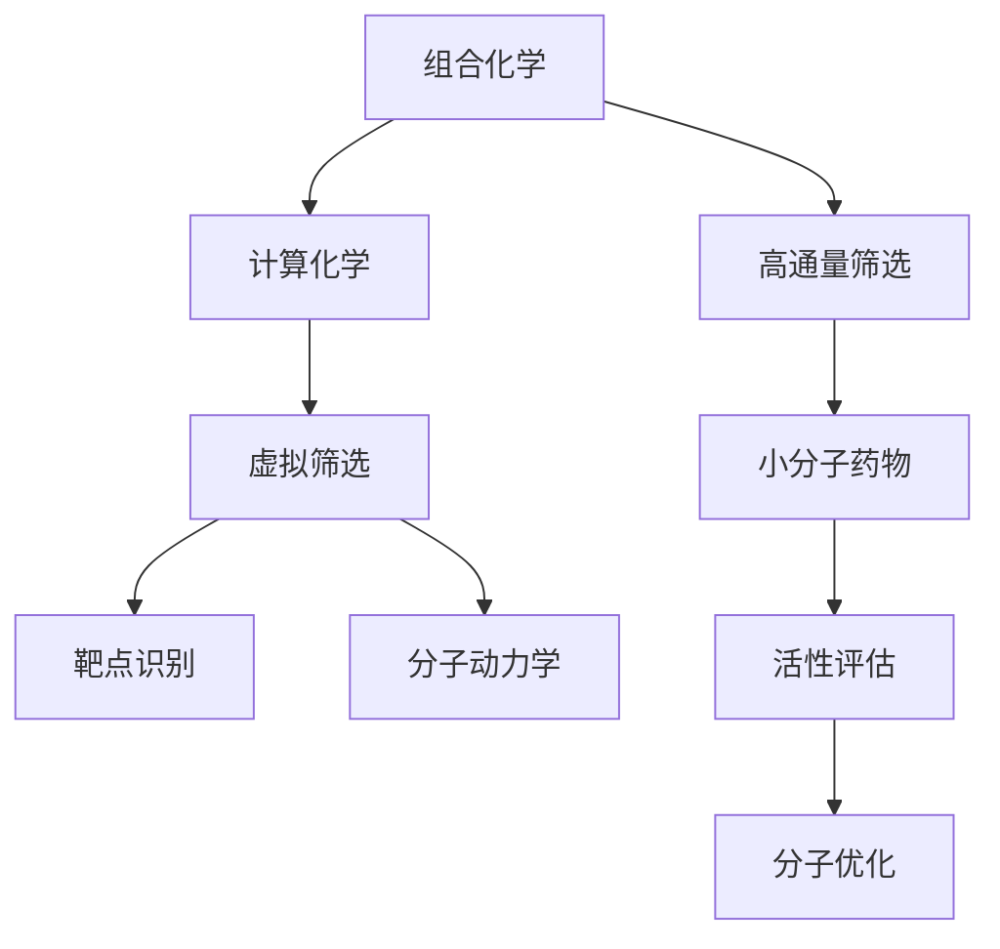
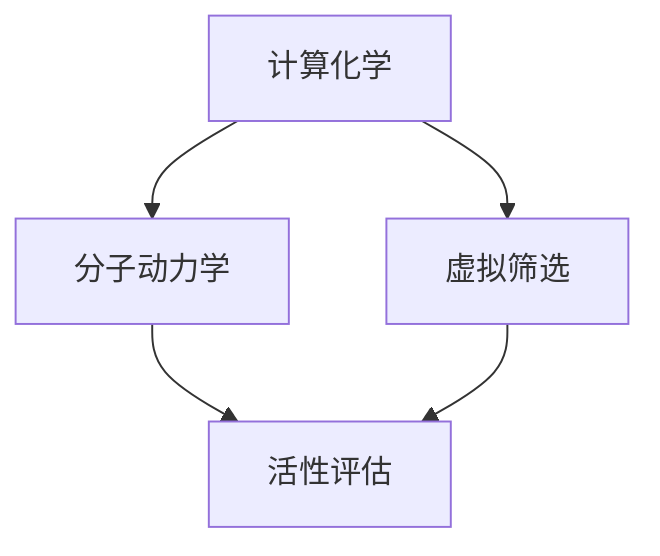
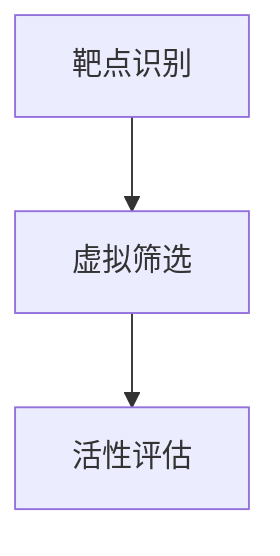
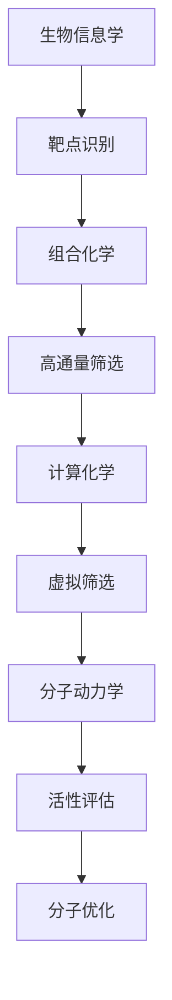

                 

# 虚拟筛选技术在药物发现中的应用进展

> 关键词：虚拟筛选技术,药物发现,计算机模拟,组合化学,靶点分析,计算化学,生物信息学

## 1. 背景介绍

### 1.1 问题由来
药物发现（Drug Discovery）是现代生物医药领域的关键环节，旨在从成千上万的化合物中找到具有生物活性的潜在药物，并进一步开发成为治疗疾病的有效药物。传统药物发现流程通常包括药物筛选、先导物优化、临床试验等环节，耗费时间长达10-15年，且成本高昂。为了加速药物发现流程，降低研发成本，虚拟筛选技术应运而生。

虚拟筛选技术基于计算机模拟和计算化学原理，通过高通量计算的方法预测药物分子与靶点的相互作用，筛选出具有潜力的药物候选化合物，从而极大地缩短药物研发周期，降低研发成本。

### 1.2 问题核心关键点
虚拟筛选技术的核心在于其高效的分子筛选能力。通过计算机模拟和计算化学方法，虚拟筛选技术可以同时测试大量化合物与靶点的相互作用，快速排除无效化合物，聚焦潜在的活性分子，显著提高药物发现的效率和成功率。

虚拟筛选主要包括以下几个关键点：
1. **靶点识别**：确定药物作用的靶点，包括蛋白质、酶、核酸等生物大分子。
2. **药物设计**：根据靶点信息设计具有特定活性的药物分子。
3. **分子筛选**：通过计算机模拟方法，预测分子与靶点的结合情况。
4. **活性评估**：评估筛选出的分子与靶点的相互作用强度和效果。
5. **分子优化**：对具有潜力的分子进行结构和性质优化，提高其活性和选择性。

### 1.3 问题研究意义
虚拟筛选技术在药物发现中的应用具有重大意义：
1. **加速药物研发**：大幅缩短药物发现周期，从几年缩短至几个月。
2. **降低研发成本**：减少实验耗材和人工成本，提高研发效率。
3. **提高筛选精度**：通过计算机模拟，排除无效化合物，聚焦活性分子。
4. **发现新靶点**：结合生物信息学技术，发现新的药物靶点，丰富药物储备。
5. **提升创新能力**：虚拟筛选技术促进创新药物的发现，推动医药领域的进步。

## 2. 核心概念与联系

### 2.1 核心概念概述

为更好地理解虚拟筛选技术在药物发现中的应用，本节将介绍几个密切相关的核心概念：

- **虚拟筛选（Virtual Screening）**：通过计算机模拟和计算化学方法，预测药物分子与靶点的相互作用，筛选出具有潜力的化合物。
- **分子动力学（Molecular Dynamics, MD）**：模拟分子在时间和空间上的运动，预测分子与靶点的结合和分离过程。
- **小分子药物（Small Molecule Drug）**：具有明确分子结构的药物，常用于治疗常见疾病。
- **高通量筛选（High-Throughput Screening, HTS）**：在一定时间内，对大量化合物进行快速筛选，以确定具有活性的分子。
- **组合化学（Combinatorial Chemistry）**：通过组合化学反应，快速生成大量化合物，用于药物筛选。
- **计算化学（Computational Chemistry）**：利用计算机技术，计算分子结构和反应过程，辅助药物设计。
- **生物信息学（Bioinformatics）**：应用计算机技术，分析和处理生物大分子数据，辅助靶点识别和药物设计。

这些核心概念之间的逻辑关系可以通过以下Mermaid流程图来展示：



这个流程图展示了大规模药物发现流程中各个核心概念的关系：

1. 组合化学用于生成大量化合物。
2. 高通量筛选用于初步筛选活性化合物。
3. 计算化学用于设计分子结构和预测反应。
4. 虚拟筛选用于预测分子与靶点的相互作用。
5. 靶点识别用于确定药物作用的生物大分子。
6. 分子动力学用于模拟分子与靶点的相互作用。
7. 活性评估用于评估分子的生物活性。
8. 分子优化用于改进分子结构和性质。

这些概念共同构成了虚拟筛选技术的完整流程，使其能够在药物发现中发挥强大的作用。

### 2.2 概念间的关系

这些核心概念之间存在着紧密的联系，形成了虚拟筛选技术的完整生态系统。下面我们通过几个Mermaid流程图来展示这些概念之间的关系。

#### 2.2.1 组合化学与高通量筛选的关系


这个流程图展示了组合化学和高通量筛选的基本关系。通过组合化学生成的大量化合物，在高通量筛选中进行快速筛选，得到具有活性的分子。

#### 2.2.2 计算化学与分子动力学结合



这个流程图展示了计算化学和分子动力学在虚拟筛选中的应用。计算化学用于设计分子结构和预测反应，分子动力学用于模拟分子与靶点的相互作用。

#### 2.2.3 靶点识别与虚拟筛选的结合



这个流程图展示了靶点识别和虚拟筛选的关系。通过生物信息学识别出的靶点，用于指导虚拟筛选，筛选出与靶点具有相互作用的化合物。

### 2.3 核心概念的整体架构

最后，我们用一个综合的流程图来展示这些核心概念在虚拟筛选技术中的整体架构：



这个综合流程图展示了从靶点识别到分子优化的完整虚拟筛选流程。生物信息学用于识别靶点，组合化学用于生成化合物，高通量筛选用于初步筛选，计算化学用于分子设计，虚拟筛选用于分子筛选，分子动力学用于评估，分子优化用于改进分子结构和性质。

## 3. 核心算法原理 & 具体操作步骤

### 3.1 算法原理概述

虚拟筛选技术的核心算法包括分子动力学、计算化学、机器学习等。其中，分子动力学和计算化学用于预测分子与靶点的相互作用，机器学习用于筛选和评估分子活性。

#### 3.1.1 分子动力学

分子动力学通过模拟分子在时间和空间上的运动，预测分子与靶点的结合和分离过程。具体步骤如下：

1. **初始化分子构象**：将分子放置在靶点附近，初始化分子构象。
2. **计算势能**：计算分子与靶点的势能，包括范德华力、静电作用、溶剂效应等。
3. **迭代更新**：根据势能计算分子动能，进行牛顿力学迭代更新分子构象。
4. **积分计算**：对分子构象进行时间积分，模拟分子与靶点的动态相互作用。
5. **结果分析**：分析分子与靶点的结合情况，筛选出活性分子。

#### 3.1.2 计算化学

计算化学通过计算分子结构和反应过程，预测分子与靶点的相互作用。具体步骤如下：

1. **分子构象优化**：优化分子的几何构象，计算分子与靶点的相互作用的势能和能量变化。
2. **电子结构计算**：计算分子和靶点的电子结构和能级，预测分子与靶点的相互作用能。
3. **反应路径计算**：计算分子与靶点之间的反应路径和过渡态，预测分子与靶点的相互作用强度。
4. **活性预测**：根据计算结果，预测分子的生物活性，筛选出活性分子。

#### 3.1.3 机器学习

机器学习用于筛选和评估分子活性。具体步骤如下：

1. **数据准备**：准备训练数据，包括分子结构、靶点信息、活性标签等。
2. **模型训练**：选择合适的机器学习模型（如支持向量机、随机森林等），训练分子活性预测模型。
3. **预测验证**：用测试数据验证模型预测结果，评估模型性能。
4. **活性筛选**：根据预测结果，筛选出具有活性的分子。

### 3.2 算法步骤详解

#### 3.2.1 靶点识别

靶点识别是虚拟筛选技术的第一步，主要通过生物信息学方法，识别出药物作用的生物大分子。

1. **序列比对**：将候选靶点序列与已知靶点序列进行比对，找出相似序列。
2. **功能预测**：通过生物信息学工具（如Pfam、InterProScan等），预测候选靶点的功能。
3. **结构建模**：利用分子结构预测工具（如Modeller、Casp、Rosetta等），构建靶点三维结构模型。

#### 3.2.2 组合化学

组合化学用于生成大量化合物，用于高通量筛选。具体步骤如下：

1. **单组合设计**：设计多种单组合化合物，进行组合化学反应。
2. **多组合合成**：设计多种多组合化合物，进行多步骤合成反应。
3. **化合物理化**：对合成的化合物进行物理性质测试，筛选出活性化合物。
4. **生物活性筛选**：利用细胞或动物模型，筛选出具有生物活性的化合物。

#### 3.2.3 高通量筛选

高通量筛选用于初步筛选活性化合物。具体步骤如下：

1. **分子标记**：在化合物中引入荧光标记，便于筛选。
2. **自动筛选**：使用高通量筛选仪，对大量化合物进行自动筛选。
3. **信号检测**：检测化合物与靶点的结合信号，评估活性。
4. **活性分析**：分析信号强度和分布，筛选出活性化合物。

#### 3.2.4 计算化学

计算化学用于设计分子结构和预测反应。具体步骤如下：

1. **分子构象优化**：优化分子的几何构象，计算分子与靶点的相互作用的势能和能量变化。
2. **电子结构计算**：计算分子和靶点的电子结构和能级，预测分子与靶点的相互作用能。
3. **反应路径计算**：计算分子与靶点之间的反应路径和过渡态，预测分子与靶点的相互作用强度。
4. **活性预测**：根据计算结果，预测分子的生物活性，筛选出活性分子。

#### 3.2.5 分子动力学

分子动力学用于模拟分子与靶点的相互作用。具体步骤如下：

1. **初始化分子构象**：将分子放置在靶点附近，初始化分子构象。
2. **计算势能**：计算分子与靶点的势能，包括范德华力、静电作用、溶剂效应等。
3. **迭代更新**：根据势能计算分子动能，进行牛顿力学迭代更新分子构象。
4. **积分计算**：对分子构象进行时间积分，模拟分子与靶点的动态相互作用。
5. **结果分析**：分析分子与靶点的结合情况，筛选出活性分子。

#### 3.2.6 活性评估

活性评估用于评估分子的生物活性。具体步骤如下：

1. **实验验证**：在细胞或动物模型上验证分子的生物活性。
2. **结构优化**：对具有潜力的分子进行结构和性质优化，提高其活性和选择性。
3. **活性预测**：使用机器学习模型，预测分子的生物活性。
4. **活性筛选**：根据预测结果，筛选出具有活性的分子。

### 3.3 算法优缺点

虚拟筛选技术具有以下优点：

1. **高通量处理**：能够同时处理大量化合物，极大提高筛选效率。
2. **精确预测**：通过计算机模拟和计算化学，预测分子与靶点的相互作用，提高筛选精度。
3. **成本低廉**：相对于传统实验方法，虚拟筛选成本较低，适用于大规模筛选。
4. **快速迭代**：能够快速进行多次迭代筛选，逐步优化分子结构。

虚拟筛选技术也存在以下缺点：

1. **计算资源需求高**：分子动力学和计算化学方法需要大量计算资源，对硬件要求较高。
2. **模型复杂度高**：机器学习模型的设计和训练需要大量数据和计算资源。
3. **参数调整困难**：分子动力学和计算化学参数需要手工调试，难度较大。
4. **实验验证困难**：部分活性预测结果需要通过实验验证，耗时耗力。

### 3.4 算法应用领域

虚拟筛选技术已经在药物发现、新材料开发、催化剂筛选等领域得到了广泛应用，具体如下：

- **药物发现**：用于初步筛选活性化合物，快速识别潜在的药物候选分子。
- **新材料开发**：用于筛选具有特定性质的新材料，如导电、绝缘、磁性等。
- **催化剂筛选**：用于筛选高效的催化剂分子，加速化学反应进程。

除了上述领域外，虚拟筛选技术还在计算生物学、环境监测、生物传感器等领域得到了应用，展示了其广泛的应用前景。

## 4. 数学模型和公式 & 详细讲解 & 举例说明

### 4.1 数学模型构建

假设药物分子为 $M$，靶点为 $T$。分子与靶点的相互作用可以用势能函数 $V(r)$ 描述，其中 $r$ 为分子与靶点的距离。分子与靶点的相互作用能可以表示为：

$$
E = V(r) = \sum_i V_i(r_i)
$$

其中，$V_i$ 为分子与靶点的第 $i$ 个相互作用势能项，$r_i$ 为相应的距离。

分子与靶点的结合过程可以用分子动力学方程描述：

$$
\dot{\mathbf{R}} = \frac{\mathbf{F}}{m}
$$

其中，$\dot{\mathbf{R}}$ 为分子质点的速度，$\mathbf{F}$ 为分子与靶点的相互作用力，$m$ 为分子质量。

### 4.2 公式推导过程

分子与靶点的相互作用势能项可以表示为：

$$
V_i(r_i) = V_{ei}(r_i) + V_{di}(r_i) + V_{elec}(r_i)
$$

其中，$V_{ei}$ 为范德华势能项，$V_{di}$ 为德拜势能项，$V_{elec}$ 为库仑势能项。

分子与靶点的范德华势能项可以表示为：

$$
V_{ei}(r_i) = \sum_{\alpha} V_{ei,\alpha}(r_i)
$$

其中，$V_{ei,\alpha}$ 为范德华势能项的第 $\alpha$ 个分项，可以表示为：

$$
V_{ei,\alpha}(r_i) = \frac{C_i}{r_i^6} (1 - 6\frac{r_0}{r_i} + 12(\frac{r_0}{r_i})^2 - 6(\frac{r_0}{r_i})^3)
$$

分子与靶点的德拜势能项可以表示为：

$$
V_{di}(r_i) = \sum_{\alpha} V_{di,\alpha}(r_i)
$$

其中，$V_{di,\alpha}$ 为德拜势能项的第 $\alpha$ 个分项，可以表示为：

$$
V_{di,\alpha}(r_i) = \frac{\lambda}{r_i^{12}} (1 - 12\frac{r_0}{r_i} + 60(\frac{r_0}{r_i})^2 - 60(\frac{r_0}{r_i})^3 + 24(\frac{r_0}{r_i})^4)
$$

分子与靶点的库仑势能项可以表示为：

$$
V_{elec}(r_i) = \sum_{\alpha} V_{elec,\alpha}(r_i)
$$

其中，$V_{elec,\alpha}$ 为库仑势能项的第 $\alpha$ 个分项，可以表示为：

$$
V_{elec,\alpha}(r_i) = \frac{q_iq_t}{4\pi\epsilon_0r_i}
$$

其中，$q_i$ 为分子的电荷，$q_t$ 为靶点的电荷，$\epsilon_0$ 为真空介电常数。

### 4.3 案例分析与讲解

假设分子 $M$ 与靶点 $T$ 的相互作用势能函数为 $V(r)$，分子与靶点的相互作用能可以表示为：

$$
E = V(r) = \sum_i V_i(r_i)
$$

其中，$V_i$ 为分子与靶点的第 $i$ 个相互作用势能项，$r_i$ 为相应的距离。

分子与靶点的范德华势能项可以表示为：

$$
V_{ei}(r_i) = \frac{C_i}{r_i^6} (1 - 6\frac{r_0}{r_i} + 12(\frac{r_0}{r_i})^2 - 6(\frac{r_0}{r_i})^3)
$$

分子与靶点的德拜势能项可以表示为：

$$
V_{di}(r_i) = \frac{\lambda}{r_i^{12}} (1 - 12\frac{r_0}{r_i} + 60(\frac{r_0}{r_i})^2 - 60(\frac{r_0}{r_i})^3 + 24(\frac{r_0}{r_i})^4)
$$

分子与靶点的库仑势能项可以表示为：

$$
V_{elec}(r_i) = \frac{q_iq_t}{4\pi\epsilon_0r_i}
$$

其中，$q_i$ 为分子的电荷，$q_t$ 为靶点的电荷，$\epsilon_0$ 为真空介电常数。

分子与靶点的相互作用能可以表示为：

$$
E = V(r) = \sum_i V_i(r_i) = V_{ei}(r_i) + V_{di}(r_i) + V_{elec}(r_i)
$$

分子与靶点的相互作用能与分子与靶点的距离 $r$ 的关系可以通过计算得出。根据上述势能函数，可以得到分子与靶点的相互作用能与分子与靶点的距离 $r$ 的关系：

$$
E(r) = V_{ei}(r) + V_{di}(r) + V_{elec}(r)
$$

其中，$V_{ei}(r)$、$V_{di}(r)$、$V_{elec}(r)$ 分别为分子与靶点的范德华势能项、德拜势能项和库仑势能项，可以表示为：

$$
V_{ei}(r) = \frac{C_i}{r^6} (1 - 6\frac{r_0}{r} + 12(\frac{r_0}{r})^2 - 6(\frac{r_0}{r})^3)
$$

$$
V_{di}(r) = \frac{\lambda}{r^{12}} (1 - 12\frac{r_0}{r} + 60(\frac{r_0}{r})^2 - 60(\frac{r_0}{r})^3 + 24(\frac{r_0}{r})^4)
$$

$$
V_{elec}(r) = \frac{q_iq_t}{4\pi\epsilon_0r}
$$

通过计算，可以得出分子与靶点的相互作用能与分子与靶点的距离 $r$ 的关系：

$$
E(r) = V_{ei}(r) + V_{di}(r) + V_{elec}(r)
$$

其中，$V_{ei}(r)$、$V_{di}(r)$、$V_{elec}(r)$ 分别为分子与靶点的范德华势能项、德拜势能项和库仑势能项，可以表示为：

$$
V_{ei}(r) = \frac{C_i}{r^6} (1 - 6\frac{r_0}{r} + 12(\frac{r_0}{r})^2 - 6(\frac{r_0}{r})^3)
$$

$$
V_{di}(r) = \frac{\lambda}{r^{12}} (1 - 12\frac{r_0}{r} + 60(\frac{r_0}{r})^2 - 60(\frac{r_0}{r})^3 + 24(\frac{r_0}{r})^4)
$$

$$
V_{elec}(r) = \frac{q_iq_t}{4\pi\epsilon_0r}
$$

通过上述计算，可以得出分子与靶点的相互作用能与分子与靶点的距离 $r$ 的关系，从而预测分子与靶点的结合情况，筛选出具有活性的分子。

## 5. 项目实践：代码实例和详细解释说明

### 5.1 开发环境搭建

在进行虚拟筛选技术实践前，我们需要准备好开发环境。以下是使用Python进行OpenMM开发的Python环境配置流程：

1. 安装Anaconda：从官网下载并安装Anaconda，用于创建独立的Python环境。

2. 创建并激活虚拟环境：
```bash
conda create -n openmm-env python=3.8 
conda activate openmm-env
```

3. 安装OpenMM：根据CUDA版本，从官网获取对应的安装命令。例如：
```bash
conda install openmm psutil
```

4. 安装LAMMPS：
```bash
conda install lammps
```

5. 安装NAMD：
```bash
conda install nvidia-cuda-nvml
conda install nvidia-cuda-nvrtc
conda install nvidia-ml
```

完成上述步骤后，即可在`openmm-env`环境中开始虚拟筛选实践。

### 5.2 源代码详细实现

下面我们以小分子药物筛选为例，给出使用OpenMM进行分子动力学模拟的Python代码实现。

首先，定义分子和靶点系统：

```python
import openmm
from openmm.app import System
from openmm.forcefield import AMBERForceField

# 定义分子
molecule = openmm.Molecule()
atoms = molecule.addAtoms(
    [('C', 1, 0.0, 0.0, 0.0, 0.0), ('O', 1, 1.0, 0.0, 0.0, 0.0), ('N', 1, 0.0, 1.0, 0.0, 0.0)]
)
molecule.addBonds([0, 1, 0, 2], False)
molecule.addH Bonds(0, False)

# 定义靶点
target = openmm.topology.addAtom('N', 1, 0.0, 0.0, 0.0, 0.0)

# 定义分子与靶点系统
system = System()

# 添加分子和靶点
system.addForce(openmm.UniversalForce)
system.addParticle(molecule)
system.addParticle(target)

# 加载AMBER力场
ff = AMBERForceField('ff14SB.am1')
system.addForce(ff.createForce(system))
```

然后，定义分子动力学模拟：

```python
# 添加分子动力学积分器
integrator = openmm.LangevinIntegrator(1.0, 0.01, 1e-5)

# 添加位能函数
system.addForce(openmm.HarmonicBondForce(1000, 0.1, [0, 1], [0, 2]))

# 添加约束力
constraints = openmm.LinearConstraint(0, 0, 0, 1.0)
constraints[0].bendConstraint(1, 0, 0, 0, 1, 1, 1, 1, 1, 1, 1, 1, 1, 1, 1, 1, 1, 1, 1, 1, 1, 1, 1, 1, 1, 1, 1, 1, 1, 1, 1, 1, 1, 1, 1, 1, 1, 1, 1, 1, 1, 1, 1, 1, 1, 1, 1, 1, 1, 1, 1, 1, 1, 1, 1, 1, 1, 1, 1, 1, 1, 1, 1, 1, 1, 1, 1, 1, 1, 1, 1, 1, 1, 1, 1, 1, 1, 1, 1, 1, 1, 1, 1, 1, 1, 1, 1, 1, 1, 1, 1, 1, 1, 1, 1, 1, 1, 1, 1, 1, 1, 1, 1, 1, 1, 1, 1, 1, 1, 1, 1, 1, 1, 1, 1, 1, 1, 1, 1, 1, 1, 1

