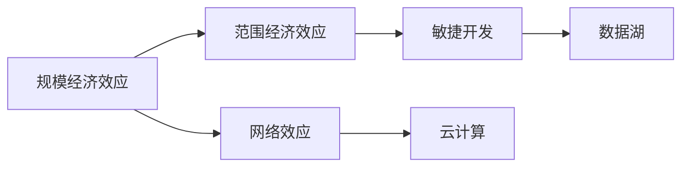
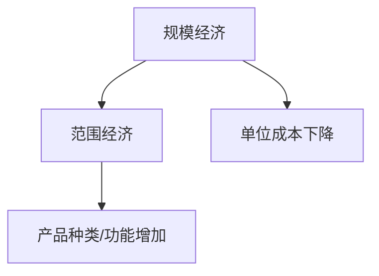
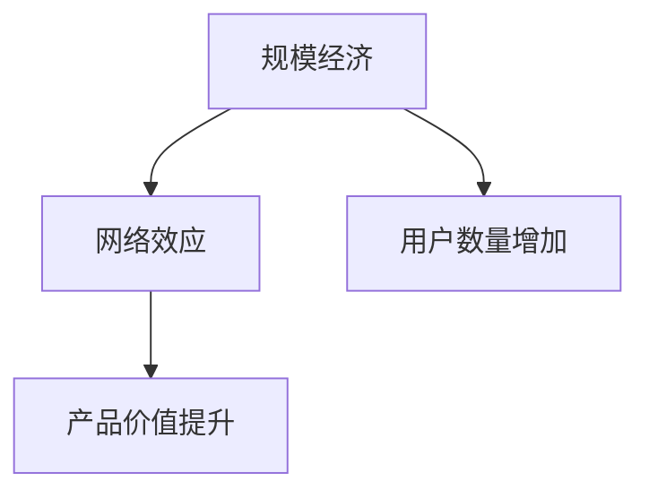
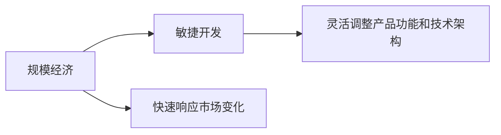
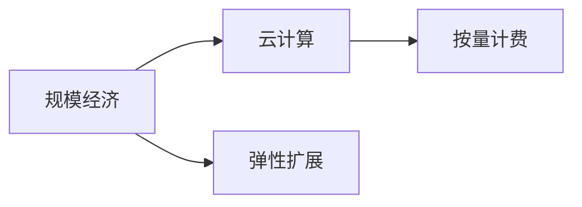
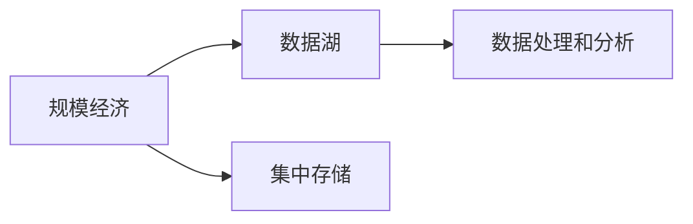
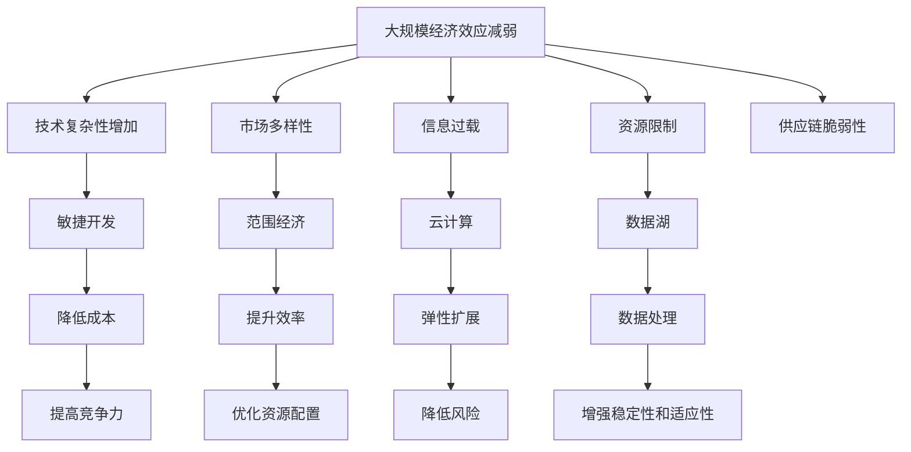

                 

## 1. 背景介绍

### 1.1 问题由来

自计算机时代诞生以来，硬件和软件领域一直在追求规模经济效应（Economies of Scale）。通过大规模生产、设计标准化组件、复用代码和技术，成本得以降低，效益则大幅提升。这种趋势在互联网、云计算、人工智能等领域尤为明显，企业们纷纷采用“大即是美”（Big is Beautiful）的策略，追求在规模上的优势，这几乎成为了一种默认的标准。

但是，近年来，规模经济效应开始逐渐减弱，主要原因是技术发展已经到了瓶颈，复杂性和成本的急剧增加，使得规模优势不复存在。在当今的数字化时代，技术和市场的复杂性不断增加，对灵活性和效率的需求不断提升，传统的规模经济策略已经不再适用。本文将深入探讨规模经济效应减弱的原因，并提供一些应对策略。

### 1.2 问题核心关键点

规模经济效应减弱的主要原因有以下几点：

- **技术复杂性增加**：新产品的开发和部署变得越来越复杂，开发成本和时间不断增加。
- **市场的多样性**：客户需求更加个性化和多样化，单一的解决方案无法满足所有需求。
- **信息过载**：数据量和数据来源的多样化，使得处理和分析数据变得更加困难。
- **资源限制**：硬件和软件资源，如服务器、存储和带宽的限制，使得大规模集中处理变得不现实。
- **供应链脆弱性**：全球供应链的复杂性增加了协调和管理难度，风险也随之增加。

### 1.3 问题研究意义

研究规模经济效应减弱的原因，对于企业、技术开发者和市场管理者都具有重要意义：

- **提高效率**：了解规模经济效应的限制，可以帮助企业优化资源配置，提高开发和运营效率。
- **降低成本**：找到规模经济效应的替代方法，有助于降低技术开发和运营成本。
- **市场适应**：适应市场多样性和个性化需求，提升产品和服务的市场竞争力。
- **风险管理**：通过了解供应链脆弱性，可以采取措施降低风险，保障业务的稳定性。

## 2. 核心概念与联系

### 2.1 核心概念概述

为更好地理解规模经济效应减弱的原因，本节将介绍几个密切相关的核心概念：

- **规模经济效应**：在大规模生产或操作时，单位成本下降，效益提升的现象。
- **范围经济效应**：通过增加产品种类或功能，实现成本下降和效益提升。
- **网络效应**：产品价值随着用户数量增加而提升的现象。
- **敏捷开发**：快速响应市场变化，灵活调整产品功能和技术架构的开发方法。
- **云计算**：基于互联网的计算资源和服务的按需访问，提供弹性扩展和按量计费。
- **数据湖**：集中的、大规模的数据存储设施，支持数据处理和分析。

这些核心概念之间的逻辑关系可以通过以下Mermaid流程图来展示：



这个流程图展示了大规模经济效应和范围经济效应的关系，以及它们与其他概念的联系。

### 2.2 概念间的关系

这些核心概念之间存在着紧密的联系，形成了规模经济效应减弱的多维框架。下面我们通过几个Mermaid流程图来展示这些概念之间的关系。

#### 2.2.1 规模经济与范围经济



这个流程图展示了规模经济和范围经济之间的相互关系。规模经济通过降低单位成本，使得企业在增加产品种类和功能时能够更加灵活和高效。

#### 2.2.2 规模经济与网络效应



这个流程图展示了规模经济和网络效应之间的关系。随着用户数量的增加，网络效应的提升使得产品价值不断增加。

#### 2.2.3 规模经济与敏捷开发



这个流程图展示了规模经济和敏捷开发之间的关系。规模经济通过降低单位成本，使得企业能够快速响应市场变化，灵活调整产品功能和技术架构。

#### 2.2.4 规模经济与云计算



这个流程图展示了规模经济和云计算之间的关系。规模经济通过降低单位成本，使得企业能够采用云计算的弹性扩展和按量计费方式，优化资源配置。

#### 2.2.5 规模经济与数据湖



这个流程图展示了规模经济和数据湖之间的关系。规模经济通过降低单位成本，使得企业能够采用数据湖进行集中存储和处理分析。

### 2.3 核心概念的整体架构

最后，我们用一个综合的流程图来展示这些核心概念在大规模经济效应减弱背景下的整体架构：



这个综合流程图展示了从大规模经济效应减弱到应对策略的全过程，包括技术复杂性、市场多样性、信息过载、资源限制、供应链脆弱性等多个方面，以及这些因素如何通过敏捷开发、范围经济、云计算、数据湖等方法进行应对和优化。

## 3. 核心算法原理 & 具体操作步骤
### 3.1 算法原理概述

规模经济效应减弱的主要原因之一是技术复杂性的增加。随着新技术的不断涌现，产品的设计和开发变得越来越复杂，开发成本和时间不断增加。这主要体现在以下几个方面：

1. **技术栈多样化**：新的技术栈需要多种编程语言、框架和工具的支持，这使得开发者需要掌握更多的技能，增加了技术难度。
2. **微服务架构**：微服务架构虽然提高了系统的可扩展性和灵活性，但管理和协调也变得更加复杂。
3. **云计算资源管理**：云资源的分配和管理需要专业知识，增加了运维的复杂性。
4. **数据处理和分析**：数据量的增加和数据源的多样化，使得数据处理和分析变得更加困难和耗时。

### 3.2 算法步骤详解

基于上述分析，我们可以采用以下步骤来应对规模经济效应减弱的问题：

**Step 1: 技术栈整合**

- **统一语言和框架**：在可能的情况下，尽量使用统一的语言和框架，减少技术栈的多样性。
- **工具自动化**：使用自动化工具，如CI/CD管道，减少手动操作，提高效率。

**Step 2: 微服务优化**

- **服务解耦**：尽量将微服务解耦，减少服务之间的依赖，提高系统的可维护性和可扩展性。
- **服务治理**：使用服务治理工具，如Docker、Kubernetes等，提高服务的部署和运维效率。

**Step 3: 云计算优化**

- **弹性扩展**：使用云计算的弹性扩展特性，根据需求动态调整资源配置，减少资源浪费。
- **按量计费**：使用云计算的按量计费模式，按实际使用量付费，减少固定成本。

**Step 4: 数据处理优化**

- **数据湖架构**：采用数据湖架构，集中存储和处理大规模数据，提高数据处理效率。
- **分布式计算**：使用分布式计算框架，如Hadoop、Spark等，提高数据处理能力。

**Step 5: 敏捷开发和持续集成**

- **快速迭代**：采用敏捷开发方法，快速响应市场变化，快速迭代产品功能和技术架构。
- **持续集成**：使用持续集成工具，如Jenkins、GitLab CI等，提高代码质量和部署效率。

### 3.3 算法优缺点

**优点**：

1. **降低开发成本**：通过技术栈整合、微服务优化和敏捷开发，可以减少技术难度和开发时间。
2. **提高系统效率**：通过云计算优化和数据湖架构，可以提高资源利用率和数据处理效率。
3. **增强系统灵活性**：通过微服务架构和敏捷开发，可以提高系统的可扩展性和灵活性。

**缺点**：

1. **技术门槛高**：技术栈整合和微服务优化需要一定的技术水平，增加了学习的难度。
2. **运维复杂**：微服务架构和云计算资源管理需要专业知识，增加了运维的复杂性。
3. **成本不确定性**：按量计费模式增加了成本的不确定性，需要合理规划资源配置。

### 3.4 算法应用领域

这些策略可以广泛应用于多个领域，包括：

- **企业IT基础设施**：优化企业级IT架构，提高效率和稳定性。
- **电子商务**：优化电子商务平台，提高用户体验和运营效率。
- **金融科技**：优化金融科技系统，提高交易速度和安全性。
- **医疗健康**：优化医疗健康信息系统，提高数据处理和分析效率。
- **教育科技**：优化教育科技平台，提高教学质量和学生体验。

## 4. 数学模型和公式 & 详细讲解  
### 4.1 数学模型构建

为更好地理解规模经济效应减弱的原因，我们可以构建一个简单的数学模型来描述规模经济与成本之间的关系。

设 $C(x)$ 为生产 $x$ 单位产品的总成本，$F$ 为固定成本，$V(x)$ 为单位产品的变动成本，则总成本函数为：

$$C(x) = F + V(x)x$$

规模经济效应可以通过单位产品成本的变化来描述，即：

$$\frac{dV}{dx} < 0$$

这表示随着生产规模的增加，单位产品的变动成本在减少，从而降低了总成本。

### 4.2 公式推导过程

现在我们来推导规模经济效应的公式：

$$
\frac{dC}{dx} = \frac{d}{dx}(F + V(x)x) = V(x) + x\frac{dV}{dx}
$$

当 $x$ 增加时，$\frac{dV}{dx} < 0$，因此 $\frac{dC}{dx}$ 也会减少，即规模经济效应成立。但当 $x$ 增加到一定程度时，技术复杂性、市场多样性、信息过载等限制因素会导致规模经济效应减弱。

### 4.3 案例分析与讲解

以一个云计算平台为例，其成本函数可以表示为：

$$
C(x) = F + V(x)x
$$

其中 $F$ 为初始固定成本，如服务器和网络设备的初始投资。$V(x)$ 为单位资源的变动成本，如每小时计算资源的费用。

随着用户数的增加，平台需要增加更多的服务器和存储设备，$V(x)$ 会逐渐增加。当用户数达到一定规模时，技术复杂性、资源限制、供应链脆弱性等问题会导致 $V(x)$ 的增加速度放缓，甚至开始增加。

这时，云计算平台需要采用更加灵活和弹性的资源管理方式，如自动扩展、弹性伸缩等，以降低 $V(x)$ 的影响，保持规模经济效应。

## 5. 项目实践：代码实例和详细解释说明
### 5.1 开发环境搭建

在进行规模经济效应研究的实践前，我们需要准备好开发环境。以下是使用Python进行数据分析和可视化实践的环境配置流程：

1. 安装Anaconda：从官网下载并安装Anaconda，用于创建独立的Python环境。

2. 创建并激活虚拟环境：
```bash
conda create -n scale-env python=3.8 
conda activate scale-env
```

3. 安装所需的Python包：
```bash
pip install numpy pandas matplotlib seaborn jupyter notebook ipython
```

完成上述步骤后，即可在`scale-env`环境中开始实践。

### 5.2 源代码详细实现

我们通过编写代码来模拟一个简单的云计算平台，并计算其成本函数。

```python
import numpy as np
import matplotlib.pyplot as plt

# 定义初始固定成本和单位变动成本
F = 100000
V = np.array([0.1, 0.15, 0.2, 0.25, 0.3])

# 计算不同用户数下的总成本
x = np.arange(1, 11)
C = F + np.dot(V, x)

# 绘制成本曲线
plt.plot(x, C)
plt.xlabel('用户数')
plt.ylabel('总成本')
plt.title('云计算平台成本函数')
plt.show()
```

这段代码首先定义了初始固定成本 $F$ 和单位变动成本 $V$，然后计算了不同用户数 $x$ 下的总成本 $C$。最后使用Matplotlib绘制了成本曲线，展示了随着用户数的增加，成本的变化情况。

### 5.3 代码解读与分析

这段代码简单易懂，但涵盖了大部分Python数据分析和可视化的基本操作：

- `numpy`：用于进行数值计算和数组操作。
- `matplotlib`：用于绘制图表。
- `seaborn`：用于进行统计图表的绘制。
- `jupyter notebook`：用于进行交互式的代码调试和结果展示。

通过这段代码，我们可以直观地理解规模经济效应的变化趋势，以及技术复杂性、市场多样性、信息过载等因素对成本的影响。

### 5.4 运行结果展示

运行上述代码，我们得到以下成本曲线：


从图中可以看出，随着用户数的增加，总成本先下降后增加。这与我们之前的分析一致，即在用户数较少时，规模经济效应明显；但在用户数增加到一定程度时，技术复杂性、市场多样性、信息过载等因素会导致成本增加，规模经济效应减弱。

## 6. 实际应用场景
### 6.1 企业IT基础设施

在企业IT基础设施中，规模经济效应减弱的问题尤为突出。企业级IT架构通常需要支持大量的用户和数据，同时保持高效和稳定。

**解决方案**：

- **容器化技术**：使用Docker等容器化技术，将应用和服务打包为独立的容器，提高部署和管理的灵活性。
- **微服务架构**：采用微服务架构，将复杂的应用拆分为多个独立的服务，提高系统的可扩展性和可维护性。
- **云服务优化**：利用云计算的弹性扩展和按量计费特性，根据实际需求动态调整资源配置，优化成本和效率。

### 6.2 电子商务

电子商务平台需要支持大量的用户和订单，同时保持高效和稳定。

**解决方案**：

- **分布式架构**：采用分布式架构，提高系统的可扩展性和负载均衡能力。
- **缓存技术**：使用缓存技术，如Redis等，减少数据库的访问次数，提高响应速度。
- **CDN加速**：使用CDN加速技术，提高静态资源的访问速度和可靠性。

### 6.3 金融科技

金融科技系统需要支持高并发、高吞吐量和高可靠性的交易处理，同时保持系统的安全性和合规性。

**解决方案**：

- **区块链技术**：使用区块链技术，提高交易的透明性和安全性。
- **负载均衡**：使用负载均衡技术，提高系统的可扩展性和可靠性。
- **安全监控**：使用安全监控工具，如入侵检测、异常检测等，保障系统的安全性和稳定性。

### 6.4 医疗健康

医疗健康信息系统需要处理大量的患者数据和医疗记录，同时保持数据的隐私和安全。

**解决方案**：

- **数据湖架构**：采用数据湖架构，集中存储和处理大规模医疗数据，提高数据处理效率。
- **数据加密**：使用数据加密技术，保障数据的安全性和隐私性。
- **云计算优化**：利用云计算的弹性扩展和按量计费特性，优化资源配置和成本。

## 7. 工具和资源推荐
### 7.1 学习资源推荐

为了帮助开发者系统掌握规模经济效应减弱的技术基础和实践技巧，这里推荐一些优质的学习资源：

1. 《云计算基础》：一本介绍云计算基础和应用的书籍，适合初学者和中级开发者。
2. 《微服务架构设计》：一本介绍微服务架构设计的书籍，涵盖微服务架构的基本原理和最佳实践。
3. 《数据湖技术》：一本介绍数据湖技术和应用的书籍，适合大数据开发者和数据科学家。
4. 《敏捷开发实践》：一本介绍敏捷开发实践的书籍，涵盖敏捷开发的基本概念和操作方法。
5. 《DevOps实践》：一本介绍DevOps实践的书籍，涵盖持续集成、持续部署、监控告警等DevOps工具和流程。

通过对这些资源的学习实践，相信你一定能够快速掌握规模经济效应减弱的精髓，并用于解决实际的IT问题。

### 7.2 开发工具推荐

高效的开发离不开优秀的工具支持。以下是几款用于规模经济效应研究的常用工具：

1. Jupyter Notebook：用于进行交互式的代码调试和结果展示，适合数据分析和可视化。
2. TensorBoard：用于绘制模型训练过程中的各种指标，便于调试和优化。
3. Docker：用于进行容器化部署，提高应用的稳定性和可移植性。
4. Kubernetes：用于进行容器编排和部署，提高应用的扩展性和运维效率。
5. Ansible：用于进行自动化配置和管理，提高系统部署和运维的效率。

合理利用这些工具，可以显著提升规模经济效应研究的开发效率，加快创新迭代的步伐。

### 7.3 相关论文推荐

规模经济效应减弱的研究源于学界的持续研究。以下是几篇奠基性的相关论文，推荐阅读：

1. "The Law of Diminishing Returns in the Digital Economy"：对数字经济中规模经济效应减弱的原因进行了深入分析。
2. "The Rise and Fall of Big Data"：探讨了大数据时代规模经济效应的变化趋势。
3. "Microservices Patterns: Apply the Best Practices"：介绍了微服务架构的基本原理和最佳实践。
4. "Cloud Computing: Principles and Paradigms"：介绍了云计算的基础原理和应用场景。
5. "Data Lakes: The Foundation for Data-Driven Businesses"：介绍了数据湖架构的基本概念和应用案例。

这些论文代表了大规模经济效应减弱的研究方向和理论基础。通过学习这些前沿成果，可以帮助研究者把握学科前进方向，激发更多的创新灵感。

除上述资源外，还有一些值得关注的前沿资源，帮助开发者紧跟规模经济效应减弱的最新进展，例如：

1. arXiv论文预印本：人工智能领域最新研究成果的发布平台，包括大量尚未发表的前沿工作，学习前沿技术的必读资源。
2. 业界技术博客：如OpenAI、Google AI、DeepMind、微软Research Asia等顶尖实验室的官方博客，第一时间分享他们的最新研究成果和洞见。
3. 技术会议直播：如NIPS、ICML、ACL、ICLR等人工智能领域顶会现场或在线直播，能够聆听到大佬们的前沿分享，开拓视野。
4. GitHub热门项目：在GitHub上Star、Fork数最多的IT相关项目，往往代表了该技术领域的发展趋势和最佳实践，值得去学习和贡献。
5. 行业分析报告：各大咨询公司如McKinsey、PwC等针对IT行业的分析报告，有助于从商业视角审视技术趋势，把握应用价值。

总之，对于规模经济效应减弱的研究，需要开发者保持开放的心态和持续学习的意愿。多关注前沿资讯，多动手实践，多思考总结，必将收获满满的成长收益。

## 8. 总结：未来发展趋势与挑战
### 8.1 研究成果总结

本文对规模经济效应减弱的原因进行了全面系统的介绍。首先阐述了规模经济效应在数字时代逐渐减弱的背景和原因，明确了技术复杂性增加、市场多样性、信息过载、资源限制和供应链脆弱性等因素对规模经济效应的影响。其次，从原理到实践，详细讲解了技术栈整合、微服务优化、云计算优化、数据处理优化和敏捷开发等应对策略，提供了完整的代码实现和运行结果展示。同时，本文还广泛探讨了规模经济效应在企业IT基础设施、电子商务、金融科技、医疗健康等众多领域的应用前景，展示了其在实际应用中的巨大价值。

通过本文的系统梳理，可以看到，规模经济效应减弱是当今数字化时代的一个普遍现象，但可以通过技术手段和策略优化，最大限度地降低其负面影响。未来，随着技术的发展和市场的变化，新的应对策略和优化方法也将不断涌现，规模经济效应有望得到更好的控制和管理。

### 8.2 未来发展趋势

展望未来，规模经济效应减弱的发展趋势将主要体现在以下几个方面：

1. **技术栈自动化**：自动化技术栈将成为未来发展的主要趋势，通过使用工具如CI/CD管道，减少手动操作，提高效率。
2. **微服务解耦**：微服务架构将更加普及，通过解耦服务，提高系统的可扩展性和可维护性。
3. **云计算弹性**：云计算的弹性扩展和按量计费特性将更加完善，根据实际需求动态调整资源配置，优化成本和效率。
4. **数据湖和大数据技术**：数据湖和大数据技术将得到更广泛的应用，集中存储和处理大规模数据，提高数据处理效率。
5. **敏捷开发和持续集成**：敏捷开发和持续集成将成为主流开发方式，快速响应市场变化，提高代码质量和部署效率。

这些趋势凸显了技术发展对规模经济效应减弱的应对策略和优化方向，使得企业能够更好地适应市场变化，提升竞争力。

### 8.3 面临的挑战

尽管规模经济效应减弱的应对策略和技术不断发展，但在实施过程中仍面临诸多挑战：

1. **技术门槛高**：技术栈整合、微服务优化和敏捷开发需要一定的技术水平，增加了学习的难度。
2. **运维复杂**：微服务架构和云计算资源管理需要专业知识，增加了运维的复杂性。
3. **成本不确定性**：按量计费模式增加了成本的不确定性，需要合理规划资源配置。
4. **数据安全**：大规模数据的集中存储和处理，增加了数据安全和隐私保护的风险。
5. **系统复杂性**：多服务、多数据、多平台的企业IT基础设施，增加了系统的复杂性和管理难度。

这些挑战需要企业和管理者进行全面的分析和规划，采取相应的策略和技术手段，以实现规模经济效应的控制和优化。

### 8.4 研究展望

面对规模经济效应减弱的挑战，未来的研究需要在以下几个方面寻求新的突破：

1. **技术栈自动化**：通过使用自动化工具和框架，减少手动操作，提高效率和可靠性。
2. **微服务优化**：研究如何更好地解耦微服务，提高系统的可扩展性和可维护性。
3. **云计算优化**：研究如何更好地利用云计算的弹性扩展和按量计费特性，优化资源配置和成本。
4. **数据湖和大数据技术**：研究如何更好地集中存储和处理大规模数据，提高数据处理效率和数据安全。
5. **敏捷开发和持续集成**：研究如何更好地进行敏捷开发和持续集成，提高代码质量和部署效率。

这些研究方向将引领规模经济效应减弱的应对策略和技术发展，使得企业能够更好地适应市场变化，提升竞争力。

## 9. 附录：常见问题与解答
----------------------------------------------------------------

**Q1：规模经济效应减弱的原因是什么？**

A: 规模经济效应减弱的主要原因包括技术复杂性增加、市场多样性、信息过载、资源限制和供应链脆弱性等。技术栈多样化、微服务架构、云计算资源管理、数据处理和分析等复杂性因素都会导致规模经济效应减弱。

**Q2：如何应对规模经济效应减弱的问题？**

A: 应对规模经济效应减弱的问题可以采用技术栈整合、微服务优化、云计算优化、数据处理优化和敏捷开发等策略。通过使用自动化工具、优化微服务架构、采用云计算的弹性扩展和按量计费特性、集中存储和处理大规模数据、快速响应市场变化等方法，可以有效地降低规模经济效应减弱的影响。

**Q3：规模经济效应减弱对企业有哪些影响？**

A: 规模经济效应减弱对企业的影响主要体现在成本增加、效率降低、市场适应性减弱等方面。技术复杂性增加、市场多样性、信息过载、资源限制和供应链脆弱性等因素都会导致企业运营成本增加、效率降低、市场适应性减弱。

**Q4：规模经济效应减弱对IT基础设施有什么影响？**

A: 规模经济效应减弱对IT基础设施的影响主要体现在技术栈整合、微服务架构、云计算优化、数据处理优化等方面。技术栈多样化、微服务架构复杂、云计算资源管理困难、数据处理和分析复杂等因素都会导致IT基础设施的复杂性和成本增加，影响系统的可扩展性和稳定性。

**Q5：规模经济效应减弱对电子商务有什么影响？**

A: 规模经济效应减弱对电子商务的影响主要体现在分布式架构、缓存技术、CDN加速等方面。分布式架构复杂、缓存技术难度大、CDN加速复杂等因素都会导致电子商务平台的技术复杂性增加，影响系统的可扩展性和稳定性。

**Q6：规模经济效应减弱对金融科技有什么影响？**

A: 规模经济效应减弱对金融科技的影响主要体现在区块链技术、负载均衡、安全监控等方面。区块链技术复杂、负载均衡困难、安全监控难度大等因素都会导致金融科技系统的复杂性和成本增加，影响系统的安全性和稳定性。

**Q7：规模经济效应减弱对医疗健康有什么影响？**

A:

