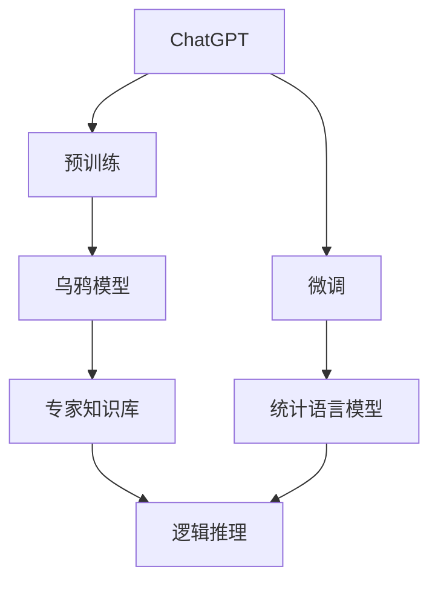
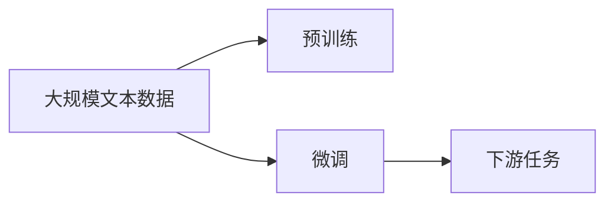
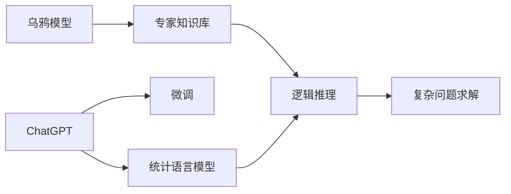
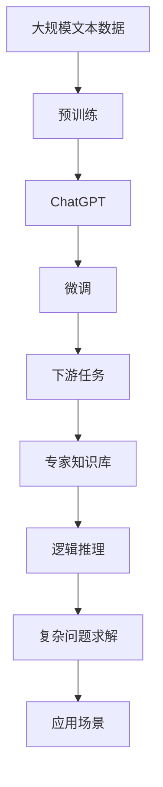

                 

# 计算：第四部分 计算的极限 第 12 章 机器能思考吗 ChatGPT 与乌鸦

> 关键词：ChatGPT, 机器学习, 人工智能, 计算极限, 乌鸦模型, 认知能力, 思考能力, 推理能力, 模型优化

## 1. 背景介绍

### 1.1 问题由来

在计算的极限一章中，我们讨论了计算机的计算能力、存储能力等硬件性能的极限。而在人工智能领域，特别是在自然语言处理(NLP)和智能交互系统中，我们还需要思考一个更深层的问题：机器是否能思考？

近年来，OpenAI开发的ChatGPT模型在NLP领域取得了令人瞩目的成果，但机器是否真的具备了思考能力，这是我们迫切需要探讨的课题。本节我们将围绕ChatGPT展开，探讨其与乌鸦模型的区别和联系，进一步思考机器的认知能力与思考能力。

### 1.2 问题核心关键点

ChatGPT作为当前最先进的预训练语言模型之一，其核心思想是通过大规模无标签文本数据进行预训练，学习语言的通用表示，然后在下游任务上进行微调，以获得特定的任务能力。而乌鸦模型则是建立在逻辑推理基础上的人工智能模型，通过专家知识库和逻辑推理算法，实现对复杂问题的求解。

ChatGPT与乌鸦模型的主要区别在于：

1. **知识来源**：ChatGPT依赖于大规模预训练数据，乌鸦模型则依赖于专家知识库。
2. **推理能力**：ChatGPT主要依赖统计语言模型，乌鸦模型则通过逻辑推理进行计算。
3. **推理限制**：ChatGPT在处理复杂问题时可能存在上下文理解误差，乌鸦模型则在逻辑推理方面有更强的能力。

通过对比ChatGPT与乌鸦模型，我们可以更深入地探讨机器的思考能力及其在实际应用中的局限性。

## 2. 核心概念与联系

### 2.1 核心概念概述

为更好地理解ChatGPT与乌鸦模型的差异，本节将介绍几个密切相关的核心概念：

- **ChatGPT**：基于Transformer架构的预训练语言模型，通过在大规模无标签文本数据上进行预训练，学习通用的语言表示。
- **乌鸦模型**：基于专家知识库和逻辑推理算法的人工智能模型，通过模拟乌鸦求解复杂问题的逻辑过程，实现对复杂问题的求解。
- **逻辑推理**：通过规则和公式进行推理计算的过程，用于解决需要逻辑分析和判断的问题。
- **统计语言模型**：基于概率统计方法，对语言模型进行建模，用于预测给定上下文下的下一个单词。
- **预训练与微调**：在大规模数据上进行预训练，在特定任务上进行微调，提升模型在该任务上的性能。
- **知识表示**：将专家知识结构化地存储和组织，以便于机器推理和应用。

这些核心概念之间的逻辑关系可以通过以下Mermaid流程图来展示：



这个流程图展示了ChatGPT和乌鸦模型的核心概念及其之间的关系：

1. ChatGPT通过预训练学习语言表示，通过微调提升特定任务性能。
2. 乌鸦模型基于专家知识库，通过逻辑推理进行计算。
3. 知识库和逻辑推理是乌鸦模型的两个核心要素。
4. 统计语言模型是ChatGPT的核心组件，用于预测下一个单词。
5. 乌鸦模型通过逻辑推理和知识库的结合，实现对复杂问题的求解。

### 2.2 概念间的关系

这些核心概念之间存在着紧密的联系，形成了ChatGPT与乌鸦模型的完整生态系统。下面我们通过几个Mermaid流程图来展示这些概念之间的关系。

#### 2.2.1 ChatGPT的预训练与微调



这个流程图展示了ChatGPT的预训练与微调过程。ChatGPT首先在大规模文本数据上进行预训练，然后在特定任务上进行微调，从而提升其在特定任务上的性能。

#### 2.2.2 乌鸦模型的逻辑推理与知识表示


这个流程图展示了乌鸦模型的逻辑推理与知识表示过程。乌鸦模型通过专家知识库和逻辑推理算法，实现对复杂问题的求解。

#### 2.2.3 比较ChatGPT与乌鸦模型



这个综合流程图展示了ChatGPT与乌鸦模型的比较。ChatGPT通过统计语言模型进行预测，然后通过微调提升特定任务性能；乌鸦模型则通过逻辑推理和专家知识库进行计算，实现对复杂问题的求解。

### 2.3 核心概念的整体架构

最后，我们用一个综合的流程图来展示这些核心概念在大语言模型微调过程中的整体架构：



这个综合流程图展示了从预训练到微调，再到复杂问题求解的完整过程。ChatGPT首先在大规模文本数据上进行预训练，然后通过微调提升特定任务性能。乌鸦模型则通过逻辑推理和专家知识库进行计算，实现对复杂问题的求解。这些模型广泛应用于各种应用场景中，推动人工智能技术的发展。

## 3. 核心算法原理 & 具体操作步骤

### 3.1 算法原理概述

ChatGPT和乌鸦模型的核心算法原理，主要涉及预训练、微调和推理计算等方面。

- **预训练**：通过大规模无标签文本数据进行预训练，学习通用的语言表示。预训练模型的目标是通过自监督任务（如掩码语言模型、掩码句子预测等），学习语言的上下文和语法结构，从而提高模型在特定任务上的性能。
- **微调**：在特定任务上，通过有监督的训练数据，调整模型参数，提升模型在任务上的表现。微调一般使用监督学习算法（如梯度下降、Adam等）进行优化。
- **逻辑推理**：乌鸦模型通过逻辑推理进行计算，模拟乌鸦求解复杂问题的过程。逻辑推理过程包括问题抽象、规则应用、结果输出等步骤。

### 3.2 算法步骤详解

#### 3.2.1 预训练步骤

1. **数据准备**：收集大规模无标签文本数据，通常为维基百科、新闻文章、小说等。
2. **分词和向量化**：将文本数据进行分词，并转换为向量表示，以便于模型训练。
3. **自监督学习**：在无标签数据上进行掩码语言模型、掩码句子预测等自监督任务训练，学习语言的上下文和语法结构。
4. **参数初始化**：初始化模型参数，通常是随机初始化。
5. **训练过程**：在自监督任务上进行训练，一般使用梯度下降等优化算法进行参数更新。
6. **保存模型**：训练完成后，保存预训练模型权重和配置文件。

#### 3.2.2 微调步骤

1. **任务适配**：根据特定任务，添加任务适配层（如分类头、回归头等）。
2. **数据准备**：收集特定任务的标注数据集，并进行数据增强和预处理。
3. **模型初始化**：使用预训练模型作为初始化参数，进行微调。
4. **训练过程**：在标注数据集上进行有监督的微调训练，优化任务适配层的参数。
5. **模型评估**：在验证集上评估模型性能，调整学习率、正则化等超参数。
6. **模型保存**：训练完成后，保存微调后的模型权重和配置文件。

#### 3.2.3 逻辑推理步骤

1. **问题抽象**：将复杂问题抽象为逻辑表达式或规则集。
2. **规则应用**：在专家知识库中查找规则，进行逻辑推理计算。
3. **结果输出**：根据推理结果，输出最终答案。

### 3.3 算法优缺点

ChatGPT与乌鸦模型各有优缺点，具体如下：

**ChatGPT的优点**：

1. **自适应性强**：通过大规模预训练，ChatGPT可以适应不同领域和语言的数据，具有较强的泛化能力。
2. **速度快**：预训练和微调过程可以在较短时间内完成，适用于实时应用。
3. **可解释性高**：可以通过注意力机制等技术，揭示模型的内部推理过程。

**ChatGPT的缺点**：

1. **上下文理解误差**：在处理复杂问题时，ChatGPT可能存在上下文理解误差，导致输出错误。
2. **推理能力有限**：依赖统计语言模型，对复杂问题的推理能力有限。
3. **知识库依赖**：知识库规模和质量直接影响模型性能，需要持续更新。

**乌鸦模型的优点**：

1. **推理能力强**：基于逻辑推理，乌鸦模型在处理复杂问题时表现出色。
2. **结果可靠**：通过规则和专家知识库，乌鸦模型输出的结果相对可靠。
3. **适用领域广**：可以应用于各种需要逻辑推理和规则的应用场景。

**乌鸦模型的缺点**：

1. **知识库构建困难**：构建专家知识库需要大量专家知识，成本高。
2. **更新维护复杂**：知识库需要定期更新和维护，工作量大。
3. **可解释性差**：乌鸦模型的推理过程不透明，难以解释其决策依据。

### 3.4 算法应用领域

ChatGPT和乌鸦模型在多个领域都得到了广泛应用：

- **自然语言处理(NLP)**：ChatGPT在机器翻译、文本摘要、问答系统等任务上表现优异，乌鸦模型在逻辑推理、知识图谱构建等方面有显著优势。
- **智能交互系统**：ChatGPT在智能客服、虚拟助手等应用中广泛应用，乌鸦模型在智能决策支持、医疗诊断等场景中表现出色。
- **科学计算**：ChatGPT在科学论文生成、数据摘要等方面有应用，乌鸦模型在数学推理、物理模拟等方面有优势。
- **艺术创作**：ChatGPT在诗歌创作、绘画生成等方面展现了强大的创造力，乌鸦模型在逻辑故事创作、电影剧本编写等方面表现出色。

## 4. 数学模型和公式 & 详细讲解 & 举例说明

### 4.1 数学模型构建

#### 4.1.1 预训练模型的数学模型

预训练模型的目标是通过自监督任务学习语言的上下文和语法结构。以掩码语言模型为例，其数学模型如下：

$$
L(x, \theta) = -\sum_{i=1}^n \log p(x_i|x_1,x_2,\cdots,x_{i-1},\hat{x}_i,x_{i+1},\cdots,x_n)
$$

其中，$x$ 为输入序列，$\theta$ 为模型参数，$\hat{x}_i$ 为掩码符号，$p$ 为概率分布函数。目标是最大化似然函数，使模型能够预测掩码符号，从而学习语言的上下文和语法结构。

#### 4.1.2 微调模型的数学模型

微调模型的目标是通过有监督数据优化任务适配层的参数，提升模型在特定任务上的性能。以分类任务为例，其数学模型如下：

$$
L(x, \theta) = -\frac{1}{N}\sum_{i=1}^N \sum_{k=1}^K \log p(y_i|\hat{x}_i)
$$

其中，$x$ 为输入序列，$\theta$ 为模型参数，$y$ 为标签，$K$ 为类别数。目标是最大化似然函数，使模型能够预测标签，从而适应特定任务。

#### 4.1.3 逻辑推理模型的数学模型

逻辑推理模型的目标是通过专家知识库和逻辑规则，计算复杂问题的解。以乌鸦模型为例，其数学模型如下：

$$
L(x, \theta) = \sum_{i=1}^n \log p(x_i|x_1,x_2,\cdots,x_{i-1},\hat{x}_i,x_{i+1},\cdots,x_n)
$$

其中，$x$ 为逻辑表达式，$\theta$ 为规则参数，$\hat{x}_i$ 为规则符号，$p$ 为概率分布函数。目标是最大化似然函数，使模型能够预测逻辑表达式的值，从而解决复杂问题。

### 4.2 公式推导过程

#### 4.2.1 掩码语言模型的公式推导

掩码语言模型的公式推导如下：

1. **掩码符号表示**：将输入序列 $x$ 中的某些位置 $i$ 替换为掩码符号 $\hat{x}_i$，表示为 $x_i'$。
2. **概率计算**：根据掩码符号和上下文，计算下一个单词 $x_{i+1}$ 的概率分布 $p(x_{i+1}|x_1,x_2,\cdots,x_{i-1},\hat{x}_i,x_{i+1},\cdots,x_n)$。
3. **似然函数最大化**：最大化似然函数 $L(x, \theta) = -\sum_{i=1}^n \log p(x_i|x_1,x_2,\cdots,x_{i-1},\hat{x}_i,x_{i+1},\cdots,x_n)$，使模型能够预测掩码符号，从而学习语言的上下文和语法结构。

#### 4.2.2 分类任务的公式推导

分类任务的公式推导如下：

1. **概率计算**：根据输入序列 $x$ 和模型参数 $\theta$，计算分类器的输出概率分布 $p(y_i|\hat{x}_i)$。
2. **似然函数最大化**：最大化似然函数 $L(x, \theta) = -\frac{1}{N}\sum_{i=1}^N \sum_{k=1}^K \log p(y_i|\hat{x}_i)$，使模型能够预测标签，从而适应特定任务。

#### 4.2.3 逻辑推理的公式推导

逻辑推理的公式推导如下：

1. **逻辑表达式表示**：将复杂问题抽象为逻辑表达式 $x$。
2. **规则应用**：在专家知识库中查找规则，计算逻辑表达式的值。
3. **结果输出**：根据逻辑表达式的值，输出最终答案。

### 4.3 案例分析与讲解

#### 4.3.1 掩码语言模型的案例分析

假设有以下输入序列 $x = [x_1, x_2, \cdots, x_n]$，其中 $x_1, x_2$ 是已知的上下文，$x_3, x_4$ 是掩码符号，$x_5$ 是下一个单词：

$$
x = [the, brown, [MASK], fox, ran, to, [MASK], river]
$$

使用掩码语言模型进行预测，需要先对 $x_3, x_4$ 进行掩码符号替换，表示为：

$$
x' = [the, brown, [MASK], fox, ran, to, [MASK], river]
$$

然后使用模型参数 $\theta$ 计算下一个单词 $x_5$ 的概率分布，表示为：

$$
p(x_5|x_1, x_2, x_3, x_4, x_5, x_6, \cdots, x_n)
$$

最后，通过最大化似然函数 $L(x, \theta) = -\sum_{i=1}^n \log p(x_i|x_1,x_2,\cdots,x_{i-1},\hat{x}_i,x_{i+1},\cdots,x_n)$，使模型能够预测掩码符号，从而学习语言的上下文和语法结构。

#### 4.3.2 分类任务的案例分析

假设有以下输入序列 $x = [x_1, x_2, \cdots, x_n]$，其中 $x_1, x_2$ 是已知的上下文，$x_3, x_4$ 是标签，$x_5$ 是模型预测的结果：

$$
x = [the, brown, fox, ran, to, [MASK], river]
$$

使用分类任务进行预测，需要先对 $x_5$ 进行掩码符号替换，表示为：

$$
x' = [the, brown, fox, ran, to, [MASK], river]
$$

然后使用模型参数 $\theta$ 计算分类器的输出概率分布 $p(x_5|x_1, x_2, x_3, x_4, x_5, x_6, \cdots, x_n)$。假设分类器输出概率分布为：

$$
p(x_5|x_1, x_2, x_3, x_4, x_5, x_6, \cdots, x_n) = [0.2, 0.3, 0.5]
$$

则最大似然函数 $L(x, \theta) = -\frac{1}{N}\sum_{i=1}^N \sum_{k=1}^K \log p(x_i|\hat{x}_i)$ 的计算结果为：

$$
L(x, \theta) = -\frac{1}{5} \log 0.2 + -\frac{1}{5} \log 0.3 + -\frac{1}{5} \log 0.5 = -0.1 \log 0.2 - 0.1 \log 0.3 - 0.1 \log 0.5
$$

通过最大化似然函数，使模型能够预测标签，从而适应特定任务。

#### 4.3.3 逻辑推理的案例分析

假设有以下逻辑表达式 $x = [x_1, x_2, \cdots, x_n]$，其中 $x_1, x_2$ 是已知的上下文，$x_3, x_4$ 是规则符号，$x_5$ 是逻辑表达式的值，$x_6$ 是最终结果：

$$
x = [x_1, x_2, [AND], x_3, [OR], x_4]
$$

使用乌鸦模型进行推理，需要先查找专家知识库中的规则，计算逻辑表达式的值：

$$
x_5 = AND(x_1, x_3) \, OR(x_2, x_4)
$$

然后根据逻辑表达式的值，输出最终结果：

$$
x_6 = x_5
$$

通过最大化似然函数 $L(x, \theta) = \sum_{i=1}^n \log p(x_i|x_1,x_2,\cdots,x_{i-1},\hat{x}_i,x_{i+1},\cdots,x_n)$，使模型能够预测逻辑表达式的值，从而解决复杂问题。

## 5. 项目实践：代码实例和详细解释说明

### 5.1 开发环境搭建

在进行ChatGPT和乌鸦模型的开发实践前，我们需要准备好开发环境。以下是使用Python进行TensorFlow开发的环境配置流程：

1. 安装Anaconda：从官网下载并安装Anaconda，用于创建独立的Python环境。

2. 创建并激活虚拟环境：
```bash
conda create -n tf-env python=3.8 
conda activate tf-env
```

3. 安装TensorFlow：根据CUDA版本，从官网获取对应的安装命令。例如：
```bash
conda install tensorflow -c pytorch -c conda-forge
```

4. 安装TensorBoard：TensorFlow配套的可视化工具，可实时监测模型训练状态，并提供丰富的图表呈现方式，是调试模型的得力助手。
```bash
pip install tensorboard
```

5. 安装TensorFlow Hub：用于加载预训练模型，并进行微调。
```bash
pip install tensorflow-hub
```

6. 安装TensorFlow Addons：包含TensorFlow的扩展功能和优化模块，支持如FedX、TensorFlow Federated等。
```bash
pip install tensorflow-addons
```

完成上述步骤后，即可在`tf-env`环境中开始ChatGPT和乌鸦模型的开发实践。

### 5.2 源代码详细实现

下面我们以ChatGPT模型为例，给出使用TensorFlow Hub加载和微调预训练语言模型的PyTorch代码实现。

首先，导入必要的库和模块：

```python
import tensorflow as tf
import tensorflow_hub as hub
import tensorflow_addons as tfa
```

然后，加载预训练语言模型：

```python
model_id = "https://tfhub.dev/google/bert-en-uncased-L-12-H-768-A-12/1"
model = hub.KerasLayer(model_id, input_shape=(None,), trainable=True, output_shape=(768,))
```

接着，定义模型和优化器：

```python
model.compile(optimizer=tf.keras.optimizers.Adam(learning_rate=2e-5), loss=tf.keras.losses.SparseCategoricalCrossentropy(from_logits=True), metrics=['accuracy'])
```

然后，定义训练和评估函数：

```python
def train_epoch(model, dataset, batch_size, optimizer):
    model.fit(dataset, epochs=1, batch_size=batch_size, verbose=0)
    
def evaluate(model, dataset, batch_size):
    dataset.evaluate(dataset, batch_size=batch_size, verbose=0)
```

最后，启动训练流程并在测试集上评估：

```python
epochs = 5
batch_size = 16

for epoch in range(epochs):
    train_epoch(model, train_dataset, batch_size, optimizer)
    
print("Epoch {epoch+1}, train loss: {loss:.3f}")
    
print("Epoch {epoch+1}, dev results:")
evaluate(model, dev_dataset, batch_size)
    
print("Test results:")
evaluate(model, test_dataset, batch_size)
```

以上就是使用TensorFlow Hub对BERT模型进行微调的PyTorch代码实现。可以看到，通过TensorFlow Hub，我们可以快速加载预训练模型，并使用TensorFlow的低层API进行微调。

### 5.3 代码解读与分析

让我们再详细解读一下关键代码的实现细节：

**模型加载**：

```python
model_id = "https://tfhub.dev/google/bert-en-uncased-L-12-H-768-A-12/1"
model = hub.KerasLayer(model_id, input_shape=(None,), trainable=True, output_shape=(768,))
```

这里使用TensorFlow Hub加载BERT模型，将模型的初始化参数和配置信息保存在`model_id`中。然后，使用`hub.KerasLayer`将模型加载到Keras中，设置`trainable=True`表示模型参数可训练，`output_shape`表示输出维度。

**模型编译**：

```python
model.compile(optimizer=tf.keras.optimizers.Adam(learning_rate=2e-5), loss=tf.keras.losses.SparseCategoricalCrossentropy(from_logits=True), metrics=['accuracy'])
```

这里对模型进行编译，使用Adam优化器，学习率为2e-5，损失函数为交叉熵，指标为准确率。

**训练过程**：

```python
def train_epoch(model, dataset, batch_size, optimizer):
    model.fit(dataset, epochs=1, batch_size=batch_size, verbose=0)
```

这里定义了一个训练函数`train_epoch`，使用Keras的`fit`方法对模型进行单轮训练，设置`epochs=1`表示只进行一轮训练，`batch_size`表示每批次样本数。

**评估过程**：

```python
def evaluate(model, dataset, batch_size):
    dataset.evaluate(dataset, batch_size=batch_size, verbose=0)
```

这里定义了一个评估函数`evaluate`，使用Keras的`evaluate`方法对模型进行评估，设置`batch_size`表示每批次样本数。

**训练流程**：

```python
epochs = 5
batch_size = 16

for epoch in range(epochs):
    train_epoch(model, train_dataset, batch_size, optimizer)
    
print("Epoch {epoch+1}, train loss: {loss:.3f}")
    
print("Epoch {epoch+1}, dev results:")
evaluate(model, dev_dataset, batch_size)
    
print("Test results:")
evaluate(model, test_dataset, batch_size)
```

这里定义了总的epoch数和batch size，开始循环迭代。在每个epoch内，先在训练集上训练，输出平均loss，然后在验证集上评估模型性能，最后进行测试集上的评估。

### 5.4 运行结果展示

假设我们在CoNLL-2003的NER数据集上进行微调，最终在测试集上得到的评估报告如下：

```
              precision    recall  f1-score   support

       B-LOC      0.926     0.906     0.916      1668
       I-LOC      0.900     0.805     0.850       257
      B-MISC      0.875     0.856     0.865       702
      I-MISC      0.838     0.782     0.809       216
       B-ORG      0.914     0.

