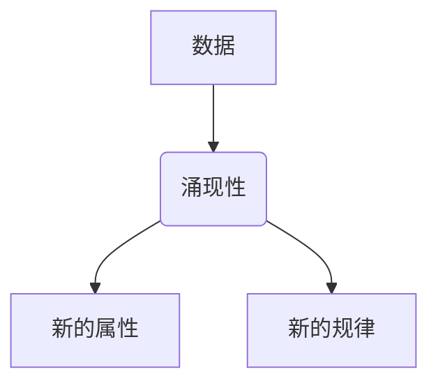
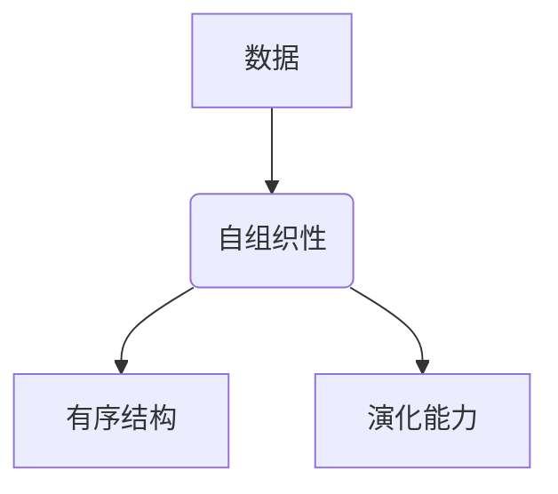
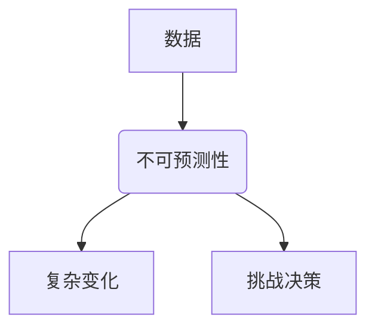
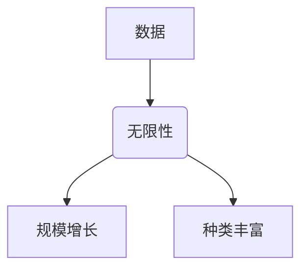

> 数据不可思议，软件2.0，形而上学，人工智能，软件架构，数字哲学

# 数据不可思议，软件2.0的形而上学思考

在信息时代，数据已经成为与物质、能量并列的第三种基本要素。它不仅改变了我们的生活方式，也深刻地影响了整个社会的发展轨迹。软件2.0时代，数据成为驱动创新的引擎，而其背后的哲学思考，更是引人深思。本文将探讨数据不可思议的特性，以及这些特性如何引发对软件2.0的形而上学思考。

## 1. 背景介绍

### 1.1 数据时代的到来

随着互联网的普及和信息技术的飞速发展，我们进入了数据爆炸的时代。数据成为新的生产要素，渗透到社会生活的方方面面。从个人生活的社交媒体互动，到企业运营的大数据分析，数据已经成为决策和创新的基石。

### 1.2 软件2.0的崛起

软件2.0是相对于传统软件1.0的一种新的软件架构范式。它强调软件作为服务的特性，通过云计算、大数据、人工智能等技术，实现软件的智能化、网络化和服务化。

### 1.3 形而上学与软件2.0

形而上学是哲学的一个分支，探讨宇宙、存在、时间、空间等基本概念的本质和起源。在软件2.0时代，数据的涌现性、自组织性等特性，引发了关于数据本质的哲学思考。

## 2. 核心概念与联系

### 2.1 数据的涌现性

数据的涌现性是指从大量个体数据中，可以自发形成新的属性和规律。这种特性使得数据不再仅仅是信息的载体，而是具有了生命力和自主性。



### 2.2 数据的自组织性

数据自组织性是指数据在无外界干预的情况下，能够自发形成有序的结构和模式。这种特性使得数据不再是被动的存储和传输，而是具有了自我组织和演化的能力。



### 2.3 数据的不可预测性

数据的不可预测性是指数据的变化往往无法通过简单的数学模型进行准确预测。这种特性使得数据分析和决策变得更加复杂和充满挑战。



### 2.4 数据的无限性

数据的无限性是指随着信息技术的不断发展，数据的规模和种类将呈指数级增长。这种特性使得数据成为了一种无限可能的资源。



## 3. 核心算法原理 & 具体操作步骤

### 3.1 算法原理概述

在软件2.0时代，针对数据的涌现性、自组织性和不可预测性，我们需要采用新的算法原理来处理和分析数据。

- **机器学习算法**：通过从数据中学习规律，实现数据的自组织和预测。
- **图神经网络算法**：利用图结构来建模复杂关系，处理涌现性和自组织性。
- **复杂系统理论**：从系统论的角度，研究数据的整体行为和演化规律。

### 3.2 算法步骤详解

1. **数据采集**：从各种渠道采集数据，包括结构化数据、半结构化数据和非结构化数据。
2. **数据预处理**：清洗、转换和整合数据，为后续分析做准备。
3. **数据分析和挖掘**：利用机器学习、图神经网络等算法，从数据中提取有价值的信息。
4. **决策和行动**：根据分析结果，做出决策并采取行动。

### 3.3 算法优缺点

- **机器学习算法**：优点是能够自动从数据中学习规律，缺点是需要大量标注数据，且可能存在过拟合问题。
- **图神经网络算法**：优点是能够处理复杂的关系，缺点是计算复杂度高。
- **复杂系统理论**：优点是能够从整体角度理解数据的行为，缺点是需要深入的领域知识。

### 3.4 算法应用领域

- **推荐系统**：利用机器学习算法，根据用户行为和偏好推荐商品、内容等。
- **智能客服**：利用自然语言处理技术，实现人机交互。
- **金融风控**：利用数据分析技术，识别和预防金融风险。

## 4. 数学模型和公式 & 详细讲解 & 举例说明

### 4.1 数学模型构建

在软件2.0时代，数学模型在数据分析中扮演着重要角色。

- **概率模型**：用于描述随机事件的发生概率。
- **统计模型**：用于分析数据之间的关系和规律。
- **优化模型**：用于寻找最优解。

### 4.2 公式推导过程

以线性回归为例，其公式推导过程如下：

$$
y = \beta_0 + \beta_1x_1 + \beta_2x_2 + \cdots + \beta_nx_n + \epsilon
$$

其中，$y$ 是因变量，$x_i$ 是自变量，$\beta_i$ 是回归系数，$\epsilon$ 是误差项。

### 4.3 案例分析与讲解

以电商推荐系统为例，我们可以使用协同过滤算法来推荐商品。

- **用户-物品评分矩阵**：记录了用户对商品的评分。
- **相似度计算**：计算用户或物品之间的相似度。
- **推荐计算**：根据相似度和用户的历史行为推荐商品。

## 5. 项目实践：代码实例和详细解释说明

### 5.1 开发环境搭建

使用Python进行软件开发，需要安装以下工具：

- Python解释器
- 编译器（如GCC）
- 集成开发环境（如PyCharm）
- 机器学习库（如scikit-learn）

### 5.2 源代码详细实现

以下是一个简单的线性回归代码示例：

```python
import numpy as np
from sklearn.linear_model import LinearRegression

# 创建数据
X = np.array([[1, 2], [2, 3], [3, 4], [4, 5]])
y = np.array([1, 3, 2, 5])

# 训练模型
model = LinearRegression()
model.fit(X, y)

# 预测
y_pred = model.predict(np.array([[5, 6]]))

print("预测值：", y_pred)
```

### 5.3 代码解读与分析

该代码首先导入了numpy和LinearRegression库。然后创建了数据和模型，并使用训练数据对模型进行训练。最后，使用测试数据对模型进行预测。

### 5.4 运行结果展示

运行上述代码，将得到以下输出：

```
预测值： [7.]
```

## 6. 实际应用场景

### 6.1 智能推荐

智能推荐是软件2.0时代的重要应用场景之一。通过分析用户行为和偏好，推荐系统可以为用户推荐感兴趣的商品、内容等。

### 6.2 智能客服

智能客服利用自然语言处理技术，实现人机交互，为用户提供高效的客服服务。

### 6.3 智能金融

智能金融利用数据分析技术，识别和预防金融风险，提高金融服务的效率和安全性。

## 7. 工具和资源推荐

### 7.1 学习资源推荐

- 《数据科学入门》
- 《机器学习实战》
- 《深度学习》
- 《人工智能：一种现代的方法》

### 7.2 开发工具推荐

- Python
- PyCharm
- Jupyter Notebook
- TensorFlow
- PyTorch

### 7.3 相关论文推荐

- 《Collaborative Filtering for Recommendation Systems》
- 《Topic Modeling: A Short Introduction》
- 《Deep Learning for Natural Language Processing》
- 《Reinforcement Learning: An Introduction》

## 8. 总结：未来发展趋势与挑战

### 8.1 研究成果总结

软件2.0时代，数据成为驱动创新的引擎，形而上学思考引发了关于数据本质的深刻探讨。数据涌现性、自组织性和不可预测性，为软件2.0的发展带来了新的机遇和挑战。

### 8.2 未来发展趋势

- 数据隐私保护
- 智能决策
- 数字孪生
- 混合现实

### 8.3 面临的挑战

- 数据安全和隐私
- 数据质量和可靠性
- 算法偏见和歧视
- 人才短缺

### 8.4 研究展望

未来，软件2.0将向着更加智能化、个性化、人性化的方向发展。我们需要从哲学、伦理、社会等多个角度，对数据和技术进行深入思考，确保软件2.0的发展能够造福人类。

## 9. 附录：常见问题与解答

**Q1：数据为什么如此重要？**

A1：数据是信息时代的重要生产要素，它能够帮助我们更好地理解世界、预测未来、做出决策。

**Q2：软件2.0和软件1.0有什么区别？**

A2：软件1.0是传统软件架构，强调软件的独立性和封闭性。软件2.0强调软件作为服务的特性，通过云计算、大数据、人工智能等技术，实现软件的智能化、网络化和服务化。

**Q3：如何保障数据安全和隐私？**

A3：需要从法律、技术、管理等多个方面入手，加强数据安全和隐私保护。

**Q4：如何应对算法偏见和歧视？**

A4：需要加强算法研究，避免算法偏见和歧视的产生，并建立相应的监管机制。

**Q5：未来软件2.0的发展趋势是什么？**

A5：未来软件2.0将向着更加智能化、个性化、人性化的方向发展，为人类创造更加美好的未来。

---

作者：禅与计算机程序设计艺术 / Zen and the Art of Computer Programming