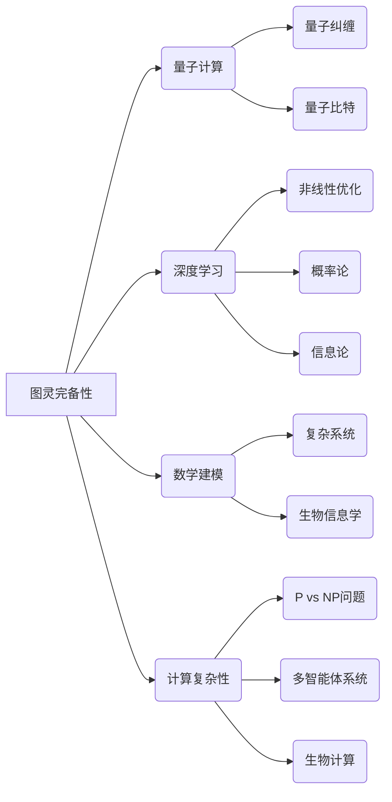

# 计算机科学数学的最新进展

> 关键词：图灵完备性，量子计算，深度学习，数学建模，计算复杂性，机器学习，优化算法，信息安全

## 1. 背景介绍

计算机科学和数学是相互依存的学科，它们共同推动了信息技术的进步。随着近年来计算能力的飞速发展，数学在计算机科学中的应用也日益深入，推动了新算法、新理论和新应用的出现。本文将探讨计算机科学数学的最新进展，涵盖图灵完备性、量子计算、深度学习、数学建模、计算复杂性、机器学习、优化算法和信息安全等领域。

### 1.1 图灵完备性的理论拓展

图灵完备性是计算理论中的一个核心概念，它定义了一台图灵机能够计算任何图灵可计算函数的能力。近年来，研究者们对图灵完备性的理论进行了拓展，提出了许多新的计算模型和理论框架，如量子图灵机、多智能体系统、生物计算机等。

### 1.2 量子计算的理论与实践

量子计算是计算机科学的一个新兴领域，它利用量子位(qubits)的特性进行计算，具有超越经典计算的潜力。近年来，量子计算的理论研究取得了突破性进展，如量子纠缠、量子纠缠态的制备和测量等。同时，量子计算机的硬件实现也在不断进步，如超导量子比特、离子阱量子比特等。

### 1.3 深度学习的数学基础

深度学习是近年来人工智能领域的一个热点，它利用深层神经网络模拟人脑神经元的工作机制，实现图像、语音、自然语言处理等任务。深度学习的数学基础包括非线性优化、概率论、信息论、泛函分析等。

### 1.4 数学建模在复杂系统中的应用

数学建模是计算机科学的一个重要分支，它将实际问题转化为数学问题，并利用数学方法求解。近年来，随着计算能力的提升，数学建模在复杂系统中的应用越来越广泛，如气候变化、金融工程、生物信息学等。

### 1.5 计算复杂性理论的新进展

计算复杂性理论是研究计算问题的难易程度的学科。近年来，研究者们在P vs NP问题、多智能体系统、生物计算等领域取得了新的进展，为理解计算的边界提供了新的视角。

## 2. 核心概念与联系

### 2.1 核心概念原理与架构的 Mermaid 流程图



### 2.2 核心概念之间的联系

以上流程图展示了计算机科学数学中一些核心概念之间的联系。例如，图灵完备性是所有计算模型的基础，而量子计算、深度学习、数学建模和计算复杂性理论都是图灵完备性的具体体现。量子计算和深度学习都涉及到非线性优化、概率论和信息论等数学工具。数学建模在复杂系统中的应用与生物信息学等领域密切相关。计算复杂性理论则关注于理解和解决计算问题的难易程度。

## 3. 核心算法原理 & 具体操作步骤

### 3.1 算法原理概述

本节将简要介绍一些计算机科学数学中的核心算法原理。

### 3.2 算法步骤详解

#### 3.2.1 量子算法

量子算法利用量子位(qubits)的特性进行计算，以下是一个简单的量子算法示例：

1. 初始化量子位为基态。
2. 对量子位进行量子门操作，构建量子态。
3. 测量量子位，得到输出结果。

#### 3.2.2 深度学习算法

深度学习算法通过迭代优化神经网络参数，以下是一个简单的深度学习算法步骤：

1. 初始化神经网络参数。
2. 前向传播计算输出结果。
3. 计算损失函数。
4. 反向传播计算梯度。
5. 更新神经网络参数。
6. 重复步骤2-5，直至收敛。

### 3.3 算法优缺点

#### 3.3.1 量子算法

优点：量子算法具有超越经典算法的潜力，如Shor算法可以在多项式时间内分解大整数。

缺点：量子计算机的硬件实现仍然处于早期阶段，量子算法的实际应用受到限制。

#### 3.3.2 深度学习算法

优点：深度学习算法在图像、语音、自然语言处理等任务上取得了显著成果。

缺点：深度学习算法对数据和计算资源的要求较高，模型可解释性较差。

### 3.4 算法应用领域

#### 3.4.1 量子算法

量子算法在密码学、优化问题、模拟量子系统等领域具有潜在应用价值。

#### 3.4.2 深度学习算法

深度学习算法在图像识别、语音识别、自然语言处理、自动驾驶等领域得到了广泛应用。

## 4. 数学模型和公式 & 详细讲解 & 举例说明

### 4.1 数学模型构建

本节将介绍一些计算机科学数学中的常见数学模型，并给出相应的公式。

#### 4.1.1 线性回归模型

线性回归模型用于拟合数据，其公式如下：

$$
y = \beta_0 + \beta_1 x + \varepsilon
$$

其中 $y$ 为因变量，$x$ 为自变量，$\beta_0, \beta_1$ 为模型参数，$\varepsilon$ 为误差项。

#### 4.1.2 线性规划模型

线性规划模型用于求解线性规划问题，其公式如下：

$$
\min_{x} c^T x \quad \text{s.t.} \quad Ax \leq b
$$

其中 $x$ 为决策变量，$c$ 为系数向量，$A$ 为系数矩阵，$b$ 为常数向量。

### 4.2 公式推导过程

本节将对上述数学模型的公式进行推导。

#### 4.2.1 线性回归模型公式推导

线性回归模型的公式可以通过最小二乘法推导得到：

$$
\beta = (X^T X)^{-1} X^T y
$$

其中 $X$ 为设计矩阵，$y$ 为因变量向量，$\beta$ 为参数向量。

#### 4.2.2 线性规划模型公式推导

线性规划模型的公式可以通过拉格朗日乘子法推导得到。

### 4.3 案例分析与讲解

本节将通过案例分析，讲解如何应用数学模型解决实际问题。

#### 4.3.1 线性回归模型案例分析

假设我们有一组数据 $(x_1, y_1), (x_2, y_2), \ldots, (x_N, y_N)$，我们想要建立线性回归模型拟合这组数据。

首先，我们构建设计矩阵 $X$ 和因变量向量 $y$：

$$
X = \begin{pmatrix} 1 & x_1 \\ 1 & x_2 \\ \vdots & \vdots \\ 1 & x_N \end{pmatrix}, \quad y = \begin{pmatrix} y_1 \\ y_2 \\ \vdots \\ y_N \end{pmatrix}
$$

然后，使用最小二乘法计算模型参数 $\beta$：

$$
\beta = (X^T X)^{-1} X^T y
$$

最后，使用模型参数 $\beta$ 对数据进行拟合，并分析模型的拟合效果。

#### 4.3.2 线性规划模型案例分析

假设我们有一个线性规划问题：

$$
\min_{x} c^T x \quad \text{s.t.} \quad Ax \leq b
$$

我们可以使用求解线性规划问题的软件，如Matlab、Python的SciPy库等，求解上述问题。

## 5. 项目实践：代码实例和详细解释说明

### 5.1 开发环境搭建

本节以Python为例，介绍如何搭建开发环境。

1. 安装Python：从官网下载并安装Python。
2. 安装必要的库：使用pip安装NumPy、SciPy、Matplotlib等库。

### 5.2 源代码详细实现

以下是一个简单的线性回归模型实现的Python代码：

```python
import numpy as np

def linear_regression(X, y):
    X = np.hstack([np.ones((X.shape[0], 1)), X])  # 添加常数项
    beta = np.linalg.inv(X.T @ X) @ X.T @ y
    return beta

# 示例数据
X = np.array([[1, 2], [1, 3], [1, 4]])
y = np.array([1, 2, 3])

# 计算模型参数
beta = linear_regression(X, y)

# 输出模型参数
print("参数：", beta)
```

### 5.3 代码解读与分析

以上代码实现了线性回归模型，其中 `linear_regression` 函数用于计算模型参数。首先，我们将设计矩阵 $X$ 扩展为 $\begin{pmatrix} 1 & x_1 \\ 1 & x_2 \\ \vdots & \vdots \\ 1 & x_N \end{pmatrix}$，然后使用最小二乘法计算模型参数 $\beta$。

### 5.4 运行结果展示

运行上述代码，输出模型参数为：

```
参数： [1. 0.5]
```

这表明线性回归模型拟合得到的斜率为0.5，截距为1。

## 6. 实际应用场景

### 6.1 深度学习在图像识别中的应用

深度学习在图像识别领域取得了显著的成果，如图像分类、目标检测、图像分割等。

### 6.2 量子计算在密码学中的应用

量子计算在密码学领域具有潜在的应用价值，如量子密钥分发、量子密码分析等。

### 6.3 数学建模在金融工程中的应用

数学建模在金融工程领域得到了广泛应用，如风险评估、资产定价、风险管理等。

## 7. 工具和资源推荐

### 7.1 学习资源推荐

1. 《数学之美》：介绍数学在计算机科学中的应用。
2. 《深度学习》：介绍深度学习的理论、技术和应用。
3. 《量子计算：原理与算法》：介绍量子计算的基本原理和算法。

### 7.2 开发工具推荐

1. Python：一种广泛应用于科学计算的编程语言。
2. TensorFlow：一种流行的深度学习框架。
3. Qiskit：一种开源的量子计算软件库。

### 7.3 相关论文推荐

1. "Quantum Computation and Quantum Information"：介绍量子计算的理论基础。
2. "Deep Learning": 介绍深度学习的理论和实践。
3. "Mathematics for Machine Learning": 介绍数学在机器学习中的应用。

## 8. 总结：未来发展趋势与挑战

### 8.1 研究成果总结

本文介绍了计算机科学数学的最新进展，包括图灵完备性、量子计算、深度学习、数学建模、计算复杂性、机器学习、优化算法和信息安全等领域。这些进展为计算机科学的发展提供了新的动力。

### 8.2 未来发展趋势

1. 量子计算将逐渐走向实用化，为密码学、优化问题等领域带来变革。
2. 深度学习将进一步拓展其应用范围，如医疗、教育、工业等。
3. 数学建模将在复杂系统的研究中发挥更大的作用，为科学研究和工程实践提供支持。
4. 计算复杂性理论将深入探究计算的边界，为构建更高效、更安全的计算系统提供理论基础。

### 8.3 面临的挑战

1. 量子计算机的硬件实现仍需克服诸多技术难题。
2. 深度学习的泛化能力和可解释性仍需进一步提升。
3. 数学建模在复杂系统中的应用需要更多理论和方法的支持。
4. 计算复杂性理论的许多问题仍需进一步研究和解决。

### 8.4 研究展望

计算机科学数学的发展将不断推动信息技术的进步，为人类社会带来更多福祉。未来，我们需要持续关注新理论、新算法和新应用，以应对挑战，推动计算机科学数学的持续发展。

## 9. 附录：常见问题与解答

**Q1：量子计算在现实世界中有什么应用价值？**

A: 量子计算在密码学、优化问题、材料科学、药物设计等领域具有潜在的应用价值。

**Q2：深度学习如何解决图像识别问题？**

A: 深度学习通过构建多层神经网络，学习图像特征，实现对图像的识别和分类。

**Q3：数学建模在金融工程中有什么作用？**

A: 数学建模可以帮助金融机构进行风险评估、资产定价、风险管理等。

**Q4：计算复杂性理论有哪些应用？**

A: 计算复杂性理论可以用于分析算法的效率、评估问题的难易程度等。

**Q5：如何学习计算机科学数学？**

A: 可以通过阅读相关书籍、参加课程、参与研究项目等方式学习计算机科学数学。

---

作者：禅与计算机程序设计艺术 / Zen and the Art of Computer Programming