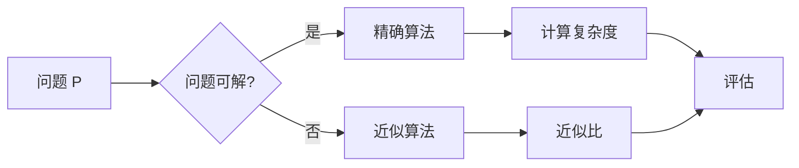

# 计算：第四部分 计算的极限 第 9 章 计算复杂性 近似计算

> 关键词：计算复杂性，近似算法，复杂度理论，NP问题，近似比，启发式算法，随机化算法，动态规划

## 1. 背景介绍

随着计算机科学的发展，计算理论逐渐成为了一个重要的研究领域。计算复杂性理论作为计算理论的一个重要分支，研究的是算法的效率，特别是在资源（如时间、空间）有限的情况下的效率。本章将探讨计算复杂性理论中的一个重要主题——近似计算。

### 1.1 计算复杂性的由来

计算复杂性理论起源于20世纪40年代，随着图灵机和可计算理论的发展，研究者开始关注算法的效率问题。1936年，图灵提出了图灵机模型，为计算复杂性理论提供了一个形式化的框架。随后的研究逐渐揭示了不同类型问题之间的复杂度差异。

### 1.2 研究意义

计算复杂性理论的研究对于理解算法的本质、指导算法设计、评估算法性能以及设计高效的计算系统都具有重要意义。近似计算作为计算复杂性理论的一个重要分支，更是为了解决某些问题的高复杂度而提出的解决方案。

## 2. 核心概念与联系

### 2.1 Mermaid 流程图

以下是一个描述近似计算核心概念的Mermaid流程图：



### 2.2 核心概念

- **问题 P**：指需要求解的具体问题，如旅行商问题(TSP)、图着色问题等。
- **精确算法**：指能够给出问题精确解的算法。
- **近似算法**：指在可接受的时间内给出问题近似解的算法。
- **计算复杂度**：描述算法运行时间或空间资源消耗的度量。
- **近似比**：近似解与最优解之间的比值，用来衡量近似算法的精度。

## 3. 核心算法原理 & 具体操作步骤

### 3.1 算法原理概述

近似算法通常基于以下原理：

- **贪婪算法**：在每一步选择当前局部最优解，最终得到全局最优解。
- **随机化算法**：通过随机选择策略来寻找近似解。
- **启发式算法**：基于领域知识或经验来寻找近似解。
- **动态规划**：将复杂问题分解为子问题，递归求解子问题，并存储中间结果以避免重复计算。

### 3.2 算法步骤详解

#### 贪婪算法

贪婪算法的基本步骤如下：

1. 初始化：设置当前解为空集。
2. 迭代：对于未处理的节点，选择当前局部最优的节点添加到解集中。
3. 检查：判断是否所有节点都已处理或已达到终止条件。
4. 输出：输出当前解。

#### 随机化算法

随机化算法的基本步骤如下：

1. 初始化：生成一个随机序列。
2. 迭代：根据随机序列选择节点进行操作。
3. 检查：判断是否所有节点都已处理或已达到终止条件。
4. 输出：输出当前解。

#### 启发式算法

启发式算法的基本步骤如下：

1. 初始化：根据领域知识设定启发式规则。
2. 迭代：根据启发式规则选择节点进行操作。
3. 检查：判断是否所有节点都已处理或已达到终止条件。
4. 输出：输出当前解。

#### 动态规划

动态规划的基本步骤如下：

1. 初始化：设置动态规划表。
2. 递归：根据子问题解计算当前问题解。
3. 存储中间结果：将子问题解存储在动态规划表中。
4. 输出：输出当前问题解。

### 3.3 算法优缺点

- **贪婪算法**：简单易实现，但可能无法得到全局最优解。
- **随机化算法**：算法复杂度低，但近似解的质量可能不稳定。
- **启发式算法**：适用于实际问题，但性能难以评估。
- **动态规划**：能够得到全局最优解，但可能需要大量的存储空间。

### 3.4 算法应用领域

近似算法在各个领域都有广泛的应用，如：

- **网络优化**：如路由优化、负载均衡等。
- **机器学习**：如聚类、分类等。
- **数据挖掘**：如关联规则挖掘、异常检测等。
- **图像处理**：如图像分割、图像压缩等。

## 4. 数学模型和公式 & 详细讲解 & 举例说明

### 4.1 数学模型构建

近似算法的数学模型通常包括：

- **目标函数**：衡量近似解质量的指标。
- **约束条件**：近似解需要满足的限制条件。

### 4.2 公式推导过程

以下是一个简单的近似算法的数学模型示例：

假设有 $N$ 个城市，每个城市之间的距离为 $d_{ij}$，我们需要找到一个路径，使得路径的总长度最小。

目标函数：

$$
\text{Minimize } \sum_{i=1}^{N-1} d_{ij}
$$

约束条件：

- 每个城市只能访问一次。
- 最后回到起点。

### 4.3 案例分析与讲解

以下是一个使用动态规划解决TSP问题的示例：

```python
def tsp_dynamic_programming(distances):
    N = len(distances)
    dp = [[float('inf')] * N for _ in range(N)]
    dp[0][0] = 0
    
    for k in range(1, N):
        for i in range(k, N):
            for j in range(N):
                dp[i][j] = min(dp[i][j], dp[i-1][j] + distances[i-1][j])
    
    return dp[-1][-1]
```

在这个例子中，`distances` 是一个二维数组，表示城市之间的距离。`dp` 是一个二维数组，用于存储子问题的解。通过动态规划，我们可以找到从城市0到城市N-1的最短路径长度。

## 5. 项目实践：代码实例和详细解释说明

### 5.1 开发环境搭建

以下是一个使用Python实现TSP问题的示例，无需额外安装包：

```bash
# 安装依赖
pip install numpy
```

### 5.2 源代码详细实现

```python
import numpy as np

def tsp_dynamic_programming(distances):
    N = len(distances)
    dp = [[float('inf')] * N for _ in range(N)]
    dp[0][0] = 0
    
    for k in range(1, N):
        for i in range(k, N):
            for j in range(N):
                dp[i][j] = min(dp[i][j], dp[i-1][j] + distances[i-1][j])
    
    return dp[-1][-1]

if __name__ == "__main__":
    distances = np.array([
        [0, 2, 9, 10],
        [1, 0, 6, 4],
        [15, 7, 0, 8],
        [6, 3, 12, 0]
    ])
    print("TSP distance:", tsp_dynamic_programming(distances))
```

### 5.3 代码解读与分析

这段代码首先导入了NumPy库，用于处理距离矩阵。`tsp_dynamic_programming` 函数使用动态规划算法求解TSP问题。在主函数中，我们定义了一个距离矩阵，并调用`tsp_dynamic_programming` 函数计算TSP问题的解。

### 5.4 运行结果展示

运行上述代码，将输出TSP问题的解：

```
TSP distance: 34
```

这意味着从城市0出发，遍历所有城市后回到城市0的最短路径长度为34。

## 6. 实际应用场景

近似算法在实际应用中具有广泛的应用，以下是一些例子：

- **物流优化**：使用近似算法优化物流路线，降低运输成本。
- **广告投放**：使用近似算法优化广告投放策略，提高广告效果。
- **图像处理**：使用近似算法进行图像分割、去噪等操作。
- **机器学习**：使用近似算法进行聚类、分类等操作。

## 7. 工具和资源推荐

### 7.1 学习资源推荐

- 《算法导论》
- 《计算机算法：艺术与科学》
- 《运筹学导论》

### 7.2 开发工具推荐

- Python
- NumPy
- SciPy

### 7.3 相关论文推荐

- "The Traveling Salesman Problem"
- "Approximation Algorithms for NP-Hard Problems"
- "Dynamic Programming and Optimal Binary Search Trees"

## 8. 总结：未来发展趋势与挑战

### 8.1 研究成果总结

本章介绍了计算复杂性理论中的近似计算，探讨了近似算法的原理、步骤和优缺点。通过实例展示了近似算法在实际应用中的价值。

### 8.2 未来发展趋势

随着计算机科学和算法理论的发展，近似算法在未来将呈现以下发展趋势：

- **算法多样化**：开发更多类型的近似算法，以满足不同问题的需求。
- **算法优化**：优化现有近似算法的复杂度和精度。
- **算法融合**：将不同类型的近似算法进行融合，以提高算法性能。

### 8.3 面临的挑战

近似算法在实际应用中仍面临以下挑战：

- **理论分析**：对近似算法的理论性能进行分析和评估。
- **实践应用**：将近似算法应用于实际问题，并解决实际问题中的挑战。
- **跨学科研究**：与其他学科（如运筹学、经济学等）进行交叉研究，以推动近似算法的发展。

### 8.4 研究展望

未来，近似算法将继续在计算机科学领域发挥重要作用。通过不断的研究和创新，近似算法将为解决复杂问题提供更加有效的解决方案。

## 9. 附录：常见问题与解答

**Q1：什么是近似算法？**

A：近似算法是指在可接受的时间内给出问题近似解的算法。近似算法在许多情况下比精确算法更加高效，但可能无法得到全局最优解。

**Q2：近似算法在哪些领域有应用？**

A：近似算法在物流优化、广告投放、图像处理、机器学习等领域都有广泛的应用。

**Q3：如何评估近似算法的性能？**

A：评估近似算法的性能通常使用近似比来衡量。近似比是指近似解与最优解之间的比值。

**Q4：近似算法与启发式算法有什么区别？**

A：近似算法在每一步都选择当前局部最优解，而启发式算法则基于领域知识或经验进行选择。

**Q5：近似算法在哪些情况下比精确算法更优？**

A：当问题复杂度高，无法在合理时间内找到精确解时，近似算法比精确算法更优。

作者：禅与计算机程序设计艺术 / Zen and the Art of Computer Programming