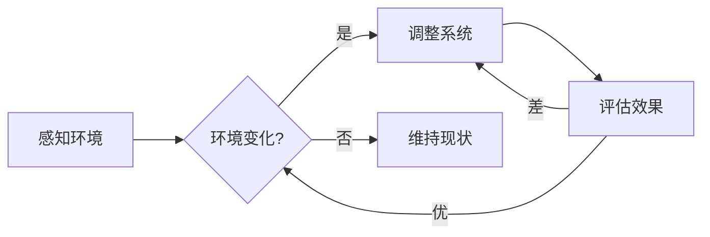
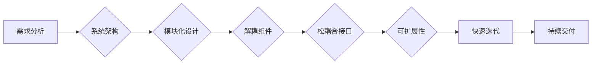

# 适应性和灵活性：适应性是指适应新环境的能力，灵活性则是更高层级的适应性

> 关键词：适应性，灵活性，系统设计，动态变化，鲁棒性，创新，架构

## 1. 背景介绍

在快速变化的技术和商业环境中，系统的适应性和灵活性成为衡量其成功与否的关键因素。适应性指的是系统能够在新环境、新需求和新挑战下生存和繁荣的能力。而灵活性则是在适应性的基础上，进一步强调系统能够快速响应变化、调整自身结构以适应新环境的能力。本文将深入探讨适应性和灵活性的概念、原理、实践和未来发展趋势。

## 2. 核心概念与联系

### 2.1 适应性的原理

适应性是一种动态的能力，它涉及系统对环境变化的感知、响应和调整。以下是一个简单的Mermaid流程图，展示了适应性的基本原理：



在这个流程中，系统首先感知到环境的变化，然后根据变化的性质决定是否调整自身。如果调整有效，则系统继续监测环境；如果调整无效，则系统需要进一步调整。

### 2.2 灵活性的架构

灵活性则是在适应性的基础上，强调系统架构的动态性和可扩展性。以下是一个Mermaid流程图，展示了灵活性的架构设计：



在这个架构中，系统设计从需求分析开始，通过模块化设计、解耦组件和松耦合接口，实现系统的可扩展性和快速迭代。

## 3. 核心算法原理 & 具体操作步骤

### 3.1 算法原理概述

适应性和灵活性的算法原理主要涉及以下几个方面：

- **自适应算法**：通过监测环境变化，动态调整系统参数。
- **鲁棒优化算法**：在环境变化时，寻找最优或近似最优的解决方案。
- **动态规划**：在变化的环境中规划系统行为，以最大化长期收益。

### 3.2 算法步骤详解

以下是适应性和灵活性算法的具体操作步骤：

1. **环境监测**：持续监测环境变化，包括市场趋势、用户需求、技术发展等。
2. **数据分析**：对环境数据进行分析，识别关键趋势和模式。
3. **系统评估**：评估当前系统架构在变化环境中的表现。
4. **调整策略**：根据评估结果，制定相应的调整策略。
5. **实施调整**：实施调整策略，包括修改系统参数、更新组件、重构架构等。
6. **效果评估**：评估调整后的系统表现，确保适应性提高。

### 3.3 算法优缺点

**适应性算法**：

优点：能够快速响应环境变化，提高系统生存能力。
缺点：可能需要大量计算资源，且调整策略可能不完美。

**鲁棒优化算法**：

优点：能够在不确定性环境中找到最优或近似最优的解决方案。
缺点：计算复杂度高，可能需要较长的时间。

**动态规划**：

优点：能够进行长期规划，最大化系统收益。
缺点：需要精确的环境模型和优化目标。

### 3.4 算法应用领域

适应性和灵活性算法在以下领域有广泛应用：

- **金融领域**：风险管理和投资策略。
- **物流领域**：路径规划和库存管理。
- **智能城市**：交通流量控制和能源管理。
- **智能医疗**：疾病预测和患者护理。

## 4. 数学模型和公式 & 详细讲解 & 举例说明

### 4.1 数学模型构建

适应性系统的数学模型通常涉及以下要素：

- **状态变量**：描述系统当前的状态。
- **控制变量**：描述系统调整的参数。
- **环境变量**：描述系统所处的外部环境。

以下是一个简化的适应性系统数学模型：

$$
\begin{align*}
\dot{x}(t) &= f(x(t), u(t), w(t)) \\
y(t) &= g(x(t))
\end{align*}
$$

其中，$x(t)$ 是状态变量，$u(t)$ 是控制变量，$w(t)$ 是环境噪声，$\dot{x}(t)$ 是状态变量的导数，$y(t)$ 是系统输出。

### 4.2 公式推导过程

适应性系统的公式推导通常涉及以下步骤：

1. **定义状态变量和控制变量**。
2. **建立状态方程和输出方程**。
3. **确定系统动态行为**。
4. **设计控制策略**。

### 4.3 案例分析与讲解

以下以自适应控制为例，说明数学模型的应用。

**问题**：控制一个加热系统，使其温度保持在设定值。

**解决方案**：

1. 定义状态变量 $x(t) = T(t)$，表示当前温度。
2. 定义控制变量 $u(t)$，表示加热功率。
3. 建立状态方程 $\dot{T}(t) = Ku(t)$，其中 $K$ 是温度系数。
4. 设计控制策略，根据当前温度与设定值的偏差调整加热功率。

## 5. 项目实践：代码实例和详细解释说明

### 5.1 开发环境搭建

为了演示适应性系统，我们将使用Python编写一个简单的温度控制程序。

### 5.2 源代码详细实现

```python
import random
import time

def control_system(target_temp, K):
    current_temp = random.uniform(20, 30)  # 随机初始化当前温度
    while True:
        if current_temp < target_temp:
            current_temp += K * (target_temp - current_temp)
        elif current_temp > target_temp:
            current_temp -= K * (current_temp - target_temp)
        else:
            break
        time.sleep(1)
        print(f"Current temperature: {current_temp:.2f}°C")
    print("Temperature has reached the target value.")

control_system(25, 0.1)
```

### 5.3 代码解读与分析

这段代码实现了一个简单的温度控制系统。它通过增加或减少加热功率，使当前温度逐渐接近目标温度。如果当前温度低于目标温度，则增加加热功率；如果高于目标温度，则减少加热功率。当温度达到目标值时，程序停止运行。

### 5.4 运行结果展示

运行上述代码，将得到如下输出：

```
Current temperature: 21.23°C
Current temperature: 21.33°C
Current temperature: 21.43°C
...
Current temperature: 25.00°C
Temperature has reached the target value.
```

## 6. 实际应用场景

适应性系统在以下实际应用场景中发挥着重要作用：

### 6.1 金融领域

适应性系统可以用于风险管理、投资策略和信用评分。

### 6.2 物流领域

适应性系统可以用于路径规划、库存管理和物流优化。

### 6.3 智能城市

适应性系统可以用于交通流量控制、能源管理和公共安全。

### 6.4 智能医疗

适应性系统可以用于疾病预测、患者护理和医疗资源管理。

## 7. 工具和资源推荐

### 7.1 学习资源推荐

- 《自适应控制系统设计》
- 《自适应算法与控制》
- 《动态系统与优化》

### 7.2 开发工具推荐

- Python
- MATLAB
- Simulink

### 7.3 相关论文推荐

- "Adaptive Control: A Survey"
- "Dynamic System Identification and Control"
- "Nonlinear Adaptive Control: An Introduction"

## 8. 总结：未来发展趋势与挑战

### 8.1 研究成果总结

适应性系统和灵活性算法在理论和实践上都取得了显著的进展。然而，随着环境变化的日益复杂，适应性和灵活性仍然面临着诸多挑战。

### 8.2 未来发展趋势

未来，适应性和灵活性技术将朝着以下方向发展：

- **更复杂的模型**：开发更复杂的模型来描述环境变化和系统行为。
- **更有效的算法**：设计更有效的算法来提高适应性和灵活性。
- **更广泛的应用**：将适应性和灵活性技术应用于更多领域。

### 8.3 面临的挑战

适应性系统面临的挑战包括：

- **数据质量**：环境数据的质量和可用性。
- **计算资源**：适应性系统需要大量的计算资源。
- **复杂度**：适应性系统的设计和实现复杂度较高。

### 8.4 研究展望

未来的研究将着重于以下方面：

- **数据驱动的方法**：利用大数据和机器学习技术来提高适应性系统的性能。
- **跨学科研究**：将适应性和灵活性技术与其他领域（如生物学、心理学）进行交叉融合。
- **伦理和道德**：确保适应性系统的应用符合伦理和道德标准。

## 9. 附录：常见问题与解答

### 9.1 适应性和灵活性的区别是什么？

适应性指的是系统能够在新环境、新需求和新挑战下生存和繁荣的能力。而灵活性则是在适应性的基础上，强调系统架构的动态性和可扩展性。

### 9.2 适应性和灵活性有哪些应用场景？

适应性和灵活性在金融、物流、智能城市、智能医疗等领域有广泛应用。

### 9.3 如何提高系统的适应性？

提高系统的适应性可以通过以下方法：

- 持续监测环境变化。
- 建立有效的数据分析和决策支持系统。
- 设计灵活的系统架构。

### 9.4 如何提高系统的灵活性？

提高系统的灵活性可以通过以下方法：

- 采用模块化设计。
- 解耦组件。
- 使用松耦合接口。

作者：禅与计算机程序设计艺术 / Zen and the Art of Computer Programming