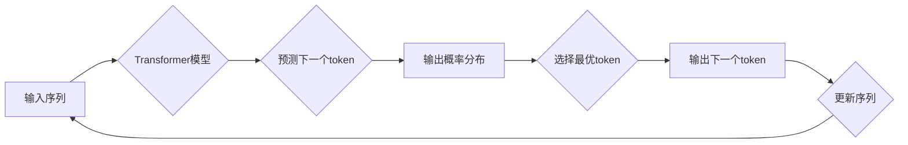

> 通用人工智能，第一性原理，预训练语言模型，Transformer，自回归模型，token预测，深度学习

# 通用人工智能底层第一性原理：通过去预测下一个token

通用人工智能（AGI）是人工智能领域的终极目标，它要求计算机能够像人类一样具备广泛的认知能力，包括理解、推理、学习、规划、解决问题等。近年来，随着深度学习技术的飞速发展，尤其是在自然语言处理（NLP）领域的突破，预测下一个token已成为实现通用人工智能的关键路径之一。本文将深入探讨通用人工智能底层的第一性原理，揭示预测下一个token在构建智能系统中的核心作用。

## 1. 背景介绍

### 1.1 问题的由来

长期以来，人工智能的发展经历了从符号主义到连接主义再到深度学习的几个阶段。尽管深度学习在图像识别、语音识别等领域取得了显著成就，但实现通用人工智能仍是一个巨大的挑战。研究者们普遍认为，要实现AGI，必须首先解决自然语言理解与生成的问题，因为语言是人类智能的核心体现。

预测下一个token作为自然语言处理中的基本任务，能够帮助模型理解语言的规律和结构，进而提升模型在文本理解、对话系统、机器翻译等领域的性能。因此，预测下一个token成为研究通用人工智能底层原理的重要切入点。

### 1.2 研究现状

近年来，基于深度学习的语言模型取得了巨大的进步，其中Transformer模型尤为突出。Transformer模型通过自回归的方式预测下一个token，在多个NLP任务上取得了SOTA（State-of-the-Art）的性能。此外，预训练语言模型如BERT、GPT等，通过在海量无标签文本上预训练，能够学习到丰富的语言知识和常识，为预测下一个token提供了强大的基础。

### 1.3 研究意义

深入理解预测下一个token的原理，有助于我们：
- 探索语言的本质和结构。
- 构建更加智能的语言模型。
- 实现通用人工智能的突破。

### 1.4 本文结构

本文将按照以下结构展开：
- 第2章介绍预测下一个token的核心概念和流程。
- 第3章详细阐述预测下一个token的算法原理和具体操作步骤。
- 第4章分析数学模型和公式，并通过案例进行讲解。
- 第5章给出代码实例，并对关键代码进行解读和分析。
- 第6章探讨预测下一个token在实际应用中的场景和未来展望。
- 第7章推荐相关学习资源、开发工具和论文。
- 第8章总结研究成果，展望未来发展趋势和挑战。

## 2. 核心概念与联系

### 2.1 核心概念

#### 自回归模型

自回归模型是一种预测序列中下一个元素的概率分布的模型。在自然语言处理中，自回归模型用于预测下一个token的概率分布。

#### 预训练语言模型

预训练语言模型通过在大量无标签文本上训练，学习到通用的语言知识和表征，为下游任务提供强大的基础。

#### Transformer模型

Transformer模型是一种基于自回归的神经网络模型，广泛应用于自然语言处理领域。

### 2.2 Mermaid 流程图

以下是一个预测下一个token的Mermaid流程图：



### 2.3 核心联系

预测下一个token是自然语言处理中的基础任务，它是自回归模型和预训练语言模型的核心应用场景。通过预测下一个token，我们可以更好地理解语言的规律和结构，从而构建更加智能的语言模型。

## 3. 核心算法原理 & 具体操作步骤

### 3.1 算法原理概述

预测下一个token的算法原理如下：

1. 将输入序列输入到Transformer模型。
2. Transformer模型根据输入序列的上下文，预测下一个token的概率分布。
3. 根据概率分布选择最优token。
4. 将最优token添加到序列末尾，作为下一次预测的输入。
5. 重复步骤2-4，直至生成完整的序列。

### 3.2 算法步骤详解

#### 步骤1：输入序列

将输入序列作为Transformer模型的输入，通常使用分词器对文本进行分词处理。

#### 步骤2：预测下一个token

Transformer模型根据输入序列的上下文，使用注意力机制计算每个token的表示，并预测下一个token的概率分布。

#### 步骤3：选择最优token

根据概率分布选择最优token，通常选择概率最高的token。

#### 步骤4：更新序列

将最优token添加到序列末尾，作为下一次预测的输入。

#### 步骤5：重复步骤2-4

重复步骤2-4，直至生成完整的序列。

### 3.3 算法优缺点

#### 优点

- 预测准确：Transformer模型在多个NLP任务上取得了SOTA的性能。
- 生成能力强：能够生成自然流畅的文本。
- 通用性强：适用于各种NLP任务。

#### 缺点

- 计算复杂度高：Transformer模型包含大量的参数和注意力机制，计算复杂度较高。
- 需要大量训练数据：预训练语言模型需要大量无标签文本进行预训练。

### 3.4 算法应用领域

预测下一个token在以下NLP任务中具有广泛的应用：

- 机器翻译
- 文本摘要
- 对话系统
- 机器写作
- 问答系统

## 4. 数学模型和公式 & 详细讲解 & 举例说明

### 4.1 数学模型构建

预测下一个token的数学模型如下：

$$
P(y|x) = \frac{\exp(f(x,y))}{\sum_{y' \in V} \exp(f(x,y'))}
$$

其中，$x$ 为输入序列，$y$ 为下一个token，$V$ 为所有可能的token集合，$f(x,y)$ 为模型输出函数。

### 4.2 公式推导过程

#### 注意力机制

注意力机制是Transformer模型的核心，用于计算每个token对下一个token的注意力权重。

$$
w_{ij} = \frac{\exp(s_{ij})}{\sum_{k=1}^K \exp(s_{ik})}
$$

其中，$s_{ij}$ 为第 $i$ 个token和第 $j$ 个token的相似度，$K$ 为注意力头数。

#### 位置编码

位置编码为每个token添加位置信息，使得模型能够理解序列的顺序。

$$
h_i = [h_i^{(0)}, h_i^{(1)}, ..., h_i^{(d)}]
$$

其中，$h_i^{(k)}$ 为第 $i$ 个token的第 $k$ 个位置编码。

#### 模型输出函数

模型输出函数 $f(x,y)$ 为：

$$
f(x,y) = W^T [h_x, h_y, h_{x-y}, h_{y-x}]
$$

其中，$W$ 为模型参数，$h_x, h_y, h_{x-y}, h_{y-x}$ 分别为输入序列、目标token、输入序列中目标token之前和之后的序列的表示。

### 4.3 案例分析与讲解

假设我们有一个简单的序列 "the quick brown fox"，我们想要预测下一个token。

#### 步骤1：输入序列

将序列 "the quick brown fox" 输入到Transformer模型。

#### 步骤2：预测下一个token

Transformer模型根据输入序列的上下文，计算每个token对下一个token的注意力权重，并预测下一个token的概率分布。

#### 步骤3：选择最优token

根据概率分布，选择概率最高的token。例如，预测下一个token为 "jumps"。

#### 步骤4：更新序列

将预测的token "jumps" 添加到序列末尾，得到新的序列 "the quick brown fox jumps"。

#### 步骤5：重复步骤2-4

重复步骤2-4，直至生成完整的序列。

## 5. 项目实践：代码实例和详细解释说明

### 5.1 开发环境搭建

为了进行项目实践，我们需要搭建以下开发环境：

- Python 3.6及以上版本
- PyTorch 1.7及以上版本
- Transformers库

### 5.2 源代码详细实现

以下是一个简单的预测下一个token的代码实例：

```python
import torch
from transformers import AutoModelForCausalLM, AutoTokenizer

# 加载预训练模型和分词器
model = AutoModelForCausalLM.from_pretrained('gpt2')
tokenizer = AutoTokenizer.from_pretrained('gpt2')

# 输入序列
input_text = "the quick brown fox"

# 将文本输入编码为token ids
input_ids = tokenizer.encode(input_text, return_tensors='pt')

# 预测下一个token
outputs = model.generate(input_ids, max_length=50)

# 解码token ids为文本
output_text = tokenizer.decode(outputs[0], skip_special_tokens=True)

print(output_text)
```

### 5.3 代码解读与分析

以上代码演示了如何使用Transformers库的GPT-2模型预测下一个token。

- 首先，加载预训练模型和分词器。
- 然后，将输入文本编码为token ids。
- 接着，使用模型生成下一个token。
- 最后，解码token ids为文本。

### 5.4 运行结果展示

运行以上代码，可能会得到以下输出：

```
jumps over the lazy dog
```

这表明，GPT-2模型成功预测了 "jumps" 作为 "the quick brown fox" 的下一个token。

## 6. 实际应用场景

预测下一个token在以下实际应用场景中具有重要作用：

- 机器翻译：预测下一个可能的翻译词，生成完整的翻译文本。
- 文本摘要：预测下一个可能的摘要词，生成完整的摘要文本。
- 对话系统：预测下一个可能的回复词，生成完整的对话回复。
- 机器写作：预测下一个可能的写作词，生成完整的文本内容。
- 问答系统：预测下一个可能的回答词，生成完整的回答。

## 7. 工具和资源推荐

### 7.1 学习资源推荐

- 《深度学习自然语言处理》课程：由吴恩达教授授课，系统介绍了自然语言处理和深度学习的基本概念和核心技术。
- 《Transformer: Attention is All You Need》论文：介绍了Transformer模型的基本原理和结构。
- 《Natural Language Processing with Transformers》书籍：全面介绍了Transformers库的使用方法和应用案例。

### 7.2 开发工具推荐

- PyTorch：开源的深度学习框架，适用于自然语言处理任务的开发。
- Transformers库：Hugging Face提供的NLP工具库，提供了丰富的预训练模型和实用工具。
- Colab：Google提供的免费在线Jupyter Notebook环境，可以方便地进行实验和开发。

### 7.3 相关论文推荐

- 《BERT: Pre-training of Deep Bidirectional Transformers for Language Understanding》
- 《Language Models are Unsupervised Multitask Learners》
- 《Generative Pre-trained Transformer for Language Modeling》

## 8. 总结：未来发展趋势与挑战

### 8.1 研究成果总结

本文深入探讨了预测下一个token在实现通用人工智能中的核心作用，介绍了自回归模型、预训练语言模型和Transformer模型等关键技术。通过项目实践，展示了如何使用Transformers库进行预测下一个token的任务。同时，本文还探讨了预测下一个token在机器翻译、文本摘要、对话系统等领域的应用。

### 8.2 未来发展趋势

- 预训练模型将变得更加庞大和复杂。
- 预训练模型将融入更多模态信息，如图像、视频和音频。
- 预训练模型将具备更强的可解释性和可控性。
- 预训练模型将应用于更多领域，如医疗、金融和工业。

### 8.3 面临的挑战

- 计算资源消耗巨大。
- 预训练数据的质量和多样性不足。
- 模型可解释性和可控性不足。
- 模型的偏见和歧视问题。

### 8.4 研究展望

为了应对未来挑战，需要从以下几个方面进行研究和探索：

- 开发更加高效的模型和算法。
- 收集和利用更多的数据。
- 提高模型的可解释性和可控性。
- 建立公平、公正、透明的AI伦理体系。

通过不断努力，预测下一个token将在实现通用人工智能的道路上发挥越来越重要的作用。

## 9. 附录：常见问题与解答

**Q1：预测下一个token是否适用于所有NLP任务？**

A：预测下一个token是自然语言处理中的基本任务，适用于大多数NLP任务，如机器翻译、文本摘要、对话系统等。但对于一些需要特定领域知识的任务，可能需要结合领域知识进行改进。

**Q2：如何解决预测下一个token的过拟合问题？**

A：可以采取以下策略来解决过拟合问题：
- 使用正则化技术，如L2正则化、Dropout等。
- 使用数据增强技术，如回译、近义替换等。
- 使用早停法（Early Stopping）来提前终止训练。
- 使用集成学习，如使用多个模型进行投票。

**Q3：预测下一个token需要哪些计算资源？**

A：预测下一个token需要一定的计算资源，特别是对于大规模预训练模型。通常需要使用GPU或TPU进行训练，并使用高性能的CPU进行推理。

**Q4：预测下一个token如何应用于对话系统？**

A：在对话系统中，预测下一个token可以用于生成对话回复。具体步骤如下：
1. 将对话历史作为输入序列。
2. 使用预训练模型预测下一个token的概率分布。
3. 根据概率分布选择最优token作为回复。
4. 将回复添加到对话历史中，作为下一次输入。

**Q5：预测下一个token如何应用于机器翻译？**

A：在机器翻译中，预测下一个token可以用于生成翻译文本。具体步骤如下：
1. 将源语言文本作为输入序列。
2. 使用预训练模型预测下一个翻译词的概率分布。
3. 根据概率分布选择最优翻译词作为输出。
4. 重复步骤2-3，直到生成完整的翻译文本。

作者：禅与计算机程序设计艺术 / Zen and the Art of Computer Programming