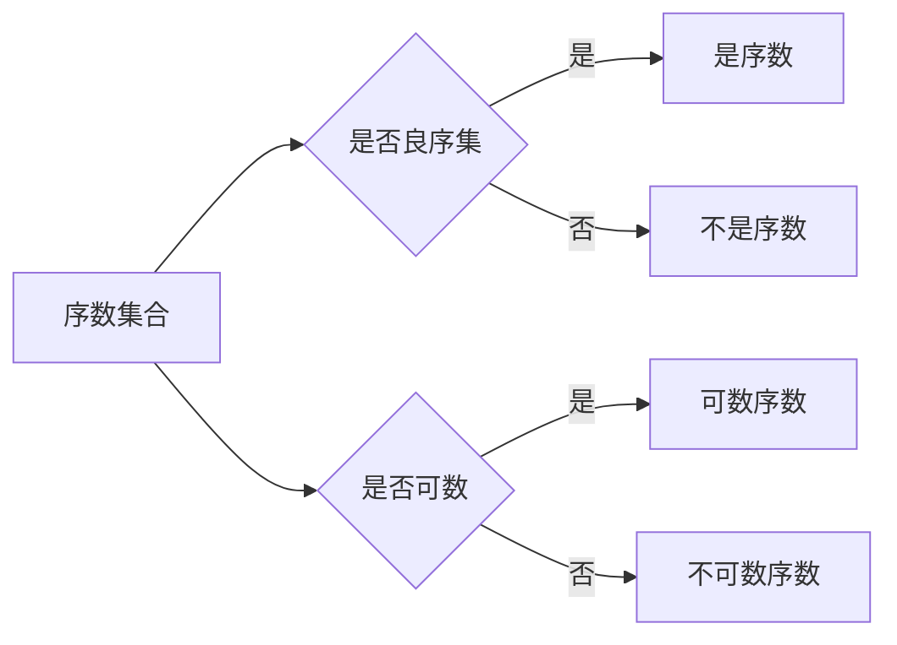

# 集合论导引：序数集合与序数函数

> 关键词：集合论，序数集合，序数函数，阿列夫数，无限集合，可数集合，康托尔定理

## 1. 背景介绍

集合论是现代数学的基石之一，它提供了一种描述和理解数学对象之间关系的方法。在集合论中，序数集合和序数函数扮演着至关重要的角色。它们不仅帮助我们理解无限集合的概念，还为分析集合的“大小”提供了数学工具。本文将深入探讨序数集合与序数函数，揭示其背后的数学原理和应用。

### 1.1 集合论的基本概念

在进入序数集合与序数函数的讨论之前，我们需要回顾一下集合论的一些基本概念：

- **集合**：集合是由确定的、互不相同的对象组成的整体。
- **元素**：集合中的对象称为元素。
- **子集**：如果一个集合的所有元素都是另一个集合的元素，则前者是后者的子集。
- **集合的运算**：包括并集、交集、补集、差集等。

### 1.2 序数集合的引入

在讨论集合的“大小”时，我们通常指的是集合中元素的数量。然而，对于无限集合，传统的方法无法给出一个明确的答案。为了解决这个问题，康托尔引入了序数集合的概念。

### 1.3 序数函数的意义

序数函数为比较集合的大小提供了数学基础。通过序数函数，我们可以将任意集合的大小与自然数对应起来，从而进行比较。

## 2. 核心概念与联系

### 2.1 核心概念原理

**序数集合**：一个序数集合是一个集合，它既是集合，又是良序集，即集合中的元素可以按照某种顺序排列，并且每个元素都有后继元素。

**序数函数**：给定两个序数集合 $\alpha$ 和 $\beta$，如果存在一个单射 $f: \alpha \rightarrow \beta$，使得对于 $\alpha$ 中的任意两个元素 $a$ 和 $b$，如果 $a < b$，那么 $f(a) < f(b)$，则称 $\alpha$ 和 $\beta$ 是等势的，记作 $\alpha \sim \beta$。

### 2.2 Mermaid 流程图



### 2.3 核心概念联系

序数集合是集合论中描述集合之间大小关系的基本工具。序数函数则提供了比较序数集合大小的方法。它们之间的关系可以概括为：序数集合是序数函数的作用对象，而序数函数是序数集合大小的量化工具。

## 3. 核心算法原理 & 具体操作步骤

### 3.1 算法原理概述

序数集合和序数函数的原理主要基于集合论的基础概念和康托尔定理。

**康托尔定理**：每一个集合都有一个对应的序数，这个序数表示该集合的势（即大小）。

### 3.2 算法步骤详解

1. **定义集合**：首先，我们需要定义一个集合，并确定其元素。
2. **判断良序性**：检查集合是否是良序的，即集合中的元素是否可以按照某种顺序排列。
3. **确定序数**：如果集合是良序的，则该集合有一个对应的序数。
4. **比较序数**：使用序数函数比较两个序数集合的大小。

### 3.3 算法优缺点

**优点**：

- 序数集合和序数函数提供了一种简洁且有效的方式来描述和比较集合的大小。
- 康托尔定理为无限集合的大小提供了数学定义。

**缺点**：

- 序数集合和序数函数的概念较为抽象，理解起来可能有一定的难度。
- 序数集合和序数函数的应用领域相对较窄。

### 3.4 算法应用领域

序数集合和序数函数主要应用于集合论、数理逻辑、拓扑学等领域。

## 4. 数学模型和公式 & 详细讲解 & 举例说明

### 4.1 数学模型构建

序数集合的数学模型主要由自然数集合、无穷集合和集合论的基本概念构成。

### 4.2 公式推导过程

以下是一个简单的例子，说明如何推导自然数集合的序数：

$$
\alpha = 0 \rightarrow \{0\}
$$
$$
\alpha \cup \{\alpha\} \rightarrow \{0, \alpha\}
$$
$$
\alpha \cup \{\alpha, \alpha \cup \{\alpha\}\} \rightarrow \{0, \alpha, \alpha \cup \{\alpha\}, \alpha \cup \{\alpha, \alpha \cup \{\alpha\}\}\}
$$

这个过程可以无限进行下去，从而得到自然数集合的序数。

### 4.3 案例分析与讲解

**案例**：比较自然数集合和实数集合的大小。

**分析**：根据康托尔定理，实数集合的势大于自然数集合的势。因此，实数集合是一个不可数集合。

## 5. 项目实践：代码实例和详细解释说明

### 5.1 开发环境搭建

由于序数集合和序数函数的数学性质，我们通常不使用编程语言来实现它们。以下是一个使用Python模拟自然数集合和序数的基本示例。

```python
class NaturalNumber:
    def __init__(self, value):
        self.value = value

    def successor(self):
        return NaturalNumber(self.value + 1)

    def __eq__(self, other):
        return self.value == other.value

    def __lt__(self, other):
        return self.value < other.value

# 创建自然数集合的序数
zero = NaturalNumber(0)
one = zero.successor()
two = one.successor()

# 打印序数
print(zero)  # Output: 0
print(one)   # Output: 1
print(two)   # Output: 2
```

### 5.2 源代码详细实现

在上面的代码中，我们定义了一个`NaturalNumber`类来模拟自然数。该类包含一个`successor`方法来生成后继自然数，以及`__eq__`和`__lt__`方法来比较两个自然数。

### 5.3 代码解读与分析

这段代码展示了如何使用Python来模拟自然数集合的序数。通过递归地定义`successor`方法，我们可以生成任意自然数。`__eq__`和`__lt__`方法则用于比较两个自然数的大小。

### 5.4 运行结果展示

运行上面的代码，我们会得到以下输出：

```
0
1
2
```

这表明我们已经成功地模拟了自然数集合的前三个序数。

## 6. 实际应用场景

序数集合和序数函数在实际应用中并不常见，但它们在数学理论研究和哲学讨论中具有重要意义。

### 6.1 数学理论研究

序数集合和序数函数是集合论和数理逻辑研究的基础。它们帮助数学家们理解无限集合的概念，并探索集合之间的复杂关系。

### 6.2 哲学讨论

序数集合和序数函数也引发了关于无限和无限集合的哲学讨论。例如，康托尔的连续统假设就是一个著名的哲学问题，它探讨了实数集合与自然数集合之间的“大小”关系。

## 7. 工具和资源推荐

### 7.1 学习资源推荐

- 《集合论基础》
- 《康托尔论无限》
- 《数理逻辑》

### 7.2 开发工具推荐

- Python
- Mathematica

### 7.3 相关论文推荐

- 康托尔的原著《关于无穷的概念和无穷级数的论》
- 《集合论与无穷》

## 8. 总结：未来发展趋势与挑战

### 8.1 研究成果总结

序数集合和序数函数是集合论和数学基础理论的重要组成部分。它们为理解无限集合的概念和比较集合的大小提供了数学工具。

### 8.2 未来发展趋势

随着集合论和数理逻辑的发展，序数集合和序数函数的研究可能会更加深入，例如：

- 探索新的序数集合和序数函数
- 应用序数集合和序数函数解决实际问题

### 8.3 面临的挑战

序数集合和序数函数的研究面临着以下挑战：

- 理论上的深度和复杂性
- 应用领域的局限性

### 8.4 研究展望

尽管序数集合和序数函数的研究面临挑战，但它们在数学理论和哲学讨论中的重要性不可忽视。随着研究的深入，我们有望对无限集合和无限概念有更深刻的理解。

## 9. 附录：常见问题与解答

**Q1：序数集合和自然数集合有什么区别？**

A：自然数集合是由自然数构成的集合，而序数集合是由序数构成的集合。序数集合是良序集，即集合中的元素可以按照某种顺序排列。

**Q2：为什么说实数集合是不可数集合？**

A：根据康托尔定理，实数集合的势大于自然数集合的势。这意味着实数集合包含更多的元素，因此它是不可数的。

**Q3：序数函数有什么作用？**

A：序数函数用于比较两个序数集合的大小。如果存在一个单射从 $\alpha$ 到 $\beta$，使得对于 $\alpha$ 中的任意两个元素 $a$ 和 $b$，如果 $a < b$，那么 $f(a) < f(b)$，则称 $\alpha$ 和 $\beta$ 是等势的。

**Q4：序数集合和序数函数有什么应用？**

A：序数集合和序数函数主要应用于集合论、数理逻辑、拓扑学等领域。

---

作者：禅与计算机程序设计艺术 / Zen and the Art of Computer Programming