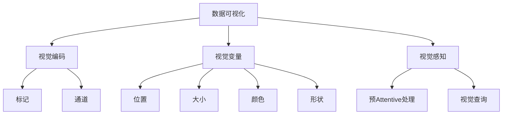

# 数据可视化 原理与代码实例讲解

## 1. 背景介绍

### 1.1 问题的由来

在当今数据时代，海量数据的采集和存储已经成为常态。然而,仅仅拥有大量数据是远远不够的,关键在于如何从这些原始数据中提取有价值的信息和见解。数据可视化作为一种将抽象数据转化为图形表示的过程,为人类理解和分析数据提供了一种高效且直观的方式。

传统的数据表格和报告虽然能够呈现数据,但往往难以揭示潜在的模式、趋势和异常。相比之下,数据可视化能够将复杂的数据转化为视觉形式,利用人类视觉系统的强大处理能力,使得数据分析变得更加高效和直观。

### 1.2 研究现状

数据可视化作为一个跨学科的研究领域,已经吸引了众多学者和实践者的关注。近年来,随着大数据、人工智能等技术的快速发展,数据可视化也面临着新的机遇和挑战。

一方面,新兴的可视化技术不断涌现,如交互式可视化、沉浸式可视化、增强现实可视化等,为数据可视化带来了新的维度和体验。另一方面,海量高维数据、异构数据等新型数据形式,对可视化技术的表现能力提出了更高的要求。

此外,数据可视化在各个领域也得到了广泛应用,如商业智能、科学计算、社交网络分析等,推动了相关理论和实践的不断发展。

### 1.3 研究意义

数据可视化的研究和应用具有重要的理论和实践意义:

- 理论意义:数据可视化涉及计算机图形学、人机交互、认知科学等多个学科,其理论研究可以推动相关领域的发展,拓展新的研究方向。
- 实践意义:高效的数据可视化能够帮助人们更好地理解和利用数据,为决策提供有力支持。它在商业、科学、政府等多个领域都有广泛的应用前景。

总的来说,数据可视化是一个富有挑战且应用前景广阔的研究领域,值得我们深入探索和研究。

### 1.4 本文结构

本文将全面介绍数据可视化的理论与实践,内容包括:

1. 核心概念与联系
2. 核心算法原理与具体操作步骤
3. 数学模型和公式详细讲解与案例分析
4. 项目实践:代码实例和详细解释说明
5. 实际应用场景
6. 工具和资源推荐
7. 总结:未来发展趋势与挑战
8. 附录:常见问题与解答

## 2. 核心概念与联系

数据可视化涉及多个核心概念,这些概念相互关联,共同构建了数据可视化的理论框架。

1. **视觉编码(Visual Encoding)**: 将抽象数据映射到视觉表现形式的过程。视觉编码包括选择适当的标记(Marks)和通道(Channels)。
2. **视觉变量(Visual Variables)**: 用于编码数据的视觉属性,如位置、大小、颜色、形状等。不同的视觉变量适用于不同类型的数据。
3. **视觉感知(Visual Perception)**: 人类视觉系统对视觉刺激的感知和理解过程,包括预AttentiveAttentive处理和视觉查询等认知机制。

这些核心概念相互关联、相辅相成,共同构建了数据可视化的理论基础。有效的数据可视化需要合理地选择视觉编码方式,利用视觉变量的特性,并考虑人类视觉感知的规律,从而实现数据与视觉表现之间的高效映射。

## 3. 核心算法原理 & 具体操作步骤

### 3.1 算法原理概述

数据可视化的核心算法主要包括:

1. **数据转换(Data Transformation)**: 将原始数据转换为适合可视化的结构化数据。
2. **视觉映射(Visual Mapping)**: 根据视觉编码原则,将结构化数据映射到视觉表现形式。
3. **渲染(Rendering)**: 将视觉表现形式渲染为最终的可视化图像或交互式视图。

这三个步骤构成了数据可视化的核心流程,确保了从原始数据到最终可视化结果的无缝转换。

### 3.2 算法步骤详解

1. **数据转换**

   - 数据清洗:处理缺失值、异常值等数据质量问题。
   - 数据转换:将数据转换为适合可视化的结构,如表格、树、网络等。
   - 数据聚合:对数据进行统计汇总,生成可视化所需的汇总数据。

2. **视觉映射**

   - 标记选择:根据数据类型和可视化目的选择合适的标记(如点、线、面等)。
   - 通道分配:将数据属性映射到视觉变量(如位置、大小、颜色等)。
   - 缩放转换:对数据值进行适当的缩放,以适应可视化的尺度范围。
   - 坐标映射:将数据值映射到可视化坐标系的位置。

3. **渲染**

   - 绘制图元:根据视觉映射结果,绘制对应的图元(如点、线、面等)。
   - 添加注释:添加标题、坐标轴、图例等辅助注释信息。
   - 交互处理:实现交互功能,如缩放、平移、tooltips等。
   - 导出输出:将可视化结果导出为图像或交互式视图。

### 3.3 算法优缺点

**优点**:

- 通用性强,适用于各种数据类型和可视化场景。
- 模块化设计,各步骤相对独立,易于扩展和优化。
- 考虑了数据质量和可视化效果,确保了可视化结果的准确性和有效性。

**缺点**:

- 算法步骤较多,实现复杂度较高。
- 对于特定场景,可能需要进行算法调整和优化。
- 视觉映射过程需要一定的领域知识和经验,存在主观性。

### 3.4 算法应用领域

数据可视化核心算法在以下领域有广泛应用:

- 商业智能:通过可视化展现业务数据,支持决策分析。
- 科学计算:可视化科学数据,揭示潜在规律和趋势。
- 社交网络分析:通过网络可视化探索社交关系和信息传播。
- 金融分析:可视化金融数据,发现投资机会和风险。
- 医疗健康:通过可视化技术辅助医疗诊断和健康监测。

## 4. 数学模型和公式 & 详细讲解 & 举例说明

### 4.1 数学模型构建

在数据可视化中,常常需要构建数学模型来描述数据和视觉表现之间的映射关系。一种常用的数学模型是线性映射模型,它将数据值线性映射到视觉变量的范围内。

设数据值为 $x$,视觉变量的取值范围为 $[v_{min}, v_{max}]$,数据值的范围为 $[d_{min}, d_{max}]$,则线性映射函数可表示为:

$$
v(x) = v_{min} + \frac{x - d_{min}}{d_{max} - d_{min}} \cdot (v_{max} - v_{min})
$$

这个模型确保了数据值在其范围内的任意值都可以被唯一映射到视觉变量的取值范围内。

### 4.2 公式推导过程

对于线性映射模型,我们可以通过以下步骤推导出公式:

1. 确定映射的边界条件:
   - 当 $x = d_{min}$ 时,我们希望 $v(x) = v_{min}$
   - 当 $x = d_{max}$ 时,我们希望 $v(x) = v_{max}$

2. 构建线性方程:

   设映射函数为 $v(x) = ax + b$,代入边界条件得:

   $$
   \begin{cases}
   a \cdot d_{min} + b = v_{min} \
   a \cdot d_{max} + b = v_{max}
   \end{cases}
   $$

3. 解方程得到 $a$ 和 $b$ 的值:

   $$
   a = \frac{v_{max} - v_{min}}{d_{max} - d_{min}} \
   b = v_{min} - \frac{v_{max} - v_{min}}{d_{max} - d_{min}} \cdot d_{min}
   $$

4. 将 $a$ 和 $b$ 代入线性方程,得到最终的线性映射公式:

   $$
   v(x) = v_{min} + \frac{x - d_{min}}{d_{max} - d_{min}} \cdot (v_{max} - v_{min})
   $$

### 4.3 案例分析与讲解

考虑一个将数据值映射到颜色亮度的例子。假设数据值范围为 $[0, 100]$,我们希望将其映射到灰度值范围 $[0, 255]$ (其中 0 表示黑色,255 表示白色)。

根据线性映射模型,我们可以得到映射函数:

$$
v(x) = 0 + \frac{x - 0}{100 - 0} \cdot (255 - 0) = \frac{255}{100} \cdot x
$$

因此,当数据值为 0 时,映射结果为黑色(灰度值 0);当数据值为 100 时,映射结果为白色(灰度值 255);对于其他数据值,映射结果为相应的灰度值。

这种线性映射方式确保了数据值在整个范围内都可以被唯一映射到颜色亮度,并且映射结果具有良好的可解释性和直观性。

### 4.4 常见问题解答

**Q: 线性映射是否适用于所有情况?**

A: 线性映射模型是一种简单且常用的映射方式,但并非适用于所有情况。对于某些数据分布或视觉变量,可能需要采用非线性映射模型(如对数映射、指数映射等)以获得更好的视觉效果。选择合适的映射模型需要结合具体的数据特征和可视化目的。

**Q: 如何处理数据值超出映射范围的情况?**

A: 在实际应用中,可能会遇到数据值超出预设的映射范围的情况。一种常见的处理方式是对超出范围的数据值进行裁剪,将其映射到视觉变量的最小或最大值。另一种方式是对数据值进行适当的变换(如对数变换),使其落入映射范围内。具体采用哪种方式,需要根据数据的特点和可视化的目的进行权衡。

**Q: 除了线性映射,还有哪些常见的映射模型?**

A: 除了线性映射模型,其他常见的映射模型包括:

- 对数映射:适用于呈指数分布的数据,可以压缩大值区间,扩展小值区间。
- 分段线性映射:将数据范围分成多个区间,对每个区间采用不同的线性映射函数。
- 非线性映射:如指数映射、幂映射等,用于处理特殊的数据分布或视觉需求。

选择合适的映射模型需要结合数据特征和可视化目的,并通过实验评估不同模型的效果。

## 5. 项目实践:代码实例和详细解释说明

### 5.1 开发环境搭建

在开始实现数据可视化项目之前,我们需要先搭建开发环境。本例中,我们将使用 Python 编程语言和 Matplotlib 库进行可视化开发。

1. 安装 Python 环境

   首先,需要在系统中安装 Python 解释器。你可以从 [Python 官网](https://www.python.org/downloads/) 下载最新版本的 Python,并按照提示进行安装。

2. 设置虚拟环境(可选)

   为了避免与系统其他 Python 包发生冲突,建议创建一个虚拟环境。你可以使用 Python 自带的