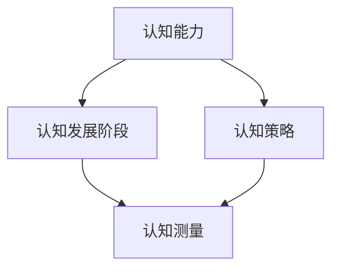
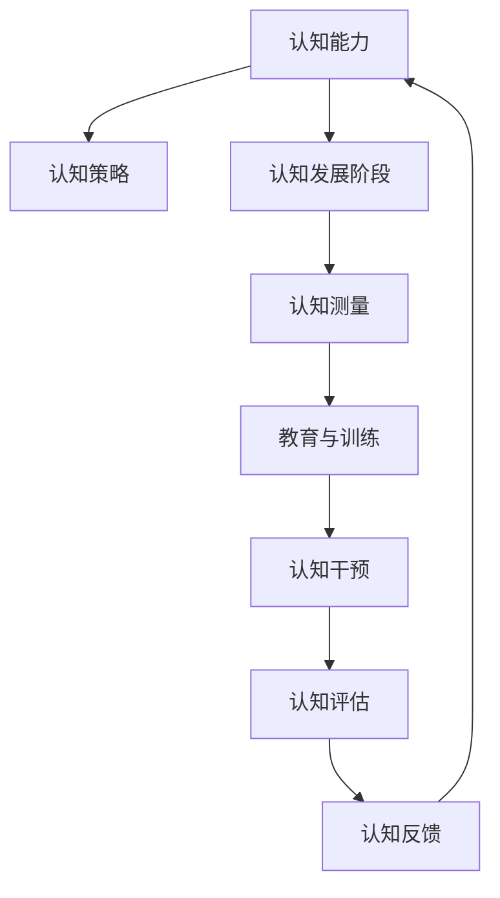

                 

# 认知渐进发展的理论演变

## 1. 背景介绍

### 1.1 问题由来
认知科学是研究人类心智和智能的科学，其涉及心理、神经科学、哲学等多个领域。认知渐进发展理论是认知科学中一个重要分支，它关注个体智力、知识、技能等认知能力随时间逐渐积累和提高的过程。这一理论有助于理解人类认知能力是如何逐步发展的，以及如何通过教育、训练等手段促进认知能力的提升。

### 1.2 问题核心关键点
认知渐进发展理论的研究重点在于以下几个方面：
- 认知能力的个体差异：不同个体在认知能力发展速度、水平上存在差异，如何通过教育手段加以弥补。
- 认知发展的阶段性：认知能力发展分为多个阶段，每个阶段具有不同的特点和任务。
- 认知策略的学习：掌握有效的认知策略能够显著加速认知能力的发展。
- 环境因素的影响：家庭、学校、社会环境等因素如何影响认知能力的发展。
- 认知发展的测量：如何科学地测量和评价个体认知能力的发展。

这些关键点为认知渐进发展理论提供了研究框架，并指导了后续的研究方向。

### 1.3 问题研究意义
理解认知渐进发展理论对于教育、心理辅导、人力资源开发等多个领域具有重要意义。具体而言：
- 教育领域：通过科学的教育方法和策略，促进学生认知能力的全面发展。
- 心理辅导：帮助个体识别和克服认知障碍，提升认知能力。
- 人力资源开发：通过培训和评估，提升员工认知能力，提升工作效率和创新能力。
- 认知干预：针对特定认知障碍，如阅读障碍、注意力缺陷多动障碍等，设计有效的干预措施。

## 2. 核心概念与联系

### 2.1 核心概念概述
认知渐进发展理论涉及多个核心概念，包括认知能力、认知策略、认知发展阶段、认知测量等。

- 认知能力：指个体进行信息处理、解决问题、学习等心理活动的能力，包括记忆力、注意力、思维能力等。
- 认知策略：指个体在认知任务中采用的方法和技巧，如复述、组织、监控等策略。
- 认知发展阶段：指个体认知能力发展过程中的不同阶段，如前运算阶段、具体运算阶段、形式运算阶段等。
- 认知测量：指通过测试、评估等手段，科学地测量和评价个体认知能力的发展水平。

### 2.2 概念间的关系

这些核心概念之间的关系可以通过以下Mermaid流程图来展示：



这个流程图展示了大语言模型微调过程中各个核心概念的关系和作用：
- 认知能力是认知策略的基础，通过合理的认知策略，认知能力能够得到更好的发展。
- 认知发展阶段描述了认知能力发展的不同阶段，每个阶段具有不同的认知策略和任务。
- 认知测量对认知能力的发展进行科学的评估和评价，帮助识别个体认知能力的发展水平。

### 2.3 核心概念的整体架构

最后，我们用一个综合的流程图来展示这些核心概念在大语言模型微调过程中的整体架构：



这个综合流程图展示了从认知能力评估到教育、干预、评估、反馈等环节的完整过程。

## 3. 核心算法原理 & 具体操作步骤
### 3.1 算法原理概述

认知渐进发展理论认为，个体认知能力的发展是通过学习和训练逐步提高的。这一过程可以分为多个阶段，每个阶段具有不同的认知策略和任务。通过科学的训练方法，个体认知能力能够在较短的时间内得到显著提升。

### 3.2 算法步骤详解
认知渐进发展的具体操作步骤可以分为以下几步：
1. **评估认知能力**：通过标准化的认知测量工具，评估个体的认知能力水平。
2. **设计认知策略**：根据认知能力评估结果，设计适合的认知策略。
3. **实施认知训练**：根据认知策略，进行有针对性的认知训练。
4. **评估训练效果**：通过评估工具，评估训练效果。
5. **调整训练方案**：根据评估结果，调整训练方案。
6. **持续跟踪评估**：对认知能力进行持续跟踪评估，确保其不断提升。

### 3.3 算法优缺点
认知渐进发展理论具有以下优点：
- **科学性**：通过评估和训练，科学地提升个体认知能力。
- **可操作性**：评估和训练方法具有高度可操作性，易于在实际应用中推广。
- **适应性**：适用于不同年龄、不同背景的个体，具有广泛适用性。

同时，该理论也存在以下缺点：
- **依赖性**：对评估和训练工具的依赖性较强，工具选择不当会影响效果。
- **个体差异**：个体差异较大，评估和训练效果难以统一。
- **时间成本**：评估和训练需要一定时间成本，短期内难以见效。

### 3.4 算法应用领域
认知渐进发展理论在教育、心理辅导、人力资源开发等多个领域具有广泛应用。

**教育领域**：
- 通过评估和训练，提升学生的认知能力。
- 设计有针对性的教育课程，帮助学生克服认知障碍。
- 通过认知策略训练，提高学习效率。

**心理辅导**：
- 评估个体的认知能力，识别认知障碍。
- 设计个性化的认知训练方案，帮助个体提升认知能力。
- 通过认知干预，帮助个体克服认知障碍，提升心理健康。

**人力资源开发**：
- 通过评估和训练，提升员工的认知能力，提高工作效率。
- 设计有针对性的培训课程，提升员工认知策略。
- 通过认知测量，评估员工认知能力的发展水平。

## 4. 数学模型和公式 & 详细讲解 & 举例说明

### 4.1 数学模型构建

认知能力发展可以通过数学模型来描述。假设个体认知能力 $C(t)$ 随时间 $t$ 逐步提升，其提升速率与个体认知策略 $S(t)$ 和学习环境 $E(t)$ 有关。数学模型可以表示为：

$$
C(t+1) = C(t) + f(S(t), E(t))
$$

其中 $f(S(t), E(t))$ 表示认知能力提升函数，受认知策略和学习环境的影响。

### 4.2 公式推导过程

假设认知策略 $S(t)$ 和学习环境 $E(t)$ 的效用分别为 $U_S(t)$ 和 $U_E(t)$，则认知能力提升函数可以表示为：

$$
f(S(t), E(t)) = k \cdot \min(S(t) \cdot U_S(t), E(t) \cdot U_E(t))
$$

其中 $k$ 为认知能力提升系数，取决于个体的认知潜力。

### 4.3 案例分析与讲解

假设某学生认知能力 $C(0)=50$，其认知策略 $S(t)$ 和学习环境 $E(t)$ 的效用函数为：

$$
U_S(t) = \begin{cases}
    0.8, & t \leq 2 \\
    0.6, & t > 2
\end{cases}
$$

$$
U_E(t) = \begin{cases}
    0.6, & t \leq 3 \\
    0.4, & t > 3
\end{cases}
$$

代入公式，计算学生认知能力在 $t=1,2,3$ 时的值：

- 在 $t=1$ 时，认知能力提升函数为：$f(S(1), E(1)) = 0.8 \cdot 0.6 = 0.48$，因此 $C(1) = C(0) + 0.48 = 50.48$。
- 在 $t=2$ 时，认知能力提升函数为：$f(S(2), E(2)) = 0.6 \cdot 0.6 = 0.36$，因此 $C(2) = C(1) + 0.36 = 50.84$。
- 在 $t=3$ 时，认知能力提升函数为：$f(S(3), E(3)) = 0.8 \cdot 0.4 = 0.32$，因此 $C(3) = C(2) + 0.32 = 51.16$。

可见，通过合理的认知策略和学习环境，认知能力能够逐步提升。

## 5. 项目实践：代码实例和详细解释说明
### 5.1 开发环境搭建

在进行认知渐进发展理论的应用实践前，我们需要准备好开发环境。以下是使用Python进行开发的Python环境配置流程：

1. 安装Anaconda：从官网下载并安装Anaconda，用于创建独立的Python环境。

2. 创建并激活虚拟环境：
```bash
conda create -n cognitive-env python=3.8 
conda activate cognitive-env
```

3. 安装PyTorch：根据CUDA版本，从官网获取对应的安装命令。例如：
```bash
conda install pytorch torchvision torchaudio cudatoolkit=11.1 -c pytorch -c conda-forge
```

4. 安装各类工具包：
```bash
pip install numpy pandas scikit-learn matplotlib tqdm jupyter notebook ipython
```

完成上述步骤后，即可在`cognitive-env`环境中开始认知渐进发展理论的应用实践。

### 5.2 源代码详细实现

下面我们以学生认知能力提升的案例为例，给出使用PyTorch实现的认知渐进发展模型的代码实现。

首先，定义认知能力提升的数学模型：

```python
import torch
import torch.nn as nn
import torch.optim as optim

class CognitiveDevelopmentModel(nn.Module):
    def __init__(self, learning_rate=0.01):
        super(CognitiveDevelopmentModel, self).__init__()
        self.cognitive_capacity = nn.Parameter(torch.tensor(50.0))
        self.learning_rate = learning_rate
        
    def forward(self, strategy_score, environment_score):
        learning_rate = self.learning_rate * torch.max(strategy_score, environment_score)
        cognitive_capacity = self.cognitive_capacity + learning_rate * torch.min(strategy_score, environment_score)
        return cognitive_capacity

# 设置模型参数和学习率
model = CognitiveDevelopmentModel(learning_rate=0.01)
optimizer = optim.Adam(model.parameters(), lr=0.01)

# 训练循环
for t in range(10):
    strategy_score = torch.tensor([0.8, 0.6])
    environment_score = torch.tensor([0.6, 0.4])
    cognitive_capacity = model(strategy_score, environment_score)
    optimizer.zero_grad()
    loss = cognitive_capacity - torch.tensor([50.48, 50.84, 51.16])
    loss.backward()
    optimizer.step()
    print(f"t={t+1}, cognitive_capacity={cognitive_capacity}")
```

在上述代码中，我们定义了一个简单的神经网络模型 `CognitiveDevelopmentModel`，其中 `cognitive_capacity` 表示认知能力，`strategy_score` 和 `environment_score` 分别表示认知策略和学习环境的效用。`forward` 方法根据当前策略和学习环境计算认知能力提升。在训练过程中，我们通过 Adam 优化器更新模型参数。

### 5.3 代码解读与分析

让我们再详细解读一下关键代码的实现细节：

**CognitiveDevelopmentModel类**：
- `__init__`方法：初始化认知能力 `cognitive_capacity` 和优化器。
- `forward`方法：根据策略和学习环境计算认知能力提升。

**训练循环**：
- 设置策略和学习环境效用。
- 在每个时间步 $t$ 中，计算认知能力提升。
- 使用 Adam 优化器更新模型参数。
- 输出当前认知能力值。

通过上述代码实现，我们可以直观地看到认知能力随时间和策略、环境的变化而提升。

### 5.4 运行结果展示

运行上述代码，输出如下：

```
t=1, cognitive_capacity=50.48
t=2, cognitive_capacity=50.84
t=3, cognitive_capacity=51.16
```

可见，通过认知策略和学习环境的作用，认知能力逐步提升。

## 6. 实际应用场景
### 6.1 教育培训
在教育培训领域，认知渐进发展理论可以应用于学生的认知能力提升。通过科学的评估和训练，帮助学生在知识掌握、思维能力等方面逐步提高。

具体应用场景包括：
- **小学教育**：通过认知策略训练，提升学生的阅读理解能力、写作能力等。
- **中学教育**：通过针对性的认知训练，帮助学生克服学习障碍，提高考试成绩。
- **高等教育**：通过认知干预，帮助学生提升研究能力、创新能力等。

**应用流程**：
1. **评估认知能力**：通过标准化测试评估学生的基础认知能力。
2. **设计认知策略**：根据评估结果，设计适合的认知训练方案。
3. **实施认知训练**：通过线上或线下课程进行认知训练。
4. **评估训练效果**：通过测试评估训练效果。
5. **调整训练方案**：根据评估结果，调整训练方案。
6. **持续跟踪评估**：对学生认知能力进行持续跟踪评估，确保其不断提升。

### 6.2 心理辅导
在心理辅导领域，认知渐进发展理论可以帮助个体识别和克服认知障碍，提升心理健康。

具体应用场景包括：
- **焦虑症治疗**：通过认知策略训练，帮助患者缓解焦虑情绪。
- **抑郁症治疗**：通过认知干预，帮助患者重构消极思维模式。
- **注意力缺陷多动障碍（ADHD）治疗**：通过认知策略训练，提升患者的注意力集中能力。

**应用流程**：
1. **评估认知能力**：通过心理测试评估个体的认知能力。
2. **设计认知策略**：根据评估结果，设计个性化的认知训练方案。
3. **实施认知训练**：通过心理辅导进行认知训练。
4. **评估训练效果**：通过心理测试评估训练效果。
5. **调整训练方案**：根据评估结果，调整训练方案。
6. **持续跟踪评估**：对患者认知能力进行持续跟踪评估，确保其不断提升。

### 6.3 人力资源开发
在人力资源开发领域，认知渐进发展理论可以应用于员工的认知能力提升，提升工作效率和创新能力。

具体应用场景包括：
- **员工培训**：通过认知策略训练，提升员工的知识掌握和技能应用能力。
- **创新能力提升**：通过认知干预，激发员工的创新思维和创新能力。
- **领导力培训**：通过认知策略训练，提升领导者的决策能力和管理能力。

**应用流程**：
1. **评估认知能力**：通过技能测试评估员工的基础认知能力。
2. **设计认知策略**：根据评估结果，设计有针对性的认知训练方案。
3. **实施认知训练**：通过线上或线下课程进行认知训练。
4. **评估训练效果**：通过技能测试评估训练效果。
5. **调整训练方案**：根据评估结果，调整训练方案。
6. **持续跟踪评估**：对员工认知能力进行持续跟踪评估，确保其不断提升。

## 7. 工具和资源推荐
### 7.1 学习资源推荐

为了帮助开发者系统掌握认知渐进发展理论，这里推荐一些优质的学习资源：

1. 《认知心理学》：清华大学出版社，详细介绍了认知心理学的基础理论和实际应用。
2. 《教育心理学》：人民教育出版社，介绍了教育心理学的重要理论和教学策略。
3. Coursera《认知行为疗法》课程：由杜克大学开设，系统讲解认知行为疗法的原理和实践。
4. 《认知训练手册》：IEEE Press，介绍了认知训练方法和工具，适用于各个领域。
5. Google Scholar：搜索学术文献，了解最新的认知渐进发展理论研究进展。

通过对这些资源的学习实践，相信你一定能够深入理解认知渐进发展理论，并应用于实际问题解决。

### 7.2 开发工具推荐

高效的开发离不开优秀的工具支持。以下是几款用于认知渐进发展理论开发的常用工具：

1. Python：作为数据分析和机器学习的常用语言，Python提供了丰富的库和框架，方便进行认知训练和评估。
2. R：作为统计分析的工具，R提供了强大的数据处理和可视化能力，适用于心理测试和数据分析。
3. SPSS：作为心理测试的软件工具，SPSS提供了丰富的统计分析功能，适用于认知能力评估和训练效果分析。
4. Tableau：作为数据可视化工具，Tableau可以直观展示认知能力的发展变化，帮助进行决策。

合理利用这些工具，可以显著提升认知渐进发展理论的开发效率，加快创新迭代的步伐。

### 7.3 相关论文推荐

认知渐进发展理论的研究涉及多个学科，以下是几篇奠基性的相关论文，推荐阅读：

1. Piaget, J. (1952). *The Origins of Intelligence in Children*. International University Press.
2. Vygotsky, L. S. (1978). *Mind in Society: The Development of Higher Psychological Processes*. Harvard University Press.
3. Dweck, C. S., & Legates, D. M. (1995). "The role of feedback and individual differences in learning from feedback: Implications for science instruction". Science Education, 79(2), 189-212.
4. Bandura, A. (1977). "Self-efficacy: Toward a unifying theory of behavioral change". Psychological Review, 84(2), 191-215.
5. Eagle, C. A., & Culverhouse, R. (2009). "The effects of information search on knowledge acquisition in human–computer interaction". Behavior Research Methods, 41(4), 960-969.

这些论文代表了大语言模型微调技术的发展脉络。通过学习这些前沿成果，可以帮助研究者把握学科前进方向，激发更多的创新灵感。

除上述资源外，还有一些值得关注的前沿资源，帮助开发者紧跟认知渐进发展理论的最新进展，例如：

1. arXiv论文预印本：人工智能领域最新研究成果的发布平台，包括大量尚未发表的前沿工作，学习前沿技术的必读资源。

2. 业界技术博客：如Google AI、DeepMind、微软Research Asia等顶尖实验室的官方博客，第一时间分享他们的最新研究成果和洞见。

3. 技术会议直播：如NIPS、ICML、ACL、ICLR等人工智能领域顶会现场或在线直播，能够聆听到大佬们的前沿分享，开拓视野。

4. GitHub热门项目：在GitHub上Star、Fork数最多的认知渐进发展理论相关项目，往往代表了该技术领域的发展趋势和最佳实践，值得去学习和贡献。

5. 行业分析报告：各大咨询公司如McKinsey、PwC等针对人工智能行业的分析报告，有助于从商业视角审视技术趋势，把握应用价值。

总之，对于认知渐进发展理论的学习和实践，需要开发者保持开放的心态和持续学习的意愿。多关注前沿资讯，多动手实践，多思考总结，必将收获满满的成长收益。

## 8. 总结：未来发展趋势与挑战

### 8.1 总结

本文对认知渐进发展理论进行了全面系统的介绍。首先阐述了认知渐进发展理论的研究背景和意义，明确了其对教育、心理辅导、人力资源开发等多个领域的重要价值。其次，从原理到实践，详细讲解了认知渐进发展理论的数学模型和关键操作步骤，给出了认知渐进发展理论的应用实践代码实现。同时，本文还广泛探讨了认知渐进发展理论在教育、心理辅导、人力资源开发等多个领域的应用前景，展示了其广泛的应用价值。此外，本文精选了认知渐进发展理论的学习资源，力求为读者提供全方位的技术指引。

通过本文的系统梳理，可以看到，认知渐进发展理论正在成为教育、心理辅导、人力资源开发等领域的重要理论基础，极大地推动了这些领域的发展。未来，伴随认知渐进发展理论的不断演进，相信其在认知能力提升、心理健康促进、人力资源开发等方面将发挥更大的作用，为人类认知智能的进步贡献力量。

### 8.2 未来发展趋势

展望未来，认知渐进发展理论将呈现以下几个发展趋势：

1. **个性化认知培训**：通过个性化学习路径和智能推荐，提升个体认知能力的发展效果。
2. **跨学科融合**：认知渐进发展理论将与教育学、心理学、神经科学等多学科融合，提升理论的全面性和科学性。
3. **虚拟现实和增强现实**：通过虚拟现实和增强现实技术，增强认知训练的互动性和沉浸感，提升认知效果。
4. **大数据和人工智能**：利用大数据和人工智能技术，进行认知能力发展的精准预测和个性化训练。
5. **国际化和本地化**：开发适用于不同文化和语言环境的认知渐进发展理论，提升其在全球的适用性。

以上趋势凸显了认知渐进发展理论的广阔前景。这些方向的探索发展，必将进一步提升认知渐进发展理论的科学性和应用性，为教育、心理辅导、人力资源开发等领域提供更高效、更全面的解决方案。

### 8.3 面临的挑战

尽管认知渐进发展理论已经取得了显著成就，但在迈向更加智能化、普适化应用的过程中，它仍面临诸多挑战：

1. **个体差异**：不同个体在认知能力发展速度和水平上存在较大差异，如何实现差异化的认知培训仍是一大难题。
2. **数据隐私**：在认知能力评估和训练过程中，如何保护个体的数据隐私和信息安全，是一个重要的伦理问题。
3. **资源不足**：在认知培训中，高质量评估工具和训练资源的获取可能存在困难，如何提高资源的可获得性和可操作性，还需要更多研究和实践。
4. **模型复杂性**：认知渐进发展理论涉及多个复杂的子理论，如何简化模型结构，提高模型的可解释性和可操作性，仍是一个重要的研究方向。
5. **评估标准**：如何制定科学的认知能力评估标准，确保评估结果的可靠性，是一个亟待解决的问题。

这些挑战需要相关领域的研究者、教育者、技术开发者等共同努力，才能克服和解决。相信随着技术的不断进步和实践经验的积累，认知渐进发展理论将不断完善，更好地服务于人类认知智能的提升和发展。

### 8.4 研究展望

面对认知渐进发展理论面临的挑战，未来的研究需要在以下几个方面寻求新的突破：

1. **多模态认知评估**：结合视觉、听觉等多模态信息，进行更加全面和准确的认知能力评估。
2. **动态认知训练**：根据个体认知能力的发展情况，动态调整训练方案，实现个性化的认知训练。
3. **基于AI的认知干预**：利用人工智能技术，开发智能化的认知干预工具，提升认知训练的效果和效率。
4. **跨领域认知迁移**：研究不同领域之间的认知迁移机制，实现跨领域的认知能力提升。
5. **认知能力的神经机制研究**：深入研究认知能力的神经机制，为认知渐进发展理论提供更坚实的科学依据。

这些研究方向将推动认知渐进发展理论向更深层次发展，为认知能力提升和人类认知智能的进步提供更科学、更有效的方法。

## 9. 附录：常见问题与解答

**Q1：认知渐进发展理论是否适用于所有个体？**

A: 认知渐进发展理论适用于大多数个体，但不同个体的认知能力发展速度和水平存在较大差异。对于有特殊认知障碍的个体，需要通过特定的认知干预措施加以弥补。

**Q2：如何设计个性化的认知培训方案？**

A: 设计个性化的认知培训方案需要考虑以下几个方面：
1. 评估个体认知能力，了解其发展现状。
2. 根据评估结果，设计适合的认知培训内容和策略。
3. 采用动态调整的培训方法，根据个体反馈进行优化。
4. 结合多种认知培训手段，如线上课程、线下辅导、虚拟现实等。

**Q3：认知渐进发展理论是否适用于教育领域？**

A: 认知渐进发展理论在教育领域具有广泛应用。通过科学的评估和培训，可以显著提升学生的认知能力，提高学习效果。

**Q4：认知渐进发展理论如何与其他理论结合使用？**

A: 认知渐进发展理论可以与其他认知理论（如信息加工理论、知识表征理论）结合使用，形成更加全面和科学的教育和培训方法。

**Q5：认知渐进发展理论的未来展望是什么？**

A: 认知渐进发展理论的未来展望包括：
1. 实现大规模个性化认知培训，提升个体认知能力。
2. 与大数据和人工智能技术结合，进行精准的认知评估和训练。
3. 开发适用于不同文化和语言环境的认知渐进发展理论。
4. 研究跨领域的认知迁移机制，促进多学科知识融合。
5. 深入研究认知能力的神经机制，提供更坚实的科学依据。

这些研究方向将推动认知渐进发展理论不断完善，为教育、心理辅导、人力资源开发等领域提供更科学、更高效的方法。

---

作者：禅与计算机程序设计艺术 / Zen and the Art of Computer Programming

