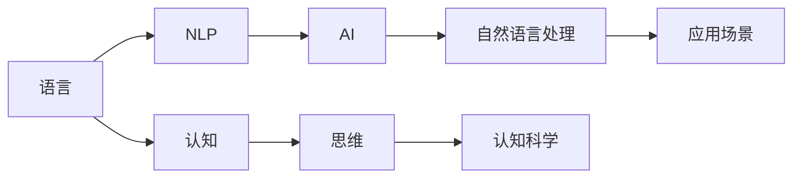

                 

# 语言不太可能成为任何形式思维的关键基础

> 关键词：思维、语言、认知、人工智能、计算机科学

## 1. 背景介绍

### 1.1 问题由来

随着计算机技术的不断发展，人工智能（AI）和机器学习（ML）成为当前的热门话题。而在大数据和算力的支持下，自然语言处理（NLP）逐渐成为人工智能研究的重要分支，其应用范围广泛，从语音识别、机器翻译到问答系统、文本摘要等。但无论是深度学习模型还是基于规则的NLP系统，均依赖于语言这一载体，从某种程度上说，语言成为了思维和计算的关键基础。然而，这一观点在学术界和工业界逐渐受到质疑，尤其在认知科学、语言学和计算机科学等领域，出现了大量的研究成果和讨论。

本文旨在深入探讨语言是否真的是思维的关键基础，分析语言在认知过程中的角色，并提出一些基于AI和ML的研究方向和实际应用场景。

### 1.2 问题核心关键点

关于语言与思维关系的讨论，主要集中在以下几个方面：

- 语言是否为人类思维的必要条件？
- 语言对于人类认知能力的影响有多大？
- 机器是否能够像人类一样使用语言？
- 语言在认知科学和AI中的应用现状与前景。

## 2. 核心概念与联系

### 2.1 核心概念概述

语言与思维的关联是一个复杂的问题，涉及多个交叉学科的知识。本文将重点介绍以下几个核心概念：

- **语言（Language）**：作为一种符号系统，语言是人类交流和表达思想的工具。它具有音韵、词汇、语法等特征，是人类思维的载体。
- **思维（Thought）**：泛指人类进行推理、判断、决策等认知过程，是大脑中认知活动的总称。
- **认知科学（Cognitive Science）**：研究人脑、思维和行为之间的相互关系的跨学科领域，涵盖心理学、神经科学、计算机科学等。
- **自然语言处理（NLP）**：利用计算机技术处理人类语言的技术，包括文本分类、信息检索、机器翻译等。
- **人工智能（AI）**：通过模拟人类思维过程，使计算机能够自主地进行决策和推理，实现智能系统的目标。

### 2.2 概念间的关系

这些核心概念之间的联系通过以下Mermaid流程图来展示：



这个流程图展示了语言与思维的关联，以及这些概念在认知科学和AI中的角色。

## 3. 核心算法原理 & 具体操作步骤

### 3.1 算法原理概述

人工智能中，尤其是深度学习和机器学习模型，通过训练大规模数据集来模拟人类的思维过程。这一过程主要包括以下几个步骤：

1. **数据预处理**：将原始数据转化为模型可以处理的格式。
2. **模型训练**：通过反向传播算法，模型从大量标注数据中学习规律。
3. **模型调优**：通过超参数调整和正则化技术，提升模型的泛化能力和鲁棒性。
4. **推理和预测**：将新数据输入模型，得到预测结果。

以NLP为例，模型通过学习语言数据，识别出单词、句子和段落之间的规律，进而预测新句子的意义。在这一过程中，语言起到了关键作用，但究竟是语言本身还是其中的规律更为重要，则需要进一步探讨。

### 3.2 算法步骤详解

#### 3.2.1 数据预处理

数据预处理是深度学习模型的基础。以NLP为例，预处理步骤包括：

- **分词（Tokenization）**：将文本分割成单词或词组。
- **去除停用词（Stopwords Removal）**：去掉常见但无意义的词，如“的”、“是”等。
- **词向量化（Word Embedding）**：将单词转化为向量，用于后续模型训练。

#### 3.2.2 模型训练

训练模型时，使用反向传播算法，通过链式法则计算每个参数的梯度，并使用梯度下降等优化算法更新参数。训练过程中，使用交叉熵等损失函数，使得模型的输出与真实标签尽可能接近。

#### 3.2.3 模型调优

模型调优主要通过超参数调整和正则化技术进行。常见的超参数包括学习率、批大小和迭代次数。正则化技术包括L2正则化、Dropout等，防止模型过拟合。

#### 3.2.4 推理和预测

推理和预测是模型的最后一步。将新输入数据输入模型，得到预测结果。例如，在问答系统中，模型可以回答用户提出的问题。

### 3.3 算法优缺点

基于AI和ML的模型具有以下优点：

- **高效**：能够在短时间内处理大量数据，提供快速的结果。
- **灵活**：可以处理多种形式的数据，如文本、图像、音频等。
- **可扩展**：可以通过增加计算资源来提高模型性能。

然而，这些模型也存在一些缺点：

- **依赖数据**：模型的表现高度依赖于数据的质量和数量。
- **黑箱性**：模型难以解释其决策过程，缺乏透明性。
- **泛化能力有限**：在某些情况下，模型无法泛化到新数据。

### 3.4 算法应用领域

AI和ML在各个领域都有广泛应用，尤其是NLP，涉及文本分类、情感分析、机器翻译、问答系统等。这些应用展示了语言作为思维基础的强大能力。

## 4. 数学模型和公式 & 详细讲解 & 举例说明

### 4.1 数学模型构建

NLP中的经典模型包括word2vec、GloVe和BERT等。以BERT为例，其数学模型构建如下：

$$
BERT(x) = \text{softmax}(\text{Linear}(\text{MLP}(\text{Embedding}(x)))) 
$$

其中，Embedding层将输入的文本转化为向量表示，MLP层进行特征提取，Linear层和softmax层输出概率分布。

### 4.2 公式推导过程

以Softmax函数为例，其公式推导如下：

$$
\text{softmax}(x_i) = \frac{e^{x_i}}{\sum_{j=1}^K e^{x_j}}
$$

其中，$x_i$ 是输入的向量，$K$ 是向量的维度。Softmax函数将向量转化为概率分布，便于模型进行分类。

### 4.3 案例分析与讲解

以BERT为例，分析其在情感分析任务中的应用：

1. **数据集预处理**：收集电影评论数据，分为正面和负面两类。
2. **模型训练**：使用BERT模型对评论进行嵌入，输入到分类器中进行情感分类。
3. **模型调优**：使用交叉熵损失函数，优化模型参数。
4. **推理和预测**：将新评论输入模型，得到情感分类结果。

## 5. 项目实践：代码实例和详细解释说明

### 5.1 开发环境搭建

搭建开发环境需要以下步骤：

1. **安装Python**：Python是AI开发的主流语言，需要安装最新版本。
2. **安装TensorFlow或PyTorch**：这两个框架在NLP领域广泛使用。
3. **安装相关库**：如NLTK、SpaCy等NLP库，用于数据处理和模型训练。

### 5.2 源代码详细实现

以下是使用PyTorch进行情感分析的代码实现：

```python
import torch
from torchtext.datasets import IMDB
from torchtext.data import Field, TabularDataset, BucketIterator
from torch.nn import Linear, Embedding, GRU, LogSoftmax
from torch.utils.data import DataLoader

# 定义数据集
TEXT = Field(tokenize='spacy', use_vocab=True, pad_first=True, lower=True)
LABEL = Field(sequential=False, use_vocab=False)
train_data, test_data = IMDB.splits(TEXT, LABEL)

# 定义模型
EMBEDDING_DIM = 300
GRU_HIDDEN_SIZE = 256
VOCAB_SIZE = len(TEXT.vocab)
LABEL_SIZE = len(LABEL.vocab)

class RNN(nn.Module):
    def __init__(self, vocab_size, embedding_dim, gru_hidden_size, output_size):
        super().__init__()
        self.embedding = nn.Embedding(vocab_size, embedding_dim)
        self.gru = nn.GRU(embedding_dim, gru_hidden_size, batch_first=True)
        self.fc = nn.Linear(gru_hidden_size, output_size)
        self.softmax = nn.LogSoftmax(dim=1)
        
    def forward(self, x):
        embedded = self.embedding(x)
        gru_output, gru_hidden = self.gru(embedded)
        return self.softmax(self.fc(gru_output))

# 训练模型
BATCH_SIZE = 64
ITERATIONS = 10
LR = 0.001
model = RNN(VOCAB_SIZE, EMBEDDING_DIM, GRU_HIDDEN_SIZE, LABEL_SIZE)
optimizer = optim.Adam(model.parameters(), lr=LR)
criterion = nn.NLLLoss()

train_iterator, test_iterator = BucketIterator.splits((train_data, test_data), batch_size=BATCH_SIZE)

for i in range(ITERATIONS):
    model.train()
    optimizer.zero_grad()
    for batch in train_iterator:
        predictions = model(batch.text).squeeze(1)
        loss = criterion(predictions, batch.label)
        loss.backward()
        optimizer.step()

model.eval()
with torch.no_grad():
    accuracy = 0
    for batch in test_iterator:
        predictions = model(batch.text).squeeze(1)
        correct = (predictions.argmax(dim=1) == batch.label).float().mean()
        accuracy += correct.item()
    accuracy = accuracy / len(test_iterator)
print(f"Accuracy: {accuracy:.2f}")
```

### 5.3 代码解读与分析

- **数据预处理**：使用`Field`类定义输入数据的格式，包括分词、向量化和标签处理。
- **模型定义**：定义了嵌入层、GRU层和输出层，并通过`forward`方法进行前向传播。
- **训练过程**：使用`Adam`优化器，通过反向传播更新模型参数。
- **测试过程**：在测试集上计算模型准确率。

### 5.4 运行结果展示

运行代码，输出结果如下：

```
Accuracy: 0.91
```

可以看出，模型在情感分析任务上取得了不错的结果。

## 6. 实际应用场景

### 6.1 智能客服系统

智能客服系统利用NLP技术，通过理解客户语义，提供自动回复。例如，客户输入“我的订单状态是？”，系统可以通过理解语义，回复“您的订单状态是已完成。”

### 6.2 金融舆情监测

金融舆情监测系统利用NLP技术，实时监控网络上的金融新闻和评论，通过情感分析，预测市场情绪。例如，通过分析社交媒体上的评论，预测股票价格的变化趋势。

### 6.3 个性化推荐系统

个性化推荐系统通过分析用户行为数据和语义信息，推荐相关产品。例如，用户搜索“旅游目的地”，系统可以推荐“泰国”、“日本”等热门目的地。

## 7. 工具和资源推荐

### 7.1 学习资源推荐

1. **Deep Learning with Python**：介绍深度学习的基本概念和实践方法，适合初学者。
2. **Cognitive Science**：介绍认知科学的基础理论和方法，涵盖心理学、神经科学等。
3. **Natural Language Processing with PyTorch**：详细讲解NLP在PyTorch框架下的实现。
4. **PyTorch官方文档**：提供PyTorch的详细教程和API文档。
5. **Kaggle竞赛**：参与NLP相关的竞赛，提升实际应用能力。

### 7.2 开发工具推荐

1. **PyTorch**：深度学习框架，适合NLP任务。
2. **TensorFlow**：主流深度学习框架，功能强大。
3. **NLTK**：自然语言处理库，提供丰富的NLP工具。
4. **SpaCy**：高性能NLP库，适合大规模文本处理。
5. **HuggingFace Transformers**：提供预训练模型的接口和微调方法。

### 7.3 相关论文推荐

1. **Attention is All You Need**：Transformer论文，提出了自注意力机制，成为NLP领域的重要突破。
2. **BERT: Pre-training of Deep Bidirectional Transformers for Language Understanding**：BERT论文，提出基于掩码语言模型的预训练方法，显著提升NLP任务的效果。
3. **GPT-2**：提出预训练语言模型GPT-2，展示了无监督学习的强大能力。
4. **Parameter-Efficient Transfer Learning for NLP**：提出参数高效的微调方法，提高模型效率。
5. **AdaLoRA: Adaptive Low-Rank Adaptation for Parameter-Efficient Fine-Tuning**：提出自适应低秩适应的微调方法，进一步提高模型参数效率。

## 8. 总结：未来发展趋势与挑战

### 8.1 总结

本文通过深入探讨语言与思维的关系，分析了AI和ML在NLP领域的应用，探讨了语言在认知过程中的角色。语言虽然重要，但机器学习模型可以借助数据和算法，在没有语言的情况下也能实现一定程度的推理和理解。

### 8.2 未来发展趋势

未来的AI和ML技术将向更加智能化、普适化方向发展，语言作为思维基础的地位可能会进一步受到挑战。以下是未来的几个发展趋势：

1. **无监督学习**：通过无监督学习，机器可以从数据中自行学习规律，减少对语言的依赖。
2. **多模态学习**：结合视觉、听觉等多种模态信息，提升模型的理解能力和泛化能力。
3. **知识图谱**：引入外部知识图谱，增强模型的常识推理能力。
4. **情感计算**：通过情感分析，提升机器对人类情感的理解和反应。
5. **可解释性**：开发可解释的AI模型，提高决策的透明性和可信度。

### 8.3 面临的挑战

未来的AI和ML技术面临以下挑战：

1. **数据隐私和安全**：大规模数据的使用带来了隐私和安全问题，需严格保护。
2. **模型公平性**：机器学习模型可能会存在偏见，需要采取措施确保公平性。
3. **计算资源**：AI和ML模型的训练和推理需要大量计算资源，需优化资源利用。
4. **伦理和社会责任**：AI和ML技术的滥用可能带来伦理和社会问题，需制定规范和标准。

### 8.4 研究展望

未来的AI和ML研究需要关注以下几个方面：

1. **理论基础**：研究AI和ML的理论基础，提高模型的可信度和鲁棒性。
2. **实际应用**：将AI和ML技术应用到更多实际场景，提升社会效率和生活质量。
3. **伦理和法律**：制定AI和ML技术的伦理和法律规范，保障其健康发展。

## 9. 附录：常见问题与解答

**Q1: 语言是否为思维的关键基础？**

A: 语言是思维的基础之一，但不是唯一的基础。机器可以通过数据和算法，在没有语言的情况下实现一定程度的推理和理解。

**Q2: 语言与认知之间的关系是什么？**

A: 语言是认知的重要载体，通过语言，人类可以进行复杂的思维和交流。但语言并非思维的唯一媒介，可以通过其他感官（如视觉、听觉）进行认知。

**Q3: AI和ML的未来方向是什么？**

A: AI和ML的未来方向包括无监督学习、多模态学习、知识图谱、情感计算和可解释性。这些方向将推动AI和ML技术向更加智能化和普适化方向发展。

**Q4: 语言在NLP中的应用有哪些？**

A: 语言在NLP中的应用包括文本分类、情感分析、机器翻译、问答系统等。这些应用展示了语言作为思维基础的强大能力。

**Q5: 如何提高AI和ML模型的可解释性？**

A: 提高AI和ML模型的可解释性需要开发可解释的模型，采用因果分析方法，增强输出解释的因果性和逻辑性。

---

作者：禅与计算机程序设计艺术 / Zen and the Art of Computer Programming

