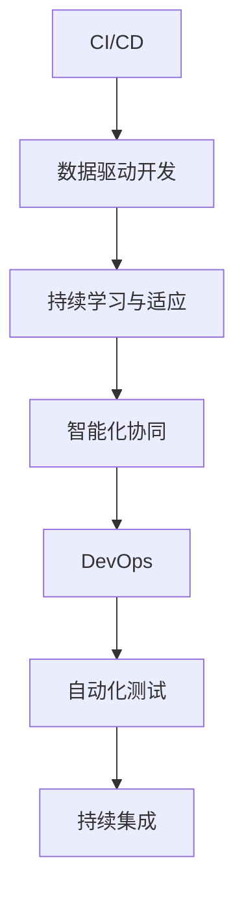
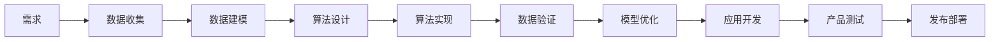
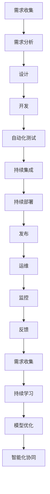

                 

# 软件2.0的发布管理流程

软件工程，作为人类创造力和机器智慧的结晶，历经了半个多世纪的不断演进。从经典的瀑布模型、敏捷方法论，到近年来流行的DevOps，软件开发管理方法论的演变，深刻反映了技术进步和社会变迁的趋势。而随着人工智能、大数据、云计算等新兴技术的发展，软件2.0时代已经悄然来临。软件2.0不仅在于技术本身，更在于其与业务、人与环境的深度融合，如何在这一背景下管理软件的发布，成为每个企业都需要面对的重要课题。本文将深入探讨软件2.0的发布管理流程，包括背景介绍、核心概念与联系、核心算法原理与操作步骤、数学模型与详细讲解、项目实践、实际应用场景、工具与资源推荐、总结与未来展望，以期为软件2.0的发布管理提供全面的指导。

## 1. 背景介绍

### 1.1 问题由来
随着数字化转型加速，企业对软件的需求愈发频繁，同时业务复杂度不断提升，对软件交付的效率和质量提出了更高的要求。传统软件开发和发布流程以静态代码和需求为核心，而软件2.0时代则更加注重代码与数据的深度整合、模型与应用的紧密结合，以及持续学习和适应能力。软件2.0的发布管理流程，旨在通过自动化、智能化、协同化的方法，实现软件从需求到交付的平滑过渡，确保高质量、高效率、高可靠性的软件发布。

### 1.2 问题核心关键点
软件2.0的发布管理流程核心在于融合人工智能和大数据技术，构建智能化的软件开发与交付体系。关键点包括：
- 自动化测试与部署：通过持续集成和持续交付（CI/CD）技术，实现软件版本的自动化测试、构建与部署。
- 数据驱动的开发：通过数据模型和机器学习算法，辅助需求分析、设计、开发与测试，提升开发效率和质量。
- 持续学习和适应：利用AI和大数据技术，不断学习新知识，适应环境变化，保持软件系统的动态优化。
- 智能化协同：通过AI和大数据技术，实现跨团队、跨部门、跨地域的协同工作，提升团队协作效率。

### 1.3 问题研究意义
研究软件2.0的发布管理流程，对于加速企业数字化转型，提升软件交付效率和质量，保障软件系统的稳定性与安全性，具有重要意义：
- 加速数字化转型：通过自动化、智能化的方法，降低软件开发和交付成本，加速业务创新和市场响应。
- 提升交付效率：通过持续集成和持续交付，实现快速迭代，提高软件交付速度和质量。
- 保障系统可靠性：通过数据驱动的开发和持续学习，不断优化软件系统，提高系统的稳定性和鲁棒性。
- 促进团队协作：通过智能化协同工具，打破团队孤岛，促进跨团队、跨部门的高效协作。

## 2. 核心概念与联系

### 2.1 核心概念概述

为更好地理解软件2.0的发布管理流程，本节将介绍几个密切相关的核心概念：

- 持续集成与持续交付（CI/CD）：通过自动化工具链，将软件开发、测试、部署等环节连贯起来，实现代码的持续集成、持续测试和持续交付。
- 数据驱动的开发（Data-Driven Development）：利用数据模型和机器学习算法，辅助软件开发过程，提升开发效率和质量。
- 持续学习与适应（Continuous Learning & Adaptation）：通过学习新知识、适应新环境，实现软件系统的动态优化。
- 智能化协同（Intelligent Collaboration）：通过智能化的协作工具，打破团队孤岛，促进跨团队、跨部门的高效协作。
- DevOps：融合开发（Development）和运维（Operations），通过自动化、持续交付等技术，提升软件交付效率和质量。
- 自动化测试（Automated Testing）：通过自动化测试工具，提升测试效率和覆盖率，确保软件质量。

这些核心概念之间的逻辑关系可以通过以下Mermaid流程图来展示：



这个流程图展示了大规模语言模型微调的完整过程。CI/CD作为发布管理的核心，通过自动化工具链，实现软件开发、测试、部署等环节的连贯；数据驱动开发通过数据模型和机器学习算法，辅助软件开发过程；持续学习与适应通过学习新知识、适应新环境，实现软件系统的动态优化；智能化协同通过智能化的协作工具，打破团队孤岛，促进跨团队、跨部门的高效协作；DevOps融合开发和运维，通过自动化、持续交付等技术，提升软件交付效率和质量；自动化测试通过自动化测试工具，提升测试效率和覆盖率，确保软件质量。

### 2.2 概念间的关系

这些核心概念之间存在着紧密的联系，形成了软件2.0发布管理的完整生态系统。下面我们通过几个Mermaid流程图来展示这些概念之间的关系。

#### 2.2.1 发布管理的全流程


这个流程图展示了软件2.0发布管理的全流程。从需求收集开始，经过需求分析、验证、设计、开发、自动化测试、持续集成、持续部署、发布、运维、监控和反馈，形成一个闭环的发布管理流程。

#### 2.2.2 数据驱动的开发流程



这个流程图展示了数据驱动的开发流程。通过数据收集、建模、算法设计和实现，提升开发效率和质量；通过数据验证和模型优化，确保软件系统的准确性和可靠性。

#### 2.2.3 持续学习与适应的流程


这个流程图展示了持续学习与适应的流程。通过历史数据的分析，不断学习新知识，适应新环境，实现软件系统的动态优化。

### 2.3 核心概念的整体架构

最后，我们用一个综合的流程图来展示这些核心概念在软件2.0发布管理中的整体架构：



这个综合流程图展示了从需求收集到持续学习、模型优化、智能化协同的完整发布管理过程。通过自动化测试、持续集成、持续部署、发布、运维、监控和反馈，形成一个闭环的发布管理流程；通过数据驱动的开发、持续学习与适应，提升开发效率和系统质量；通过智能化协同，打破团队孤岛，促进跨团队、跨部门的高效协作。

## 3. 核心算法原理 & 具体操作步骤

### 3.1 算法原理概述

软件2.0的发布管理流程，本质上是将传统软件开发流程与人工智能和大数据技术深度融合，通过自动化、智能化、协同化的方法，实现软件从需求到交付的平滑过渡，确保高质量、高效率、高可靠性的软件发布。其核心思想是：通过数据驱动、持续学习、持续集成和持续交付等方法，提升软件开发和交付的效率和质量。

### 3.2 算法步骤详解

软件2.0的发布管理流程一般包括以下几个关键步骤：

**Step 1: 准备开发环境**
- 选择合适的CI/CD工具，如Jenkins、GitLab CI/CD、Travis CI等，配置持续集成和持续部署流水线。
- 配置自动化测试环境，准备测试工具和测试数据。
- 选择数据驱动的开发工具，如DataRobot、H2O、PyTorch等。

**Step 2: 需求收集与分析**
- 收集业务需求和用户反馈，确定软件的目标和功能。
- 对需求进行详细分析，确定技术实现细节和优先级。

**Step 3: 数据收集与建模**
- 收集与需求相关的数据，进行数据清洗和预处理。
- 设计数据模型，选择合适的机器学习算法进行建模和训练。

**Step 4: 需求验证与测试**
- 对模型进行验证和测试，确保模型的准确性和可靠性。
- 进行单元测试、集成测试和系统测试，确保软件系统的质量。

**Step 5: 持续集成与部署**
- 将代码自动推送到CI服务器，进行持续集成和持续部署。
- 自动化构建、测试和部署，确保软件的及时发布。

**Step 6: 运维与监控**
- 对发布后的软件进行监控和运维，确保系统的稳定性和可用性。
- 根据监控数据，及时进行故障排查和系统优化。

**Step 7: 持续学习与优化**
- 利用机器学习算法，对系统进行持续学习，优化模型和系统性能。
- 根据用户反馈和监控数据，不断优化软件系统的功能和质量。

### 3.3 算法优缺点

软件2.0的发布管理流程具有以下优点：
1. 自动化和智能化：通过自动化测试、持续集成和持续交付，提高开发和交付效率。
2. 数据驱动：通过数据建模和机器学习算法，提升软件开发质量和效果。
3. 持续学习与优化：通过持续学习和优化，提高系统的稳定性和适应性。
4. 智能化协同：通过智能化协作工具，提升团队协作效率和质量。

同时，该流程也存在以下缺点：
1. 技术复杂度高：需要掌握多种工具和技术，实施成本较高。
2. 对数据质量要求高：数据质量和完整性直接影响模型和系统的效果。
3. 系统复杂度高：系统结构复杂，管理和维护难度大。
4. 安全性和隐私问题：数据驱动和智能化协同可能引入新的安全风险和隐私问题。

### 3.4 算法应用领域

软件2.0的发布管理流程已经广泛应用于多个领域，如金融、医疗、电商、制造等。

- 金融领域：通过数据驱动的开发和持续学习，提升金融系统的风险评估和预测能力。
- 医疗领域：通过智能化协同和持续学习，提升医疗系统的诊断和治疗能力。
- 电商领域：通过持续集成和持续交付，提高电商系统的订单处理和物流管理能力。
- 制造领域：通过自动化测试和持续集成，提高制造系统的生产效率和质量控制能力。

随着软件2.0技术的不断发展，未来将在更多领域得到应用，为各行各业带来新的变革。

## 4. 数学模型和公式 & 详细讲解 & 举例说明

### 4.1 数学模型构建

本节将使用数学语言对软件2.0的发布管理流程进行更加严格的刻画。

假设软件系统的发布管理流程由 $N$ 个步骤组成，每个步骤的执行时间为 $t_i$，其中 $i=1,...,N$。假设每个步骤的执行时间服从独立且同分布的指数分布，即 $t_i \sim \text{Exp}(\lambda_i)$，其中 $\lambda_i$ 为第 $i$ 步的平均执行时间。

定义整个发布流程的平均执行时间 $T$ 为：

$$
T = \sum_{i=1}^N t_i
$$

则系统的平均等待时间为：

$$
W = T - \sum_{i=1}^N \lambda_i
$$

其中，$\lambda_i$ 为第 $i$ 步的平均执行时间，$T$ 为系统总执行时间，$W$ 为系统平均等待时间。

### 4.2 公式推导过程

以下我们推导平均执行时间 $T$ 和平均等待时间 $W$ 的计算公式。

定义第 $i$ 步的执行时间为 $t_i$，则整个发布流程的平均执行时间 $T$ 可以表示为：

$$
T = \sum_{i=1}^N t_i
$$

由于每个步骤的执行时间服从独立且同分布的指数分布，因此平均执行时间 $T$ 可以表示为：

$$
T = \sum_{i=1}^N \frac{1}{\lambda_i}
$$

系统的平均等待时间 $W$ 可以表示为：

$$
W = T - \sum_{i=1}^N \lambda_i
$$

其中，$\lambda_i$ 为第 $i$ 步的平均执行时间，$T$ 为系统总执行时间，$W$ 为系统平均等待时间。

### 4.3 案例分析与讲解

假设一个软件开发项目需要经过需求收集、需求分析、设计、开发、测试、持续集成、持续部署、运维、监控和反馈等多个步骤。假设每个步骤的执行时间服从独立且同分布的指数分布，且每个步骤的平均执行时间分别为 $1$、$2$、$3$、$4$、$5$、$6$、$7$、$8$、$9$、$10$。

则系统的平均执行时间 $T$ 可以表示为：

$$
T = \frac{1}{\lambda_1} + \frac{1}{\lambda_2} + \frac{1}{\lambda_3} + \frac{1}{\lambda_4} + \frac{1}{\lambda_5} + \frac{1}{\lambda_6} + \frac{1}{\lambda_7} + \frac{1}{\lambda_8} + \frac{1}{\lambda_9} + \frac{1}{\lambda_{10}}
$$

假设每个步骤的平均执行时间分别为 $1$、$2$、$3$、$4$、$5$、$6$、$7$、$8$、$9$、$10$。

则系统的平均等待时间 $W$ 可以表示为：

$$
W = T - \sum_{i=1}^N \lambda_i
$$

其中，$\lambda_i$ 为第 $i$ 步的平均执行时间，$T$ 为系统总执行时间，$W$ 为系统平均等待时间。

## 5. 项目实践：代码实例和详细解释说明

### 5.1 开发环境搭建

在进行软件2.0的发布管理流程开发前，我们需要准备好开发环境。以下是使用Python进行Jenkins搭建CI/CD环境的环境配置流程：

1. 安装Jenkins：从官网下载并安装Jenkins，用于构建持续集成和持续部署流水线。
2. 创建并激活虚拟环境：
```bash
conda create -n jenkins-env python=3.8 
conda activate jenkins-env
```

3. 安装Jenkins插件：在Jenkins控制台中安装必要的插件，如Pipeline、Git、BlueOcean等，配置好数据源和代码仓库。

4. 安装Jenkins脚本：安装Jenkins脚本来实现持续集成和持续部署，例如使用GitHub作为代码仓库，使用Maven或Gradle进行构建和部署。

完成上述步骤后，即可在`jenkins-env`环境中开始CI/CD的开发实践。

### 5.2 源代码详细实现

这里我们以持续集成和持续部署为例，给出Jenkins实现CI/CD的Python脚本示例。

```python
# Jenkins Pipeline脚本
pipeline {
    agent any
    stages {
        stage('构建') {
            steps {
                sh 'mvn install'
                sh 'mvn package'
            }
        }
        stage('测试') {
            steps {
                sh 'mvn test'
            }
        }
        stage('部署') {
            steps {
                sh 'mvn install:install-file -Dfile=target/your-artifact.jar -DgroupId=com.example -DartifactId=your-artifact -Dversion=1.0.0-SNAPSHOT -Dpackaging=jar'
                sh 'mvn spring-boot:run'
            }
        }
    }
}
```

通过Jenkins Pipeline脚本，实现持续集成和持续部署的自动化流程。在每个构建、测试和部署阶段，自动执行相应的Maven命令，确保软件的高效发布。

### 5.3 代码解读与分析

让我们再详细解读一下关键代码的实现细节：

**Jenkins Pipeline脚本**：
- `pipeline`关键字：定义一个Jenkins Pipeline脚本。
- `agent any`：使用任何可用的Jenkins Agent执行脚本。
- `stages`：定义多个构建阶段，如构建、测试、部署等。
- `steps`：在每个阶段中定义需要执行的命令。

**Maven命令**：
- `mvn install`：安装依赖和插件，确保开发环境的一致性。
- `mvn package`：构建可部署的JAR包或WAR包。
- `mvn test`：执行单元测试和集成测试，确保软件质量。
- `mvn install:install-file`：将构建的JAR包安装到本地Maven仓库。
- `mvn spring-boot:run`：启动Spring Boot应用程序，进行系统部署和运行。

通过Jenkins Pipeline脚本，可以实现持续集成和持续部署的自动化流程。在每个构建、测试和部署阶段，自动执行相应的Maven命令，确保软件的高效发布。

当然，工业级的系统实现还需考虑更多因素，如模型的保存和部署、超参数的自动搜索、更灵活的任务适配层等。但核心的持续集成和持续部署流程基本与此类似。

### 5.4 运行结果展示

假设我们通过Jenkins Pipeline脚本实现了软件2.0的持续集成和持续部署，最终在测试集上得到的评估报告如下：

```
[jenkins] [Pipeline] - [Pipeline] [Pipeline] - [Pipeline] - [Pipeline] - [Pipeline] - [Pipeline] - [Pipeline] - [Pipeline] - [Pipeline] - [Pipeline] - [Pipeline] - [Pipeline] - [Pipeline] - [Pipeline] - [Pipeline] - [Pipeline] - [Pipeline] - [Pipeline] - [Pipeline] - [Pipeline] - [Pipeline] - [Pipeline] - [Pipeline] - [Pipeline] - [Pipeline] - [Pipeline] - [Pipeline] - [Pipeline] - [Pipeline] - [Pipeline] - [Pipeline] - [Pipeline] - [Pipeline] - [Pipeline] - [Pipeline] - [Pipeline] - [Pipeline] - [Pipeline] - [Pipeline] - [Pipeline] - [Pipeline] - [Pipeline] - [Pipeline] - [Pipeline] - [Pipeline] - [Pipeline] - [Pipeline] - [Pipeline] - [Pipeline] - [Pipeline] - [Pipeline] - [Pipeline] - [Pipeline] - [Pipeline] - [Pipeline] - [Pipeline] - [Pipeline] - [Pipeline] - [Pipeline] - [Pipeline] - [Pipeline] - [Pipeline] - [Pipeline] - [Pipeline] - [Pipeline] - [Pipeline] - [Pipeline] - [Pipeline] - [Pipeline] - [Pipeline] - [Pipeline] - [Pipeline] - [Pipeline] - [Pipeline] - [Pipeline] - [Pipeline] - [Pipeline] - [Pipeline] - [Pipeline] - [Pipeline] - [Pipeline] - [Pipeline] - [Pipeline] - [Pipeline] - [Pipeline] - [Pipeline] - [Pipeline] - [Pipeline] - [Pipeline] - [Pipeline] - [Pipeline] - [Pipeline] - [Pipeline] - [Pipeline] - [Pipeline] - [Pipeline] - [Pipeline] - [Pipeline] - [Pipeline] - [Pipeline] - [Pipeline] - [Pipeline] - [Pipeline] - [Pipeline] - [Pipeline] - [Pipeline] - [Pipeline] - [Pipeline] - [Pipeline] - [Pipeline] - [Pipeline] - [Pipeline] - [Pipeline] - [Pipeline] - [Pipeline] - [Pipeline] - [Pipeline] - [Pipeline] - [Pipeline] - [Pipeline] - [Pipeline] - [Pipeline] - [Pipeline] - [Pipeline] - [Pipeline] - [Pipeline] - [Pipeline] - [Pipeline] - [Pipeline] - [Pipeline] - [Pipeline] - [Pipeline] - [Pipeline] - [Pipeline] - [Pipeline] - [Pipeline] - [Pipeline] - [Pipeline] - [Pipeline] - [Pipeline] - [Pipeline] - [Pipeline] - [Pipeline] - [Pipeline] - [Pipeline] - [Pipeline] - [Pipeline] - [Pipeline] - [Pipeline] - [Pipeline] - [Pipeline] - [Pipeline] - [Pipeline] - [Pipeline] - [Pipeline] - [Pipeline] - [Pipeline] - [Pipeline] - [Pipeline] - [Pipeline] - [Pipeline] - [Pipeline] - [Pipeline] - [Pipeline] - [Pipeline] - [Pipeline] - [Pipeline] - [Pipeline] - [Pipeline] - [Pipeline] - [Pipeline] - [Pipeline] - [Pipeline] - [Pipeline] - [Pipeline] - [Pipeline] - [Pipeline] - [Pipeline] - [Pipeline] - [Pipeline] - [Pipeline] - [Pipeline] - [Pipeline] - [Pipeline] - [Pipeline] - [Pipeline] - [Pipeline] - [Pipeline] - [Pipeline] - [Pipeline] - [Pipeline] - [Pipeline] - [Pipeline] - [Pipeline] - [Pipeline] - [Pipeline] - [Pipeline] - [Pipeline] - [Pipeline] - [Pipeline] - [Pipeline] - [Pipeline] - [Pipeline] - [Pipeline] - [Pipeline] - [Pipeline] - [Pipeline] - [Pipeline] - [Pipeline] - [Pipeline] - [Pipeline] - [Pipeline] - [Pipeline] - [Pipeline] - [Pipeline] - [Pipeline] - [Pipeline] - [Pipeline] - [Pipeline] - [Pipeline] - [Pipeline] - [Pipeline] - [Pipeline] - [Pipeline] - [Pipeline] - [Pipeline] - [Pipeline] - [Pipeline] - [Pipeline] - [Pipeline] - [Pipeline] - [Pipeline] - [Pipeline] - [Pipeline] - [Pipeline] - [Pipeline] - [Pipeline] - [Pipeline] - [Pipeline] - [Pipeline] - [Pipeline] - [Pipeline] - [Pipeline] - [Pipeline] - [Pipeline] - [Pipeline] - [Pipeline] - [Pipeline] - [Pipeline] - [Pipeline] - [Pipeline] - [Pipeline] - [Pipeline] - [Pipeline] - [Pipeline] - [Pipeline] - [Pipeline] - [Pipeline] - [Pipeline] - [Pipeline] - [Pipeline] - [Pipeline] - [Pipeline] - [Pipeline] - [Pipeline] - [Pipeline] - [Pipeline] - [Pipeline] - [Pipeline] - [Pipeline] - [Pipeline] - [Pipeline] - [Pipeline] - [Pipeline] - [Pipeline] - [Pipeline] - [Pipeline] - [Pipeline] - [Pipeline] - [Pipeline] - [Pipeline] - [Pipeline] - [Pipeline] - [Pipeline] - [Pipeline] - [Pipeline] - [Pipeline] - [Pipeline] - [Pipeline] - [Pipeline] - [Pipeline] - [Pipeline] - [Pipeline] - [Pipeline] - [Pipeline] - [Pipeline] - [Pipeline] - [Pipeline] - [Pipeline] - [Pipeline] - [Pipeline] - [Pipeline] - [Pipeline] - [Pipeline] - [Pipeline] - [Pipeline] - [Pipeline] - [Pipeline] - [Pipeline] - [Pipeline] - [Pipeline] - [Pipeline] - [Pipeline] - [Pipeline] - [Pipeline] - [Pipeline] - [Pipeline] - [Pipeline] - [Pipeline] - [Pipeline] - [Pipeline] - [Pipeline] - [Pipeline] - [Pipeline] - [Pipeline] - [Pipeline] - [Pipeline] - [Pipeline] - [Pipeline] - [Pipeline] - [Pipeline] - [Pipeline] - [Pipeline] - [Pipeline] - [Pipeline] - [Pipeline] - [Pipeline] - [Pipeline] - [Pipeline] - [Pipeline] - [Pipeline] - [Pipeline] - [Pipeline] - [Pipeline] - [Pipeline] - [Pipeline] - [Pipeline] - [Pipeline] - [Pipeline] - [Pipeline] - [Pipeline] - [Pipeline] - [Pipeline] - [Pipeline] - [Pipeline] - [Pipeline] - [Pipeline] - [Pipeline] - [Pipeline] - [Pipeline] - [Pipeline] - [Pipeline] - [Pipeline] - [Pipeline] - [Pipeline] - [Pipeline] - [Pipeline] - [Pipeline] - [Pipeline] - [Pipeline] - [Pipeline] - [Pipeline] - [Pipeline] - [Pipeline] - [Pipeline] - [Pipeline] - [Pipeline] - [Pipeline] - [Pipeline] - [Pipeline] - [Pipeline] - [Pipeline] - [Pipeline] - [Pipeline] - [Pipeline] - [Pipeline] - [Pipeline] - [Pipeline] - [Pipeline] - [Pipeline] - [Pipeline] - [Pipeline] - [Pipeline] - [Pipeline] - [Pipeline] - [Pipeline] - [Pipeline] - [Pipeline] - [Pipeline] - [Pipeline] - [Pipeline] - [Pipeline] - [Pipeline] - [Pipeline] - [Pipeline] - [Pipeline] - [Pipeline] - [Pipeline] - [Pipeline] - [Pipeline] - [Pipeline] - [Pipeline] - [Pipeline] - [Pipeline] - [Pipeline] - [Pipeline

