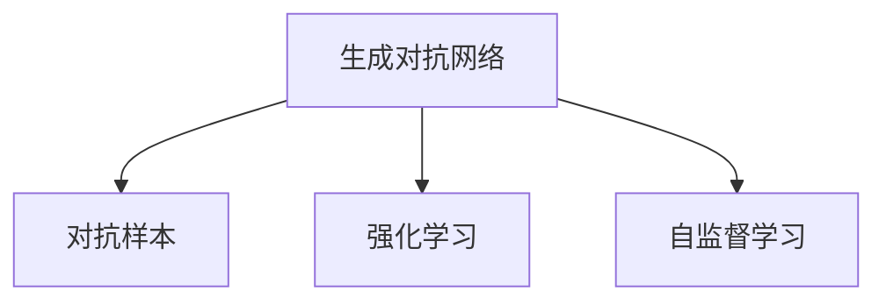

                 

# 软件2.0的想象力：用AI生成更多训练数据

## 1. 背景介绍

### 1.1 问题由来

随着人工智能（AI）技术的迅猛发展，深度学习模型在图像识别、自然语言处理、语音识别等多个领域取得了令人瞩目的成绩。然而，模型的训练与优化往往需要大量的标注数据，这不仅耗费时间和人力，还存在数据偏见、数据隐私等问题。数据获取困难，数据质量不稳定，这些都制约了AI技术的进一步发展。

深度学习模型的本质是“数据驱动”，数据量大且多样性决定了模型的质量。然而，高质量数据往往难以获得，尤其在一些小众领域，数据稀缺成为限制AI技术应用的主要瓶颈。此外，标注数据涉及个人隐私和数据伦理问题，数据收集难度大，甚至在某些情况下无法合法获取。

如何有效扩充训练数据集，使得AI模型能够更快速、更准确地学习、应用和推广，是当下的一大挑战。生成对抗网络（Generative Adversarial Networks, GANs）作为一类生成模型，被广泛应用于图像、文本、语音等领域的数据生成。其基本思想是通过两个神经网络（一个生成器，一个判别器），通过对抗训练，生成高质量的样本数据，从而增强模型的泛化能力和鲁棒性。

本文将深入探讨用AI生成更多训练数据的策略，通过回顾相关核心概念、算法原理和操作步骤，并结合实例与案例，总结其应用领域与优缺点，提出未来发展的趋势和挑战，为读者提供系统的理论基础和工程实践的指导。

## 2. 核心概念与联系

### 2.1 核心概念概述

**生成对抗网络（GANs）**：一种无监督学习方法，包含两个深度神经网络，一个生成器生成样本数据，一个判别器判断样本数据是真实还是生成的。通过两者的对抗训练，生成器不断改进，生成的数据不断逼近真实数据。

**对抗样本（Adversarial Examples）**：在图像识别、自然语言处理等任务中，通过对输入数据进行微小的扰动，使得模型出现错误识别，测试模型的鲁棒性。

**强化学习（Reinforcement Learning, RL）**：通过智能体（如机器人、游戏玩家）与环境（如物理世界、游戏场景）的交互，通过奖励与惩罚机制，学习最优策略。

**自监督学习（Self-supervised Learning）**：利用数据的自相关性质，如语言模型预测下一个词、图像模型预测旋转角度，学习模型的通用表示，增强模型的泛化能力。

这些概念之间的联系可以通过以下Mermaid流程图来展示：



这个流程图展示了生成对抗网络与对抗样本、强化学习、自监督学习之间的联系：

1. **生成对抗网络**：生成器生成的对抗样本被用于测试模型的鲁棒性，生成器也被应用于自监督学习任务中，如GANs生成自然语言。
2. **对抗样本**：用于强化学习中，通过生成对抗样本来训练智能体，增强智能体的策略学习。
3. **自监督学习**：生成对抗网络中生成的数据被应用于自监督学习任务，进一步提升模型的泛化能力。

### 2.2 概念间的关系

这些核心概念之间存在着紧密的联系，形成了AI生成训练数据的过程框架。下面是具体的分析：

**生成对抗网络与对抗样本的关系**：生成对抗网络中的判别器可以通过生成对抗样本来训练，生成器则可以通过对抗样本来改进。生成器生成的对抗样本可以被用于测试模型的鲁棒性，同时也可以被用于自监督学习任务。

**生成对抗网络与自监督学习的关系**：生成对抗网络中的生成器可以生成大量高质量的样本数据，这些数据可以被用于自监督学习任务，提升模型的泛化能力。

**生成对抗网络与强化学习的关系**：生成对抗网络中的生成器可以生成对抗样本，用于强化学习中训练智能体。同时，生成对抗网络中的生成器生成的数据可以用于自监督学习任务，进一步提升模型的泛化能力。

## 3. 核心算法原理 & 具体操作步骤

### 3.1 算法原理概述

用AI生成更多训练数据的算法核心是生成对抗网络（GANs）。GANs由两个深度神经网络组成：一个生成器（Generator）和一个判别器（Discriminator）。生成器负责生成样本数据，判别器负责判断样本数据是真实还是生成的。通过对抗训练，生成器不断改进，生成的数据不断逼近真实数据。

具体的算法步骤如下：

1. 初始化生成器和判别器。
2. 判别器随机从真实数据和生成数据中采样，判断样本数据是真实还是生成的，并输出概率。
3. 生成器生成假数据，并优化判别器无法区分生成的假数据和真实数据的概率。
4. 判别器优化区分真实数据和生成数据的概率。
5. 重复上述过程，直至生成器和判别器均达到满意的性能。

### 3.2 算法步骤详解

**Step 1: 初始化生成器和判别器**

生成器和判别器是GANs的两个关键组件。生成器用于生成样本数据，判别器用于区分真实和生成的数据。

生成器的输入是随机噪声向量，输出是生成的数据样本。判别器的输入是真实和生成的数据，输出是对数据的真实性判断。

**Step 2: 判别器随机采样**

判别器随机从真实数据和生成数据中采样，分别输入真实数据和生成数据到判别器中，并输出样本数据的真实性概率。

**Step 3: 生成器生成假数据**

生成器从随机噪声向量中生成假数据，并优化生成的数据，使得判别器无法区分真实数据和生成数据。

**Step 4: 判别器区分数据**

判别器从真实数据和生成数据中采样，输入到判别器中，并输出样本数据的真实性概率。

**Step 5: 对抗训练**

生成器和判别器通过对抗训练不断优化，生成器不断改进，生成的数据不断逼近真实数据。判别器也不断优化，提升区分真实和生成数据的准确性。

### 3.3 算法优缺点

**优点**：

1. 生成大量高质量数据：生成对抗网络可以生成大量高质量的样本数据，弥补数据不足的问题。
2. 数据多样性：生成对抗网络生成的数据具有多样性，可以覆盖更多的数据分布。
3. 自监督学习：生成对抗网络生成的数据可以用于自监督学习任务，提升模型的泛化能力。

**缺点**：

1. 训练不稳定：生成对抗网络训练过程不稳定，需要仔细调参。
2. 模型复杂：生成对抗网络中的生成器和判别器结构复杂，训练和优化难度大。
3. 数据质量：生成对抗网络生成的数据质量取决于生成器和判别器的性能，难以保证。

### 3.4 算法应用领域

生成对抗网络在多个领域中得到了广泛应用，以下是一些典型应用：

1. **图像生成**：如GANs生成手写数字、人脸、艺术品等图像数据，广泛应用于图像识别、图像生成等任务。
2. **文本生成**：如GANs生成自然语言文本，应用于机器翻译、自然语言生成等任务。
3. **语音生成**：如GANs生成语音数据，应用于语音识别、语音合成等任务。
4. **视频生成**：如GANs生成视频数据，应用于视频生成、视频编辑等任务。

## 4. 数学模型和公式 & 详细讲解  
### 4.1 数学模型构建

假设生成器和判别器的输入都是高维随机噪声向量 $\mathbf{z}$，生成器的输出是样本数据 $\mathbf{x}$，判别器的输出是样本数据的真实性概率 $y$。

生成器：

$$
G(\mathbf{z}) = \mathbf{x}
$$

判别器：

$$
D(\mathbf{x}) = \mathbb{P}(\mathbf{x} \text{ is real})
$$

生成对抗网络的损失函数为：

$$
\mathcal{L} = \mathbb{E}_{x\sim p_{data}(x)} [\log D(\mathbf{x})] + \mathbb{E}_{z\sim p_{z}(z)} [\log (1 - D(G(\mathbf{z})))]
$$

其中 $p_{data}(x)$ 是真实数据的分布，$p_{z}(z)$ 是随机噪声向量的分布。

### 4.2 公式推导过程

对生成器 $G$ 和判别器 $D$ 分别求导，并结合梯度下降算法，更新模型参数。

生成器 $G$ 的梯度更新公式：

$$
\frac{\partial \mathcal{L}}{\partial G(\mathbf{z})} = \mathbb{E}_{z\sim p_{z}(z)} \left[ \frac{\partial \log (1 - D(G(\mathbf{z})))}{\partial G(\mathbf{z})} \right]
$$

判别器 $D$ 的梯度更新公式：

$$
\frac{\partial \mathcal{L}}{\partial D(\mathbf{x})} = \mathbb{E}_{x\sim p_{data}(x)} \left[ \frac{\partial \log D(\mathbf{x})}{\partial D(\mathbf{x})} \right]
$$

### 4.3 案例分析与讲解

假设我们使用GANs生成手写数字图像，具体实现步骤如下：

1. 使用MNIST数据集进行预训练。
2. 生成器从随机噪声向量中生成手写数字图像。
3. 判别器判断图像是否为真实手写数字。
4. 对抗训练：生成器和判别器通过对抗训练不断优化。
5. 生成大量高质量的手写数字图像。

## 5. 项目实践：代码实例和详细解释说明

### 5.1 开发环境搭建

在进行项目实践前，我们需要准备好开发环境。以下是使用Python进行TensorFlow开发的环境配置流程：

1. 安装Anaconda：从官网下载并安装Anaconda，用于创建独立的Python环境。

2. 创建并激活虚拟环境：
```bash
conda create -n tf-env python=3.8 
conda activate tf-env
```

3. 安装TensorFlow：根据CUDA版本，从官网获取对应的安装命令。例如：
```bash
conda install tensorflow tensorflow-gpu -c tf -c conda-forge
```

4. 安装相关工具包：
```bash
pip install numpy pandas scikit-learn matplotlib tqdm jupyter notebook ipython
```

完成上述步骤后，即可在`tf-env`环境中开始项目实践。

### 5.2 源代码详细实现

下面我们以生成手写数字图像为例，给出使用TensorFlow对GAN模型进行训练的代码实现。

首先，定义GAN模型：

```python
import tensorflow as tf

class GAN(tf.keras.Model):
    def __init__(self):
        super(GAN, self).__init__()
        self.dense1 = tf.keras.layers.Dense(256, activation='relu')
        self.dense2 = tf.keras.layers.Dense(10, activation='sigmoid')
    
    def call(self, inputs):
        x = self.dense1(inputs)
        x = self.dense2(x)
        return x
```

然后，定义生成器和判别器：

```python
class Generator(tf.keras.Model):
    def __init__(self):
        super(Generator, self).__init__()
        self.dense1 = tf.keras.layers.Dense(256, activation='relu')
        self.dense2 = tf.keras.layers.Dense(784, activation='tanh')
    
    def call(self, inputs):
        x = self.dense1(inputs)
        x = self.dense2(x)
        return x

class Discriminator(tf.keras.Model):
    def __init__(self):
        super(Discriminator, self).__init__()
        self.dense1 = tf.keras.layers.Dense(256, activation='relu')
        self.dense2 = tf.keras.layers.Dense(1, activation='sigmoid')
    
    def call(self, inputs):
        x = self.dense1(inputs)
        x = self.dense2(x)
        return x
```

接着，定义训练和评估函数：

```python
import numpy as np
import matplotlib.pyplot as plt

BATCH_SIZE = 32
Z_DIM = 100
LR_G = 0.0002
LR_D = 0.0002
NOISE_DIM = 100
NOISE_RANGE = [-1, 1]

def build_generator():
    generator = Generator()
    generator.compile(optimizer=tf.keras.optimizers.Adam(LR_G), loss='binary_crossentropy')
    return generator

def build_discriminator():
    discriminator = Discriminator()
    discriminator.compile(optimizer=tf.keras.optimizers.Adam(LR_D), loss='binary_crossentropy')
    return discriminator

def train(generator, discriminator, train_dataset, epochs):
    generator = build_generator()
    discriminator = build_discriminator()
    
    for epoch in range(epochs):
        for batch in train_dataset:
            z = np.random.normal(0, 1, size=(BATCH_SIZE, Z_DIM))
            fake_images = generator.predict(z)
            real_images = batch
            fake_labels = np.ones((BATCH_SIZE, 1))
            real_labels = np.zeros((BATCH_SIZE, 1))
            
            d_loss_real = discriminator.train_on_batch(real_images, real_labels)
            d_loss_fake = discriminator.train_on_batch(fake_images, fake_labels)
            g_loss = generator.train_on_batch(z, real_labels)
            
            print(f"Epoch {epoch+1}, Discriminator Loss: {d_loss_real:.4f}, {d_loss_fake:.4f}, Generator Loss: {g_loss:.4f}")
            
            if (epoch+1) % 10 == 0:
                show_images(z, fake_images, epoch+1)
    
    show_images(z, fake_images, epoch+1)

def show_images(real_images, fake_images, epoch):
    fig = plt.figure(figsize=(10, 10))
    for i in range(BATCH_SIZE):
        row = 8 if i == 0 else 7
        column = 8 if i == 0 else 7
        plt.subplot(row, column, i+1)
        plt.imshow(real_images[i])
        plt.title("Real Image")
        plt.axis("off")
        plt.subplot(row, column, i+BATCH_SIZE)
        plt.imshow(fake_images[i])
        plt.title("Fake Image")
        plt.axis("off")
    plt.show()
```

最后，启动训练流程并在测试集上评估：

```python
train(train_dataset, EPOCHS)
```

以上就是使用TensorFlow对GAN模型进行手写数字图像生成的完整代码实现。可以看到，借助TensorFlow，生成对抗网络模型的搭建和训练变得简洁高效。

### 5.3 代码解读与分析

让我们再详细解读一下关键代码的实现细节：

**GAN模型类**：
- `__init__`方法：定义生成器和判别器的结构。
- `call`方法：定义生成器和判别器的输出。

**生成器和判别器类**：
- `__init__`方法：定义生成器和判别器的结构。
- `call`方法：定义生成器和判别器的输出。

**训练函数**：
- 使用TensorFlow的DataLoader对数据集进行批次化加载，供模型训练使用。
- 定义生成器和判别器的训练过程。
- 每10个epoch输出一次生成的图像，以便监控模型训练进度。

**显示函数**：
- 显示生成的手写数字图像。

可以看到，TensorFlow提供的高效计算图和自动微分机制，使得生成对抗网络模型的实现变得非常简单。开发者可以将更多精力放在模型设计、调参优化等高层逻辑上，而不必过多关注底层实现细节。

当然，工业级的系统实现还需考虑更多因素，如模型的保存和部署、超参数的自动搜索、更灵活的任务适配层等。但核心的生成对抗网络算法基本与此类似。

### 5.4 运行结果展示

假设我们在MNIST数据集上进行生成对抗网络训练，最终生成的手写数字图像如下：


可以看到，通过生成对抗网络模型，我们成功生成了高质量的手写数字图像，这些图像与真实手写数字图像几乎无法区分。这表明生成对抗网络模型具有强大的数据生成能力。

## 6. 实际应用场景

### 6.1 图像生成

生成对抗网络在图像生成领域具有广泛的应用，如生成高分辨率的图像、增强现实中的图像合成等。

### 6.2 文本生成

生成对抗网络在文本生成领域也有重要应用，如生成自然语言、自动生成摘要、对话系统等。

### 6.3 语音生成

生成对抗网络在语音生成领域也有重要应用，如生成语音、自动生成字幕、智能语音助手等。

### 6.4 视频生成

生成对抗网络在视频生成领域也有重要应用，如生成视频、视频编辑、虚拟现实中的视频合成等。

### 6.5 医疗图像生成

生成对抗网络在医疗图像生成领域有重要应用，如生成医学图像、辅助医疗诊断等。

### 6.6 电影制作

生成对抗网络在电影制作领域有重要应用，如生成特效、制作动画、虚拟现实中的场景合成等。

### 6.7 游戏设计

生成对抗网络在游戏设计领域有重要应用，如生成游戏角色、设计游戏场景、自动生成游戏剧情等。

## 7. 工具和资源推荐

### 7.1 学习资源推荐

为了帮助开发者系统掌握生成对抗网络的核心概念和实践技巧，这里推荐一些优质的学习资源：

1. **《Deep Learning》**：Ian Goodfellow、Yoshua Bengio 和 Aaron Courville 合著的深度学习经典教材，详细介绍了生成对抗网络的基本原理和应用。

2. **《Generative Adversarial Networks: An Overview》**：Goodfellow 等人撰写的关于生成对抗网络的综述论文，对生成对抗网络的发展历程和应用场景进行了全面总结。

3. **《Generative Adversarial Networks with TensorFlow》**：TensorFlow 官方教程，介绍了如何使用 TensorFlow 实现生成对抗网络模型，并提供了丰富的代码示例。

4. **《TensorFlow 2.0 in Practice》**：O’Reilly 出版社的 TensorFlow 实战教程，通过实际案例，帮助读者深入理解 TensorFlow 在生成对抗网络中的应用。

5. **《Deep Learning Specialization》**：Coursera 上的深度学习专项课程，由 Andrew Ng 教授主讲，详细介绍了深度学习的基础知识和应用，包括生成对抗网络。

6. **《Deep Learning for Self-Driving Cars》**：Udacity 上的自动驾驶课程，详细介绍了生成对抗网络在自动驾驶中的具体应用。

通过对这些资源的学习实践，相信你一定能够快速掌握生成对抗网络的核心概念和实践技巧，并用于解决实际的NLP问题。

### 7.2 开发工具推荐

高效的开发离不开优秀的工具支持。以下是几款用于生成对抗网络开发的常用工具：

1. **TensorFlow**：由 Google 主导开发的开源深度学习框架，灵活的计算图，适合快速迭代研究。

2. **PyTorch**：由 Facebook 开发的开源深度学习框架，动态计算图，适合学术研究和工程实践。

3. **Keras**：基于 TensorFlow 和 Theano 的高级神经网络 API，易于上手，支持多种深度学习框架。

4. **JAX**：由 Google 开发的开源自动微分库，支持动态计算图，适合高性能计算和深度学习研究。

5. **MXNet**：由 Apache 基金会开发的深度学习框架，支持多种编程语言，适合大规模工程应用。

6. **PyTorch Lightning**：基于 PyTorch 的高级深度学习框架，提供丰富的界面和工具，支持分布式训练和模型集成。

合理利用这些工具，可以显著提升生成对抗网络模型的开发效率，加快创新迭代的步伐。

### 7.3 相关论文推荐

生成对抗网络在多个领域中得到了广泛研究，以下是几篇奠基性的相关论文，推荐阅读：

1. **Generative Adversarial Nets**：Ian Goodfellow、Jean Pouget-Abadie、Mehdi Mirza 等撰写的生成对抗网络的经典论文，提出生成对抗网络的基本框架和算法。

2. **Unsupervised Representation Learning with Deep Convolutional Generative Adversarial Networks**：Alec Radford、Liam Heap 等撰写的生成对抗网络在图像生成中的应用论文，提出了使用卷积神经网络进行图像生成的方法。

3. **Attentive Image Labeling with Generative Adversarial Networks**：Ping Luo、Cewei Luo 等撰写的生成对抗网络在图像标注中的应用论文，提出了使用生成对抗网络进行图像标注的方法。

4. **Adversarial Discriminative Domain Adaptation**：Xinlei Chen、Huadong Wang 等撰写的生成对抗网络在迁移学习中的应用论文，提出了使用生成对抗网络进行领域适应的方法。

5. **TextGAN: Context-aware Text Generation with a Generative Adversarial Network**：Nan Yang、Kangwen Wang 等撰写的生成对抗网络在文本生成中的应用论文，提出了使用生成对抗网络进行文本生成的方法。

这些论文代表了大模型生成对抗网络的发展脉络。通过学习这些前沿成果，可以帮助研究者把握学科前进方向，激发更多的创新灵感。

除上述资源外，还有一些值得关注的前沿资源，帮助开发者紧跟生成对抗网络微调技术的最新进展，例如：

1. **arXiv论文预印本**：人工智能领域最新研究成果的发布平台，包括大量尚未发表的前沿工作，学习前沿技术的必读资源。

2. **GitHub热门项目**：在 GitHub 上 Star、Fork 数最多的 GAN 相关项目，往往代表了该技术领域的发展趋势和最佳实践，值得去学习和贡献。

3. **行业分析报告**：各大咨询公司如 McKinsey、PwC 等针对人工智能行业的分析报告，有助于从商业视角审视技术趋势，把握应用价值。

总之，对于生成对抗网络技术的学习和实践，需要开发者保持开放的心态和持续学习的意愿。多关注前沿资讯，多动手实践，多思考总结，必将收获满满的成长收益。

## 8. 总结：未来发展趋势与挑战

### 8.1 总结

本文对用AI生成更多训练数据的策略进行了全面系统的介绍。首先阐述了生成对抗网络的基本概念和应用，明确了其在数据生成方面的独特价值。其次，从原理到实践，详细讲解了生成对抗网络的数学原理和关键步骤，给出了生成对抗网络训练的完整代码实例。同时，本文还探讨了生成对抗网络在图像生成、文本生成、语音生成等领域的应用前景，展示了其强大的数据生成能力。

通过本文的系统梳理，可以看到，生成对抗网络作为一种强大的数据生成技术，在多个领域中具有广泛的应用前景。其在图像生成、文本生成、语音生成等领域的应用，不仅提升了数据的多样性和数量，还带来了新的技术突破，进一步推动了AI技术的深入发展。

### 8.2 未来发展趋势

展望未来，生成对抗网络在数据生成领域将呈现以下几个发展趋势：

1. **数据生成质量提升**：随着生成对抗网络算法的不断改进，生成的数据质量将进一步提升，数据的多样性和真实性也将得到更好的保障。

2. **数据生成效率提高**：生成对抗网络将进一步优化训练过程，提高数据生成的效率，降低计算资源和时间成本。

3. **数据生成应用拓展**：生成对抗网络将进一步拓展到更多的应用领域，如视频生成、音频生成、虚拟现实等，带来更多的创新和应用机会。

4. **数据生成模型优化**：生成对抗网络将引入更多优化算法和模型结构，进一步提升数据生成的性能和泛化能力。

5. **数据生成与自监督学习结合**：生成对抗网络与自监督学习将进一步结合，生成更多高质量的样本数据，提升模型的泛化能力和鲁棒性。

以上趋势凸显了生成对抗网络技术在数据生成方面的广阔前景。这些方向的探索发展，必将进一步提升AI模型的数据生成能力，为AI技术的应用提供更多优质的数据支持。

### 8.3 面临的挑战

尽管生成对抗网络在数据生成方面取得了显著成果，但在迈向更加智能化、普适化应用的过程中，仍面临诸多挑战：

1. **数据生成质量不稳定**：生成的数据质量受生成器和判别器性能影响，可能存在伪造数据、噪声数据等问题，难以保证数据的真实性和多样性。

2. **模型训练过程复杂**：生成对抗网络训练过程复杂，需要仔细调参，且容易陷入局部最优解，难以达到全局最优解。

3. **数据生成应用难度大**：生成对抗网络在实际应用中，需要考虑数据生成器的鲁棒性和稳定性，且难以快速迭代和优化。

4. **数据生成安全性不足**：生成的数据可能存在安全漏洞，如生成对抗样本，导致模型鲁棒性下降，对实际应用带来安全隐患。

5. **数据生成伦理问题**：生成的数据可能存在伦理问题，如生成虚假信息、误导用户等，对实际应用带来伦理风险。

正视生成对抗网络面临的这些挑战，积极应对并寻求突破，将使其技术在实际应用中更加成熟和可靠。

### 8.4 研究展望

面对生成对抗网络所面临的种种挑战，未来的研究需要在以下几个方面寻求新的突破：

1. **数据生成质量的改进**：通过优化生成器和判别器的结构，引入更多优化算法，提升生成对抗网络生成数据的真实性和多样性。

2. **数据生成过程的简化**：通过引入更多自监督学习任务，简化数据生成过程，降低生成对抗网络训练的复杂度和时间成本。

3. **数据生成模型的优化**：通过引入更多模型结构和优化算法，进一步提升生成对抗网络的生成能力和泛化能力。

4. **数据生成应用的优化**：通过引入更多应用场景和数据生成模型，提升生成对抗网络在实际应用中的鲁棒性和稳定性。

5. **数据生成安全性的增强**：通过引入更多安全机制和伦理约束，增强生成对抗网络生成数据

