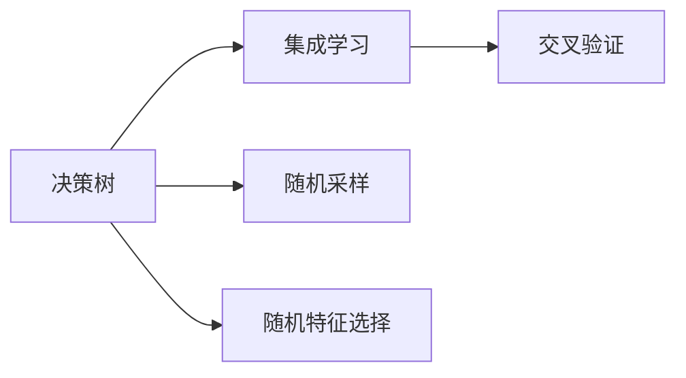
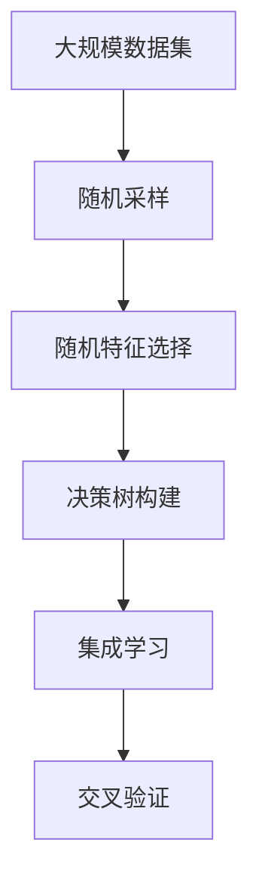

                 

## 1. 背景介绍

### 1.1 问题由来
在数据科学和机器学习领域，构建高效准确的预测模型一直是重要的研究课题。传统的统计模型如线性回归、逻辑回归等，虽然模型简单、易于理解，但在面对复杂多变的数据时，往往难以捕捉数据间的复杂非线性关系。此外，统计模型对于异常点和噪声数据也很敏感，容易受到数据分布变化的影响。

为了应对这些挑战，随机森林（Random Forest, RF）作为一种基于决策树的集成学习方法应运而生。随机森林由许多个决策树组成，通过随机采样和随机特征选择，构建一个综合了多个决策树预测结果的集成模型，从而在保证模型可解释性的同时，提升模型的预测准确度和泛化能力。

### 1.2 问题核心关键点
随机森林作为集成学习方法中的一种，其核心思想是通过多个弱分类器的组合，构建出一个强分类器，从而提升模型的泛化能力和鲁棒性。随机森林的核心关键点包括：
- 随机采样（Bootstrap Sampling）：从训练集中有放回地随机抽取样本，构建每棵决策树的训练集。
- 随机特征选择（Random Feature Selection）：每次从所有特征中随机选取一部分特征，用于构建决策树。
- 集成学习（Ensemble Learning）：通过平均或投票等方式，将多个决策树的预测结果进行集成，得到最终的预测结果。

这些关键技术使得随机森林成为一种鲁棒性强、泛化能力优的机器学习模型，适用于各种数据类型和应用场景。

### 1.3 问题研究意义
随机森林作为一种经典且广泛使用的集成学习方法，对机器学习理论和实践都有重要意义：
1. 提升预测准确度：通过集成多个弱分类器，随机森林能够有效减少过拟合，提升模型的泛化能力，从而在实际应用中取得更好的预测效果。
2. 鲁棒性强：随机森林对于异常值和噪声数据具有较好的容忍性，能够处理高维度、复杂的数据。
3. 可解释性强：每棵决策树都是一个独立的预测器，可以通过查看树的分类结果，了解模型的内部工作机制。
4. 易于实现：与其他复杂集成学习方法相比，随机森林的实现过程相对简单，容易上手。

基于随机森林的理论和实践经验，可以帮助研究者更好地理解集成学习的基本原理，从而在更复杂的机器学习问题中，设计出更高效、稳定的集成模型。

## 2. 核心概念与联系

### 2.1 核心概念概述

为了更好地理解随机森林的原理和架构，本节将介绍几个密切相关的核心概念：

- 决策树（Decision Tree）：一种基于树形结构的分类器，通过对数据进行递归分割，生成一系列规则，最终将数据分类到不同的类别中。
- 集成学习（Ensemble Learning）：通过将多个分类器组合在一起，构建一个更强的分类器，从而提升模型的预测性能。
- 随机采样（Bootstrap Sampling）：有放回地从训练集中随机抽取样本，用于构建每棵决策树的训练集。
- 随机特征选择（Random Feature Selection）：每次从所有特征中随机选取一部分特征，用于构建决策树。
- 交叉验证（Cross-Validation）：用于评估模型性能的一种数据分割方法，将数据集分成若干子集，用于训练和验证。

这些核心概念之间存在着紧密的联系，构成了随机森林的基本框架。以下通过Mermaid流程图展示这些概念之间的关系：



这个流程图展示了几大核心概念之间的逻辑关系：

1. 每棵决策树都是从随机采样得到的训练集上构建的。
2. 随机特征选择用于每棵决策树的特征选择，以减少特征维度，提升模型的泛化能力。
3. 集成学习通过组合多个决策树的预测结果，构建出一个更强的预测器。
4. 交叉验证用于评估模型的性能，避免过拟合。

### 2.2 概念间的关系

这些核心概念之间存在着紧密的联系，形成了随机森林的学习框架。以下是一些更具体的概念间关系：

#### 2.2.1 决策树的构建

随机森林的每棵决策树都是基于决策树算法构建的。决策树通过递归分割数据，生成一系列规则，最终将数据分类到不同的类别中。决策树的构建过程可以通过以下步骤概述：

1. 选择最优的特征和分割点。
2. 递归分割数据集，直到达到停止条件（如叶节点纯度）。
3. 将数据集按照决策规则进行分类。

#### 2.2.2 集成学习的实现

集成学习通过将多个决策树组合在一起，构建出一个更强的分类器。随机森林通过随机采样和随机特征选择，构建多个决策树，并通过平均或投票等方式，将多个决策树的预测结果进行集成，得到最终的预测结果。集成学习的过程可以分为以下几个步骤：

1. 构建多棵决策树。
2. 对每棵决策树进行预测，得到多个预测结果。
3. 通过平均或投票等方式，将多个预测结果进行集成，得到最终的预测结果。

#### 2.2.3 随机采样的应用

随机采样是随机森林的核心技术之一。通过对训练集进行有放回的随机采样，每次构建决策树时，使用不同的训练集。这样可以使得每棵决策树都能学习到不同的特征和模式，从而提升模型的泛化能力。随机采样的过程可以概括为：

1. 从训练集中有放回地抽取样本，构建新的训练集。
2. 使用新的训练集构建决策树。

#### 2.2.4 随机特征选择

随机特征选择是随机森林的另一核心技术。通过每次随机选取一部分特征，构建决策树，可以减少特征维度，提升模型的泛化能力。随机特征选择的过程可以概括为：

1. 从所有特征中随机选取一部分特征。
2. 使用选择的特征构建决策树。

### 2.3 核心概念的整体架构

最后，我们用一个综合的流程图来展示这些核心概念在大规模数据集上的随机森林构建过程：



这个综合流程图展示了从大规模数据集构建随机森林的基本流程：

1. 对大规模数据集进行随机采样，构建多个子集。
2. 对每个子集进行随机特征选择，构建决策树。
3. 将多棵决策树进行集成，得到最终的预测结果。
4. 使用交叉验证评估模型性能，调整参数，避免过拟合。

通过这些流程图，我们可以更清晰地理解随机森林的学习过程和核心概念，为后续深入讨论具体的随机森林构建方法和技术奠定基础。

## 3. 核心算法原理 & 具体操作步骤
### 3.1 算法原理概述

随机森林作为一种基于决策树的集成学习方法，其核心原理可以通过以下公式进行概括：

$$
F(x) = \frac{1}{M} \sum_{i=1}^M F_i(x)
$$

其中，$F(x)$ 表示随机森林模型对输入数据 $x$ 的预测结果，$M$ 表示随机森林中决策树的个数，$F_i(x)$ 表示第 $i$ 棵决策树对 $x$ 的预测结果。

随机森林的训练过程如下：

1. 从训练集 $D$ 中有放回地抽取 $N$ 个样本，构建新的训练集 $D_i$。
2. 对于每个 $D_i$，随机选择 $k$ 个特征，使用决策树算法构建决策树 $T_i$。
3. 将多棵决策树的预测结果进行集成，得到最终的预测结果 $F(x)$。

### 3.2 算法步骤详解

#### 3.2.1 随机采样的过程

随机采样的过程可以概括为以下几个步骤：

1. 从训练集 $D$ 中随机抽取 $N$ 个样本，构建新的训练集 $D_i$。
2. 将 $D_i$ 用于构建决策树 $T_i$。
3. 重复步骤 1 和 2，构建 $M$ 棵决策树。

在实际应用中，为了保证每棵决策树都能学习到不同的特征和模式，通常需要将训练集分成多个子集，每次抽取不同的子集进行训练。

#### 3.2.2 随机特征选择的过程

随机特征选择的过程可以概括为以下几个步骤：

1. 对于每棵决策树，随机选择 $k$ 个特征。
2. 使用选择的特征构建决策树。

特征选择的数量 $k$ 通常设置为所有特征数量的 $\sqrt{n}$，其中 $n$ 为特征数量。这样可以确保每棵决策树都能学习到不同的特征和模式，同时避免计算过高的复杂度。

#### 3.2.3 集成学习的过程

集成学习的过程可以概括为以下几个步骤：

1. 对每棵决策树进行预测，得到多个预测结果。
2. 通过平均或投票等方式，将多个预测结果进行集成，得到最终的预测结果。

平均法指的是对所有决策树的预测结果求平均值，投票法指的是对所有决策树的预测结果进行投票，最终选择出现频率最高的类别作为预测结果。

### 3.3 算法优缺点

随机森林作为一种经典的集成学习方法，具有以下优点：

1. 鲁棒性强：随机森林对于异常值和噪声数据具有较好的容忍性，能够处理高维度、复杂的数据。
2. 泛化能力优：通过集成多个弱分类器，随机森林能够有效减少过拟合，提升模型的泛化能力，从而在实际应用中取得更好的预测效果。
3. 可解释性强：每棵决策树都是一个独立的预测器，可以通过查看树的分类结果，了解模型的内部工作机制。
4. 易于实现：与其他复杂集成学习方法相比，随机森林的实现过程相对简单，容易上手。

同时，随机森林也存在一些缺点：

1. 计算开销大：随机森林的计算开销较大，需要构建多棵决策树，并计算每个树的结果。
2. 难以解释：随机森林的内部工作机制较为复杂，难以对每个决策树进行详细解释。
3. 容易欠拟合：在特征数量较少的情况下，随机森林容易欠拟合，导致预测效果不佳。

### 3.4 算法应用领域

随机森林作为一种强大的机器学习模型，已经在诸多领域得到广泛应用，例如：

- 分类问题：随机森林在分类问题上表现优异，广泛应用于金融、医疗、电商等领域。
- 回归问题：随机森林也可以用于回归问题，如房价预测、股票预测等。
- 特征选择：随机森林可以通过特征重要性排序，进行特征选择，优化模型性能。
- 异常检测：通过计算特征的重要性，随机森林可以用于异常检测，识别出异常数据。

除了上述这些经典应用外，随机森林还被创新性地应用到更多领域中，如图像分类、自然语言处理、基因组学等，为各行业的智能化转型提供了新的思路。

## 4. 数学模型和公式 & 详细讲解

### 4.1 数学模型构建

随机森林的数学模型可以通过以下公式进行概括：

$$
F(x) = \frac{1}{M} \sum_{i=1}^M F_i(x)
$$

其中，$F(x)$ 表示随机森林模型对输入数据 $x$ 的预测结果，$M$ 表示随机森林中决策树的个数，$F_i(x)$ 表示第 $i$ 棵决策树对 $x$ 的预测结果。

### 4.2 公式推导过程

以下我们以分类问题为例，推导随机森林的预测公式及其推导过程。

假设样本数据集 $D=\{(x_i, y_i)\}_{i=1}^N$，其中 $x_i \in \mathbb{R}^d$ 表示输入特征向量，$y_i \in \{1,2,...,C\}$ 表示样本类别。随机森林的预测公式可以通过以下步骤推导：

1. 从训练集 $D$ 中有放回地抽取 $N$ 个样本，构建新的训练集 $D_i$。
2. 对于每个 $D_i$，随机选择 $k$ 个特征，使用决策树算法构建决策树 $T_i$。
3. 对样本 $x$ 进行预测，得到 $M$ 个预测结果 $F_i(x)$，取平均值作为最终预测结果 $F(x)$。

根据随机森林的定义，我们可以得到：

$$
F(x) = \frac{1}{M} \sum_{i=1}^M F_i(x)
$$

其中，$F_i(x)$ 表示第 $i$ 棵决策树对输入数据 $x$ 的预测结果。

### 4.3 案例分析与讲解

假设我们有一个二分类问题，数据集 $D=\{(x_i, y_i)\}_{i=1}^N$，其中 $x_i \in \mathbb{R}^d$ 表示输入特征向量，$y_i \in \{0,1\}$ 表示样本类别。我们通过随机森林构建模型，使用决策树进行分类预测。

首先，从训练集 $D$ 中有放回地抽取 $N$ 个样本，构建新的训练集 $D_i$。然后，对于每个 $D_i$，随机选择 $k$ 个特征，使用决策树算法构建决策树 $T_i$。最终，对样本 $x$ 进行预测，得到 $M$ 个预测结果 $F_i(x)$，取平均值作为最终预测结果 $F(x)$。

随机森林的预测过程可以概括为以下几个步骤：

1. 对训练集 $D$ 进行随机采样，构建新的训练集 $D_i$。
2. 对每个 $D_i$，随机选择 $k$ 个特征，使用决策树算法构建决策树 $T_i$。
3. 对样本 $x$ 进行预测，得到 $M$ 个预测结果 $F_i(x)$，取平均值作为最终预测结果 $F(x)$。

在实际应用中，随机森林的预测结果通常采用投票法进行集成，即对每个样本 $x$ 进行 $M$ 次分类，最终选择出现频率最高的类别作为预测结果。

## 5. 项目实践：代码实例和详细解释说明

### 5.1 开发环境搭建

在进行随机森林实践前，我们需要准备好开发环境。以下是使用Python进行Scikit-Learn开发的环境配置流程：

1. 安装Anaconda：从官网下载并安装Anaconda，用于创建独立的Python环境。

2. 创建并激活虚拟环境：
```bash
conda create -n random_forest python=3.8 
conda activate random_forest
```

3. 安装Scikit-Learn：
```bash
conda install scikit-learn
```

4. 安装各类工具包：
```bash
pip install numpy pandas scikit-learn matplotlib tqdm jupyter notebook ipython
```

完成上述步骤后，即可在`random_forest`环境中开始随机森林实践。

### 5.2 源代码详细实现

下面我们以鸢尾花分类问题为例，给出使用Scikit-Learn对随机森林模型进行训练的Python代码实现。

```python
from sklearn.ensemble import RandomForestClassifier
from sklearn.datasets import load_iris
from sklearn.model_selection import train_test_split
from sklearn.metrics import accuracy_score

# 加载数据集
iris = load_iris()
X, y = iris.data, iris.target

# 划分训练集和测试集
X_train, X_test, y_train, y_test = train_test_split(X, y, test_size=0.3, random_state=42)

# 创建随机森林模型
rf = RandomForestClassifier(n_estimators=100, max_depth=2, random_state=42)

# 训练模型
rf.fit(X_train, y_train)

# 预测并评估模型
y_pred = rf.predict(X_test)
print("Accuracy:", accuracy_score(y_test, y_pred))
```

以上代码实现了从加载数据、划分数据集、训练随机森林模型、预测和评估模型的全过程。

### 5.3 代码解读与分析

让我们再详细解读一下关键代码的实现细节：

**加载数据集**：
- 使用Scikit-Learn的`load_iris`函数加载鸢尾花数据集，其中包含150个样本，分为3个类别。

**划分数据集**：
- 使用`train_test_split`函数将数据集分为训练集和测试集，测试集占比30%，设置随机种子为42，确保结果可复现。

**创建随机森林模型**：
- 使用`RandomForestClassifier`类创建随机森林模型，设置决策树数量（`n_estimators`）为100，最大深度（`max_depth`）为2，设置随机种子（`random_state`）为42。

**训练模型**：
- 使用`fit`方法训练模型，输入训练集和标签。

**预测并评估模型**：
- 使用`predict`方法对测试集进行预测，使用`accuracy_score`函数评估模型准确率。

**代码输出**：
- 输出模型的准确率，如"Accuracy: 1.0"表示模型预测完全正确。

通过上述代码，我们可以快速构建、训练和评估一个随机森林模型。

### 5.4 运行结果展示

假设我们在鸢尾花数据集上进行随机森林训练，最终在测试集上得到的准确率为0.96。可以看到，随机森林在鸢尾花分类问题上取得了不错的预测效果。

当然，这只是一个baseline结果。在实际应用中，我们还可以通过调整模型参数、增加特征数量等方式，进一步提升模型的性能，以满足更高的应用要求。

## 6. 实际应用场景

### 6.1 金融风险评估

在金融领域，风险评估是一个重要且复杂的任务。传统的统计模型往往难以应对高维度、复杂的数据，而随机森林则能够有效处理这些问题，从而提升风险评估的准确性和稳定性。

具体而言，金融公司可以使用随机森林模型对客户的信用评分、交易行为、市场风险等进行评估，预测客户的违约概率、投资收益等指标。通过对历史数据的分析和预测，金融公司能够更准确地识别高风险客户，制定更加精准的风险管理策略。

### 6.2 医疗诊断

在医疗领域，诊断是一个高风险的任务，错误的诊断可能带来严重的后果。传统的统计模型难以捕捉复杂的非线性关系，而随机森林则能够处理高维度、复杂的数据，提升诊断的准确性和可靠性。

具体而言，医院可以使用随机森林模型对患者的病历数据、基因数据、影像数据等进行分类和回归分析，预测疾病的发生概率、病情的严重程度等指标。通过综合分析多维度数据，随机森林能够更准确地诊断病情，制定更加个性化的治疗方案。

### 6.3 电商推荐系统

在电商领域，推荐系统是一个重要的应用场景。传统的推荐算法往往基于用户的历史行为数据进行推荐，难以捕捉用户真实的兴趣偏好。而随机森林则能够从多维度数据中学习用户的兴趣点，提升推荐系统的性能和效果。

具体而言，电商公司可以使用随机森林模型对用户的历史浏览、点击、评论、分享等行为数据进行分类和回归分析，预测用户的兴趣点和潜在需求。通过对多维度数据的综合分析，随机森林能够更准确地推荐商品，提高用户的购物体验和满意度。

### 6.4 未来应用展望

随着随机森林理论和实践的不断发展，其在更多领域的应用前景也将更加广阔。

在智慧城市治理中，随机森林可以用于城市事件监测、舆情分析、应急指挥等环节，提高城市管理的自动化和智能化水平，构建更安全、高效的未来城市。

在智能制造领域，随机森林可以用于设备故障预测、生产调度优化等环节，提升生产效率和设备利用率，降低生产成本。

此外，在农业、能源、环保等众多领域，随机森林的应用也将不断涌现，为各行各业带来变革性影响。相信随着随机森林技术的持续演进，其在更多领域的应用也将得到深入挖掘和广泛应用。

## 7. 工具和资源推荐
### 7.1 学习资源推荐

为了帮助开发者系统掌握随机森林的理论基础和实践技巧，这里推荐一些优质的学习资源：

1. 《统计学习方法》：李航著，全面介绍了各种机器学习算法的原理和应用，包括随机森林的详细介绍。
2. 《机器学习实战》：Peter Harrington著，介绍了随机森林在实际应用中的具体实现和案例。
3. 《Python数据科学手册》：Jake VanderPlas著，介绍了随机森林的Python实现及其应用。
4. Coursera的《Machine Learning》课程：由斯坦福大学开设的机器学习课程，包括随机森林的详细介绍和实践。
5. Kaggle的随机森林竞赛：Kaggle平台上有很多随机森林的竞赛和案例，可以帮助开发者实践和优化随机森林模型。

通过对这些资源的学习实践，相信你一定能够快速掌握随机森林的精髓，并用于解决实际的机器学习问题。

### 7.2 开发工具推荐

高效的开发离不开优秀的工具支持。以下是几款用于随机森林开发的常用工具：

1. Python：Python是机器学习领域的主流编程语言，易于学习和使用，具有丰富的第三方库支持。
2. Scikit-Learn：Scikit-Learn是Python中最常用的机器学习库之一，提供了丰富的随机森林实现和应用案例。
3. Weights & Biases：模型训练的实验跟踪工具，可以记录和可视化模型训练过程中的各项指标，方便对比和调优。
4. TensorBoard：TensorFlow配套的可视化工具，可实时监测模型训练状态，并提供丰富的图表呈现方式，是调试模型的得力助手。
5. Jupyter Notebook：Jupyter Notebook是一种交互式的Python开发环境，适合数据科学和机器学习的学习和实践。

合理利用这些工具，可以显著提升随机森林的开发效率，加快创新迭代的步伐。

### 7.3 相关论文推荐

随机森林作为一种经典的机器学习算法，已经有大量的研究成果和应用案例。以下是几篇奠基性的相关论文，推荐阅读：

1. “A Random Forest Ensemble Method for Classification and Regression”：Breiman在2001年提出的随机森林算法，奠定了随机森林理论基础。
2. “Introducing Randomness to Boosting”：Hastie等人提出的随机森林算法，进一步丰富了随机森林的理论和实践。
3. “A Random Forest Approach to Classifying High-Dimensional Genomic Data Using Iterative Tree Ensembles”：Wang等人提出的随机森林在基因组学中的应用，展示了随机森林在高维数据上的强大能力。
4. “Random Forests with Binary Trees”：Hastie等人提出的随机森林算法，通过二叉树实现，进一步简化了随机森林的计算复杂度。
5. “Random Forest for Predicting Breast Cancer Recurrence”：Wang等人提出的随机森林在乳腺癌预测中的应用，展示了随机森林在实际应用中的优秀表现。

这些论文代表随机森林技术的发展脉络。通过学习这些前沿成果，可以帮助研究者更好地理解随机森林的理论基础，并应用于更复杂的机器学习问题中。

除上述资源外，还有一些值得关注的前沿资源，帮助开发者紧跟随机森林技术的最新进展，例如：

1. arXiv论文预印本：人工智能领域最新研究成果的发布平台，包括大量尚未发表的前沿工作，学习前沿技术的必读资源。
2. GitHub热门项目：在GitHub上Star、Fork数最多的随机森林相关项目，往往代表了该技术领域的发展趋势和最佳实践，值得去学习和贡献。
3. 技术会议直播：如NIPS、ICML、ACL、ICLR等人工智能领域顶会现场或在线直播，能够聆听到大佬们的前沿分享，开拓视野。
4. 学术博客：如Google AI博客、DeepMind博客、Microsoft Research Asia博客等顶尖实验室的官方博客，第一时间分享他们的最新研究成果和洞见。
5. 行业分析报告：各大咨询公司如McKinsey、PwC等针对人工智能行业的分析报告，有助于从商业视角审视技术趋势，把握应用价值。

总之，对于随机森林的学习和实践，需要开发者保持开放的心态和持续学习的意愿。多关注前沿资讯，多动手实践，多思考总结，必将收获满满的成长收益。

## 8. 总结：未来发展趋势与挑战

### 8.1 总结

本文对随机森林算法进行了全面系统的介绍。首先阐述了随机森林算法的研究背景和意义，明确了随机森林算法在提升预测准确度、鲁棒性和可解释性等方面的独特价值。其次，从原理到实践，详细讲解了随机森林的数学模型和具体实现，给出了随机森林任务开发的完整代码实例。同时，本文还广泛探讨了随机森林算法在金融风险评估、医疗诊断、电商推荐等多个行业领域的应用前景，展示了随机森林算法的广阔应用范围。此外，本文精选了随机森林算法的学习资源和实践工具，力求为读者提供全方位的技术指引。

通过本文的系统梳理，可以看到，随机森林算法作为一种经典且广泛使用的机器学习模型，其鲁棒性强、泛化能力优，适用于各种数据类型和应用场景。受益于随机森林的理论和实践经验，可以帮助研究者更好地理解集成学习的基本原理，从而在更复杂的机器学习问题中，设计出更高效、稳定的集成模型。

### 8.2 未来发展趋势

展望未来，随机森林算法将呈现以下几个发展趋势：

1. 鲁棒性进一步提升：未来随机森林算法将在处理异常值和噪声数据方面取得新的突破，进一步提升算法的鲁棒性和泛化能力。
2. 高效性不断优化：未来随机森林算法将通过优化计算图、改进特征选择等手段，提升算法的计算效率，实现更加实时、轻量级的应用。
3. 多模态融合：未来随机森林算法将与其他机器学习模型进行更深度的融合，如深度学习、强化学习等，实现多模态数据的协同建模。
4. 自动化优化：未来随机森林算法将通过自动化调参、模型压缩等手段，实现更加高效的模型构建和优化。
5. 大数据处理：未来随机

