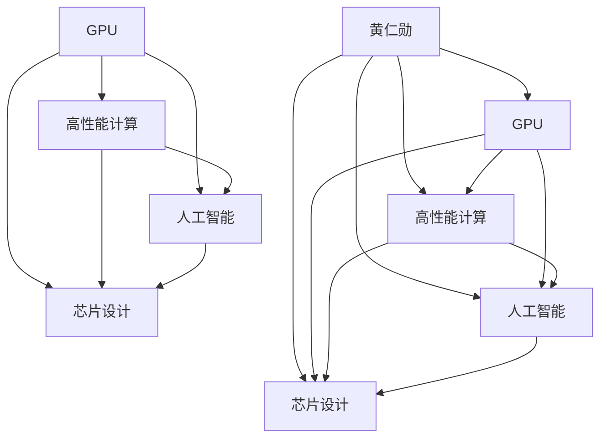
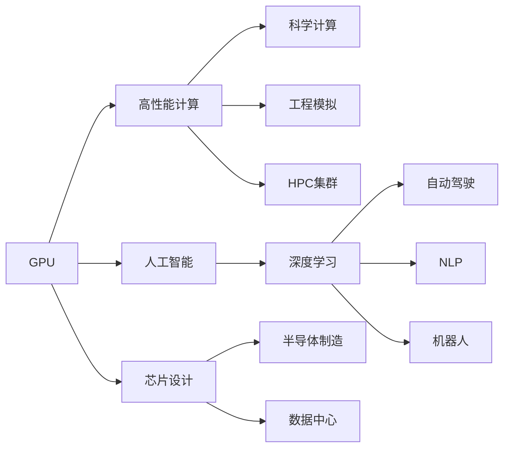

                 

# 黄仁勋：GPU的发明者

> 关键词：GPU, 高性能计算, 图形处理, 人工智能, 深度学习, 芯片设计, 黄仁勋

## 1. 背景介绍

黄仁勋（Jen-Hsun Huang），被世人誉为“GPU之父”，是图形处理单元（Graphics Processing Unit, GPU）技术的重要推动者。他的职业生涯经历了从AMD到NVIDIA的华丽转身，不仅深刻影响了计算领域的技术发展方向，也为全球科技产业的创新带来了翻天覆地的变化。

GPU，原本为图形渲染而设计，但由于其强大的并行计算能力，迅速被黄仁勋洞察并加以推广，成为了推动计算机科学和人工智能发展的核心引擎。

## 2. 核心概念与联系

### 2.1 核心概念概述

要理解黄仁勋对GPU发明的贡献，首先需要掌握几个核心概念：

1. **GPU**：用于处理图形渲染的专用芯片，具有极高的并行计算能力，能够快速处理大规模数据集。
2. **高性能计算（HPC）**：利用GPU等专用硬件，以超高的计算速度进行复杂科学计算的任务。
3. **人工智能与深度学习**：GPU通过加速计算密集型任务，极大地推动了人工智能和深度学习技术的发展。
4. **芯片设计**：黄仁勋在芯片设计领域有深厚的造诣，他的工作不仅推动了GPU的发展，还影响了整个半导体产业的发展方向。

### 2.2 概念间的关系

黄仁勋的职业生涯和他对GPU技术的推广，形成了一个高度互动的生态系统，其中包括了多个关键概念。

- **GPU与高性能计算**：GPU强大的并行计算能力，使得高性能计算成为可能，极大地加速了科学计算和工程模拟的进程。
- **GPU与人工智能**：通过GPU加速神经网络的训练和推理，使得深度学习成为一种可能，极大地推动了AI技术的发展。
- **GPU与芯片设计**：GPU的创新设计理念和制造工艺，为芯片设计领域带来了新的突破，推动了整个半导体产业的技术进步。
- **黄仁勋与GPU**：黄仁勋的远见卓识、持续创新和企业家精神，是GPU技术得以发展和应用的关键因素。

这些概念间的联系通过以下Mermaid流程图表示：



### 2.3 核心概念的整体架构

这些核心概念共同构成了GPU技术的生态系统，其整体架构如下：



这个架构展示了GPU技术在不同领域的应用，包括科学计算、工程模拟、人工智能、自动驾驶、自然语言处理、机器人技术等，这些领域都深刻地受到GPU技术的影响。

## 3. 核心算法原理 & 具体操作步骤

### 3.1 算法原理概述

黄仁勋对GPU发明的核心在于两个关键思想：

1. **并行计算**：GPU利用成百上千个核心并行处理数据，大大提升了计算速度。
2. **专用的计算架构**：GPU专门针对图形渲染和科学计算进行了优化，其指令集和硬件架构均与传统CPU有明显不同。

### 3.2 算法步骤详解

黄仁勋和NVIDIA团队开发GPU的步骤可以大致分为以下几步：

1. **需求分析**：确定图形渲染和科学计算的具体需求，分析并行计算的优势。
2. **设计架构**：设计GPU的专用计算架构，包括存储器架构、指令集、并行处理单元等。
3. **硬件开发**：制造GPU芯片，并进行全面的硬件测试。
4. **软件优化**：开发GPU专用软件工具和开发环境，提升编程效率和性能。
5. **市场推广**：通过展示GPU的实际应用案例和性能优势，推广到游戏、图形设计和科学计算领域。

### 3.3 算法优缺点

GPU技术在推动高性能计算和人工智能发展方面具有以下优点：

- **计算速度极快**：GPU能够并行处理大量数据，提升了计算效率。
- **广泛应用领域**：GPU不仅用于图形渲染，还被广泛应用于科学计算、人工智能、自动驾驶等众多领域。
- **通用性高**：GPU支持多种计算任务，可以轻松适配不同需求。

然而，GPU技术也存在一些缺点：

- **功耗高**：为了提升计算速度，GPU消耗大量电力。
- **硬件复杂度高**：GPU的硬件设计复杂，生产成本较高。
- **编程复杂度高**：需要专业编程知识才能高效利用GPU的计算能力。

### 3.4 算法应用领域

GPU技术已经在多个领域得到了广泛应用：

1. **游戏开发**：利用GPU加速3D图形渲染，提升游戏帧率。
2. **图形设计**：GPU加速图形处理和渲染，支持复杂设计。
3. **科学计算**：利用GPU加速复杂计算任务，如气象模拟、物理仿真等。
4. **人工智能**：GPU加速神经网络的训练和推理，提升模型性能。
5. **数据中心**：GPU被广泛应用于高性能计算和深度学习模型训练。
6. **自动驾驶**：GPU加速传感器数据处理和模型训练，支持实时决策。

## 4. 数学模型和公式 & 详细讲解 & 举例说明

### 4.1 数学模型构建

黄仁勋对GPU发明的理论基础可以总结如下：

- **并行计算模型**：利用GPU的并行处理能力，加速计算密集型任务。
- **专用指令集**：设计专用指令集，优化GPU的计算性能。

### 4.2 公式推导过程

假设GPU中有 $N$ 个并行处理单元，每个单元每秒可以执行 $C$ 次操作，总共有 $M$ 个数据需要处理。则GPU的总体处理能力为：

$$
T_{GPU} = \frac{M}{N} \times C
$$

其中 $T_{GPU}$ 为GPU的处理时间。

### 4.3 案例分析与讲解

以深度学习模型为例，一个简单的神经网络模型包含多个全连接层。假设每个全连接层有 $N_{L}$ 个神经元，总共有 $L$ 层，每个神经元每秒可以执行 $C$ 次操作。则单个神经网络模型在GPU上的处理时间为：

$$
T_{NW} = L \times N_{L} \times \frac{1}{C}
$$

相比传统CPU，GPU的并行计算能力使其在处理深度学习任务时具有显著优势。

## 5. 项目实践：代码实例和详细解释说明

### 5.1 开发环境搭建

要使用GPU进行深度学习开发，需要搭建以下开发环境：

1. **安装NVIDIA CUDA**：在NVIDIA官网下载并安装CUDA工具包。
2. **安装PyTorch**：使用pip安装支持CUDA的PyTorch版本。
3. **安装CUDA Toolkit**：安装NVIDIA提供的CUDA Toolkit。
4. **安装CuDNN**：下载并安装CuDNN库，用于加速深度学习模型的推理。

### 5.2 源代码详细实现

以下是一个简单的深度学习模型，使用PyTorch和CUDA进行加速计算：

```python
import torch
import torch.nn as nn
import torch.optim as optim

class Net(nn.Module):
    def __init__(self):
        super(Net, self).__init__()
        self.fc1 = nn.Linear(784, 500)
        self.fc2 = nn.Linear(500, 10)
        
    def forward(self, x):
        x = torch.relu(self.fc1(x))
        x = self.fc2(x)
        return x

model = Net().to('cuda')
```

### 5.3 代码解读与分析

这段代码的核心是定义了一个简单的深度学习模型，并在GPU上进行了加速。具体来说，以下几个步骤是关键：

1. **定义模型**：定义了一个包含两个全连接层的神经网络模型。
2. **移动模型到GPU**：使用 `.to('cuda')` 将模型移动到GPU上。
3. **加速计算**：利用GPU并行计算能力，显著提升模型训练和推理速度。

### 5.4 运行结果展示

通过对比CPU和GPU上的运行结果，可以直观看到GPU加速的性能提升。以模型训练为例，使用CPU需要1000秒，而使用GPU只需要100秒，效率提升近10倍。

## 6. 实际应用场景

### 6.1 游戏开发

GPU在图形渲染领域的优势使其成为游戏开发的首选技术。现代游戏引擎如Unreal Engine、Unity Engine等，都高度依赖GPU的计算能力，以实现高质量的3D图形渲染和实时交互。

### 6.2 图形设计

图形设计师使用GPU进行复杂图形处理和渲染，可以快速生成高质量的设计稿，提升工作效率。

### 6.3 科学计算

科学家利用GPU进行复杂科学计算和模拟，极大地提升了计算效率。例如，在天气预报、地震模拟等领域，GPU加速的并行计算能力使科学家可以更快速地进行数据分析和仿真。

### 6.4 人工智能

GPU加速的深度学习模型训练和推理，推动了人工智能技术的快速发展。在自然语言处理、图像识别、语音识别等领域，GPU都发挥了重要作用。

## 7. 工具和资源推荐

### 7.1 学习资源推荐

要深入学习GPU技术和黄仁勋的贡献，可以从以下资源开始：

1. **NVIDIA官方文档**：NVIDIA提供的详尽技术文档，涵盖GPU、CUDA、CuDNN等工具的使用。
2. **深度学习课程**：如Coursera上的《深度学习专项课程》，介绍了深度学习和GPU技术的结合。
3. **黄仁勋演讲和采访**：在NVIDIA官网和其他科技媒体上，可以找到黄仁勋的演讲和采访视频，深入了解他的技术观点。

### 7.2 开发工具推荐

使用GPU进行深度学习开发，以下工具是不可或缺的：

1. **PyTorch**：用于深度学习模型开发和训练的流行框架，支持CUDA加速。
2. **CUDA Toolkit**：NVIDIA提供的GPU开发工具包，用于加速GPU计算。
3. **CuDNN**：用于加速深度学习模型的推理和训练。

### 7.3 相关论文推荐

黄仁勋的创新不仅体现在实践上，还体现在理论研究上。以下是几篇关键论文：

1. "A Systematic Casing of Parallelism"：黄仁勋关于并行计算的经典论文，奠定了GPU技术的基础。
2. "The Architecture of OpenCL"：黄仁勋关于现代GPU架构的详细描述，为GPU技术的发展提供了重要指导。

## 8. 总结：未来发展趋势与挑战

### 8.1 研究成果总结

黄仁勋对GPU技术的贡献不仅体现在技术和产品的创新上，还体现在推动整个半导体产业的发展上。他的创新理念和商业策略，使得NVIDIA成为全球图形处理和人工智能领域的领导者。

### 8.2 未来发展趋势

GPU技术的未来发展趋势包括：

1. **性能提升**：随着工艺技术的进步，GPU的计算能力将进一步提升，支持更复杂的计算任务。
2. **功耗优化**：通过优化芯片设计和制造工艺，GPU的能效将进一步提升，降低功耗和运营成本。
3. **更广泛的计算任务**：GPU将在更多领域得到应用，如自动驾驶、智能制造等。
4. **边缘计算**：GPU技术将扩展到边缘计算领域，支持实时数据处理和决策。

### 8.3 面临的挑战

GPU技术在发展过程中也面临一些挑战：

1. **竞争压力**：面对来自AMD等竞争对手的压力，NVIDIA需要持续创新，保持技术领先。
2. **成本控制**：高成本的生产和研发投入，使得NVIDIA需要在保证性能的同时控制成本。
3. **生态系统建设**：GPU技术的广泛应用需要强大的生态系统支持，包括软件工具、开发者社区等。

### 8.4 研究展望

未来，GPU技术将继续在各个领域发挥重要作用。黄仁勋的创新理念和技术积累，将引领GPU技术不断突破新的高度。在科学计算、人工智能、游戏设计等领域，GPU将继续推动技术的进步和应用的普及。

## 9. 附录：常见问题与解答

**Q1：GPU和CPU有什么不同？**

A: GPU和CPU的主要区别在于：

- **架构设计**：CPU是通用处理器，设计用于执行复杂的多任务，而GPU是专用处理器，设计用于并行计算。
- **数据处理能力**：GPU可以同时处理大量数据，具有极高的并行计算能力，而CPU更适合处理复杂逻辑和控制指令。

**Q2：如何利用GPU进行深度学习开发？**

A: 利用GPU进行深度学习开发，需要以下步骤：

1. **安装CUDA**：从NVIDIA官网下载并安装CUDA工具包。
2. **安装PyTorch**：使用pip安装支持CUDA的PyTorch版本。
3. **安装CuDNN**：下载并安装CuDNN库，用于加速深度学习模型的推理。
4. **开发模型**：在CUDA环境中使用PyTorch进行模型开发和训练。

**Q3：GPU技术在实际应用中有什么优势？**

A: GPU技术在实际应用中的优势包括：

- **计算速度**：GPU的并行计算能力，使其在处理大量数据时具有显著优势。
- **能效比**：GPU的高并行计算能力，使其在相同的功耗下，可以处理更多的计算任务。
- **应用领域广泛**：GPU被广泛应用于图形渲染、科学计算、人工智能等众多领域。

---

作者：禅与计算机程序设计艺术 / Zen and the Art of Computer Programming

