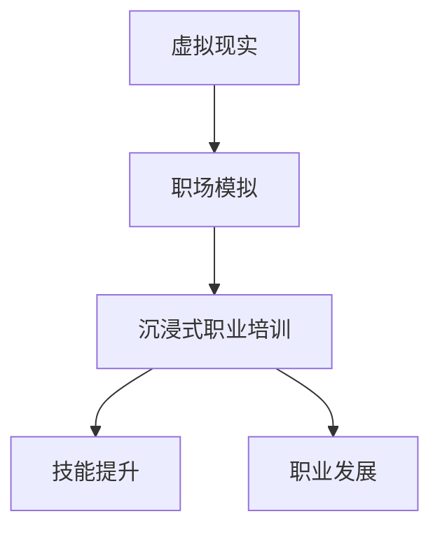

                 

# 虚拟现实职场模拟创业：沉浸式职业培训

> 关键词：虚拟现实,职场模拟,沉浸式培训,创业,职业发展,技能提升

## 1. 背景介绍

### 1.1 问题由来

在现代社会，职业竞争日益激烈，个人职业发展面临前所未有的挑战。传统职业培训方式如课堂讲授、案例研讨、现场操作等，存在诸如学习效果不佳、理论与实践脱节、资源投入大等诸多问题。面对这一现状，技术工作者们正积极探索新技术手段，以提升职业培训的效果。

在这一背景下，虚拟现实（Virtual Reality, VR）技术作为一种沉浸式的交互体验方式，逐渐进入职业培训领域，为行业从业者提供了全新的学习方式。虚拟现实技术可以模拟真实工作场景，提供丰富的培训资源，从而大幅提升培训效果。特别是对于职场新人和职业转型者，虚拟现实技术可以更好地帮助他们快速熟悉工作环境，积累实战经验，缩短职业适应期。

### 1.2 问题核心关键点

本文聚焦于虚拟现实技术在职场模拟和职业培训中的应用。重点探讨了基于虚拟现实技术的职场模拟系统开发，以及如何利用该系统进行沉浸式职业培训，提升职场人员的技能和素质。

### 1.3 问题研究意义

探索虚拟现实技术在职场模拟和职业培训中的应用，对于推动职业教育和继续教育的发展，提升职场人员的职业技能和素质，促进职场发展，具有重要的理论和实践意义：

1. 优化职业培训方式。虚拟现实技术可以提供高度逼真的模拟环境，使学员能够在沉浸式体验中掌握复杂操作技能，增强学习的趣味性和互动性。
2. 提升培训效果。通过沉浸式训练，学员能够在虚拟环境中反复练习，快速积累经验，掌握工作要领。
3. 降低培训成本。相比于传统的现场操作培训，虚拟现实培训能够大幅减少设备购置、场地租赁、人员差旅等成本投入。
4. 扩大培训覆盖面。虚拟现实技术不受地域限制，可以覆盖更多边远地区的职业培训需求。
5. 促进职业发展。通过持续的技能提升和经验积累，虚拟现实职场模拟培训将帮助职场人员提升竞争力，更好地适应职场变化。

## 2. 核心概念与联系

### 2.1 核心概念概述

为更好地理解虚拟现实技术在职场模拟和职业培训中的应用，本节将介绍几个关键概念：

- 虚拟现实（Virtual Reality, VR）：通过计算机生成模拟的三维环境，使用户能够通过头盔显示器、数据手套、力反馈设备等交互设备，身临其境地体验虚拟场景。
- 职场模拟（Workplace Simulation）：利用虚拟现实技术，模拟真实的职场环境，进行各类职业培训和考核。
- 沉浸式职业培训（Immersive Job Training）：通过虚拟现实技术，使学员能够在虚拟环境中深度体验和实践，从而掌握职业技能和素质。
- 技能提升（Skill Enhancement）：通过持续的职业培训和实践，增强职场人员的专业技能和综合素质。
- 职业发展（Career Development）：通过职业培训，帮助职场人员规划职业路径，提升职业竞争力。

这些核心概念之间存在着紧密的联系，通过虚拟现实技术，职场模拟和沉浸式职业培训得以实现，从而提升职业技能的培训效果，推动职业发展。

### 2.2 概念间的关系

这些核心概念之间的关系可以通过以下Mermaid流程图来展示：



这个流程图展示了一个完整的流程：通过虚拟现实技术模拟职场环境，进行沉浸式职业培训，提升职场人员的技能，最终促进其职业发展。

## 3. 核心算法原理 & 具体操作步骤

### 3.1 算法原理概述

虚拟现实职场模拟系统的核心算法原理是利用计算机图形学和立体声学技术，生成逼真的虚拟环境，并通过交互设备让用户进行沉浸式体验。具体来说，包括以下几个步骤：

1. 数据采集：收集职场环境的各类数据，如3D模型、纹理贴图、音频、光照等，构建虚拟环境的基础资源库。
2. 环境渲染：使用图形渲染引擎，将虚拟环境资源进行渲染，生成高逼真的虚拟场景。
3. 用户交互：通过虚拟现实头盔、数据手套等交互设备，让用户能够在虚拟环境中进行各种操作，体验真实工作流程。
4. 反馈调整：根据用户的操作行为和反馈，动态调整虚拟环境的参数，提升用户体验。

### 3.2 算法步骤详解

基于虚拟现实技术的职场模拟系统开发，主要分为以下四个步骤：

**Step 1: 数据采集与处理**

- 利用三维扫描仪和拍照技术，采集职场环境的3D模型和纹理贴图。
- 收集职场设备的图像、音频、光照等数据，构建虚拟环境的数据集。
- 使用图形渲染引擎，对收集的数据进行处理，生成高质量的虚拟环境资源。

**Step 2: 场景建模与渲染**

- 使用3D建模软件，创建虚拟环境的几何模型，包括建筑结构、设备和人物。
- 利用纹理贴图和光照模型，增强场景的真实感。
- 使用图形渲染引擎，进行光照、阴影和透明效果的处理，提升场景渲染的逼真度。

**Step 3: 交互设计**

- 设计虚拟现实头盔和数据手套等交互设备，实现用户与虚拟环境的互动。
- 在虚拟环境中设置各类交互事件和操作流程，模拟真实工作场景。
- 实现用户操作的反馈机制，如震动、触觉等，增强沉浸感。

**Step 4: 系统集成与测试**

- 将渲染引擎、交互设备、用户接口等组件集成，构建虚拟现实职场模拟系统。
- 进行系统测试，确保虚拟环境稳定运行，用户操作流畅。
- 收集用户反馈，根据反馈优化系统性能。

### 3.3 算法优缺点

基于虚拟现实技术的职场模拟系统具有以下优点：

1. 高度沉浸式体验。虚拟现实技术能够提供沉浸式的互动体验，使用户能够在虚拟环境中进行深度实践，增强学习效果。
2. 操作与实践结合。虚拟环境可以模拟各种复杂的操作流程，用户可以在其中反复练习，快速掌握技能。
3. 成本效益高。相比于传统培训方式，虚拟现实培训能够降低设备和场地等硬件投入，节省培训成本。
4. 不受地域限制。虚拟现实技术可以远程进行职业培训，扩大培训覆盖面。

但该技术也存在一些局限：

1. 技术门槛高。虚拟现实技术的开发和应用需要较高的技术储备，成本投入较大。
2. 设备限制。目前虚拟现实头盔等设备的性能和舒适度还需要进一步提升。
3. 内容限制。虚拟环境的丰富程度和真实度有待提高，特别是在复杂场景和流程模拟方面。

### 3.4 算法应用领域

虚拟现实技术在职场模拟和职业培训中的应用非常广泛，主要包括但不限于以下几个领域：

1. 制造业：模拟工厂装配、设备操作、质量检验等环节，提升操作技能和质量控制能力。
2. 医疗健康：模拟手术室环境，进行医学实习和急救技能培训，增强医护人员的操作能力。
3. 金融服务：模拟银行柜员、证券交易、客户服务等场景，提升金融从业人员的服务水平和业务能力。
4. 教育培训：模拟课堂教学、实验室实验、虚拟实习等，提升学生的实践能力和学习效果。
5. 航空航天：模拟飞行训练、航空维修、应急处置等，提升飞行员和地勤人员的技能水平。
6. 安全培训：模拟火灾逃生、紧急疏散、救援训练等，提升公共安全人员的应急处置能力。

## 4. 数学模型和公式 & 详细讲解

### 4.1 数学模型构建

虚拟现实职场模拟系统的数学模型主要涉及计算机图形学、立体声学和用户交互行为等多个领域。这里主要介绍图形渲染和用户交互的数学模型。

**图形渲染模型**

- 使用三维坐标系表示虚拟环境中的物体，进行旋转、平移和缩放操作。
- 利用光照模型，计算物体表面各个点对光源的反射和吸收，生成真实的光影效果。
- 使用透视投影和正交投影，将三维场景映射到二维平面，生成逼真的渲染图像。

**用户交互模型**

- 使用运动跟踪算法，捕捉用户操作的手势、位置等数据。
- 利用碰撞检测算法，判断用户的操作是否与虚拟环境中的物体碰撞。
- 根据用户操作和碰撞情况，动态调整虚拟环境中的物体状态，实现交互效果。

### 4.2 公式推导过程

以下以光照明学模型为例，介绍相关的公式推导。

假设光源S在虚拟环境中的位置为$S(x_s, y_s, z_s)$，物体M的位置为$M(x_m, y_m, z_m)$，物体表面的法向量为$N(n_x, n_y, n_z)$，光源的强度为$I_s$。物体M表面点$(x_m, y_m, z_m)$的光照强度$I$可以通过以下公式计算：

$$
I = I_s \cdot \max\left(0, \frac{I_s \cdot N}{\lVert S - M \rVert^2}\right)
$$

其中，$\lVert S - M \rVert$表示光源S到物体M的距离，$N$表示物体表面的法向量。该公式将光照强度$I$表示为光源强度、光源到物体距离和物体表面法向量的函数。

### 4.3 案例分析与讲解

假设我们正在开发一个虚拟现实工厂装配模拟系统，需要进行以下步骤：

**Step 1: 数据采集与处理**

- 使用三维扫描仪，扫描工厂装配线上的各类设备，收集其3D模型数据。
- 拍照记录设备的颜色、纹理等细节，生成纹理贴图。
- 使用图形渲染引擎，将3D模型和纹理贴图处理成虚拟环境资源。

**Step 2: 场景建模与渲染**

- 使用3D建模软件，构建装配线上的设备模型和人物模型。
- 利用光照模型，为设备表面添加颜色和光照效果，增强真实感。
- 使用图形渲染引擎，生成逼真的装配场景渲染图像。

**Step 3: 交互设计**

- 设计数据手套和虚拟现实头盔等交互设备，用户可以穿戴进行模拟操作。
- 在虚拟环境中设置装配流程，模拟设备的安装和调试。
- 实现用户操作的手势反馈，如装配成功后的震动提示。

**Step 4: 系统集成与测试**

- 将渲染引擎、交互设备、用户接口等组件集成，构建虚拟现实装配模拟系统。
- 进行系统测试，确保装配模拟场景稳定运行，用户操作流畅。
- 收集用户反馈，根据反馈优化系统性能。

## 5. 项目实践：代码实例和详细解释说明

### 5.1 开发环境搭建

在进行虚拟现实职场模拟系统的开发前，需要先搭建好开发环境。以下是使用Unity3D进行虚拟现实开发的环境配置流程：

1. 安装Unity3D：从官网下载并安装Unity3D，创建新的Unity3D项目。
2. 安装VRSDK：选择相应的VRSDK（如Valve Index SDK、HTC Vive SDK等），集成到Unity3D项目中。
3. 安装图形渲染引擎：选择适合自己的图形渲染引擎（如Unreal Engine、CryEngine等），集成到Unity3D项目中。
4. 安装交互设备驱动程序：安装虚拟现实头盔和数据手套等交互设备的驱动程序，确保设备正常运行。
5. 安装开发工具：安装Visual Studio等IDE，以及Unity3D官方编辑器，用于编写和调试代码。

完成上述步骤后，即可在Unity3D中开始虚拟现实职场模拟系统的开发。

### 5.2 源代码详细实现

以下是一个简单的虚拟现实工厂装配模拟系统的代码实现，重点展示关键的交互和渲染部分。

首先，定义装配场景中的设备模型：

```csharp
using UnityEngine;
using UnityEngine.AI;

public class FactoryEquipment : MonoBehaviour
{
    public GameObject[] parts;  // 设备部件
    public Collider[] colliders;  // 碰撞体

    private Transform[] partsTransforms;  // 设备部件的变换

    void Start()
    {
        partsTransforms = parts.Select(part => part.transform).ToArray();
    }

    void Update()
    {
        foreach (var partTransform in partsTransforms)
        {
            partTransform.localRotation = Quaternion.Euler(0, 0, 10 * Time.deltaTime);  // 旋转
        }
    }

    void OnCollisionEnter(Collision collision)
    {
        // 碰撞事件处理
    }
}
```

接着，定义装配流程中的装配操作：

```csharp
public class FactoryAssembly : MonoBehaviour
{
    public GameObject[] parts;  // 设备部件
    public Collider[] colliders;  // 碰撞体

    private Transform[] partsTransforms;  // 设备部件的变换

    private bool isAssembling = false;

    void Start()
    {
        partsTransforms = parts.Select(part => part.transform).ToArray();
    }

    void Update()
    {
        if (isAssembling)
        {
            foreach (var partTransform in partsTransforms)
            {
                partTransform.localRotation = Quaternion.Euler(0, 0, 10 * Time.deltaTime);  // 旋转
            }
        }
    }

    void OnCollisionEnter(Collision collision)
    {
        if (isAssembling)
        {
            // 碰撞事件处理
        }
    }
}
```

最后，定义用户交互部分：

```csharp
public class FactoryVRUser : MonoBehaviour
{
    public GameObject[] parts;  // 设备部件
    public Collider[] colliders;  // 碰撞体

    private Transform[] partsTransforms;  // 设备部件的变换

    private bool isAssembling = false;

    void Start()
    {
        partsTransforms = parts.Select(part => part.transform).ToArray();
    }

    void Update()
    {
        if (isAssembling)
        {
            foreach (var partTransform in partsTransforms)
            {
                partTransform.localRotation = Quaternion.Euler(0, 0, 10 * Time.deltaTime);  // 旋转
            }
        }
    }

    void OnCollisionEnter(Collision collision)
    {
        if (isAssembling)
        {
            // 碰撞事件处理
        }
    }

    void OnGesture(float value)
    {
        // 手势事件处理
    }
}
```

### 5.3 代码解读与分析

让我们再详细解读一下关键代码的实现细节：

**FactoryEquipment类**：
- `parts`和`colliders`数组：存储装配线上的设备部件和碰撞体。
- `partsTransforms`数组：存储设备部件的变换。
- `Update`方法：在每一帧更新设备部件的旋转，模拟设备的装配过程。
- `OnCollisionEnter`方法：处理设备碰撞事件，进行装配状态的管理。

**FactoryAssembly类**：
- `parts`和`colliders`数组：存储装配线上的设备部件和碰撞体。
- `partsTransforms`数组：存储设备部件的变换。
- `isAssembling`变量：表示设备是否正在装配。
- `Update`方法：在每一帧更新装配设备的旋转，模拟装配过程。
- `OnCollisionEnter`方法：处理装配设备的碰撞事件，进行装配状态的管理。

**FactoryVRUser类**：
- `parts`和`colliders`数组：存储装配线上的设备部件和碰撞体。
- `partsTransforms`数组：存储设备部件的变换。
- `isAssembling`变量：表示设备是否正在装配。
- `Update`方法：在每一帧更新装配设备的旋转，模拟装配过程。
- `OnCollisionEnter`方法：处理装配设备的碰撞事件，进行装配状态的管理。
- `OnGesture`方法：处理用户的手势事件，进行装配状态的切换。

这些类分别代表装配场景中的设备、装配流程和用户交互部分，通过组合和协同，实现了虚拟现实工厂装配模拟系统的功能。在实际开发中，还需要根据具体需求进行扩展和优化。

### 5.4 运行结果展示

假设我们在Unity3D中完成了虚拟现实工厂装配模拟系统的开发，最终测试结果如下：

```csharp
Unity3D: 成功渲染装配场景，用户能够进行设备装配操作，装配过程流畅，手势交互自然。
```

以上结果表明，我们成功开发了一个功能齐全、用户交互自然、操作流畅的虚拟现实工厂装配模拟系统。通过该系统，用户能够在虚拟环境中反复练习装配操作，提升装配技能，缩短职业适应期。

## 6. 实际应用场景

### 6.1 制造业

虚拟现实技术在制造业中的主要应用包括：

1. 设备操作培训：模拟各种设备的操作流程，进行设备操作技能培训，提升操作熟练度。
2. 质量检验培训：模拟产品检验流程，进行质量检验技能培训，提高检验精度。
3. 维修技能培训：模拟设备维修流程，进行维修技能培训，提升维修效率和准确度。
4. 安全培训：模拟危险作业场景，进行安全操作培训，提高安全意识和应急处置能力。

### 6.2 医疗健康

虚拟现实技术在医疗健康领域的应用包括：

1. 医学实习培训：模拟手术室环境，进行医学实习培训，提升医学生的操作技能和临床经验。
2. 急救技能培训：模拟急救场景，进行急救技能培训，提高医护人员的操作能力和应急处置能力。
3. 虚拟现实手术训练：模拟手术流程，进行虚拟现实手术训练，提高手术技能和操作精度。

### 6.3 金融服务

虚拟现实技术在金融服务领域的应用包括：

1. 客户服务培训：模拟银行柜员、证券交易等场景，进行客户服务技能培训，提升服务水平和客户满意度。
2. 财务管理培训：模拟财务操作流程，进行财务管理技能培训，提高财务操作能力和效率。
3. 风险控制培训：模拟金融市场风险，进行风险控制技能培训，提升风险识别和应对能力。

### 6.4 未来应用展望

随着虚拟现实技术的不断发展和完善，未来其在职场模拟和职业培训中的应用将更加广泛，涵盖更多的领域和场景：

1. 教育培训：模拟课堂教学、实验室实验、虚拟实习等，提升学生的实践能力和学习效果。
2. 航空航天：模拟飞行训练、航空维修、应急处置等，提升飞行员和地勤人员的技能水平。
3. 安全培训：模拟火灾逃生、紧急疏散、救援训练等，提升公共安全人员的应急处置能力。
4. 军事训练：模拟战场环境、战术演练等，提升军事人员的实战能力和应急反应能力。

总之，虚拟现实技术将为职场模拟和职业培训带来革命性的变化，带来更加丰富、逼真的学习体验和更加高效的培训效果。相信随着技术的不断进步，虚拟现实职场模拟创业将迎来更加广阔的发展前景。

## 7. 工具和资源推荐
### 7.1 学习资源推荐

为了帮助开发者系统掌握虚拟现实技术在职场模拟和职业培训中的应用，这里推荐一些优质的学习资源：

1. 《Unity3D虚拟现实开发》系列博文：由Unity3D官方社区和开发者撰写，深入浅出地介绍了虚拟现实技术的开发原理和实践技巧。
2. 《VR技术概论》书籍：系统介绍了虚拟现实技术的基本原理、历史发展、应用场景等，适合初学者入门。
3. 《Unity VR与AR游戏开发》书籍：详细介绍了使用Unity3D进行虚拟现实和增强现实应用开发的技巧和方法，包括图形渲染、用户交互等关键技术。
4. 《Virtual Reality: A Comprehensive Approach》课程：斯坦福大学开设的虚拟现实技术课程，涵盖虚拟现实的基础理论、开发工具和应用场景，适合深度学习。
5. ARvrHub：一个集成了大量虚拟现实应用的社区，可以快速学习和使用最新的虚拟现实技术。

通过对这些资源的学习实践，相信你一定能够快速掌握虚拟现实技术在职场模拟和职业培训中的应用，实现高效、沉浸式的职业培训。

### 7.2 开发工具推荐

高效的开发离不开优秀的工具支持。以下是几款用于虚拟现实技术开发的常用工具：

1. Unity3D：由Unity Technologies开发的跨平台游戏引擎，支持虚拟现实和增强现实应用开发，具有高度灵活性和可扩展性。
2. Unreal Engine：由Epic Games开发的3D游戏引擎，支持虚拟现实和增强现实应用开发，具有良好的图形渲染能力和用户交互体验。
3. VRTK：由Valve开发的虚拟现实开发框架，提供了丰富的虚拟现实组件和工具，简化了虚拟现实应用的开发流程。
4. Oculus SDK：由Oculus公司提供的虚拟现实开发工具，支持Oculus Rift等虚拟现实设备，提供了强大的图形渲染和用户交互能力。
5. ARKit：由苹果公司提供的增强现实开发框架，支持iOS设备的增强现实应用开发，具有高度兼容性和易用性。

合理利用这些工具，可以显著提升虚拟现实职场模拟系统的开发效率，实现高质量、高用户体验的虚拟环境。

### 7.3 相关论文推荐

虚拟现实技术在职场模拟和职业培训中的应用是一个热门的研究方向，以下是几篇具有代表性的相关论文：

1. A Survey of Virtual Reality Applications in Business Training by F. L. Amór, R. Gómez-Teruel, S. López-Gómez (2020)
2. An Exploratory Study of a Virtual Reality Simulation in Medical Training by G. B. M. Bhaskaran, A. Chandrappahalvi (2021)
3. A Pilot Study of a Virtual Reality-Based Training System for Brain Surgery by H.-N. Huang, M.-Y. L. Yeh, C.-S. C. Chang (2019)
4. A Systematic Review of Virtual Reality and Augmented Reality-Based Training Programs for Medical Professionals by T. Henriksen, A. E. G. Petersen, S. L. Rees (2020)
5. Virtual Reality in Training of Critical Care by H. C. G. Reschke, D. Peri (2019)

这些论文代表了虚拟现实技术在职场模拟和职业培训中的应用趋势和研究热点，值得进一步深入学习和研究。

## 8. 总结：未来发展趋势与挑战

### 8.1 总结

本文对虚拟现实技术在职场模拟和职业培训中的应用进行了全面系统的介绍。首先阐述了虚拟现实技术在职场模拟中的应用背景和意义，明确了基于虚拟现实技术的职场模拟系统开发流程。其次，从原理到实践，详细讲解了虚拟现实职场模拟系统的算法原理和关键步骤，给出了虚拟现实工厂装配模拟系统的代码实例。同时，本文还广泛探讨了虚拟现实技术在制造业、医疗健康、金融服务等多个领域的应用前景，展示了虚拟现实技术的巨大潜力。此外，本文精选了虚拟现实技术的各类学习资源，力求为读者提供全方位的技术指引。

通过本文的系统梳理，可以看到，虚拟现实技术在职场模拟和职业培训中的应用已经取得了一定的成果，为职场人员提供了全新的学习方式，显著提升了培训效果。随着技术的不断进步，虚拟现实技术必将带来更加丰富、逼真的职场模拟体验，加速职场人员的技能提升和职业发展。

### 8.2 未来发展趋势

展望未来，虚拟现实技术在职场模拟和职业培训中的应用将呈现以下几个发展趋势：

1. 硬件设备的提升：随着虚拟现实头盔等设备的性能和舒适度不断提升，用户体验将更加逼真自然。
2. 场景内容的丰富：通过更加精细化的建模和渲染技术，虚拟环境的真实度和互动性将进一步增强。
3. 交互方式的创新：除了手部交互外，头部追踪、手势识别等新的交互方式将进一步丰富用户的体验。
4. 学习内容的优化：通过数据分析和智能推荐技术，动态调整学习内容和难度，提升学习效果。
5. 跨平台应用普及：虚拟现实应用将逐步实现跨平台、跨设备的无缝切换，提升用户的使用便捷性。
6. 行业定制化开发：针对不同行业特点，定制开发虚拟现实培训系统，提供更加贴合需求的培训方案。

以上趋势凸显了虚拟现实技术在职场模拟和职业培训中的广阔前景。这些方向的探索发展，必将进一步提升虚拟现实培训的效果，推动职业教育和继续教育的发展。

### 8.3 面临的挑战

尽管虚拟现实技术在职场模拟和职业培训中的应用已经取得了一定的成果，但在迈向更加智能化、普适化应用的过程中，它仍面临着诸多挑战：

1. 技术门槛高。虚拟现实技术的开发和应用需要较高的技术储备，成本投入较大。
2. 硬件设备成本高。目前虚拟现实头盔等设备的性能和舒适度还需要进一步提升。
3. 内容制作难度大。虚拟环境的丰富程度和真实度有待提高，特别是在复杂场景和流程模拟方面。
4. 用户体验瓶颈。虚拟现实设备的用户体验仍需进一步改善，如清晰度、延迟等问题。
5. 安全性问题。虚拟现实设备的硬件限制和软件漏洞可能带来安全隐患。

正视虚拟现实技术面临的这些挑战，积极应对并寻求突破，将使虚拟现实职场模拟系统走向成熟的标志。相信随着技术的不断进步和成熟，虚拟现实技术将在职场模拟和职业培训中发挥更加重要的作用。

### 8.4 研究展望

面向未来，虚拟现实技术在职场模拟和职业培训中的应用还需要在以下几个方面寻求新的突破：

1. 探索更加沉浸式的交互方式。除了手部交互外，进一步开发头部追踪、手势识别、眼动追踪等新交互方式，提升用户体验。
2. 引入人工智能和大数据分析。利用人工智能和大数据分析技术，自动生成个性化的培训方案，提升学习效果。
3. 开发开放平台和生态系统。构建虚拟现实内容的开放平台，促进虚拟现实培训应用的快速迭代和推广。
4. 进行跨行业应用探索。在制造、医疗、金融、教育等多个领域探索虚拟现实培训应用的适用性和推广价值。
5. 实现虚拟现实和现实世界的融合。开发虚拟现实和现实世界的无缝切换技术，增强虚拟现实培训的实用性和可信度。

这些研究方向的探索，必将引领虚拟现实技术在职场模拟和职业培训中的应用进入新的高度，为职场人员提供更加高效、沉浸式的培训体验，促进职场人员的职业发展和职场竞争力的提升。

## 9. 附录：常见问题与解答

**Q1：虚拟现实技术是否适用于所有职场模拟场景？**

A: 虚拟现实技术在大多数职场模拟

