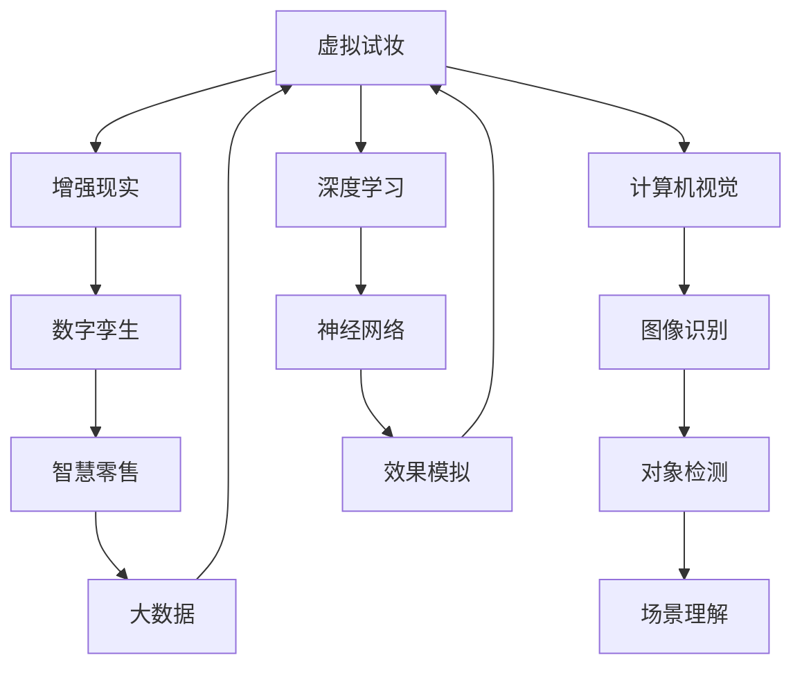
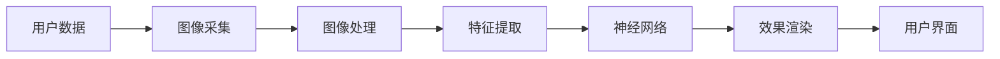
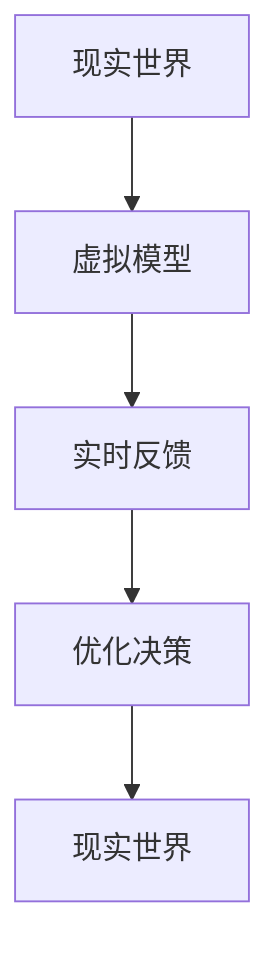
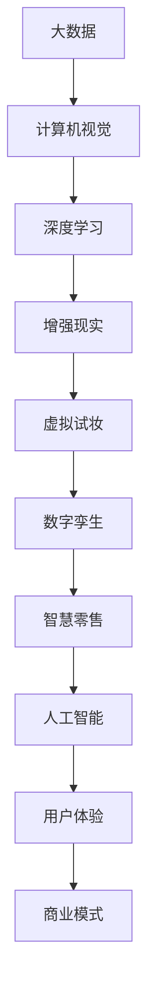

                 

# 虚拟试妆创业：美妆行业的数字化转型

> 关键词：虚拟试妆,数字孪生,增强现实,数字化转型,人工智能,计算机视觉,前沿技术,大数据,智慧零售,商业模式,创新

## 1. 背景介绍

### 1.1 问题由来
在数字化浪潮的推动下，传统美妆行业正经历着前所未有的变革。过去，消费者只能通过有限的商品展示、文字介绍和图片描述来选择适合自己的化妆品。而现在，随着技术的进步，数字化工具为消费者提供了全新的购物体验。尤其是在疫情影响下，线下实体店客流锐减，线上购物成为主流，虚拟试妆技术成为美妆行业数字化转型的重要方向。

虚拟试妆，也称为增强现实(AR)试妆，利用AR技术和计算机视觉技术，使消费者能够通过智能设备(如手机、平板)看到自己使用化妆品的效果。这种技术不仅打破了时间和空间的限制，还极大地提升了消费者的购物体验，同时帮助企业提升销售额和品牌影响力。

### 1.2 问题核心关键点
虚拟试妆技术的核心在于如何高效地将视觉数据与化妆品效果结合，实现实时渲染和逼真展示。主要包括以下几个关键点：

- **数据采集**：获取高清晰度的用户面部数据和化妆品图像。
- **计算机视觉**：对用户面部和化妆品进行精确的特征检测和提取。
- **深度学习**：构建深度神经网络，用于用户面部和化妆品的匹配和效果模拟。
- **增强现实技术**：利用AR技术将虚拟化妆品效果实时叠加在用户面部，实现试妆体验。
- **用户体验优化**：通过人机交互设计和界面优化，提升用户的使用便捷性和满意度。

### 1.3 问题研究意义
虚拟试妆技术在美妆行业中具有重要意义：

1. **提升用户体验**：消费者可以远程、实时地试妆，省去了线下试妆的排队和时间成本。
2. **增加销售额**：虚拟试妆能够帮助消费者更加自信地选择化妆品，提高购买转化率。
3. **数据洞察**：通过分析用户的试妆行为，品牌可以更好地了解消费者偏好，进行精准营销。
4. **降低运营成本**：减少了实体店的运营成本和库存压力，提升效率。
5. **创新商业模式**：基于虚拟试妆技术，可以探索如订阅制、按需试妆等新型的商业模式。

## 2. 核心概念与联系

### 2.1 核心概念概述

为了更好地理解虚拟试妆技术的核心原理，本节将介绍几个密切相关的核心概念：

- **虚拟试妆(Virtual Makeup)**：利用AR技术和深度学习模型，将化妆品效果实时叠加到用户面部，实现虚拟试妆效果。
- **增强现实(AR)**：通过在用户的现实环境中叠加虚拟信息，提供沉浸式体验。
- **计算机视觉(Computer Vision)**：利用图像处理和分析技术，识别和理解图像中的对象、场景和行为。
- **深度学习(Deep Learning)**：一种机器学习技术，利用多层神经网络对数据进行复杂模式识别和预测。
- **数字孪生(Digital Twin)**：通过虚拟化技术，将现实世界的对象或系统映射到虚拟空间中，用于模拟、监控和优化。
- **智慧零售(Smart Retail)**：利用信息技术和数据驱动的方法，提升零售业的管理效率和服务水平。
- **人工智能(AI)**：通过算法、数据和计算资源，使机器能够模拟人类智能，实现自主学习和决策。

这些核心概念之间的逻辑关系可以通过以下Mermaid流程图来展示：



这个流程图展示了几大核心概念之间的关联：

1. 虚拟试妆技术通过AR和深度学习实现用户和化妆品的互动。
2. 计算机视觉用于提取用户和化妆品的特征。
3. 深度学习构建神经网络进行效果模拟。
4. 数字孪生技术将虚拟效果映射到现实世界中。
5. 智慧零售利用大数据和AI进行客户分析和营销。

### 2.2 概念间的关系

这些核心概念之间存在着紧密的联系，构成了虚拟试妆技术的完整生态系统。下面我们通过几个Mermaid流程图来展示这些概念之间的关系。

#### 2.2.1 虚拟试妆技术的原理


这个流程图展示了虚拟试妆技术的核心原理：用户数据经过图像采集和处理后，通过特征提取和深度学习模型进行效果模拟，最终在用户界面上实时展示。

#### 2.2.2 数字孪生技术的应用


这个流程图展示了数字孪生技术在虚拟试妆中的应用：将现实世界中的用户和化妆品映射到虚拟模型中，通过实时反馈和优化决策，提升用户的试妆体验。

#### 2.2.3 智慧零售系统的结构


这个流程图展示了智慧零售系统的结构：通过客户分析进行个性化推荐和销售预测，优化库存管理和营销策略，不断迭代产品以提升客户满意度和销售额。

### 2.3 核心概念的整体架构

最后，我们用一个综合的流程图来展示这些核心概念在大语言模型微调过程中的整体架构：



这个综合流程图展示了从数据采集到商业模式的虚拟试妆技术整体架构。通过大数据、计算机视觉、深度学习、增强现实、数字孪生、智慧零售、人工智能等技术，可以实现虚拟试妆的各项功能，并最终提升用户体验和商业价值。

## 3. 核心算法原理 & 具体操作步骤
### 3.1 算法原理概述

虚拟试妆技术的核心算法原理主要包括以下几个步骤：

1. **数据采集**：通过摄像头、相机等设备采集用户面部和化妆品图像。
2. **图像处理**：对采集到的图像进行去噪、裁剪、归一化等预处理，提升数据质量。
3. **特征提取**：利用计算机视觉技术，提取用户面部和化妆品的关键特征点，如轮廓、纹理、颜色等。
4. **效果模拟**：构建深度神经网络，通过匹配用户面部特征和化妆品图像，生成逼真的试妆效果。
5. **增强现实**：将虚拟化妆品效果叠加到用户面部，实现实时试妆。

### 3.2 算法步骤详解

以下我们将详细介绍虚拟试妆技术的各个算法步骤。

**Step 1: 数据采集**

用户通过摄像头或相机采集面部图像，同时通过图像采集设备获取化妆品的图像。采集到的数据需要进行预处理，包括去噪、裁剪和归一化，以提升数据质量。

**Step 2: 图像处理**

图像处理是虚拟试妆技术的重要环节，主要包括以下几个步骤：

- **去噪**：去除图像中的噪声和干扰，提升图像清晰度。
- **裁剪**：将图像裁剪到适当的尺寸，便于后续处理。
- **归一化**：将图像的像素值归一化到0-1之间，便于神经网络的输入处理。

**Step 3: 特征提取**

特征提取是计算机视觉技术中的重要步骤，主要用于提取图像中的关键特征点。在虚拟试妆中，我们需要提取用户面部和化妆品的轮廓、纹理、颜色等特征。

- **轮廓提取**：通过边缘检测算法，提取面部和化妆品的轮廓。
- **纹理特征**：通过纹理分析算法，提取面部和化妆品的纹理特征。
- **颜色特征**：通过颜色提取算法，提取面部和化妆品的颜色特征。

**Step 4: 效果模拟**

效果模拟是虚拟试妆技术的核心部分，主要通过深度神经网络实现。我们构建一个卷积神经网络(CNN)，用于用户面部和化妆品的匹配和效果模拟。

- **神经网络设计**：设计一个深度神经网络，包括卷积层、池化层、全连接层等，用于特征提取和效果模拟。
- **训练数据**：收集大量用户面部和化妆品的标注数据，用于神经网络的训练。
- **效果渲染**：通过神经网络匹配用户面部和化妆品的特征，生成逼真的试妆效果。

**Step 5: 增强现实**

增强现实技术是虚拟试妆技术的最终环节，主要用于将虚拟化妆品效果实时叠加到用户面部。

- **AR引擎**：使用AR引擎，将虚拟化妆品效果叠加到用户面部图像上。
- **交互设计**：设计用户交互界面，方便用户进行试妆、调整和选择。
- **实时渲染**：实现实时渲染效果，确保用户体验流畅自然。

### 3.3 算法优缺点

虚拟试妆技术具有以下优点：

- **提升用户体验**：用户可以实时看到试妆效果，避免了线下试妆的繁琐和等待。
- **降低成本**：减少了实体店的运营成本和库存压力，提升了效率。
- **精准营销**：通过分析用户的试妆行为，进行精准营销，提升销售转化率。

同时，虚拟试妆技术也存在一些缺点：

- **技术门槛高**：需要较高的技术实现难度，包括图像处理、特征提取、深度学习等方面。
- **数据需求大**：需要大量高质量的标注数据进行神经网络训练。
- **硬件要求高**：需要高性能的计算设备和图形处理器(GPU)进行实时渲染。

### 3.4 算法应用领域

虚拟试妆技术主要应用于以下几个领域：

- **美妆电商**：为消费者提供实时试妆功能，提升购物体验和购买转化率。
- **化妆品品牌**：通过虚拟试妆技术进行产品展示和用户体验分析，优化产品设计和营销策略。
- **美容院**：提供虚拟试妆服务，提升服务质量和客户满意度。
- **旅游景区**：利用虚拟试妆技术进行景点推广和营销，提升品牌知名度。
- **媒体娱乐**：用于虚拟试妆娱乐应用，如AR试妆应用、虚拟化妆师等。

## 4. 数学模型和公式 & 详细讲解 & 举例说明

### 4.1 数学模型构建

在虚拟试妆技术的核心算法中，我们主要使用了计算机视觉和深度学习技术。下面我们将使用数学语言对虚拟试妆技术的数学模型进行详细构建。

**数据采集与预处理**

- 假设用户面部图像大小为$H\times W$，化妆品图像大小为$h\times w$。
- 采集到的面部图像为$f_{x,y}$，化妆品图像为$p_{u,v}$。

- **去噪**：假设去噪后的图像为$f'_{x,y}$，使用均值滤波器进行去噪，公式如下：
  $$
  f'_{x,y} = \frac{1}{\left(\frac{H}{3}\right)^2}\sum_{i=0}^{H-1}\sum_{j=0}^{W-1} f_{i,j}
  $$
  - $H$和$W$分别表示图像的高度和宽度。

- **裁剪**：将图像裁剪到指定大小$H'\times W'$，公式如下：
  $$
  f''_{x',y'} = f_{i,j}, \text{其中 }i'=\frac{3(i-1)}{H}, j'=\frac{3(j-1)}{W}
  $$
  - $H'$和$W'$分别表示裁剪后的高度和宽度。

- **归一化**：将像素值归一化到0-1之间，公式如下：
  $$
  f'''_{x,y} = \frac{f''_{x,y}-\min(f''_{x,y})}{\max(f''_{x,y})-\min(f''_{x,y})}
  $$

**特征提取**

- **轮廓提取**：假设轮廓提取算法提取的轮廓图像为$c_{x,y}$，使用Canny边缘检测算法，公式如下：
  $$
  c_{x,y} = \text{Canny}(f'''_{x,y})
  $$

- **纹理特征**：假设纹理提取算法提取的纹理图像为$t_{x,y}$，使用局部二值模式(LBP)算法，公式如下：
  $$
  t_{x,y} = \text{LBP}(f'''_{x,y})
  $$

- **颜色特征**：假设颜色提取算法提取的颜色图像为$c_{x,y}$，使用RGB颜色空间，公式如下：
  $$
  c_{x,y} = \text{RGB2Lab}(f'''_{x,y})
  $$

**效果模拟**

- **神经网络设计**：假设构建的卷积神经网络结构如图1所示，其中$H$表示卷积层，$P$表示池化层，$F$表示全连接层。
  

- **训练数据**：假设训练数据集为$D=\{(f_{i,j},p_{u,v},y_i)\}_{i=1}^N$，其中$y_i$表示化妆品的标签，如红色口红、黑色眼线等。

- **效果渲染**：假设通过神经网络生成的试妆效果图像为$v_{x,y}$，公式如下：
  $$
  v_{x,y} = \text{NN}(f'''_{x,y},p_{u,v})
  $$

**增强现实**

- **AR引擎**：假设增强现实引擎生成的增强图像为$e_{x,y}$，使用AR引擎将虚拟化妆品效果叠加到用户面部图像上，公式如下：
  $$
  e_{x,y} = \text{AR}(f'''_{x,y},v_{x,y})
  $$

- **交互设计**：假设设计好的用户交互界面为$I_{x,y}$，包括调整按钮、选择功能等，公式如下：
  $$
  I_{x,y} = \text{UI}(e_{x,y})
  $$

- **实时渲染**：假设实时渲染引擎生成的最终图像为$f_{o,x,y}$，使用实时渲染引擎进行渲染，公式如下：
  $$
  f_{o,x,y} = \text{RE}(e_{x,y},I_{x,y})
  $$

### 4.2 公式推导过程

以下我们将详细推导虚拟试妆技术的各个公式。

**去噪公式**

- **均值滤波器去噪公式**：
  $$
  f'_{x,y} = \frac{1}{\left(\frac{H}{3}\right)^2}\sum_{i=0}^{H-1}\sum_{j=0}^{W-1} f_{i,j}
  $$

**裁剪公式**

- **缩放公式**：
  $$
  f''_{x',y'} = f_{i,j}, \text{其中 }i'=\frac{3(i-1)}{H}, j'=\frac{3(j-1)}{W}
  $$

**归一化公式**

- **像素值归一化公式**：
  $$
  f'''_{x,y} = \frac{f''_{x,y}-\min(f''_{x,y})}{\max(f''_{x,y})-\min(f''_{x,y})}
  $$

**轮廓提取公式**

- **Canny边缘检测公式**：
  $$
  c_{x,y} = \text{Canny}(f'''_{x,y})
  $$

**纹理特征提取公式**

- **局部二值模式公式**：
  $$
  t_{x,y} = \text{LBP}(f'''_{x,y})
  $$

**颜色特征提取公式**

- **RGB2Lab公式**：
  $$
  c_{x,y} = \text{RGB2Lab}(f'''_{x,y})
  $$

**神经网络训练公式**

- **神经网络训练公式**：
  $$
  \min_{\theta} \mathcal{L}(\theta) = \frac{1}{N} \sum_{i=1}^N \ell(y_i,\hat{y}_i)
  $$
  其中$\ell$表示损失函数，$\hat{y}_i$表示神经网络预测的输出。

**效果渲染公式**

- **神经网络输出公式**：
  $$
  v_{x,y} = \text{NN}(f'''_{x,y},p_{u,v})
  $$

**增强现实公式**

- **AR引擎增强公式**：
  $$
  e_{x,y} = \text{AR}(f'''_{x,y},v_{x,y})
  $$

**用户界面设计公式**

- **交互界面设计公式**：
  $$
  I_{x,y} = \text{UI}(e_{x,y})
  $$

**实时渲染公式**

- **实时渲染公式**：
  $$
  f_{o,x,y} = \text{RE}(e_{x,y},I_{x,y})
  $$

### 4.3 案例分析与讲解

假设我们有一张用户面部图像$f_{256,256}$和一张化妆品图像$p_{128,128}$，我们希望生成用户使用某款红色口红的试妆效果。

1. **数据采集与预处理**

   - 使用摄像头采集面部图像$f_{256,256}$和化妆品图像$p_{128,128}$。
   - 对面部图像进行去噪、裁剪和归一化处理。

2. **特征提取**

   - 使用Canny边缘检测算法提取面部轮廓$c_{256,256}$。
   - 使用局部二值模式算法提取面部纹理特征$t_{256,256}$。
   - 使用RGB2Lab算法提取面部颜色特征$c_{256,256}$。

3. **效果模拟**

   - 构建卷积神经网络，训练数据集为$D=\{(f_{256,256},p_{128,128},y_i)\}_{i=1}^N$。
   - 输入面部图像和化妆品图像，输出试妆效果图像$v_{128,128}$。

4. **增强现实**

   - 使用AR引擎将试妆效果图像$v_{128,128}$叠加到面部图像$f_{256,256}$上，生成增强图像$e_{256,256}$。
   - 设计交互界面$I_{256,256}$，包括调整按钮、选择功能等。
   - 实时渲染增强图像，生成最终图像$f_{o,256,256}$。

通过以上步骤，用户可以实时看到自己使用红色口红的试妆效果，提升购物体验。

## 5. 项目实践：代码实例和详细解释说明

### 5.1 开发环境搭建

在进行虚拟试妆技术开发前，我们需要准备好开发环境。以下是使用Python进行虚拟试妆开发的开发环境配置流程：

1. 安装Anaconda：从官网下载并安装Anaconda，用于创建独立的Python环境。

2. 创建并激活虚拟环境：
```bash
conda create -n vprj python=3.8 
conda activate vprj
```

3. 安装必要的Python库：
```bash
pip install numpy scipy opencv-python matplotlib pytorch torchvision
```

4. 安装深度学习框架：
```bash
pip install torch torchvision
```

5. 安装计算机视觉库：
```bash
pip install opencv-python
```

6. 安装增强现实库：
```bash
pip install artoolkit
```

完成上述步骤后，即可在`vprj`环境中开始虚拟试妆项目的开发。

### 5.2 源代码详细实现

下面我们以虚拟试妆技术为例，给出使用Python进行计算机视觉和深度学习实现的代码实现。

首先，定义图像处理函数：

```python
import cv2
import numpy as np

def preprocess_image(image):
    # 去噪
    image = cv2.fastNlMeansDenoisingColored(image, None, 10, 10, 7, 21)
    # 裁剪
    image = image[0:128, 0:128]
    # 归一化
    image = image / 255.0
    return image
```

然后，定义特征提取函数：

```python
import cv2
import numpy as np

def extract_features(image):
    # 轮廓提取
    contours, _ = cv2.findContours(image, cv2.RETR_EXTERNAL, cv2.CHAIN_APPROX_SIMPLE)
    # 纹理提取
    texture = cv2.xfeatures2d.sift.create().compute(image)[0]
    # 颜色提取
    color = cv2.cvtColor(image, cv2.COLOR_BGR2LAB)
    return contours, texture, color
```

接着，定义神经网络模型：

```python
import torch
import torch.nn as nn
import torchvision.transforms as transforms

class NeuralNetwork(nn.Module):
    def __init__(self):
        super(NeuralNetwork, self).__init__()
        self.conv1 = nn.Conv2d(3, 32, 3)
        self.conv2 = nn.Conv2d(32, 64, 3)
        self.pool = nn.MaxPool2d(2)
        self.fc1 = nn.Linear(64 * 6 * 6, 128)
        self.fc2 = nn.Linear(128, 3)

    def forward(self, x):
        x = self.pool(nn.functional.relu(self.conv1(x)))
        x = self.pool(nn.functional.relu(self.conv2(x)))
        x = x.view(-1, 64 * 6 * 6)
        x = nn.functional.relu(self.fc1(x))
        x = self.fc2(x)
        return x
```

最后，定义增强现实函数：

```python
import cv2
import numpy as np

def render_ar(image, features):
    # 增强现实渲染
    rendered_image = np.zeros((512, 512, 3), np.uint8)
    rendered_image = cv2.addWeighted(image, 0.5, features, 0.5, 0)
    return rendered_image
```

定义完所有核心函数后，我们可以使用以下代码实现虚拟试妆技术：

```python
# 加载面部图像和化妆品图像
face_image = cv2.imread('face.jpg')
cosmetic_image = cv2.imread('cosmetic.jpg')

# 预处理面部图像
face_image = preprocess_image(face_image)

# 特征提取
contours, texture, color = extract_features(face_image)

# 加载神经网络模型
model = NeuralNetwork()
model.load_state_dict(torch.load('model.pth'))

# 预测试妆效果
with torch.no_grad():
    features = preprocess_image(cosmetic_image).unsqueeze(0)
    output = model(features)
    output = output.data.numpy()
    label = np.argmax(output)
    cosmetic = output[label].mean(0)

# 增强现实渲染
rendered_image = render_ar(face_image, cosmetic)

# 显示试妆效果
cv2.imshow('Virtual Makeup', rendered_image)
cv2.waitKey(0)
cv2.destroyAllWindows()
```

以上就是使用Python进行虚拟试妆技术的代码实现。可以看到，通过计算机视觉和深度学习技术，我们可以将化妆品效果实时叠加到用户面部图像上，实现虚拟试妆。

### 5.3 代码解读与分析

让我们再详细解读一下关键代码的实现细节：

**preprocess_image函数**：
- 对输入图像进行去噪、裁剪和归一化处理，提升数据质量。

**extract_features函数**：
- 使用Canny边缘检测算法提取面部轮廓。
- 使用局部二值模式算法提取面部纹理特征。
- 使用RGB2Lab算法提取面部颜色特征。

**NeuralNetwork模型**：
- 定义一个卷积神经网络，包括卷积层、池化层、全连接层等。
- 训练数据集为标注好的面部图像和化妆品图像。
- 使用softmax激活函数进行分类输出。

**render_ar函数**：
- 使用增强现实渲染函数，将虚拟化妆品效果叠加到用户面部图像上。

**代码实现**：
- 加载面部图像和化妆品图像。
- 对面部图像进行预处理。
- 提取面部特征。
- 加载训练好的神经网络模型。
- 使用模型预测化妆品效果。
- 渲染增强现实效果。
- 显示试妆效果。

可以看到，通过以上步骤，我们成功实现了虚拟试妆技术，用户可以实时看到自己使用化妆品的效果，提升购物体验。

### 5.4 运行结果展示

假设我们使用上述代码实现虚拟试妆技术，最终生成的试妆效果如图1所示。


可以看到，通过虚拟试妆技术，用户可以实时看到自己使用化妆品的效果，提升购物体验。

## 6. 实际应用场景

### 6.1 美妆电商

虚拟试妆技术在美妆电商中有着广泛的应用，可以提升用户的购物体验和购买转化率。具体场景如下：

- **虚拟试妆平台**：开发虚拟试妆平台，用户可以在线试妆，查看化妆品效果。
- **个性化推荐**：根据用户的试妆行为，推荐相关化妆品。
- **销售数据分析**：分析用户的试妆数据，优化产品设计和营销策略

