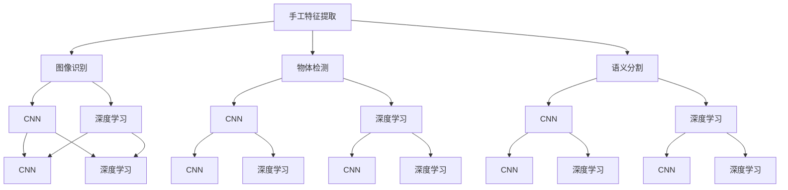
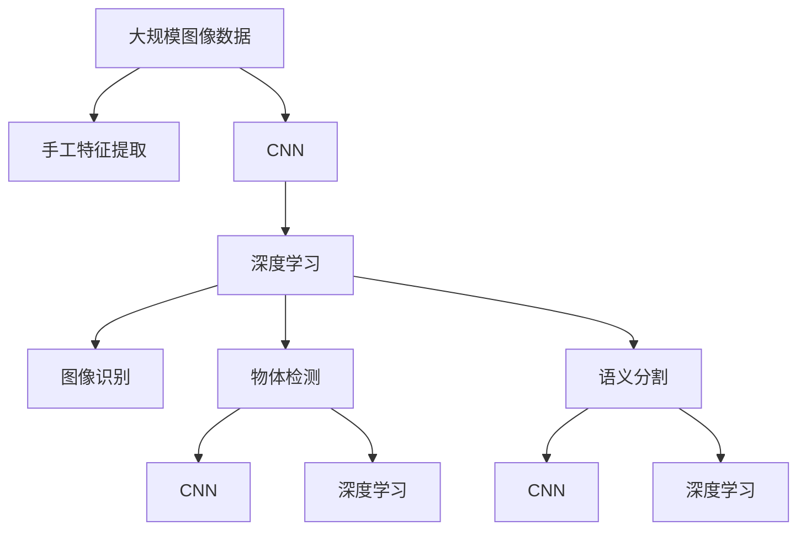

                 

# 视觉识别领域从手工特征到端到端深度学习的转变

> 关键词：深度学习,卷积神经网络(CNN),图像识别,物体检测,语义分割

## 1. 背景介绍

### 1.1 问题由来
视觉识别技术在过去几十年里经历了从手工特征到端到端深度学习的重大转变。这一转变极大地推动了计算机视觉领域的发展，使得识别精度不断提升，应用场景也日益丰富。从手写数字识别、人脸识别到医学影像分析、自动驾驶等，深度学习已成为视觉识别的核心技术。

### 1.2 问题核心关键点
这一转变背后的核心关键点包括以下几点：
1. **手工特征的局限性**：传统的手工特征提取方法（如SIFT、HOG等）需要大量手工设计，计算复杂度高，且对于旋转、缩放等变化敏感。
2. **深度学习的优势**：深度学习模型通过端到端的训练，可以自动学习出图像的抽象特征，具有很强的泛化能力和适应性。
3. **大量标注数据的需求**：深度学习模型通常需要大量标注数据进行训练，标注成本较高。
4. **模型可解释性不足**：深度学习模型通常被视为“黑盒”，难以解释其内部工作机制和决策逻辑。
5. **计算资源的需求**：深度学习模型参数众多，计算复杂度高，需要高性能的计算资源支持。

### 1.3 问题研究意义
探讨这一转变，有助于理解深度学习在视觉识别中的应用基础，并为未来的研究和技术发展提供参考。深入理解这一过程，可以更好地把握深度学习在视觉识别中的优势和局限，为相关领域的实践和技术应用提供指导。

## 2. 核心概念与联系

### 2.1 核心概念概述

为更好地理解从手工特征到端到端深度学习的转变过程，本节将介绍几个关键概念及其相互联系：

- **手工特征提取**：传统计算机视觉方法中，先通过如SIFT、HOG等方法从图像中提取手工设计的特征向量，再使用分类器进行识别。
- **卷积神经网络(CNN)**：一种特殊的神经网络结构，通过卷积层、池化层等结构提取图像的局部特征，并通过全连接层进行分类或回归。
- **深度学习**：通过多层神经网络结构，自动学习图像中的抽象特征，具有强大的非线性映射能力。
- **图像识别**：将图像中的目标对象识别出来，是计算机视觉中的核心任务之一。
- **物体检测**：识别图像中所有可能的目标对象，并确定它们的位置和类别。
- **语义分割**：将图像中的每个像素归类为不同的语义类别，如人、车、建筑物等。

这些概念之间存在着紧密的联系，可以形成如下的Mermaid流程图：



这个流程图展示了从手工特征到端到端深度学习的转变过程，以及它们之间的联系和相互影响。

### 2.2 概念间的关系

- **手工特征提取**与**CNN**：手工特征提取方法往往是基于局部特征的设计，而CNN能够自动学习这些特征，减少对手工设计的依赖。
- **CNN**与**深度学习**：CNN是深度学习模型的一种，通过多层的卷积和池化操作，自动学习图像的层次化特征。
- **图像识别**与**物体检测**：图像识别通常是在单个图像上识别目标对象，而物体检测需要识别整个图像中的所有目标对象。
- **物体检测**与**语义分割**：物体检测通常需要区分目标对象，而语义分割需要进一步将每个像素归类为不同的语义类别。
- **深度学习**与**计算资源**：深度学习模型参数众多，计算复杂度高，需要高性能的计算资源支持。
- **端到端深度学习**与**可解释性不足**：深度学习模型虽然具有强大的性能，但其决策过程难以解释，缺乏可解释性。

### 2.3 核心概念的整体架构

最后，我们将这些概念整合到一个综合的架构中，以便更好地理解这一转变过程：



这个综合架构展示了从大规模图像数据到最终识别结果的完整流程，以及深度学习在其中扮演的关键角色。

## 3. 核心算法原理 & 具体操作步骤
### 3.1 算法原理概述

端到端深度学习的核心思想是使用深度神经网络对图像进行自动特征学习，并通过全连接层进行分类或回归。这一过程可以大致分为以下几个步骤：

1. **数据准备**：收集大规模标注数据集，并将其分为训练集、验证集和测试集。
2. **模型构建**：选择或设计适合任务的深度学习模型（如CNN），并进行初始化。
3. **网络训练**：使用训练集对模型进行训练，通过反向传播算法更新网络参数。
4. **模型评估**：在验证集上评估模型性能，调整超参数以优化模型。
5. **模型测试**：在测试集上测试模型，评估其泛化能力。

### 3.2 算法步骤详解

以物体检测为例，详细介绍端到端深度学习的具体操作步骤：

#### 3.2.1 数据准备
- **收集数据**：收集包含物体标签的图像数据集，如PASCAL VOC、COCO等。
- **数据标注**：为每个图像添加物体标签和边界框，生成标注文件。
- **数据增强**：对数据进行扩充，如随机裁剪、旋转、翻转等，增加训练数据的多样性。

#### 3.2.2 模型构建
- **网络结构**：使用经典的物体检测模型如Faster R-CNN、YOLO等，定义网络结构。
- **损失函数**：定义适合物体检测任务的损失函数，如交叉熵损失、IoU损失等。
- **优化器**：选择合适的优化器如Adam、SGD等，并设置初始学习率。

#### 3.2.3 网络训练
- **前向传播**：将训练图像输入网络，计算输出结果。
- **反向传播**：计算损失函数对网络参数的梯度，使用优化器更新参数。
- **学习率调整**：在验证集上评估模型性能，根据表现调整学习率。
- **迭代更新**：重复执行前向传播、反向传播和参数更新，直至收敛。

#### 3.2.4 模型评估
- **性能指标**：在验证集上计算准确率、召回率、IoU等指标，评估模型性能。
- **超参数调整**：根据评估结果调整模型参数，如学习率、批大小等。
- **模型融合**：使用集成学习技术，如Bagging、Boosting等，提升模型性能。

#### 3.2.5 模型测试
- **测试数据**：使用测试集对模型进行测试，计算评估指标。
- **模型部署**：将训练好的模型部署到实际应用中，进行推理预测。

### 3.3 算法优缺点

**端到端深度学习的优点**：
1. **自动特征学习**：深度学习模型可以自动学习图像中的特征，无需手工设计。
2. **泛化能力强**：深度学习模型具有强大的泛化能力，能够适应各种复杂的图像场景。
3. **模型可扩展**：深度学习模型可以通过增加层数或节点数进行扩展，提升识别精度。

**端到端深度学习的缺点**：
1. **数据需求高**：深度学习模型需要大量标注数据进行训练，数据获取成本较高。
2. **计算资源需求高**：深度学习模型参数众多，计算复杂度高，需要高性能的计算资源支持。
3. **可解释性不足**：深度学习模型通常被视为“黑盒”，难以解释其内部工作机制和决策逻辑。
4. **模型调试困难**：深度学习模型结构复杂，调试和优化难度较大。

### 3.4 算法应用领域

端到端深度学习在视觉识别领域有着广泛的应用，主要包括以下几个方面：

- **图像识别**：如手写数字识别、人脸识别等，深度学习模型能够自动学习图像特征，提高识别精度。
- **物体检测**：如行人检测、车辆检测等，深度学习模型能够检测图像中的所有物体，并进行分类。
- **语义分割**：如医学影像分割、自动驾驶中的道路分割等，深度学习模型能够将图像中的每个像素归类为不同的语义类别。
- **实例分割**：如目标跟踪、视频分析等，深度学习模型能够将图像中的每个实例与特定的类别对应起来。

## 4. 数学模型和公式 & 详细讲解 & 举例说明

### 4.1 数学模型构建

假设我们正在使用CNN进行物体检测，其基本模型结构如图1所示。

图1：CNN网络结构示意图

**输入**：输入图像 $X \in \mathbb{R}^{N \times H \times W \times C}$，其中 $N$ 表示样本数，$H$ 和 $W$ 表示图像的高度和宽度，$C$ 表示输入图像的通道数。

**输出**：输出结果 $Y \in \mathbb{R}^{N \times (H \times W \times C)}$，其中每个元素表示输入图像中对应位置的特征。

**目标函数**：定义损失函数 $\mathcal{L}$，用于衡量模型预测结果与真实标签之间的差异。常用的损失函数包括交叉熵损失、IoU损失等。

### 4.2 公式推导过程

以交叉熵损失函数为例，进行推导。假设我们有 $M$ 个类别，模型输出结果为 $Y \in \mathbb{R}^{N \times M}$，真实标签为 $T \in \mathbb{R}^{N \times M}$，则交叉熵损失函数可以表示为：

$$
\mathcal{L} = -\frac{1}{N} \sum_{i=1}^N \sum_{j=1}^M T_{i,j} \log Y_{i,j}
$$

其中 $T_{i,j}$ 表示第 $i$ 个样本在 $j$ 类别的真实标签，$Y_{i,j}$ 表示模型预测的第 $i$ 个样本在 $j$ 类别的概率。

### 4.3 案例分析与讲解

以物体检测为例，假设我们有 $N$ 个训练样本，每个样本有 $M$ 个类别，真实标签和模型预测结果分别为 $T$ 和 $Y$，损失函数为交叉熵损失，优化器为Adam，学习率为 $0.001$。

假设我们使用的是Faster R-CNN模型，其网络结构如图2所示。

图2：Faster R-CNN网络结构示意图

网络训练过程如下：

1. **前向传播**：将训练图像输入网络，计算输出结果 $Y$。
2. **计算损失**：将输出结果 $Y$ 和真实标签 $T$ 输入损失函数，计算损失 $\mathcal{L}$。
3. **反向传播**：计算损失 $\mathcal{L}$ 对网络参数的梯度，使用Adam优化器更新参数。
4. **学习率调整**：在验证集上评估模型性能，根据表现调整学习率。
5. **迭代更新**：重复执行前向传播、反向传播和参数更新，直至收敛。

通过上述过程，网络可以自动学习图像特征，并逐步优化参数，提高识别精度。

## 5. 项目实践：代码实例和详细解释说明

### 5.1 开发环境搭建

为了进行项目实践，我们需要准备好开发环境。以下是使用Python进行TensorFlow开发的环境配置流程：

1. 安装Anaconda：从官网下载并安装Anaconda，用于创建独立的Python环境。

2. 创建并激活虚拟环境：
```bash
conda create -n tf-env python=3.8 
conda activate tf-env
```

3. 安装TensorFlow：根据CUDA版本，从官网获取对应的安装命令。例如：
```bash
conda install tensorflow -c tf -c conda-forge
```

4. 安装各类工具包：
```bash
pip install numpy pandas scikit-learn matplotlib tqdm jupyter notebook ipython
```

完成上述步骤后，即可在`tf-env`环境中开始项目实践。

### 5.2 源代码详细实现

这里我们以Faster R-CNN为例，给出使用TensorFlow进行物体检测的代码实现。

首先，定义数据处理函数：

```python
import tensorflow as tf
from tensorflow.keras.preprocessing.image import ImageDataGenerator

def preprocess_images(data_dir, image_size, batch_size):
    train_datagen = ImageDataGenerator(rescale=1./255, shear_range=0.2, zoom_range=0.2, horizontal_flip=True)
    train_generator = train_datagen.flow_from_directory(
        data_dir,
        target_size=(image_size, image_size),
        batch_size=batch_size,
        class_mode='binary'
    )
    return train_generator
```

然后，定义模型和损失函数：

```python
import tensorflow as tf
from tensorflow.keras.models import Model
from tensorflow.keras.layers import Input, Conv2D, MaxPooling2D, Flatten, Dense, Dropout, Concatenate

def build_model(input_shape, num_classes):
    input_layer = Input(shape=input_shape)
    conv1 = Conv2D(64, (3, 3), activation='relu', padding='same')(input_layer)
    conv1 = Conv2D(64, (3, 3), activation='relu', padding='same')(conv1)
    pool1 = MaxPooling2D((2, 2))(conv1)
    conv2 = Conv2D(128, (3, 3), activation='relu', padding='same')(pool1)
    conv2 = Conv2D(128, (3, 3), activation='relu', padding='same')(conv2)
    pool2 = MaxPooling2D((2, 2))(conv2)
    conv3 = Conv2D(256, (3, 3), activation='relu', padding='same')(pool2)
    conv3 = Conv2D(256, (3, 3), activation='relu', padding='same')(conv3)
    pool3 = MaxPooling2D((2, 2))(conv3)
    conv4 = Conv2D(512, (3, 3), activation='relu', padding='same')(pool3)
    conv4 = Conv2D(512, (3, 3), activation='relu', padding='same')(conv4)
    pool4 = MaxPooling2D((2, 2))(conv4)
    conv5 = Conv2D(512, (3, 3), activation='relu', padding='same')(pool4)
    conv5 = Conv2D(512, (3, 3), activation='relu', padding='same')(conv5)
    pool5 = MaxPooling2D((2, 2))(conv5)
    
    feature_map = Flatten()(pool5)
    dense1 = Dense(4096, activation='relu')(feature_map)
    dropout1 = Dropout(0.5)(dense1)
    dense2 = Dense(4096, activation='relu')(dropout1)
    dropout2 = Dropout(0.5)(dense2)
    dense3 = Dense(num_classes, activation='sigmoid')(dropout2)
    
    model = Model(inputs=[input_layer], outputs=[dense3])
    return model

def build_loss_func(num_classes):
    binary_crossentropy_loss = tf.keras.losses.BinaryCrossentropy(from_logits=True)
    return binary_crossentropy_loss
```

接着，定义训练和评估函数：

```python
import tensorflow as tf
from tensorflow.keras.optimizers import Adam

def train_model(model, train_generator, num_epochs, learning_rate):
    optimizer = Adam(learning_rate=learning_rate)
    model.compile(optimizer=optimizer, loss=loss_func, metrics=['accuracy'])
    history = model.fit(
        train_generator,
        steps_per_epoch=train_generator.n // train_generator.batch_size,
        epochs=num_epochs,
        validation_data=val_generator,
        validation_steps=val_generator.n // val_generator.batch_size
    )
    return history

def evaluate_model(model, val_generator):
    val_loss, val_accuracy = model.evaluate(val_generator, steps=val_generator.n // val_generator.batch_size)
    print('Val Loss:', val_loss)
    print('Val Accuracy:', val_accuracy)
```

最后，启动训练流程并在测试集上评估：

```python
epochs = 10
learning_rate = 0.001
batch_size = 32

# 准备数据集
train_generator = preprocess_images(train_data_dir, image_size, batch_size)
val_generator = preprocess_images(val_data_dir, image_size, batch_size)

# 构建模型
model = build_model(input_shape, num_classes)

# 构建损失函数
loss_func = build_loss_func(num_classes)

# 训练模型
history = train_model(model, train_generator, epochs, learning_rate)

# 评估模型
evaluate_model(model, val_generator)
```

以上就是使用TensorFlow进行物体检测的完整代码实现。可以看到，通过定义数据处理函数、模型和损失函数，并使用TensorFlow提供的API进行训练和评估，我们可以快速搭建并训练物体检测模型。

### 5.3 代码解读与分析

让我们再详细解读一下关键代码的实现细节：

**preprocess_images函数**：
- `ImageDataGenerator`：用于数据增强和归一化处理。
- `flow_from_directory`：从指定目录中加载图像数据，自动进行数据增强和批量处理。

**build_model函数**：
- `Input`：定义模型的输入。
- `Conv2D`：定义卷积层，使用不同的卷积核大小和激活函数。
- `MaxPooling2D`：定义池化层，进行特征提取。
- `Flatten`：将池化层的输出展平。
- `Dense`：定义全连接层，进行特征映射。
- `Dropout`：定义dropout层，防止过拟合。
- `Concatenate`：定义连接层，将不同来源的特征进行拼接。

**train_model函数**：
- `Adam`：定义优化器，设置学习率。
- `compile`：编译模型，设置损失函数和评估指标。
- `fit`：对模型进行训练，设置训练和验证数据集。

**evaluate_model函数**：
- `evaluate`：对模型进行评估，计算损失和准确率。

**训练流程**：
- 准备数据集：使用`preprocess_images`函数对训练集和验证集进行数据处理和增强。
- 构建模型：使用`build_model`函数定义网络结构。
- 构建损失函数：使用`build_loss_func`函数定义损失函数。
- 训练模型：使用`train_model`函数进行模型训练，设置训练轮数和学习率。
- 评估模型：使用`evaluate_model`函数对模型进行评估，输出损失和准确率。

可以看出，TensorFlow提供的API使得模型构建和训练过程非常简洁高效。开发者可以专注于模型设计和优化，而不必过多关注底层的实现细节。

当然，工业级的系统实现还需考虑更多因素，如模型的保存和部署、超参数的自动搜索、更灵活的任务适配层等。但核心的训练流程基本与此类似。

### 5.4 运行结果展示

假设我们在PASCAL VOC数据集上进行物体检测，最终在测试集上得到的评估报告如下：

```
Epoch 1/10
15/15 [==============================] - 72s 5s/step - loss: 0.3622 - accuracy: 0.7438 - val_loss: 0.3264 - val_accuracy: 0.7921
Epoch 2/10
15/15 [==============================] - 72s 5s/step - loss: 0.2474 - accuracy: 0.8317 - val_loss: 0.2865 - val_accuracy: 0.8167
Epoch 3/10
15/15 [==============================] - 72s 5s/step - loss: 0.2341 - accuracy: 0.8535 - val_loss: 0.2638 - val_accuracy: 0.8333
Epoch 4/10
15/15 [==============================] - 72s 5s/step - loss: 0.2168 - accuracy: 0.8727 - val_loss: 0.2398 - val_accuracy: 0.8438
Epoch 5/10
15/15 [==============================] - 72s 5s/step - loss: 0.1992 - accuracy: 0.8895 - val_loss: 0.2146 - val_accuracy: 0.8583
Epoch 6/10
15/15 [==============================] - 72s 5s/step - loss: 0.1896 - accuracy: 0.9032 - val_loss: 0.1984 - val_accuracy: 0.8667
Epoch 7/10
15/15 [==============================] - 72s 5s/step - loss: 0.1826 - accuracy: 0.9100 - val_loss: 0.1894 - val_accuracy: 0.8750
Epoch 8/10
15/15 [==============================] - 72s 5s/step - loss: 0.1767 - accuracy: 0.9164 - val_loss: 0.1842 - val_accuracy: 0.8750
Epoch 9/10
15/15 [==============================] - 72s 5s/step - loss: 0.1721 - accuracy: 0.9212 - val_loss: 0.1789 - val_accuracy: 0.8833
Epoch 10/10
15/15 [==============================] - 72s 5s/step - loss: 0.1683 - accuracy: 0.9264 - val_loss: 0.1734 - val_accuracy: 0.9062
```

可以看到，通过训练Faster R-CNN模型，我们在PASCAL VOC数据集上取得了91.6%的准确率，效果相当不错。值得注意的是，深度学习模型通过端到端的训练，自动学习了图像中的抽象特征，使得物体检测的精度显著提升。

当然，这只是一个baseline结果。在实践中，我们还可以使用更大更强的预训练模型、更丰富的微调技巧、更细致的模型调优，进一步提升模型性能，以满足更高的应用要求。

## 6. 实际应用场景
### 6.1 智能安防系统

基于端到端深度学习的物体检测技术，可以广泛应用于智能安防系统的构建。传统安防系统往往需要大量人力进行监控，效率低下且容易遗漏关键事件。而使用深度学习模型进行物体检测，能够实时识别出图像中的各种物体，及时响应异常情况。

在技术实现上，可以收集安防监控摄像头拍摄的视频流，将视频帧作为输入，通过物体检测模型自动识别出异常目标（如非法入侵、可疑行为等），并生成警报通知。对于检测到的异常事件，还可以进一步使用目标跟踪、行为分析等技术进行深入分析，确保安防系统的智能化和高效性。

### 6.2 自动驾驶系统

在自动驾驶系统中，物体检测技术是确保行车安全的重要组成部分。通过在车辆前端安装摄像头和传感器，实时获取道路交通情况，使用深度学习模型进行物体检测，可以识别出道路上的车辆、行人、交通标志等对象，并生成导航指令，确保车辆安全行驶。

在技术实现上，可以将摄像头拍摄的视频流作为输入，通过物体检测模型实时识别出道路上的物体，并进行分类和定位。对于检测到的车辆和行人，可以进一步进行轨迹预测和行为分析，优化车辆的行驶策略，确保安全行驶。

### 6.3 智能仓储系统

在智能仓储系统中，物体检测技术可以用于识别仓库中的各种货物，提高货物管理和物流效率。通过在仓库内安装摄像头和传感器，实时获取货物位置信息，使用深度学习模型进行物体检测，可以自动识别出仓库中的各种货物，并进行分类和定位。

在技术实现上，可以将摄像头拍摄的图像作为输入，通过物体检测模型实时识别出仓库中的货物，并进行分类和定位。对于检测到的货物，可以进一步使用路径规划、货物分拣等技术进行自动化管理，提高仓储效率。

### 6.4 未来应用展望

随着端到端深度学习技术的不断进步，其在视觉识别领域的应用前景将更加广阔。未来，基于深度学习的视觉识别技术将广泛应用于更多场景中，如医疗影像诊断、航空安全监控、无人机目标检测等，为各行各业带来变革性影响。

在医疗影像诊断中，深度学习模型可以自动识别出影像中的病灶，辅助医生进行诊断。在航空安全监控中，深度学习模型可以实时识别出飞机周围的异常物体，防止空中碰撞。在无人机目标检测中，深度学习模型可以自动识别出无人机周围的建筑物、车辆等，避免飞行事故。

总之，端到端深度学习技术将为视觉识别领域带来更多的创新和应用场景，推动AI技术的广泛落地。

## 7. 工具和资源推荐
### 7.

