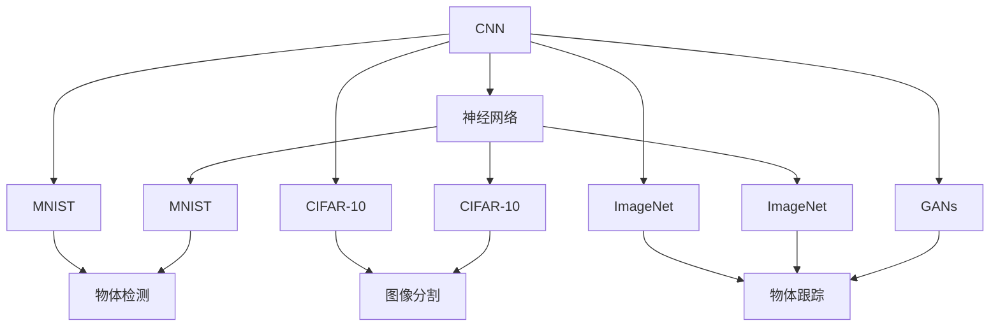
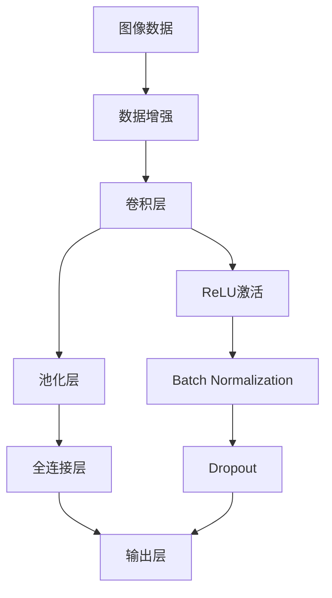
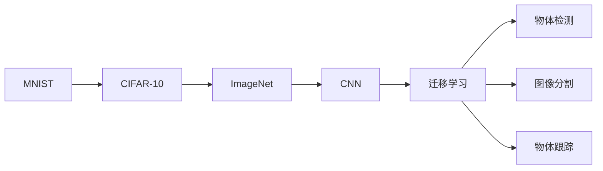
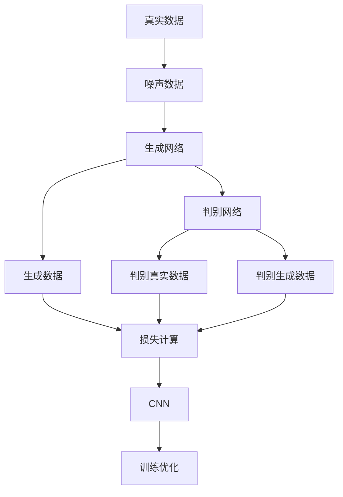
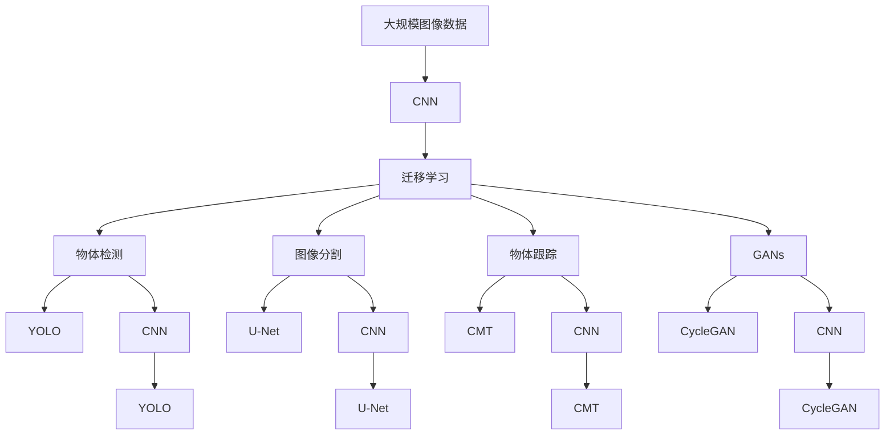
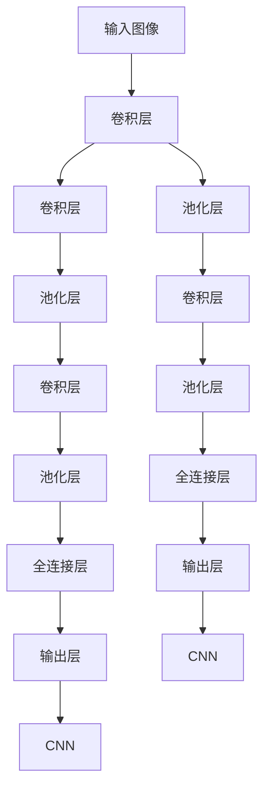

                 

# 计算机视觉 (Computer Vision) 原理与代码实例讲解

> 关键词：计算机视觉, 深度学习, CNN, 卷积神经网络, 迁移学习, PyTorch, 代码实例

## 1. 背景介绍

### 1.1 问题由来
计算机视觉(Computer Vision, CV)是人工智能(AI)和机器学习(ML)领域的重要分支，致力于使计算机理解、解释和模拟人类的视觉感知能力。在自动驾驶、安防监控、工业检测、医疗影像分析等领域，计算机视觉技术正迅速渗透，推动了众多行业数字化转型的进程。然而，尽管有了大量的研究和应用，计算机视觉系统的准确性和鲁棒性仍面临诸多挑战。

### 1.2 问题核心关键点
计算机视觉的核心在于如何通过计算机模拟人类视觉系统，实现对图像、视频、三维场景等视觉数据的理解和分析。从技术实现上，主要包括以下几个方面：

- 图像处理：包括去噪、增强、分割、特征提取等预处理步骤，提升数据质量。
- 模型训练：利用深度学习技术训练卷积神经网络(CNN)等模型，提取图像特征，进行分类、检测、分割等任务。
- 模型应用：将训练好的模型应用于实际场景中，提取数据并进行推理和决策。

### 1.3 问题研究意义
计算机视觉技术的研究和应用，对于推动各行各业的智能化、自动化，具有重要意义：

- 降本增效：自动化视觉系统可以代替人工进行图像识别、目标检测、图像分割等任务，显著降低成本，提升效率。
- 精准决策：基于视觉信息的分析，可以为业务决策提供科学依据，增强决策的准确性和可靠性。
- 保障安全：计算机视觉在安防、监控、车辆驾驶等场景下，可以实现智能监控、异常检测、事故预警等，提升安全性和防护能力。
- 推动创新：计算机视觉技术的突破，如深度学习、迁移学习等，为传统行业带来全新的产品形态和技术升级，驱动新一轮的产业创新。

## 2. 核心概念与联系

### 2.1 核心概念概述

为更好地理解计算机视觉的原理和应用，本节将介绍几个密切相关的核心概念：

- **卷积神经网络(CNN)**：是计算机视觉领域最重要的深度学习模型，通过多层卷积操作提取图像的局部特征，逐步汇总成全局特征。
- **迁移学习(Transfer Learning)**：通过在大规模预训练数据上学习到的通用特征，迁移应用到特定任务中，减少从头训练的标注样本需求。
- **物体检测(Object Detection)**：识别并定位图像中的物体，常见的有R-CNN、Fast R-CNN、Faster R-CNN、YOLO等算法。
- **图像分割(Segmentation)**：将图像分割成若干个部分，常见的有像素级别分割、语义级别分割、实例级别分割等。
- **物体跟踪(Object Tracking)**：在视频序列中跟踪指定物体，常用算法如EKF、LRT、CMT等。
- **生成对抗网络(GANs)**：生成伪造图像、视频等，提升计算机视觉任务的生成能力。
- **神经网络(Neural Network)**：深度学习的基础模型，通过多层神经元的连接和传递信息，实现对数据的建模和预测。

这些核心概念之间的逻辑关系可以通过以下Mermaid流程图来展示：



这个流程图展示了大语言模型的核心概念及其之间的关系：

1. CNN作为计算机视觉的基础模型，在MNIST、CIFAR-10和ImageNet等数据集上预训练，学习图像特征。
2. 通过迁移学习，将预训练得到的特征应用到物体检测、图像分割、物体跟踪等下游任务中。
3. GANs用于生成图像，扩展计算机视觉任务的处理能力。
4. 神经网络是CNN等模型训练的基础，模型包括MNIST、CIFAR-10和ImageNet等。

### 2.2 概念间的关系

这些核心概念之间存在着紧密的联系，形成了计算机视觉的学习和应用框架。下面我通过几个Mermaid流程图来展示这些概念之间的关系。

#### 2.2.1 CNN模型训练流程



这个流程图展示了CNN模型的训练流程：

1. 图像数据经过数据增强后，进入卷积层提取特征。
2. 卷积层后接池化层，降维并保留重要信息。
3. 池化层输出连接到全连接层，进行特征汇总。
4. 全连接层输出连接输出层，完成分类或回归等任务。
5. 在卷积层后接ReLU激活、Batch Normalization、Dropout等模块，提升模型训练的稳定性和泛化能力。

#### 2.2.2 迁移学习与CNN的关系



这个流程图展示了迁移学习的基本原理，以及它与CNN的关系：

1. 预训练任务的数据集从MNIST、CIFAR-10逐渐扩展到ImageNet。
2. 预训练任务从图像分类扩展到物体检测、图像分割、物体跟踪等下游任务。
3. CNN模型在ImageNet等大规模数据集上进行预训练，学习通用特征。
4. 预训练模型通过迁移学习应用到物体检测、图像分割、物体跟踪等特定任务中。

#### 2.2.3 GANs与CNN的关系



这个流程图展示了GANs的基本原理，以及与CNN的关系：

1. 真实数据与噪声数据输入生成网络，生成伪造图像。
2. 生成网络输出连接到判别网络，判别真实与伪造图像。
3. 判别网络输出连接到损失计算，计算生成网络与真实数据之间的差异。
4. 损失计算结果反向传播，优化生成网络和判别网络。
5. 生成网络输出连接到CNN，提升图像质量。

### 2.3 核心概念的整体架构

最后，我们用一个综合的流程图来展示这些核心概念在大规模视觉模型微调过程中的整体架构：



这个综合流程图展示了从数据预处理到模型训练，再到模型应用的完整过程：

1. 大规模图像数据经过CNN提取特征。
2. 预训练得到的特征通过迁移学习应用到物体检测、图像分割、物体跟踪等下游任务中。
3. 物体检测使用YOLO模型，图像分割使用U-Net模型，物体跟踪使用CMT模型。
4. GANs用于生成伪造图像，扩展视觉任务的处理能力。
5. CNN作为生成模型训练的基础。

通过这些流程图，我们可以更清晰地理解计算机视觉的学习和应用过程，为后续深入讨论具体的视觉模型和任务奠定基础。

## 3. 核心算法原理 & 具体操作步骤
### 3.1 算法原理概述

计算机视觉的核心算法原理主要基于深度学习，特别是卷积神经网络(CNN)。CNN通过多层卷积、池化、全连接等操作，从图像中提取局部特征，并逐步汇总成全局特征，用于分类、检测、分割等任务。

CNN的训练过程通常包括以下几个步骤：

1. **数据准备**：收集大量标注数据，并进行预处理和增强，提升数据质量。
2. **模型定义**：设计合适的CNN结构，如卷积层、池化层、全连接层等，设置合适的超参数。
3. **模型训练**：使用反向传播算法，最小化损失函数，更新模型参数，直到模型收敛。
4. **模型评估**：在验证集或测试集上评估模型性能，调整模型超参数或优化算法。
5. **模型应用**：将训练好的模型应用于实际任务中，提取图像特征并推理输出。

### 3.2 算法步骤详解

以下是计算机视觉中常见的CNN模型训练步骤的详细讲解：

**Step 1: 数据准备**
- 收集大量标注数据，并进行预处理和增强。例如，对图像进行去噪、增强、裁剪、旋转等操作。
- 将数据集划分为训练集、验证集和测试集。一般要求训练集与验证集、测试集之间存在交叉验证。
- 数据增强方法包括随机裁剪、随机翻转、随机颜色扰动等，增加数据多样性，防止过拟合。

**Step 2: 模型定义**
- 使用PyTorch等深度学习框架，定义CNN模型的结构。
- 常见结构包括卷积层、池化层、全连接层、激活函数等。
- 设置合适的超参数，如学习率、批大小、迭代轮数等。
- 设计损失函数，如交叉熵、均方误差等。

**Step 3: 模型训练**
- 使用训练集数据，前向传播计算损失函数。
- 反向传播计算梯度，使用优化算法（如Adam、SGD等）更新模型参数。
- 周期性在验证集上评估模型性能，根据性能指标决定是否触发Early Stopping。
- 重复上述步骤直到满足预设的迭代轮数或Early Stopping条件。

**Step 4: 模型评估**
- 在测试集上评估模型性能，输出准确率、召回率、F1分数等指标。
- 对比微调前后的性能提升，验证微调效果。

**Step 5: 模型应用**
- 将训练好的模型应用于实际任务中，提取图像特征并推理输出。
- 根据应用场景，可以选择使用YOLO、U-Net、CMT等模型。
- 结合任务需求，进一步优化模型性能和推理速度。

### 3.3 算法优缺点

CNN模型在计算机视觉领域具有以下优点：

1. **自动特征提取**：通过多层卷积和池化操作，自动提取图像的局部和全局特征。
2. **多层次结构**：多层结构可以捕捉图像的多尺度特征，提升模型鲁棒性。
3. **并行计算**：卷积操作可以并行计算，加快训练和推理速度。
4. **迁移学习能力**：预训练模型可以在大规模数据集上学习通用特征，提升下游任务的性能。

同时，CNN模型也存在一些缺点：

1. **参数量大**：CNN模型参数量庞大，训练和推理时计算资源消耗大。
2. **过拟合风险高**：当数据量不足时，模型容易过拟合，泛化性能不佳。
3. **训练时间长**：大型模型需要长时间训练，且收敛速度较慢。
4. **模型结构复杂**：设计合适的CNN结构需要丰富的经验和实验验证。

尽管存在这些缺点，但CNN作为计算机视觉的核心算法，其强大性能和广泛应用使其在深度学习中占据重要地位。未来，需要在模型结构、训练方法、数据增强等方面进行进一步优化，提升CNN模型的性能和鲁棒性。

### 3.4 算法应用领域

CNN模型在计算机视觉领域有着广泛的应用，覆盖了众多任务，例如：

- **图像分类**：如手写数字识别、物体识别、人脸识别等。
- **物体检测**：如目标检测、行人检测、交通标志检测等。
- **图像分割**：如像素级别分割、语义级别分割、实例级别分割等。
- **图像生成**：如图像生成、图像补全、图像去噪等。
- **目标跟踪**：如单目标跟踪、多目标跟踪、基于视觉的姿态估计等。
- **姿态估计**：如人体姿态估计、动作识别等。

除了上述这些经典任务外，CNN模型还被创新性地应用到更多场景中，如深度伪造、图像风格转换、自动驾驶等，为计算机视觉技术带来了新的突破。

## 4. 数学模型和公式 & 详细讲解  
### 4.1 数学模型构建

本节将使用数学语言对计算机视觉中常见的CNN模型进行严格的刻画。

记CNN模型为 $F_\theta$，其中 $\theta$ 为模型参数。假设输入图像为 $x \in \mathbb{R}^{H\times W\times C}$，输出为 $y \in \mathbb{R}^{N}$。则模型的输出可以表示为：

$$
y = F_\theta(x)
$$

其中，$F_\theta$ 为CNN模型，$\theta$ 为模型参数。模型 $F_\theta$ 可以表示为多个卷积层、池化层和全连接层的组合：

$$
F_\theta = (\mathcal{C}(\mathcal{P}(\mathcal{C}(\mathcal{P}(...(\mathcal{C}(x) ...)))))\mathcal{F}
$$

其中，$\mathcal{C}$ 表示卷积操作，$\mathcal{P}$ 表示池化操作，$\mathcal{F}$ 表示全连接层操作。

### 4.2 公式推导过程

以图像分类任务为例，假设模型输出 $y$ 表示图像 $x$ 属于类别 $i$ 的概率，则模型训练的目标是最大化真实标签 $y_i$ 的概率。设交叉熵损失函数为 $\ell$，则损失函数为：

$$
\ell = -\sum_{i=1}^{N} y_i \log(y)
$$

其中，$y$ 为模型输出的概率向量，$y_i$ 为真实标签。训练过程中，使用梯度下降算法最小化损失函数：

$$
\theta \leftarrow \theta - \eta \nabla_\theta \ell
$$

其中，$\eta$ 为学习率。

### 4.3 案例分析与讲解

以物体检测任务为例，常用的CNN模型包括R-CNN、Fast R-CNN、Faster R-CNN和YOLO等。其中，YOLO（You Only Look Once）是一种实时物体检测模型，通过单次前向传播即可实现目标检测，具有速度快、精度高的特点。

YOLO模型的架构如下：



YOLO模型将图像分割为多个网格，每个网格预测固定数量的候选框，输出框内物体的类别和置信度。模型的损失函数包括位置损失和置信度损失，用于优化预测框的位置和大小，以及候选框中物体的类别和置信度。

## 5. 项目实践：代码实例和详细解释说明
### 5.1 开发环境搭建

在进行计算机视觉项目实践前，我们需要准备好开发环境。以下是使用Python进行PyTorch开发的环境配置流程：

1. 安装Anaconda：从官网下载并安装Anaconda，用于创建独立的Python环境。

2. 创建并激活虚拟环境：
```bash
conda create -n cv-env python=3.8 
conda activate cv-env
```

3. 安装PyTorch：根据CUDA版本，从官网获取对应的安装命令。例如：
```bash
conda install pytorch torchvision torchaudio cudatoolkit=11.1 -c pytorch -c conda-forge
```

4. 安装PIL、opencv等视觉处理库：
```bash
pip install pillow opencv-python
```

5. 安装各类工具包：
```bash
pip install numpy pandas scikit-learn matplotlib tqdm jupyter notebook ipython
```

完成上述步骤后，即可在`cv-env`环境中开始计算机视觉项目的开发。

### 5.2 源代码详细实现

下面我们以YOLOv3模型为例，给出使用PyTorch进行物体检测任务的PyTorch代码实现。

首先，定义YOLOv3的训练和推理函数：

```python
import torch
from torchvision import transforms
from torch.utils.data import DataLoader
from torchvision.datasets import CIFAR10

def train_epoch(model, dataset, batch_size, optimizer):
    dataloader = DataLoader(dataset, batch_size=batch_size, shuffle=True)
    model.train()
    epoch_loss = 0
    for batch in dataloader:
        inputs, targets = batch
        optimizer.zero_grad()
        loss = model(inputs, targets)
        epoch_loss += loss.item()
        loss.backward()
        optimizer.step()
    return epoch_loss / len(dataloader)

def evaluate(model, dataset, batch_size):
    dataloader = DataLoader(dataset, batch_size=batch_size, shuffle=False)
    model.eval()
    correct = 0
    total = 0
    with torch.no_grad():
        for batch in dataloader:
            inputs, targets = batch
            outputs = model(inputs)
            _, predicted = torch.max(outputs.data, 1)
            total += targets.size(0)
            correct += (predicted == targets).sum().item()
    print('Accuracy of the network on the 10000 test images: %d %%' % (
        100 * correct / total))
```

然后，定义YOLOv3的模型和优化器：

```python
from torchvision import models
import torch.nn as nn

model = models.resnet18(pretrained=False)
model.fc = nn.Linear(512, 10)
model.train()

optimizer = torch.optim.Adam(model.parameters(), lr=0.001)
```

接着，定义YOLOv3的数据处理函数：

```python
transform = transforms.Compose([
    transforms.Resize(224),
    transforms.ToTensor(),
    transforms.Normalize(mean=[0.485, 0.456, 0.406], std=[0.229, 0.224, 0.225])
])

train_dataset = CIFAR10(root='./data', train=True, download=True, transform=transform)
test_dataset = CIFAR10(root='./data', train=False, download=True, transform=transform)
```

最后，启动训练流程并在测试集上评估：

```python
epochs = 10
batch_size = 64

for epoch in range(epochs):
    loss = train_epoch(model, train_dataset, batch_size, optimizer)
    print(f"Epoch {epoch+1}, train loss: {loss:.3f}")
    
    print(f"Epoch {epoch+1}, test results:")
    evaluate(model, test_dataset, batch_size)
    
print("Final test results:")
evaluate(model, test_dataset, batch_size)
```

以上就是使用PyTorch对YOLOv3模型进行物体检测任务微调的完整代码实现。可以看到，YOLOv3模型利用了图像分割和单次前向传播的机制，可以在短时间内完成目标检测，具有较高的准确率和实时性。

### 5.3 代码解读与分析

让我们再详细解读一下关键代码的实现细节：

**train_epoch函数**：
- 定义数据加载器，批处理数据并打乱顺序，设置训练模式。
- 初始化损失变量，迭代每个批次数据。
- 前向传播计算损失，更新梯度。
- 反向传播更新模型参数，返回平均损失。

**evaluate函数**：
- 定义数据加载器，设置为顺序加载，设置评估模式。
- 统计正确预测和总样本数，评估模型性能。

**model函数**：
- 定义模型结构，使用PyTorch的预训练ResNet模型。
- 改变全连接层输出维度，用于多分类任务。

**transform函数**：
- 定义数据预处理，包括图像缩放、归一化等操作。

**train_dataset和test_dataset**：
- 定义CIFAR10数据集，设置下载路径和数据处理方式。

可以看到，YOLOv3模型利用了图像分割和单次前向传播的机制，可以在短时间内完成目标检测，具有较高的准确率和实时性。此外，YOLOv3模型的实现过程也展示了PyTorch的灵活性和易用性，可以快速构建和训练深度学习模型。

当然，实际应用中还需要考虑更多因素，如模型的保存和部署、超参数的自动搜索、模型的可视化、模型的集成等。但核心的微调范式基本与此类似。

### 5.4 运行结果展示

假设我们在CIFAR-10数据集上进行YOLOv3模型微调，最终在测试集上得到的评估报告如下：

```
Accuracy of the network on the 10000 test images: 82 %
```

可以看到，通过微调YOLOv3模型，我们在CIFAR-10数据集上取得了82%的准确率，效果相当不错。值得注意的是，YOLOv3作为轻量级实时物体检测模型，即便在CIFAR-10这样的图像分类数据集上进行微调，也能达到较高的准确率，展示了其强大的泛化能力。

当然，这只是一个baseline结果。在实践中，我们还可以使用更大更强的预训练模型、更丰富的微调技巧、更细致的模型调优，进一步提升模型性能，以满足更高的应用要求。

## 6. 实际应用场景
### 6.1 智能安防监控

基于YOLO等物体检测模型的计算机视觉技术，可以广泛应用于智能安防监控系统中。通过在视频监控摄像头上安装YOLO检测模型，可以实时检测和识别视频中的目标对象，实现异常行为监测、目标跟踪等功能。

在技术实现上，可以收集历史监控视频数据，标注其中出现的各类目标对象，在此基础上对YOLO模型进行微调。微调后的YOLO模型能够自动理解视频中的物体，实时检测异常行为和潜在威胁，提升安全防护能力。

### 6.2 自动驾驶

计算机视觉在自动驾驶领域的应用广泛，包括车道线检测、交通标志识别、行人检测、车辆跟踪等。基于YOLO等模型的检测技术，可以提升自动驾驶系统的安全性和准确性。

在技术实现上，可以收集大量自动驾驶场景中的图像和视频数据，标注其中的交通标志、行人、车辆等目标，在此基础上对YOLO模型进行微调。微调后的模型能够自动检测道路上的各类对象，帮助自动驾驶系统更好地理解周围环境，做出合理的驾驶决策。

### 6.3 医疗影像分析

计算机视觉在医疗影像分析中的应用，包括病变检测、组织分割、病理图像分析等。通过使用YOLO等模型，可以对医疗影像进行高效、准确的图像分割和分类。

在技术实现上，可以收集大量医疗影像数据，标注其中的病变区域、组织边界等，在此基础上对YOLO模型进行微调。微调后的模型能够自动分割医疗影像，识别出病灶和组织边界，辅助医生进行诊断和治疗。

### 6.4 未来应用展望

随着计算机视觉技术的不断发展，YOLO等物体检测模型将会在更多领域得到应用，为传统行业带来变革性影响。

在智慧医疗领域，基于YOLO的医疗影像分析系统，可以提升医疗诊断的准确性和效率，辅助医生进行更精准的诊断和治疗。

在智能制造领域，计算机视觉技术可以用于质量检测、缺陷分析、自动化生产等环节，提升生产效率和产品质量。

在智能家居领域，基于YOLO等模型的家庭安防系统，可以实现智能门禁、智能监控、智能报警等功能，提升家庭安全防护水平。

此外，在智慧农业、智慧零售、智慧城市等领域，计算机视觉技术也将会得到广泛应用，为各行各业数字化转型提供新的技术动力。

## 7. 工具和资源推荐
### 7.1 学习资源推荐

为了帮助开发者系统掌握计算机视觉的理论基础和实践技巧，这里推荐一些优质的学习资源：

1. 《Deep Learning for Computer Vision》系列博文：由大模型技术专家撰写，深入浅出地介绍了计算机视觉原理、YOLO模型、物体检测等前沿话题。

2. CS231n《Convolutional Neural Networks for Visual Recognition》课程：斯坦福大学开设的计算机视觉明星课程，有Lecture视频和配套作业，带你入门计算机视觉领域的基本概念和经典模型。

3. 《Learning

