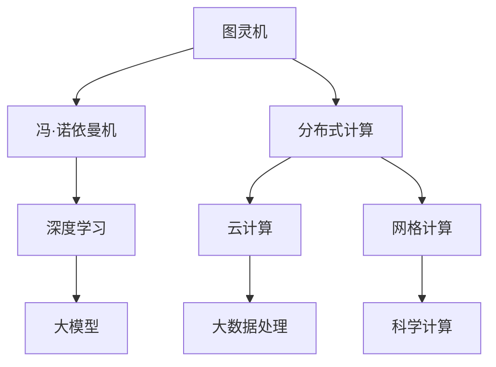

                 

## 1. 背景介绍

### 1.1 问题由来

计算机科学的发展史，本身就是一部计算范式演进的历史。从早期的图灵机理论到现今的深度学习大模型，计算范式的每一次变革，都带来了计算能力的巨大飞跃，并为现代信息技术奠定了坚实的基础。

图灵机作为计算机科学的基石，虽然从未被超越，但随着硬件技术的进步和算法的创新，计算范式已经从传统的串行计算、并行计算，发展到分布式计算、量子计算，再到今天的人工智能大模型。这种范式的演进，不仅极大地提升了计算能力，还开辟了全新的应用领域，对人类社会产生了深远的影响。

### 1.2 问题核心关键点

理解计算范式的发展脉络，有助于把握未来计算技术的趋势，促进其在人工智能、大数据、通信等领域的应用创新。本文将从图灵机的诞生，到深度学习大模型的兴起，系统梳理计算范式的演变，并结合具体案例，深入探讨大模型在未来科技革命中的潜力和挑战。

## 2. 核心概念与联系

### 2.1 核心概念概述

本节将介绍几个关键概念，包括图灵机、冯·诺依曼机、分布式计算、深度学习、大模型等，并展示它们之间的联系。

- **图灵机**：由英国数学家图灵于1936年提出，是计算理论的基础。它通过读写带上的符号，模拟抽象的计算过程，证明了一些基本计算问题的不可能性，奠定了现代计算机科学的基础。

- **冯·诺依曼机**：由冯·诺依曼提出，定义了现代计算机的结构，包括存储程序、运算器、控制器、输入输出设备等。这种集中式计算模式，奠定了现代计算机硬件的设计标准。

- **分布式计算**：由多个计算节点共同协作完成复杂任务，提高了计算效率和系统可靠性。大规模分布式系统如云计算、网格计算，已经广泛应用于科学计算、数据处理等领域。

- **深度学习**：以人工神经网络为基础，通过多层次的特征抽象和数据拟合，实现对复杂模式的学习。深度学习在计算机视觉、自然语言处理等领域取得了重大突破，被广泛应用于各类智能系统。

- **大模型**：以深度学习为基础，通过在大规模数据集上进行预训练，构建包含亿万级别参数的模型。大模型具备强大的自适应能力和泛化能力，已经在自然语言处理、图像识别等领域取得了显著的成果。

这些概念相互联系、层层递进，共同构成了现代计算技术的发展脉络。从图灵机的抽象计算模型，到冯·诺依曼机的硬件设计，再到分布式计算的协同合作，最终成就了深度学习大模型的计算范式。

### 2.2 概念间的关系

这些概念之间的关系可以通过以下Mermaid流程图来展示：



这个流程图展示了几大计算范式之间的联系：

- 图灵机是计算理论的起点，奠定了现代计算机科学的基础。
- 冯·诺依曼机的硬件设计标准，是现代计算机的重要参考。
- 分布式计算通过协同合作，提升了计算效率和系统可靠性。
- 深度学习通过多层次特征抽象，实现了对复杂模式的有效学习。
- 大模型在深度学习的基础上，进一步提升了计算能力和应用价值。

## 3. 核心算法原理 & 具体操作步骤
### 3.1 算法原理概述

深度学习大模型的核心原理是基于反向传播算法，通过多层次的特征抽象和数据拟合，实现对复杂模式的学习。大模型的构建分为预训练和微调两个阶段：

- **预训练**：在大规模无标签数据上，通过自监督任务（如掩码语言模型、自编码等）进行特征学习，构建通用的语言或视觉表示。
- **微调**：在预训练模型基础上，使用特定任务的标注数据进行有监督训练，优化模型在该任务上的性能。

大模型的计算过程包括以下关键步骤：

- **前向传播**：输入数据经过模型多层次的特征抽取，输出预测结果。
- **损失计算**：根据预测结果与真实标签的差异，计算损失函数。
- **反向传播**：利用链式法则，反向传播计算梯度，更新模型参数。
- **迭代优化**：重复前向传播和反向传播，逐步优化模型参数，直至收敛。

### 3.2 算法步骤详解

下面以BERT模型为例，详细介绍深度学习大模型的构建过程：

**Step 1: 准备数据集和模型**

- 收集大规模无标签数据，如Pile、BigQuery等，用于预训练。
- 收集特定任务的标注数据，如IMDb、CoNLL等，用于微调。
- 选择适当的深度学习框架（如TensorFlow、PyTorch等）和预训练模型（如BERT、GPT等）。

**Step 2: 定义模型结构和损失函数**

- 定义模型的架构，包括输入层、嵌入层、多层注意力机制、输出层等。
- 定义损失函数，如交叉熵损失、均方误差损失等。
- 定义优化器，如Adam、SGD等。

**Step 3: 预训练阶段**

- 在预训练数据集上，输入数据经过嵌入层转化为向量，通过多层次的注意力机制进行特征提取。
- 输出经过softmax层转化为概率分布，计算掩码语言模型或自编码等损失函数。
- 反向传播计算梯度，更新模型参数。
- 重复迭代，直到收敛。

**Step 4: 微调阶段**

- 在微调数据集上，输入数据经过嵌入层转化为向量，通过多层次的注意力机制进行特征提取。
- 输出经过特定任务的输出层，计算损失函数。
- 反向传播计算梯度，更新模型参数。
- 重复迭代，直到收敛。

### 3.3 算法优缺点

深度学习大模型的优势在于其强大的特征抽象和泛化能力，能够在各种复杂任务中取得优异的表现。但同时也存在以下缺点：

- **计算资源需求高**：大模型参数量大，训练和推理过程中需要消耗大量的计算资源。
- **过拟合风险大**：在标注数据不足的情况下，大模型容易出现过拟合。
- **可解释性差**：大模型的决策过程复杂，缺乏可解释性。
- **部署成本高**：大模型的推理过程复杂，需要高精度的硬件支持。

### 3.4 算法应用领域

深度学习大模型已经在计算机视觉、自然语言处理、语音识别、推荐系统等多个领域取得了突破性进展。以下是一些典型应用：

- **自然语言处理**：BERT、GPT等大模型在情感分析、文本分类、机器翻译、问答系统等任务上表现优异。
- **计算机视觉**：ResNet、DenseNet等大模型在图像分类、目标检测、图像生成等任务上取得了显著成果。
- **语音识别**：Transformer-based模型在语音识别、语音合成等任务上展示了强大的能力。
- **推荐系统**：基于大模型的协同过滤、深度神经网络等方法，显著提升了推荐系统的精准度和个性化程度。

## 4. 数学模型和公式 & 详细讲解 & 举例说明
### 4.1 数学模型构建

深度学习大模型的数学模型可以表示为：

$$
\hat{y} = f_\theta(x)
$$

其中，$x$ 为输入数据，$\hat{y}$ 为预测输出，$f_\theta$ 为模型函数，$\theta$ 为模型参数。模型函数的表达式可以采用深度神经网络来定义。

### 4.2 公式推导过程

以BERT模型为例，其预训练过程可以表示为：

$$
\mathcal{L}_{masked\ lm} = -\frac{1}{N}\sum_{i=1}^{N} \sum_{j=1}^{T}\text{log}(p_j(x_i))
$$

其中，$\mathcal{L}_{masked\ lm}$ 为掩码语言模型损失函数，$x_i$ 为输入文本，$p_j(x_i)$ 为模型对输入文本的第 $j$ 个位置的概率预测。

在微调过程中，目标函数可以表示为：

$$
\mathcal{L}_{task} = -\frac{1}{N}\sum_{i=1}^{N} \text{log}(p_i(y_i | x_i))
$$

其中，$\mathcal{L}_{task}$ 为任务特定损失函数，$y_i$ 为任务标签，$x_i$ 为输入数据。

### 4.3 案例分析与讲解

以BERT模型为例，其预训练过程可以分为以下几个步骤：

1. 随机初始化模型参数。
2. 在预训练数据集上，随机掩码部分单词，输入模型进行预测。
3. 计算掩码语言模型损失函数，反向传播更新模型参数。
4. 重复迭代，直至收敛。

## 5. 项目实践：代码实例和详细解释说明
### 5.1 开发环境搭建

要搭建深度学习大模型的开发环境，需要以下步骤：

1. 安装Python环境，确保至少3.5以上的版本。
2. 安装所需的深度学习框架，如TensorFlow、PyTorch等。
3. 安装相关的库和工具，如NumPy、Pandas、Matplotlib等。
4. 搭建分布式计算环境，如使用TensorFlow的分布式训练功能。

### 5.2 源代码详细实现

以下以BERT模型为例，展示其预训练和微调过程的代码实现：

**BERT预训练代码**：

```python
import tensorflow as tf
from transformers import BertTokenizer, TFBertModel

# 初始化BERT模型和分词器
model = TFBertModel.from_pretrained('bert-base-uncased')
tokenizer = BertTokenizer.from_pretrained('bert-base-uncased')

# 构建输入序列和标签
input_ids = tokenizer.encode("Hello, my dog is cute", add_special_tokens=True)
input_mask = [1] * len(input_ids)

# 前向传播
with tf.GradientTape() as tape:
    outputs = model(input_ids, attention_mask=input_mask)
    loss = outputs[0]

# 计算损失函数
loss = tf.reduce_mean(loss)

# 反向传播
gradients = tape.gradient(loss, model.trainable_variables)
optimizer.apply_gradients(zip(gradients, model.trainable_variables))
```

**BERT微调代码**：

```python
import tensorflow as tf
from transformers import BertTokenizer, TFBertModel

# 初始化BERT模型和分词器
model = TFBertModel.from_pretrained('bert-base-uncased')
tokenizer = BertTokenizer.from_pretrained('bert-base-uncased')

# 构建输入序列和标签
input_ids = tokenizer.encode("I love programming", add_special_tokens=True)
input_mask = [1] * len(input_ids)
labels = [1]

# 前向传播
with tf.GradientTape() as tape:
    outputs = model(input_ids, attention_mask=input_mask, labels=labels)
    loss = outputs[0]

# 计算损失函数
loss = tf.reduce_mean(loss)

# 反向传播
gradients = tape.gradient(loss, model.trainable_variables)
optimizer.apply_gradients(zip(gradients, model.trainable_variables))
```

### 5.3 代码解读与分析

**BERT预训练代码**：

- 首先导入所需的库和模型。
- 初始化BERT模型和分词器，加载预训练模型。
- 构建输入序列和标签，使用分词器进行分词和编码。
- 前向传播计算模型输出。
- 计算掩码语言模型损失函数。
- 反向传播更新模型参数。

**BERT微调代码**：

- 首先导入所需的库和模型。
- 初始化BERT模型和分词器，加载预训练模型。
- 构建输入序列和标签，使用分词器进行分词和编码。
- 前向传播计算模型输出。
- 计算任务特定损失函数。
- 反向传播更新模型参数。

## 6. 实际应用场景
### 6.1 智能客服系统

智能客服系统通过深度学习大模型，可以实现自然语言理解和生成，与用户进行自然的对话交流。系统可以通过预训练模型进行基础理解和预处理，再通过微调模型针对具体任务进行优化。

**具体实现**：
- 收集历史客服对话数据，标注问题和答案。
- 使用预训练模型进行初步理解和分词处理。
- 微调模型针对特定的问答任务进行优化。
- 构建自然语言处理模型，实现问答、推荐、聊天等功能。

### 6.2 金融舆情监测

金融舆情监测系统利用深度学习大模型，可以从海量文本数据中提取有价值的信息，辅助金融决策。系统通过预训练模型进行基本情感分析，再通过微调模型针对特定的金融舆情任务进行优化。

**具体实现**：
- 收集金融领域的文本数据，标注情感标签。
- 使用预训练模型进行基本情感分析。
- 微调模型针对特定的舆情监测任务进行优化。
- 构建金融舆情监测系统，实现实时监控、预警和分析。

### 6.3 个性化推荐系统

个性化推荐系统通过深度学习大模型，可以实现对用户兴趣的精准分析和推荐。系统可以通过预训练模型进行基础特征学习，再通过微调模型针对特定的推荐任务进行优化。

**具体实现**：
- 收集用户行为数据，标注用户兴趣。
- 使用预训练模型进行基础特征学习。
- 微调模型针对特定的推荐任务进行优化。
- 构建个性化推荐系统，实现精准推荐。

### 6.4 未来应用展望

未来，深度学习大模型将广泛应用于各个领域，推动科技的进步和社会的进步。以下是一些可能的应用场景：

- **智慧医疗**：通过深度学习大模型，实现疾病诊断、病历分析、智能诊断等功能。
- **智能教育**：通过深度学习大模型，实现智能辅导、智能评测、智能推荐等功能。
- **智慧城市**：通过深度学习大模型，实现智能交通、智能安防、智能能源等功能。
- **智能制造**：通过深度学习大模型，实现智能检测、智能调度、智能运维等功能。

## 7. 工具和资源推荐
### 7.1 学习资源推荐

- **深度学习书籍**：
  - 《深度学习》（Ian Goodfellow）：介绍了深度学习的理论基础和实践技巧。
  - 《神经网络与深度学习》（Michael Nielsen）：深入浅出地介绍了神经网络的基本原理和应用。
  - 《动手学深度学习》（李沐）：提供了丰富的代码示例和实战经验。

- **在线课程**：
  - Coursera的深度学习课程。
  - Udacity的深度学习纳米学位课程。
  - edX的深度学习课程。

### 7.2 开发工具推荐

- **深度学习框架**：
  - TensorFlow：Google开发的深度学习框架，支持分布式训练和高效的计算图。
  - PyTorch：Facebook开发的深度学习框架，支持动态图和灵活的模型构建。
  - MXNet：微软开发的深度学习框架，支持多语言和多设备。

- **模型库**：
  - TensorFlow Hub：提供大量的预训练模型和组件。
  - PyTorch Hub：提供丰富的预训练模型和组件。
  - HuggingFace的Transformers：提供多种先进的预训练模型和组件。

### 7.3 相关论文推荐

- **深度学习论文**：
  - Deep Residual Learning for Image Recognition（ResNet）：提出了深度残差网络，提升了图像识别的准确率。
  - Attention is All You Need（Transformer）：提出了自注意力机制，提升了自然语言处理的效率和效果。
  - BERT: Pre-training of Deep Bidirectional Transformers for Language Understanding：提出了BERT模型，改进了语言理解的性能。

## 8. 总结：未来发展趋势与挑战
### 8.1 研究成果总结

深度学习大模型的研究在过去十年取得了重大进展，推动了人工智能技术的发展。以下是对深度学习大模型研究的主要成果总结：

- **预训练技术的突破**：提出了掩码语言模型、自编码等预训练任务，提升了模型的特征学习能力和泛化能力。
- **分布式计算的进步**：实现了大规模分布式训练，提高了模型的计算效率和系统可靠性。
- **硬件技术的进步**：推动了GPU、TPU等高性能计算硬件的发展，提供了更加高效的计算环境。
- **算法创新的突破**：提出了Transformer等先进的神经网络架构，提升了模型的计算效率和性能。
- **应用领域的拓展**：推动了深度学习大模型在自然语言处理、计算机视觉、语音识别等领域的应用，解决了许多实际问题。

### 8.2 未来发展趋势

未来，深度学习大模型将呈现出以下几个发展趋势：

- **模型规模的增长**：随着计算能力的提升，深度学习大模型的参数量将继续增加，具备更强的表征能力和泛化能力。
- **算法的创新**：将出现更多先进的神经网络架构和训练方法，提升模型的计算效率和效果。
- **硬件的突破**：量子计算、类脑计算等新技术将进一步提升计算能力，推动大模型的发展。
- **跨领域的应用**：深度学习大模型将应用于更多领域，解决复杂的多模态融合问题。
- **伦理与安全**：将更加重视大模型的伦理与安全问题，确保模型的可靠性和安全性。

### 8.3 面临的挑战

尽管深度学习大模型取得了显著的成果，但在未来应用中仍面临以下挑战：

- **计算资源的瓶颈**：大规模深度学习大模型的计算需求极高，需要高性能计算资源的支持。
- **过拟合问题**：在标注数据不足的情况下，深度学习大模型容易出现过拟合。
- **可解释性问题**：深度学习大模型缺乏可解释性，难以理解模型的内部机制。
- **伦理与安全问题**：深度学习大模型可能存在偏见、歧视等伦理问题，需确保模型的安全性与公平性。
- **隐私保护问题**：深度学习大模型需要大量的数据进行训练，可能涉及用户隐私问题。

### 8.4 研究展望

未来，深度学习大模型的研究需要关注以下几个方面：

- **跨领域知识整合**：将符号化的先验知识与深度学习大模型结合，提升模型的泛化能力和推理能力。
- **多模态融合**：将深度学习大模型应用于多模态数据融合，提升模型的鲁棒性和泛化能力。
- **分布式计算优化**：优化分布式计算环境，提升大规模深度学习大模型的训练效率和性能。
- **可解释性增强**：提升深度学习大模型的可解释性，增强模型的透明度和可信度。
- **伦理与安全保障**：确保深度学习大模型的伦理与安全，避免有害的输出结果。

## 9. 附录：常见问题与解答

**Q1: 如何理解深度学习大模型与传统机器学习模型的区别？**

A: 深度学习大模型与传统机器学习模型最大的区别在于其模型的复杂度和参数量。传统机器学习模型通常具有较少的参数量，只能处理线性或非线性的简单模式。而深度学习大模型具备亿万级别的参数量，能够处理更加复杂和多样的模式，具备更强的特征学习和泛化能力。

**Q2: 为什么深度学习大模型需要进行预训练和微调？**

A: 深度学习大模型需要进行预训练和微调，原因如下：
- 预训练阶段在大规模无标签数据上进行特征学习，能够获取丰富的语言或视觉知识。
- 微调阶段在特定任务上进行有监督训练，能够优化模型在该任务上的性能。
- 预训练和微调相结合，能够提升模型的泛化能力和计算效率。

**Q3: 如何提高深度学习大模型的训练效率？**

A: 提高深度学习大模型的训练效率，可以从以下几个方面进行优化：
- 使用分布式计算环境，提升训练速度。
- 使用混合精度训练和梯度累积等技术，减少内存和显存消耗。
- 优化模型结构，减少计算复杂度。
- 使用预训练和微调相结合的策略，提升模型性能。

**Q4: 深度学习大模型的应用场景有哪些？**

A: 深度学习大模型已经在多个领域取得了显著成果，以下是一些典型应用场景：
- 自然语言处理：情感分析、文本分类、机器翻译等。
- 计算机视觉：图像分类、目标检测、图像生成等。
- 语音识别：语音识别、语音合成等。
- 推荐系统：协同过滤、深度神经网络等。

**Q5: 深度学习大模型面临的伦理与安全问题有哪些？**

A: 深度学习大模型面临的伦理与安全问题包括：
- 偏见与歧视：模型可能存在对某些群体的偏见和歧视。
- 误导性输出：模型可能产生误导性的输出，造成不良影响。
- 隐私保护：模型需要大量的数据进行训练，可能涉及用户隐私问题。
- 安全性问题：模型可能被恶意攻击，导致系统漏洞。

---

作者：禅与计算机程序设计艺术 / Zen and the Art of Computer Programming

