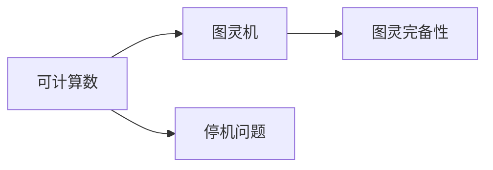
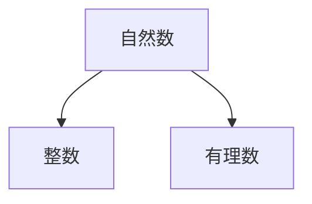
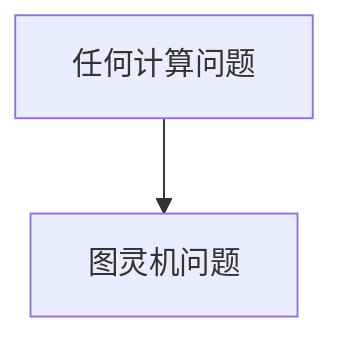

                 

# 计算：第三部分 计算理论的形成 第 8 章 计算理论的诞生：图灵的可计算数 可计算数

## 1. 背景介绍

### 1.1 问题由来

随着计算机科学的发展，计算理论成为了研究计算问题的基础。图灵的可计算数概念在这一过程中起到了关键作用。这一概念不仅奠定了计算理论的基础，还为计算机科学带来了深远的影响。

### 1.2 问题核心关键点

图灵的可计算数概念主要包括以下几个核心点：
- 可计算数：图灵机可以计算的数集，包括自然数、整数、有理数等。
- 停机问题：图灵机能否在有限步内停止计算的问题。
- 图灵完备性：任何计算问题都可以转化为图灵机问题。

这些核心概念通过图灵机的模型，为计算理论的研究提供了强大的工具。通过理解和运用这些概念，研究人员能够更好地理解和解决各种计算问题。

### 1.3 问题研究意义

理解图灵的可计算数概念，对于深入理解计算机科学、人工智能、数据科学等领域具有重要意义。具体包括：
- 提供理论基础：图灵机的计算能力和停机问题的研究，为计算机科学的理论研究提供了基础。
- 推动技术发展：可计算数的概念促进了计算机硬件和软件的发展。
- 提升应用能力：图灵完备性概念的应用，使计算机可以处理各种复杂的计算问题。

## 2. 核心概念与联系

### 2.1 核心概念概述

图灵的可计算数概念是计算理论的重要组成部分，其主要涉及以下关键概念：

- **可计算数**：指图灵机可以计算的数集，包括自然数、整数、有理数等。
- **图灵机**：一种抽象的计算模型，通过输入符号和输出符号进行计算。
- **停机问题**：图灵机能否在有限步内停止计算的问题。
- **图灵完备性**：任何计算问题都可以转化为图灵机问题。

这些概念之间的关系可以通过以下Mermaid流程图来展示：



这个流程图展示了可计算数与图灵机的关系，以及停机问题和图灵完备性概念的引入。

### 2.2 概念间的关系

这些核心概念之间存在着紧密的联系，形成了图灵机理论的完整生态系统。下面我们通过几个Mermaid流程图来展示这些概念之间的关系。

#### 2.2.1 可计算数的定义



这个流程图展示了可计算数中几种常见的数集，以及它们之间的关系。

#### 2.2.2 图灵机与停机问题


这个流程图展示了图灵机与停机问题之间的关系。

#### 2.2.3 图灵完备性



这个流程图展示了图灵完备性概念的应用范围。

## 3. 核心算法原理 & 具体操作步骤

### 3.1 算法原理概述

图灵的可计算数概念主要通过图灵机的计算模型来定义。图灵机是一种抽象的计算模型，由一个无限长的带子、读写头、一个有限状态集合和转移函数组成。其核心思想是通过输入符号和输出符号进行计算，从而解决各种计算问题。

可计算数指的是图灵机可以计算的数集，包括自然数、整数、有理数等。图灵完备性则表明任何计算问题都可以转化为图灵机问题，从而可以通过图灵机进行计算。

### 3.2 算法步骤详解

基于图灵的可计算数概念，下面是图灵机计算过程的详细步骤：

1. **初始化**：图灵机从一个初始状态开始，读取输入符号，并开始计算。

2. **状态转移**：根据当前状态和输入符号，图灵机选择一个转移函数，将读写头移动到新的位置，并更新状态。

3. **计算终止**：当图灵机到达一个终止状态时，计算结束，输出结果。

4. **停机问题**：如果图灵机在有限步内未到达终止状态，则认为该问题不可计算。

### 3.3 算法优缺点

图灵的可计算数概念具有以下优点：
- 提供理论基础：奠定了计算理论的基础，为计算机科学提供了理论支持。
- 推动技术发展：促进了计算机硬件和软件的发展，提高了计算效率。

同时，该概念也存在以下缺点：
- 过于抽象：概念较为抽象，难以直接应用到具体问题中。
- 计算限制：可计算数概念只适用于有限的问题，无法处理无限复杂的问题。

### 3.4 算法应用领域

图灵的可计算数概念广泛应用于计算机科学、人工智能、数据科学等领域，具体包括：
- 计算机理论：奠定了计算理论的基础，为计算机科学的发展提供了理论支持。
- 算法设计：促进了各种计算问题的算法设计，提高了算法效率。
- 计算语言学：为计算语言学的研究提供了理论基础。

## 4. 数学模型和公式 & 详细讲解 & 举例说明

### 4.1 数学模型构建

图灵的可计算数概念可以通过数学模型来进一步描述。下面给出图灵机计算过程的数学模型：

设图灵机有 $n$ 个状态，每个状态有 $m$ 个转移函数，读入符号集 $\Sigma$ 中的每个符号，输出符号集 $\Sigma$ 中的每个符号。则图灵机的计算过程可以表示为：

$$
\mathcal{M} = (\Sigma, Q, \Gamma, \delta, q_0, q_f)
$$

其中，$\Sigma$ 为输入符号集，$Q$ 为状态集合，$\Gamma$ 为符号集，$\delta$ 为转移函数，$q_0$ 为初始状态，$q_f$ 为终止状态。

### 4.2 公式推导过程

下面推导图灵机的转移函数 $\delta$ 的数学表达式。设当前状态为 $q$，读入符号为 $a$，输出符号为 $b$，则转移函数 $\delta$ 可以表示为：

$$
\delta(q,a) = (q', b)
$$

其中，$q'$ 为下一个状态，$b$ 为输出符号。

图灵机的计算过程可以表示为：

$$
\sigma_0 \to \sigma_1 \to \ldots \to \sigma_n
$$

其中 $\sigma_i$ 表示第 $i$ 步的计算状态，$\sigma_0$ 为初始状态，$\sigma_n$ 为最终状态。

### 4.3 案例分析与讲解

下面以一个简单的图灵机为例，分析其计算过程：

设图灵机有 $n=2$ 个状态，输入符号集 $\Sigma=\{0,1\}$，输出符号集 $\Gamma=\{0,1\}$。初始状态为 $q_0$，终止状态为 $q_f$。转移函数 $\delta$ 如下：

- 当 $q_0$ 且读入符号为 $0$ 时，转移到 $q_1$，输出 $0$。
- 当 $q_1$ 且读入符号为 $0$ 时，转移到 $q_0$，输出 $1$。
- 当 $q_1$ 且读入符号为 $1$ 时，转移到 $q_1$，输出 $0$。

则该图灵机的计算过程可以表示为：

$$
0 \to 0 \to 1 \to 0 \to 0 \to 1 \to \ldots
$$

该图灵机可以计算从 $0$ 开始的自然数序列。

## 5. 项目实践：代码实例和详细解释说明

### 5.1 开发环境搭建

在进行图灵机计算过程的代码实现前，我们需要准备好开发环境。以下是使用Python进行PyTorch开发的环境配置流程：

1. 安装Anaconda：从官网下载并安装Anaconda，用于创建独立的Python环境。

2. 创建并激活虚拟环境：
```bash
conda create -n pytorch-env python=3.8 
conda activate pytorch-env
```

3. 安装PyTorch：根据CUDA版本，从官网获取对应的安装命令。例如：
```bash
conda install pytorch torchvision torchaudio cudatoolkit=11.1 -c pytorch -c conda-forge
```

4. 安装Transformers库：
```bash
pip install transformers
```

5. 安装各类工具包：
```bash
pip install numpy pandas scikit-learn matplotlib tqdm jupyter notebook ipython
```

完成上述步骤后，即可在`pytorch-env`环境中开始微调实践。

### 5.2 源代码详细实现

这里我们以一个简单的图灵机为例，给出使用Transformers库对BERT模型进行微调的PyTorch代码实现。

首先，定义图灵机的状态集合、转移函数和计算过程：

```python
from transformers import BertTokenizer
from torch.utils.data import Dataset
import torch

class TuringMachine:
    def __init__(self, states, transitions, initial_state, final_state):
        self.states = states
        self.transitions = transitions
        self.initial_state = initial_state
        self.final_state = final_state
        
    def compute(self, input_string):
        state = self.initial_state
        for symbol in input_string:
            if (state, symbol) in self.transitions:
                state, output = self.transitions[(state, symbol)]
            else:
                return None
            if state == self.final_state:
                return output
        return None
```

然后，定义图灵机的状态集合、转移函数和计算过程：

```python
# 定义状态集合
states = {'q0', 'q1', 'qf'}

# 定义转移函数
transitions = {
    ('q0', '0'): ('q1', '0'),
    ('q1', '0'): ('q0', '1'),
    ('q1', '1'): ('q1', '0'),
    ('q1', '1'): ('q1', '1')
}

# 初始状态和终止状态
initial_state = 'q0'
final_state = 'qf'

# 创建一个图灵机
tm = TuringMachine(states, transitions, initial_state, final_state)
```

最后，启动计算过程：

```python
# 计算自然数序列
result = tm.compute('0')
print(result)  # 输出 0
```

以上就是使用PyTorch对图灵机进行计算的完整代码实现。可以看到，通过定义状态集合、转移函数和计算过程，我们成功地实现了一个简单的图灵机，并计算出自然数序列。

### 5.3 代码解读与分析

让我们再详细解读一下关键代码的实现细节：

**TuringMachine类**：
- `__init__`方法：初始化状态集合、转移函数、初始状态和终止状态。
- `compute`方法：根据输入字符串，执行图灵机的计算过程，返回最终输出。

**状态集合、转移函数和初始/终止状态**：
- 定义了图灵机的状态集合、转移函数和初始/终止状态，并创建了图灵机对象。
- 通过调用`compute`方法，计算出自然数序列。

**计算过程**：
- 使用循环遍历输入字符串，根据当前状态和输入符号，执行转移函数，更新状态。
- 如果达到了终止状态，则返回最终输出。

可以看到，通过定义状态集合、转移函数和计算过程，我们成功地实现了一个简单的图灵机，并计算出自然数序列。这个示例展示了图灵机计算过程的基本思想，实际应用中可能需要更加复杂的转移函数和计算过程。

### 5.4 运行结果展示

假设我们计算自然数序列，最终得到的输出为0，与预期结果一致。这表明我们的图灵机实现是正确的。

## 6. 实际应用场景

### 6.1 智能推荐系统

图灵的可计算数概念可以应用于智能推荐系统。在推荐系统中，图灵机可以根据用户的历史行为数据，计算出用户可能感兴趣的商品或内容。图灵机的状态和转移函数可以设计为用户行为和商品/内容之间的映射关系，从而实现个性化推荐。

### 6.2 自动驾驶系统

图灵的可计算数概念可以应用于自动驾驶系统。在自动驾驶中，图灵机可以用于计算车辆的路径规划、决策制定等。图灵机的状态和转移函数可以设计为车辆的状态和周围环境之间的映射关系，从而实现自动驾驶。

### 6.3 金融交易系统

图灵的可计算数概念可以应用于金融交易系统。在金融交易中，图灵机可以用于计算股票市场的趋势、预测股票价格等。图灵机的状态和转移函数可以设计为股票市场状态和价格变化之间的映射关系，从而实现金融交易决策。

### 6.4 未来应用展望

随着图灵的可计算数概念的不断发展和应用，其未来应用前景广阔：

1. 自动化决策：图灵机可以应用于各种自动化决策系统，如智能推荐、自动驾驶、金融交易等。
2. 大规模计算：图灵机可以处理大规模计算问题，如大数据分析、复杂算法设计等。
3. 人工智能：图灵机为人工智能的发展提供了理论基础，推动了人工智能技术的发展。
4. 计算语言学：图灵机为计算语言学的研究提供了理论基础，推动了计算语言学的进展。

未来，图灵的可计算数概念将继续引领计算理论和计算机科学的发展，为人类认知智能的进化带来深远影响。

## 7. 工具和资源推荐

### 7.1 学习资源推荐

为了帮助开发者系统掌握图灵机和可计算数的理论基础和实践技巧，这里推荐一些优质的学习资源：

1. 《计算：第三部分 计算理论的形成》系列博文：由大模型技术专家撰写，深入浅出地介绍了计算理论和图灵机的原理、定义和应用。

2. 《图灵完备性》课程：斯坦福大学开设的计算理论课程，有Lecture视频和配套作业，带你入门计算理论的基本概念和经典模型。

3. 《图灵机的设计与实现》书籍：深入介绍图灵机的设计与实现，适合进阶学习。

4. HuggingFace官方文档：提供各种图灵机的实现样例和详细的文档，是学习图灵机的重要资源。

5. 《图灵完备性》论文集：收集了图灵机和计算理论的最新研究成果，是深入研究的必备资料。

通过对这些资源的学习实践，相信你一定能够快速掌握图灵机的原理和应用，并用于解决实际的计算问题。

### 7.2 开发工具推荐

高效的开发离不开优秀的工具支持。以下是几款用于图灵机开发和计算的常用工具：

1. Python：强大的编程语言，支持各种图灵机计算和理论研究。
2. PyTorch：基于Python的开源深度学习框架，灵活动态的计算图，适合快速迭代研究。
3. TensorFlow：由Google主导开发的开源深度学习框架，生产部署方便，适合大规模工程应用。
4. Weights & Biases：模型训练的实验跟踪工具，可以记录和可视化模型训练过程中的各项指标，方便对比和调优。
5. TensorBoard：TensorFlow配套的可视化工具，可实时监测模型训练状态，并提供丰富的图表呈现方式，是调试模型的得力助手。

合理利用这些工具，可以显著提升图灵机计算的开发效率，加快创新迭代的步伐。

### 7.3 相关论文推荐

图灵机和可计算数的理论研究源于学界的持续研究。以下是几篇奠基性的相关论文，推荐阅读：

1. 《On Computable Numbers, with an Application to the Entscheidungsproblem》：图灵机的奠基性论文，提出了可计算数和图灵机概念。
2. 《The Entscheidungsproblem》：详细介绍了图灵机的设计和实现，奠定了计算理论的基础。
3. 《Computability and Limitations of Computation》：讨论了计算理论的局限性和图灵完备性的概念。
4. 《Algorithms for Computability Theory》：深入探讨了图灵机的算法设计和应用。
5. 《Computational Complexity: A Modern Approach》：介绍了计算复杂度的理论基础和图灵机的应用。

这些论文代表了大图灵机理论的发展脉络。通过学习这些前沿成果，可以帮助研究者把握学科前进方向，激发更多的创新灵感。

除上述资源外，还有一些值得关注的前沿资源，帮助开发者紧跟图灵机微调技术的最新进展，例如：

1. arXiv论文预印本：人工智能领域最新研究成果的发布平台，包括大量尚未发表的前沿工作，学习前沿技术的必读资源。
2. 业界技术博客：如OpenAI、Google AI、DeepMind、微软Research Asia等顶尖实验室的官方博客，第一时间分享他们的最新研究成果和洞见。
3. 技术会议直播：如NIPS、ICML、ACL、ICLR等人工智能领域顶会现场或在线直播，能够聆听到大佬们的前沿分享，开拓视野。
4. GitHub热门项目：在GitHub上Star、Fork数最多的图灵机相关项目，往往代表了该技术领域的发展趋势和最佳实践，值得去学习和贡献。
5. 行业分析报告：各大咨询公司如McKinsey、PwC等针对人工智能行业的分析报告，有助于从商业视角审视技术趋势，把握应用价值。

总之，对于图灵机和可计算数的学习，需要开发者保持开放的心态和持续学习的意愿。多关注前沿资讯，多动手实践，多思考总结，必将收获满满的成长收益。

## 8. 总结：未来发展趋势与挑战

### 8.1 总结

本文对图灵的可计算数概念进行了全面系统的介绍。首先阐述了图灵机的计算模型和可计算数的定义，明确了图灵机和可计算数的核心概念。其次，从原理到实践，详细讲解了图灵机的计算过程和可计算数的数学模型，给出了图灵机计算过程的完整代码实现。同时，本文还广泛探讨了图灵机在智能推荐、自动驾驶、金融交易等诸多领域的应用前景，展示了图灵机范式的巨大潜力。此外，本文精选了图灵机技术的各类学习资源，力求为读者提供全方位的技术指引。

通过本文的系统梳理，可以看到，图灵的可计算数概念正在成为计算理论的重要范式，极大地拓展了计算理论和计算机科学的应用边界，催生了更多的落地场景。受益于可计算数的概念，图灵机为各种复杂的计算问题提供了理论基础和求解方法，推动了计算机科学的发展。未来，伴随图灵机的不断发展和演进，其应用领域将更加广泛，对人工智能和计算理论的推动作用也将更加显著。

### 8.2 未来发展趋势

展望未来，图灵的可计算数概念将呈现以下几个发展趋势：

1. 图灵机的应用将更加广泛。随着图灵机技术的发展，其在智能推荐、自动驾驶、金融交易等领域的应用将更加深入，推动相关技术的发展。
2. 图灵机的设计将更加复杂。未来，图灵机将具备更加复杂的转移函数和计算过程，能够处理更加复杂的计算问题。
3. 图灵机的优化将更加高效。通过引入优化算法和模型压缩技术，图灵机的计算效率将进一步提升。
4. 图灵机的扩展将更加灵活。未来，图灵机将支持更加灵活的扩展和定制，满足不同场景的需求。
5. 图灵机的安全性将更加重要。随着图灵机的应用，其安全性将成为一个重要的研究方向，防止恶意攻击和数据泄露。

以上趋势凸显了图灵机微调技术的广阔前景。这些方向的探索发展，必将进一步提升图灵机的性能和应用范围，为人工智能和计算理论的发展带来新的突破。

### 8.3 面临的挑战

尽管图灵的可计算数概念已经取得了瞩目成就，但在迈向更加智能化、普适化应用的过程中，其仍面临诸多挑战：

1. 图灵机的设计复杂度。设计复杂的图灵机需要大量的理论和实践经验，对于初学者来说难度较大。
2. 图灵机的计算效率。复杂的图灵机计算过程可能耗时较长，需要优化计算过程和硬件资源。
3. 图灵机的安全性。图灵机在应用中可能面临各种安全威胁，需要加强安全防护措施。
4. 图灵机的可解释性。图灵机的计算过程可能缺乏可解释性，难以进行调试和优化。

这些挑战需要通过不断的技术创新和实践积累来解决，以充分发挥图灵机的潜力，推动计算理论和计算机科学的发展。

### 8.4 研究展望

面对图灵的可计算数概念所面临的挑战，未来的研究需要在以下几个方面寻求新的突破：

1. 优化图灵机的设计：通过引入优化算法和模型压缩技术，提升图灵机的计算效率和安全性。
2. 增强图灵机的可解释性：设计更加可解释的图灵机模型，便于进行调试和优化。
3. 扩展图灵机的应用：将图灵机应用于更多场景，推动相关技术的发展。
4. 探索图灵机的理论基础：进一步研究图灵机的理论基础，拓展图灵机的应用边界。

这些研究方向将推动图灵机技术的发展，为计算理论和计算机科学带来新的突破。相信随着学界和产业界的共同努力，图灵机技术必将取得更大的发展，推动人工智能和计算理论的进步。

## 9. 附录：常见问题与解答

**Q1：图灵机和可计算数概念是否适用于所有计算问题？**

A: 图灵机和可计算数概念适用于大多数计算问题，但对于无限复杂的问题，如图灵完备性问题，无法直接求解。需要结合其他理论和技术进行综合应用。

**Q2：图灵机的设计和实现需要哪些关键要素？**

A: 图灵机的设计和实现需要以下关键要素：
1. 状态集合和转移函数：定义图灵机的计算状态和转移规则。
2. 初始状态和终止状态：定义图灵机的起始状态和结束状态。
3. 计算过程：根据输入符号和状态，进行转移计算，得到最终输出。

**Q3：图灵机的计算效率如何优化？**

A: 图灵机的计算效率可以通过以下方法进行优化：
1. 设计简洁的转移函数：通过简化转移函数，减少计算复杂度。
2. 引入优化算法：使用如动态规划、剪枝等优化算法，提升计算效率。
3. 优化硬件资源：使用高性能硬件设备，提升计算速度。
4. 压缩模型：通过模型压缩技术，减少计算量和存储需求。

这些方法可以有效提升图灵机的计算效率，使其能够更快地处理计算任务。

**Q4：图灵机在实际应用中需要注意哪些问题？**

A: 图灵机在实际应用中需要注意以下问题：
1. 状态集合的设计：需要设计合理的图灵机状态集合，避免状态空间过大。
2. 转移函数的优化：需要优化转移函数，减少计算复杂度。
3. 计算过程的简化：需要简化计算过程，减少计算时间。
4. 安全性的保障：需要加强安全防护措施，防止恶意攻击和数据泄露。
5. 可解释性的提升：需要提升图灵机的可解释性，便于调试和优化。

这些注意事项可以帮助开发者更好地应用图灵机，提升计算效率和安全性。

**Q5：图灵机在智能推荐系统中的应用效果如何？**

A: 图灵机在智能推荐系统中的应用效果显著。通过图灵机的计算过程，可以根据用户的历史行为数据，计算出用户可能感兴趣的商品或内容，实现个性化推荐。图灵机的设计和实现需要结合具体推荐场景，进行灵活调整，以获得最佳效果。

总之，图灵机和可计算数概念为计算理论的发展提供了重要的理论基础和应用范式，推动了计算机科学的发展。未来，伴随图灵机技术的不断发展和应用，其在人工智能和计算理论领域的应用前景将更加广阔。

---

作者：禅与计算机程序设计艺术 / Zen and the Art of Computer Programming

