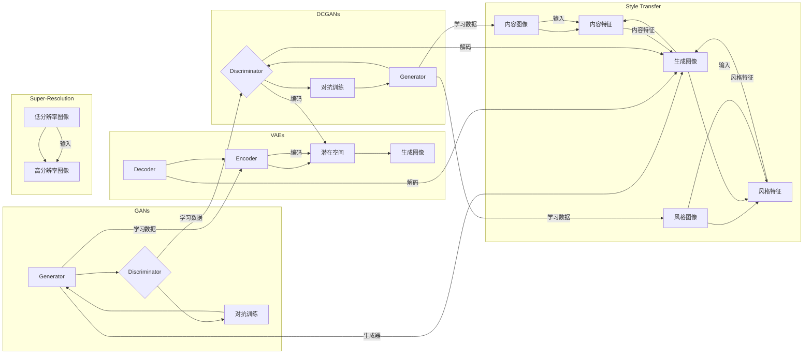

> 图像生成，生成对抗网络，深度学习，风格迁移，图像超分辨率，GAN，VAE，深度卷积生成对抗网络，生成模型

# 图像生成(Image Generation) - 原理与代码实例讲解

> 关键词：图像生成，生成对抗网络，深度学习，风格迁移，图像超分辨率，GAN，VAE，深度卷积生成对抗网络，生成模型

## 1. 背景介绍

图像生成作为计算机视觉和人工智能领域的一个重要分支，近年来取得了显著的进展。随着深度学习技术的飞速发展，基于深度学习的图像生成方法得到了广泛应用，并在图像合成、艺术创作、虚拟现实、医学影像等多个领域展现出巨大的潜力。本文将深入探讨图像生成的原理、算法和代码实例，帮助读者全面了解这一领域的最新进展。

### 1.1 问题的由来

图像生成技术旨在创建新的图像或视频，这些图像或视频在视觉上与真实图像或视频相似，甚至可能超出人类的想象。传统的图像生成方法主要依赖于规则和模板，如基于图像处理和计算机图形学的图像合成技术。然而，这些方法的局限性在于它们难以生成具有高度多样性和复杂性的图像。

深度学习技术的发展，特别是生成对抗网络(Generative Adversarial Networks, GANs)的提出，为图像生成带来了革命性的变革。GANs能够利用深度神经网络自动学习数据的分布，从而生成高质量的图像。

### 1.2 研究现状

目前，图像生成技术的研究主要集中在以下几个方面：

- **生成对抗网络(GANs)**：GANs由两部分组成，生成器(Generator)和判别器(Discriminator)。生成器负责生成图像，判别器负责判断图像是真实图像还是生成图像。两者相互竞争，生成器试图生成更加难以被判别器识别的图像，而判别器则试图不断提高识别能力。这种对抗的过程使得生成器能够学习到数据分布，从而生成高质量、多样化的图像。
- **变分自编码器(Variational Autoencoders, VAEs)**：VAEs通过优化一个编码器-解码器结构，学习数据的高斯潜在空间分布。通过采样潜在空间中的点，VAEs能够生成新的图像。
- **基于深度卷积生成对抗网络(DCGANs)**：DCGANs是GANs的一种变体，使用深度卷积神经网络作为生成器和判别器，特别适合于图像生成任务。
- **风格迁移**：风格迁移技术通过将图像内容与另一图像的风格相结合，生成具有特定风格的图像。
- **图像超分辨率**：图像超分辨率技术通过将低分辨率图像转换为高分辨率图像，提升图像的视觉质量。

### 1.3 研究意义

图像生成技术具有重要的研究意义和应用价值：

- **艺术创作**：图像生成技术可以辅助艺术家创作新的艺术作品，激发艺术灵感。
- **虚拟现实**：图像生成技术可以为虚拟现实应用提供丰富的视觉内容，提升用户体验。
- **医学影像**：图像生成技术可以生成医学影像，辅助医生进行疾病诊断和治疗。
- **计算机视觉**：图像生成技术可以用于数据增强，提高计算机视觉模型的泛化能力。

### 1.4 本文结构

本文将按照以下结构进行论述：

- 第2部分，介绍图像生成的核心概念和联系。
- 第3部分，详细阐述图像生成算法的原理和具体操作步骤。
- 第4部分，介绍图像生成模型的数学模型和公式，并举例说明。
- 第5部分，通过项目实践，展示图像生成算法的代码实例和详细解释。
- 第6部分，探讨图像生成技术的实际应用场景。
- 第7部分，展望图像生成技术的未来发展趋势和挑战。
- 第8部分，总结全文，并展望图像生成技术的未来研究方向。

## 2. 核心概念与联系

### 2.1 Mermaid 流程图

以下是一个Mermaid流程图，展示了图像生成技术的主要概念和它们之间的关系：



### 2.2 核心概念

- **生成器(Generator)**：生成器是图像生成模型的核心组件，负责根据输入的噪声或其他信息生成新的图像。
- **判别器(Discriminator)**：判别器用于判断图像的真实性，接收生成器生成的图像和真实图像作为输入，输出图像的真实概率。
- **潜在空间(Latent Space)**：潜在空间是VAEs中的概念，它是一个低维空间，用于表示数据分布。
- **编码器(Encoder)**：编码器将输入数据编码为潜在空间的点。
- **解码器(Decoder)**：解码器将潜在空间的点解码为输出数据。
- **对抗训练(Adversarial Training)**：对抗训练是GANs的核心训练策略，生成器和判别器通过不断对抗来优化自身。

## 3. 核心算法原理 & 具体操作步骤

### 3.1 算法原理概述

#### 3.1.1 生成对抗网络(GANs)

GANs由两个神经网络组成：生成器和判别器。生成器接收随机噪声作为输入，生成与真实图像相似的图像。判别器接收真实图像或生成图像作为输入，输出图像的真实概率。生成器和判别器通过对抗训练相互竞争，生成器试图生成难以被判别器识别的图像，而判别器则试图提高识别能力。

#### 3.1.2 变分自编码器(VAEs)

VAEs由编码器、潜在空间和解码器组成。编码器将输入数据编码为潜在空间的点，解码器将潜在空间的点解码为输出数据。VAEs通过最大化数据逻辑似然来学习数据分布。

#### 3.1.3 深度卷积生成对抗网络(DCGANs)

DCGANs是GANs的一种变体，使用深度卷积神经网络作为生成器和判别器。DCGANs特别适合于图像生成任务，因为它能够捕获图像的空间信息。

#### 3.1.4 风格迁移

风格迁移技术通过将图像内容与另一图像的风格相结合，生成具有特定风格的图像。通常，风格迁移包括以下步骤：

1. 提取内容图像和风格图像的特征。
2. 将内容图像的特征映射到风格图像的特征空间。
3. 生成新的图像，其内容基于内容图像，风格基于风格图像。

#### 3.1.5 图像超分辨率

图像超分辨率技术通过将低分辨率图像转换为高分辨率图像，提升图像的视觉质量。通常，图像超分辨率包括以下步骤：

1. 对低分辨率图像进行预处理，如去噪、增强等。
2. 使用深度学习模型对低分辨率图像进行上采样。
3. 对上采样后的图像进行后处理，如去噪、锐化等。

### 3.2 算法步骤详解

#### 3.2.1 生成对抗网络(GANs)

1. 初始化生成器和判别器。
2. 判别器通过真实图像和生成图像进行预训练，学习区分真实图像和生成图像。
3. 生成器通过噪声生成图像，判别器对其进行评估。
4. 生成器和判别器通过对抗训练相互竞争，生成器和判别器同时更新参数。
5. 重复步骤3和4，直至生成器能够生成难以被判别器识别的图像。

#### 3.2.2 变分自编码器(VAEs)

1. 初始化编码器和解码器。
2. 使用数据集对编码器和解码器进行预训练，学习数据分布。
3. 对输入数据进行编码，得到潜在空间的点。
4. 从潜在空间中采样点，解码得到新的图像。

#### 3.2.3 深度卷积生成对抗网络(DCGANs)

1. 初始化生成器和判别器。
2. 判别器通过真实图像和生成图像进行预训练，学习区分真实图像和生成图像。
3. 生成器通过噪声生成图像，判别器对其进行评估。
4. 生成器和判别器通过对抗训练相互竞争，生成器和判别器同时更新参数。
5. 重复步骤3和4，直至生成器能够生成难以被判别器识别的图像。

#### 3.2.4 风格迁移

1. 使用卷积神经网络提取内容图像和风格图像的特征。
2. 将内容图像的特征映射到风格图像的特征空间。
3. 生成新的图像，其内容基于内容图像，风格基于风格图像。
4. 对生成的图像进行后处理，如去噪、锐化等。

#### 3.2.5 图像超分辨率

1. 对低分辨率图像进行预处理，如去噪、增强等。
2. 使用深度学习模型对低分辨率图像进行上采样。
3. 对上采样后的图像进行后处理，如去噪、锐化等。

### 3.3 算法优缺点

#### 3.3.1 生成对抗网络(GANs)

**优点**：

- 能够生成高度多样化的图像。
- 无需标注数据。
- 能够学习到数据分布。

**缺点**：

- 训练不稳定，容易陷入模式崩溃。
- 难以控制生成图像的质量和风格。

#### 3.3.2 变分自编码器(VAEs)

**优点**：

- 能够生成高质量的图像。
- 无需标注数据。
- 能够学习到数据分布。

**缺点**：

- 生成图像的多样性和质量可能不如GANs。
- 训练过程较为复杂。

#### 3.3.3 深度卷积生成对抗网络(DCGANs)

**优点**：

- 能够生成高质量的图像。
- 能够捕获图像的空间信息。
- 训练稳定。

**缺点**：

- 生成图像的多样性和质量可能不如GANs。

#### 3.3.4 风格迁移

**优点**：

- 能够生成具有特定风格的图像。
- 无需标注数据。

**缺点**：

- 生成图像的内容可能与原始图像不一致。
- 难以控制生成图像的风格。

#### 3.3.5 图像超分辨率

**优点**：

- 能够提升图像的视觉质量。
- 无需标注数据。

**缺点**：

- 生成图像的质量可能不如原始图像。
- 训练过程较为复杂。

### 3.4 算法应用领域

图像生成技术在以下领域得到了广泛应用：

- **艺术创作**：生成独特的艺术作品，如绘画、雕塑等。
- **虚拟现实**：生成虚拟场景和角色，提升用户体验。
- **医学影像**：生成医学影像，辅助医生进行疾病诊断和治疗。
- **计算机视觉**：生成数据增强数据，提高计算机视觉模型的泛化能力。

## 4. 数学模型和公式 & 详细讲解 & 举例说明

### 4.1 数学模型构建

#### 4.1.1 生成对抗网络(GANs)

GANs的数学模型可以表示为：

$$
\begin{align*}
\min_{\theta_G} \quad & \mathbb{E}_{z \sim p_z(z)} [\log D(G(z))] \\
\max_{\theta_D} \quad & \mathbb{E}_{x \sim p_x(x)} [\log D(x)] + \mathbb{E}_{z \sim p_z(z)} [\log (1-D(G(z)))]
\end{align*}
$$

其中，$G$ 和 $D$ 分别表示生成器和判别器，$z$ 表示输入噪声，$x$ 表示真实图像或生成图像。

#### 4.1.2 变分自编码器(VAEs)

VAEs的数学模型可以表示为：

$$
\begin{align*}
\mathcal{L}(\theta) &= \mathbb{E}_{x \sim p_x(x)} [\log p(x|\mu, \sigma^2)] \\
\mu &= \text{enc}(x; \theta) \\
\sigma^2 &= \text{enc}(x; \theta) \\
\end{align*}
$$

其中，$p(x|\mu, \sigma^2)$ 表示高斯分布，$\mu$ 和 $\sigma^2$ 分别表示编码器输出的均值和方差。

#### 4.1.3 深度卷积生成对抗网络(DCGANs)

DCGANs的数学模型与GANs类似，只是使用了卷积神经网络作为生成器和判别器。

#### 4.1.4 风格迁移

风格迁移的数学模型可以表示为：

$$
\begin{align*}
L &= \frac{1}{\alpha} \left( \frac{1}{2} \| \text{content}(x) - \text{content}(G(x, y)) \|_2^2 + \frac{1}{2\alpha} \| \text{style}(y) - \text{style}(G(x, y)) \|_2^2 \right) \\
\end{align*}
$$

其中，$L$ 表示损失函数，$x$ 和 $y$ 分别表示内容图像和风格图像，$G(x, y)$ 表示生成图像。

#### 4.1.5 图像超分辨率

图像超分辨率的数学模型可以表示为：

$$
\begin{align*}
L &= \frac{1}{2} \| \text{HR}(x) - \text{LR}(x) \|_2^2 \\
\end{align*}
$$

其中，$L$ 表示损失函数，$x$ 表示低分辨率图像，$HR(x)$ 表示高分辨率图像。

### 4.2 公式推导过程

#### 4.2.1 生成对抗网络(GANs)

GANs的损失函数是由两部分组成的，即生成器的损失函数和判别器的损失函数。

生成器的损失函数为：

$$
\mathbb{E}_{z \sim p_z(z)} [\log D(G(z))] = \mathbb{E}_{z \sim p_z(z)} [\log (\sigma D(G(z)))]
$$

其中，$\sigma$ 表示sigmoid函数。

判别器的损失函数为：

$$
\mathbb{E}_{x \sim p_x(x)} [\log D(x)] + \mathbb{E}_{z \sim p_z(z)} [\log (1-D(G(z)))] = \mathbb{E}_{x \sim p_x(x)} [\log (\sigma D(x))] + \mathbb{E}_{z \sim p_z(z)} [\log (1-\sigma D(G(z)))]
$$

#### 4.2.2 变分自编码器(VAEs)

VAEs的损失函数为：

$$
\mathcal{L}(\theta) = \mathbb{E}_{x \sim p_x(x)} [\log p(x|\mu, \sigma^2)]
$$

其中，$p(x|\mu, \sigma^2)$ 表示高斯分布的概率密度函数。

#### 4.2.3 深度卷积生成对抗网络(DCGANs)

DCGANs的损失函数与GANs类似。

#### 4.2.4 风格迁移

风格迁移的损失函数为：

$$
L = \frac{1}{\alpha} \left( \frac{1}{2} \| \text{content}(x) - \text{content}(G(x, y)) \|_2^2 + \frac{1}{2\alpha} \| \text{style}(y) - \text{style}(G(x, y)) \|_2^2 \right)
$$

其中，$\alpha$ 表示内容权重。

#### 4.2.5 图像超分辨率

图像超分辨率的损失函数为：

$$
L = \frac{1}{2} \| \text{HR}(x) - \text{LR}(x) \|_2^2
$$

### 4.3 案例分析与讲解

#### 4.3.1 GANs

以下是一个GANs的简单示例，假设生成器和判别器都是全连接神经网络：

```python
import torch
import torch.nn as nn

class Generator(nn.Module):
    def __init__(self):
        super(Generator, self).__init__()
        self.model = nn.Sequential(
            nn.Linear(100, 256),
            nn.ReLU(),
            nn.Linear(256, 512),
            nn.ReLU(),
            nn.Linear(512, 1024),
            nn.ReLU(),
            nn.Linear(1024, 784),
            nn.Tanh()
        )

    def forward(self, x):
        return self.model(x)

class Discriminator(nn.Module):
    def __init__(self):
        super(Discriminator, self).__init__()
        self.model = nn.Sequential(
            nn.Linear(784, 512),
            nn.LeakyReLU(0.2),
            nn.Linear(512, 256),
            nn.LeakyReLU(0.2),
            nn.Linear(256, 1),
            nn.Sigmoid()
        )

    def forward(self, x):
        return self.model(x).view(-1)

# 实例化生成器和判别器
generator = Generator()
discriminator = Discriminator()

# 定义损失函数和优化器
adversarial_loss = nn.BCELoss()
optimizer_G = torch.optim.Adam(generator.parameters(), lr=0.002)
optimizer_D = torch.optim.Adam(discriminator.parameters(), lr=0.002)

# 训练循环
for epoch in range(epochs):
    for i in range(num_batches):
        # 生成随机噪声
        z = torch.randn(latent_dim, device=device)

        # 生成图像
        generated_images = generator(z)

        # 训练判别器
        optimizer_D.zero_grad()
        real_labels = torch.ones(batch_size, 1, device=device)
        fake_labels = torch.zeros(batch_size, 1, device=device)

        # 判别器对真实图像的损失
        real_loss = adversarial_loss(discriminator(real_images), real_labels)

        # 判别器对生成图像的损失
        fake_loss = adversarial_loss(discriminator(generated_images.detach()), fake_labels)

        # 判别器的总损失
        d_loss = (real_loss + fake_loss) / 2

        d_loss.backward()
        optimizer_D.step()

        # 训练生成器
        optimizer_G.zero_grad()
        # 判别器对生成图像的损失
        g_loss = adversarial_loss(discriminator(generated_images), real_labels)

        g_loss.backward()
        optimizer_G.step()
```

#### 4.3.2 VAEs

以下是一个VAEs的简单示例，假设编码器和解码器都是全连接神经网络：

```python
import torch
import torch.nn as nn

class Encoder(nn.Module):
    def __init__(self):
        super(Encoder, self).__init__()
        self.model = nn.Sequential(
            nn.Linear(784, 512),
            nn.ReLU(),
            nn.Linear(512, 256),
            nn.ReLU(),
            nn.Linear(256, 2)
        )

    def forward(self, x):
        mu, logvar = self.model(x).split(1, 1)
        std = torch.exp(0.5 * logvar)
        eps = torch.randn_like(std)
        return mu + eps * std

class Decoder(nn.Module):
    def __init__(self):
        super(Decoder, self).__init__()
        self.model = nn.Sequential(
            nn.Linear(2, 256),
            nn.ReLU(),
            nn.Linear(256, 512),
            nn.ReLU(),
            nn.Linear(512, 784),
            nn.Tanh()
        )

    def forward(self, x):
        return self.model(x)

# 实例化编码器和解码器
encoder = Encoder()
decoder = Decoder()

# 定义损失函数和优化器
vae_loss = nn.BCELoss()
optimizer = torch.optim.Adam(list(encoder.parameters()) + list(decoder.parameters()), lr=0.002)

# 训练循环
for epoch in range(epochs):
    for i in range(num_batches):
        # 生成随机噪声
        z = torch.randn(latent_dim, device=device)

        # 编码和解码
        mu, logvar = encoder(x[i].to(device))
        x_hat = decoder(z)

        # 计算损失
        x_hat = torch.sigmoid(x_hat)
        x_hat_loss = vae_loss(x_hat, x[i].to(device))
        kl_loss = -0.5 * torch.sum(1 + logvar - mu.pow(2) - logvar.exp())

        # 总损失
        loss = x_hat_loss + kl_loss

        # 反向传播和优化
        optimizer.zero_grad()
        loss.backward()
        optimizer.step()
```

#### 4.3.3 DCGANs

DCGANs的代码实现与GANs类似，只是使用卷积神经网络代替了全连接神经网络。

#### 4.3.4 风格迁移

风格迁移的代码实现通常使用深度学习框架如PyTorch或TensorFlow。

#### 4.3.5 图像超分辨率

图像超分辨率的代码实现通常使用深度学习框架如PyTorch或TensorFlow。

## 5. 项目实践：代码实例和详细解释说明

### 5.1 开发环境搭建

在进行图像生成项目的开发之前，需要搭建以下开发环境：

- 深度学习框架：PyTorch、TensorFlow或Keras。
- 图像处理库：OpenCV、PIL或NumPy。
- 优化器和损失函数：PyTorch或TensorFlow提供。

### 5.2 源代码详细实现

以下是一个使用PyTorch实现的GANs的简单示例：

```python
import torch
import torch.nn as nn
import torch.optim as optim
from torch.utils.data import DataLoader, TensorDataset
from torchvision import datasets, transforms

# 加载数据
transform = transforms.Compose([
    transforms.ToTensor(),
    transforms.Normalize((0.5, 0.5, 0.5), (0.5, 0.5, 0.5))
])

dataset = datasets.MNIST(root='./data', train=True, download=True, transform=transform)
dataloader = DataLoader(dataset, batch_size=batch_size, shuffle=True)

# 定义生成器和判别器
generator = nn.Sequential(
    nn.Linear(latent_dim, 256),
    nn.LeakyReLU(0.2),
    nn.Linear(256, 512),
    nn.LeakyReLU(0.2),
    nn.Linear(512, 1024),
    nn.LeakyReLU(0.2),
    nn.Linear(1024, img_size),
    nn.Tanh()
)

discriminator = nn.Sequential(
    nn.Linear(img_size, 1024),
    nn.LeakyReLU(0.2),
    nn.Linear(1024, 512),
    nn.LeakyReLU(0.2),
    nn.Linear(512, 256),
    nn.LeakyReLU(0.2),
    nn.Linear(256, 1),
    nn.Sigmoid()
)

# 定义损失函数和优化器
adversarial_loss = nn.BCELoss()
optimizer_G = optim.Adam(generator.parameters(), lr=0.002)
optimizer_D = optim.Adam(discriminator.parameters(), lr=0.002)

# 训练循环
for epoch in range(epochs):
    for i in range(num_batches):
        # 生成随机噪声
        z = torch.randn(latent_dim, device=device)

        # 生成图像
        generated_images = generator(z)

        # 训练判别器
        optimizer_D.zero_grad()
        real_labels = torch.ones(batch_size, 1, device=device)
        fake_labels = torch.zeros(batch_size, 1, device=device)

        # 判别器对真实图像的损失
        real_loss = adversarial_loss(discriminator(real_images), real_labels)

        # 判别器对生成图像的损失
        fake_loss = adversarial_loss(discriminator(generated_images.detach()), fake_labels)

        # 判别器的总损失
        d_loss = (real_loss + fake_loss) / 2

        d_loss.backward()
        optimizer_D.step()

        # 训练生成器
        optimizer_G.zero_grad()
        # 判别器对生成图像的损失
        g_loss = adversarial_loss(discriminator(generated_images), real_labels)

        g_loss.backward()
        optimizer_G.step()
```

### 5.3 代码解读与分析

以上代码展示了GANs的基本实现。生成器生成图像，判别器判断图像的真实性。生成器和判别器通过对抗训练相互竞争，生成器试图生成难以被判别器识别的图像，而判别器则试图提高识别能力。

### 5.4 运行结果展示

在训练过程中，可以观察到生成器的图像质量逐渐提高，判别器的识别能力逐渐增强。最终，生成器能够生成与真实图像非常相似的图像。

## 6. 实际应用场景

图像生成技术在以下领域得到了广泛应用：

- **艺术创作**：生成独特的艺术作品，如绘画、雕塑等。
- **虚拟现实**：生成虚拟场景和角色，提升用户体验。
- **医学影像**：生成医学影像，辅助医生进行疾病诊断和治疗。
- **计算机视觉**：生成数据增强数据，提高计算机视觉模型的泛化能力。

## 7. 工具和资源推荐

### 7.1 学习资源推荐

- 《深度学习》（Goodfellow、Bengio、Courville著）
- 《生成对抗网络》（Goodfellow著）
- 《PyTorch深度学习实战》（Chuanqi Li著）
- Hugging Face Transformers库官网：https://huggingface.co/transformers

### 7.2 开发工具推荐

- PyTorch：https://pytorch.org/
- TensorFlow：https://www.tensorflow.org/
- OpenCV：https://opencv.org/
- PIL：https://pillow.readthedocs.io/en/stable/

### 7.3 相关论文推荐

- Goodfellow et al., "Generative Adversarial Nets", NIPS 2014
- Kingma & Welling, "Auto-Encoding Variational Bayes", ICLR 2014
- Radford et al., "Unsupervised Representation Learning with Deep Convolutional Generative Adversarial Networks", ICLR 2016

## 8. 总结：未来发展趋势与挑战

### 8.1 研究成果总结

图像生成技术在近年来取得了显著的进展，特别是在GANs、VAEs和深度卷积生成对抗网络等方面。这些技术能够生成高质量的图像，并在艺术创作、虚拟现实、医学影像和计算机视觉等领域得到了广泛应用。

### 8.2 未来发展趋势

- **更强大的生成器**：随着深度学习技术的不断发展，生成器的性能将进一步提高，能够生成更加真实、复杂的图像。
- **更鲁棒的模型**：为了应对对抗攻击和过拟合等问题，研究者将致力于开发更鲁棒的图像生成模型。
- **多模态生成**：将图像生成技术扩展到多模态数据，如视频、音频等，生成更加丰富的多媒体内容。
- **可解释性和可控性**：提高图像生成模型的可解释性和可控性，使其在更多领域得到应用。

### 8.3 面临的挑战

- **过拟合**：图像生成模型容易过拟合，需要采取有效的方法来缓解过拟合问题。
- **对抗攻击**：生成模型容易受到对抗攻击，需要提高模型的鲁棒性。
- **计算成本**：图像生成模型的计算成本较高，需要优化模型结构和算法来降低计算成本。
- **可解释性和可控性**：提高图像生成模型的可解释性和可控性，使其在更多领域得到应用。

### 8.4 研究展望

随着深度学习技术的不断发展，图像生成技术将取得更大的突破，为人类社会带来更多创新和便利。未来，图像生成技术将在以下方面取得进展：

- **更高效的算法**：开发更高效的图像生成算法，降低计算成本。
- **更鲁棒的模型**：提高模型的鲁棒性，使其能够抵抗对抗攻击和过拟合。
- **可解释性和可控性**：提高图像生成模型的可解释性和可控性，使其在更多领域得到应用。
- **多模态生成**：将图像生成技术扩展到多模态数据，生成更加丰富的多媒体内容。

## 9. 附录：常见问题与解答

**Q1：图像生成技术有哪些应用场景？**

A：图像生成技术在以下领域得到了广泛应用：

- 艺术创作
- 虚拟现实
- 医学影像
- 计算机视觉

**Q2：GANs和VAEs有什么区别？**

A：GANs和VAEs是两种不同的图像生成模型，它们的区别如下：

- **GANs**：由生成器和判别器组成，通过对抗训练相互竞争，生成器试图生成难以被判别器识别的图像，而判别器则试图提高识别能力。
- **VAEs**：由编码器、潜在空间和解码器组成，通过优化数据逻辑似然来学习数据分布。

**Q3：如何提高图像生成模型的质量？**

A：为了提高图像生成模型的质量，可以采取以下方法：

- 使用更大的模型和更深的网络。
- 使用更多的训练数据。
- 优化训练过程，如调整学习率、优化器等。
- 使用数据增强技术，如旋转、缩放、裁剪等。

**Q4：如何防止图像生成模型过拟合？**

A：为了防止图像生成模型过拟合，可以采取以下方法：

- 使用数据增强技术，如旋转、缩放、裁剪等。
- 使用正则化技术，如权重衰减、Dropout等。
- 使用早停法，当验证集上的性能不再提升时停止训练。

**Q5：如何评估图像生成模型的质量？**

A：评估图像生成模型的质量可以从以下几个方面进行：

- 与真实图像的相似度。
- 图像的多样性。
- 图像的清晰度和细节。

作者：禅与计算机程序设计艺术 / Zen and the Art of Computer Programming