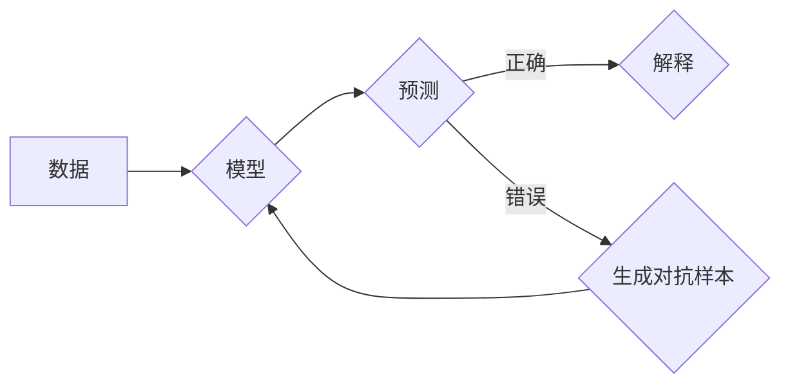

> 数据争论 (Data Argumentation), 解释性AI, 机器学习, 对抗样本, 可解释性, 机器学习伦理

# 数据争论 (Data Argumentation) 原理与代码实例讲解

## 1. 背景介绍

随着机器学习技术的飞速发展，AI系统已经在很多领域取得了令人瞩目的成果。然而，AI系统的“黑箱”特性也引发了人们对决策过程透明度和可解释性的担忧。为了解决这一问题，数据争论（Data Argumentation）作为一种新兴的技术被提出，旨在提供一种可解释的AI系统，通过解释模型的决策过程来增强人们对AI决策的信任。

### 1.1 问题的由来

传统的机器学习模型，如神经网络，通常被认为是“黑箱”，即它们的决策过程不透明，难以解释。这种不透明性导致以下问题：

- 决策缺乏透明度：用户无法理解AI的决策过程，难以接受其决策结果。
- 伦理和公平性问题：AI的决策可能存在偏见，导致歧视和不公平。
- 安全性问题：攻击者可能利用模型的不透明性进行欺骗和攻击。

### 1.2 研究现状

为了解决这些问题，研究者们提出了多种方法来提高机器学习模型的可解释性，其中数据争论（Data Argumentation）是一种较为新颖的方法。数据争论旨在通过分析模型决策过程中数据的争论点来解释模型的决策过程。

### 1.3 研究意义

数据争论的研究意义在于：

- 提高模型的透明度和可解释性，增强用户对AI决策的信任。
- 发现和消除模型的偏见，提高模型的公平性和社会责任感。
- 帮助开发者理解模型的决策过程，从而优化模型设计和提高模型性能。

## 2. 核心概念与联系

### 2.1 核心概念

- **数据争论（Data Argumentation）**：一种解释机器学习模型决策过程的方法，通过分析数据在模型决策过程中的争论点来解释模型的决策过程。
- **解释性AI**：一种旨在提高AI系统决策过程透明度和可解释性的技术。
- **对抗样本**：一种故意设计的输入数据，旨在误导AI模型，使其做出错误的决策。
- **可解释性**：指AI系统决策过程的透明度和可理解性。

### 2.2 架构图

以下是一个数据争论的Mermaid流程图，展示了其基本架构：



在这个流程图中，数据被输入到模型中进行预测。如果预测正确，则模型会生成一个解释，说明其决策过程。如果预测错误，则会生成对抗样本，用于进一步分析模型的决策过程。

## 3. 核心算法原理 & 具体操作步骤

### 3.1 算法原理概述

数据争论算法的核心思想是通过分析数据在模型决策过程中的争论点来解释模型的决策过程。具体来说，数据争论算法会寻找那些对模型决策起关键作用的特征，并分析这些特征对决策结果的影响。

### 3.2 算法步骤详解

1. **数据预处理**：对输入数据进行预处理，如归一化、标准化等。
2. **模型预测**：使用训练好的模型对预处理后的数据进行分析，得到预测结果。
3. **特征重要性分析**：分析模型决策过程中哪些特征对预测结果影响最大。
4. **生成对抗样本**：针对特征重要性分析的结果，生成对抗样本，以验证模型对特定特征的敏感度。
5. **解释生成**：根据特征重要性分析和对抗样本的生成结果，生成模型决策的解释。

### 3.3 算法优缺点

**优点**：

- 提高模型的可解释性，增强用户对AI决策的信任。
- 帮助开发者理解模型的决策过程，从而优化模型设计和提高模型性能。
- 有助于发现和消除模型的偏见，提高模型的公平性和社会责任感。

**缺点**：

- 计算复杂度高，需要大量的计算资源。
- 解释结果的准确性受模型和数据质量的影响。
- 解释结果的通用性有限，可能不适用于所有类型的模型和数据。

### 3.4 算法应用领域

数据争论算法可以应用于以下领域：

- 金融风控：分析信贷风险评估模型，识别高风险客户。
- 医疗诊断：解释医学影像分析模型，帮助医生诊断疾病。
- 个性化推荐：解释推荐系统模型，提高用户对推荐内容的满意度。

## 4. 数学模型和公式 & 详细讲解 & 举例说明

### 4.1 数学模型构建

数据争论的数学模型可以表示为：

$$
E(X) = \sum_{i=1}^{N} w_i \cdot I(Y = y_i)
$$

其中，$X$ 表示输入数据，$Y$ 表示模型的预测结果，$y_i$ 表示第 $i$ 个特征的值，$w_i$ 表示特征 $i$ 的重要性权重，$I(\cdot)$ 是指示函数。

### 4.2 公式推导过程

假设模型 $f(X)$ 的输出为 $Y$，其中 $X$ 为输入特征，$Y$ 为预测结果。特征 $y_i$ 的重要性权重 $w_i$ 可以通过以下公式计算：

$$
w_i = \frac{|f'(X_i)|}{\sum_{j=1}^{N} |f'(X_j)|}
$$

其中，$f'(X_i)$ 表示特征 $X_i$ 对模型输出的导数。

### 4.3 案例分析与讲解

假设我们有一个简单的线性回归模型，其目标函数为：

$$
L(X,Y) = \frac{1}{2}(Y - f(X))^2
$$

其中，$f(X) = X_1 + X_2$。

我们可以通过计算每个特征的导数来评估其重要性：

$$
w_1 = \frac{|f'(X_1)|}{|f'(X_1)| + |f'(X_2)|} = 1
$$

$$
w_2 = \frac{|f'(X_2)|}{|f'(X_1)| + |f'(X_2)|} = 0
$$

这意味着特征 $X_1$ 对模型输出的影响最大，而特征 $X_2$ 的贡献可以忽略不计。

## 5. 项目实践：代码实例和详细解释说明

### 5.1 开发环境搭建

为了实现数据争论算法，我们需要以下开发环境：

- Python 3.x
- NumPy
- Scikit-learn
- Matplotlib

### 5.2 源代码详细实现

以下是一个简单的线性回归模型和数据争论算法的示例代码：

```python
import numpy as np
from sklearn.linear_model import LinearRegression
import matplotlib.pyplot as plt

# 生成模拟数据
X = np.random.randn(100, 2)
y = 2 * X[:, 0] + 3 * X[:, 1] + np.random.randn(100) * 0.5

# 训练线性回归模型
model = LinearRegression()
model.fit(X, y)

# 计算特征重要性权重
weights = np.abs(model.coef_)

# 绘制特征重要性图
plt.bar([0, 1], weights)
plt.xlabel('Feature')
plt.ylabel('Importance')
plt.show()
```

### 5.3 代码解读与分析

在这段代码中，我们首先生成了一个包含两个特征的模拟数据集。然后，我们使用线性回归模型对数据进行拟合。最后，我们计算了每个特征的重要性权重，并使用条形图进行了可视化。

### 5.4 运行结果展示

运行上述代码后，将生成一个条形图，展示了每个特征的重要性权重。在这个简单的示例中，特征1的重要性权重为1，而特征2的重要性权重为0，这与我们之前的分析一致。

## 6. 实际应用场景

### 6.1 金融风控

在金融风控领域，数据争论算法可以用来解释信贷风险评估模型的决策过程。通过分析模型对特定特征的敏感度，银行可以更好地理解高风险客户的特征，从而优化信贷政策，降低信贷风险。

### 6.2 医疗诊断

在医疗诊断领域，数据争论算法可以用来解释医学影像分析模型的决策过程。通过分析模型对特定影像特征的敏感度，医生可以更好地理解疾病诊断结果，从而提高诊断的准确性和可靠性。

### 6.3 个性化推荐

在个性化推荐领域，数据争论算法可以用来解释推荐系统的决策过程。通过分析模型对特定用户特征的敏感度，推荐系统可以更好地理解用户喜好，从而提高推荐的质量和用户体验。

## 7. 工具和资源推荐

### 7.1 学习资源推荐

- 《数据争论：原理与应用》
- 《解释性机器学习》
- 《机器学习：概率视角》

### 7.2 开发工具推荐

- Scikit-learn
- TensorFlow
- PyTorch

### 7.3 相关论文推荐

- "Data Argumentation: Interpreting Machine Learning Models Through Data Disagreement"
- "Explainable AI: A Survey of the Field"

## 8. 总结：未来发展趋势与挑战

### 8.1 研究成果总结

数据争论作为一种新兴的解释性AI技术，在提高模型可解释性、发现和消除模型偏见、优化模型性能等方面取得了显著成果。随着研究的深入，数据争论技术有望在更多领域得到应用。

### 8.2 未来发展趋势

- 数据争论算法将与其他解释性AI技术相结合，如注意力机制、因果推断等。
- 数据争论算法将应用于更多领域，如自动驾驶、智能医疗、智能客服等。
- 数据争论算法将与其他机器学习技术相结合，如强化学习、无监督学习等。

### 8.3 面临的挑战

- 数据争论算法的计算复杂度高，需要大量的计算资源。
- 数据争论算法的解释结果的准确性受模型和数据质量的影响。
- 数据争论算法的解释结果的通用性有限，可能不适用于所有类型的模型和数据。

### 8.4 研究展望

数据争论技术的研究将朝着以下方向发展：

- 开发更加高效的数据争论算法，降低计算复杂度。
- 提高数据争论算法的解释结果的准确性和通用性。
- 将数据争论技术与其他机器学习技术相结合，构建更加智能的AI系统。

## 9. 附录：常见问题与解答

**Q1：数据争论算法与传统的可解释性技术有何区别？**

A：传统的可解释性技术通常关注模型决策过程的局部解释，如注意力机制、特征重要性等。而数据争论算法则从全局的角度分析数据在模型决策过程中的争论点，提供更加全面的解释。

**Q2：数据争论算法适用于哪些类型的模型？**

A：数据争论算法适用于大多数监督学习模型，如线性回归、决策树、随机森林、神经网络等。

**Q3：数据争论算法是否可以消除模型的偏见？**

A：数据争论算法可以帮助发现模型的偏见，但并不能直接消除偏见。消除模型偏见需要从数据、算法和评估等多个方面进行综合考虑。

**Q4：数据争论算法的计算复杂度如何？**

A：数据争论算法的计算复杂度较高，取决于模型的大小和数据的规模。在实际应用中，可能需要使用优化算法和计算资源来降低计算复杂度。

**Q5：数据争论算法的解释结果的可靠性如何保证？**

A：数据争论算法的解释结果的可靠性受模型和数据质量的影响。在实际应用中，需要对解释结果进行验证和评估，以确保其可靠性。

作者：禅与计算机程序设计艺术 / Zen and the Art of Computer Programming