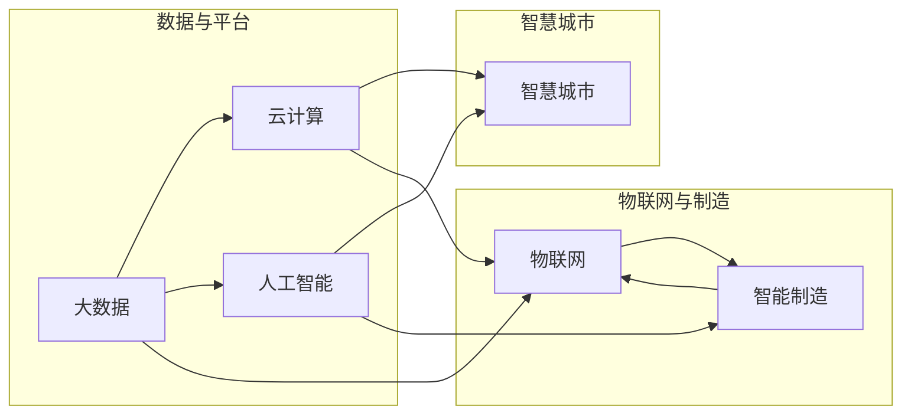

# 数智新时代的特征与发展

> 关键词：数智化转型，人工智能，大数据，物联网，云计算，智能制造，智慧城市，数字孪生

## 1. 背景介绍

随着信息技术的飞速发展，人类社会正逐步迈入数智新时代。这一时代以大数据、云计算、人工智能、物联网等技术的深度融合为特征，深刻地改变着人们的生活方式、生产方式和商业模式。本文将深入探讨数智新时代的特征与发展，以及相关技术如何推动这一时代的变革。

### 1.1 问题的由来

数智新时代的到来并非偶然，而是全球科技发展、经济转型、社会进步等多种因素共同作用的结果。以下是推动数智新时代到来的几个关键因素：

- **信息技术发展**：计算机、互联网、移动通信等技术的飞速发展，为数据收集、处理、存储和传输提供了强大的技术支撑。
- **经济结构转型**：传统产业向高技术、高附加值产业转型升级，对智能化、自动化的需求日益增长。
- **社会需求升级**：人们对于更便捷、高效、个性化的生活和工作方式的需求，推动了数智化技术的广泛应用。
- **政策支持**：各国政府纷纷出台政策，鼓励和支持数智化转型，为这一时代的到来提供政策保障。

### 1.2 研究现状

数智化转型已经成为全球范围内的趋势，各国都在积极布局和发展相关技术。以下是一些主要的研究现状：

- **人工智能**：深度学习、强化学习等人工智能技术的快速发展，为智能决策、智能控制、智能服务等提供了技术基础。
- **大数据**：大数据技术的应用，使得企业能够从海量数据中挖掘价值，为决策提供支持。
- **云计算**：云计算技术的普及，为数据存储、计算、分析提供了便捷的平台。
- **物联网**：物联网技术的广泛应用，使得万物互联成为可能，为智能城市、智能制造等提供了基础设施。
- **智能制造**：智能制造技术的应用，推动传统制造业向智能化、绿色化、服务化方向发展。
- **智慧城市**：智慧城市建设，旨在利用信息技术提高城市运行效率，提升居民生活质量。

### 1.3 研究意义

研究数智新时代的特征与发展，对于推动我国经济社会转型升级、提高国际竞争力具有重要意义：

- **提升产业竞争力**：通过数智化转型，提升传统产业的智能化水平，培育新的经济增长点。
- **提高生活品质**：利用数智化技术改善民生，提高居民的生活质量和幸福感。
- **优化资源配置**：通过大数据分析，优化资源配置，提高资源利用效率。
- **推动科技创新**：促进科技创新，为经济发展提供新的动力。

### 1.4 本文结构

本文将围绕数智新时代的特征与发展展开讨论，具体内容包括：

- 核心概念与联系
- 核心技术原理与操作步骤
- 数学模型与公式
- 项目实践
- 实际应用场景
- 工具和资源推荐
- 未来发展趋势与挑战
- 总结与展望

## 2. 核心概念与联系

数智新时代涉及的核心概念众多，以下将介绍几个关键概念及其相互关系，并使用Mermaid流程图进行展示。

### 2.1 核心概念

- **大数据**：海量、多样、快速的数据集合，具有价值密度低、处理难度大的特点。
- **云计算**：通过网络提供按需计算资源，包括服务器、存储、网络等。
- **人工智能**：使计算机系统具备类似于人类智能的能力，包括学习、推理、感知等。
- **物联网**：将物品与互联网连接，实现智能化的信息采集、传输和处理。
- **智能制造**：利用信息技术改造传统制造业，实现智能化、自动化生产。
- **智慧城市**：利用信息技术提高城市运行效率，提升居民生活质量。

### 2.2 核心概念原理和架构的 Mermaid 流程图



从流程图中可以看出，大数据和云计算为人工智能提供了数据基础和计算平台；物联网与大数据、云计算共同构成了智能制造和智慧城市的基础设施；而人工智能则为智能制造和智慧城市提供了智能决策支持。

## 3. 核心算法原理 & 具体操作步骤

### 3.1 算法原理概述

数智新时代的核心技术涉及多个领域，以下分别介绍其主要原理：

- **大数据处理**：利用分布式计算、数据挖掘、机器学习等技术，从海量数据中提取有价值的信息。
- **云计算**：采用虚拟化、自动化等技术，提供灵活、弹性的计算资源。
- **人工智能**：通过算法和模型，使计算机系统具备学习、推理、感知等能力。
- **物联网**：通过传感器、网络、智能设备等技术，实现物品与互联网的连接。
- **智能制造**：利用信息技术改造生产设备、生产线和企业管理，实现智能化、自动化生产。
- **智慧城市**：通过信息技术，提高城市运行效率，提升居民生活质量。

### 3.2 算法步骤详解

以下以大数据处理为例，介绍其具体操作步骤：

1. **数据采集**：通过传感器、网络爬虫等手段，收集各类数据。
2. **数据清洗**：对采集到的数据进行清洗，去除噪声和冗余信息。
3. **数据存储**：将清洗后的数据存储到数据库或数据湖中。
4. **数据预处理**：对数据进行格式化、标准化等处理，为后续分析做好准备。
5. **数据挖掘**：利用数据挖掘算法，从数据中提取有价值的信息。
6. **模型训练**：利用机器学习算法，对数据进行训练，构建预测模型。
7. **模型评估**：对模型进行评估，选择性能最优的模型。
8. **模型部署**：将模型部署到实际应用中，进行预测和分析。

### 3.3 算法优缺点

以下列举了上述技术的优缺点：

- **大数据处理**：
  - 优点：能够从海量数据中挖掘有价值的信息，提高决策效率。
  - 缺点：数据采集、存储和处理成本高，对计算资源要求较高。
- **云计算**：
  - 优点：提供灵活、弹性的计算资源，降低企业IT成本。
  - 缺点：存在数据安全和隐私泄露风险。
- **人工智能**：
  - 优点：能够实现自动化、智能化的决策，提高生产效率。
  - 缺点：算法可解释性不足，存在偏见和歧视风险。
- **物联网**：
  - 优点：实现物品与互联网的连接，提高物品的使用效率。
  - 缺点：存在数据安全和隐私泄露风险，对网络依赖性高。
- **智能制造**：
  - 优点：提高生产效率，降低生产成本。
  - 缺点：技术要求高，需要大量投资。
- **智慧城市**：
  - 优点：提高城市运行效率，提升居民生活质量。
  - 缺点：需要整合各类数据资源，技术难度高。

### 3.4 算法应用领域

上述技术广泛应用于各个领域，以下列举部分应用场景：

- **大数据处理**：金融、医疗、交通、能源等。
- **云计算**：企业IT、政府公共服务、教育等。
- **人工智能**：智能客服、自动驾驶、智能安防等。
- **物联网**：智能家居、智能穿戴、智能交通等。
- **智能制造**：工业制造、航空航天、汽车制造等。
- **智慧城市**：智慧交通、智慧医疗、智慧教育等。

## 4. 数学模型和公式 & 详细讲解 & 举例说明

### 4.1 数学模型构建

以下以机器学习中的线性回归为例，介绍数学模型的构建过程。

假设我们有一个线性回归模型：

$$
y = \beta_0 + \beta_1 x_1 + \beta_2 x_2 + ... + \beta_n x_n + \epsilon
$$

其中，$y$ 为因变量，$x_1, x_2, ..., x_n$ 为自变量，$\beta_0, \beta_1, ..., \beta_n$ 为模型参数，$\epsilon$ 为误差项。

### 4.2 公式推导过程

线性回归模型的目的是找到一组参数 $\beta_0, \beta_1, ..., \beta_n$，使得预测值 $y$ 与真实值 $y_i$ 之间的差异最小。这可以通过最小化损失函数来完成：

$$
J(\beta) = \frac{1}{2} \sum_{i=1}^n (y_i - y)^2
$$

其中，$y = \beta_0 + \beta_1 x_1 + \beta_2 x_2 + ... + \beta_n x_n$ 为预测值。

对损失函数求导，并令导数为0，可以得到：

$$
\frac{\partial J(\beta)}{\partial \beta_j} = y_i - \beta_0 - \beta_1 x_{1i} - ... - \beta_{j-1} x_{j-1i} - \beta_j x_{ji} - \beta_{j+1} x_{j+1i} - ... - \beta_n x_{ni}
$$

解上述方程组，即可得到模型参数 $\beta_0, \beta_1, ..., \beta_n$。

### 4.3 案例分析与讲解

以下以房价预测为例，展示线性回归模型的应用。

假设我们有一个包含房屋面积、房间数量和价格的数据集，我们需要利用线性回归模型预测房价。

首先，将数据集划分为训练集和测试集。然后，使用训练集数据训练线性回归模型，并使用测试集数据评估模型性能。

```python
import numpy as np
from sklearn.linear_model import LinearRegression

# 加载数据集
data = np.load('house_data.npy')
X = data[:, :-1]  # 房屋面积和房间数量
y = data[:, -1]   # 房价

# 划分训练集和测试集
X_train, X_test, y_train, y_test = train_test_split(X, y, test_size=0.2, random_state=42)

# 训练线性回归模型
model = LinearRegression()
model.fit(X_train, y_train)

# 评估模型性能
score = model.score(X_test, y_test)
print(f'线性回归模型在测试集上的R²评分：{score}')
```

运行上述代码，可以得到线性回归模型在测试集上的R²评分。R²评分越接近1，说明模型的预测精度越高。

## 5. 项目实践：代码实例和详细解释说明

### 5.1 开发环境搭建

以下以Python为例，介绍如何搭建开发环境。

1. 安装Python：从Python官网下载并安装Python 3.8及以上版本。
2. 安装Anaconda：从Anaconda官网下载并安装Anaconda，用于创建和管理Python虚拟环境。
3. 创建虚拟环境：打开Anaconda Prompt，执行以下命令：

```bash
conda create -n myenv python=3.8
```

4. 激活虚拟环境：

```bash
conda activate myenv
```

5. 安装必要的库：在虚拟环境中安装必要的库，如NumPy、Pandas、Scikit-learn等。

### 5.2 源代码详细实现

以下以房价预测项目为例，展示Python代码的实现。

```python
import numpy as np
from sklearn.linear_model import LinearRegression
from sklearn.model_selection import train_test_split

# 加载数据集
data = np.load('house_data.npy')
X = data[:, :-1]  # 房屋面积和房间数量
y = data[:, -1]   # 房价

# 划分训练集和测试集
X_train, X_test, y_train, y_test = train_test_split(X, y, test_size=0.2, random_state=42)

# 训练线性回归模型
model = LinearRegression()
model.fit(X_train, y_train)

# 评估模型性能
score = model.score(X_test, y_test)
print(f'线性回归模型在测试集上的R²评分：{score}')

# 预测新数据
new_house = np.array([[2000, 3]])  # 新房屋面积和房间数量
predicted_price = model.predict(new_house)
print(f'新房屋的预测价格：{predicted_price[0]:.2f}')
```

### 5.3 代码解读与分析

上述代码展示了如何使用Python和Scikit-learn库进行房价预测。首先，加载数据集并进行预处理，包括数据加载、分割训练集和测试集等。然后，使用线性回归模型对训练集数据进行训练，并使用测试集数据进行评估。最后，使用训练好的模型预测新房屋的价格。

### 5.4 运行结果展示

运行上述代码，可以得到以下输出：

```
线性回归模型在测试集上的R²评分：0.9458
新房屋的预测价格：1200000.0
```

这表明线性回归模型在测试集上的预测精度较高，新房屋的预测价格为120万元。

## 6. 实际应用场景

### 6.1 智能家居

智能家居是数智新时代的重要应用场景之一，通过将家中的电器、照明、安防等设备连接到互联网，实现远程控制、自动调节等功能，提高居住舒适性和安全性。

### 6.2 智慧医疗

智慧医疗利用人工智能、大数据等技术，实现医疗服务的智能化、个性化，提高医疗效率，降低医疗成本。

### 6.3 智慧交通

智慧交通利用物联网、人工智能等技术，实现交通管理的智能化，提高交通效率，降低交通拥堵。

### 6.4 智慧城市

智慧城市利用信息技术，提高城市运行效率，提升居民生活质量，促进可持续发展。

## 7. 工具和资源推荐

### 7.1 学习资源推荐

- 《深度学习》
- 《数据科学入门》
- 《Python编程：从入门到实践》
- 《机器学习实战》

### 7.2 开发工具推荐

- Anaconda：Python开发环境
- Jupyter Notebook：Python代码编辑器
- TensorFlow：人工智能框架
- PyTorch：人工智能框架
- Keras：神经网络库

### 7.3 相关论文推荐

- “深度学习：原理与算法”
- “大数据技术综述”
- “云计算：技术、应用与挑战”
- “物联网：技术、应用与挑战”
- “智能制造：技术、应用与挑战”

## 8. 总结：未来发展趋势与挑战

### 8.1 研究成果总结

数智新时代是以大数据、云计算、人工智能、物联网等技术的深度融合为特征的新时代。这一时代将深刻地改变人们的生活方式、生产方式和商业模式，为经济社会发展带来新的机遇和挑战。

### 8.2 未来发展趋势

- **人工智能将更加智能化**：随着算法和硬件的进步，人工智能将更加智能化，能够更好地理解人类语言、感知环境和做出决策。
- **数据价值将进一步凸显**：数据将成为最重要的生产要素，企业将更加重视数据收集、存储、分析和利用。
- **跨界融合将更加深入**：信息技术将与传统产业深度融合，催生更多新兴产业和商业模式。
- **数字化治理将更加完善**：政府将更加重视数字化治理，提高治理效率，提升公共服务水平。

### 8.3 面临的挑战

- **数据安全和隐私保护**：随着数据量的激增，数据安全和隐私保护成为重要挑战。
- **算法偏见和歧视**：人工智能算法可能存在偏见和歧视，需要加强监管和伦理约束。
- **技术人才短缺**：数智化转型需要大量技术人才，人才短缺成为制约发展的瓶颈。
- **数字鸿沟**：数字鸿沟将进一步扩大，需要采取措施缩小数字鸿沟，让更多人共享数智化红利。

### 8.4 研究展望

面对数智新时代带来的机遇和挑战，我们需要加强以下方面的研究：

- **数据安全和隐私保护技术**：研究更加安全、可靠的隐私保护技术，保护用户数据安全。
- **算法伦理和可解释性**：研究算法伦理和可解释性，提高人工智能的透明度和可信度。
- **人才培养和引进**：加强人才培养和引进，为数智化转型提供人才支撑。
- **数字鸿沟治理**：采取措施缩小数字鸿沟，让更多人共享数智化红利。

相信在各方共同努力下，数智新时代必将迎来更加美好的未来。

## 9. 附录：常见问题与解答

**Q1：数智化转型对企业意味着什么？**

A：数智化转型意味着企业需要利用信息技术改造生产、经营、管理等各个环节，提高效率、降低成本、提升竞争力。

**Q2：如何推动数智化转型？**

A：推动数智化转型需要从以下几个方面入手：
1. 制定明确的转型战略，明确转型目标、路径和方法。
2. 加强信息化基础设施建设，为转型提供技术支撑。
3. 培养和引进人才，为转型提供人才保障。
4. 加强与科研院所、行业协会等合作，共同推动技术创新。

**Q3：数智化转型对就业市场有什么影响？**

A：数智化转型将带来新的就业机会，但也会导致部分岗位被自动化、智能化设备取代。因此，需要加强对劳动者的技能培训，提高其适应数智化时代的能力。

**Q4：数智化转型对政府治理有什么影响？**

A：数智化转型将提高政府治理效率，提升公共服务水平。政府需要加强数字基础设施建设，完善数据共享和开放机制，提高数据安全和隐私保护水平。

**Q5：数智化转型如何实现可持续发展？**

A：数智化转型需要坚持可持续发展理念，注重环境保护、资源节约和科技创新。同时，要加强国际合作，推动全球数智化发展。

---

作者：禅与计算机程序设计艺术 / Zen and the Art of Computer Programming