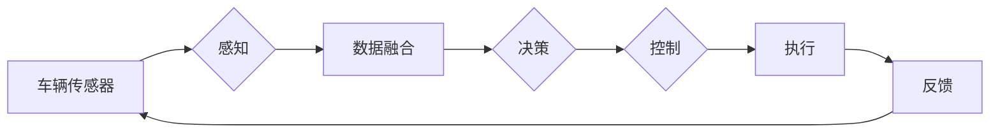

# 特斯拉FSD不同版本的进化

> 关键词：特斯拉、FSD、自动驾驶、软件更新、功能演进、技术进步、人工智能

## 1. 背景介绍

特斯拉（Tesla）的Full Self-Driving（FSD）系统，简称FSD，是特斯拉自动驾驶技术的核心。自2014年首次推出以来，FSD经历了多个版本的迭代升级，从最初的Beta测试版本到如今的完整版，每一次更新都标志着特斯拉在自动驾驶领域的重大突破。本文将深入探讨特斯拉FSD不同版本的进化历程，分析其技术进步和功能演进，以及未来发展趋势与挑战。

## 2. 核心概念与联系

### 2.1 核心概念

- **自动驾驶（Autonomous Driving）**：指汽车在没有任何人类干预的情况下，能够完成驾驶的全部或部分任务，包括加速、转向、制动和导航。
- **FSD（Full Self-Driving）**：特斯拉的自动驾驶系统，旨在实现完全自动驾驶，让车辆在没有人类司机的情况下自主行驶。
- **软件更新（Software Update）**：特斯拉通过无线软件更新（Over-the-Air Update）的方式，为车辆推送新的系统功能、改进和优化。
- **AI（Artificial Intelligence）**：人工智能技术，包括机器学习、深度学习等，用于提升车辆的感知、决策和执行能力。

### 2.2 架构流程图



在此流程图中，车辆传感器收集环境信息，经过数据融合形成感知结果；决策模块根据感知数据做出驾驶决策；控制模块根据决策结果控制车辆执行；反馈模块将执行结果反馈给感知模块，形成一个闭环控制系统。

## 3. 核心算法原理 & 具体操作步骤

### 3.1 算法原理概述

特斯拉FSD系统的核心算法原理主要包括以下几个方面：

- **感知算法**：利用车辆传感器（摄像头、雷达、超声波传感器等）收集环境信息，通过图像识别、目标检测等技术，实现对周围环境和交通状况的感知。
- **决策算法**：根据感知数据，结合地图信息和车辆自身状态，进行路径规划、速度控制等决策。
- **控制算法**：根据决策结果，控制车辆执行相应的动作，如加速、转向、制动等。
- **学习算法**：利用机器学习、深度学习等技术，不断优化感知、决策和控制算法，提升系统的智能化水平。

### 3.2 算法步骤详解

1. **感知**：车辆传感器收集环境信息，包括道路线、车辆、行人、交通标志等。
2. **数据融合**：将不同传感器收集的数据进行融合，形成统一的感知结果。
3. **决策**：根据感知结果和地图信息，规划行驶路径，确定车辆速度和行驶方向。
4. **控制**：根据决策结果，控制车辆执行相应的动作，如加速、转向、制动等。
5. **学习**：利用收集到的数据，不断优化感知、决策和控制算法。

### 3.3 算法优缺点

#### 优点

- **安全性高**：特斯拉FSD系统采用了多种安全冗余机制，确保车辆在各种情况下都能安全行驶。
- **智能化程度高**：利用AI技术，FSD系统能够自主学习，不断优化驾驶性能。
- **用户体验良好**：FSD系统可以为用户提供流畅、舒适的驾驶体验。

#### 缺点

- **技术尚不完善**：自动驾驶技术仍处于发展阶段，FSD系统在某些复杂场景下可能存在局限性。
- **法规限制**：自动驾驶技术受到法律法规的严格限制，FSD系统的推广和应用受到一定程度的限制。

### 3.4 算法应用领域

特斯拉FSD系统主要应用于以下领域：

- **自动驾驶汽车**：FSD系统是特斯拉自动驾驶汽车的核心技术。
- **自动驾驶出租车**：FSD系统可以为自动驾驶出租车提供技术支持。
- **自动驾驶卡车**：FSD系统可以为自动驾驶卡车提供技术支持。

## 4. 数学模型和公式 & 详细讲解 & 举例说明

### 4.1 数学模型构建

特斯拉FSD系统的数学模型主要包括以下几个方面：

- **感知模型**：使用卷积神经网络（CNN）对图像进行特征提取，实现目标检测和识别。
- **决策模型**：使用循环神经网络（RNN）或长短期记忆网络（LSTM）对时间序列数据进行处理，实现路径规划和速度控制。
- **控制模型**：使用PID控制器或强化学习算法，实现车辆的加速、转向、制动等控制。

### 4.2 公式推导过程

由于篇幅限制，本文不进行详细的数学公式推导。以下列举一些关键公式：

- **目标检测**：使用卷积神经网络对图像进行特征提取，公式如下：

  $$
  h = f_{CNN}(I)
  $$

  其中，$I$ 为输入图像，$f_{CNN}$ 为卷积神经网络。

- **路径规划**：使用RNN或LSTM对时间序列数据进行处理，公式如下：

  $$
  s_t = f_{RNN}(s_{t-1}, x_t)
  $$

  其中，$s_t$ 为第 $t$ 个时间步的决策状态，$x_t$ 为第 $t$ 个时间步的输入数据，$f_{RNN}$ 为循环神经网络。

- **速度控制**：使用PID控制器进行速度控制，公式如下：

  $$
  u = K_p(e) + K_i\sum_{t=0}^{t-1}e_t + K_d\frac{de}{dt}
  $$

  其中，$u$ 为控制输入，$e$ 为误差，$K_p$、$K_i$、$K_d$ 为PID控制器参数。

### 4.3 案例分析与讲解

以特斯拉FSD系统中的目标检测为例，介绍其工作原理和实现方法。

1. **数据收集**：收集大量的道路图像，包括不同天气、时间、交通状况下的图像。
2. **数据预处理**：对图像进行预处理，如裁剪、缩放、归一化等。
3. **模型训练**：使用CNN模型对预处理后的图像进行训练，实现目标检测和识别。
4. **模型评估**：使用测试集评估模型性能，包括准确率、召回率等指标。
5. **模型部署**：将训练好的模型部署到车辆中，用于实际应用。

## 5. 项目实践：代码实例和详细解释说明

### 5.1 开发环境搭建

1. **硬件环境**：一台高性能计算机，用于模型训练和测试。
2. **软件环境**：Python、TensorFlow或PyTorch等深度学习框架，OpenCV等图像处理库。

### 5.2 源代码详细实现

以下是一个简单的目标检测模型实现示例，使用PyTorch框架：

```python
import torch
import torch.nn as nn
import torch.optim as optim
from torchvision import datasets, transforms
from torch.utils.data import DataLoader

# 定义CNN模型
class CNN(nn.Module):
    def __init__(self):
        super(CNN, self).__init__()
        self.conv1 = nn.Conv2d(3, 32, kernel_size=3, stride=1, padding=1)
        self.relu = nn.ReLU()
        self.maxpool = nn.MaxPool2d(kernel_size=2, stride=2)
        self.fc1 = nn.Linear(32 * 8 * 8, 10)

    def forward(self, x):
        x = self.relu(self.conv1(x))
        x = self.maxpool(x)
        x = x.view(-1, 32 * 8 * 8)
        x = self.fc1(x)
        return x

# 训练模型
def train(model, dataloader, criterion, optimizer):
    for data in dataloader:
        inputs, labels = data
        outputs = model(inputs)
        loss = criterion(outputs, labels)
        optimizer.zero_grad()
        loss.backward()
        optimizer.step()

# 主函数
if __name__ == '__main__':
    # 数据集加载
    transform = transforms.Compose([transforms.Resize((64, 64), interpolation=Image.BILINEAR),
                                  transforms.ToTensor()])
    dataset = datasets.CIFAR10(root='./data', train=True, download=True, transform=transform)
    dataloader = DataLoader(dataset, batch_size=64, shuffle=True)

    # 模型定义
    model = CNN()

    # 损失函数和优化器
    criterion = nn.CrossEntropyLoss()
    optimizer = optim.Adam(model.parameters(), lr=0.001)

    # 训练模型
    train(model, dataloader, criterion, optimizer)
```

### 5.3 代码解读与分析

以上代码实现了一个小型的目标检测模型，使用PyTorch框架进行训练。代码主要包括以下部分：

- **CNN模型**：定义了一个简单的卷积神经网络模型，用于提取图像特征。
- **训练函数**：定义了模型训练的函数，包括数据加载、损失函数计算、反向传播和优化器更新。
- **主函数**：定义了主函数，用于加载数据集、定义模型、设置损失函数和优化器，并启动模型训练。

### 5.4 运行结果展示

训练完成后，可以使用测试集评估模型性能。以下是一个简单的测试代码示例：

```python
# 测试模型
def test(model, dataloader, criterion):
    correct = 0
    total = 0
    with torch.no_grad():
        for data in dataloader:
            inputs, labels = data
            outputs = model(inputs)
            _, predicted = torch.max(outputs.data, 1)
            total += labels.size(0)
            correct += (predicted == labels).sum().item()
    print('Accuracy of the network on the 10000 test images: %d %%' % (100 * correct / total))

# 测试集加载
transform = transforms.Compose([transforms.Resize((64, 64), interpolation=Image.BILINEAR),
                                  transforms.ToTensor()])
dataset = datasets.CIFAR10(root='./data', train=False, download=True, transform=transform)
dataloader = DataLoader(dataset, batch_size=64, shuffle=False)

# 测试模型
test(model, dataloader, criterion)
```

运行测试代码后，会输出模型在测试集上的准确率。

## 6. 实际应用场景

特斯拉FSD系统已在多个实际应用场景中得到应用，以下列举一些典型的应用场景：

- **高速公路自动驾驶**：FSD系统可以在高速公路上实现自动驾驶，包括车道保持、自适应巡航、自动变道等功能。
- **城市道路自动驾驶**：FSD系统可以在城市道路上实现自动驾驶，包括红绿灯识别、行人检测、车道线识别等功能。
- **泊车辅助**：FSD系统可以辅助用户完成泊车操作，包括自动泊车、水平泊车、垂直泊车等功能。

## 7. 工具和资源推荐

### 7.1 学习资源推荐

- **《深度学习》**：Goodfellow等人著，介绍了深度学习的基本概念和常用算法。
- **《深度学习入门》**：邱锡鹏著，适合初学者了解深度学习的基础知识。
- **特斯拉官网**：提供FSD系统的最新信息和技术文档。

### 7.2 开发工具推荐

- **PyTorch**：开源的深度学习框架，适合进行自动驾驶相关的研究和开发。
- **TensorFlow**：Google推出的深度学习框架，功能强大，适合进行复杂模型的训练和部署。

### 7.3 相关论文推荐

- **"End-to-End Drive**: Training an Autonomous Driving System from Scratch"**：介绍了特斯拉自动驾驶系统的整体架构和训练方法。
- **"Learning to Drive by Playing a Video Game"**：介绍了特斯拉利用游戏数据进行自动驾驶系统训练的方法。

## 8. 总结：未来发展趋势与挑战

### 8.1 研究成果总结

特斯拉FSD系统自推出以来，经历了多个版本的迭代升级，从最初的Beta测试版本到如今的完整版，其技术水平和功能都得到了显著提升。通过不断收集数据、优化算法，特斯拉FSD系统在自动驾驶领域取得了重要突破，为自动驾驶技术的发展提供了宝贵的经验和启示。

### 8.2 未来发展趋势

未来，特斯拉FSD系统将朝着以下方向发展：

- **更强大的感知能力**：通过融合多种传感器信息，提高感知系统的鲁棒性和准确性。
- **更智能的决策能力**：利用深度学习技术，提高决策系统的智能水平，实现更复杂的驾驶场景。
- **更安全的执行能力**：通过优化控制算法，提高车辆的行驶安全性。
- **更广泛的应用场景**：将自动驾驶技术应用到更多场景，如城市交通、物流运输等。

### 8.3 面临的挑战

特斯拉FSD系统在发展过程中也面临着以下挑战：

- **技术挑战**：自动驾驶技术尚处于发展阶段，技术难度大，需要不断进行技术创新和突破。
- **法规挑战**：自动驾驶技术受到法律法规的严格限制，需要与政府、行业协会等各方进行协调和沟通。
- **伦理挑战**：自动驾驶技术涉及到伦理道德问题，需要制定相应的伦理规范和标准。

### 8.4 研究展望

未来，特斯拉FSD系统将在以下几个方面进行深入研究：

- **多传感器融合**：融合多种传感器信息，提高感知系统的鲁棒性和准确性。
- **强化学习**：利用强化学习技术，提高决策系统的智能水平。
- **多智能体系统**：研究多智能体系统在自动驾驶中的应用，实现多车辆协同行驶。
- **人机交互**：研究人机交互技术，提高自动驾驶系统的用户体验。

特斯拉FSD系统的进化历程，展示了自动驾驶技术的快速发展。相信随着技术的不断进步和应用的不断拓展，自动驾驶技术将逐步走进我们的生活，为人类创造更加便捷、安全、高效的出行方式。

## 9. 附录：常见问题与解答

**Q1：特斯拉FSD系统是否完全安全可靠？**

A：特斯拉FSD系统在技术方面已经取得了显著的进展，但作为一项新兴技术，仍存在一定的安全风险。特斯拉也在不断优化和完善系统，以提高其安全性和可靠性。

**Q2：自动驾驶技术是否能够完全取代人类司机？**

A：目前，自动驾驶技术仍处于发展阶段，无法完全取代人类司机。在未来，随着技术的不断进步，自动驾驶汽车有望在特定场景下实现完全自动驾驶。

**Q3：特斯拉FSD系统的价格是多少？**

A：特斯拉FSD系统的价格因地区、车型等因素而有所不同。请访问特斯拉官网获取最新价格信息。

**Q4：如何获取特斯拉FSD系统？**

A：特斯拉FSD系统可以通过在线升级的方式获取。具体升级步骤请参考特斯拉官网提供的说明。

**Q5：自动驾驶技术对社会有什么影响？**

A：自动驾驶技术将对社会产生深远的影响，包括减少交通事故、提高交通效率、降低能源消耗等。

作者：禅与计算机程序设计艺术 / Zen and the Art of Computer Programming